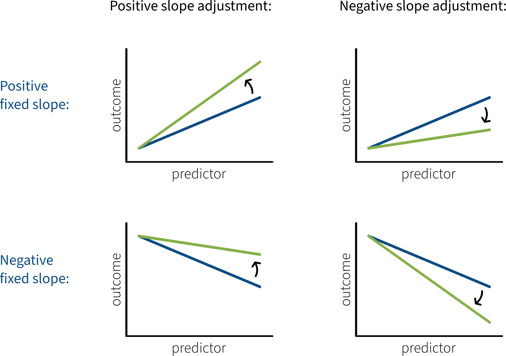

```{r setup, include=FALSE}
source('../assets/setup.R')
```

If you fit a linear mixed model that adjusts both the fixed intercept and at least one fixed slope for a given grouping variable (e.g., `(1 + predictor | groupvar)`), then the model will also estimate how those intercept and slope adjustments are correlated with one another.

Broadly speaking, there are three ways that a grouping variable's intercept adjustments and slope adjustments might be correlated with one another: (1) positively, (2) negatively, or (3) zero correlation.

<br>

{fig-align="center"}

This flash card contains general guidelines about how to work out what each of these kinds of correlations means in the context of your analysis.
If you're able to do this kind of reasoning, it shows that you have good understanding of how LMMs work.


## Start with fixed effects and their adjustments

Start with your interpretation of the fixed effects in the context of your study.
Then think about what it would mean for each effect to be adjusted positively (i.e., some amount added to the fixed estimate) and negatively (i.e., some amount subtracted from the fixed estimate).

### The intercept and its adjustments

In general, a model's intercept is the estimated average outcome when all predictors are equal to zero.

It's easier to think about intercept adjustments in the context of a particular study, so here are a couple examples.

#### Example 1

Imagine we're modelling people's log reaction times as a function of experimental condition, which varies within subjects (with conditions represented as either 0 or 1).
The fixed effects part of our model is `logRT ~ condition`.
Thus the intercept of this model represents the estimated mean log RT in condition 0.

**What would a positive intercept adjustment mean?**
If the model's intercept is adjusted positively (i.e., some amount is added to it), then that corresponds to larger-than-average log RTs in condition 0.

**What would a negative intercept adjustment mean?**
If the model's intercept is adjusted negatively (i.e., some amount is subtracted from it), then that corresponds to smaller-than-average log RTs in condition 0.

#### Example 2

Imagine we're modelling people's wellbeing as a function of how many hours they spend outdoors per week, measured for each week across a whole year.
The fixed effects part of our model is `wellbeing ~ outdoor_time`.
Thus the intercept of this model represents the estimated mean wellbeing score when zero hours are spent outdoors.

**What would a positive intercept adjustment mean?**
If the model's intercept is adjusted positively (i.e., some amount is added to it), then that corresponds to greater-than-average wellbeing scores when zero hours are spent outdoors.

**What would a negative intercept adjustment mean?**
If the model's intercept is adjusted negatively (i.e., some amount is subtracted from it), then that corresponds to lower-than-average wellbeing scores when zero hours are spent outdoors.


### The slope and its adjustments

In general, a fixed slope over some predictor tells you how much the outcome is estimated to change when the predictor's value increases from 0 to 1.
(If it's in a multiple regression model which contains other predictors, then this interpretation must include "holding all other predictors constant".
If this predictor is part of an interaction, then this interpretation must include "when the other interacting predictor is equal to zero".)

The concrete meaning of positive and negative slope adjustments depends on the direction of the fixed slope.
See the table below that illustrates this point.

Each plot in this table shows the predictor variable on the x axis and the outcome variable on the y axis.
The fixed slope is shown in blue, and the adjusted slope in green.

<br>



<br>

If the adjustment goes in the same direction as the fixed slope, then you end up with a stronger association in the same direction.

If the adjustment goes in the opposite direction as the fixed slope, then you end up with a weaker association (or, if the adjustment is larger than the fixed slope, an association in the opposite direction).

(If you're thinking "this feels the same as interpreting an interaction as an adjustment to a slope", then you're exactly right!
The same logic applies to both scenarios.)

#### Example 1

The fixed effects part of the Example 1 model is `logRT ~ condition`.
Imagine that the model estimates a negative fixed slope over `condition`.
This would mean that `logRT` is larger in condition 0 and smaller in condition 1.

**What would a positive adjustment to the slope over `condition` mean?**
If the negative fixed slope over `condition` is adjusted positively (i.e., some amount is added to it), then the difference between conditions becomes smaller than average / the association with `logRT` becomes weaker and closer to zero than average.

**What would a negative adjustment to the slope over `condition` mean?**
If the negative fixed slope over `condition` is adjusted negatively (i.e., some amount is subtracted from it), then the difference between conditions becomes larger than average / the association with `logRT` becomes stronger and more negative than average.


#### Example 2

The fixed effects part of the Example 2 model is `wellbeing ~ outdoor_time`.
Imagine that the model estimates a positive fixed slope over `outdoor_time`.
This would mean that spending more hours outdoors is associated with greater `wellbeing` scores.

**What would a positive adjustment to the slope over `outdoor_time` mean?**
If the positive fixed slope over `outdoor_time` is adjusted positively (i.e., some amount is added to it), then the association with `wellbeing` becomes stronger and more positive than average.

**What would a negative adjustment to the slope over `outdoor_time` mean?**
If the positive fixed slope over `outdoor_time` is adjusted negatively (i.e., some amount is subtracted from it), then the association with `wellbeing` becomes weaker and closer to zero than average.


## Now think about the direction of your correlation

<br>

{fig-align="center"}

### (1) Positive correlation

If your LMM estimated a positive correlation between intercept and slope adjustments, then:

- somebody with a **positive** intercept adjustment tends to also have a **positive** slope adjustment, and
- somebody with a **negative** intercept adjustment tends to also have a **negative** slope adjustment.

Use your reasoning from the previous steps to work out concretely what this means in the context of your analysis.


#### Example 1

The maximal model for Example 1 would be`logRT ~ condition + (1 + condition | subject)`.
The fixed slope over `condition` is negative.

If the model estimated a positive correlation between each subject's intercept and slope adjustments, then:

- somebody with larger-than-average log RTs in condition 0 (= the **positive** intercept adjustment) tends to have a smaller-than-average difference between the two conditions (= the **positive** slope adjustment to a negative fixed slope).

- somebody with smaller-than-average log RTs in condition 0 (= the **negative** intercept adjustment) tends to have a larger-than-average difference between the two conditions (= the **negative** slope adjustment to a negative fixed slope).


#### Example 2

The maximal model for Example 2 would be `wellbeing ~ outdoor_time + (1 + outdoor_time | participant)`.
The fixed slope over `outdoor_time` is positive.

If the model estimated a positive correlation between each subject's intercept and slope adjustments, then:

- somebody estimated to have higher-than-average wellbeing after spending zero hours outdoors (= the **positive** intercept adjustment) tends to have a stronger-than-average association between outdoor time and wellbeing (= the **positive** slope adjustment to a positive fixed slope).

- somebody estimated to have lower-than-average wellbeing after spending zero hours outdoors (= the **negative** intercept adjustment) tends to have a weaker-than-average association between outdoor time and wellbeing (= the **negative** slope adjustment to a positive fixed slope).


### (2) Negative correlation

If your LMM estimated a positive correlation between intercept and slope adjustments, then:

- somebody with a **positive** intercept adjustment tends to have a **negative** slope adjustment, and
- somebody with a **negative** intercept adjustment tends to have a **positive** slope adjustment.

Use your reasoning from the previous steps to work out concretely what this means in the context of your analysis.


#### Example 1

The maximal model for Example 1 would be`logRT ~ condition + (1 + condition | subject)`.
The fixed slope over `condition` is negative.

If the model estimated a negative correlation between each subject's intercept and slope adjustments, then:

- somebody with larger-than-average log RTs in condition 0 (= the **positive** intercept adjustment) tends to have a larger-than-average difference between the two conditions (= the **negative** slope adjustment to a negative fixed slope).

- somebody with smaller-than-average log RTs in condition 0 (= the **negative** intercept adjustment) tends to have a smaller-than-average difference between the two conditions (= the **positive** slope adjustment to a negative fixed slope).


#### Example 2

The maximal model for Example 2 would be `wellbeing ~ outdoor_time + (1 + outdoor_time | participant)`.
The fixed slope over `outdoor_time` is positive.

If the model estimated a negative correlation between each subject's intercept and slope adjustments, then:

- somebody estimated to have higher-than-average wellbeing after spending zero hours outdoors (= the **positive** intercept adjustment) tends to have a weaker-than-average association between outdoor time and wellbeing (= the **negative** slope adjustment to a positive fixed slope).

- somebody estimated to have lower-than-average wellbeing after spending zero hours outdoors (= the **negative** intercept adjustment) tends to have a stronger-than-average association between outdoor time and wellbeing (= the **positive** slope adjustment to a positive fixed slope).


### (3) No correlation

If your LMM estimated no correlation between intercept and slope adjustments, then there's no systematic association between how intercepts are adjusted and how slopes are adjusted.
Knowing something about somebody's intercept adjustment tells you nothing about their slope adjustment.
This is also a result that you can report!