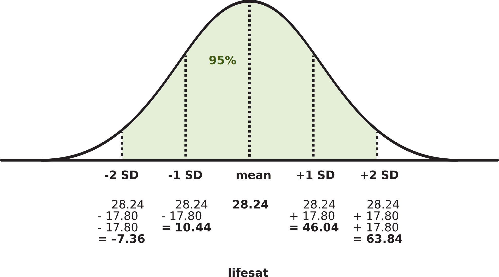
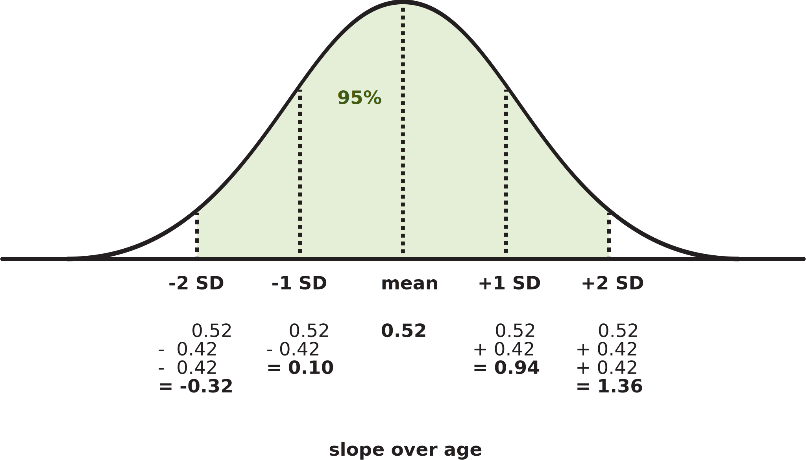

```{r setup, include=FALSE}
source('../assets/setup.R')
library(tidyverse)
library(lme4)
# options(digits=7)
```

When we fit an LMM and look at its estimates using `summary()`, what do the numbers mean?

## Example: Life satisfaction in Scotland

These data come from 112 people across 12 different Scottish dwellings (cities and towns). Information is captured on their ages and a measure of life satisfaction. The researchers are interested in **if there is an association between age and life-satisfaction**. 

Data are available at [https://uoepsy.github.io/data/lmm_lifesatscot.csv](https://uoepsy.github.io/data/lmm_lifesatscot.csv){target="_blank"}.

```{r}
#| echo: false
df <- read_csv("https://uoepsy.github.io/data/lmm_lifesatscot.csv")
tibble(
  variable = names(df),
  description = c("Age (years)","Life Satisfaction score","Dwelling (town/city in Scotland)","Size of Dwelling (> or <100k people)")
) |> gt::gt()
```

```{r}
lifesatscot <- read_csv("https://uoepsy.github.io/data/lmm_lifesatscot.csv")
```

## Fit the model

Our model is the following (to see how we figured out this random effect structure, see [Identify possible random effects](identify-ranef.html)).

```{r}
lifesat_mod <- lmer(
  lifesat ~ age + (1 + age | dwelling),
  data = lifesatscot
)
```


Here's the model summary:

```{r}
summary(lifesat_mod)
```

:::{.callout-caution collapse='true'}
### "Model failed to converge"?

At the very bottom of this model summary, there's a bit that says

```
Model failed to converge with max|grad| = 0.0417437 (tol = 0.002, component 1)
  See ?lme4::convergence and ?lme4::troubleshooting.
```

For now, so that this flash card focuses on interpretation, we'll be a bit naughty and just pretend that that isn't there.

But this is a real problem for our model.
**If you saw this in a real life data analysis scenario, you'd have to deal with it.**
We'll see how to do that later (see [Troubleshoot](troubleshoot.html)).
:::

:::{.callout-caution collapse='true'}
### Where are the p-values?

For reasons that are technical and not important for this course, LMMs do not automatically estimate p-values for each coefficient the way that basic LMs do.

We'll see how to add on p-values to the model summary in [Get p-values for LMMs](pvals.html).

:::

## The fixed effects

**All the tools for interpreting intercepts and slopes that you learned in DAPR2 are exactly the same for LMMs.
The only new thing is that now, predictors' coefficients are also called "fixed effects".**

:::{.callout-note collapse='true'}
### General guide to interpreting any model's fixed effects (DAPR2 recap)

**For single regression models (e.g., `Y ~ A`) or multiple regression models (e.g., `Y ~ A + B`):**

- `(Intercept)`:
  - The estimated mean outcome when all predictors are equal to zero.
- `A`:
  - The estimated mean change in `Y` when `A` changes from 0 to 1, holding any/all other predictors constant.
- `B`:
  - The estimated mean change in `Y` when `B` changes from 0 to 1, holding any/all other predictors constant.

**For interaction models (e.g., `Y ~ A * B`):**

- `(Intercept)`:
  - The estimated mean outcome when all predictors are equal to zero.
- `A`:
  - The estimated mean change in `Y` when `A` changes from 0 to 1, specifically when `B` = 0.
- `B`:
  - The estimated mean change in `Y` when `B` changes from 0 to 1, specifically when `A` = 0.
- `A:B`:
  - The estimated adjustment to the association between `Y` and `A` when `B` changes from 0 to 1.
  - Or equivalently, the estimated adjustment to the association between `Y` and `B` when `A` changes from 0 to 1.

:::

Fixed effects represent the average relationship between predictor(s) and outcome, averaging over all groups (here, over all dwellings).

To show only the model's fixed effect estimates, we can use `fixef()`:

```{r}
fixef(lifesat_mod)
```


- `(Intercept)`: The estimated mean life satisfaction for people aged zero is 28.24 points.
- `age`: When age increases by one year, then on average, life satisfaction is estimated to increase by 0.52 points.


## The random effects

Access the random effect part of the model summary using `VarCorr()`.
Sometimes you'll hear this part of the model summary called the "variance components".

Try to read this output as a table with the headings "Group", "Name", "Std.Dev.", and "Corr".

```{r}
VarCorr(lifesat_mod)
```

First we'll go through how to read each row of this table, then we'll talk about how you would describe what these numbers actually mean.

### Reading the table

- **First row:** 
  - The model has estimated adjustments for each `dwelling` to the fixed `(Intercept)`. 
    Internally, the model stores all those adjustments in a single variable. 
    Imagine that variable is called `dwelling_int_adjustments`.
    Summarising all those adjustments with `sd(dwelling_int_adjustments)` tells us that their standard deviation is 17.80.
    - In short: **the standard deviation of the by-dwelling intercept adjustments is 17.80 points.**

- **Second row:**
  - The model has estimated adjustments for each `dwelling` to the fixed slope over `age`.
    Internally, the model stores all those adjustments in a single variable. 
    Imagine that variable is called `dwelling_age_adjustments`.
    Summarising all those adjustments with `sd(dwelling_age_adjustments)` tells us that their standard deviation is 0.42.
    - In short: **the standard deviation of the by-dwelling adjustments to the slope over `age` is 0.42 points.**
  - The model also computes the [correlation](ranef-correl.html) between `dwelling_int_adjustments` and `dwelling_age_adjustments`.
    - **The by-dwelling adjustments to the intercept and to the slope over `age` have a correlation of –0.87.**

- **Third row:**
  - The observed data points don't all lie precisely on the lines that the model estimates for each group.
    The distance between a data point and its group line is called its "residual".
  - The model stores how far away each data point is from its group line in a single variable—let's call it `residual`.
    Summarising all those distances with `sd(residual)` tells us that **the standard deviation of the residuals is 7.97.**


### Interpreting the numbers: SDs

These standard deviations don't tell us very much on their own.
To interpret them, we should relate them to the estimates for the fixed effects.


#### Intercept

The estimated mean life satisfaction for people aged zero, aggregating over all the different dwellings, is 28.24 points.
But each dwelling also has its own line associating `age` with `lifesat`.
And the intercepts of those lines vary a certain amount around this fixed intercept.

Specifically, we know that the variation is assumed to follow a normal distribution (see [LMM assumptions](assump.html)), and the standard deviation of that normal distribution is 17.80.
The following schematic shows the model's estimated distribution of intercept adjustments by `dwelling`, with a mean of 28.24 (the fixed estimate) and a standard deviation of 17.80.



To interpret these numbers, notice first that the standard deviation of the random intercepts is pretty big, relative to the fixed effect estimate.
In fact, drawing on what we know about how approximately 95% of the probability density of a normal distribution is between –2 SD below the mean and +2 SD above the mean, we can say that **about 95% of the dwelling-level intercepts (that is, the estimated life satisfaction at age zero) are estimated to fall between –7.36 points and 63.84 points.**
This is a massive spread, and **it indicates a lot of estimated variability between dwellings.**


:::{.callout-caution collapse='true'}
### But `lifesat` can't be negative...

True!

We are modelling `lifesat` using a regular (non-generalised) linear model.
These models assume that the outcome variable is continuous numeric, or in other words, that it can take on any possible value between negative infinity and positive infinity.

We as sensible humans know that `lifesat` can only be positive, but the model doesn't know that.
So it generates predictions in which `lifesat` receives impossible negative values.

When we use regular linear models for bounded numeric outcome variables (which we do in DAPR for the sake of simplicity), then odd predictions like these are something we just have to live with.

Beyond the scope of DAPR, you'll find families of generalised linear model that are specifically designed to model positive-only values (for example, gamma regression), or bounded values between 0 and 1 or between 0 and 100 (for example, beta regression).

:::

#### Slope over `age`

The estimated mean change in life satisfaction when `age` increases from zero to one is 0.52 points.
Again, this is the fixed effect which aggregates over all dwellings.
Each dwelling has its own line associating `age` with `lifesat`, and each line has a slope that's been adjusted a bit from the value of 0.52.
The standard deviation of those adjustments is 0.42: **a big value compared to the fixed slope!**

This means that **95% of the slopes for the lines per `dwelling` are estimated to be between $0.52 - (2 \times 0.42)$ and $0.52 + (2 \times 0.42)$, specifically between –0.32 and 1.36.**



So even though the fixed effect of `age` is positive, **the model predicts that some dwellings will actually have *negative* associations between `age` and `lifesat`!**


### Interpreting the numbers: Correlation

The correlation between each dwelling's intercept adjustment and slope adjustment is estimated to be –0.87.
This large native correlation means that:

- When a dwelling has a **large** intercept (that is, a large estimated average `lifesat` value for people aged zero), its slope tends to be **small** (that is, a more gradual line, a weaker effect).
- Or equivalently, when a dwelling has a **small** intercept (that is, a small estimated average `lifesat` value for people aged zero), its slope tends to be **large** (that is, a steeper line, a stronger effect).


## Linked flash cards

### Outgoing links

- TODO


### Backlinks

- TODO
