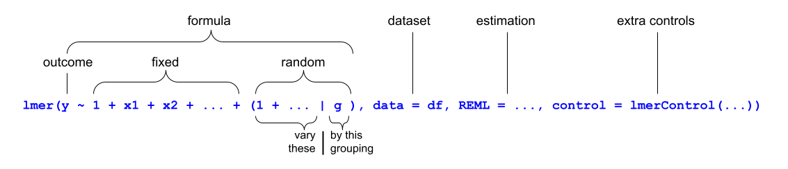

```{r setup, include=FALSE}
source('../assets/setup.R')
```

Random effects are

- the thing that turns a simple linear model (LM) into a linear mixed model (LMM), or a generalised linear model (GLM) into a generalised linear mixed model (GLMM).
- a way the model adjusts the average [fixed effect](fixef.html) parameters to model different relationships within each level of the [grouping variable(s)](groupstruc.html).
- an umbrella term that covers both [random intercepts](rdint.html) and [random slopes](rdslp.html).
  - Random intercepts are adjustments to the fixed intercept for each level of the grouping variable.
  - Random slopes are adjustments to the fixed slope for each level of the grouping variable.


In the example `lmer()` structure below, the random effects appear in the `+ (1 + ... | g)` bit:

{fig-align="center"}


::: {.callout-caution collapse="true"}
## TODO Shrinkage

lorem ipsum

:::


::: {.callout-caution collapse="true"}
## TODO Pooling

lorem ipsum

:::


## Linked flash cards

### Outgoing links

- TODO


### Backlinks

- TODO
