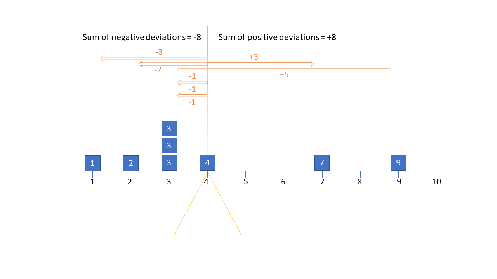
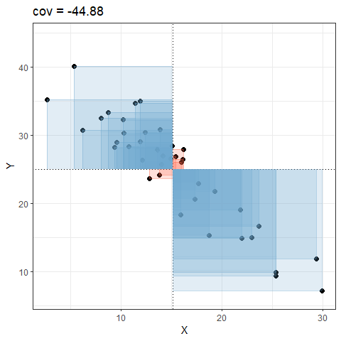
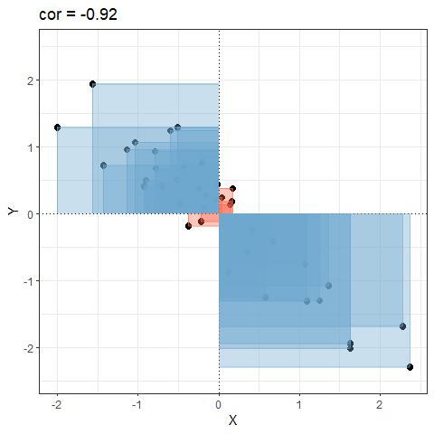

  
```{r setup, include=FALSE}
source('../assets/setup.R')
library(tidyverse)
library(psych)
library(patchwork)
```


## Means, Variances and Standard Deviations

The mean is a measure of central tendency for a distribution. To get the mean, we add up all the numbers and divide by how many numbers we have.  

It is one way to get "typical" value for a set of numbers, and is the most commonly what we are meaning when we use the word "average".  
One way of thinking of the mean is as the balancing point on a see-saw. It's the value that balances out the all the deviations to the observed values. In @fig-seesaw, the mean is 4 - the point at which all positive deviations sum to the same as all the negative deviations. 

```{r}
#| echo: false
#| label: fig-seesaw
#| fig-cap: "The mean is the point that balances the weight of the data. This means that it is sensitive to outliers. The one datapoint at 9 (+5 deviation) carries the same weight as two observations at 1 (-3 deviation) and 2 (-2 deviation) combined!"

```

If the mean is trying to get the middle of the see-saw, **variance** is a way of capturing its width. It takes all the deviations, squares them (because we don't care about the direction), and then divides by the number of deviations (minus 1, because math!^[technically it's because for the $n$ deviations we have, we actually only have $n-1$ bits of information, because the deviations (by definition) must all sum to zero. Which means once you tell me any $n-1$ of the deviations, I can work out the last one]). So variance gives us the typical squared distance from an observation to the mean.  

Because no one really works in squared units, we often prefer to use the **standard deviation**, which simply takes the square root of the variance. In that way, it provides an estimate of the typical distance (in the original measured units, not squared) from an observation to the mean. 

Ultimately, variance and standard deviation capture the scale of a distribution (how spread out it it is), whereas the mean captures its location (where the centre is). 

```{r}
#| echo: false
tibble(
  x = seq(0, 200, 1),
  y = dnorm(x, 100, 15),
  y2 = dnorm(x,150, 15),
  y3 = dnorm(x,50,15)
) %>%
  ggplot(.,aes(x=x))+
  geom_ribbon(aes(ymin=0, ymax=y, fill="Mean = 100"), alpha=0.2)+
  geom_ribbon(aes(ymin=0, ymax=y2, fill="Mean = 150"), alpha=0.2)+
  geom_ribbon(aes(ymin=0, ymax=y3, fill="Mean = 50"), alpha=0.2)+
  theme_classic()+
  scale_y_continuous(NULL, breaks=NULL,)+
  theme(axis.line.y = element_blank(), axis.text.x = element_blank(), 
        axis.title.x = element_blank(), legend.position="bottom")+
  guides(fill=FALSE)+
  labs(title="The mean defines the location of a distribution") -> plt_loc

tibble(
  x = seq(0, 200, 1),
  y = dnorm(x, 100,10),
  y2 = dnorm(x,100, 15),
  y3 = dnorm(x,100,5)
) %>%
  ggplot(.,aes(x=x))+
  geom_ribbon(aes(ymin=0, ymax=y, fill="Mean = 100"), alpha=0.3)+
  geom_ribbon(aes(ymin=0, ymax=y2, fill="Mean = 150"), alpha=0.3)+
  geom_ribbon(aes(ymin=0, ymax=y3, fill="Mean = 50"), alpha=0.3)+
  theme_classic()+
  scale_y_continuous(NULL, breaks=NULL,)+
  theme(axis.line.y = element_blank(), axis.text.x = element_blank(), 
        axis.title.x = element_blank(), legend.position="bottom")+
  guides(fill=FALSE)+
  xlim(50,150)+
  labs(title="variance/standard deviation define the scale of a distribution") -> plt_scale

plt_loc / plt_scale
```


# Covariance and Correlation

When we move from one variable to two, each variable has a mean and a variance, but we also want to describe how the two variables relate to one another (how they 'co-relate'):  
```{r}
#| echo: false
library(ggside)

pdist = 
  MASS::mvrnorm(n=1e6,mu=c(0,0),Sigma=Matrix::nearPD(matrix(c(40,10,10,70),nrow=2))$mat) |>
  as_tibble() 

ggplot(pdist,aes(x=V1,y=V2))+
  guides(col="none")+
  scale_x_continuous("X",limits=c(-20,20))+
  scale_y_continuous("Y",limits=c(-25,30))+
  geom_xsidedensity(data=pdist,fill="#88B04B", alpha=.4,col=NA)+
  geom_ysidedensity(data=pdist,fill="#88B04B", alpha=.4, col=NA)+
  annotate(geom="text",x = 0,y=0,label="?",col="#88B04B",size=15)+
  theme_ggside_void()
```


Do higher values on X co-occur with higher values on Y? or with lower values on Y? or does the value of X give us no information about the value of Y? **Covariance** captures just that idea - how do two variables vary together? 


- If values of X are generally **high** when values of Y are also **high**, then the two variables have **positive** covariance.
- If values of X are generally **low** when values of Y are **high**, then the two variables have **negative** covariance.
- If values of X are **don't pattern** with values of Y, then the two items have **near-zero** covariance.  

Covariance works by looking at the deviations from the means on both variables at the same time. In @fig-cov, if an observation is above the mean on both, it is in the top right quadrant. If it is below the mean on both, it is in the bottom left. If it is above the mean on one but below the mean on the other, then it will be in one of the other ones. 

Taking all of these together, calculating covariance is like calculating the average area of all the coloured squares (red = positive, blue = negative) shown in @fig-cov.  

```{r}
#| echo: false
#| label: fig-cov
#| fig-cap: "Covariance, animated."

```


One thing about covariance is that it is sensitive to the units of measurement. The covariance between height-in-centimeters and weight-in-grams will be a much bigger number than the covariance between height-in-meters and weight-in-kilograms.  

**Correlation** solves this issue, and you can think of correlation as a *standardised covariance*. It has a scale from negative one to one, on which the distance from zero indicates the strength of the relationship.
Just like covariance, positive/negative values reflect the nature of the relationship. Another way to think about correlation is that it is covariance but where we standardise both variables first, meaning that we have them on the same scale (mean of zero, standard deviation of one), as in @fig-cor.  

```{r}
#| echo: false
#| label: fig-cor
#| fig-cap: "Correlation, animated."

```

# covariance/correlation matrices

- Variance & Standard Deviation: How spread out a single variable is
- Covariance & Correlation: How the spread of two variables moves together

What about when we have lots and lots of variables, and we want to see how they all covary? This is where the **covariance/correlation matrix** comes in. It presents all the covariances or correlations between all the different pairs of variables.  

When we give functions like `cov()` and `cor()` a dataframe of numeric variables, it will return a square matrix. So if we are looking at a correlation matrix for 5 variables (x,y,z,w,v), then each entry would show:  

|   | x | y | z | w | v |
|---|---|---|---|---|---|
| x | cor(x,x) | cor(x,y) | cor(x,z) | cor(x,w) | cor(x,v) |
| y | cor(y,x) | cor(y,y) | cor(y,z) | cor(y,w) | cor(y,v) |
| z | cor(z,x) | cor(z,y) | cor(z,z) | cor(z,w) | cor(z,v) |
| w | cor(w,x) | cor(w,y) | cor(w,z) | cor(w,w) | cor(w,v) |
| v | cor(v,x) | cor(v,y) | cor(v,z) | cor(v,w) | cor(v,v) |

An actual example would look like: 

```{r}
#| echo: false
set.seed(35)
A = runif(5,0,1)
SS = A%*%t(A)
diag(SS) <- 1
MASS::mvrnorm(1e5,mu=c(0,0,0,0,0),Sigma=SS) |>
  as.data.frame() -> df
names(df) <- c("x","y","z","w","v")
df |> cor() |> round(2)
```

There are a couple things to notice here: 

1. the order doesn't matter - cor(x,y) and cor(y,x) are the same!  
2. the diagonals are the correlation of a variable with itself. This will be 1, because a variable is always perfectly correlated with itself. If we were looking at a covariance matrix, these would be the variance of each variable 

::: {.callout-caution collapse="true"}
#### Rabbit Hole: what about missing data?  

When we work with lots of variables, data might be missing in lots of different places.  

In the dataset below, only the last three rows have no missing NAs in them. And looking down the columns, every variable has at least one NA in it somewhere:  

```{r}
#| echo: false
somedata <- tibble(
  x = c(NA,6,3,9,2,7,3,3),
  y = c(8,NA,2,6,8,3,6,2),
  z = c(3,7,NA,3,6,6,2,4),
  w = c(4,7,3,NA,7,9,3,6),
  v = c(2,8,5,3,NA,3,5,6)
)
```

```{r}
#| echo: true
somedata
```

Because every variable contains an NA, the correlations in the correlation matrix created by `cor()` will not work:  
```{r}
cor(somedata)
```

An alternative is to specify that we want _only_ the complete observations (the rows where there is no missing data on any of the variables).  
This code will essentially calculate correlations on the last three rows of the dataset:  
```{r}
cor(somedata, use = "complete.obs")
```

Another alternative is to specify **pairwise** complete observations. What this means is that for each correlation in the matrix, it will use the complete observations for that pair of variables. For example, the correlation between variables `x` and `y` will be based on all rows except the rows 1 and 2. the correlation between `x` and `z` will be based on all except rows 1 and 3, and so on.  
What is important here is to be transparent about how many observations are being used to calculate each correlation. In the resulting matrix below, the correlation between variable `w` and `v` are based on more data than the others.  
```{r}
cor(somedata, use = "pairwise.complete.obs")
```
:::


