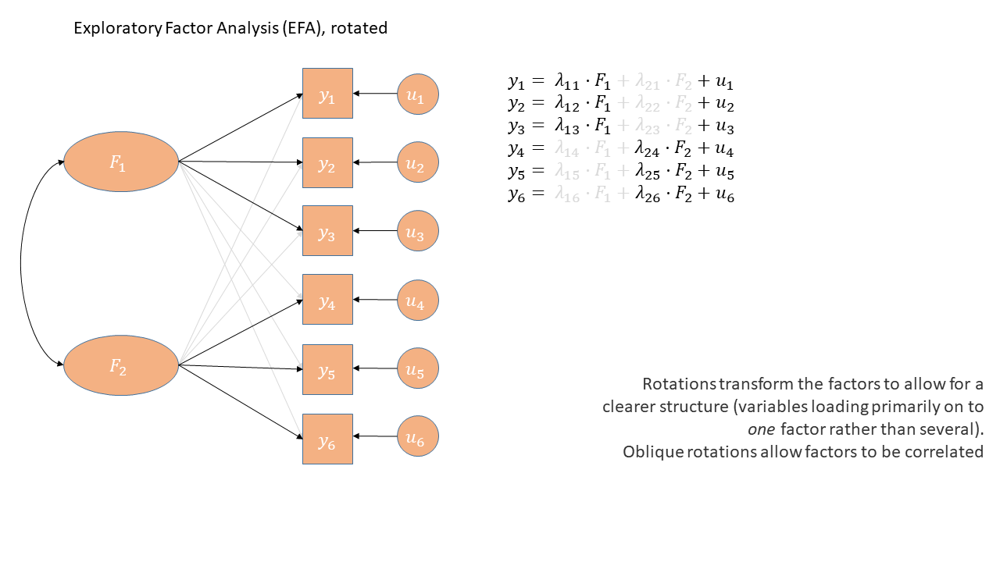

```{r setup, include=FALSE}
source('../assets/setup.R')
library(tidyverse)
library(psych)

library(psych)
set.seed(4)
R = matrix(c(1,.6,.8,
             .6,1,.8,
             .8,.8,1),nrow=3)
Sigma = diag(3)%*%R%*%diag(3)
Mean <- rep(0,3)
x <- MASS::mvrnorm(500, Mean, Sigma)
x <- apply(x,2,\(x) as.numeric(cut(x,9)))
mydata <- as.data.frame(x)

names(mydata) <- c("M","P","S")
ll = fa(mydata, nfactors=1,rotate="none")$loadings[,1]
uu = fa(mydata, nfactors=1,rotate="none")$uniqueness
cor(mydata) |> round(2)
round(ll %*% t(ll), 2)

```

# *Exploratory* Factor Analysis

The "Exploratory" in Exploratory Factor Analysis reflects that we are **not** wanting to test any specific hypothesis about the structure of the dimensions underlying our variables. Instead, we are interested in discovery of that structure.  

Consider extending our example of tiredness to a situation in which we ask people to rate agreement on 10 statements: 

1. I find it difficult to concentrate on mentally demanding tasks.
2. I feel mentally drained after cognitive work.
3. I am experiencing mental exhaustion or "brain fog."
4. It takes significant effort for me to think clearly.
5. My muscles feel tired even without physical activity.
6. I feel physically drained and lacking energy.
7. My limbs feel heavy or weak.
8. Simple physical tasks would require considerable effort.
9. I would likely fall asleep if sitting quietly right now.
10. I have a strong urge to lie down and rest. 

Initially you might be happy to think "these questions all ask about just one thing - being tired", but then you might also on reflection feel that some subset of the questions are slightly more similar to one another than to others (e.g., the first 4 seem like they are getting at something slightly different from the next 4, and final 2 seem possibly different again). Exploratory Factor Analysis can help us to understand if our set of 10 questions is "unidimensional", or whether there are actually two (or more) "subdimensions" to the questionnaire.  

TODO
to do so, we will be looking at models with different numbers of factors

This technique will help us better understand a) what exactly it **is** that we've measured, and b) how we can create composite score(s) (i.e. can we give everybody just 1 score, or do we really need a number of scores - one for each dimension?)  


## Model based thinking

It's worth noting that exploratory factor analysis is a model-based approach to dimension reduction. This differs subtly from something like PCA which is more like a calculation or 're-expression'.  

At a very broad level, most of statistical modelling is of the form:  

$$
\text{Outcome} = \text{Model} + \text{Error}
$$

Typically with methods we have looked at before such as `lm()` and `lmer()`, the "outcome" was a vector of everybody's values on an outcome variable, which we predict (or 'model') based on the values on a set of explanatory variables.  

What changes when we do factor analysis is that **our "outcome" is going to be a correlation matrix.**
This correlation matrix represents how the items that we've collected data for are correlated with one another.


The goal of an EFA model is to figure out what factors might underlie our data.
It maps each item we observe onto each of the factors that we tell the model to find.
The associations between each item and the factor are called "factor loadings".
**The "model" is going to be some function of our factor loadings, and the "error" is going to be the 'how far off is the model from the outcome?'**

Let's make this a bit more concrete.
In the tiredness example from above, we have ten observed variables, so our correlation matrix would be 10x10: ten rows by ten columns.
But to keep things reasonable, we'll look back at an example with just three observed variables ("Physical Fatigue", "Mental Fatigue" and "Sleepiness"), meaning that we have a 3x3 correlation matrix: 

```{r}
#| eval: false
#| echo: true
cor(mydata)
```
```{r}
#| eval: true
#| echo: false
round(cor(mydata),2)
```

In our example with the 3x3 correlation matrix, let's suppose we are going to model the associations between the observed variables using with just one factor.
Our three variables each have one loading onto the single factor, so our model is represented by three numbers: the loadings of each variable onto the factor.
We're using the symbol $\mathbf{\Lambda}$, which is a capital lambda, to denote those three numbers.

(If you've never encountered linear algebra before, don't worry about how exactly the following maths happens.
The equations are included for those who are interested—if you're not interested, that's OK.
The maths is not essential for you to know.)

We multiply those three numbers $\mathbf{\Lambda}$ by themselves in such a way that the outcome is a 3x3 matrix.^[In linear algebra terms, $\mathbf{\Lambda}$ is a column vector and $\mathbf{\Lambda'}$ is a row vector, and using matrix multiplication, their product $\mathbf{\Lambda}\mathbf{\Lambda'}$ is a 3x3 matrix.]
This matrix is *close* but not quite identical to our observed correlation matrix.
The difference between the model matrix and the correlation matrix is the uniqueness matrix, represented by $\mathbf{\Psi}$, a capital psi (pronounced like "sigh").
The uniqueness matrix contains the "error", the variance that's unique to each observed item (whether because the item is different in some way than the others, or because there's measurement error associated with that item, or both—examples of this coming up below).


$$
\begin{align}
\color{red}
\text{Outcome} &= \color{blue} \text{Model}\, +\, \color{magenta} \text{Error}  \\
\quad \\
\color{red} \text{Correlation Matrix} &= \color{blue} \text{Factor Loadings}^2 \,+\, \color{magenta} \text{Uniqueness} \\
\quad \\
\color{red} \mathbf{\Sigma} &= \color{blue} \mathbf{\Lambda}\mathbf{\Lambda'} \,+\, \color{magenta} \mathbf{\Psi}   \\
\quad \\
\color{red}
\begin{bmatrix}
   1 & 0.60 & 0.75 \\
0.60 &    1 & 0.77 \\
0.75 & 0.77 &    1 \\
\end{bmatrix} &= 
\color{blue}
\begin{bmatrix}
0.764 \\ 0.783  \\ 0.980 \\
\end{bmatrix}
\begin{bmatrix}
0.764 & 0.783 & 0.980  \\
\end{bmatrix} \,+\,
 \color{magenta} 
\begin{bmatrix}
0.42 & 0 & 0  \\
0 & 0.39 & 0 \\
0 & 0 & 0.04 \\
\end{bmatrix} \\
\quad \\
 &= 
  \color{blue} 
\begin{bmatrix}
0.58 & 0.260 & 0.75 \\
0.60 & 0.61 & 0.77 \\
0.75 & 0.77 & 0.96 \\
\end{bmatrix} \,+\,
  \color{magenta} 
\begin{bmatrix}
0.42 & 0 & 0  \\
0 & 0.39 & 0 \\
0 & 0 & 0.04 \\
\end{bmatrix} \\
\end{align}
$$


Our three variables are all self-reported questions that aim to get at the construct of fatigue. For agreement with a statement like "I often feel physically tired", people will vary in their responses due to 1) their level of general fatigue, 2) their physical tiredness that is separate from a general fatigue (e.g., they're just back from a run) and 3) measurement error (responses of "agree" and "strongly agree" are very inexact measurements here!)

Factor analysis is concerned with the first of these - the variance shared across multiple items. So a way to think of the factor model is as trying to separate out common variance from unique variance (which could be 'true' variability or just error):    

$$
\begin{equation}
var(\text{total}) = var(\text{common}) + var(\text{specific}) + var(\text{error})
\end{equation}
$$

 
| | | |
|-|-|-|
|common variance | variance shared across items | true and shared | 
|specific variance | variance specific to an item that is not shared with any other items | true and unique | 
| error variance | variance due to measurement error | not 'true', unique |


## Factor extraction methods   

In EFA, the process of identifying how our variables map onto some number of factors is called "factor extraction".
It's like how, in linear modelling, the process of identifying the values of the intercept and the slope is called "coefficient estimation".
In linear modelling, we also saw that there are a few different ways to estimate coefficients—for example, using different optimisers.
And similarly, in EFA, there are a few different ways to extract factors.

We're not going to delve too much into factor extraction methods here, beyond mentioning the top three choices below and when you might use them.
The main contenders are **Maximum Likelihood (ml)**, **Minimum Residuals (minres)** and **Principal Axis Factoring (paf)**.^[
PCA (using eigendecomposition) is itself a method of extracting different dimensions from our data.
But PCA isn't really factor analysis, because factor analysis focuses on *interpreting* the factors we extract.
]

**Maximum Likelihood** has the benefit of providing standard errors and fit indices that are useful for model testing, but the disadvantage is that it is sensitive to violations of normality, and can sometimes fail to converge, or produce solutions with impossible values such as factor loadings >1 (known as "Heywood cases"), or factor correlations >1.  

**Minimum Residuals (minres)** and **Principal Axis Factoring (paf)** will both work even when maximum likelihood fails to converge, and are slightly less susceptible to deviations from normality. They are a bit more sensitive to the extent to which the observed variables share variance with one another.  


You can find a lot of discussion about different methods both in the help documentation for the `fa()` function from the psych package, and there are lots of discussions both in papers and on [forums](https://stats.stackexchange.com/questions/50745/best-factor-extraction-methods-in-factor-analysis). This is a complicated issue, but when you have a large sample size, a large number of items, for which each has a similar amount of shared variance, then the extraction methods tend to agree. Don't fret too much about the factor extraction method.


## Rotations

```{r}
#| echo: false

tiredq <- read_csv("https://uoepsy.github.io/data/tiredq.csv")

mn = fa(tiredq, nfactors=2, rotate = "none", fm="ml")
mr = fa(tiredq, nfactors=2, rotate = "varimax", fm="ml")
mor = fa(tiredq, nfactors=2, rotate = "oblimin", fm="ml")

x_axis <- c(1, 0)
y_axis <- c(0, 1)
new_x_axis <- mr$rot.mat %*% x_axis
new_y_axis <- mr$rot.mat %*% y_axis
newo_x_axis <- (mor$rot.mat %*% mor$Phi) %*% x_axis
newo_y_axis <- (mor$rot.mat %*% mor$Phi) %*% y_axis
original_axes <- data.frame(
  x = c(0, x_axis[1], 0, y_axis[1]),
  y = c(0, x_axis[2], 0, y_axis[2]),
  axis = c("Original X", "Original X", "Original Y", "Original Y")
)
rotated_axes <- data.frame(
  x = c(0, new_x_axis[1], 0, new_y_axis[1]),
  y = c(0, new_x_axis[2], 0, new_y_axis[2]),
  axis = c("Rotated X", "Rotated X", "Rotated Y", "Rotated Y")
)
orotated_axes <- data.frame(
  x = c(0, newo_x_axis[1], 0, newo_y_axis[1]),
  y = c(0, newo_x_axis[2], 0, newo_y_axis[2]),
  axis = c("Rotated X", "Rotated X", "Rotated Y", "Rotated Y")
)

p1 <- mn$loadings[,1:2] |>
  as.data.frame() |>
  rownames_to_column() |>
  ggplot(aes(x=ML1,y=ML2))+
  geom_point()+
  geom_vline(xintercept=0,size=1)+
  geom_hline(yintercept=0,size=1)+
  geom_text(aes(label=rowname),hjust=-.2, size=3)+
  # geom_segment(aes(xend=0,yend=ML2),lty="dashed",
  #              alpha=.6)+
  # geom_segment(aes(yend=0,xend=ML1),lty="dashed",
  #              alpha=.6)+
  labs(x="Loadings on Factor 1",
       y="Loadings on Factor 2")+
  xlim(-1,1)+ylim(-1,1)+
  geom_segment(data = original_axes, aes(x = 0, y = 0, xend = x, yend = y, color = axis), 
               arrow = arrow(length = unit(0.2, "cm")), size = 1) +
  geom_segment(data = original_axes, aes(x = 0, y = 0, xend = -x, yend = -y, color = axis), 
               arrow = arrow(length = unit(0.2, "cm")), size = 1) +
  scale_colour_manual(values = c('#f8766d', '#7cae00'))
  
p2 <- mn$loadings[,1:2] |>
  as.data.frame() |>
  rownames_to_column() |>
  ggplot(aes(x=ML1,y=ML2))+
  geom_point()+
  geom_vline(xintercept=0,size=1)+
  geom_hline(yintercept=0,size=1)+
  geom_text(aes(label=rowname),hjust=-.2, size=3)+
  # geom_segment(aes(xend=0,yend=ML2),lty="dashed",
  #              alpha=.3)+
  # geom_segment(aes(yend=0,xend=ML1),lty="dashed",
  #              alpha=.3)+
  xlim(-1,1)+ylim(-1,1)+
  geom_segment(data = original_axes, aes(x = 0, y = 0, xend = x, yend = y, color = axis), 
               arrow = arrow(length = unit(0.2, "cm")), size = 1) +
  geom_segment(data = original_axes, aes(x = 0, y = 0, xend = -x, yend = -y, color = axis), 
               arrow = arrow(length = unit(0.2, "cm")), size = 1) +
  geom_segment(data = rotated_axes, aes(x = 0, y = 0, xend = x, yend = y, color = axis), 
               linetype = "longdash", arrow = arrow(length = unit(0.2, "cm")), size = 1) +
  geom_segment(data = rotated_axes, aes(x = 0, y = 0, xend = -x, yend = -y, color = axis), 
               linetype = "longdash", arrow = arrow(length = unit(0.2, "cm")), size = 1) +
  labs(x="Loadings on Factor 1",
       y="Loadings on Factor 2")

p3 <- mn$loadings[,1:2] |>
  as.data.frame() |>
  rownames_to_column() |>
  ggplot(aes(x=ML1,y=ML2))+
  geom_point()+
  geom_vline(xintercept=0,size=1)+
  geom_hline(yintercept=0,size=1)+
  geom_text(aes(label=rowname),hjust=-.2, size = 3)+
  # geom_segment(aes(xend=0,yend=ML2),lty="dashed",
  #              alpha=.3)+
  # geom_segment(aes(yend=0,xend=ML1),lty="dashed",
  #              alpha=.3)+
  labs(x="Loadings on Factor 1",
       y="Loadings on Factor 2")+
  xlim(-1,1)+ylim(-1,1)+
    geom_segment(data = original_axes, aes(x = 0, y = 0, xend = x, yend = y, color = axis), 
               arrow = arrow(length = unit(0.2, "cm")), size = 1) +
  geom_segment(data = original_axes, aes(x = 0, y = 0, xend = -x, yend = -y, color = axis), 
               arrow = arrow(length = unit(0.2, "cm")), size = 1) +
  geom_segment(data = orotated_axes, aes(x = 0, y = 0, xend = x, yend = y, color = axis), 
               linetype = "longdash", arrow = arrow(length = unit(0.2, "cm")), size = 1) +
  geom_segment(data = orotated_axes, aes(x = 0, y = 0, xend = -x, yend = -y, color = axis), 
               linetype = "longdash", arrow = arrow(length = unit(0.2, "cm")), size = 1) 

```

A much more conceptual part of factor analysis that we need to devote some time to is the idea of "rotations".  

<!-- Recall that there are often two main aspects of the dimensions that we are quantifying:  -->

<!-- 1. the amount of the total variance that is captured by the dimensions -->
<!-- 2. the relationship between each measured variable and each of the dimensions.   -->

Think back to scaling predictors in a linear model, or choosing different contrast coding schemes.
If we convert a continuous predictor to z-scores, or choose between dummy coding or effect coding for a categorical predictor, then all that will change between versions of the model is the model's coefficients.
The data itself does not change, and crucially, **the predictions that the model makes (e.g., if you use `predict()` or `emmeans()`) also do not change.
All that changes is the model's internal representation of things.**

In a similar way, in EFA, we can transform the set of relationships between measured variables and factors (i.e., transform the set of loadings) without changing what the model predicts.^[In fact, there are infinitely many kinds of transformations that we could apply that would all result in models which make identical predictions!
This idea is called "rotational indeterminacy".]

Transforming predictors is about _interpretation_: transforming predictors can make the model's coefficients easier to interpret.
In linear modelling, we might choose effect coding instead of dummy coding because we want to compare one group to the grand mean, rather than comparing one group to another group.
In a similar way, to make factor loadings easier to interpret, we may wish to rotate them.

Let's return to our tiredness example, where we had ten questions about tiredness and extracted two factors.
(Notice that the factor extraction method used here is "ml", maximum likelihood.)
Based on the factor loadings, which in principle can range from –1 to 1, how would we interpret the dimensions represented by the first factor (`ML1`) and the second factor (`ML2`)?

```{r}
tiredq <- read_csv("https://uoepsy.github.io/data/tiredq.csv")
tired_fa1 <- fa(tiredq, nfactors=2, rotate = "none", fm="ml")
print(tired_fa1$loadings, cutoff = .3)
```

(Some of the cells in the table are blank.
They're not shown because they contain loadings that are close enough to zero that we deem them uninteresting.
We defined our near-zero cutoff at 0.3.
So only loadings more negative than –0.3 or more positive than 0.3 are shown.)

The first factor is associated fairly highly with all 10 variables.
So maybe it represents a the construct of "general fatigue"?

The second factor is even less clear.
It only has loadings above 0.3 for three items: it's negatively associated with mental fatigue, and positively associated with physical fatigue.
The resulting concept is kind of awkward to describe: at one end of this factor, you're physically fatigued but not mentally, and at the other end you are mentally fatigued but not physically.
It's not the clearest idea, especially as when we introduced these questions we actually had a clearer notion (i.e., some questions about mental fatigue, some questions about physical fatigue, and a couple of others)

And this is where **rotation** comes in. We can transform those sets of loadings in such a way that aims to make each variable load high on to one factor and low on to other factors, without changing the amount of variability we're explaining.  
The result will be factors that are much easier to interpret.

One way to *see* this rotation is to start by plotting the loadings for each variable on to each factor: @fig-biplot-none (this is only really possible here because we have just two factors, ML1 on the x axis and ML2 on the y axis).
All ten variables are positively loaded on Factor 1, and they're split between positive and negative on Factor 2.

```{r}
#| echo: false
#| label: fig-biplot-none
#| fig-cap: "Loadings of each variable onto the two factors (no rotation)"
p1 + labs(title="No Rotation") + coord_fixed()
```

Now, let's see what happens if we rotate these axes, as in @fig-biplot-orth.
Tilt your head 45 degrees to the right to understand this plot: the dashed purple line is the new y axis (the new "vertical"), and the dashed cyan line is the new x axis (the new "horizontal").
Now, the physical fatigue variables are high on the purple axis, while the mental fatigue variables are high on the cyan axis.
Thus, each axis can be more easily interpreted with respect to the variables that load highly on it.
We have one factor that seems to represent mental fatigue + sleepiness, and another factor that seems to represent physical fatigue + sleepiness.  

```{r}
#| echo: false
#| label: fig-biplot-orth
#| fig-cap: "Loadings of each variable onto the two factors (orthogonal rotation)"
p2 + labs(title="Orthogonal Rotation") + coord_fixed()
```

The total variance explained by this rotated solution is just the same as our unrotated solution.
We can see this when we run the following R code, where the "varimax" rotation gives us the orthogonal rotation visualised above.
Before, the cumulative variance explained after two factors was 0.366 (you can scroll up to double-check), and below, we see that the cumulative variance explained after two factors is still 0.366, even with the rotation.
This number tells us that together, these two factors capture 36.6% of the total variance in our data.

```{r}
tired_fa2 <- fa(tiredq, nfactors=2, rotate = "varimax", fm="ml")
print(tired_fa2$loadings, cutoff = .3)
```

Look at the orthogonal rotation plot (@fig-biplot-orth) again.
When two lines are orthogonal, they are at 90 degrees to one another—that's what "orthogonal" means.
Our starting X and Y axes were orthogonal to one another, and when we choose an orthogonal rotation, our new axes are still orthogonal to one another.

Requiring that the axes be orthogonal means that we're insisting that there is no correlation between the two factors.
In other words, we assume that if someone is high on the mental fatigue dimension, we would have absolutely no idea whether they're high or low on the physical fatigue dimension.
But this feels weird!
Surely we'd expect mental and physical fatigue to be correlated?

We can allow factors to be correlated by relaxing the constraint about orthogonal axes.
Instead of choosing an orthogonal rotation, we use what's called an "oblique rotation".
In R code, this means choosing the rotation method "oblimin".
The idea is much the same as the "orthogonal rotation" above, but we don't have to keep the right angle between the factors:

```{r}
#| echo: false
#| label: fig-biplot-obl
#| fig-cap: "Loadings of each variable onto the two factors (oblique rotation)"
p3 + labs(title="Oblique Rotation") + coord_fixed()
```


The pattern of factor loadings that emerges now is a lovely clean structure!
Each variable is clearly linked to one factor and not as much to the other: for each item, there is only one loading above our cutoff of 0.3.
And we've let the factors be correlated – so for someone who is high on factor 1 (which now looks like the 'physical fatigue' factor) we would also expect them to be high on factor 2 ('mental fatigue').  

```{r}
tired_fa3 <- fa(tiredq, nfactors=2, rotate = "oblimin", fm="ml")
print(tired_fa3$loadings, cutoff = .3)
```

In this situation, we also get out the correlation between the factors.^[If you're a trigonometry fan (I'm not!), the correlation between factors is the cosine of the angle between the axes!]
We can extract the specific values using:

```{r}
tired_fa3$Phi
```


:::sticky
__Rotations & Simple Structures__  

The idea of rotations in EFA is ultimately to help us get to a solution that "makes more sense".  

**Important Note:** "makes more sense" here is largely a theory driven idea. We need to think whether the proposed sets of factor loadings fit with what we know about the variables (how they're worded etc) and the underlying construct that we are trying to measure.  

In the discussion of rotations above, we talked about a 'cleaner' solution - where each variable tends to have one high loading and the other loadings are small. In essence we are trying to make a pattern that looks a bit like this, in diagrammatic form:  

```{r}
#| echo: false
#| out-width: "100%"

```

This idea is typically referred to as a **"simple structure"**, where each variable is "univocal" (it speaks to one factor only, and not to the others). This simplifies the interpretation of factors, making them more distinct and more easily understandable.  


| type                | common methods | what happens &nbsp;&nbsp;&nbsp;&nbsp;&nbsp;&nbsp;&nbsp;&nbsp;&nbsp;&nbsp; |
| ------------------- | ---------------| ------------------------------ |
| no rotation         | rotate = "none"   | Tries to maximise loadings on to the first factor       |
| orthogonal rotation | rotate = "varimax"                      | Keeping factors uncorrelated (orthogonal), tries to maximise the variance of loadings (i.e. have lots of high loadings and lots of low loadings) |
| oblique rotation    | rotate = "oblimin"<br>rotate = "promax" | Tries to find a balance between a simple factor structure and the degree of correlation between factors |
 
:::

::: {.callout-caution collapse="true"}
#### Optional: Explanation with matrices

Our starting point is, again "outcome = model + error", and here we remember that the outcome is the correlation matrix, the model is the factor loadings, and the error is the 'uniqueness' of each observed variable:  

\begin{align}
\color{red} \text{Correlation Matrix} &= \color{blue} \text{Factor Loadings}^2 \,+\, \color{magenta} \text{Uniqueness} \\
\end{align}

It's going to be horrendous trying to see it with 10 items, so let's pretend we have observed five variables, meaning we have a 5x5 correlation matrix, and we're extracting two factors, so we have two columns of factor loadings. Our original, un-rotated solution is this:  


\begin{align}
\color{red} \text{Correlation Matrix} &= \color{blue} \mathbf{\Lambda}\mathbf{\Lambda'} \,+\, \color{magenta} \text{Uniqueness} \\
&= \color{blue}
\begin{bmatrix}
0.64 & -0.29 \\
0.70 & -0.25 \\
0.73 & -0.14 \\
0.33  & 0.49 \\
0.42  & 0.73 \\
\end{bmatrix}
\begin{bmatrix}
0.64 & 0.70 & 0.73 & 0.33 & 0.42 \\
-0.29 & -0.25 & -0.14 & 0.49 & 0.73 \\
\end{bmatrix} \,+\,
 \color{magenta}
 \text{Uniqueness} \\

&= \color{blue}
\begin{bmatrix}
0.49 & 0.52 & 0.51 & 0.07 & 0.05 \\
0.52 & 0.56 & 0.55 & 0.11 & 0.11 \\
0.51 & 0.55 & 0.56 & 0.17 & 0.20 \\
0.07 & 0.11 & 0.17 & 0.35 & 0.50 \\
0.05 & 0.11 & 0.20 & 0.50 & 0.71 \\
\end{bmatrix} \,+\,
 \color{magenta}
 \text{Uniqueness}
\end{align}


But as it happens, there are infinitely many sets of numbers that we could put in and get out the same values when we do $\mathbf{\Lambda}\mathbf{\Lambda'}$. Or, if we want to include an additional matrix in our model that specifies how the factors are correlated (we'll call it $\mathbf{\Phi}$), then we have infinitely (again) many more set of values that are numerically equivalent models:  
  
Original factor model:  
$$
\begin{align}
\color{red} \text{Correlation Matrix} &= \color{blue} \mathbf{\Lambda}\mathbf{\Lambda'} \,+\, \color{magenta} \text{Uniqueness} \\
\end{align}
$$
Orthogonally rotated:  
$$
\begin{align}
\color{red} \text{Correlation Matrix} &= \color{blue} \mathbf{\Lambda_{orth}}\mathbf{\Lambda_{orth}'} \,+\, \color{magenta} \text{Uniqueness} \\
\end{align}
$$

Obliquely rotated:
$$
\begin{align}
\color{red} \text{Correlation Matrix} &= \color{blue} \mathbf{\Lambda_{obl}}\mathbf{\Phi}\mathbf{\Lambda_{obl}'} \,+\, \color{magenta} \text{Uniqueness} \\
\end{align}
$$

As an example, we could use a different set of values $\mathbf{\Lambda_{orth}}$ instead of our original $\mathbf{\Lambda}$ and achieve the same model

\begin{align}
\color{red} \text{Correlation Matrix} &= \color{blue} \mathbf{\Lambda_{orth}}\mathbf{\Lambda_{orth}'} \,+\, \color{magenta} \text{Uniqueness} \\
&= \color{blue}
\begin{bmatrix}
0.70 & 0.01 \\
0.74 & 0.08 \\
0.72 & 0.19 \\
0.08 & 0.59 \\
0.06 & 0.84 \\
\end{bmatrix}
\begin{bmatrix}
0.70 & 0.74 & 0.72 & 0.08 & 0.06 \\
0.01 & 0.08 & 0.19 & 0.59 & 0.84 \\
\end{bmatrix} \,+\,
 \color{magenta}
 \text{Uniqueness} \\

&= \color{blue}
\begin{bmatrix}
0.49 & 0.52 & 0.51 & 0.07 & 0.05 \\
0.52 & 0.56 & 0.55 & 0.11 & 0.11 \\
0.51 & 0.55 & 0.56 & 0.17 & 0.20 \\
0.07 & 0.11 & 0.17 & 0.35 & 0.50 \\
0.05 & 0.11 & 0.20 & 0.50 & 0.71 \\
\end{bmatrix} \,+\,
 \color{magenta}
 \text{Uniqueness}
\end{align}

Or a set of numbers $\mathbf{\Lambda_{obl}}$ but also specifying the factor correlations $\mathbf{\Phi}$ we can get to the exact same model again:  

\begin{align}
\color{red} \text{Correlation Matrix} &= \color{blue} \mathbf{\Lambda_{obl}}\mathbf{\Phi}\mathbf{\Lambda_{obl}'} \,+\, \color{magenta} \text{Uniqueness} \\
&= \color{blue}
\begin{bmatrix}
 0.71 & -0.08 \\
 0.75 & -0.02 \\
 0.72 &  0.10 \\
 0.04 &  0.58 \\
-0.01 &  0.85 \\
\end{bmatrix}
\begin{bmatrix}
1.00 & 0.21 \\
0.21 & 1.00 \\
\end{bmatrix}
\begin{bmatrix}
0.71 & 0.75 & 0.72 & 0.04  & -0.01 \\
 -0.08 & -0.02 & 0.10 & 0.58 &  0.85  \\
\end{bmatrix} \,+\,
 \color{magenta}
 \text{Uniqueness} \\
&= \color{blue}
\begin{bmatrix}
0.49 & 0.52 & 0.51 & 0.07 & 0.05 \\
0.52 & 0.56 & 0.55 & 0.11 & 0.11 \\
0.51 & 0.55 & 0.56 & 0.17 & 0.20 \\
0.07 & 0.11 & 0.17 & 0.35 & 0.50 \\
0.05 & 0.11 & 0.20 & 0.50 & 0.71 \\
\end{bmatrix} \,+\,
 \color{magenta}
 \text{Uniqueness}
\end{align}

For each of these different possible sets of numbers that we could use to be numerically identical, we could write them in terms of our original numbers $\mathbf{\Lambda}$ and multiplying it by some matrix $\mathbf{T}$. So we could write:   

$$
\begin{align}
\color{blue} \mathbf{\Lambda_{new}} &= \color{blue} \mathbf{\Lambda_{original}}\mathbf{T} 
\end{align}
$$

So our "model" here could be written as $\mathbf{(\Lambda T)(\Lambda T)'}$. This simplifies to $\mathbf{\Lambda (T T') \Lambda'}$. The difference between orthogonal and oblique rotations comes in how this transformation matrix $\mathbf{T}$ works - if $\mathbf{TT'}$ results in the identity matrix $\begin{bmatrix} 1 & 0 \\ 0 & 1 \\ \end{bmatrix}$, then this doesn't change the perpendicularity of our factors. If it doesn't, then we need to also include the correlation of the factors ($\mathbf{\Phi}$) in our model. 


```{r}
#| include: false
set.seed(07)
RR = matrix(c(1,.5,.5,.2,.2,
              .5,1,.5,.2,.2,
              .5,.5,1,.2,.2,
              .2,.2,.2,1,.5,
              .2,.2,.2,.5,1), nrow=5)
tdf = MASS::mvrnorm(2e2,mu=c(0,0,0,0,0),Sigma=RR)
cor(tdf) |> round(2)

ll = fa(tdf, nfactors=2,rotate="none")$loadings[,1:2]
uu = fa(tdf, nfactors=2,rotate="none")$uniqueness


ll_orth = fa(tdf, nfactors=2,rotate="varimax")$loadings[,1:2]
ll_obl = fa(tdf, nfactors=2,rotate="oblimin")$loadings[,1:2]
phi_obl = fa(tdf, nfactors=2,rotate="oblimin")$Phi

fa(tdf, nfactors=2,rotate="oblimin")$rot.mat


round(ll_orth)

cor(tdf) |> round(2)
round( ll %*% t(ll), 2)
round( ll_orth %*% t(ll_orth), 2)
round( ll_obl %*% phi_obl %*% t(ll_obl), 2)
```


:::


# What makes a good factor solution?  

Recall again the rough steps of EFA we introduced earlier. Note that this exploratory method will typically involve fitting multiple EFA models for a range of possibly numbers of factors, and then comparing and evaluating them with regards to which is most theoretically coherent.    

:::frame
**The process of EFA:**  

1. check suitability of items
2. decide on appropriate rotation and factor extraction method
3. examine plausible number of factors
4. based on 3, choose the range to examine from $n_{min}$ factors to $n_{max}$ factors
5. do EFA, extracting from $n_{min}$ to $n_{max}$ factors. Compare each of these 'solutions' in terms of structure, variance explained, and --- by examining how the factors from each solution relate to the observed items --- assess how much theoretical sense they make.  
6. _if the aim is to develop a measurement tool for future use_ - consider removing "problematic" items and start over again.

:::

There are various sets of criteria proposed to set out what makes a certain factor solution "theoretically coherent".  

Ultimately, a big part of it is subjective, and based on what we know about the observed variables (e.g., if it's a questionnaire, then our interpretation of the wording of each question is key here). However, there are some key things to consider that relate to the utility of a factor solution:  


- how much variance is accounted for by a solution?
    - this is a good starting point as it shows us an overall metric of how much the factor(s) are actually capturing something that is meaningfully shared between the items. 
    - more variance in the items explained by the solution is better, but more factors will always explain more variance.  
- do all factors load on 3+ items at a "salient" level?  
    - "salient" here is somewhat arbitrary, but convention uses loadings that are $>0.3$ or $<-0.3$
    - we want our factors to be meaningful things that don't simply represent the same thing as a single variable. If a factor has only 1 item that loads very highly on to it, and all other item loadings are small, then that factor is really just capturing a very similar thing to the observed item.  
- do all items have at least one loading at a salient level?  
    - we want our solution to capture the full breadth of our measurement tool - i.e. all aspects of our construct. So we ideally want each item to be related to at least one factor.
    - depending on our purpose here, an item that doesn't have a high loading could point us to look at the item in more detail, and think about _why_ it is doing something different. If we are developing a measurement tool then we may even decide that the item was badly worded, and we could drop it from the analysis and start over with the process on the subset of items.  
- are there any highly complex items?  
    - we ideally want items to be linked mainly to one factor and not to others.
    If an item loads across multiple factors, then we say that item is "complex".
 This isn't necessarily a problem per se, but it can make it harder to define exactly what our factors represent.  
- are there any "Heywood cases" (communalities or standardised loadings that are >1)?  
    - this can happen if we use maximum likelihood as an estimation technique, and we should check for these because they reflect that the solution may fit well numerically, but make absolutely no sense (you can't have correlations >1).  
- is the factor structure (items that load on to each factor) coherent, and does it make theoretical sense?
    - this is possibly the biggest question. Broadly speaking, it is asking "can you give a name to each factor?". It requires us looking at the item wordings carefully and considering how they are grouped in loadings on to each factor. This is the fun bit!  
    
