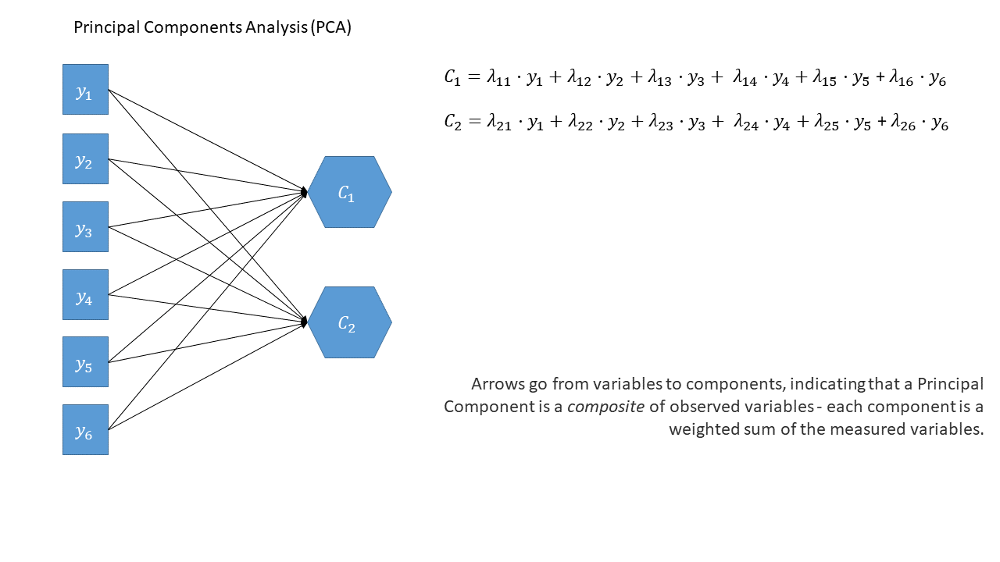
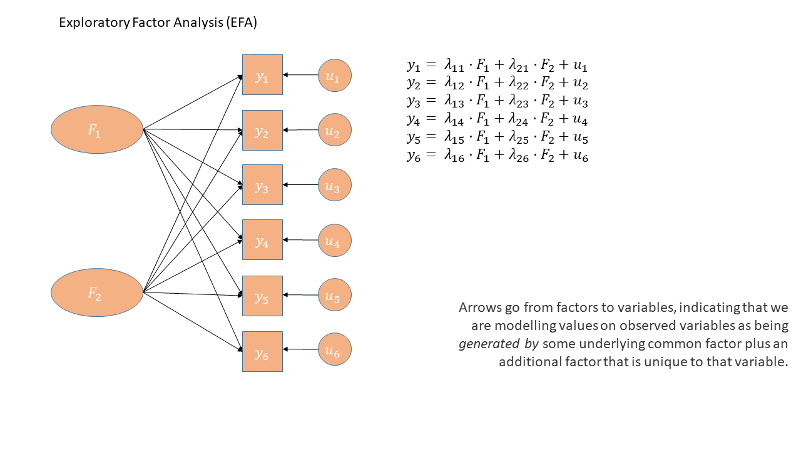
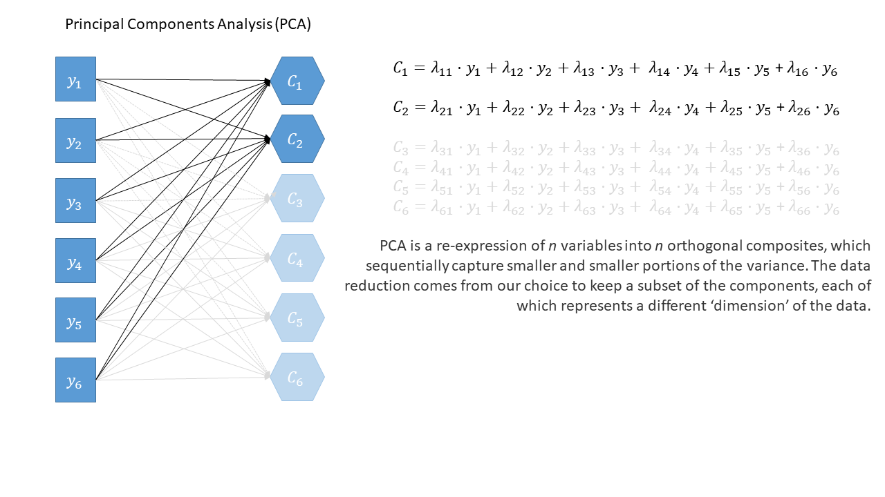

  
```{r setup, include=FALSE}
source('../assets/setup.R')
library(tidyverse)
library(psych)
```

The methods we are looking at now are concerned with capturing this variability in fewer "dimensions" - i.e., without having to refer to all variables "Mental Fatigue","Physical Fatigue", and "Sleepiness", couldn't we instead simply say that an observation is high/low on the dimension of 'tiredness'.  

Where **Principal Component Analysis (PCA)** aims to *summarise* a set of measured variables into a smaller set of orthogonal (uncorrelated) dimensions, **Factor Analysis (FA)** is more of an *explanatory* tool, in that we are assuming that the relationships between a set of measured variables can be **explained by** a number of underlying dimensions, or "latent factors". This distinction is a little subtle, but essentially as soon as we start to give _meaning_ to the new dimensions, we are in the world of factor analysis.  

## in diagrams

The PCA/EFA distinction becomes clearer when we think about them as diagrams that map the relationships between variables.   

::: {.callout-note collapse="true"}
#### Refresher: What different parts of the diagram represent

There are conventions for these sort of diagrams:  

- squares = variables we observe
- circles = variables we don't observe
- single-headed arrows = regression path (pointed at outcome)
- double-headed arrows = correlation/covariance 

:::

In the diagrams below (@fig-diagpca, @fig-diagefa), note how the directions of the arrows are different between PCA and FA.  

In PCA, each component $C_i$ is the weighted combination of the observed variables $y_1, ...,y_n$. In this way, the components are simply 'composites' --- a weighted summary of the variables. The components aren't necessarily meaningful in the sense that they do not have to reflect a real construct we believe exists in the world.  

Contrastingly, in Factor Analysis, each measured variable $y_i$ is seen as *the result of* some latent factor(s) $F_i$. So the diagram for EFA has arrows going from the factors to the observed variables. This is why conceptually EFA pre-supposes that the latent factors are real things that are driving what we actually measure. Those latent factors must therefore have a clear meaning and theoretical coherence.  

Unlike PCA, for EFA we also have 'uniqueness' factors for each variable, representing the various stray causes that are specific to each variable. Sometimes, these uniqueness are represented by an arrow only, but they are technically themselves latent variables, and so can be drawn as circles.  

```{r}
#| echo: false
#| out-width: "100%"
#| label: fig-diagpca
#| fig-cap: "PCA in diagram form. Note that the idea of a 'composite' requires us to use a special shape (the hexagon), but many people would just use a square, because the components are simply derived from the set of variables."

```

```{r}
#| echo: false
#| out-width: "100%"
#| label: fig-diagefa
#| fig-cap: "EFA in diagram form. The arrows going from latent factors to variables presupposes that these latent factors do exist in the world (we simply cannot measure them directly)."

```

::: {.callout-caution collapse="true"}
#### Rabbit Hole: PCA diagram in full

Principal components sequentially capture the orthogonal (i.e., perpendicular) dimensions of the dataset with the most variance. The data reduction comes when we retain fewer components than we have dimensions in our original data. So if we were being pedantic, the diagram for PCA would look something like the diagram below. 
```{r}
#| echo: false
#| out-width: "100%"

```

:::


## summary table

| | Principal Component Analysis | Factor Analysis |
|-|-----------------------------| ----------------|
| **what it does** | take a set of correlated variables, reduce to a set of orthogonal dimensions that sequentially capture most variability |  take a set of correlated variables, ask what set of dimensions (not necessarily orthogonal!) **explain** variability |
| **what the new dimensions are** | new dimensions are referred to as "components" - they are simply "composites" and do not necessarily exist | new dimensions are referred to as "factors". They are assumed to be underlying latent variables that are the cause of why people have different scores on the observed variables | 
| **example** | Socioeconomic status (SES) might be a composite measure of family income, parental education, etc. If my SES increases, that doesn't mean my parents suddenly get more education (it's the other way around) | Anxiety (the unmeasurable construct) is a latent factor. My underlying anxiety is what causes me to respond "strongly agree" to the statement "I am often on edge" | 

 

