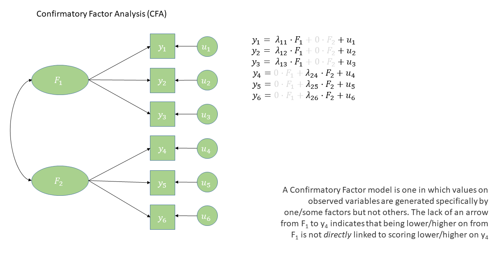
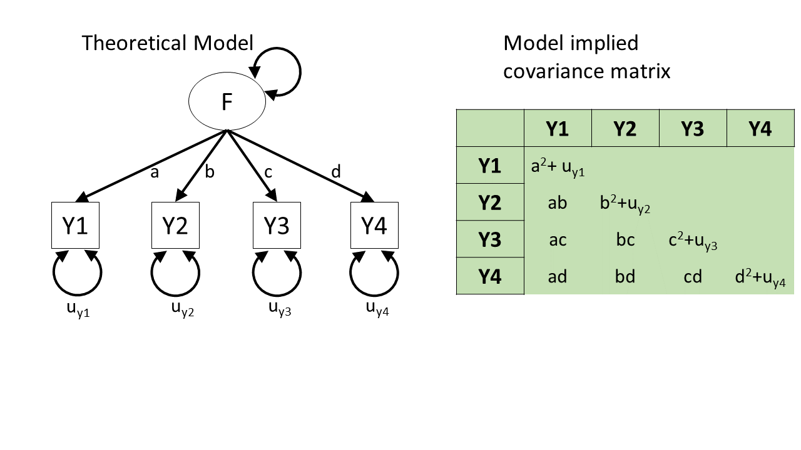
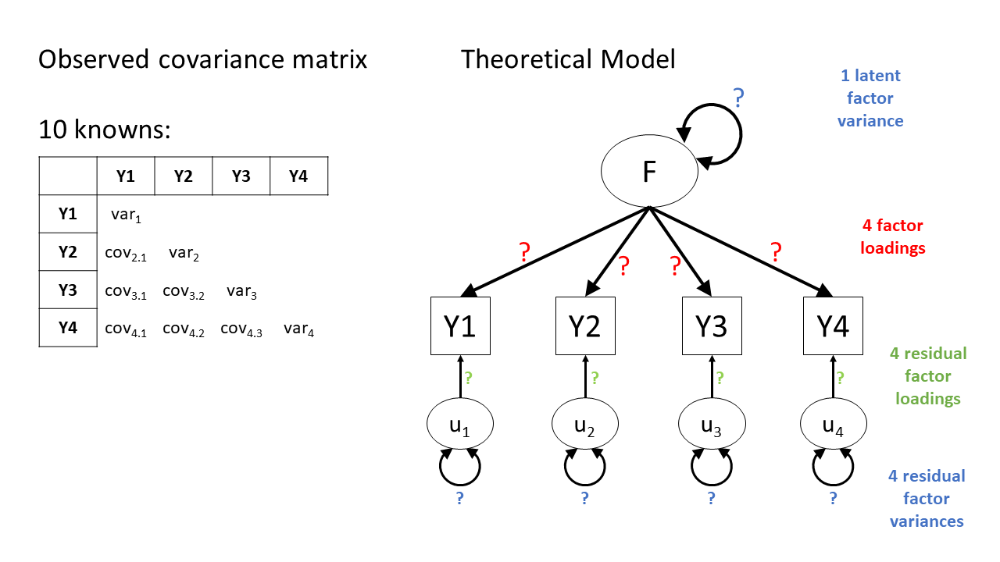
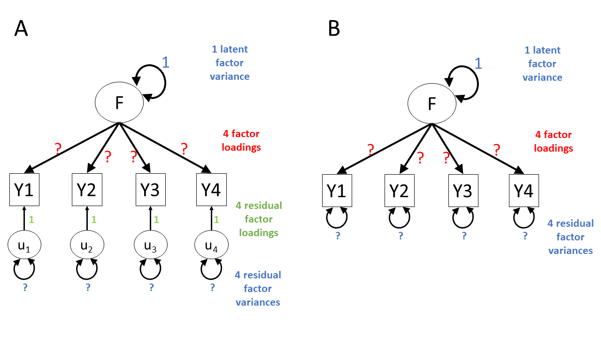
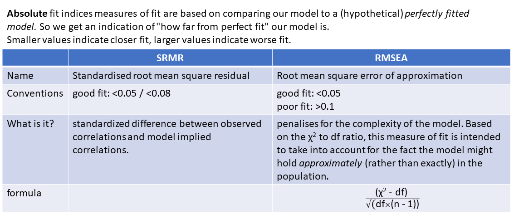

```{r setup, include=FALSE}
source('../assets/setup.R')
```

# What is CFA?  

Confirmatory Factor Analysis (CFA) is a method that allows us to test a pre-specified factor structure (or to compare competing hypothesized structures). Typically these factor structures are ones that have been proposed based on theory or on previous research. Note that this is a change from the 'exploratory' nature of EFA to a situation in which we are explicitly imposing a theoretical model on the data.  

The diagram for a Confirmatory Factor Analysis model looks very similar to that of an Exploratory Factor Analysis, but we now have the explicit **absence** of some arrows - i.e. a variable loads on to a specific factor (or factor*s* - we can have a variable that loads on multiple), and **not** on others.  

The absence of some arrows is what imposes our theory here - the diagram in @fig-cfa makes the claim that the *only* reason we would see a correlation between items `y1` and `y6` is because the underlying factors are correlated. 

```{r}
#| echo: false
#| out-width: "100%"
#| label: fig-cfa
#| fig-cap: "CFA as a diagram"

```


# How do we evaluate "Model Fit"?  

You'll have probably heard the term "model fit" many times when learning about statistics. However, the exact meaning of the phrase is different for different modelling frameworks.

We can think more generally as "model fit" as asking "how well does our model reproduce the characteristics of the data that we observed?". In things like multiple regression, this has been tied to the question of "how much variance can we explain in outcome $y$ with our set of predictors?"^[or in logistic regression, "what is the likelihood of observing the outcome $y$ given our model parameters?"].  

For methods like CFA, we are working with models that are fitted to the *covariances matrix* rather than to an outcome variable, so "model fit" becomes "how well can our model reproduce our observed covariance matrix?".   

::: {.callout-caution collapse="true"}
#### Rabbit Hole: How does a model reproduce a covariance matrix?

After so much time working in a regression world, where we can think of each value on the outcome variable being predicted by some combination of the predictor variables, it can be a bit odd to think about how models like CFA and SEM predict the values in a covariance matrix. The missing link is probably easiest described by showing what different theoretical models *imply* for a covariance matrix.  

In the styles of diagram we're looking at, a double-headed arrow between two things represents that those two things co-vary.
A double-headed arrow where both heads point at the same variable just represents that there's some variance within that variable (as we'd expect).

So, in @fig-pt1, we can see a (rather odd) theoretical model of four variables.
We see from the arrows looped back on themselves that each variable has some variance, labelled as $u_{yj}$ for variable $j$.
But there are no arrows between variables, which means that we're essentially declaring that we expect all the covariances between these variables to be 0.

If we collect data on those four variables and fit this model to that data, it'll use some optimisation method like maximum likelihood estimation to estimate the model parameters $u_{y1}$ to $u_{y4}$, and it will not estimate any covariances between the variables because we told it that the covariances are 0.

The result will be a covariance matrix like the one shown below.
The diagonal (from top left to bottom right) shows each variable's own variance.
The top right triangle of cells, above the diagonals, is empty because it's redundant information.
The covariance of Y1 with Y2 is the same as the covariance with Y2 with Y1, so we only need to see that number once.
And the convention is to show it in the bottom left triangle of cells and leave the upper right triangle blank.
(To tell if this model is a good fit to the data, we would compare the covariance matrix implied by the model to the actual covariance matrix we observed.)

```{r}
#| echo: false
#| label: fig-pt1
#| fig-cap: "A theoretical model that four variables are uncorrelated"
knitr::include_graphics("../images/intropathtrace/Slide1.PNG")
```

Here's the opposite extreme.
In this other (not very good) theoretical model of how the four variables are related, we might say "they're all related to each other for whatever reason!".
In diagram form, this would be essentially like connecting each pair of variables by a double-headed arrow, as in @fig-pt2.  

This model will estimate the covariances between each pair of variables, and so we can *perfectly* reproduce any observed covariance matrix.
We started with 10 things in the covariance matrix (four variances and six covariances), and the model has to estimate those same 10 things (letters $a$ to $f$ and $u_{y1}$ to $u_{y4}$ in @fig-pt2). 
(There's no point to talking about "model fit" for this model, because its fit to the data is already perfect!
There's no variability, no extra data points, that it hasn't accounted for.
We'll talk about this in more detail in the degrees of freedom section below!)

This model is great for reproducing exactly what's there, but we already had what's there—we don't need this complex machinery to reproduce what we already have.
In other words, this model hasn't given us anything theoretically interesting.

```{r}
#| echo: false
#| label: fig-pt2
#| fig-cap: "A theoretical model that four variables are all correlated with one another"
knitr::include_graphics("../images/intropathtrace/Slide2.PNG")
```


Neither of those theoretical models is really what CFA does.
Rather, what CFA does is to posit that these variables are related **because** they are each representing (albeit to different degrees) the same underlying "latent factor" (i.e., the same construct). This is shown in @fig-pt3, and only requires us to estimate 8 things, rather than 10. In doing so it also assumes the existence of some latent factor $F$.^[You may wonder why *a*, *b*, *c*, and *d* are multiplied with one another in the covariance matrix.
We won't go into much detail about that now, but the keywords to that particular rabbit hole are "covariance algebra"/"path tracing".
Essentially, if you trace the paths (ignoring the direction of the arrows) between related variables and multiply of all of the values you encounter along the way, and take the sum of all of those products from each different path, you can find the model-implied covariances. 
<!-- future update: see the path tracing chapter for msmr for more detail -->
]

```{r}
#| echo: false
#| label: fig-pt3
#| fig-cap: "A theoretical model that four variables are related to one another *because* they are all manifest variables of some latent factor"

```

A key take-away from this little section: From any given path diagram, we can work out what implied values we'd expect to see in the corresponding covariance matrix.

So, once we fit a model to some data, the model will estimate some paths.
Once we've got those paths, we can translate them into the implied covariance matrix, and then compare that matrix to our observed covariance matrix.
That comparison is what allows us to talk about "model fit".


```{r}
#| include: false
#| eval: false
library(lavaan)
library(semPlot)
set.seed(234)
dgp="L=~.7*Y1+.7*Y2+.8*Y3+.5*Y4
      Y1~~.4*Y1\nY2~~1.3*Y2
      Y3~~.5*Y3\nY4~~.9*Y4"
dat = simulateData(dgp)
mm = "Y1~~ey1*Y1\nY2~~ey2*Y2\nY3~~ey3*Y3\nY4~~ey4*Y4"
mod = sem(mm,dat)
semPaths(mod, whatLabels = "name")
mod@implied$cov
cov(dat)
semPaths(mod, whatLabels = "est")


mm = "Y1~~Y2
      Y1~~Y3
      Y1~~Y4
      Y2~~Y3
      Y2~~Y4
      Y3~~Y4"
mod = sem(mm,dat)
semPaths(mod, whatLabels = "name")
mod@implied$cov
cov(dat)
semPaths(mod, whatLabels = "est")

mm = "L=~Y1+Y2+Y3+Y4"
mod = sem(mm,dat,std.lv=T)
semPaths(mod, whatLabels = "name")
mod@implied$cov
cov(dat)
semPaths(mod, whatLabels = "est")
```

:::


| model fit in `lm()` | model fit in CFA/SEM |
| --------------------| ---------------------|
| "how well does our model reproduce the values in the outcome variable?" | "how well does our model reproduce the values in our covariance matrix?" |


# What kind of models can we evaluate?  

In regression, we could only talk about model fit if we had more than 2 datapoints. This is because there is only one possible line that we can fit between 2 datapoints, and this line explains _all_ of the variance in the outcome variable (it uses up all our 2 **degrees of freedom** to estimate the intercept and the slope).   

The logic is the same for model fit in terms of CFA and SEM - we need more observed things than we have parameters that our model is estimating. The difference is that "observed things" are the values in our covariance matrix, rather than individual observations. The idea is that we need to be estimating fewer parameters (fewer "paths" or lines in the diagram) than there are unique values (variances and covariances) in our covariance matrix. This is because if we just fit paths between all our variables, then our model would be able to reproduce the data perfectly (just like a regression with 2 datapoints has an $R^2$ of 1).  

The degrees of freedom for methods like CFA, Path Analysis and SEM (methods that are fitted to the covariance matrix of our data) correspond to the number of *knowns* (observed covariances/variances from our sample) minus the number of *unknowns* (parameters to be estimated by the model). 


:::sticky
**degrees of freedom = number of knowns - number of unknowns**  

  - number of knowns: how many unique variances/covariances in our data?  
  The number of knowns in a covariance matrix of $k$ observed variables is equal to $\frac{k \cdot (k+1)}{2}$.  
  - number of unknowns: how many parameters is our model estimating?  
  We can reduce the number of unknowns (thereby getting back a degree of freedom) by fixing parameters to be specific values. *By removing a path altogether, we are fixing it to be zero.*  

A model is only able to be estimated if it has at least 0 degrees of freedom (if there are as many knowns as unknowns). 


| degrees of freedom |-| what can/can't be done |
|--------------------|- |----------------------- |
| $>0$ degrees of freedom | **over-identified** | can estimate parameters and their standard errors, and can estimate model fit |
 | 0 degrees of freedom |**just-identified** | can estimate parameters and their standard errors, but not model fit |
| $<0$ degrees of freedom |**under-identified** | can estimate parameters but not their standard errors (so basically useless), and cannot estimate model fit   |

:::


@fig-model-underidentified shows the basic structure of a theoretical model with one latent factor $F$ that loads onto four observed items $Y1$ through $Y4$.  
Because we have 4 observed variables, we have a $4\times 4$ covariance matrix, so there are $\frac{4(4+1)}{2}=10$ "knowns" - i.e., 10 properties that we have observed from our dataset.  

```{r}
#| echo: false
#| label: fig-model-underidentified
#| fig-cap: "A four item factor structure. The model is underidentified because there are more parameters to estimate (thirteen) than there are values that we know (ten)."

```

In our model, we have each of those observed items being the manifestation of some latent factor $F$, along with having some unobserved measurement error, represented as $u_j$ for item $j$.  
In CFA terms, we think of these measurement errors as unobserved factors (similar to the latent factor $F$), but we call these "residual factors". Each residual factor has its own loading onto one of the observed variables as well as its own variance. Often, we will get a bit more slack with language and we might just refer to this whole bit of the model as "residual variances", or "residuals".  

There are, in @fig-model-underidentified, thirteen question marks --- thirteen different arrows. We can't get thirteen things from ten (our covariance matrix), but we _can_ fix some of these arrows first. 

In factor models, the arrows from residual factors are fixed to 1. This is because we really just want the residual factor to soak up all the 'stray causes' that are specific to a given variable. Any value we might put on those residual factor loadings wouldn't really *mean* anything. One way to think about this is to think about what the residual factors represent in our model. Really, the residual factor just says "beyond its relation to factor $F$, variability in responses to item $i$ are driven by a bit of unmeasured error". Notice that this is "**a** bit" --- i.e., singular, or $1 \times$ --- hence why we just fix those loadings to 1. 

In addition, we are going to have to somehow give our latent factor a numeric scale, and one way to do this is to fix its variance to be 1.  

So with 4 variables loading onto 1 latent factor, we end up having 8 parameters to estimate. So we have eight unknowns and ten knowns, the model is overidentified --- hurray! @fig-model-overidentified shows two ways in which you'll see CFA models drawn --- one with the residual loadings explicitly drawn on, and one with them assumed.  

```{r}
#| echo: false
#| label: fig-model-overidentified
#| fig-cap: "A four item factor structure, shown two ways: one explicitly showing the residual factor loadings set to 1, one simpler version in which this has been assumed. The model is now overspecified because there are more known values (ten) than unknown values (eight). For now, we fix the factor variance to be 1"

```


# Model Fit Measures

There are _loads_ of different metrics that people use to examine model fit for CFA and SEM, and there's lots of debate over the various merits and disadvantages as well as the proposed cut-offs to be used with each method.  

The most fundamental test of model fit is a $\chi^2$ (chi-squared) test, which reflects the discrepancy between our observed covariance matrix and the *model-implied* covariance matrix. If we denote the observed covariance matrix as $\Sigma$ (capital sigma) and the model-implied covariance matrix as $\Sigma(\Theta)$ (capital sigma of capital theta), then we can think of the null hypothesis here as $H_0: \Sigma - \Sigma(\Theta) = 0$.
The null hypothesis is that there is no difference between the observed covariance matrix and the model-implied covariance matrix.

In this way, our null hypothesis is that our theoretical model is correct (and can therefore perfectly reproduce the covariance matrix).
So, if we reject the null hypothesis because of a significant result on a model fit test, then it means that our model is a _poor_ fit to the data.

Beware that sometimes the $\chi^2$ test will give "false alarms".
It's very sensitive to departures from normality, as well as sample size (for models with $n>400$, the $\chi^2$ is almost always significant), and can often lead to rejecting otherwise adequate models.  

Alongside this, the main four fit indices that are commonly used are known as RMSEA, SRMR, CFI and TLI.
In case you're curious, here's what those acronyms stand for (it's basically statistical jargon salad, so the acronyms may be easier to remember):

- RMSEA: Root mean square error of approximation
- SRMR: Standardised root mean square residual
- CFI: Comparative fit index
- TLI: Tucker Lewis index

Smaller values of RMSEA and SRMR mean better fit, while larger values of CFI and TLI mean better fit.  

**Convention:** if $\textrm{RMSEA} < .05$, $\textrm{SRMR} < .05 \text{ (some people say }<. 08\text{)}$ and $\textrm{TLI} > .95$ and $\textrm{CFI} > .95$ then the model fits well.  

::: {.callout-caution collapse="true"}
#### optional: absolute fit indices

```{r}
#| echo: false
#| out-width: "100%"

```

:::
::: {.callout-caution collapse="true"}
#### optional: incremental fit indices

```{r}
#| echo: false
#| out-width: "100%"
knitr::include_graphics("../images/fitmeas_inc.PNG")
```
:::

# A Caution

One initially slightly bizarre aspect of latent variable models is that they involve estimating parameters between variables **some of which we never observe**. This seems almost like magic - we ask people questions about how well they sleep, if they fidget or worry etc., and somehow we are able to then estimate parameters concerning some underlying latent variable that represents 'anxiety' (but that we could never even hope to measure). The existence of any such latent variable is extremely theory driven - we are making a strong claim that there **is** some underlying thing that is causing our observed variables to covary. In diagrams like @fig-cfa, we never observe the latent variables `F1` or `F2`, we simply theorise them into existence^[I think therefore I am?] as an explanation for what we _do_ observe.  

One important point is that **models with latent variables that exhibit "good fit" do not prove the existence of any latent variable (such a task is impossible).** In fact, it's entirely possible that there are other theoretical models that fit equally well but without positing the existence of latent variables. Conceptually, we should always be scrutinising the meaning of our latent variables in the context of what we know (or think) about the field in which we are working. 

::: {.callout-caution collapse="true"}
#### Rabbit Hole: Model Modifications

What if a factor structure _doesn't_ fit well?

When a factor structure does not fit well, we can either start over and go back to doing EFA, deciding on an appropriate factor structure, on whether we should drop certain items, etc. The downside of this is that we essentially result in _another_ version of the measurement tool, or another theory about what the tool is measuring, and before we know it, we have 10 versions of the same thing floating around, in a perpetual state of development. The advantage of this is that we don't just blindly persist with a bad theory of what our measurement tool is capturing.  

However, we are not restricted to choosing between "carry on with a crappy measure" and "shove it in the bin and start over". Somewhere between these two is the option of making small adjustments to our theory about how the measurement tool works. In essence, this is seeing if it possible to minimally adjust our model based on areas of local misfit in order to see if our global fit improves. 

**VERY IMPORTANT:** this approach is very much _exploratory,_ and we should be very clear when writing up about the process that we undertook. We should also avoid just shoving any parameter in that might make it fit better (*any* parameter we add will by definition make it fit better!) - we should let common sense and theoretical knowledge support any adjustments we make.  


:::