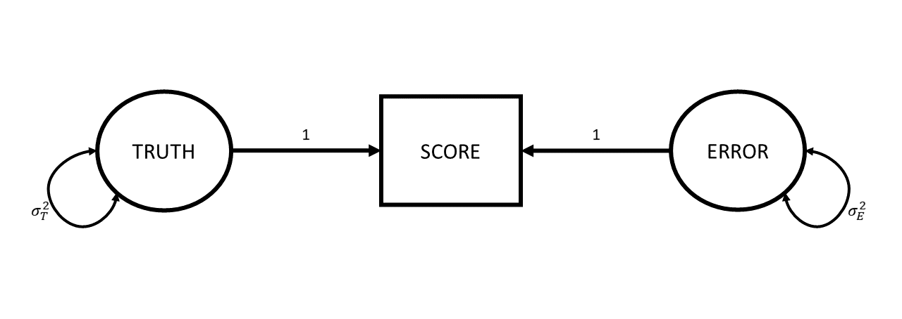
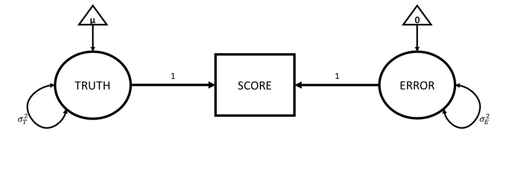
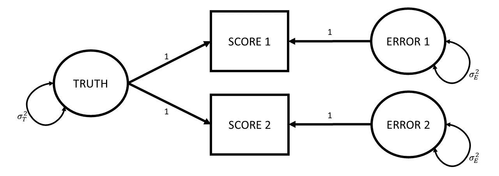

```{r setup, include=FALSE}
source('../assets/setup.R')
library(tidyverse)
library(patchwork)
```

The very high level idea of reliability can be captured by the various words we could use instead of 'reliability'. We are talking about how reliable/consistent/repeatable/precise/stable/dependable/_\<insert-your-favourite-synonym-here\>_ a measurement is.  

However, because we want to **quantify** reliability for a given measurement instrument, we need a specific, mathematical definition.

The easiest way to get into thinking about reliability is probably to think about *repeated assessment*.
If we measure person $i$ using instrument $x$ and then we measure person $i$ using instrument $x$ a second time (and we assume they haven't changed on the underlying construct), then a perfectly reliable measure would give us the exact same scores.  

For example, a reliable method of weighing a dog is to use the big specialised scales for pets that they have at the vets. A less reliable way is to awkwardly carry your dog onto your cheap bathroom scale and subtract your own weight to get the weight of only the dog. Even less reliable would be to go and do this outside on a bumpy surface like gravel, where the scales don't work well, and decide to do it standing on one leg...  

So one initial way to think about reliability in mathematical terms is to suppose that we do the measurement twice on the same units and see how well their scores correlate. 

::::{.columns}
:::{.column width="50%"}

Let's make this concrete with an example.
Meet my dog Dougal.
If we could measure it absolutely *perfectly*, we would know that Dougal weighs 23.81434688436... kg.

Suppose that I weigh him, along with a bunch of other dogs, using two different measurement tools.
I use each measurement tool twice and record the values I get for each dog at time 1 and at time 2.

:::
:::{.column width="50%"}

{height="250" fig-align="center"}
:::
::::

In the plots below, each dog is represented by one dot.
The dot shows their measured value at time 1 and at time 2.
The red line shows how far the measured value is from their true weight (which, if the measure were perfectly reliable, would appear on the plot as a perfect diagonal).
So the first measurement tool isn't perfectly reliable, but the correlation between time 1 and time 2 is very good!

```{r}
#| echo: false
set.seed(3)
df = tibble(
  true = rnorm(30,18,8),
  measurement_1 = rnorm(30,true,.3),
  measurement_2 = rnorm(30,true,.3)
) 
df[17,] <- as.data.frame(cbind(23.814346,23.6,23.9))

ggplot(df,aes(x=measurement_1, y = measurement_2))+
  geom_point(size=2,alpha=.4)+
  geom_segment(aes(x=true,xend=measurement_1,y=true,yend=measurement_2),col="red")+
  annotate(geom="segment",x=20,y=25,xend=23.5,yend=23.9)+
  annotate(geom="text",x=20,y=25,label="This is Dougal.\n he actually weighs 23.814346... kg\nthe first time I weigh him I get 23.6\nthe second time I get 23.9",hjust=1,size=5)+
  labs(
    y = 'time2',
    x = 'time1',
    title=paste0("The first measurement tool\ncor(time1, time2) = ", round(cor(df[,2],df[,3]),3))
  )
```

```{r}
#| echo: false
set.seed(998)
df1 = tibble(
  true = df$true,
  measurement_1 = rnorm(30,true,2),
  measurement_2 = rnorm(30,true,2)
)
ggplot(df1,aes(x=measurement_1, y = measurement_2))+
  geom_point(size=2,alpha=.4)+
  geom_segment(aes(x=true,xend=measurement_1,y=true,yend=measurement_2),col="red")+
  annotate(geom="segment",x=18,y=27,xend=20.7,yend=25.9)+
  annotate(geom="text",x=18,y=28,label="This is Dougal.\nhe actually weighs 23.814346... kg\nthe first time I weigh him I get 20.6\nthe second time I get 25.9",hjust=1,size=5)+
  labs(
    y = 'time2',
    x = 'time1',
    title=paste0("The second measurement tool\ncor(time1, time2) = ",round(cor(df1[,2],df1[,3]),3))
  )
```

The second measurement tool is a bit less reliable: there's more distance between the true value and the measured values, _and_ the measurement tool produces values that change quite a bit from one time to the next.

Thinking about validity in terms of how well scores correlate if we apply the measure several different times is a good way to start.
But it is hard to think about in situations where we *haven't* measured the same units twice. A more generalisable way to conceive of reliability can be got at by thinking about measurement in a diagrammatic way. Which is great, because I love diagrams!

## Truth and Error 

> love truth but pardon error (Voltaire)

So let's go back to basics. Whenever we measure something, we get a number^[(hooray, I love numbers almost as much as I love diagrams!]. But there are almost always two things that make that number what it is: there is the "true" value of the construct that we're measuring, and then there is error. This error might come from different things - it could be rounding error (our scales only display to the 10th of a kg), it could be random error due to a poor instrument (e.g., using our bathroom scales on some bumpy cobbles that happen to make it weigh higher/lower depending on where we position the scales), or it could be other stray causes that are unrelated to the construct we're trying to measure (e.g., measurements of anxiety often include a question about sleep habits, but there are lots of other things that influence sleep!).  

Drawing our diagram then, when we measure something, we observe one thing (the score), but this is caused by two unobserved things (the truth and some error). Following the conventions for drawing these sorts of diagram, things we observe are in squares, and unobservables are in circles.  

```{r}
#| label: fig-ctt1
#| fig-cap: "When taking a measurement, the number (or 'score') that we get out is always one bit of truth, and one bit of error"
#| echo: false
#| fig-width: 12
knitr::include_graphics("../images/ctt/Slide1.PNG")
```

One way to make the idea of "truth" here a little more concrete: let's suppose that I took my shoddy bathroom scales and weighed Dougal over and over and over and over again (ad infinitum). The numbers I get out will follow a normal distribution, the center of which we can think of as Dougal's "true" weight (assuming the scales aren't systematically biased). We often see weights a little higher, often a little lower, less often do we see things a lot higher or lower, etc. So "Truth" here refers to the idea of the 'long run' measurement.  

```{r}
#| echo: false
plot(density(rnorm(1e4,mean=23.814346,sd=.3)),main="10,000 measurements of Dougal's weight\n(using crappy bathroom scales)",xlab="observed weight")
```

Now let's expand from thinking about Dougal specifically to thinking about our proposed measurement process for weighing dogs in general. We have our "instrument" for measuring a dog's weights (our bathroom scales), and we can imagine all the measurements we might use this instrument for. For any dog we might use these scales to weigh, the observed number we see on the scales is going to be driven by 1) that dog's *true* weight, and 2) a little bit of error. Just like all the true weights of all dogs have a variance (some are big dogs that weigh a lot, some are little dogs that weigh less etc.), the errors that contribute to our measurements also have a variance (some readings will be a bit higher than truth, some will be a bit lower).   

If we add these variances to our diagram, we simply add curved lines to our "Truth" and "Error" variables: 
```{r}
#| label: fig-ctt2
#| fig-cap: "variance in observed scores = variance in true scores + variance in errors"
#| echo: false
#| fig-width: 12

```

The really useful thing about diagrams like these is that they represent theoretical models that can be used to *imply* what we would expect to see in our observed variables (we saw this idea in [CFA](c03_cfa.html)). One crucial thing that this specific diagrammatic model of measurement implies is that the variance we would see in our observed scores is going to be the variance in the true scores plus the variance in the errors.    

$$
Var(\text{Observed Scores}) = Var(\text{True Scores}) + Var(\text{Errors})
$$

As it turns out, we can actually find an intuitive way of thinking about this equation. Let's take it to the extreme: If my measurement instrument is incredibly good at weighing dogs, then the variance in the errors is much much smaller (i.e., all measurements are within 0.1kg of the true score). If my measurement instrument is incredibly bad at weighing dogs, then the variance in errors is much bigger (sometimes when I weigh a dog that is 'in truth' 23.814346....kg, I will get a score of 15kg, sometimes I will get a score of 28kg etc).  

So a really generalisable way of thinking about reliability of measurement is to view it as "how much of the variance in our observed scores is due to true variance?".  
For example, how much of the variance in observed weights of dogs is due to how different the actual weights of our measured dogs are?

$$
\begin{align}
\text{reliability} &= \frac{Var(\text{true scores})}{Var(\text{observed scores})} \\
& \quad \\
&= \frac{Var(\text{true scores})}{Var(\text{true scores}) + Var(\text{errors})} 
\end{align}
$$

::: {.callout-caution collapse="true"}
#### Rabbit hole: Why is it not just "how much error variance is there?"  

We can't simply use the variance of measurement error on its own to quantify 'reliability' here, because what counts as "small" or "large" amounts of error depends entirely on the quantity we are measuring.  

For example, consider the following three scenarios: 

1. I am measuring the weight of dogs, and my scales are a bit off each time - there is a little bit of error. The errors have a variance of 1kg  
2. I am measuring the weight of dogs, and my scales are *wayy* off each time - there is a massive amount of error. The errors have a variance of 100kg  
3. I am measuring the weight of elephants, and my scales are a little bit off each time - there is a little bit of error. The errors have a variance of 100kg  

The size of the error variance (1kg or 100kg) by itself doesn't determine how much "off" (a little bit off vs waayy off) we consider the measurements to be. What is important is how big this error variance is **relative to** the true variance of the things being measured.  

Elephants' weights vary between 1800 and 4500kg, so mis-measuring by 100kg isn't really that bad in the grand scheme of things. But dogs' weights vary between about 5kg and 50kg, so mis-measuring by 100kg is ridiculous. 

:::

::: {.callout-caution collapse="true"}
#### Rabbit hole: other implied assumptions of this model of measurement

These diagrams are a great way to also see the assumptions that are underpinning our theories.  

There are two further implications that arise when we think of our measurements the way we drew in @fig-ctt2.  

1. Errors are not correlated with the truth. In the diagram, this is represented by the fact that there is no arrow between the Truth and Error variables. What this means in an applied setting is that we assume that the amount of measurement error isn't less/more for someone who has a low true value than it is for someone with a high one. Continuing with the act of weighing dogs, this is the assumption that if my scales are showing a value that is $\pm1kg$, then it is $\pm1kg$ for a dog that actually weighs 5kg and for one that actually weighs 50kg. You could imagine this not being the case if, e.g., the 50kg dog squashed the scales down so much that the scales always showed $50 \pm 0.1kg$, and the scales didn't work as well for the little 5kg dog where we see scores of $5 \pm 3kg$. 
If we wanted to include this assumption in the model diagram, we would need to draw an arrow from the Truth variable to the Error variable.

2. Error has mean zero. This is just like we often assume with errors - they are just random deviations, meaning they average out at zero. When it gets to diagrams and covariance-based models (like CFA etc), we don't really talk much about the means anymore. But if we _did_ want to represent them, then we could show them in these diagrams as a constant fixed number, in **triangles** (if squares are for observed variables, circles are unobserved/latent variables, then we need a new shape). So more explicitly our diagram would look like @fig-cttmz.
The triangle connected to "Truth" represents the average true value, $\mu$.
The triangle connected to "Error" contains zero, representing that the errors have a mean of zero.
The lack of a triangle going into the observed score is telling us that there is no systematic bias (i.e., in our weighing scales example, if they always weight 5kg heavier, we would have a triangle in the 5 going into the score).  

```{r}
#| label: fig-cttmz
#| fig-cap: "A fuller picture, in which means are included - the 0 going into Error indicates that we assume errors have mean zero."
#| echo: false
#| fig-width: 12

```

```{r}
#| echo: false
#| fig-width: 12
set.seed(86)
df2 = tibble(
  true = df$true,
  e = 2-2*df$true/max(df$true),
  measurement_1 = rnorm(30,true,e),
  measurement_2 = rnorm(30,true,e)
)
p1 <- ggplot(df2,aes(x=measurement_1, y = measurement_2))+
  geom_point(size=3,alpha=.4)+
  geom_segment(aes(x=true,xend=measurement_1,y=true,yend=measurement_2),col="red")+
  labs(title="error is correlated with truth")

set.seed(699)
df2 = tibble(
  true = df$true,
  measurement_1 = true + rchisq(30,1),
  measurement_2 = true + rchisq(30,1)
)
p2 <- ggplot(df2,aes(x=measurement_1, y = measurement_2))+
  geom_point(size=3,alpha=.4)+
  geom_segment(aes(x=true,xend=measurement_1,y=true,yend=measurement_2),
               col="red")+
  labs(title="error has non-zero mean")

```

If the first implication doesn't actually hold for our measurement tool, then we end up with the measurement tool having different levels of reliability for different levels of truth - e.g., a reliable means of weighing dogs between 15-30kg but not a reliable means of weighing dogs between 5-10kg.
If the second implication doesn't hold (that is, if the errors do not have mean zero), then this could be systematic bias, or could be due to something skewing our errors, meaning we might have some measurements being much further off than others (in the right hand plot below, if we took all the errors - the red lines - and plotted them, it would look very skewed, and have a mean of ~0.8).  

```{r}
#| eval: false
#| label: fig-err1
#| column: margin
#| fig-cap: "measurement errors with a non-zero mean (red line)"
#| echo: false
df2 |> mutate(
  er1 = measurement_1 - true,
  er2 = measurement_2 - true
) |> select(er1,er2) |> pivot_longer(1:2) |>
  pull(value) |> density() |>
  plot(xlab="error",main="")
abline(v=0.8,col="red")
```

::::{.columns}
:::{.column width="50%"}
```{r}
#| echo: false
p1
```
:::
:::{.column width="50%"}
```{r}
#| echo: false
p2
```
:::
::::

:::

<!-- EP RESUME -->

If reliability is a **proportion**, this means it can range from 0 (all of the variance in scores is error) to 1 (none of it is). There is no defined cut-off for what is "reliable enough", though in a lot of social science, people seem to want a reliability to be >0.7.  

However, while this way of thinking about reliability might seem nice and intuitive, how on earth do we actually _quantify_ it? With just a single score, we don't have enough information... We are essentially saying "observed score = unobserved true values + unobserved errors". This is a bit like being given a math problem of "23.5 = T + E, please solve" --- it's impossible! So while we might know that $Var(\text{Observed Scores})$=$Var(\text{True Scores})$+$Var(\text{Errors})$, with just one score we can't figure out how much of the observed variance is true variance vs error variance. 

Things get a lot better when we have more than one score. This is because we have two scores, say, and two errors, but _only one truth_. 
Now it's a bit like getting a math problem of "24 = T + E1, and 23 = T + E2, and E1 and E2 are the same size (but not necessarily same direction)".  
With two scores, we can draw our diagram as:  

```{r}
#| label: fig-ctt3
#| echo: false
#| fig-width: 12

```


And this diagram implies a certain set of assumptions:  

- the true value hasn't changed between assessments (it's the same thing "truth" that leads to both).
- the true value contributes the same to each assessment (the arrows from truth are both 1).  
- there is the same amount of error at each assessment. i.e,. it's not the case that the 2nd assessment involves much bigger or smaller errors than the first (this is indicated by both Error 1 and Error 2 having the same variance $\sigma^2_{E}$).  
- the errors are uncorrelated - happening to have the score at assessment 1 be a little bit above your true value tells us nothing about how above/below our score will be at assessment 2. This is indicated by the lack of an arrow between Error 1 and Error 2.

So where do we get repeated assessments from?
How do we end up with multiple scores?
There are lots of ways in which we can think of having these sort of "parallel tests" (having multiple instances of measurements of the same construct).  

We could: 

- take a measurement, wait a bit, and then take another measurement 
- take a measurement with version-A of the measurement instrument and then take a measurement with version-B
- get two (or more) people to measure the same units
<!-- - administer a whole bunch of different items that collectively make up a measurement -->
<!-- EP note: commented the last one out bc it's tidier if these three items ^ reflect the three forms of reliability below -->

For each of these situations there are specific calculations that tend to get used to quantify the reliability. They tend to differ because of how they are partitioning variance into "true variance" and "error variance".  

::: {.callout-caution collapse="true"}
#### Rabbit hole: where did the correlation between repeated measurements go?  

We've just been talking about reliability as the ratio of true variance to observed score variance.
But we started somewhere else: thinking about reliability as consistency across repeated assessment.
This box shows that, mathematically, both ideas work out to the same thing!

To turn covariance into a correlation, we must divide it by the standard deviations of the two variables - $cor_{xy} = \frac{cov_{xy}}{sd_x \cdot sd_y}$.  

So let's take the correlation between scores and express it as the covariance divided by the standard deviations.
Remember that standard deviation $\sigma$ is the square root of variance, which is $\sigma^2$.
So let's write the standard deviations as $\sqrt{\sigma^2}$ (the reason will become clear in a second).  

$$
\begin{align}
cor_{score_1,score_2} &= \frac{cov_{score1,score2}}{\sigma_{score1} \cdot \sigma_{score2}} \\
\, \qquad \\
&= \frac{cov_{score1,score2}}{\sqrt{\sigma^2_{score1}} \cdot \sqrt{\sigma^2_{score2}}} \\
\end{align}
$$

As we saw in [CFA](04_cfa.html), these diagrams *imply* covariances between observed variables. In this case, the observed variables are the two scores, and according to this diagram, the only way that Score 1 and Score 2 co-vary is via the true values. So $cov_{score_1, score_2}$ is going to be $\sigma^2_T$.^[We can do this by tracing between Score 1 and 2 on the diagram - we go down a path of 1, we pick up the true variance $\sigma^2_T$, and then we go up a path of 1 - so $1 \times \sigma^2_T \times 1$]  

And we have just talked about how the variance in observed scores is equal to the variance in the true values plus the variance in the errors, and so the variance of Score 1 is going to be $\sigma^2_T + \sigma^2_{E1}$.  

We can substitute all these in to the above, and we would get:  

$$
\begin{align}
&= \frac{\sigma^2_T}{\sqrt{(\sigma^2_T + \sigma^2_E)} \cdot \sqrt{(\sigma_T^2 + \sigma^2_E)}}  \\
\end{align}
$$
The bottom part then simplifies to:  

$$
\begin{align}
& = \frac{\sigma^2_T}{\sigma^2_T + \sigma^2_E}
\end{align}
$$

And we're right back at the "proportion of true variance out of total variance (true variance + error variance)".  

:::


## Different Administrations, Assessment-versions, and Judges/Raters  

Three forms of reliability frequently arise when we have a measure being used several times (either at different times, or in different versions, or by different administrators of the test).  

A little note - the word 'test' in this world tends to be used to refer to a 'psychometric test' - i.e, a thing that gives us a numeric score. Kind of like the term 'measurement tool' we have been using so far. This could be a single thing (like weighing a dog on a scale), or it could be a score across a set of items (like the multi-item measures we have been dealing with in PCA/EFA/CFA).  

:::sticky
**Test-retest reliability:** Consistency of test scores when the same test is administered to the same group on two different occasions.

**Alternate forms reliability:** Consistency of scores between two equivalent versions of a test that measure the same construct.

**Inter-rater reliability:** Degree of agreement or consistency between two or more raters/observers scoring the same behaviour or responses.
:::

Our first instinct might be to measure reliability using correlations between two sets of scores.
But just because two things are linearly associated doesn't mean the measurement is reliable.
(Imagine if you used an electronic weighing scale to weigh twenty dogs.
And imagine that every time you turned this scale on, it would randomly multiply the values it measures by 3, or 2, or –4.
The next time you turn the scale on and weigh the twenty dogs again, you'll get a very different set of twenty scores.
Those scores will be linearly associated with the first set, so the correlation will be high, but the measurement tool—the scale—is not reliable at all.)

To measure reliability in psychometrics, we commonly use the **Intraclass Correlation Coefficient (ICC)**. Because this works on partitioning up variance between and within the observed units, this is more like assessing *agreement* between tests. Variance in average scores *between* the units in our sample can be taken as an estimate of "how much units truly vary", and the variance in scores *within* the units can be seen as the error variance.  

## Internal Consistency of Multi-Item Measures

```{r}
#| include: false

library(lavaan)
set.seed(54)
stressdata <- simulateData(paste0("str=~",paste0(runif(10,-.3,.9), paste0("*q",1:10),collapse="+")),
             sample.nobs = 83) |>
  apply(2,\(x) as.numeric(cut(x,5)))

stressdata[,c(4,5,7,8)] <- apply(stressdata[,c(4,5,7,8)], 2, \(x) 6-x)
  

stress_items = c("been upset because of something that happened unexpectedly?","felt that you were unable to control the important things in your life?","felt nervous and stressed?","felt confident about your ability to handle your personal problems?","felt that things were going your way?","found that you could not cope with all the things that you had to do?","been able to control irritations in your life?","felt that you were on top of things?","been angered because of things that happened that we
re outside of your control?","felt difficulties were piling up so high that you could not overcome them?")
# save(stress_items, stressdata, file ="../../data/reliablystressed.rdata")
```

The above forms of reliability are concerned with each test administration providing a single numeric score, which is then assessed over different times/versions/raters.
But very often we are faced with a single administration of a psychometric test providing multiple numeric scores, such as when we ask a bunch of questions.  

In practice, this happens all the time in psychology, and we want to quantify reliability here too.
This situation is different because now we're looking at reliability _within_ a single administration of our measurement tool.
For some reason, this kind of reliability doesn't have "reliability" in the name after all: it's typically termed "internal *consistency*".

:::sticky
**Internal consistency:** Consistency of one person's responses across items within the same test
:::

<!-- For example, if we have administered a multi-item measure of Perceived Stress, and we got a sample of people to all respond to 10 questions. We can think of the set of 10 questions are essentially being a representative set of all the possible questions we might ask about stress. So in a way, we already have "parallel tests" here. However, we want to quantify the reliability in using the responses to all the items to form of some sort of _score_ on the construct for each person.   -->

For example, imagine we have administered a ten-item measure of Perceived Stress to a sample of people.
We are specifically interested in forming some sort of _score_ on the construct of Perceived Stress for each person.
To do this, we'll quantify their internal consistency.

The idea is similar to before: we want to know what part of a person's variance in response is due to "true" variance in an underlying construct, vs. what might just be error.
Far and away the most famous measure of internal consistency is "**coefficient alpha ($\alpha$)**" (often called "Cronbach's alpha"^[Lee Cronbach has said we shouldn't it call 'Cronbach's Alpha' because he didn't come up with the idea]), which has a pretty unsightly formula, but conceptually uses covariance between items as a measure of "true variance", and takes this as a proportion of the variance in total scores across the items.  

By using the average covariance to capture "true variance", what we are implicitly assuming is that each of those covariances are equally important—in other words, that every item contributes equally to the score. Sounds kind of familiar? It's just the same assumption we had when we calculated a sum score, or a mean score - hence why our denominator is the sum of all the variance!

$$
\begin{align}
\alpha&= \frac{\text{average covariance between items}}{\text{total score variance}}\\
\quad \\
&= \frac{\text{true variance}}{\text{total score variance}} \\
\end{align}
$$


::: {.callout-caution collapse="true"}
#### Rabbit hole: coefficient alpha in full

$$
\begin{align*}
\alpha=\frac{k}{k-1}\left( \frac{\sum\limits_{i\neq}\sum\limits_j\sigma_{ij}}{\sigma^2_X}     \right) = \frac{k^2 \,\,\,\overline{\sigma_{ij}}}{\sigma^2_X} \\
k \text{ is the number of items in scale X} \\
\sigma^2_X \text{ is the variance of all items in scale X} \\
\sigma_{ij} \text{ is the covariance between items }i\text{ and }j \\
\end{align*}
$$

:::

An alternative method to calculate reliability, _without having to assume equal weighting of items within a test_, is borne out of factor analysis. **McDonald's Omega ($\omega$)**  uses factor loadings and uniqueness estimates to calculate reliability. This (hopefully) makes a bit of sense if we remember from [EFA](03_efa.html) and [CFA](04_cfa.html) that standardised factor loadings, when squared, provide "variance in an item explained by a factor". 

$$
\small
\begin{align}
\omega_{total}&= \frac{\text{factor loadings}^2}{\text{factor loadings}^2 + \text{error}}\\
\quad \\
&= \frac{\text{variance explained by factors}}{\text{variance explained by factors} + \text{error variance}}\\
\quad \\
&= \frac{\text{true variance}}{\text{true variance} + \text{error variance}} \\
\end{align}
$$


::: {.callout-caution collapse="true"}
#### Rabbit hole: McDonald's Omega in full
$$
\begin{align*}
\omega_{total} = \frac{ \left( \sum\limits_{i=1}^{k}\lambda_i\right)^2 }{ \left(\sum\limits_{i=1}^{k}\lambda_i \right)^2 + \sum\limits_{i=1}^{k}\theta_{ii} } \\
k \text{ is the number of items in scale X}\\
\lambda_i \text{ is the factor loading for item }i\\
\theta_{ii}\text{ is the error variance for item }i\\
\end{align*}
$$
:::

## Why quantify reliability?  

All these different ways to estimate the reliability of measures, and for what purpose? At the very fundamental level, it means that whenever we go out into the world and use our measurement tool, we have an idea of "how far off" the observed score is likely to be. It tells us how much faith we should have in our measurements!
Once we've got a reliability coefficient from one of the measures above, we can figure out the **"standard error of measurement"**. 

:::sticky
**standard error of measurement:** An estimate of how much an observed score is likely to vary from the "true" value if the test were administered repeatedly under the same conditions.  

$$\text{SE}_m = s_x \sqrt{1 - r_{xx}}$$ 

- $s_x$ = standard deviation of the observed scores
- $r_{xx}$ is the reliability coefficient of the test 

:::

For example, if we had measured the internal consistency of our dog-weighing tool using coefficient alpha, and if we had the standard deviation of dog weights, then we could use the formula above to estimate the precision of our dog-weighing tool.

Why is this useful?
Well, sometimes we'd like to know how precise a measurement tool is likely to be.
Think of those "at home saliva tests for hormones".
Different brands vary wildly in their reliability, and generally the tests are not all that reliable.
But rather than couching their results in this kind of uncertainty, the tests just give you a single point value, with no indication of how precise that estimate may be.


## Attenuation Due to Unreliability

One of the biggest impacts of reliability, however, is that it has knock on effects for all of our research. Not surprisingly, the more unreliable a measure is, the harder it is to see if it correlates with some other measure.  

For instance, suppose we are trying to estimate the correlation between two things, like "stress" and "anxiety", and if we could measure them absolutely perfectly, we would see they are correlated 0.5 (@fig-atten Top-Left). We can never actually do this because measurements are *never* perfect. Depending on how bad our measures are (of either thing), then the random error introduced into our scatterplot results in a weaker correlation.   


```{r}
#| echo: false
#| label: fig-atten
#| fig-cap: "The estimated correlation will decrease as reliability of either measure decreases"
set.seed(2704)
df1 <- MASS::mvrnorm(n=100,
              mu=c(0,0),
              Sigma = matrix(c(1,0.5,0.5,1),nrow=2),
              empirical=TRUE) |>
  as.data.frame() |>
  transmute(
    X_1 = V1, Y_1 = V2,
    X_0.8 = rnorm(100, X_1, sqrt((1-.8)/.8)),
    Y_0.8 = rnorm(100, Y_1, sqrt((1-.8)/.8)),
    X_0.5 = rnorm(100, X_1, sqrt((1-.5)/.5)),
    Y_0.5 = rnorm(100, Y_1, sqrt((1-.5)/.5)),
    X_0.3 = rnorm(100, X_1, sqrt((1-.3)/.3)),
    Y_0.3 = rnorm(100, Y_1, sqrt((1-.3)/.3))
  ) 

#  
# library(gganimate)
# df1 |> mutate(id=1:n()) |>
#   pivot_longer(-id) |>
#   separate(name,into=c("var","rel")) |>
#   pivot_wider(names_from=var,values_from=value) |>
#   ggplot(aes(x=X,y=Y))+
#   geom_point()+
#   transition_states(rel)+
#   labs(title="{closest_state}")+
#   ease_aes('sine-in-out')

p1 <- ggplot(df1, aes(x=X_1,y=Y_1))+
  geom_point()+
  labs(x="TRUE Anx",
       y="TRUE Stress",
       subtitle=paste0("cor(anx,stress) = ",round(cor(df1[,1],df1[,2]),2)))+
  xlim(apply(df1,2,min) |> min(), apply(df1,2,max) |> max()) +
  ylim(apply(df1,2,min) |> min(), apply(df1,2,max) |> max())

p2 <- ggplot(df1, aes(x=X_0.8,y=Y_0.8))+
  geom_point(aes(x=X_1,y=Y_1),col="red",alpha=.3)+
  #geom_segment(aes(x=X_1,xend=X_0.8,y=Y_1,yend=Y_0.8),col="red",alpha=.3)+
  geom_point()+
  labs(x="rel(Anx) = 0.8",
       y="rel(Stress) = 0.8",
       subtitle=paste0("cor(anx,stress) =", round(cor(df1[,3],df1[,4]),2)))+
  xlim(apply(df1,2,min) |> min(), apply(df1,2,max) |> max()) +
  ylim(apply(df1,2,min) |> min(), apply(df1,2,max) |> max())

p3 <- ggplot(df1, aes(x=X_0.5,y=Y_0.5))+
  geom_point(aes(x=X_1,y=Y_1),col="red",alpha=.3)+
  #geom_segment(aes(x=X_1,xend=X_0.5,y=Y_1,yend=Y_0.5),col="red",alpha=.3)+
  geom_point()+
  labs(x="rel(Anx) = 0.5",
       y="rel(Stress) = 0.5",
       subtitle=paste0("cor(anx,stress) = ",round(cor(df1[,5],df1[,6]),2)))+
  xlim(apply(df1,2,min) |> min(), apply(df1,2,max) |> max()) +
  ylim(apply(df1,2,min) |> min(), apply(df1,2,max) |> max())

p4 <- ggplot(df1, aes(x=X_0.3,y=Y_0.3))+
  geom_point(aes(x=X_1,y=Y_1),col="red",alpha=.3)+
  #geom_segment(aes(x=X_1,xend=X_0.3,y=Y_1,yend=Y_0.3),col="red",alpha=.3)+
  geom_point()+
  labs(x="rel(Anx) = 0.3",
       y="rel(Stress) = 0.3",
       subtitle=paste0("cor(anx,stress) = ",round(cor(df1[,7],df1[,8]),2)))+
  xlim(apply(df1,2,min) |> min(), apply(df1,2,max) |> max()) +
  ylim(apply(df1,2,min) |> min(), apply(df1,2,max) |> max())

(p1 + p2)/(p3+p4)

```