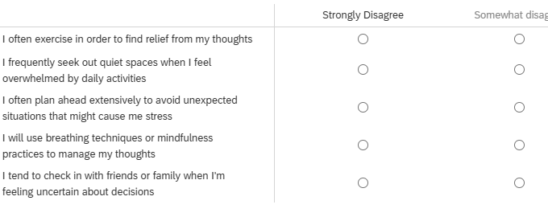

```{r setup, include=FALSE}
source('../assets/setup.R')
```

One reason it's difficult to quantify abstract psychological constructs is because they are multifaceted - "anxiety" is quite a big concept, which we can think of from various angles. We want to be confident that when we ask person A about their anxiety, they are responding about the same thing as when we ask person B. One way to feel more confident about this is to ask a bunch of questions that get at the concept from various angles, and hope that the commonalities between these variables comes through. 
Suppose we have 5 questions that we ask people to indicate agreement/disagreement with ( as in @fig-qitems). 

```{r}
#| label: fig-qitems
#| fig-cap: "5 questionnaire items that measure something. Maybe."
#| echo: false

```

However, it's not quite a simple as just "to measure X let's ask a bunch of questions about X". We need to think carefully about the quality of the measurement tool.  

The term **"construct validity"** is used to refer to how well a measurement tool captures teh construct that it purports to measure. Put another way, we might ask whether people filling out the questionnaire in @fig-qitems is actually capturing anything about their levels of "anxiety" - this would be questioning the validity of the measurement tool.  

Evaluating 'validity' is about getting into the weeds of what exactly the construct is. It's very easy to keep everything surface-level and say that we know what a construct like "anxiety" is, but when we think a little deeper, the idea becomes far more abstract and nebulous. 

{width="250px" fig-align="center"}

If you take a look at the wordings of the questions in @fig-qitems, you could argue that they are all statements about behaviours we consider to be a result of anxiety (i.e., avoidance behaviours, excessive worry, reassurance seeking, etc). But switch your perspective and consider how they could be seen as behaviours that represent healthy coping strategies (i.e., proactive stress management, social support utilization etc.). So what do these 5 questionnaire items measure? What does it mean if I indicate "strongly agree" to all 5 items? Does it mean I have more "anxiety"? Or does it mean I have better "coping strategies"? Neither? Both?  

:::sticky

- **Validity:** whether our measurement instrument actually measures the thing we think it measures.    

<small>

- *NOTE: "validity" is not a property of a specific context. Just because a measurement tool appears to be valid in one instance, it does not mean that it will continue to be valid when used for any other persons, or in any other place, or at any other time. What this means is that when doing research we _can't_ just say "I used [insert measure here] that has been shown to be valid", and simply assume that these properties also hold in our current study.*

</small>

:::

## Different types of validity

There are various different forms of validity, but broadly speaking they all come down to the idea of "if it walks like a duck and quacks like a duck..."^[Amusingly (at least to me), the word "duck" is apparently not a meaningful part of ornithological taxonomy. There are some things that we call "geese" that are more closely related to some things that we call "ducks" than other things that we call "ducks". And don't get started on "goosanders"!]  

- ... does it look like a duck? **(Face validity)**
- ... does it have all the key parts of a duck? **(Content validity)**
- ... does the duck look like another duck? Can we tell it apart from a pigeon? **(Convergent and discriminant validity)**
- ... how much does my duck look like "the perfect duck"? If I am a duck, will there be duck eggs in my future? **(Criterion/predictive validity)**


## Face Validity
_does it look like a duck?_  


Face validity is essentially asking whether, "on the face of it", the measure appears to be measuring the construct. For instance, if we are measuring the construct "anxiety", then do we have questions that refer to things that are about "anxiety"? These might be questions referring to "anxious"/"worried" feelings, or behaviours that we believe to be indicative of anxiety (fidgetting, trouble sleeping) etc. For a more objective example: a maths test that contains only arithmetic problems has good face validity of measuring math ability.  

:::sticky
**Face validity:** The extent to which a measurement tool appears, on the surface, to measure what it claims to measure. 
:::

"Appearing on the surface to measure what it claims to measure" means that face validity can vary a lot, based on what a given community considers reasonable at a given moment in time.
As such, face validity is **not sufficient** for claiming construct validity. For instance, back in the not so distant past, there were many prominent psychologists for whom [measuring peoples' skulls](https://en.wikipedia.org/wiki/Phrenology){target="_blank"} or [looking at people's handwriting](https://en.wikipedia.org/wiki/Graphology){target="_blank"} were face-valid approaches of assessing personality.

Similarly, face validity is **not necessary** for construct validity. In fact, a lot of questions are designed to deliberately prevent respondents from figuring out the intended construct and so manipulating their answers. For instance, a question in the Minnesota Multiphasic Personality Inventory (MMPI) asks things like "I think I would like the work of a librarian" as an indicator of paranoia, because a preference for isolated work might indicate a withdrawing from social situations that is associated with paranoia.  

## Content Validity
_does it have all the key parts of a duck?_  

The term "Content validity" is used to refer to the idea that a measure captures (loosely) 'all important aspects' of the construct. For example, if we have a measure of "anxiety", then we want to ensure that we have items that are representative of the various things that we understand to be "anxiety". We would hopefully have items that capture feelings of worriedness, but also items that capture behavioural responses (e.g., avoidance behaviours, or fidgetting and distraction behaviours), and some that capture anxious thoughts.  

:::sticky
**Content validity:** The extent to which we have a representative sample of items to cover the content domains that are suggested by our theory.
:::

If we don't have content validity, then our measure might actually be capturing a much more narrow idea than we want (e.g., a specific type of, or feature of, anxiety).  


## Convergent & Discriminant Validity
_Does the duck look like another duck? Can we tell it apart from a pigeon?_  

Both "face validity" and "content validity" are not easily assessed, and so ultimately it comes down to just reading the items and thinking about the theory of what we actually _mean_ with some construct like "anxiety".  

However, there are forms of validity for which we can use stats to (albeit indirectly) inform our trust in the measurement: **"convergent validity"** and **"discriminant validity"**.
Loosely speaking, when we assess convergent validity, we want to see whether the measure correlates with measures of other things that we'd (theoretically) expect it to correlate with.
And when we assess discriminant validity, we want to see whether the measure _doesn't correlate_ with things that we'd expect it _not_ to correlate with.

For example, if the five items in @fig-qitems were part of a new measure called
"The Edinburgh Anxiety Scale"^[Couldn't bring myself to call it "the Josiah King Anxiety Scale"! :D], then I would hope that this measure a) correlates highly with other established measures of anxiety (like the GAD-7) and b) correlates only weakly/moderately with something we don't consider to be highly correlated with anxiety, such as a measure of depression (like the Beck depression inventory).

::: {.callout-caution collapse="true"}
#### Rabbit hole: Why depression? Why not something really different?

If we want our measure to achieve high discriminant validity, then surely we'd do better if we compared anxiety against something really different from anxiety, like colour perception or spatial reasoning?

It's true that a measure of anxiety is likely to be unrelated to a measure of colour perception.
But they're so unrelated that the comparison isn't really that interesting.

We learn a lot more about our measure of anxiety if it's unrelated from a related but distinct concept such as depression.
:::


The key thing here is that we want to ensure that two measures of the same thing will be highly correlated, but also that measures of different things are not too highly correlated. This latter idea is important because we want to ensure that we're not accidentally measuring something else! It leads back to the idea of the ["jingle-jangle fallacies"](https://en.wikipedia.org/wiki/Jingle-jangle_fallacies){target="_blank"} - if I create a measure of "anxiety" I would like to be confident that it's measuring something different from "depression", say.

:::sticky
**Convergent validity:** The extent to which scores on a measurement tool are related to scores on other measures of the same construct.  

**Discriminant validity:** The extent to which scores on a measurement tool do not correlate strongly with measures of unrelated constructs. 
:::

So how do we assess convergent and discriminant validity of our measure?
We build what's called a "nomological net": a representation of how theoretical constructs are related to one another.
To do this, we would measure people on "The Edinburgh Anxiety Scale" and also on the GAD7 and also on Beck's Depression Inventory. We would then fit a CFA model and examine the correlations between the factors:  

```
EAS =~ e1 + e2 + e3 + ....
GAD =~ g1 + g2 + g3 + ....
BDI =~ b1 + b2 + b3 + ....

EAS ~~ GAD
EAS ~~ BDI
GAD ~~ BDI
```

## Criterion/Predictive validity
_How much does my duck look like 'the perfect duck'? If I am a duck, will there be duck eggs in my future?_  

Criterion validity assesses how well our measurements correlate with some other, separate 'standard'. For example, we might be intersted in how well a short screening tool for cognitive impairment correlates with a full neuropsychological assessment. 

Often, the 'standard' is some future event, and in this case, this idea gets termed 'predictive validity'. A common example is that in the USA, many colleges have entrance exams, and so we might reasonably ask if scores on the exam predict their performance in their first year of college. Similarly, we might ask if scores on a driving test predict lower accident risk.  

:::sticky
**Criterion validity:** The degree to which scores on a measurement tool correlate with some independent, external standard (or 'criterion'). Very often this is the **prediction** of some future event, in which case we might talk about **predictive validity**.  
:::
