```{r setup, include=FALSE}
source('../assets/setup.R')
```


## Pattern Matrix

```{r}
#| echo: false
#| out-width: "100%"
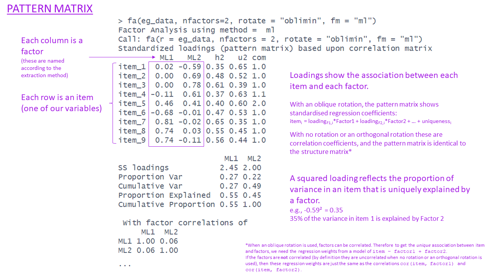
```


## Communalities

```{r}
#| echo: false
#| out-width: "100%"
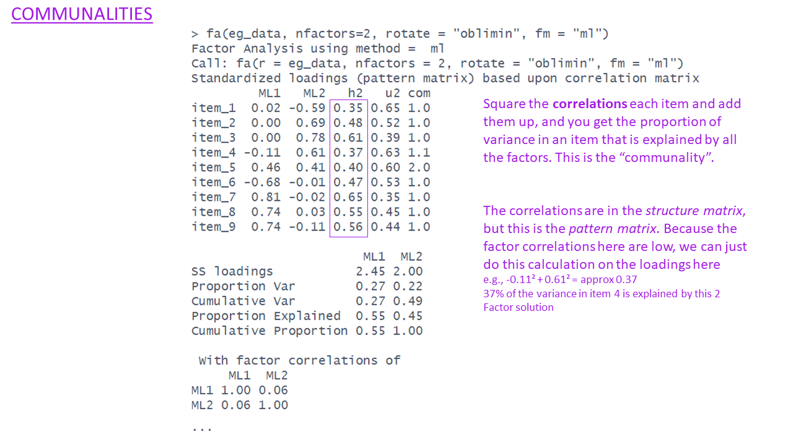
```


## Uniqueness

```{r}
#| echo: false
#| out-width: "100%"
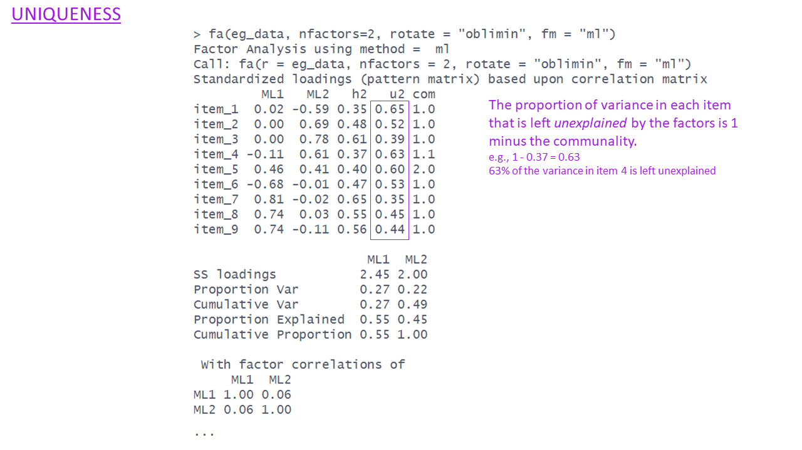
```


## Complexities

```{r}
#| echo: false
#| out-width: "100%"
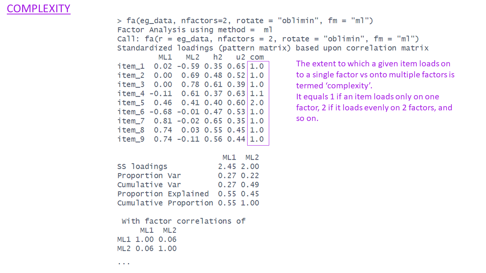
```

## SS loadings & Variance Accounted for

```{r}
#| echo: false
#| out-width: "100%"
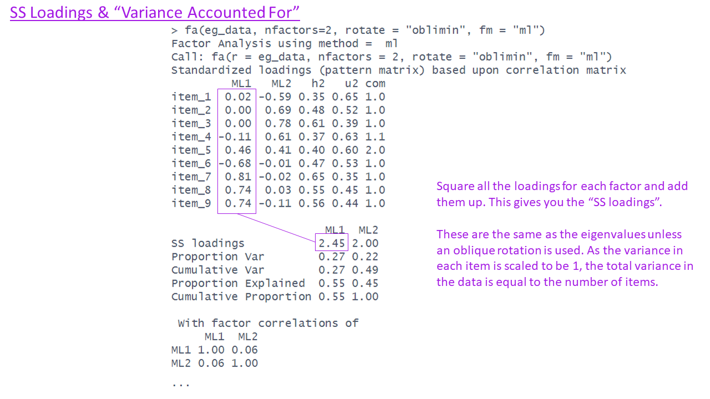
```

```{r}
#| echo: false
#| out-width: "100%"
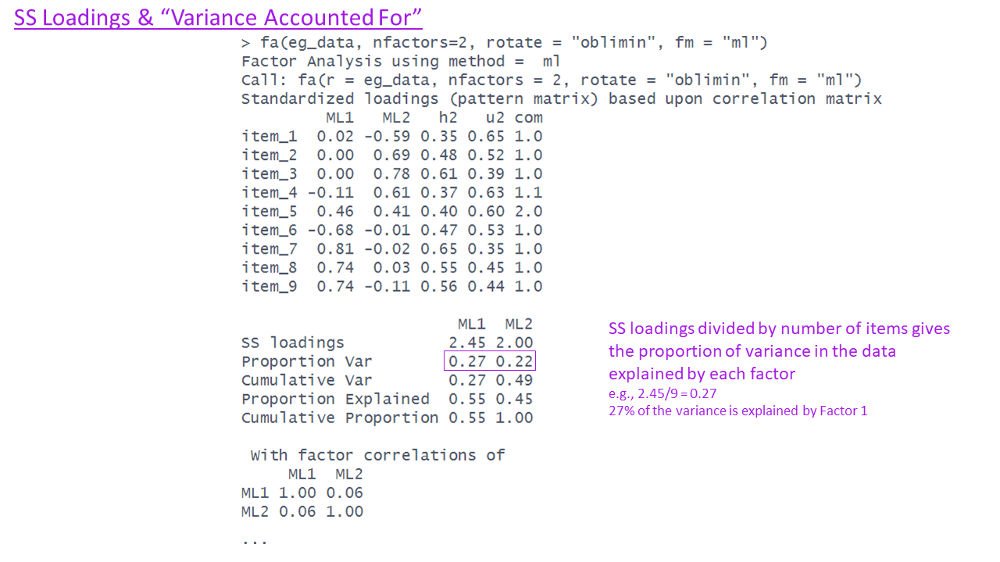
```

```{r}
#| echo: false
#| out-width: "100%"
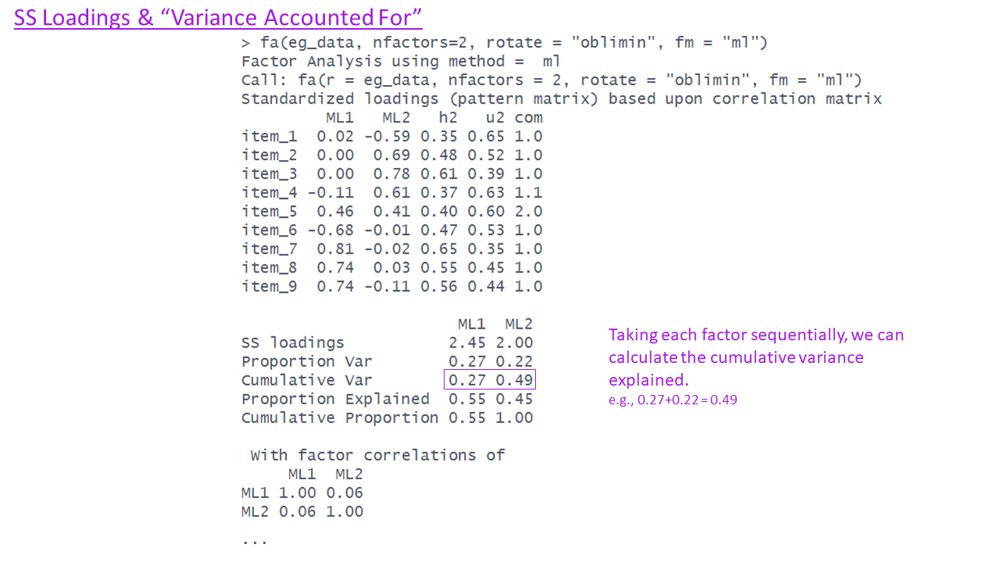
```
```{r}
#| echo: false
#| out-width: "100%"
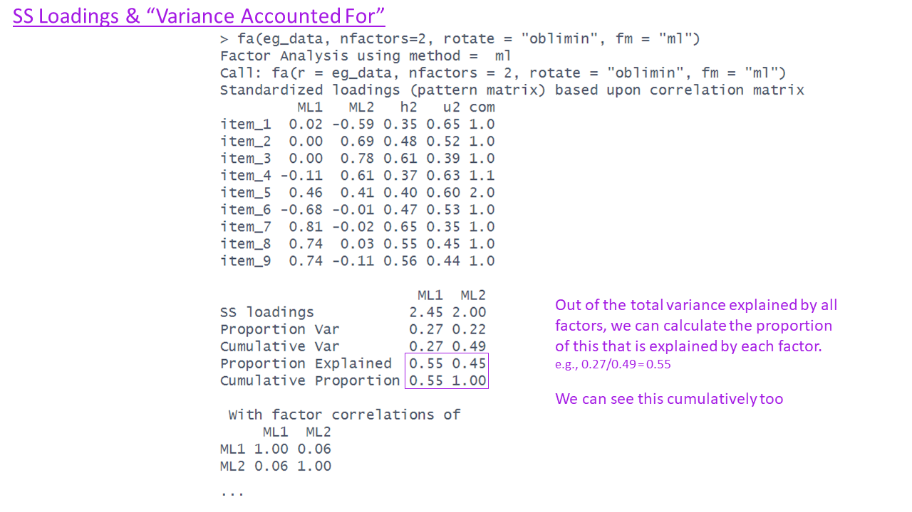
```

## Factor Correlations
```{r}
#| echo: false
#| out-width: "100%"
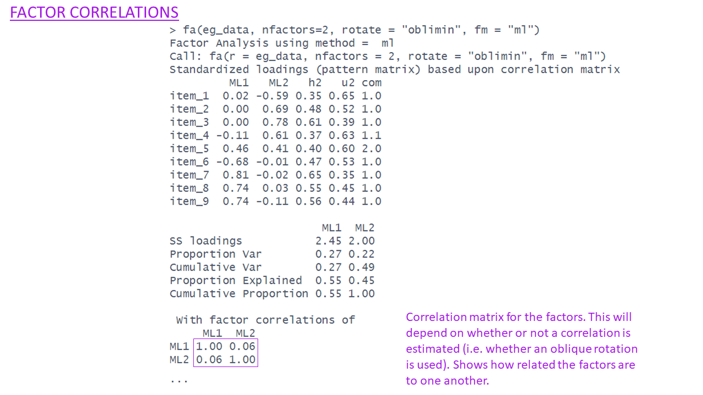
```


## Optional Extras: Fit indices etc.  

```{r}
#| echo: false
#| out-width: "100%"
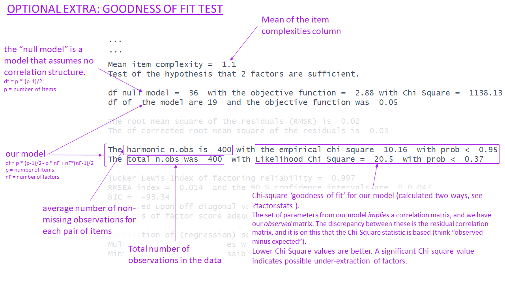
```
```{r}
#| echo: false
#| out-width: "100%"
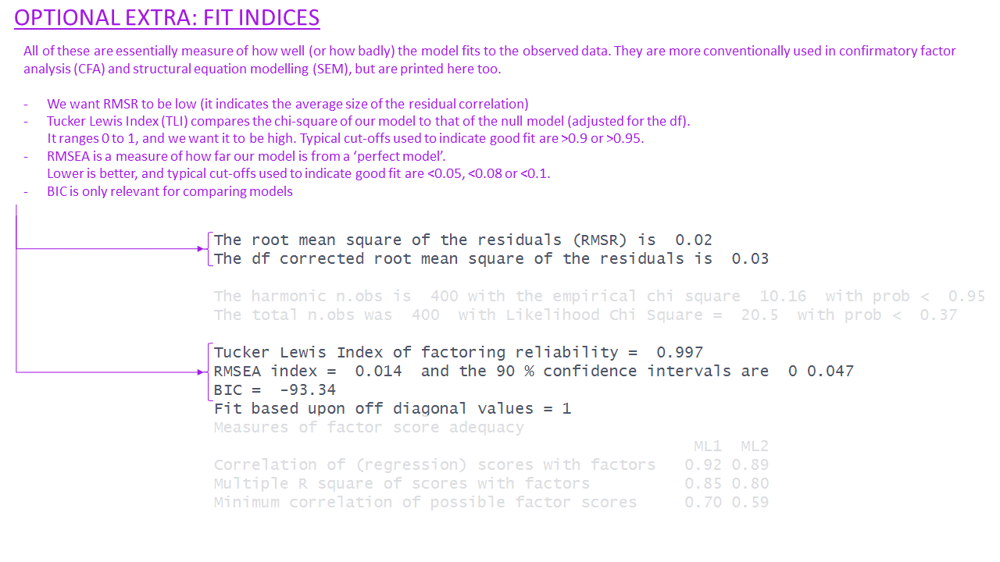
```
```{r}
#| echo: false
#| out-width: "100%"
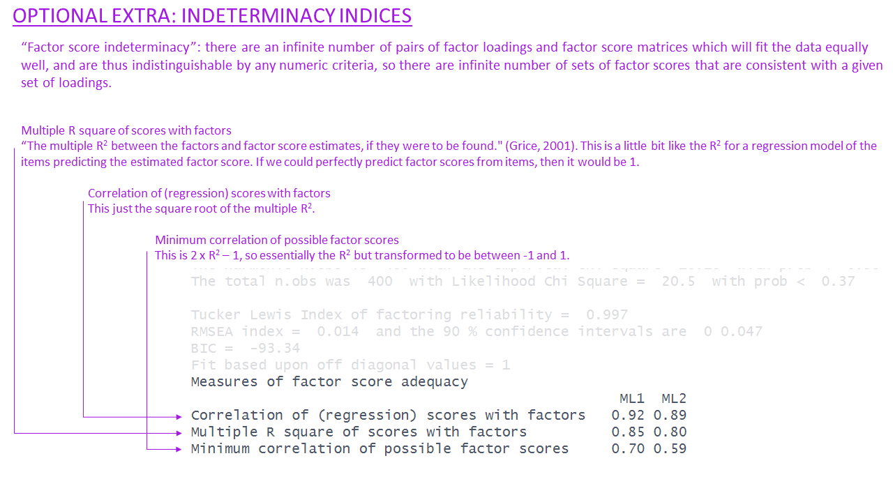
```

