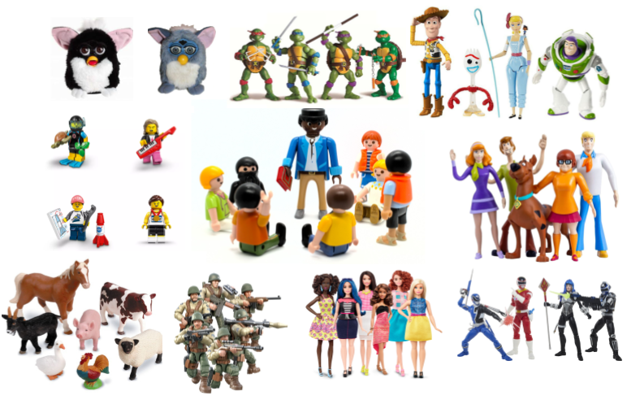

```{r setup, include=FALSE}
source('assets/setup.R')
library(tidyverse)
library(patchwork)
```


:::lo
**Preliminaries**  
 
1. Open Rstudio, and **create a new project for this course!!** 
2. Create a new RMarkdown document or R script (whichever you like) for this week. 

:::

# New Packages!  
:::rtip

These are the main packages we're going to use in this block. It might make sense to install them now if you do not have them already (note, the rstudio.ppls.ed.ac.uk server already has `lme4` and `tidyverse` installed for you).  

+ __tidyverse__ : for organising data  
+ __ICC__ : for quickly calculating intraclass correlation coefficient
+ __lme4__ : for fitting generalised linear mixed effects models
+ __lmeresampler__ : for bootstrapping!
+ __effects__ : for tabulating and graphing effects in linear models
+ __broom.mixed__ : tidying methods for mixed models
+ __sjPlot__ : for plotting models
+ __DHARMa__ : for simulating residuals to assess assumptions
+ __HLMdiag__ : for examining case diagnostics at multiple levels


```{r eval=FALSE}
install.packages(c("tidyverse","ICC","lme4","effects","broom.mixed","sjPlot","HLMdiag"))
# the lmeresampler package has had some recent updates. better to install the most recent version:
install.packages("devtools")
devtools::install_github("aloy/lmeresampler")
```


:::

```{r include=FALSE}
library(tidyverse)
library(lme4)
library(broom.mixed)
library(effects)
```


# Linear model refresh   

:::statbox

Recall that in the DAPR2 course last year we learned all about the linear regression model, which took the form:

$$
\begin{align}\\
& \text{for observation }i \\
& \color{red}{Y_i} = \color{blue}{\beta_0 \cdot{} 1 + \beta_1 \cdot{} X_{1i} \ + \ ... \ + \ \beta_p \cdot{} X_{pi}} + \varepsilon_i \\ 
\end{align}
$$

And if we wanted to write this more simply, we can express $X_1$ to $X_p$ as an $n \times p$ matrix (samplesize $\times$ parameters), and $\beta_0$ to $\beta_p$ as a vector of coefficients:

$$
\mathbf{y} = \boldsymbol{X\beta} + \boldsymbol{\varepsilon}
\quad \\
\text{where} \quad \varepsilon \sim N(0, \sigma) \text{ independently}
$$

:::

:::frame
__Data: Toy Data__  
  
Let's consider a little toy example in which we might use linear regression to determine how practice (in hours per week) influences the reading age of different toy figurines
```{r eval=FALSE,echo=FALSE, fig.cap = "[(Image and example from USMR Week 8 Lecture](https://uoepsy.github.io/usmr/lectures/lecture_7.html#29))", out.width="100px",fig.align="center"}
knitr::include_graphics("images/intro/reading.png")
```
  
Imagine that we have data on various types of toys, from Playmobil, to Powerrangers, to farm animals.  
You can find a dataset at https://uoepsy.github.io/data/toyexample.csv, and read it into your R environment using the code below: 
```{r eval=FALSE}
toys_read <- read_csv("https://uoepsy.github.io/data/toyexample.csv")
```
  
The dataset contains information on 132 different toy figures. You can see the variables in the table below^[Image sources:<br>http://tophatsasquatch.com/2012-tmnt-classics-action-figures/<br>https://www.dezeen.com/2016/02/01/barbie-dolls-fashionista-collection-mattel-new-body-types/<br>https://www.wish.com/product/5da9bc544ab36314cfa7f70c<br>https://www.worldwideshoppingmall.co.uk/toys/jumbo-farm-animals.asp<br>https://www.overstock.com/Sports-Toys/NJ-Croce-Scooby-Doo-5pc.-Bendable-Figure-Set-with-Scooby-Doo-Shaggy-Daphne-Velma-and-Fred/28534567/product.html<br>https://tvtropes.org/pmwiki/pmwiki.php/Toys/Furby<br>https://www.fun.com/toy-story-4-figure-4-pack.html<br>https://www.johnlewis.com/lego-minifigures-71027-series-20-pack/p5079461].
<br>
<div style="display:inline-block; width: 45%;vertical-align: middle;">
```{r echo=FALSE, out.width="300px",fig.align="center"}

```
</div>
<div style="display:inline-block; width: 45%;vertical-align: middle;">
```{r echo=FALSE, message=FALSE,warning=FALSE}
library(gt)
toys_read <- read_csv("https://uoepsy.github.io/data/toyexample.csv")
tibble(variable=names(toys_read),
       description=c("Type of Toy","Character","Hours of practice per week","Age (in years)","Reading Age")
) %>% gt()

```
</div>

:::


`r qbegin("A1")`
Read in the toy data from https://uoepsy.github.io/data/toyexample.csv and plot the bivariate relationship between Reading Age and Hrs per Week practice, and then fit the simple linear model: 
$$
\text{Reading Age}_i = \beta_0 + \beta_1 \cdot \text{Hours per week practice}_i + \varepsilon_i
$$
`r qend()`
`r solbegin(show=params$SHOW_SOLS, toggle=params$TOGGLE)`
```{r}
toys_read <- read_csv("https://uoepsy.github.io/data/toyexample.csv") 

ggplot(data = toys_read, aes(x = hrs_week, y = R_AGE))+
  geom_point()+
  geom_smooth(method = "lm")

simplemod <- lm(R_AGE ~ hrs_week, data = toys_read)
summary(simplemod)
```

`r solend()`

`r qbegin("A2")`
Think about the assumptions we make about our model:
$$
\text{where} \quad \varepsilon_i \sim N(0, \sigma) \text{ independently}
$$
Have we satisfied this assumption (specifically, the assumption of *independence* of errors)? 
`r qend()`

`r solbegin(show=TRUE, toggle=params$TOGGLE)`
Our model from the previous question will assume that the residuals for all toys are independent of one another. But is this a reasonable assumption that we can make? Might we not think that the Playmobil characters could be generally better at reading than the Power Rangers? Or even that ScoobyDoo figurines might be more receptive to practice than the Sock Puppets are?   

The natural grouping of the toys into their respective type introduces a level of *dependence* which we would be best to account for.  
`r solend()`

`r qbegin("A3")`
Try running the code below.  
```{r eval=FALSE}
ggplot(data = toys_read, aes(x=hrs_week, y=R_AGE))+
  geom_point()+
  geom_smooth(method="lm",se=FALSE)
```
Then try editing the code to include an aesthetic mapping from the type of toy to the color in the plot.  
How do your thoughts about the relationship between Reading Age and Practice change?
`r qend()`
`r solbegin(show=params$SHOW_SOLS, toggle=params$TOGGLE)`

```{r}
ggplot(data = toys_read, aes(x=hrs_week, y=R_AGE))+
  geom_point()+
  geom_smooth(method="lm",se=FALSE)
```

```{r}
ggplot(data = toys_read, aes(x=hrs_week, y=R_AGE, col=toy_type))+
  geom_point()+
  geom_smooth(method="lm",se=FALSE)
```
  
From the second plot, we see a lot of the toy types appear to have a positive relationship (practice increases reading age). There seem to be differences between toy types in both the general reading level (Scooby Doo characters can read very well), and in how practice influences reading age (for instance, the Farm Animals don't seem to improve at all with practice!). 

`r solend()`

:::frame
**Complete Pooling**  

We can consider the simple regression model (`lm(R_AGE ~ hrs_week, data = toys_read)`) to "pool" the information from all observations together. In this 'Complete Pooling' approach, we simply ignore the natural clustering of the toys, as if we were unaware of it. The problem is that this assumes the same regression line for all toy types, which might not be that appropriate:  

```{r echo=FALSE, out.width="350px", fig.align="center", fig.cap="Complete pooling can lead to bad fit for certain groups"}
ggplot(toys_read, aes(x=hrs_week, y=R_AGE))+
  geom_point(size=3, alpha=.1)+
  geom_abline(intercept = coef(simplemod)[1], slope = coef(simplemod)[2], lwd=2)+
  geom_text(inherit.aes=F,x=4.5,y=8, label="Complete Pooling Line")+
  theme(text=element_text(size=21))+
  geom_point(data = filter(toys_read, str_detect(toy_type, "Scooby|Farm")), size=3, aes(col=toy_type))
```

  
**No Pooling**  

There are various ways we could attempt to deal with the problem that our data are in groups (or "clusters"). With the tools you have learned in DAPR2, you may be tempted to try including toy type in the model as another predictor, to allow for some toy types being generally better than others:
```{r eval=FALSE}
lm(R_AGE ~ hrs_week + toy_type, data = toys_read)
```
Or even to include an interaction to allow for toy types to respond differently to practice:
```{r eval=FALSE}
lm(R_AGE ~ hrs_week * toy_type, data = toys_read)
```

This approach gets termed the "No Pooling" method, because the information from each cluster contributes *only* to an estimated parameter for that cluster, and there is no pooling of information across clusters. This is a good start, but it means that a) we are estimating *a lot* of parameters, and b) we are not necessarily estimating the parameter of interest (the *overall* effect of practice on reading age). Furthermore, we'll probably end up having high variance in the estimates at each group.  

:::

`r qbegin("A4")`
Fit a linear model which accounts for the grouping of toys into their different types, but holds the effect of practice-hours-per-week on reading age as constant across types:
```{r}
mod1 <- lm(R_AGE ~ hrs_week + toy_type, data = toys_read)
```

Can you construct a plot of the **fitted** values from this model, coloured by toy_type?  
(Hint: you might want to use the `augment()` function from the **broom** package)

`r qend()`
`r solbegin(show=params$SHOW_SOLS, toggle=params$TOGGLE)`

```{r}
library(broom)
augment(mod1) %>%
  ggplot(.,aes(x=hrs_week, y=.fitted, col=toy_type))+
  geom_line()
```
`r solend()`

`r qbegin("A5")`
What happens (to the plot, and to your parameter estimates) when you include the interaction between `toy_type` and `hrs_week`?
`r qend()`
`r solbegin(show=params$SHOW_SOLS, toggle=params$TOGGLE)`
```{r}
mod2 <- lm(R_AGE ~ hrs_week * toy_type, data = toys_read)

broom::augment(mod2) %>%
  ggplot(.,aes(x=hrs_week, y=.fitted, col=toy_type))+
  geom_line()
```
We can see now that our model is fitting a different relationship between reading age and practice for each toy type. This is good - we're going to get better estimates for different types of toy (e.g. scooby doo's reading age increases with practice, farm animals don't).  

We can see that this model provides a better fit - it results in a significant reduction in the residual sums of squares:
```{r}
anova(mod1, mod2)
```

But accounting for this heterogeneity over clusters in the effect of interest comes at the expense of not pooling information across groups to get one estimate for "the effect of practice on reading age". Additionally, these models will tend to have low statistical power because they are using fewer observations (only those within each cluster) to estimate parameters which only represent within-cluster effects.  
`r solend()`


# Some Data Wrangling

:::frame
**Data: Raising the stakes**

30 volunteers from an amateur basketball league participated in a study on stress induced by size and type of potential reward for successfully completing a throw. Each participant completed 20 trials in which they were tasked with throwing a basketball and scoring a goal in order to win a wager. The size of the wager varied between trials, ranging from 1 to 20 points, with the order randomised for each participant. If a participant successfully threw the ball in the basket, then their score increased accordingly. If they missed, their score decreased accordingly. Participants were informed of the size of the potential reward/loss prior to each throw.  

To examine the influence of the *type* of reward/loss on stress-levels, the study consisted of two conditions. In the monetary condition, (n = 15) participants were informed at the start of the study that the points corresponded to a monetary reward, and that they would be given their total score in £ at the end of the study. In the reputation condition, (n = 15) participants were informed that the points would be inputted on to a scoreboard and distributed around the local basketball clubs and in the league newsletter. 

Throughout each trial, participants' heart rate variability (HRV) was measured via a chest strap. HRV is considered to be indirectly related to levels of stress (i.e., higher HRV = less stress).

The data is in stored in two separate files.  

- Information on the conditions for each trial for each participant is stored in __.csv__ format at https://uoepsy.github.io/data/basketballconditions.csv. 
- Information on participants' HRV for each trial is stored in **.xlsx** format, and can be downloaded from https://uoepsy.github.io/data/basketballhrv.xlsx 

:::


We're going to need to do some data wrangling now, so take a read through the boxes below on reshaping and merging data.

:::rtip
**Pivot!**    

One of the more confusing things to get to grips with is the idea of reshaping a dataframe.  
For different reasons, you might sometimes want to have data in wide, or in long format. 

```{r echo=FALSE, fig.cap="Source: https://fromthebottomoftheheap.net/2019/10/25/pivoting-tidily/"}
knitr::include_graphics("https://www.fromthebottomoftheheap.net/assets/img/posts/tidyr-longer-wider.gif")
```

When the data is wide, we can make it long using `pivot_longer()`. When we make data longer, we're essentially making lots of columns into 2 longer columns. Above, in the animation, the wide variable **x**, **y** and **z** go into a new longer column called **name** that specifies which (x/y/z) it came from, and the values get put into the **val** column.  

The animation takes a shortcut in the code it displays above, but you could also use `pivot_longer(c(x,y,z), names_to = "name", values_to = "val")`. To reverse this, and put it back to being wide, we tell R which columns to take the names and values *from*: `pivot_wider(names_from = name, values_from = val)`.  
:::

:::rtip
__Joining data__

Now comes a fun bit. 
You may have noticed that we have two datasets for this study. If we are interested in relationships between the heart rate variability (HRV) of participants during each trial, as well as the experimental manipulations (i.e., the condition of each trial), these are currently in different datasets.  
Solution: we need to join them together!  

Provided that both data-sets contain information on participant number and trial number, which uniquely identify each observation, we can join them together matching on those variables!  

There are lots of different ways to join data-sets, depending on whether we want to keep rows from one data-set or the other, or keep only those in both data-sets etc. 

```{r echo=FALSE, fig.cap="Check out the help documentation for them all using `?full_join`."}
knitr::include_graphics("images/messy/joins.png")
```

:::


`r qbegin("B1")`
Get the data into your R session. 

__Note:__ For one of the files, this is a bit different to how we have given you data in previous exercises. You may remember that for a __.csv__ file, you can read directly into R from the link using, `read_csv("https://uoepsy.......)`.  

However, in reality you are likely to be confronted with data in all sorts of weird formats, such as __.xlsx__ files from MS Excel. Have a look around the internet to try and find any packages/functions/techniques for getting both the datasets in to R. 

`r qend()`
`r solbegin(show=TRUE, toggle=params$TOGGLE)`

```{r}
bball <- read_csv("https://uoepsy.github.io/data/basketballconditions.csv")
head(bball)
```

For the __.xlsx__ data:

- Step 1: download the data to your computer  
- Step 2: load the __readxl__ package.  
- Step 3: use the `read_xlsx()` function to read in the data, pointing it to the relevant place on your computer. 

You can actually do all these steps from within R.
```{r}
# Step 1
download.file(url = "https://uoepsy.github.io/data/basketballhrv.xlsx", 
              destfile = "baskeballhrvdata.xlsx")
# Step 2
library(readxl)
# Step 3
bballhrv <- read_xlsx("baskeballhrvdata.xlsx")
head(bballhrv)
```

`r solend()`

:::imp

Unfortunartely, a few students are getting error messages which we could not solve when trying to read in the xlsx data. The same data is available at https://uoepsy.github.io/data/bballhrv.csv so that you can read it in using:
```{r eval=F}
read_csv("https://uoepsy.github.io/data/bballhrv.csv")
```

:::


`r qbegin("B2")`
Is each dataset in wide or long format? We want them both in long format, so try to reshape either/both if necessary.

Hint - in the tidyverse functions, you can specify all columns between column **x** and column **z** by using the colon, `x:z`.  

`r qend()`
`r solbegin(show=TRUE, toggle=params$TOGGLE)`
Only the HRV data is in wide format:
```{r}
head(bballhrv)
```

```{r}
bballhrv <-
  bballhrv %>%
  pivot_longer(trial_1:trial_20, names_to = "trial_no", values_to = "hrv")

head(bballhrv)
```
`r solend()`

`r qbegin("B3")`
join the two datasets (both in long format) together. 

Note that the variables we are matching on need to have the information in the same format. For instance, R won't be able to match `"trial_1","trial_2","trial_3"` with `1, 2, 3` because they are different things. We would need to edit one of them to be in the same format.  

**Hint:** You should end up with 600 rows.  

`r qend()`
`r solbegin(show=TRUE, toggle=params$TOGGLE)`
```{r}
bball <- full_join(bball, bballhrv)
head(bball)
```
`r solend()`

# Exploring Clustering

`r qbegin("B4")`
Continuing with our basketball/hrv study, consider the following questions:  
  
What are the units of observations?  
What are the groups/clusters?  
What varies *within* these clusters?  
What varies *between* these clusters?  
`r qend()`
`r solbegin(show=params$SHOW_SOLS, toggle=params$TOGGLE)`

What are the units of observations? __trials__  
What are the groups/clusters? __participants__
What varies *within* these clusters? __size of reward__    
What varies *between* these clusters? __type of reward__  

`r solend()`

`r qbegin("B5")`
Now that you have tidied and joined all the data together, plot the relationship between size of reward and HRV, ignoring the fact that there are repeated observations for each subject.  
Can you make a separate plot for each of the experimental conditions? (Hint: `facet_wrap()`)
`r qend()`
`r solbegin(show=params$SHOW_SOLS, toggle=params$TOGGLE)`
```{r}
ggplot(bball, aes(x=stakes,y=hrv))+geom_smooth(method="lm", alpha=.2)+
  geom_point() +
  facet_wrap(~condition)
```
`r solend()`

`r qbegin("B6")`
> How are stress levels (measured via HRV) influenced by the size of potential reward/loss?  

Ignore the clustering, and fit a simple linear regression estimating how heart rate variability is influenced by how high the stakes are (i.e. how big the reward is) for a given throw.  
`r qend()`
`r solbegin(show=params$SHOW_SOLS, toggle=params$TOGGLE)`
```{r}
simple_mod <- lm(hrv ~ stakes, data = bball)
summary(simple_mod)
```
`r solend()`


`r qbegin("B7")`
Consider the following research question:

> How do size and type of reward/loss interact to influence levels of stress?  

Extend your model to include the interaction between stakes and experimental condition and examine the parameter values.
`r qend()`
`r solbegin(show=params$SHOW_SOLS, toggle=params$TOGGLE)`
```{r}
simple_mod <- lm(hrv ~ condition*stakes, data = bball)
anova(simple_mod)
summary(simple_mod)
```
```{r include=F}
res = summary(simple_mod)$coefficients %>% round(2)
```
:::int
Heart Rate Variability (HRV) was found to be influenced by both the size of the potential reward/loss of a given trial, whether whether participants were playing for money or for a place on the scoreboard, and the interaction between the two. 
For a 1 point increase in stakes, HRV decreased by `r res[4,1]` ($SE=`r res[4,2]`,t(`r simple_mod[["df.residual"]]`)=`r res[4,3]`,p=`r res[4,4]`$)**** in the condition in which participants played for money relative to that in which participants played for kudos, suggesting that the size of the reward has a greater effect on stress levels when playing for money compared to playing for reputation.  
   
**** __Caveat:__ Our model did __not__ account for by-participant clustering of data, thereby violating the assumption that errors are iid (independent and identically distributed). 
:::
`r solend()`

`r qbegin("B8")`
Let's start to examine the clustering a bit more.  
Plot the relationship between size of reward and HRV, with a separate line for each subject. 
  
__Hint:__ remember the `group = ` aesthetic in ggplot!
`r qend()`
`r solbegin(show=params$SHOW_SOLS, toggle=params$TOGGLE)`
```{r}
ggplot(bball, aes(x=stakes, y=hrv, group=sub, col=condition))+
  geom_smooth(method="lm",se=F, alpha=.2)+
  geom_point()+NULL
```
`r solend()`

`r qbegin("B9")`
Calculate the ICC, using the `ICCbare()` function from the **ICC** package.  

Remember, you can look up the help for a function by typing a `?` followed by the function name in the console. 
`r qend()`
`r solbegin(show=params$SHOW_SOLS, toggle=params$TOGGLE)`
```{r}
library(ICC)
ICCbare(x = sub, y = hrv, data = bball)
```
`r solend()`

`r optbegin("Optional - Extra difficult. Calculate ICC manually", olabel=F)`
We have equal group sizes here (there are 2 $\times$ 15 participants, each with 20 observations), which makes calculating ICC by hand a lot easier, but it's still a bit tricky.  

Let's take a look at the formula for ICC

$$
\begin{align}
ICC \; (\rho) = & \frac{\sigma^2_{b}}{\sigma^2_{b} + \sigma^2_e} \\
\qquad \\
= & \frac{\frac{MS_b - MS_e}{k}}{\frac{MS_b - MS_e}{k} + MS_e} \\
\qquad \\
= & \frac{MS_b - MS_e}{MS_b + (k-1)MS_e} \\
\qquad \\
\qquad \\
\text{Where:} & \\ 
k = & \textrm{number of observations in each group} \\
MS_b = & \textrm{Mean Squares between groups} = \frac{\text{Sums Squares between groups}}{df_\text{groups}}
= \frac{\sum\limits_{i=1}(\bar{y}_i - \bar{y})^2}{\textrm{n groups}-1}\\
MS_e = & \textrm{Mean Squares within groups} \frac{\text{Sums Squares within groups}}{df_\text{within groups}} 
= \frac{\sum\limits_{i=1}\sum\limits_{j=1}(y_{ij} - \bar{y_i})^2}{\textrm{n obs}-\textrm{n groups}}\\
\end{align}
$$
So we're going to need to calculate the grand mean of $y$, the group means of $y$, and then the various squared differences between group means and grand mean, and between observations and their respective group means.  

The code below will give us a new column which is the overall mean of y. This bit is fairly straightforward. 
```{r eval=F}
bball %>% mutate(
  grand_mean = mean(hrv)
)
```


:::rtip
We have seen a lot of the combination of `group_by() %>% summarise()`, but we can also combine `group_by()` with `mutate()`!
:::

Try the following:
```{r eval=F}
bball %>% mutate(
    grand_mean = mean(hrv)
  ) %>% 
  group_by(sub) %>%
  mutate(
    group_mean = mean(hrv)
  )
```


:::rtip
**The grouping gets carried forward.**  

Using `group_by()` can quite easily land you in trouble if you forget that you have grouped the dataframe. 

Look at the output of `class()` when we have grouped the data. It still mentions something about the grouping. 
```{r}
bball <- bball %>% mutate(
    grand_mean = mean(hrv)
  ) %>% 
  group_by(sub) %>%
  mutate(
    group_mean = mean(hrv)
  )

class(bball)
```

To remove the grouping, we can use `ungroup()` (we could also just add this to the end of our code sequence above and re-run it):

```{r}
bball <- ungroup(bball)
class(bball)
```

:::

Now we need to create a column which is the squared differences between the observations $y_{ij}$ and the group means $\bar{y_i}$.  
We also want a column which is the squared differences between the group means $\bar{y_i}$ and the overall mean $\bar{y}$.  
```{r}
bball <- bball %>% 
  mutate(
    within = (hrv-group_mean)^2,
    between = (group_mean-grand_mean)^2
  )
```

And then we want to sum them:
```{r}
ssbetween = sum(bball$between)
sswithin = sum(bball$within)
```

Finally, we divide them by the degrees of freedom. 
```{r}
# Mean Squares between
msb = ssbetween / (30-1)
# Mean Squares within 
mse = sswithin / (600-30)
```

And calculate the ICC!!!
```{r}
# ICC
(msb-mse) /(msb + (19*mse))
```

`r optend()`

:::statbox

**Understanding ICC a bit better**  
  
Think about what ICC represents - the ratio of the variance between the groups to the total variance.  
You can think of the "variance between the groups" as the group means varying around the overall mean (the black dots around the black line), and the total variance as that plus the addition of the variance of the individual observations around each group mean (each set of coloured points around their respective larger black dot):
```{r}
ggplot(bball, aes(x=sub, y=hrv))+
  geom_point(aes(col=sub),alpha=.3)+
  stat_summary(geom = "pointrange")+
  geom_hline(yintercept = mean(bball$hrv))+
  guides(col=FALSE)
```

You can also think of the ICC as the correlation between two randomly drawn observations from the same group. 
This is a bit of a tricky thing to get your head round if you try to relate it to the type of "correlation" that you are familiar with. Pearson's correlation (e.g think about a typical scatterplot) operates on *pairs of observations* (a set of values on the x-axis and their corresponding values on the y-axis), whereas ICC operates on *data which is structured in groups*.  
  
`r optbegin("Optional - ICC as the expected correlation between two observations from same group", olabel=F)`

Let's suppose we had only 2 observations in each group.  
```{r echo=FALSE}
tempdat <- read.csv("../../data/iccexplainer.csv")
head(tempdat) %>% rbind(.,rep("...", 3))
```

```{r include=F}
library(nlme)
res <- lme(y ~ 1, random = ~ 1 | cluster, data=tempdat, method="ML")
ic <- getVarCov(res)[1] / (getVarCov(res)[1] + res$sigma^2)
```
The ICC for this data is `r round(ic,2)`:

Now suppose we *reshape* our data so that we have one row per group, and one column for each observation to look like this:
```{r echo=F}
tempdat_wide <- tempdat %>% 
  pivot_wider(names_from=observation, values_from=y, names_prefix = "obs") 
tempdat_wide %>% head %>% rbind(.,rep("...", 3))
```
Calculating Pearson's correlation on those two columns yields `r cor(tempdat_wide$obs1, tempdat_wide$obs2) %>% round(.,2)`, which isn't quite right. It's close, but not quite.. 

:::imp 
The crucial thing here is that it is completely arbitrary which observations get called "obs1" and which get called "obs2".  
The data aren't paired, but __grouped.__ 
:::

Essentially, there are lots of different combinations of "pairs" here. 
There are the ones we have shown above:
```{r echo=F}
head(tempdat_wide) %>% rbind(., rep("...",3))
```
But we might have equally chosen these:
```{r echo=F}
sample_n(tempdat, n()) %>% arrange(cluster) %>% group_by(cluster) %>% 
  mutate(observation = 1:n()) %>% ungroup %>%
  pivot_wider(names_from=observation, values_from=y, names_prefix = "obs") %>% head() %>% rbind(., rep("...",3))
```
or these:
```{r echo=F}
sample_n(tempdat, n()) %>% arrange(cluster) %>% group_by(cluster) %>% 
  mutate(observation = 1:n()) %>% ungroup %>%
  pivot_wider(names_from=observation, values_from=y, names_prefix = "obs") %>% head() %>% rbind(., rep("...",3))
```

If we take the correlation of all these combinations of pairings, then we get our ICC of `r round(ic, 2)`!

__ICC = the expected correlation of a *randomly drawn pair* of observations from the same group.__

<!-- We could even do this via simulation, and write our own customised function! -->
<!-- The code below creates a function for us to use. Can you figure out how it works?  -->
<!-- ```{r} -->
<!-- get_random_pair <- function(){ -->
<!--   my_sub = sample(unique(bball$sub), 1) -->
<!--   my_obs = sample(bball$hrv[bball$sub == my_sub], size=2) -->
<!--   my_obs -->
<!-- } -->
<!-- ``` -->
<!-- Try it out, by running it several times.  -->
<!-- ```{r} -->
<!-- get_random_pair() -->
<!-- ``` -->

<!-- Now let's make our computer do it loads and loads of times: -->
<!-- ```{r} -->
<!-- # replicate is a way of making R execute the same code repeatedly, n times. -->
<!-- sims <- replicate(1e6, get_random_pair()) -->
<!-- # t() is short for "transpose" and simple rotates the object 90 degrees (so rows become columns and columns become rows) -->
<!-- sims <- t(sims) -->
<!-- cor(sims[,1], sims[,2]) -->

<!-- ``` -->

`r optend()`

:::


<!-- # GEE -->

<!-- if we're just interested in the effect of x on y and want to adjust for the clustering of the data, generalising estimation equations (GEE) can sometimes be useful. They are in some ways more limited than multilevel models, but simplicity can often be a good thing. -->

<!-- GEEs allow fitting of various correlation structures:  -->

<!-- - "independence": the observations within the groups are uncorrelated. -->
<!-- - "exchangeable": each pair of observations in a group has the same correlation. -->
<!-- - "unstructured": each pair of observations in a group is allowed to have a different correlation. -->
<!-- - "ar1": used to fit an autoregressive structure.  -->

<!-- For repeated measures, "exchangeable" is recommended, but if there is some expected temporal correlation (e.g. participants are influenced by their previous trials) then you might consider an autoregressive structure.  -->

<!-- Subjects are already arranged in order, but they need to be numeric. -->
<!-- ```{r} -->
<!-- ## make group id numeric an ordered -->
<!-- bball %>% mutate( -->
<!--   sub = as.numeric(sub) -->
<!--   ) %>% arrange(sub) -->
<!-- ``` -->

<!-- ```{r} -->
<!-- library(geepack) -->
<!-- geemod <- geeglm(hrv ~ stakes, -->
<!--        id=sub, data = bball, -->
<!--        corstr="exchangeable") -->
<!-- ``` -->

<!-- `r qbegin()` -->
<!-- Fit the GEE above, and examine the summary output. The package is designed to be interpreted similarly to `lm()` and `glm()`. -->
<!-- `r qend()` -->
<!-- `r solbegin(show=params$SHOW_SOLS, toggle=params$TOGGLE)` -->
<!-- ```{r} -->
<!-- summary(geemod) -->
<!-- ``` -->
<!-- Note that the point estimate is the same (`coef(geemod)[2]`) as that from our simple model `lm(hrv ~ stakes, data = bball)` but the standard errors are wider (and the relationship is no longer significant).   -->
<!-- `r solend()` -->

# Fixed effects

`r qbegin("C1")`
Let's suppose we want to account for the by-participant clustering in our data with the "No pooling" method (i.e., in our multiple regression model, include participant ID as an additional predictor, along with its interaction with explanatory variable of interest).  

1. Make sure that the participant ID variable is a factor!  
2. Fit the model
3. Use the `plot_model()` function (with `type = "int"`) to plot the interaction terms between `stakes` and each participant. 
   
__Note:__ When examining parameter values, remember to think about how HRV is considered to relate to stress, and whether the direction of any effect you see makes theoretical sense. 

`r qend()`
`r solbegin(show=params$SHOW_SOLS, toggle=params$TOGGLE)`
```{r}
bball <- bball %>% mutate(sub = factor(sub))
nopool_mod <- lm(hrv ~ stakes*sub, data=bball)
sjPlot::plot_model(nopool_mod, type = "int")
```
`r solend()`


`r qbegin("C2")`
We have fitted two models so far:  

1. The complete pooling model: `lm(hrv ~ stakes, data = bball)`, which ignores the fact that our data has some inherent grouping (multiple datapoints per participant)
2. The no pooling model: `lm(hrv ~ stakes*sub, data = bball)`, which estimates only participant-specific effects. 

Compare the two models using `anova()`. Which model provides the best fit?  
`r qend()`
`r solbegin(show=params$SHOW_SOLS, toggle=params$TOGGLE)`
```{r}
pool_mod <- lm(hrv ~ stakes, data=bball)
nopool_mod <- lm(hrv ~ stakes*sub, data=bball)
anova(pool_mod, nopool_mod)
```
We can see that the no pooling model provides a significantly better fit to the data.
`r solend()`


`r qbegin("C3")`
Recall our research question: "__How are stress levels (measured via HRV) influenced by the size of potential reward/loss?__"

From the model `lm(hrv ~ stakes*sub, data=bball)`, do we estimate a parameter that allows us to complete the following sentence?:

- *"For every 1 point increase in reward, heart rate variability changed by _ ? _ units."* 

`r qend()`
`r solbegin(show=params$SHOW_SOLS, toggle=params$TOGGLE)`

Remember that when there is an interaction term, coefficients for individual variables included in the interaction term are __conditional effects.__ In the model `lm(y ~ x * z)`, the coefficient for `x` is the estimated effect of `x` on `y` _when `z=0`_ (and vice versa). When one of these is categorical, 0 is a reference level.  

So we don't really estimate a parameter for the overall effect of `stakes` on `hrv` - we simply have the participant-specific estimates.  

```{r}
summary(nopool_mod)$coefficients
```
`r solend()`

`r qbegin("C4")`
Let's suppose we want to examine the interaction between size and _type_ of reward (`stakes * condition`), using the "no pooling" method (i.e., including participant as a fixed effect).  

We have the variable `stakes`, that varies __within__ each participant, and another variable `condition` that varies __between__ participants.  

This becomes difficult because the `sub` variable (the participant id variable) uniquely identifies the two conditions. Note that if we fit the following model, some coefficients are not defined.
Try it and see:  
```{r eval=FALSE}
lm(hrv ~ stakes*sub + stakes*condition, data=bball)
```

This sort of perfectly balanced design has traditionally been approached with extensions of ANOVA ("repeated measures ANOVA","mixed ANOVA"). These methods can partition out variance due to one level of clustering (e.g. subjects), and can examine factorial designs when one factor is within cluster, and the other is between. You can see an example below if you are interested. However, ANOVA has a lot of constraints - it can't handle multiple levels of clustering (e.g. children in classes in schools), it will likely require treating variables suc as time as a factor, and it's not great with missing data. 
The multi-level model (MLM) provides a more flexible framework, and this is what we will begin to look at next week.  

`r qend()`
