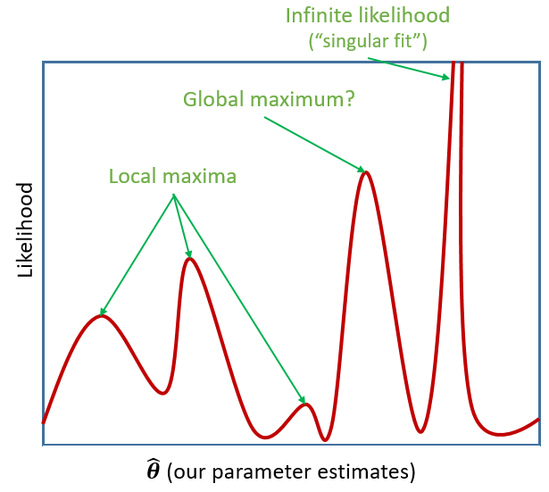

```{r setup, include=FALSE}
source('assets/setup.R')
library(tidyverse)
library(patchwork)
library(effects)
toys_read <- read_csv("https://uoepsy.github.io/data/toyexample.csv")
```

:::green
__Information about solutions__

Solutions for these exercises are available immediately below each question.  
We would like to emphasise that much evidence suggests that testing enhances learning, and we __strongly__ encourage you to make a concerted attempt at answering each question *before* looking at the solutions. Immediately looking at the solutions and then copying the code into your work will lead to poorer learning.  
We would also like to note that there are always many different ways to achieve the same thing in R, and the solutions provided are simply _one_ approach.  

:::


:::lo
**Preliminaries**  
 
1. Create a new RMarkdown document or R script (whichever you like) for this week. 

**A Note on terminology**

The methods we're going to learn about in the first five weeks of this course are known by lots of different names: "multilevel models"; "hierarchical linear models"; "mixed-effect models"; "mixed models"; "nested data models"; "random coefficient models"; "random-effects models"; "random parameter models"... and so on).   

What the idea boils down to is that **model parameters vary at more than one level.** This week, we're going to explore what that means.  

Throughout this course, we will tend to use the terms "mixed effect model", "linear mixed model (LMM)" and "multilevel model (MLM)" interchangeably. 
:::


# Introducing Multilevel Models

:::yellow 

Multilevel Models (MLMs) (or "Linear Mixed Models" (LMMs)) take the approach of allowing the groups/clusters to vary around our $\beta$ estimates. 

In the lectures, we saw this as:

$$
\begin{align}
& \text{for observation }j\text{ in group }i \\
\quad \\
& \text{Level 1:} \\
& \color{red}{y_{ij}} = \color{blue}{\beta_{0i} \cdot 1 + \beta_{1i} \cdot x_{ij}} + \varepsilon_{ij} \\
& \text{Level 2:} \\
& \color{blue}{\beta_{0i}} = \gamma_{00} + \color{orange}{\zeta_{0i}} \\
& \color{blue}{\beta_{1i}} = \gamma_{10} + \color{orange}{\zeta_{1i}} \\
\quad \\
& \text{Where:} \\
& \gamma_{00}\text{ is the population intercept, and }\color{orange}{\zeta_{0i}}\text{ is the deviation of group }i\text{ from }\gamma_{00} \\
& \gamma_{10}\text{ is the population slope, and }\color{orange}{\zeta_{1i}}\text{ is the deviation of group }i\text{ from }\gamma_{10} \\
\end{align}
$$

We are now assuming $\color{orange}{\zeta_0}$, $\color{orange}{\zeta_1}$, and $\varepsilon$ to be normally distributed with a mean of 0, and we denote their variances as $\sigma_{\color{orange}{\zeta_0}}^2$, $\sigma_{\color{orange}{\zeta_1}}^2$, $\sigma_\varepsilon^2$ respectively. 

The $\color{orange}{\zeta}$ components also get termed the "random effects" part of the model, Hence names like "random effects model", etc. 

`r optbegin("Alternative notation", toggle=params$TOGGLE)`
Many people use the symbol $u$ in place of $\zeta$.  
In various resources, you are likely to see $\alpha$ used to denote the intercept instead of $\beta_0$.  

Sometimes, you will see the levels collapsed into one equation, as it might make for more intuitive reading. This often fits with the name "mixed effects" for these models:

$$
\color{red}{y_{ij}} = (\color{blue}{\beta_0} + \color{orange}{\zeta_{0i}}) \cdot 1 + ( \color{blue}{\beta_{1}} + \color{orange}{\zeta_{1i}} ) \cdot x_{ij}  +  \varepsilon_{ij} \\
$$

And then we also have the condensed matrix form of the model, in which the Z matrix represents the grouping structure, and the $u$ (or $\zeta$) are the estimated random deviations. 
$$
\mathbf{y} = \boldsymbol{X\beta} + \boldsymbol{Zu} + \boldsymbol{\varepsilon}
$$
`r optend()`

:::

# Fitting Multilevel Models

## Introducing **lme4** 

:::rtip

We're going to use the `lme4` package, and specifically the functions `lmer()` and `glmer()`.  
"(g)lmer" here stands for "(generalised) linear mixed effects regression". 

You will have seen some use of these functions in the lectures. The broad syntax is:  
<br>
<div style="margin-left:50px;">**lmer(*formula*, REML = *logical*, data = *dataframe*)**</div>    
<br>

We write the first bit of our **formula** just the same as our old friend the normal linear model `y ~ 1 + x + x2 + ...`, where `y` is the name of our outcome variable, `1` is the intercept (which we don't have to explicitly state as it will be included anyway) and `x`, `x2` etc are the names of our explanatory variables.  

With **lme4**, we now have the addition of __random effect terms)), specified in parenthesis with the `|` operator (the vertical line | is often found to the left of the z key on QWERTY keyboards).  
We use the `|` operator to separate the parameters (intercept, slope etc.) on the LHS, from the grouping variable(s) on the RHS, by which we would like to model these parameters as varying.  

__Random Intercept__  
Let us suppose that we wish to model our intercept not as a fixed constant, but as varying randomly according to some grouping around a fixed center. 
We can such a model by allowing the intercept to vary by our grouping variable (`g` below): 

:::statbox
<center>`lmer(y ~ 1 + x + (1|g), data = df)`</center>
$$
\begin{align}
& \text{Level 1:} \\
& \color{red}{Y_{ij}} = \color{blue}{\beta_{0i} \cdot 1 + \beta_{1} \cdot X_{ij}} + \varepsilon_{ij} \\
& \text{Level 2:} \\
& \color{blue}{\beta_{0i}} = \gamma_{00} + \color{orange}{\zeta_{0i}} \\
\end{align}
$$
:::


__Random Slope__  
By extension we can also allow the effect `y~x` to vary between groups, by including the `x` on the left hand side of `|` in the random effects part of the call to `lmer()`.

:::statbox
<center>`lmer(y ~ 1 + x + (1 + x |g), data = df)`</center>
$$
\begin{align}
& \text{Level 1:} \\
& \color{red}{y_{ij}} = \color{blue}{\beta_{0i} \cdot 1 + \beta_{1i} \cdot x_{ij}} + \varepsilon_{ij} \\
& \text{Level 2:} \\
& \color{blue}{\beta_{0i}} = \gamma_{00} + \color{orange}{\zeta_{0i}} \\
& \color{blue}{\beta_{1i}} = \gamma_{10} + \color{orange}{\zeta_{1i}} \\
\end{align}
$$
:::
:::


## Estimation

### Maximum Likelihood (ML)  

Remember back to DAPR2 when we introduced logistic regression, and we briefly discussed **Maximum likelihood** in an explanation of how models are fitted.  

The key idea of *maximum likelihood estimation* (MLE) is that we (well, the computer) iteratively finds the set of estimates for our model which it considers to best reproduce our observed data. Recall our simple linear regression model of how practice (hrs per week) affects reading age: 
$$
\color{red}{ReadingAge_i} = \color{blue}{\beta_0 \cdot{} 1 + \beta_1 \cdot{} Practice_{i}} + \varepsilon_i
$$
There are values of $\beta_0$ and $\beta_1$ and $\sigma_\varepsilon$ which maximise the probability of observing the data that we have. For linear regression, these we obtained these same values a different way, via minimising the sums of squares. And we saw that this is not possible for more complex models (e.g., logistic), which is where we turn to MLE.  

:::statbox
To read about the subtle difference between "likelihood" and "probability", you can find a short explanation at https://uoepsy.github.io/faq/lvp.html
:::

If we are estimating just one single parameter (e.g. a mean), then we can imagine the process of *maximum likelihood estimation* in a one-dimensional world - simply finding the top of the curve: 
```{r echo=FALSE, out.width="350px", fig.cap="MLE"}
knitr::include_graphics("images/intro/mle.png")
```
However, our typical models estimate a whole bunch of parameters. The simple regression model above is already having to estimate $\beta_0$, $\beta_1$ and $\sigma_\varepsilon$, and our multi-level models have far more! With lots of parameters being estimated and all interacting to influence the likelihood, our nice curved line becomes a complex surface (see Left panel of Figure \@ref(fig:multisurf)). So what we (our computers) need to do is find the maximum, but avoid local maxima and singularities (see Figure \@ref(fig:maxima)). 
```{r multisurf, echo=FALSE, out.width="49%", fig.cap="MLE for a more complex model",fig.align='center'}
knitr::include_graphics("images/multisurftb.png")
```

### Restricted Maximum Likelihood (REML)

When it comes to estimating multilevel models, maximum likelihood will consider the fixed effects as unknown values in its estimation of the variance components (the random effect variances). This leads to biased estimates of the variance components, specifically biasing them toward being too small, especially if $n_\textrm{clusters} - n_\textrm{level 2 predictors} - 1 < 50$. Restricted Maximum Likelihood (REML), however, separates the estimation of fixed and random parts of the model, leading to unbiased estimates of the variance components.  

:::rtip
`lmer()` models are by default fitted with REML. This is better for small samples. 
:::


:::statbox
__Comparing Models, ML & REML__  

When we compare models that differ in their fixed effects via comparing model deviance (e.g. the likelihood ratio), REML should __not__ be used as only the variance components are included in the likelihood. Functions like `anova()` will automatically refit your models with `ML` for you, but it is worth checking.   
  
We __cannot__ compare (either with ML or REML) models that differ in both the fixed and random parts. 

:::


### Model Convergence

For large datasets and/or complex models (lots of random-effects terms), it is quite common to get a *convergence warning*.  There are lots of different ways to [deal with these](https://rstudio-pubs-static.s3.amazonaws.com/33653_57fc7b8e5d484c909b615d8633c01d51.html) (to try to rule out hypotheses about what is causing them).  

For now, if `lmer()` gives you convergence errors, you could try changing the optimizer. Bobyqa is a good one: add `control = lmerControl(optimizer = "bobyqa")` when you run your model.  

```{r eval=F}
lmer(y ~ 1 + x1 + ... + (1 + .... | g), data = df, 
     control = lmerControl(optimizer = "bobyqa"))
```

`r optbegin("What *is* a convergence warning??", olabel=FALSE, toggle=params$TOGGLE)`
There are different techniques for maximum likelihood estimation, which we apply by using different 'optimisers'. Technical problems to do with **model convergence** and **'singular fit'** come into play when the optimiser we are using either can't find a suitable maximum, or gets stuck in a singularity (think of it like a black hole of likelihood, which signifies that there is not enough variation in our data to construct such a complex model).  

```{r maxima, echo=FALSE, out.width="49%", fig.cap="local/global maxima and singularities", fig.align="center"}

```

`r optend()`

# Exercises

## Toy Dataset

:::frame
<div style="display:inline-block; width: 45%;vertical-align: middle;">
Recall our toy example data in which we might use linear regression to determine how practice (in hours per week) influences the reading age of different toy figurines. We have data on various types of toys, from Playmobil to Powerrangers, to Farm Animals.
</div>
<div style="display:inline-block; width: 45%;vertical-align: middle;">
```{r echo=FALSE, out.width="300px",fig.align="center"}
knitr::include_graphics("images/intro/toys.png")
```
</div>
```{r message=FALSE,warning=FALSE}
toys_read <- read_csv("https://uoepsy.github.io/data/toyexample.csv")
```
:::


`r qbegin("A3")`
Using `lmer()` from the **lme4** package, fit a model of practice (`hrs_week`) predicting Reading age (`R_AGE`), with by-toytype random intercepts.  
Pass the model to `summary()` to see the output. 
`r qend()`
`r solbegin(show=params$SHOW_SOLS, toggle=params$TOGGLE)`
```{r}
library(lme4)
ri_model <- lmer(R_AGE ~ hrs_week + (1 | toy_type), data = toys_read)
summary(ri_model)
```
`r solend()`

`r qbegin("A4")`
Sometimes the easiest way to start understanding your model is to visualise it. 
 
Load the package **broom.mixed**. Along with some handy functions `tidy()` and `glance()` which give us the information we see in `summary()`, there is a handy function called `augment()` which returns us the data in the model plus the fitted values, residuals, hat values, Cook's D etc.. 
```{r}
ri_model <- lmer(R_AGE ~ hrs_week + (1 | toy_type), data = toys_read)
library(broom.mixed)
augment(ri_model)
```

Add to the code below to plot the model fitted values, and color them according to toy type.  
(you will need to edit `ri_model` to be whatever name you assigned to your model).

```{r eval=FALSE}
augment(ri_model) %>%
  ggplot(aes(x = hrs_week, y = ...... 
```

`r qend()`
`r solbegin(show=params$SHOW_SOLS, toggle=params$TOGGLE)`

```{r}
augment(ri_model) %>%
  ggplot(aes(x = hrs_week, y = .fitted, col = toy_type)) + 
  geom_line()
```
`r solend()`


`r qbegin("A5")`
We have just fitted the model:
$$
\begin{align}
& \text{For toy } j \text{ of toy-type } i \\
& \color{red}{\textrm{Reading_Age}_{ij}} = \color{blue}{\beta_{0i} \cdot 1 + \beta_{1} \cdot \textrm{Practice}_{ij}} + \varepsilon_{ij} \\
& \color{blue}{\beta_{0i}} = \gamma_{00} + \color{orange}{\zeta_{0i}} \\
\end{align}
$$

For our estimates of $\gamma_{00}$ (the fixed value around which toy-type intercepts vary) and $\beta_1$ (the fixed estimate of the relationship between reading age and practice), we can use `fixef()`.  
```{r}
fixef(ri_model)
```
Can you add to the plot in the previous question, a thick black line with the intercept and slope given by `fixef()`?  

**Hint:** `geom_abline()`

`r qend()`
`r solbegin(show=params$SHOW_SOLS, toggle=params$TOGGLE)`

```{r}
augment(ri_model) %>%
  ggplot(aes(x = hrs_week, y = .fitted, col = toy_type)) + 
  geom_line() + 
  geom_abline(intercept = fixef(ri_model)[1], slope = fixef(ri_model)[2], lwd = 2)
```
`r solend()`

`r qbegin("A6")`
By now, you should have a plot which looks more or less like the left-hand figure below (we have added on the raw data - the points).  
<div style="display:inline-block; width: 55%;vertical-align: top;">
```{r modfit, echo=FALSE, fig.asp=1, fig.cap="Model fitted values"}
augment(ri_model) %>%
  ggplot(aes(x = hrs_week, y = .fitted, col = toy_type)) + 
  geom_line() + 
  geom_abline(intercept = fixef(ri_model)[1], slope = fixef(ri_model)[2], lwd = 2)+
  geom_point(aes(y=R_AGE), alpha=.4)
```
</div>
<div style="display:inline-block; width: 40%;vertical-align: top;">
```{r lmersummap, echo=FALSE, out.width="400px", fig.cap="Summary model output<br>lmer(R_AGE~1 + hrs_week + (1|toy_type),<br>data = toys_read)"}
knitr::include_graphics("images/intro/summarylmer.png")
```
</div>
<br>
<br>
We're going to map the parts of the plot in Figure \@ref(fig:modfit) to the `summary()` output of the model in Figure \@ref(fig:lmersummap). Match the coloured sections Red, Orange, Yellow and Blue in Figure \@ref(fig:lmersummap) to the descriptions below of \@ref(fig:modfit) A through D. 

A) where the black line cuts the y axis
B) the standard deviation of the distances from all the individual toy types lines to the black lines
C) the slope of the black lines
D) the standard deviation of the distances from all the individual observations to the line for the toy type to which it belongs.

`r qend()`
`r solbegin(show=params$SHOW_SOLS, toggle=params$TOGGLE)`

+ Yellow = B   
+ Red = D  
+ Blue = A  
+ Orange = C  

`r solend()`


`r qbegin("A7 - Harder")`
Can you now map those same coloured sections in Figure \@ref(fig:lmersummap) to the mathematical terms in the model equation:  

$$
\begin{align}
& \text{Level 1:} \\
& \color{red}{ReadingAge_{ij}} = \color{blue}{\beta_{0i} \cdot 1 + \beta_{1} \cdot Practice_{ij}} + \varepsilon_{ij} \\
& \text{Level 2:} \\
& \color{blue}{\beta_{0i}} = \gamma_{00} + \color{orange}{\zeta_{0i}} \\
\quad \\
& \text{where} \\
& \color{orange}{\zeta_0} \sim N(0, \sigma_{\color{orange}{\zeta_{0}}})  \text{ independently} \\
& \varepsilon \sim N(0, \sigma_{\varepsilon}) \text{ independently} \\
\end{align}
$$

`r qend()`
`r solbegin(show=params$SHOW_SOLS, toggle=params$TOGGLE)`

+ Yellow = $\sigma_{\color{orange}{\zeta_{0}}}$   
+ Red = $\sigma_{\varepsilon}$    
+ Blue = $\gamma_{00}$  
+ Orange = $\beta_{1}$   

`r solend()`

`r qbegin("A8")`
Fit a model which allows *also* (along with the intercept) the effect of practice (`hrs_week`) to vary by-toytype.  
Then, using `augment()` again, plot the model fitted values. What do you think you will see? 
`r qend()`
`r solbegin(show=params$SHOW_SOLS, toggle=params$TOGGLE)`
```{r}
rs_model <- lmer(R_AGE ~ 1 + hrs_week + (1 + hrs_week | toy_type), data = toys_read)
augment(rs_model) %>%
  ggplot(aes(x = hrs_week, y = .fitted, col = toy_type)) + 
  geom_line() + 
  geom_point(aes(y=R_AGE), alpha=.4)
```

`r solend()`


`r qbegin("A9")`
Plot the model fitted values but *only* for the Farm Animals and the Scooby Doo toys, and add the observed reading ages too.  
Do this for both the model with the random intercept only, and the model with both the random intercept and slope.  
`r qend()`
`r solbegin(show=params$SHOW_SOLS, toggle=params$TOGGLE)`
```{r}
augment(ri_model) %>%
  filter(str_detect(toy_type, "Scooby|Farm")) %>%
  ggplot(aes(x = hrs_week, y = .fitted, col = toy_type)) + 
  geom_line() + 
  geom_point(aes(y=R_AGE), alpha=.4)

augment(rs_model) %>%
  filter(str_detect(toy_type, "Scooby|Farm")) %>%
  ggplot(aes(x = hrs_week, y = .fitted, col = toy_type)) + 
  geom_line() + 
  geom_point(aes(y=R_AGE), alpha=.4)
```

`r solend()`

## Basketball/HRV

While the toy example considers the groupings or 'clusters' of different types of toy, a more relate-able grouping in psychological research is that of several observations belonging to the same individual. One obvious benefit of this is that we can collect many more observations with fewer participants, and account for the resulting dependency of observations. 

:::frame

Recall the data from the previous week, from an experiment in which heart rate variability (HRV) was measured for amateur basketball players when tasked with scoring a goal with varying levels and type of potential loss/reward. 

The data was split over two files. The code below will read in both datasets and join them for you:

```{r}
library(readxl)
download.file(url = "https://uoepsy.github.io/data/basketballhrv.xlsx", 
              destfile = "baskeballhrvdata.xlsx")

bball <- 
  left_join(
    read_csv("https://uoepsy.github.io/data/basketballconditions.csv"),
    read_xlsx("baskeballhrvdata.xlsx") %>%
      pivot_longer(trial_1:trial_20, names_to = "trial_no", values_to = "hrv")
  ) %>%
  mutate(sub = factor(sub))
```

__!!! Note__ if `read_xlsx()` was causing problems for you, this will also work:
```{r eval=FALSE}
bball <- 
  left_join(
    read_csv("https://uoepsy.github.io/data/basketballconditions.csv"),
    read_csv("https://uoepsy.github.io/data/bballhrv.csv") %>%
      pivot_longer(trial_1:trial_20, names_to = "trial_no", values_to = "hrv")
  ) %>%
  mutate(sub = factor(sub))
```
:::

`r qbegin("B1")`
Recall that the research question was concerned with how the size and type of potential reward influence stress levels (as measured by heart rate variability):

> How do size and type of reward/loss interact to influence levels of stress?  

Remember to think about:  
  - what is our outcome variable of interest?
  - what is the clustering?
  - does size of reward vary within clusters, or between?
  - does type of reward vary within clusters, or between?
  
Can you fit a linear mixed model to examine the effects of size and type of reward on HRV, and their interaction?  

**Tip:** If you get an error about model convergence, consider changing the optimiser (see [above](02_intromlm.html#Estimation))
`r qend()`
`r solbegin(show=params$SHOW_SOLS, toggle=params$TOGGLE)`

```{r}
mod <- lmer(hrv ~ stakes * condition + (1 + stakes | sub), data = bball,
            control = lmerControl(optimizer="bobyqa"))
summary(mod)
```

`r solend()`

`r qbegin("B2")`
Construct some parametric bootstrapped confidence intervals for your fixed effects. 

Using the __sjPlot__ package, produce a plot of the interaction between size and type of reward on HRV. Before you get R to make your plot, can you predict what it is going to look like? 
```{r echo=FALSE}
tibble(
  stakes = 0:20,
  hrv = seq(3.5,5.5, length.out=21),
  condition = sample(c("money","kudos"),21,replace=T)
) %>%
  ggplot(.,aes(x=stakes,y=hrv, col=condition))+
  scale_y_continuous(breaks=c(4,5))+
  geom_line(lwd=0)
```

`r qend()`
`r solbegin(show=params$SHOW_SOLS, toggle=params$TOGGLE)`
```{r}
fixef(mod)
confint(mod, method="boot")
```

The intercept is about 5, and there is no significant difference between the reward and money conditions, so both lines will start around 5 (the "money" line will be `r fixef(mod)[3] %>% round(2)` lower). The coefficient for `stakes` is pretty much 0, so we know that the line for the reference group (condition = "kudos" will be fairly flat). The interaction indicates that when we move from the "kudos" to the "money" condition, we adjust the effect of `stakes` by `r fixef(mod)[4] %>% round(2)`, so the line for the "money" condition will be going slightly more downward than that for the "kudos" condition. However, 0 is well within the 95% CI for this interaction term, so we would expect the errorbars around the lines to be overlapping. 

```{r}
library(sjPlot)
plot_model(mod, type = "int")
```

`r solend()`


## WeightMaintain Study


Another very crucial advantage is that we can use the same methods to study how people change over time.  

:::frame
__WeightMaintain Data Codebook__  

The weight maintenance data (`WeightMaintain3`), a made-up data set based on Lowe et al. (2014, Obesity, 22, 94-100), contains information on overweight participants who completed a 12-week weight loss program, and were then randomly assigned to one of three weight maintenance conditions:

* None (Control)  
* MR (meal replacements): use MR to replace one meal and snack per day  
* ED (energy density intervention): book and educational materials on purchasing and preparing foods lower in ED (reducing fat content and/or increasing water content of foods)  

Weight was assessed at baseline (start of maintenance), 12 months post, 24 months post, and 36 months post.  

It is available, in **.rda** format, at https://uoepsy.github.io/data/WeightMaintain3.rda 
:::


`r qbegin("C1")`
Load the data, and take a look at what is in there. Hopefully it should match the description above.  

**Hint:** `load(url("https://uoepsy.github.io/data/WeightMaintain3.rda"))`
`r qend()`
`r solbegin(show=params$SHOW_SOLS, toggle=params$TOGGLE)`
```{r}
load(url("https://uoepsy.github.io/data/WeightMaintain3.rda"))
summary(WeightMaintain3)
head(WeightMaintain3)
```
`r solend()`

`r qbegin("C2")`  

> Q: Overall, did the participants maintain their weight loss or did their weights change?

Each of our participants have measurements at 4 assessments. 
We need to think about what this means for the **random effects** that we will include in our model (our **random effect structure**). Would we like our models to accommodate individuals to vary in their starting weight change, to vary in their weight change over the course of the assessment period, or both?

To investigate whether weights changed over the course of the assessments, or whether they stayed the same, we can fit and compare 2 models:  

1. The "null" or "intercept-only" model. 
2. A model with weight change predicted by assessment.  

And we can then compare them in terms of model fit. As discussed in the lecture, there are lots of ways to assess inference in multilevel models. 

Our sample size here (180 participants, each with 4 observations) is reasonably large given the relative simplicity of our model. We might consider running a straightforward Likelihood Ratio Test using `anova(restricted_model, full_model)` to compare our two models. This will assume that the difference in model deviances ( $-2 \times \text{LogLikelihood}$ ) is $\chi^2$-distributed.  
If we wish to use a more robust test, we might use the `PBmodcomp()` function from the __pbkrtest__ package, in order to bootstrap the likelihood ratio statistic based on simulations based on the parameters of the model.  

**Tip: For now, don't worry too much about "singular fits". We'll talk more about how we might deal with them next week!**  

`r qend()`
`r solbegin(show=params$SHOW_SOLS, toggle=params$TOGGLE)`

This is our null model:
```{r}
m.null <- lmer(WeightChange ~ 1 + (1 | ID), data=WeightMaintain3)
summary(m.null)
```
We can see the `3.77 / (3.77 + 6.43)`, or `r (3.77 / (3.77 + 6.43)) %>% round(.,2)` of the total variance is attributable to participant-level variation. 

Now lets suppose we want to compare this null model with a model with an effect of `Assessment` (to assess whether there is overall change over time).
Which model should we compare `m.null` to?  
```{r}
modA <- lmer(WeightChange ~ 1 + Assessment + (1 + Assessment | ID), data=WeightMaintain3)
modB <- lmer(WeightChange ~ 1 + Assessment + (1 | ID), data=WeightMaintain3)
```
A comparison between these `m.null` and `modA` will not be assessing the influence of _only_ the fixed effect of Assessment. Remember, we shouldn't compare models with different random effect structures.   
However, `modB` doesn't include our by-participant random effects of assessment, so comparing this to `m.null` is potentially going to misattribute random deviations in participants' change to being an overall effect of assessment.  

If we want to conduct a model comparison to isolate the effect of overall change over time (a fixed effect of `Assessment`), we _might_ want to compare these two models:
```{r}
m.base0 <- lmer(WeightChange ~ 1 + (1 + Assessment | ID), data=WeightMaintain3)
m.base <- lmer(WeightChange ~ 1 + Assessment + (1 + Assessment | ID), data=WeightMaintain3)
```
The first of these models is a bit weird to think about - how can we have by-participant random deviations of `Assessment` if we don't have a fixed effect of `Assessment`? That makes very little sense. What it is actually fitting is a model where there is assumed to be __no overall effect__ of Assessment. So the fixed effect is 0. 


```{r}
# Straightforward LRT
anova(m.base0, m.base)
```
```{r eval=F}
# parametric bootstrap LRT
library(pbkrtest)
PBmodcomp(m.base, m.base0)
```
```{r echo=FALSE}
load("data/02intromlm_pbmod.rdata")
res0$test
```

:::int

Parametric Bootstrap Likelihood Ratio test found that the inclusion of Assessment significantly improved model fit over the null model ( $\chi^2(1)$ = `r round(res0$test$stat[2],2)`, `r ifelse(res0$test$p.value[2]<.001, "p < .001", paste0("p = ",round(res0$test$p.value[2], 3)))`), suggesting that participants' weights changed over course of 36 month assessment period. 

:::

`r solend()`

`r qbegin("C3")`

> Q: Did the experimental condition groups differ in overall weight change and rate of weight change (non-maintenance)?  

*Hint:* It helps to break it down. There are two questions here:  

  1. do groups differ overall?  
  2. do groups differ over time?  

We can begin to see that we're asking two questions about the `Condition` variable here: "is there an effect of Condition?" and "Is there an interaction between Assessment and Condition?".  

Try fitting two more models which incrementally build these levels of complexity, and compare them (perhaps to one another, perhaps to models from the previous question - think about what each comparison is testing!)  
  
`r qend()`
`r solbegin(show=params$SHOW_SOLS, toggle=params$TOGGLE)`
```{r}
m.int <- lmer(WeightChange ~ Assessment + Condition + (Assessment | ID), 
              data=WeightMaintain3)
m.full <- lmer(WeightChange ~ Assessment*Condition + (Assessment | ID), 
               data=WeightMaintain3)
```

We're going to compare each model to the previous one to examine the improvement in fit due to inclusion of each parameter. 
We could do this quickly with
```{r}
anova(m.base0, m.base, m.int, m.full)
```
:::int 
Conditions differed overall in weight change $\chi^2(2)=9.4, p = .009$  
Conditions differed in change over assessment period $\chi^2(2)=40.4, p < .001$
:::
  
However, we may instead want to bootstrap this test instead (especially if we have a small sample size):
```{r eval=FALSE}
PBmodcomp(m.int, m.base)
```
```{r echo=FALSE}
res1$test
```
```{r eval=FALSE}
PBmodcomp(m.full, m.int)
```
```{r echo=FALSE}
res2$test
```

:::int 
Conditions differed overall in weight change (bootstrap likelihood ratio = 9.4, $p = .014$ ).  
Conditions differed in change over assessment period (bootstrap likelihood ratio = 40.4, $p = .001$ ).  
:::

`r solend()`

`r qbegin("C4")`
We saw that we can get the coefficients using `fixef(model)`. 
We can also use `tidy(model)`, and similar to models fitted with `lm()`, we can pull out the bit of the `summary()` using:  
```{r eval=FALSE}
summary(model)$coefficients
```

From your model from the previous question which investigates whether conditions differed over in their rate of weight change, can you state how the conditions differed?  

`r qend()`
`r solbegin(show=params$SHOW_SOLS, toggle=params$TOGGLE)`

```{r}
summary(m.full)$coefficients
```

:::int
Compared to no intervention, weight (re)gain was 1.75 lbs/year slower for the ED intervention and 0.84 lbs/year slower for the MR intervention.
:::

`r solend()`

`r qbegin("C5")`
Make a graph of the model fit *and* the observed data.  

*Hint:* There are lots of ways you can do this, try a couple:  
  
  1. Using the **effects** package, does this help? `as.data.frame(effect("Assessment:Condition", model))`  
  2. Using `fitted(model)`
  3. Using `augment()` from the **broom.mixed** package.  

`r qend()`
`r solbegin(show=params$SHOW_SOLS, toggle=params$TOGGLE)`

1. Using the `effect()` function (and then adding the means and SEs from the original data):  
```{r}
ef <- as.data.frame(effect("Assessment:Condition", m.full))

ggplot(ef, aes(Assessment, fit, color=Condition)) + 
  geom_line() +
  stat_summary(data=WeightMaintain3, aes(y=WeightChange), 
               fun.data=mean_se, geom="pointrange", size=1) +
  theme_bw()
```

2. Using the `fitted()` function to extract and plot fitted values from the model: 

```{r}
ggplot(WeightMaintain3, aes(Assessment, WeightChange, color=Condition)) + 
  stat_summary(fun.data=mean_se, geom="pointrange", size=1) + 
  stat_summary(aes(y=fitted(m.full)), fun=mean, geom="line") + 
  theme_bw()
```

3. Or using `augment()`:
```{r}
augment(m.full) %>%
ggplot(., aes(Assessment, WeightChange, color=Condition)) + 
  stat_summary(fun.data=mean_se, geom="pointrange", size=1) + 
  stat_summary(aes(y=.fitted), fun=mean, geom="line") + 
  theme_bw()
```
`r solend()`

`r qbegin("C6")`
Examine the parameter estimates and interpret them (i.e., what does each parameter represent?)

```{r eval=FALSE}
m.full <- lmer(WeightChange ~ Assessment*Condition + (Assessment | ID), 
               data=WeightMaintain)
summary(m.full)
```

`r qend()`
`r solbegin(show=params$SHOW_SOLS, toggle=params$TOGGLE)`
```{r}
round(coef(summary(m.full)), 3)
```

* `(Intercept)` ==> weight change at baseline in None group
* `Assessment`  ==> slope of weight change in None group
* `ConditionED` ==> baseline weight change in ED group relative to None group
* `ConditionMR` ==> baseline weight change in MR group relative to None group
* `Assessment:ConditionED`  ==> slope of weight change in ED group relative to None group
* `Assessment:ConditionMR`  ==> slope of weight change in MR groups relative to None group

`r solend()`


<div class="tocify-extend-page" data-unique="tocify-extend-page" style="height: 0;"></div>