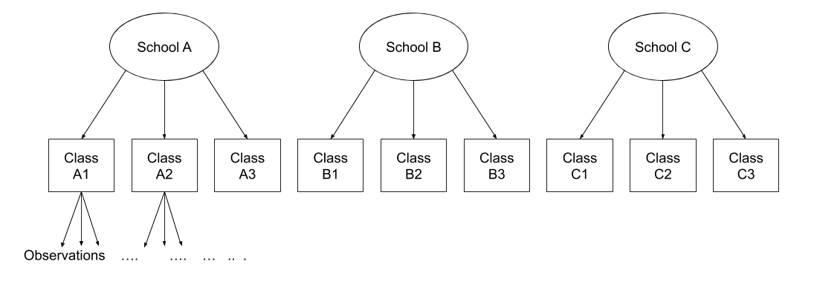

```{r setup, include=FALSE}
source('assets/setup.R')
library(tidyverse)
library(patchwork)
library(effects)
```

:::lo
__No exercises this week__  

This week, there aren't any exercises, but there is a small recap reading of multilevel models, followed by some 'flashcard' type boxes to help you test your understanding of some of the key concepts.   
  
Please use the lab sessions to go over exercises from previous weeks, as we all as asking any questions about the content below.
 
:::


# School Example

> Do children scores in maths improve more in school 2020 vs school 2040?

Consider the following data, representing longitudinal measurements on 10 students from an urban public primary school. The outcome of interest is mathematics achievement. 
The data were collected at the end of first grade and annually thereafter up to sixth grade, but not all students have six observations. The variable year has been mean-centred to have mean 0 so that results will have as baseline the average.

<br>

```{r echo=FALSE}
library(tidyverse)

set.seed(5293)

# egm <- foreign::read.dta("https://data.princeton.edu/pop510/egm.dta")
# 
# data <- tibble(egm) %>%
#     dplyr::select(schoolid, childid, year, math) %>%
#     filter(schoolid %in% c(2020, 2040))

# write_csv(data, file = '../../data/MathsAchievement.csv')

data <- read_csv('https://uoepsy.github.io/data/MathsAchievement.csv')
data$childid <- as.factor(data$childid)
data$schoolid <- as.factor(data$schoolid)
```


```{r echo=FALSE}
data %>%
    DT::datatable(options = list(pageLength = 10)) %>%
    DT::formatRound(columns=c('math'), digits = 2)
```


How many students in each school?
```{r echo=FALSE}
data %>% 
  dplyr::select(schoolid, childid) %>% 
  distinct %>%
  pull(schoolid) %>%
  table(schoolid = .) %>%
  addmargins()
```

We have 42 students, 21 in school with id 2020 and 21 in school with id 2040:

The number of observations per child are as follows.
```{r}
table(data$childid)
```

We can see that for some children we have fewer than the 6 observations: some have 3, 4, or 5.
 

## School 2020

Let's start by considering only the children in school 2020. The mathematics achievement over time is shown, for each student, in the plot below:

```{r fig.height = 6.5, fig.width = 7.5, out.width = '100%'}
data2020 <- data %>% 
  filter(schoolid == 2020)

ggplot(data2020, aes(x = year, y = math)) +
  geom_point() +
  facet_wrap(~ childid, labeller = label_both) +
  labs(x = "Year (mean centred)", y = "Maths achievement score")
```

Clearly, the measurements of mathematics achievement related to each student are _grouped data_ as they refer to the same entity.

If we were to ignore this grouping and consider all children as one single population, we would obtain misleading results.The observations for the same student are clearly correlated. Some students consistently have a much better performance than other students, perhaps due to underlying numerical skills.

A fundamental assumption of linear regression models is that the residuals, and hence the data too, should be uncorrelated. In this example this is not the case.

The following plot considers all data as a single population
```{r}
ggplot(data2020, aes(x = year, y = math)) +
    geom_point() +
    geom_smooth(method = lm, se = FALSE) +
    labs(x = "Year (mean centred)", y = "Maths achievement score")
```

This is a simple linear regression model for the mathematics measurement of individual $i$ on occasion $j$:
$$
\text{math}_{ij} = \beta_0 + \beta_1 \ \text{year}_{ij} + \epsilon_{ij} 
$$

where the subscript $ij$ denotes the $j$th measurement from child $i$.

Let's fit this in R
```{r}
m0 <- lm(math ~ year, data = data2020)
summary(m0)
```

The intercept and slope of this model can be visually represented as:

```{r echo=FALSE}
b0 <- coef(m0)

ggplot(data2020, aes(x = year, y = math)) +
  geom_point() +
  geom_smooth(method = lm, se = FALSE) +
  labs(x = "Year (mean centred)", y = "Maths achievement score") +
  annotate(geom = 'label', x = 0, y = b0[1], label = "beta[0]", 
           parse = TRUE, color = 'red', size = 5) +
  geom_segment(aes(x = 1, xend = 2, 
                   y = b0 %*% c(1, 1), yend = b0 %*% c(1, 1)), col = 'red') +
  geom_segment(aes(x = 2, xend = 2, 
                   y = b0 %*% c(1, 1), yend = b0 %*% c(1, 2)), col = 'red') +
  annotate(geom = 'label', x = 2, y = 1.3, label = "beta[1]", 
           parse = TRUE, color = 'red', hjust = -0.3, size = 5) +
  annotate(geom = 'label', x = 1.4, y = 0.5, label = "1", 
           parse = TRUE, color = 'red', hjust = 0, size = 5)
```


## Random intercept and slopes

In reality, we see that each student has their own line, with a different intercept and slope.
In other words, they all have different values of maths achievement when year =  0 and they also differ in their learning rate.

```{r, fig.height=5}
ggplot(data2020, aes(x = year, y = math, color = childid)) +
    geom_point() +
    geom_smooth(method = lm, se = FALSE, fullrange = TRUE, 
                size = 0.5) +
    labs(x = "Year (mean centred)", y = "Maths achievement score") +
    theme(legend.position = 'bottom')
```


Let's now write a model where each student has their own intercept and slope:
$$
\begin{aligned}
\text{math}_{ij} 
&= \beta_{0i} + \beta_{1i} \ \text{year}_{ij} + \epsilon_{ij} \\
&= (\text{intercept for child } i) + (\text{slope for child } i) \ \text{year}_{ij} + \epsilon_{ij} \\
&= (\gamma_{00} + \zeta_{0i}) + (\gamma_{10} + \zeta_{1i}) \ \text{year}_{ij} + \epsilon_{ij}
\end{aligned}
$$

where

- $\beta_{0i}$ is the intercept of the line for child $i$

- $\beta_{1i}$ is the slope of the line for child $i$

- $\epsilon_{ij}$ are the deviations of each child's measurement $\text{math}_{ij}$ from the line of child $i$

<br>

We can think each child-specific intercept (respectively, slope) as being made up of two components: an "overall" intercept $\gamma_{00}$ (slope $\gamma_{10}$) and a child-specific deviation from the overall intercept $\zeta_{0i}$ (slope $\zeta_{1i}$):

- $\beta_{0i} = \gamma_{00} + \zeta_{0i} = \text{(overall intercept) + (deviation for child }i)$

- $\beta_{1i} = \gamma_{10} + \zeta_{1i} = \text{(overall slope) + (deviation for child }i)$


```{r echo=FALSE, out.width = '100%'}
knitr::include_graphics('images/un_lmm.png')
```

:::statbox
**FACT**

**Deviations from the mean average to zero (and sum to zero too!)**

As you know, deviations from the mean average to 0.

This holds for the errors $\epsilon_{ij}$, as well as the deviations $\zeta_{0i}$ from the overall intercept, and the deviations $\zeta_{1i}$ from the overall slope.

Think of data $y_1, ..., y_n$ and their mean $\bar y$. The average of the deviations from the mean is
$$
\begin{aligned}
\frac{\sum_i (y_i - \bar y)}{n} 
= \frac{\sum_i y_i }{n} - \frac{\sum_i \bar y}{n} 
= \bar y - \frac{n * \bar y}{n} 
= \bar y - \bar y 
= 0
\end{aligned}
$$
:::


<br>

The child-specific deviations $\zeta_{0i}$ from the overall intercept are normally distributed with mean $0$ and variance $\sigma_0^2$. Similarly, the deviations $\zeta_{1i}$ of the slope for child $i$ from the overall slope come from a normal distribution with mean $0$ and variance $\sigma_1^2$. The correlation between random intercepts and slopes is $\rho = \text{Cor}(\zeta_{0i}, \zeta_{1i}) = \frac{\sigma_{01}}{\sigma_0 \sigma_1}$:

$$
\begin{bmatrix} \zeta_{0i} \\ \zeta_{1i} \end{bmatrix} 
\sim N
\left(
    \begin{bmatrix} 0 \\ 0 \end{bmatrix}, 
    \begin{bmatrix} 
        \sigma_0^2 & \rho \sigma_0 \sigma_1 \\
        \rho \sigma_0 \sigma_1 & \sigma_1^2
    \end{bmatrix}
\right)
$$

The random errors, independently from the random effects, are distributed
$$
\epsilon_{ij} \sim N(0, \sigma_\epsilon^2)
$$


This is fitted using `lmer()`:
```{r}
library(lme4)
m1 <- lmer(math ~ 1 + year + (1 + year | childid), data = data2020)
summary(m1)
```

```{r echo=FALSE}
b1 <- fixef(m1) %>% round(3)
u1 <- ranef(m1)$childid %>% round(3)
su <- as.data.frame(VarCorr(m1))[, 5] %>% round(3)
s <- sigma(m1) %>% round(3)
```

The summary of the `lmer` output returns estimated values for

Fixed effects:

- $\widehat \gamma_{00} = `r b1[1]`$ 
- $\widehat \gamma_{10} = `r b1[2]`$

Variability of random effects:

- $\widehat \sigma_{0} = `r su[1]`$
- $\widehat \sigma_{1} = `r su[2]`$

Correlation of random effects:

- $\widehat \rho = `r su[3]`$

Residuals:

- $\widehat \sigma_\epsilon = `r su[4]`$


Remember:
- The child-specific deviations $\zeta_{0i}$ from the overall intercept are **normally distributed** with mean $0$ and variance $\sigma_0^2$. 
- Similarly, the deviations $\zeta_{1i}$ of the slope for child $i$ from the overall slope come from a **normal distribution** with mean $0$ and variance $\sigma_1^2$.  

We can check that our random effects look :

```{r, fig.width=8, fig.height = 4, out.width = '95%'}
par(mfrow = c(1,2))
qqnorm(ranef(m1)$childid[, 1], main = "Random intercept")
qqline(ranef(m1)$childid[, 1])

qqnorm(ranef(m1)$childid[, 2], main = "Random slope")
qqline(ranef(m1)$childid[, 2])
```


Check normality and independence of errors:

```{r, fig.width=8, fig.height = 4, out.width = '95%'}
qqnorm(resid(m1), id=0.05)
qqline(resid(m1), id=0.05)

plot(m1,
     form = sqrt(abs(resid(.))) ~ fitted(.),
     type = c("p","smooth"))
```


Visually inspect the correlation between the random intercept and slopes:

```{r}
ggplot(ranef(m1)$childid,
       aes(x = `(Intercept)`, y = year)) +
    geom_smooth(method = lm, se = FALSE, 
                color = 'gray', size = 0.5) +
    geom_point()
```


<!-- HIDE??? -->


<!-- ## Schools 2020 and 2040 -->

<!-- Consider now the case where you want a fixed effect for the two schools, to compare the average mathematics achievement among those 2 particular schools. This would take the form of a fixed effect: -->

<!-- ```{r} -->
<!-- m2 <- lmer(math ~ 1 + year + schoolid + (1 + year | childid), data = data) -->
<!-- summary(m2) -->
<!-- ``` -->

<!-- Check normality of random effects: -->

<!-- ```{r, fig.width=8, fig.height = 4, out.width = '95%'} -->
<!-- par(mfrow = c(1,2)) -->
<!-- qqnorm(ranef(m2)$childid[, 1], main = "Random intercept") -->
<!-- qqline(ranef(m2)$childid[, 1]) -->

<!-- qqnorm(ranef(m2)$childid[, 2], main = "Random slope") -->
<!-- qqline(ranef(m2)$childid[, 2]) -->
<!-- ``` -->


<!-- Check normality and independence of errors: -->

<!-- ```{r, fig.width=8, fig.height = 4, out.width = '95%'} -->
<!-- par(mfrow = c(1,2)) -->
<!-- qqnorm(resid(m2), main = "Residuals") -->
<!-- qqline(resid(m2)) -->

<!-- plot(fitted(m2), resid(m2), ylab = "Residuals", xlab = "Fitted values") -->
<!-- abline(h=0) -->
<!-- ``` -->


<!-- Visually inspect the correlation between the random intercept and slopes: -->

<!-- ```{r} -->
<!-- ggplot(ranef(m2)$childid, -->
<!--        aes(x = `(Intercept)`, y = year)) + -->
<!--     geom_smooth(method = lm, se = FALSE,  -->
<!--                 color = 'gray', size = 0.5) + -->
<!--     geom_point() -->
<!-- ``` -->


<!-- We see from `summary` and the plot above, that the correlation between the random intercept and slope is equal to 1. -->
<!-- We also notice the following message: -->
<!-- ``` -->
<!-- Model failed to converge with max|grad| = 0.00288304 (tol = 0.002, component 1) -->
<!-- ``` -->

<!-- It basically is saying that the gradient stopping criterion at the termination was not smaller than the specified threshold of 0.002.  -->

<!-- We can try uncorrelating the random intercept and slope, i.e. setting $\rho = 0$ by either using `||`:  -->

<!-- ```{r} -->
<!-- m2a <- lmer(math ~ 1 + year + schoolid + (1 + year || childid), data = data) -->
<!-- summary(m2a) -->
<!-- ``` -->

<!-- or: -->
<!-- ```{r} -->
<!-- m2b <- lmer(math ~ 1 + year + schoolid +(1 | childid) + (0 + year | childid), data = data) -->
<!-- summary(m2b) -->
<!-- ``` -->

<!-- The two above will return the same results. -->


<!-- Check normality of random effects: -->

<!-- ```{r, fig.width=8, fig.height = 4, out.width = '95%'} -->
<!-- par(mfrow = c(1,2)) -->
<!-- qqnorm(ranef(m2a)$childid[, 1], main = "Random intercept") -->
<!-- qqline(ranef(m2a)$childid[, 1]) -->

<!-- qqnorm(ranef(m2a)$childid[, 2], main = "Random slope") -->
<!-- qqline(ranef(m2a)$childid[, 2]) -->
<!-- ``` -->


<!-- Check normality and independence of errors: -->

<!-- ```{r, fig.width=8, fig.height = 4, out.width = '95%'} -->
<!-- par(mfrow = c(1,2)) -->
<!-- qqnorm(resid(m2a), main = "Residuals") -->
<!-- qqline(resid(m2a)) -->

<!-- plot(fitted(m2a), resid(m2a), ylab = "Residuals", xlab = "Fitted values") -->
<!-- abline(h=0) -->
<!-- ``` -->


<!-- Visually inspect the correlation between the random intercept and slopes: -->

<!-- ```{r} -->
<!-- ggplot(ranef(m2a)$childid, -->
<!--        aes(x = `(Intercept)`, y = year)) + -->
<!--     geom_smooth(method = lm, se = FALSE,  -->
<!--                 color = 'gray', size = 0.5) + -->
<!--     geom_point() -->
<!-- ``` -->


# Flashcards: `lm` to `lmer`

```{r echo=FALSE}
require(patchwork)
source("plottingmixedmods.R")
random_intercept_model = mod2
random_slopes_model = mod3
b1 <- fixef(mod3) %>% round(3)
u1 <- ranef(mod3)$subject %>% round(3)
su <- as.data.frame(VarCorr(mod3))[, 5] %>% round(3)
s <- sigma(mod3) %>% round(3)
```


In a simple linear regression, there is only considered to be one source of random variability: any variability left unexplained by a set of predictors (which are modelled as fixed estimates) is captured in the model residuals.  
  
Multi-level (or 'mixed-effects') approaches involve modelling more than one source of random variability - as well as variance resulting from taking a random sample of observations, we can identify random variability across different groups of observations. For example, if we are studying a patient population in a hospital, we would expect there to be variability across the our sample of patients, but also across the doctors who treat them.  
  
We can account for this variability by allowing the outcome to be lower/higher for each group (a random intercept) and by allowing the estimated effect of a predictor vary across groups (random slopes).  
  
:::blue
Before you expand each of the boxes below, think about how comfortable you feel with each concept.  
This content is very cumulative, which means often going back to try to isolate the place which we need to focus efforts in learning. 
:::

`r optbegin("Simple Linear Regression", olabel=FALSE,toggle=params$TOGGLE)`

:::frame
**Formula:**  
  
+ $y_i = \beta_0 + \beta_1 x_i + \epsilon_i$  
  
**R command:**  
  
+ `lm(outcome ~ predictor, data = dataframe)`  
  
*Note:* this is the same as `lm(outcome ~ 1 + predictor, data = dataframe)`. The `1 +` is always there unless we specify otherwise (e.g., by using `0 +`).

:::


```{r echo=FALSE}
plot_data + plot_lm
```

`r optend()`

`r optbegin("Clustered (multi-level) data", olabel=FALSE,toggle=params$TOGGLE)`
When our data is clustered (or 'grouped') such that datapoints are no longer independent, but belong to some grouping such as that of multiple observations from the same subject, we have multiple sources of random variability. A simple regression does not capture this.  

If we separate out our data to show an individual plot for each subject, we can see how the fitted regression line from `lm()` is assumed to be the same for each subject.  
  
```{r echo=FALSE, fig.height=10}
plot_lm_fac
```

`r optend()`

`r optbegin("Random intercepts", olabel=FALSE,toggle=params$TOGGLE)`
By including a random-intercept term, we are letting our model estimate random variability around an average parameter (represented by the fixed effects) for the clusters.

:::frame 

**Formula:**  
Level 1:  
  
+ $y_{ij} = \beta_{0i} + \beta_{1i} x_{ij} + \epsilon_{ij}$  
  
Level 2:  
  
+ $\beta_{0i} = \gamma_{00} + \zeta_{0i}$   

Where the expected values of $\zeta_{0}$, and $\epsilon$ are 0, and their variances are $\sigma_{0}^2$ and $\sigma_\epsilon^2$ respectively. We will further assume that these are normally distributed.

We can now see that the intercept estimate $\beta_{0i}$ for a particular group $i$ is represented by the combination of a mean estimate for the parameter ($\gamma_{00}$) and a random effect for that group ($\zeta_{0i}$).

**R command:**  
  
+ `lmer(outcome ~ predictor + (1 | grouping), data = dataframe)`  
  
:::

Notice how the fitted line of the random intercept model has an adjustment for each subject.  
Each subject's line has been moved up or down accordingly. 

```{r echo=FALSE, fig.height=8, fig.width=12}
plot_lm_fac + plot_ri_fac
```

`r optend()`

`r optbegin("Shrinkage", olabel=FALSE,toggle=params$TOGGLE)`

If you think about it, we might have done a similar thing with the tools we already had at our disposal, by using `lm(y~x+subject)`.
This would give us a coefficient for the difference between each subject and the reference level intercept, or we could extend this to `lm(y~x*subject)` to give us an adjustment to the slope for each subject.  
  
However, the estimate of these models will be slightly different:  

```{r echo=FALSE}
plot_shrinkage
```

**Why?** One of the benefits of multi-level models is that our cluster-level estimates are shrunk towards the average depending on a) the level of across-cluster variation and b) the number of datapoints in clusters. 

`r optend()`

`r optbegin("Random slopes", olabel=FALSE,toggle=params$TOGGLE)`

:::frame 

**Formula:**  
Level 1:  
  
+ $y_{ij} = \beta_{0i} + \beta_{1i} x_{ij} + \epsilon_{ij}$  
  
Level 2:  
  
+ $\beta_{0i} = \gamma_{00} + \zeta_{0i}$  
+ $\beta_{1i} = \gamma_{10} + \zeta_{1i}$  

Where the expected values of $\zeta_0$, $\zeta_1$, and $\epsilon$ are 0, and their variances are $\sigma_{0}^2$, $\sigma_{1}^2$, $\sigma_\epsilon^2$ respectively. We will further assume that these are normally distributed.

As with the intercept $\beta_{0i}$, the slope of the predictor $\beta_{1i}$ is now modelled by a mean $\gamma_{10}$ and a random effect for each group ($\zeta_{1i}$). 


**R command:** 
  
+ `lmer(outcome ~ predictor + (1 + predictor | grouping), data = dataframe)`  
  
*Note:* this is the same as `lmer(outcome ~ predictor + (predictor | grouping), data = dataframe)` . Like in the fixed-effects part, the `1 +` is assumed in the random-effects part.

:::

```{r echo=FALSE, fig.height=8, fig.width=12}
plot_ri_fac + plot_rs_fac
```

`r optend()`


<!-- `r optbegin("Polynomials!", olabel=FALSE, toggle=params$TOGGLE)` -->

<!-- Sometimes, data have a clear non-linear pattern, such as a curvilinear trend. In such case, it is reasonable to try modelling the outcome _not_ as a linear function of the variable, but as a curvilinear function of it. -->

<!-- The following plots show data (as black dots) where the outcome $y$ has a nonlinear and decreasing dependence on $x$. That is, as $x$ varies from 1 to 10, the outcome $y$ decreases in a non-linear fashion. -->
<!-- Superimposed to the same data, you can see a linear fit (red line) and a cubic fit (blue). -->

<!-- ```{r echo=FALSE, out.widt='100%', fig.heigth = 4, fig.width = 8} -->
<!-- set.seed(5) -->

<!-- u = seq(1, 10, by = 0.5) -->
<!-- v = -(0.2 * u)^3 + rnorm(length(u), sd = 0.2) -->

<!-- pm1 = lm(v ~ u) -->
<!-- pm2 = lm(v ~ 1 + u + I(u^2) + I(u^3)) -->

<!-- par(mfrow = c(1,2)) -->
<!-- plot(u, v, pch = 16, frame.plot = FALSE, xlab = 'x', ylab = 'y') -->
<!-- curve(cbind(1, x) %*% coef(pm1), col = 'red', add = TRUE) -->

<!-- plot(u, v, pch = 16, frame.plot = FALSE, xlab = 'x', ylab = 'y') -->
<!-- curve(cbind(1, x, x^2, x^3) %*% coef(pm2), col = 'dodgerblue', add = TRUE) -->
<!-- ``` -->

<!-- The residuals corresponding to each fit are: -->
<!-- ```{r echo=FALSE, out.widt='100%', fig.heigth = 4, fig.width = 8} -->
<!-- par(mfrow = c(1,2)) -->

<!-- plot(fitted(pm1), resid(pm1), col = 'red', pch = 16, frame.plot = FALSE) -->
<!-- abline(h = 0, col = 'darkgray', xlab = 'Fitted', y = 'Residuals') -->

<!-- plot(fitted(pm2), resid(pm2), col = 'dodgerblue', pch = 16, frame.plot = FALSE) -->
<!-- abline(h = 0, col = 'darkgray', xlab = 'Fitted', y = 'Residuals') -->
<!-- ``` -->

<!-- Clearly, a linear fit doesn't capture the real trend in the data, and any leftover systematic pattern that the model doesn't explicity account for always ends up in the residuals as the red points show. -->

<!-- On the other hand, once we account for the nonlinear trend, that systematic pattern in the residuals disappears. -->


<!-- The secret is to use instead of $x$ as a predictor, the corresponding polynomial up to a specific order: -->

<!-- $$ -->
<!-- y = \beta_0 + \beta_1 x + \beta_2 x^2 + \beta_3 x^3 + \epsilon -->
<!-- $$ -->

<!-- Consider the following example data. You can add polynomials up to order 3, for example, of a predictor "time" by saying: -->

<!-- ```{r echo=FALSE} -->
<!-- df <- tibble(subject = 1, reaction = rexp(5, 3), time = 1:5) -->
<!-- df -->
<!-- ``` -->

<!-- ```{r} -->
<!-- source("https://uoepsy.github.io/msmr/functions/code_poly.R") -->

<!-- code_poly(df, predictor = 'time', poly.order = 3, draw.poly = FALSE) -->
<!-- ``` -->

<!-- and use those terms when specifying your linear model, for example: -->

<!-- ``` -->
<!-- lmer(reaction ~ poly1 + poly2 + poly3 + (1 | subject)) -->
<!-- ``` -->


<!-- `r optend()` -->

`r optbegin("Fixed effects", olabel=FALSE, toggle=params$TOGGLE)`
We can extract the *fixed effects* using the `fixef()` function:

These are the overall intercept and slope. 
```{r}
fixef(random_slopes_model)
```
`r optend()` 

`r optbegin("Random effects", olabel=FALSE, toggle=params$TOGGLE)`  
The plots below show the fitted values for each subject from each model that we have gone through in these expandable boxes (simple linear regression, random intercept, and random intercept & slope): 

```{r echo=FALSE, fig.width=12}
plotdata2<-
  ggplot(dat, aes(x=x1,y=outcome, col=subject))+
  geom_point(alpha=0.5)+geom_path(alpha=0.5)+
  theme_classic()+
  theme(plot.title = element_text(hjust = 0.5), legend.position = "none")+
  scale_y_continuous(breaks=NULL)+scale_x_continuous(breaks=NULL)+
  labs(title="- The data (by subject) - ", y="y", x="x")+
  NULL

#(plot_data + plotdata2 ) / (plot_lm2 + plot_ri + plot_rs)
plot_lm2 + plot_ri + plot_rs
```

In the random-intercept model (center panel), the differences from each of the subjects' intercepts to the fixed intercept (thick green line) have mean 0 and standard deviation $\sigma_0$.  The standard deviation (and variance, which is $\sigma_0^2$) is what we see in the random effects part of our model summary (or using the `VarCorr()` function).  

```{r echo=FALSE, out.width="400px"}
knitr::include_graphics("images/varcors.PNG")
```

In the random-slope model (right panel), the same is true for the differences from each subjects' slope to the fixed slope. 
We can extract the deviations for each group from the fixed effect estimates using the `ranef()` function.  
  
These are the deviations from the overall intercept ($\widehat \gamma_{00} = `r b1[1]`$) and slope ($\widehat \gamma_{10} = `r b1[2]`$) for each subject $i$.  
```{r}
ranef(random_slopes_model)
```
`r optend()` 

`r optbegin("Group-level coefficients", olabel=FALSE, toggle=params$TOGGLE)`
We can also see the actual intercept and slope for each subject $i$ directly, using the `coef()` function.  

```{r}
coef(random_slopes_model)
```

Notice that the above are the fixed effects + random effects estimates, i.e. the overall intercept and slope + deviations for each subject.

```{r}
coef(random_intercept_model)
```
`r optend()` 

`r optbegin("Plotting random effects", olabel=FALSE, toggle=params$TOGGLE)`
The quick and easy way to plot your random effects is to use the `dotplot.ranef.mer()` function in `lme4`. 

```{r}
randoms <- ranef(random_slopes_model, condVar=TRUE)
dotplot.ranef.mer(randoms)
```

`r optbegin("Completely optional - extracting them for plotting in ggplot", olabel=FALSE, toggle=params$TOGGLE)`
Sometimes, however, we might want to have a bit more control over our plotting, we can extract the estimates and correlations for each subject:  
```{r}
#we can get the random effects:
#(note that we use $subject because there might be other groupings, and the ranef() function will give us a list, with one element for each grouping variable)
randoms <-
  ranef(random_slopes_model)$subject %>%
  mutate(subject = row.names(.)) %>%  # the subject IDs are stored in the rownames, so lets add them as a variable
  pivot_longer(cols=1:2, names_to="term",values_to="estimate") # finally, let's reshape it for plotting

#and the same for the standard errors (from the arm package):
randoms_se <-
  arm::se.ranef(random_slopes_model)$subject %>%
  as.data.frame() %>%
  mutate(subject = row.names(.)) %>%
  pivot_longer(cols=1:2, names_to="term",values_to="se")

# join them together:
ranefs_plotting <- left_join(randoms, randoms_se)

# it's easier for plotting if we
ggplot(ranefs_plotting, aes(y=subject, x=estimate))+
  geom_errorbarh(aes(xmin=estimate-2*se, xmax=estimate+2*se))+
  facet_wrap(~term, scales="free_x")

```

`r optend()`

`r optend()` 

`r optbegin("Nested and Crossed structures",olabel=FALSE,toggle=params$TOGGLE)`

The same principle we have seen for one level of clustering can be extended to clustering at different levels (for instance, observations are clustered within subjects, which are in turn clustered within groups). 

Consider the example where we have observations for each student in every class within a number of schools:  

```{r echo=FALSE, out.width="1200px"}
knitr::include_graphics("images/structure_id.png")
```

**Question:** Is "Class 1" in "School 1" the same as "Class 1" in "School 2"?  
  
No.  
The classes in one school are distinct from the classes in another **even though they are named the same**.  
  
The classes-within-schools example is a good case of **nested random effects** - one factor level (one group in a grouping varible) appears *only within* a particular level of another grouping variable.  
  
In R, we can specify this using:  
  
`(1 | school) + (1 | class:school)`  
  
or, more succinctly:  
  
`(1 | school/class)`  

Consider another example, where we administer the same set of tasks at multiple time-points for every participant.  
  
**Question:** Are tasks nested within participants?  
  
No.  
Tasks are seen by multiple participants (and participants see multiple tasks).  
  
We could visualise this as the below:  
```{r echo=FALSE, out.width="400px"}
knitr::include_graphics("images/structure_crossed.png")
```

In the sense that these are not nested, they are **crossed** random effects.  
  
In R, we can specify this using:  

`(1 | subject) + (1 | task)`  

:::blue
**Nested vs Crossed**  

*Nested:* Each group belongs uniquely to a higher-level group.   

*Crossed:* Not-nested. 

:::

Note that in the schools and classes example, had we changed data such that the classes had unique IDs (e.g., see below), then the structures `(1 | school) + (1 | class)` and `(1 | school/class)` would give the same results.  
```{r echo=FALSE, out.width="1200px"}

```

`r optend()`


<div class="tocify-extend-page" data-unique="tocify-extend-page" style="height: 0;"></div>