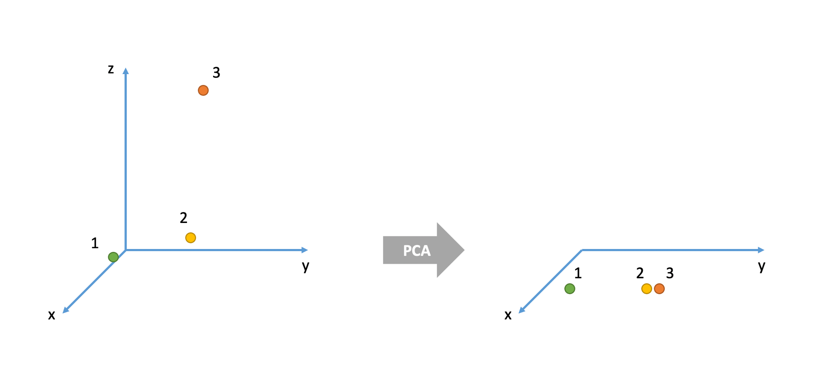

```{r setup, include=FALSE}
source('assets/setup.R')
library(tidyverse)
library(lavaan)
library(semPlot)
# knitr::opts_chunk$set(cache = TRUE)
options(digits=3, scipen = 3)
```

:::green
__Information about solutions__

Solutions for these exercises are available immediately below each question.  
We would like to emphasise that much evidence suggests that testing enhances learning, and we __strongly__ encourage you to make a concerted attempt at answering each question *before* looking at the solutions. Immediately looking at the solutions and then copying the code into your work will lead to poorer learning.  
We would also like to note that there are always many different ways to achieve the same thing in R, and the solutions provided are simply _one_ approach.  

:::

:::lo
**Relevant packages**

+ psych

::: 

:::statbox
**Thinking about measurement**  

Take a moment to think about the various constructs that you are often interested in as a researcher. This might be anything from personality traits, to language proficiency, social identity, anxiety etc. 
How we measure such constructs is a very important consideration for research. The things we're interested in are very rarely the things we are *directly* measuring. 

Consider how we might assess levels of anxiety or depression. Can we ever directly measure anxiety? ^[Even if we cut open someone's brain, it's unclear what we would be looking for in order to 'measure' it. It is unclear whether anxiety even exists as a physical thing, or rather if it is simply the overarching concept we apply to a set of behaviours and feelings]. More often than not, we measure these things using questionnaire based methods, to capture the multiple dimensions of the thing we are trying to assess. Twenty questions all measuring different aspects of anxiety are (we hope) going to correlate with one another if they are capturing some commonality (the construct of "anxiety"). But they introduce a problem for us, which is how to deal with 20 variables that represent (in broad terms) the same thing. How can we assess "effects on anxiety", rather than "effects on anxiety q1", "effects on anxiety q2", ..., etc.  

This leads us to the idea of *reducing the dimensionality of our data*. Can we capture a reasonable amount of the information from our 20 questions in a smaller number of variables? 

:::lo

The goal of principal component analysis (PCA) is to find a _smaller_ number of uncorrelated variables which are linear combinations of the original ( _many_ ) variables and explain most of the variation in the data.

:::


:::


:::frame
__Data: Job Performance__  

The file [job_performance.csv](https://uoepsy.github.io/data/job_performance.csv) (available at https://uoepsy.github.io/data/job_performance.csv) contains data on fifty police officers who were rated in six different categories as part of an HR procedure. The rated skills were:

- communication skills: `commun`
- problem solving: `probl_solv`
- logical ability: `logical`
- learning ability: `learn`
- physical ability: `physical`
- appearance: `appearance`

:::

`r qbegin("A1")`
Load the job performance data into R and call it `job`. 
Check whether or not the data were read correctly into R - do the dimensions correspond to the description of the data above?
`r qend()`
`r solbegin(show=params$SHOW_SOLS, toggle=params$TOGGLE)`
Let's load the data:

```{r, message=FALSE}
library(tidyverse)

job <- read_csv('https://uoepsy.github.io/data/job_performance.csv')
dim(job)
```
There are 50 observations on 6 variables.

The top 6 rows in the data are:
```{r}
head(job)
```
`r solend()`

`r qbegin("A2")`
Provide descriptive statistics for each variable in the dataset.
`r qend()`
`r solbegin(show=params$SHOW_SOLS, toggle=params$TOGGLE)`
We now inspect some descriptive statistics for each variable in the dataset:
```{r}
# Quick summary
summary(job)
```

__OPTIONAL__

If you wish to create a nice looking table for a report, you could try the following code. 
However, I should warn you: this code is quite difficult to understand so, if you are interested, attend a lab!

```{r}
library(gt)

# Mean and SD of each variable
job %>% 
  summarise(across(everything(), list(M = mean, SD = sd))) %>%
  pivot_longer(everything()) %>% 
  mutate(
    value = round(value, 2),
    name = str_replace(name, '_M', '.M'),
    name = str_replace(name, '_SD', '.SD')
  ) %>%
  separate(name, into = c('variable', 'summary'), sep = '\\.') %>%
  pivot_wider(names_from = summary, values_from = value) %>% 
  gt()
```
`r solend()`

# Preliminaries 
## Is PCA needed?

:::lo 

If the original variables are highly correlated, it is possible to reduce the dimensionality of the problem under investigation without losing too much information.

On the other side, when the correlation between the variables under study is weak, a larger number of components is needed in order to explain sufficient variability.

:::

`r qbegin("A3")`
Investigate whether or not the recorded variables are highly correlated and explain whether or not you PCA might be useful in this case.  

**Hint:** We only have 6 variables here, but if we had many, how might you visualise `cor(job)`?

`r qend()`
`r solbegin(show=params$SHOW_SOLS, toggle=params$TOGGLE)`
Let's start by looking at the correlation matrix of the data:
```{r, fig.align='center', fig.height=4, fig.width=5, fig.cap="Correlation between the variables in the ``Job'' dataset"}
library(pheatmap)

R <- cor(job)

pheatmap(R, breaks = seq(-1, 1, length.out = 100))
```

The correlation between the variables seems to be quite large (it doesn't matter about direction here, only magnitude; if negative correlations were present, we would think in absolute value).

There appears to be a group of highly correlated variables comprising physical ability, appearance, communication skills, and learning ability which are correlated among themselves but uncorrelated with another group of variables.
The second group comprises problem solving and logical ability.

This suggests that PCA might be useful in this problem to reduce the dimensionality without a significant loss of information.
`r solend()`

## Cov vs Cor

:::statbox
**Should we perform PCA on the covariance or the correlation matrix?**  
  
This depends on the variances of the variables in the dataset.
If the variables have large differences in their variances, then the variables with the largest variances will tend to dominate the first few principal components.  

A solution to this is to standardise the variables prior to computing the covariance matrix - i.e., compute the correlation matrix!  

```{r}
# show that the correlation matrix and the covariance matrix of the standardized variables are identical
all.equal(cor(job), cov(scale(job)))
```
:::

`r qbegin("A4")`
Look at the variance of the variables in the data set. Do you think that PCA should be carried on the covariance matrix or the correlation matrix?
`r qend()`
`r solbegin(show=params$SHOW_SOLS, toggle=params$TOGGLE)`
Let's have a look at the standard deviation of each variable:
```{r}
job %>% 
  summarise(across(everything(), sd))
```

As the standard deviations appear to be fairly similar (and so will the variances) we can perform PCA using the covariance matrix.
`r solend()`


# Perform PCA

`r qbegin("A5")`
Using the `principal()` function from the `psych` package, we can perform a PCA of the job performance data, Call the output `job_pca`.
```
job_pca <- principal(job, nfactors = ncol(job), covar = ..., rotate = 'none')
job_pca$loadings
```
Depending on your answer to the previous question, either set `covar = TRUE` or `covar = FALSE` within the `principal()` function.

**Warning:** the output of the function will be in terms of standardized variables nevertheless. So you will see output with standard deviation of 1.  
`r qend()`
`r solbegin(show=TRUE, toggle=params$TOGGLE)`
```{r}
library(psych)

job_pca <- principal(job, nfactors = ncol(job), covar = TRUE, rotate = 'none')
```
`r solend()`

## The output  

:::frame

```{r}
job_pca$loadings
```
The output is made up of two parts.

First, it shows the *loading matrix*. In each column of the loading matrix we find how much each of the measured variables contributes to the computed new axis/direction (that is, the principal component).
Notice that there are as many principal components as variables. 

The second part of the output displays the contribution of each component to the total variance.

Before interpreting it however, let's focus on the last row of that output called "Cumulative Var". This displays the cumulative sum of the variances of each principal component.
Taken all together, the six principal components taken explain all of the total variance in the original data.
In other words, the total variance of the principal components (the sum of their variances) is equal to the total variance in the original data (the sum of the variances of the variables).

However, our goal is to reduce the dimensionality of our data, so it comes natural to wonder which of the six principal components explain most of the variability, and which components instead do not contribute substantially to the total variance.

To that end, the second row "Proportion Var" displays the proportion of the total variance explained by each component, i.e. the variance of the principal component divided by the total variance.

The last row, as we saw, is the cumulative proportion of explained variance: `0.673`, `0.673 + 0.210`, `0.673 + 0.210 + 0.105`, and so on.

We also notice that the first PC alone explains 67.3% of the total variability, while the first two components together explain almost 90% of the total variability.
From the third component onwards, we do not see such a sharp increase in the proportion of explained variance, and the cumulative proportion slowly reaches the total ratio of 1 (or 100%).

:::

`r optbegin("Optional: (some of) the math behind it", olabel=FALSE, toggle=params$TOGGLE)`

Doing data reduction can feel a bit like magic, and in part that's just because it's quite complicated. 

**The intuition**  

Consider one way we might construct a correlation matrix - as the product of vector $\mathbf{f}$ with $\mathbf{f'}$ (f transposed): 
$$
\begin{equation*}
\mathbf{f} = 
\begin{bmatrix}
0.9 \\
0.8 \\
0.7 \\
0.6 \\
0.5 \\
0.4 \\
\end{bmatrix} 
\qquad 
\mathbf{f} \mathbf{f'} = 
\begin{bmatrix}
0.9 \\
0.8 \\
0.7 \\
0.6 \\
0.5 \\
0.4 \\
\end{bmatrix} 
\begin{bmatrix}
0.9, 0.8, 0.7, 0.6, 0.5, 0.4 \\
\end{bmatrix} 
\qquad = \qquad
\begin{bmatrix}
0.81, 0.72, 0.63, 0.54, 0.45, 0.36 \\
0.72, 0.64, 0.56, 0.48, 0.40, 0.32 \\
0.63, 0.56, 0.49, 0.42, 0.35, 0.28 \\
0.54, 0.48, 0.42, 0.36, 0.30, 0.24 \\
0.45, 0.40, 0.35, 0.30, 0.25, 0.20 \\
0.36, 0.32, 0.28, 0.24, 0.20, 0.16 \\
\end{bmatrix} 
\end{equation*} 
$$

But we constrain this such that the diagonal has values of 1 (the correlation of a variable with itself is 1), and lets call it **R**.
$$
\begin{equation*}
\mathbf{R} = 
\begin{bmatrix}
1.00, 0.72, 0.63, 0.54, 0.45, 0.36 \\
0.72, 1.00, 0.56, 0.48, 0.40, 0.32 \\
0.63, 0.56, 1.00, 0.42, 0.35, 0.28 \\
0.54, 0.48, 0.42, 1.00, 0.30, 0.24 \\
0.45, 0.40, 0.35, 0.30, 1.00, 0.20 \\
0.36, 0.32, 0.28, 0.24, 0.20, 1.00 \\
\end{bmatrix} 
\end{equation*} 
$$

PCA is about trying to determine a vector **f** which generates the correlation matrix **R**. a bit like unscrambling eggs!  

in PCA, we express $\mathbf{R = CC'}$, where $\mathbf{C}$ are our principal components.  
If $n$ is number of variables in $R$, then $i^{th}$ component $C_i$ is the linear sum of each variable multiplied by some weighting:  
$$
C_i = \sum_{j=1}^{n}w_{ij}x_{j}
$$

**How do we find $C$?**

This is where "eigen decomposition" comes in.  
For the $n \times n$ correlation matrix $\mathbf{R}$, there is an **eigenvector** $x_i$ that solves the equation 
$$
\mathbf{x_i R} = \lambda_i \mathbf{x_i}
$$
Where the vector multiplied by the correlation matrix is equal to some **eigenvalue** $\lambda_i$ multiplied by that vector.  
We can write this without subscript $i$ as: 
$$
\begin{align}
& \mathbf{R X} = \mathbf{X \lambda} \\
& \text{where:} \\
& \mathbf{R} = \text{correlation matrix} \\
& \mathbf{X} = \text{matrix of eigenvectors} \\
& \mathbf{\lambda} = \text{vector of eigenvalues}
\end{align}
$$
the vectors which make up $\mathbf{X}$ must be orthogonal [($\mathbf{XX' = I}$)](https://miro.medium.com/max/700/1*kyg5XbrY1AOB946IE5nWWg.png), which means that $\mathbf{R = X \lambda X'}$
 
We can actually do this in R manually. 
Creating a correlation matrix
```{r}
# lets create a correlation matrix, as the produce of ff'
f <- seq(.9,.4,-.1)
R <- f %*% t(f)
#give rownames and colnames
rownames(R)<-colnames(R)<-paste0("V",seq(1:6))
#constrain diagonals to equal 1
diag(R)<-1
R
```

Eigen Decomposition
```{r}
# do eigen decomposition
e <- eigen(R)
print(e, digits=2)
```

The eigenvectors are orthogonal ($\mathbf{XX' = I}$):
```{r}
round(e$vectors %*% t(e$vectors),2)
```

The Principal Components $\mathbf{C}$ are the eigenvectors scaled by the square root of the eigenvalues:
```{r}
#eigenvectors
e$vectors
#scaled by sqrt of eigenvalues
diag(sqrt(e$values))

C <- e$vectors %*% diag(sqrt(e$values))
C
```

And we can reproduce our correlation matrix, because $\mathbf{R = CC'}$. 
```{r}
C %*% t(C)
```
Now lets imagine we only consider 1 principal component.  
We can do this with the `principal()` function: 
```{r}
library(psych)
pc1<-principal(R, nfactors = 1, covar = FALSE, rotate = 'none')
pc1
```

Look familiar? It looks like the first component we computed manually. The first column of $\mathbf{C}$:
```{r}
cbind(pc1$loadings, C=C[,1])
```
We can now ask "how well does this component (on its own) recreate our correlation matrix?" 
```{r}
C[,1] %*% t(C[,1])
```
It looks close, but not quite. How much not quite? Measurably so!
```{r}
R - (C[,1] %*% t(C[,1]))
```

Notice the values on the diagonals?
```{r}
diag(C[,1] %*% t(C[,1]))
diag(R) - diag(C[,1] %*% t(C[,1]))
pc1$communality
pc1$uniquenesses
```

`r optend()`

## How many components to keep?

:::lo

There is no single best method to select the optimal number of components to keep, while discarding the remaining ones (which are then considered as noise components).

The following three heuristic rules are commonly used in the literature:

- The cumulative proportion of explained variance criterion
- Kaiser's rule
- The scree plot
- Velicer's Minimum Average Partial method
- Parallel analysis

In the next sections we will analyse each of them in turn.

:::

:::statbox
**The cumulative proportion of explained variance criterion**

The rule suggests to *keep as many principal components as needed in order to explain approximately 80-90% of the total variance.*

:::

`r qbegin("A6")`
Looking again at the PCA output, how many principal components would you keep if you were following the cumulative proportion of explained variance criterion?
`r qend()`
`r solbegin(show=params$SHOW_SOLS, toggle=params$TOGGLE)`
Let's look again at the PCA summary:

```{r}
job_pca$loadings
```

The following part of the output tells us that the first two components explain 88.3% of the total variance.
```
Cumulative Var 0.673 0.883 0.988 0.994 0.997 1.000
```

According to this criterion, we should keep 2 principal components.
`r solend()`

:::statbox
**Kaiser's rule**  
  
According to Kaiser's rule, we should **keep the principal components having variance larger than 1**. Standardized variables have a variance equal 1. Because we have 6 variables in the data set, and the total variance is 6, the value 1 represents the average variance in the data:
$$
\frac{1 + 1 + 1 + 1 + 1 + 1}{6} = 1
$$

__Hint:__

The variances of each PC are shown in the row of the output named `SS loadings` and also in
`job_pca$values`. The average variance is:

```{r}
mean(job_pca$values)
```
:::

`r qbegin("A7")`
Looking again at the PCA output, how many principal components would you keep if you were following Kaiser's criterion?
`r qend()`
`r solbegin(show=params$SHOW_SOLS, toggle=params$TOGGLE)`
```{r}
job_pca$loadings
```

The variances are shown in the row
```
SS loadings    4.035 1.261 0.631 0.035 0.022 0.016
```

From the result we see that only the first two principal components have variance greater than 1, so this rule suggests to keep 2 PCs only.
`r solend()`

:::statbox
**The scree plot**

The scree plot is a graphical criterion which involves plotting the variance for each principal component.
This can be easily done by calling `plot` on the variances, which are stored in `job_pca$values`

```{r}
plot(x = 1:length(job_pca$values), y = job_pca$values, 
     type = 'b', xlab = '', ylab = 'Variance', 
     main = 'Police officers: scree plot', frame.plot = FALSE)
```

where the argument `type = 'b'` tells R that the plot should have _both_ points and lines.

A typical scree plot features higher variances for the initial components and quickly drops to small variances where the curve is almost flat.
The flat part of the curve represents the noise components, which are not able to capture the main sources of variability in the system. 

According to the scree plot criterion, we should **keep as many principal components as where the "elbow" in the plot occurs.** By elbow we mean the variance before the curve looks almost flat.

Alternatively, some people prefer to use the function `scree()` from the `psych` package:

```{r}
scree(job, factors = FALSE)
```

This also draws a horizontal line at y = 1. So, if you are making a decision about how many PCs to keep by looking at where the plot falls below the y = 1 line, you are basically following Kaiser's rule. In fact, Kaiser's criterion tells you to keep as many PCs as are those with a variance (= eigenvalue) greater than 1.

:::

`r qbegin("A8")`
According to the scree plot, how many principal components would you retain?
`r qend()`
`r solbegin(show=params$SHOW_SOLS, toggle=params$TOGGLE)`
This criterion then suggests to keep three principal components.
`r solend()`

:::statbox
**Velicer’s Minimum Average Partial method**

The Minimum Average Partial (MAP) test computes the partial correlation matrix (removing and adjusting for a component from the correlation matrix), sequentially partialling out each component. At each step, the partial correlations are squared and their average is computed.  
At first, the components which are removed will be those that are most representative of the shared variance between 2+ variables, meaning that the "average squared partial correlation" will decrease. At some point in the process, the components being removed will begin represent variance that is specific to individual variables, meaning that the average squared partial correlation will increase.  
The MAP method is to keep the number of components for which the average squared partial correlation is at the minimum. 

We can conduct MAP in R using:
```{r eval=FALSE}
VSS(data, plot = FALSE, method="pc", n = ncol(data))
```
(be aware there is a lot of other information in this output too! For now just focus on the map column)

:::

`r qbegin("A9")`
How many components should we keep according to the MAP method?
`r qend()`
`r solbegin(show=params$SHOW_SOLS, toggle=params$TOGGLE)`
```{r}
job_map <- VSS(job, plot=FALSE, method="pc", n = ncol(job))$map
paste("MAP is lowest for", which.min(job_map), "components")
```

According to the MAP criterion we should keep 2 principal components.
`r solend()`


:::statbox
**Parallel analysis**

Parallel analysis involves simulating lots of datasets of the same dimension but in which the variables are uncorrelated. For each of these simulations, a PCA is conducted on its correlation matrix, and the eigenvalues are extracted. We can then compare our eigenvalues from the PCA on our *actual* data to the average eigenvalues across these simulations. 
In theory, for uncorrelated variables, no components should explain more variance than any others, and eigenvalues should be equal to 1. In reality, variables are rarely truly uncorrelated, and so there will be slight variation in the magnitude of eigenvalues simply due to chance. 
The parallel analysis method suggests keeping those components for which the eigenvalues are greater than those from the simulations. 

It can be conducted in R using:
```{r eval=FALSE}
fa.parallel(job, fa="pc", quant=.95)
```

:::


`r qbegin("A10")`
How many components should we keep according to parallel analysis?
`r qend()`
`r solbegin(show=params$SHOW_SOLS, toggle=params$TOGGLE)`
```{r}
fa.parallel(job, fa="pc", quant=.95)
```

Parallel analysis suggests to keep 1 principal component only as there is only one PC with an eigenvalue higher than the simulated random ones in red.

`r solend()`


# Interpretation

:::frame

Because three out of the five selection criteria introduced above suggest to keep 2 principal components, in the following we will work with the first two PCs only.

Let's have a look at the selected principal components:
```{r}
job_pca$loadings[, 1:2]
```

and at their corresponding proportion of total variance explained:
```{r}
job_pca$values / sum(job_pca$values)
```

We see that the first PC accounts for 67.3% of the total variability. All loadings seem to have the same magnitude apart from `probl_solv` and `logical` which are closer to zero.
The first component looks like a sort of average of the officers performance scores excluding problem solving and logical ability.

The second principal component, which explains only 21% of the total variance, has two loadings clearly distant from zero: the ones associated to problem solving and logical ability.
It distinguishes police officers with strong logical and problem solving skills and a low score on the test (note the negative magnitude) from the other officers.

We have just seen how to interpret the first components by looking at the magnitude and sign of the coefficients for each measured variable.

:::rtip
For interpretation purposes, it might help hiding very small loadings. This can be done by specifying the cutoff value in the `print()` function. However, this only works when you pass the loadings for **all** the PCs:
```{r}
print(job_pca$loadings, cutoff = 0.3)
```

:::
<br>
`r optbegin('Optional: How well are the units represented in the reduced space?', FALSE, show = TRUE, toggle = params$TOGGLE)`

We now focus our attention on the following question: Are all the statistical units (police officers) well represented in the 2D plot?

The 2D representation of the original data, which comprise 6 measured variables, is an approximation and henceforth it may happen that not all units are well represented in this new space.

Typically, it is good to assess the approximation for each statistical unit by inspecting the scores on the discarded principal components.
If a unit has a high score on those components, then this is a sign that the unit might be highly misplaced in the new space and misrepresented.

Consider the 3D example below. There are three cases (= units or individuals). In the original space they are all very different from each other. For example, cases 1 and 2 are very different in their x and y values, but very similar in their z value. Cases 2 and 3 are very similar in their x and y values but very different in their z value. Cases 1 and 3 have very different values for all three variables x, y, and z.

However, when represented in the 2D space given by the two principal components, units 2 and 3 seems like they are very similar when, in fact, they were very different in the original space which also accounted for the z variable.

```{r, echo=FALSE, out.width="\\textwidth", include=TRUE, fig.align="center"}

```

We typically measure how badly a unit is represented in the new coordinate system by considering the **sum of squared scores on the discarded principal components:**

```{r}
scores_discarded <- job_pca$scores[, -(1:2)]
sum_sq <- rowSums(scores_discarded^2)
sum_sq
```

Units with a high score should be considered for further inspection as it may happen that they are represented as close to another unit when, in fact, they might be very different.

```{r}
boxplot(sum_sq)
```

There seem to be only five outliers, and they are not too high compared to the rest of the scores. For this reason, we will consider the 2D representation of the data to be satisfactory.
`r optend()`


:::


# PCA scores

Supposing that we decide to reduce our six variables down to two principal components:
```{r}
job_pca2 <- principal(job, nfactors = 2, covar = TRUE, rotate = 'none')
```


:::rtip
We can, for each of our observations, get their _scores_ on each of our components.  
```{r}
head(job_pca2$scores)
```
:::

In the literature, some authors also suggest to look at the correlation between each principal component and the measured variables:

```{r}
# First PC
cor(job_pca2$scores[,1], job)
```

The first PC is strongly correlated with all the measured variables except `probl_solv` and `logical`.
As we mentioned above, all variables seem to contributed to the first PC.

```{r}
# Second PC
cor(job_pca2$scores[,2], job)
```

The second PC is strongly correlated with `probl_solv` and `logical`, and slightly negatively correlated with the remaining variables. This separates police offices with clear logical and problem solving skills and a small score on the test (negative sign) from the others.

:::lo
We have reduced our six variables down to two principal components, and we are now able to use the scores on each component in a subsequent analysis! 

For instance, if we also had information on how many arrests each police officer made, and the HR department were interested in whether the 6 questions we started with are a good predictor of this.  
We could imagine conducting an analysis like the below:  
```{r eval=F}
# add the PCA scores to the dataset
job <- 
  job %>% mutate(
    skills_score1 = job_pca2$scores[,1],
    skills_score2 = job_pca2$scores[,2]
  )
# use the scores in an analysis
lm(nr_arrests ~ skills_score1 + skills_score2, data = job)
```

:::


## Plotting the retained principal components

We can also visualise the statistical units (police officers) in the reduced space given by the retained principal component scores.

```{r, fig.width=5, fig.align='center'}
tibble(pc1 = job_pca$scores[, 1],
       pc2 = job_pca$scores[, 2]) %>%
  ggplot(.,aes(x=pc1,y=pc2))+
  geom_point()
```


<!-- Formatting -->


<div class="tocify-extend-page" data-unique="tocify-extend-page" style="height: 0;"></div>