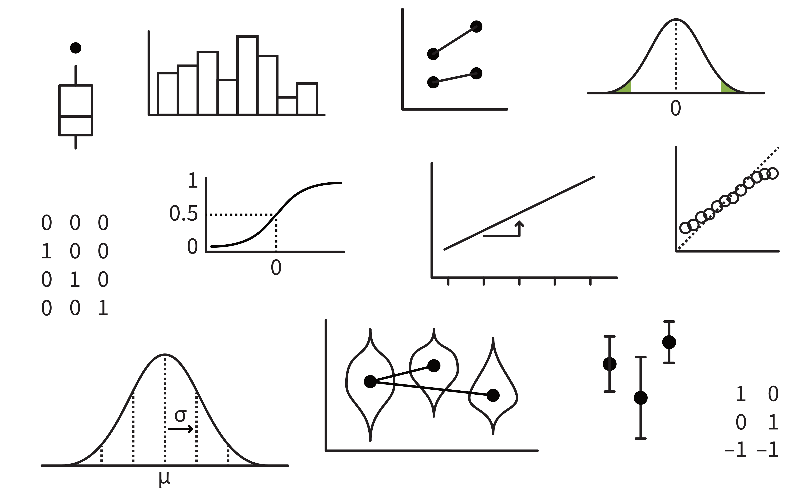
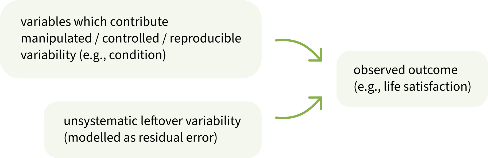
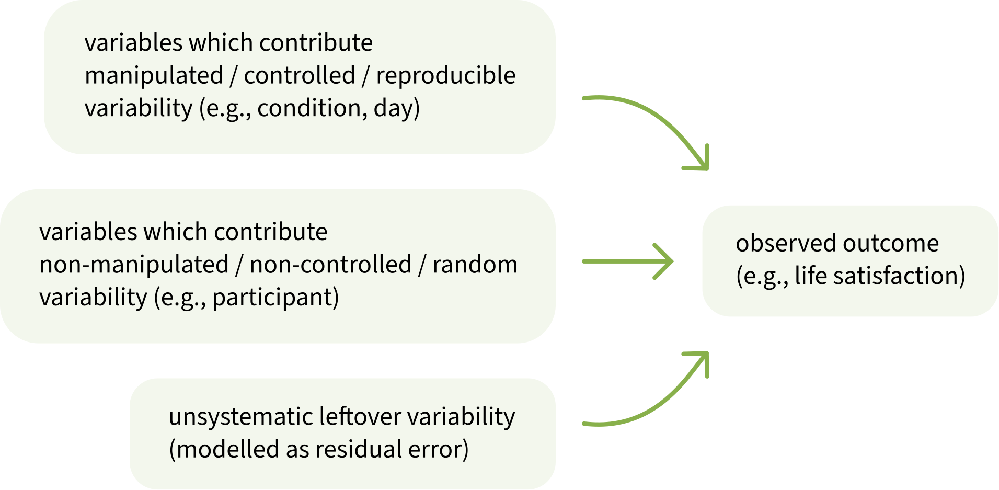

```{r setup, include=F}
library(tidyverse)
library(patchwork)
library(emmeans)
library(simglm)
library(latex2exp)  # for betas in ggplots
source('_theme/theme_quarto.R')

theme_set(theme_quarto(title_font_size=42))
theme_update(
  text = element_text(family = 'Source Sans 3')
)

dapr3green <- "#88B04B" 
dapr3dkgreen <- "#5C7C28"
dapr3ltgreen <- "#E5EED7"
pal <- c( "#d35269", "#5c9ead","#2a3c24", "#F5C396", "#8B2635",  "#235789")
```


# Course Overview {background-color="white"}

<br>

```{r echo=F}
#| results: "asis"
block1_name = "Linear mixed models<br>(with Dr. Elizabeth Pankratz)"
block1_lecs = c("Regression refresher, intro to group-structured data",
                "Modelling group-structured data using random effects",
                "Interpreting LMMs and building maximal models",
                "Troubleshooting model fit, checking assumptions + diagnostics",
                "LMMs: Practice analysis")
block2_name = "factor analysis<br>working with multi-item measures<br>(with Dr. Josiah King)"
block2_lecs = c(
  "measurement and dimensionality",
  "exploring underlying constructs (EFA)",
  "testing theoretical models (CFA)",
  "reliability and validity",
  "recap & exam prep"
  )

source("https://raw.githubusercontent.com/uoepsy/junk/refs/heads/main/R/course_table.R")
course_table(block1_name,block2_name,block1_lecs,block2_lecs,week=1)
```


# Warm-up

## Part 1: Brain dump all the stats terms you know/remember

:::hcenter
:::woo
https://app.wooclap.com/events/SIQRER/
:::
:::

Here are some visuals that might help jog your memory:

{fig-align="center"}


## Part 2: Connect key ideas

:::: {.columns}
::: {.column width="35%"}

:::
::: {.column width="5%"}
:::
::: {.column width="60%"}

**Example terms:**

- standard deviation (SD)
- standard error (SE)
- confidence interval (CI)

:::{.dapr3callout}

**Individually or with your seatmates:**

1. Relax while Elizabeth transfers key terms to the hexagon sheet
2. Using a big-screened device, access hexagons at this link: <https://edin.ac/4cQpsUM>
3. Duplicate Slide 1 and work on your own duplicated copy
4. Click and drag each term from the menu onto its own hexagon.
If two hexagons are touching, then the ideas on each hexagon are somehow connected.

**There are no wrong answers here!**
The purpose of this activity is to help you remember a few of the ways that a few big ideas fit together.

:::

:::
::::

## Part 3: Think about the properties of lines

<br>

:::hcenter
:::woo
https://app.wooclap.com/events/SIQRER/
:::
:::


# Linear regression refresher

## Data: After one week of mindfulness treatments, life satisfaction ratings from 36 people

```{r get lifesat dat, include=F}
lifesat_week <- read_csv('https://uoepsy.github.io/data/lifesat_mindful.csv')

lifesat <- lifesat_week |>
  filter(day == 7) |>
  select(-day)
```

:::: {.columns}
::: {.column width="65%"}
```{r fig.width = 8, fig.height = 6}
#| code-fold: true

set.seed(1)
p_lifesat <- lifesat |>
  ggplot(aes(x = condition, y = lifesat, fill = condition, colour = condition)) +
  geom_violin(alpha = 0.5) +
  geom_jitter(alpha = 0.5, size = 5) +
  stat_summary(geom = 'point', fun = mean, colour = 'black', size = 8) +
  theme(legend.position = 'none') +
  scale_colour_manual(values = pal) +
  scale_fill_manual(values = pal) +
  NULL
p_lifesat
```
:::
::: {.column width="35%"}
```{r}
lifesat |>
  head(15)
```
:::
::::


Numerically, there is a difference between condition means: "meditate" has higher `lifesat` than "journal".

We want to test: **Is that difference between condition means sufficiently unlikely to equal zero?**

## Is the difference between condition means sufficiently unlikely to equal zero?

A linear model will fit a line that passes through the two group means.


```{r echo=F, fig.width = 8, fig.height = 6}
lifesat_mod <- lm(lifesat ~ condition, data = lifesat)

set.seed(1)
p_lifesat_line <- p_lifesat +
  geom_abline(
    intercept = coef(lifesat_mod)[['(Intercept)']] - coef(lifesat_mod)[['conditionmeditate']],
    slope = coef(lifesat_mod)[['conditionmeditate']],
    linewidth = 1
  )
p_lifesat_line
```

- To answer our question, we will first imagine that in reality, the true slope of this line is zero: the groups are not different at all (= our null hypothesis).

- In that reality where the groups are not different, we know the distribution of values that the slope could reasonably have.

- We compare that null distribution to the slope we have actually observed.

- If our observed slope falls in either tail of the null distribution, then we can say that the slope is significantly different from zero!


## Fit the model

```{r}
lifesat_mod <- lm(
  lifesat ~ condition,   # outcome ~ predictor
  data = lifesat
)
```

```{r}
summary(lifesat_mod)
```


## Interpret model coefficients

::::{.columns}
:::{.column width="60%"}

```{r echo=F, fig.width = 8, fig.height = 6}
set.seed(1)
p_lifesat_line
```

:::{style="font-size:80%;"}

```{r echo=F}
cat(paste0(capture.output(
  summary(lifesat_mod)
), '\n')[9:12])
```

:::


:::
:::{.column width="40%"}

**`(Intercept)`** = the estimated average `lifesat` for `condition = 0`, the reference level, which is `journal`.

- People who journal are estimated to have a life satisfaction of 40.95 points, on average.

<br>

**`conditionmeditate`:** = the difference between the average `lifesat` when `condition = 1 = meditate` and the average `lifesat` when `condition = 0 = journal`.

- People who meditate are estimated to have a life satisfaction that's 18.47 points greater than people who journal.
- This estimate is significantly different from zero ($p$ < .001).

:::
::::

<br>

So yes, the difference between condition means is sufficiently unlikely to equal zero!

We reject the H0 and declare that the groups are significantly different.


# Now that we're warmed up: welcome to DAPR3 ✨

## This week's learning objectives

<br>

:::dapr3callout
What is a grouping variable?

<!-- 
- A categorical variable whose values appear more than once in the dataset. 
-->
:::

:::dapr3callout
Why are grouping variables important to know about?

<!-- 
- Because if we have multiple observations from a single source (e.g., a single person) which contribute random variability to our data, then our observations are no longer independent.
- Therefore the linear model's assumption about independent errors is not met.
-->
:::


:::dapr3callout
What does a statistical model aim to represent / to capture / to formalise?

<!-- - The process that generated the data we are modelling. -->
:::

:::dapr3callout
What are the different kinds of variability that a statistical model must account for?

<!-- - Manipulated / controlled / reproducible variability comes from from our predictor variables. -->
<!-- - Non-manipulated / non-controlled / random variability comes from our grouping variables. -->
<!-- - Other random variability not associated with specific variables is modelled as residual error. -->
:::


# Between-subjects vs. <br> repeated measures

## Between-subjects vs. repeated measures: What do these terms mean to you?

<br>

:::hcenter
:::woo
https://app.wooclap.com/events/SIQRER/
:::
:::

## An example of repeated-measures data:<br> One week of mindfulness treatments

:::: {.columns}
::: {.column width="60%"}
```{r fig.width = 8, fig.height = 6}
#| code-fold: true

p_lifesat_week <- lifesat_week |>
  ggplot(aes(x = day, y = lifesat, colour = condition)) +
  geom_smooth(method ='lm', se = F, formula = 'y ~ x', linewidth = 2) +
  geom_jitter(alpha = 0.5, width = .2, size = 5) +
  scale_colour_manual(values = pal) +
  scale_x_continuous(breaks = 1:7) +
  theme(
    legend.position = 'bottom',
    panel.grid.minor.x = element_blank()
  ) +
  NULL
p_lifesat_week
```
:::
::: {.column width="40%"}
```{r}
lifesat_week |>
  head(15)
```
:::
::::

(In the example from before, we were looking at data from Day 7 only!)

RQs: **Does life satisfaction increase, the longer people take part in treatment? Is one treatment associated with greater life satisfaction than the other?**

## How do we know that this is <br> repeated measures data?

:::: {.columns}
::: {.column width="40%"}
```{r}
lifesat_week |>
  head(12)
```
:::
::: {.column width="10%"}
:::
::: {.column width="50%"}
<br>

- We have data from multiple `ppt_id`s (`j1`, `j2`, etc.), and each of those `ppt_id`s appears more than once in our dataset.

- Specifically, each participant has one `lifesat` value per `day`.

- In other words, each participant has contributed **repeated measurements** to the dataset.

:::
::::

<br>

:::dapr3callout
Because each participant contributed multiple observations, we call `ppt_id` a **"grouping variable".**

- `day` and `condition` also contain multiple observations of the same value. In this way, they are also grouping variables. But they're conceptually a bit different from `ppt_id`, as we'll see soon.
:::


# Why are grouping variables important?

## Why are grouping variables important?

<br>

If you took DAPR2, you might remember that linear models make four assumptions:

1. **Linearity of association:** The association between predictors and outcome can reasonably be modelled as a straight line.
1. **Independence of errors:** Each data point is independent from each other data point. (Knowing something about one data point tells you nothing about any of the other data points.)
1. **Normality of errors:** The model's errors (the distance between observed point and model-estimated line) are normally-distributed.
1. **Equal variance of errors:** The model's errors have similar variance across the whole range of model-fitted values.

<br>

As soon as we have repeated-measures data with grouping variables like `ppt_id`, **the data points are no longer independent.**

## Why aren't the data points independent?

```{r}
#| code-fold: true
lifesat_week |>
  filter(ppt_id %in% c('j16', 'm9')) |>
  ggplot(aes(x = day, y = lifesat, colour = ppt_id, shape = ppt_id)) +
  geom_point(size = 7) +
  scale_colour_manual(values = pal[2:3]) +
  scale_x_continuous(breaks = 1:7) +
  theme(
    legend.position = 'bottom',
    panel.grid.minor.x = element_blank()
  ) +
  NULL
```

If we know one data point from `m9`, we can make some good guesses about what values `m9`'s other data points might have. Same for `j16`.

  - In other words: Some of our data gives us information about other parts of our data. 
  - In other words: **Data points from one person are not independent of other data points from that same person.**
  
We use grouping variables to tell the model that data points are not independent, and instead are grouped together in this way.

  - The specifics of *how* we tell the model about grouping variables: next week.
  - This week: **how we identify grouping variables in any dataset.**


# How to identify grouping variables: Two examples

## Ex. 1: Mindfulness treatments, Day 7

```{r fig.width = 8, fig.height = 6, echo=F}
p_lifesat
```

What categorical variables do we have in `lifesat`?

```{r}
glimpse(lifesat)
```


## Ex. 1: Grouping and counting

:::: {.columns}
::: {.column width="47%"}
For `condition`:

```{r}
lifesat |>
  group_by(condition) |>
  count()
```

:::
::: {.column width="5%"}
:::

::: {.column width="47%"}

For `ppt_id`:

```{r}
lifesat |>
  group_by(ppt_id) |>
  count()
```


:::
::::


:::: {.columns}
::: {.column width="47%"}

::::dapr3callout

Each value of `condition` appears more than once.

`condition` is a grouping variable &nbsp;  ✅

::::

:::
::: {.column width="5%"}
:::
::: {.column width="47%"}
::::dapr3callout
Each value of `ppt_id` appears only once.

`ppt_id` is not a grouping variable &nbsp; ❌ 
::::

:::

::::


## Ex. 2: A week of mindfulness treatments

```{r fig.width = 8, fig.height = 6, echo=F}
p_lifesat_week
```


What categorical variables do we have in `lifesat_week`?

```{r}
glimpse(lifesat_week)
```


## Ex. 2: Grouping and counting

:::: {.columns}
::: {.column width="30%"}
For `day`:

```{r}
lifesat_week |>
  group_by(day) |>
  count()
```


:::
::: {.column width="5%"}
:::

::: {.column width="30%"}
For `condition`:

```{r}
lifesat_week |>
  group_by(condition) |>
  count()
```


:::
::: {.column width="5%"}
:::

::: {.column width="30%"}

For `ppt_id`:

```{r}
lifesat_week |>
  group_by(ppt_id) |>
  count()
```


:::
::::


:::: {.columns}
::: {.column width="30%"}

::::dapr3callout

Each value of `day` appears more than once.

`day` is a grouping variable &nbsp;  ✅

::::


:::
::: {.column width="5%"}
:::
::: {.column width="30%"}

::::dapr3callout

Each value of `condition` appears more than once.

`condition` is a grouping variable &nbsp;  ✅

::::

:::
::: {.column width="5%"}
:::
::: {.column width="30%"}
::::dapr3callout
Each value of `ppt_id` appears more than once.

`ppt_id` is a grouping variable &nbsp;  ✅
::::

:::

::::


## Ex. 2: Conceptual differences between these grouping variables

<!-- ```{r fig.width = 8, fig.height = 6, echo=F} -->
<!-- p_lifesat_week -->
<!-- ``` -->

<br>

Our RQs are about how different `condition`s and different `day`s are associated with `lifesat`.

<br>

:::dapr3callout
- Notice that these RQs refers to only two of the grouping variables, `condition` and `day`.
- **`condition` and `day` are manipulated / controlled by our experimental design.**
:::
  
:::dapr3callout
- The RQ does *not* refer to the third grouping variable, `ppt_id`.
- **`ppt_id` is not manipulated / controlled by the experimental design.**
- But our statistical model needs to account for it anyway.
- The first block of DAPR3 is all about learning how to do that.
:::

<br>

{fig-align="center" height="120px"}


# Thinking in models: <br> What process generated the outcome data we observe?

## Ex. 1: Mindfulness treatments, Day 7

:::: {.columns}
::: {.column width="35%"}

```{r fig.width = 7, fig.height = 7, echo=F}
p_lifesat
```


:::
::: {.column width="65%"}

<br>



:::
::::


## Ex. 2: A week of mindfulness treatments

When we have multiple observations from a single source (here, a single person), we have something new: random, non-manipulated variability that comes from a specific variable.


:::: {.columns}
::: {.column width="35%"}

```{r fig.width = 7.5, fig.height = 7, echo=F}
p_lifesat_week
```

:::
::: {.column width="65%"}



:::
::::


## Identifying reproducible vs. random variability: Strategy 1

:::dapr3callout
**Ask yourself:** If the same RQ were tested again in a different experiment, which variables would have to stay the same, and which variables could potentially be different?
:::

<br>

Does the variable **need to contain the same values, or else the RQ could not be tested?**

- If so: this variable contributes **manipulated / controlled / reproducible variability.**
- e.g.:
  - experimental manipulations
  - covariates to control for other influences (e.g., handedness, age, gender)
  
  
<br>
  
Could the variable **potentially contain different values, and the RQ would still be testable?**

- If so: this variable contributes **non-manipulated / non-controlled / random variability.**
- e.g.:
  - participants/subjects
  - stimuli
  
  
  
## Identifying reproducible vs. random variability: Strategy 2

:::dapr3callout
Our goal is often to generalise the results of our analysis to a broader population. <br>
**Ask yourself:** 
What variables can and cannot be generalised over?
:::


If your analysis should be able to generalise across all potential levels of a grouping variable, even beyond the ones you observed, then the grouping variable contributes **non-manipulated / non-controlled / random variability.**

For example: **Do we want our results to generalise to all possible experimental conditions, beyond the ones we studied?**

- The question doesn't really make sense ... what other experimental conditions even are there?
- We only want to make statements about the specific experimental conditions we're testing—that's why we're testing them.
- So a variable that represents experimental conditions does *not* contribute random variability to the data.

But: **Do we want our results to generalise to all possible people, beyond the ones we studied?**

- Yeah, that would be ideal!
- So a variable that represents different people *does* contribute random variability to the data.


<!-- the lab is getting grouping struc and also allocating vars to manip/controlled/reproducible category or random category -->

<!-- {fig-align="center" height="120px"} -->


# Back matter

## Learning objectives revisited


:::dapr3callout
**What is a grouping variable?**

- A categorical variable whose values appear more than once in the dataset.
:::


:::dapr3callout
**Why are grouping variables important to know about?**

- Because if we have multiple observations from a single source (e.g., a single person) which contribute random variability to our data, then our observations are no longer independent.
- Therefore the linear model's assumption about independent errors is not met.
:::


:::dapr3callout
**What does a statistical model aim to represent / to capture / to formalise?**

- The process that generated the data we are modelling.
:::

:::dapr3callout
**What are the different kinds of variability that a statistical model must account for?**

- Manipulated / controlled / reproducible variability comes from from our predictor variables.
- Non-manipulated / non-controlled / random variability comes from our grouping variables.
- Other random variability not associated with specific variables is modelled as residual error.
:::

## To do this week 

<br>

::::{.columns}
:::{.column width="50%"}
**Tasks:**

<br>

{width=80px style="margin:10px;margin-bottom:-50px"} Work on exercises in labs

<br>

{width=80px style="margin:10px;margin-bottom:-45px"} Complete the weekly quiz 


:::

:::{.column width="50%"}
**Get support:**

<br>

{width=80px style="margin:10px;margin-bottom:-30px"}
Consult the [flash cards](https://uoepsy.github.io/dapr3/2627/flashcards/){target="_blank"}

<br>

{width=80px style="margin:10px;margin-bottom:-50px"}
Ask questions anonymously on Piazza

<br>

{width=80px style="margin:10px;margin-bottom:-40px"} 
We really like seeing you in office hours!


:::
::::


# Appendix {.appendix}

## Line plots from Wooclap

<!-- :::: {.columns} -->
<!-- ::: {.column width="50%"} -->
<!-- a -->
<!-- ::: -->
<!-- ::: {.column width="50%"} -->
<!-- b -->
<!-- ::: -->
<!-- :::: -->

```{r wooplots, fig.height = 8, fig.width = 10, fig.align = "center"}
#| code-fold: true

p1 <- ggplot() +
  geom_abline(aes(intercept = 1, slope = 1), linewidth = 2) +
  scale_x_continuous(limits = c(-2, 2), breaks = -2:2) +
  scale_y_continuous(limits = c(0, 5), breaks = 0:5) +
  theme(panel.grid.minor = element_blank()) +
  labs(x = 'x', y = 'y') +
  NULL
# ggsave('figs/woo/w1-p1.png', width = 10, height = 10, units = 'cm')

p2 <- ggplot() +
  geom_abline(aes(intercept = 0, slope = 1), linewidth = 2) +
  scale_x_continuous(limits = c(0, 2), breaks = 0:2) +
  scale_y_continuous(limits = c(0, 3), breaks = 0:3) +
  theme(panel.grid.minor = element_blank()) +
  labs(x = 'x', y = 'y') +
  NULL
# ggsave('figs/woo/w1-p2.png', width = 10, height = 10, units = 'cm')

p3 <- ggplot() +
  geom_abline(aes(intercept = 0, slope = -10), linewidth = 2) +
  scale_x_continuous(limits = c(-2, 2)) +
  scale_y_continuous(limits = c(-30, 30), breaks = seq(-30, 30, by=10)) +
  theme(panel.grid.minor = element_blank()) +
  labs(x = 'x', y = 'y') +
  NULL
# ggsave('figs/woo/w1-p3.png', width = 10, height = 10, units = 'cm')

p4 <- ggplot() +
  geom_abline(aes(intercept = 1, slope = -1), linewidth = 2) +
  scale_x_continuous(limits = c(0, 4), breaks = 0:4) +
  scale_y_continuous(limits = c(-3, 1), breaks = -3:5) +
  theme(panel.grid.minor = element_blank()) +
  labs(x = 'x', y = 'y') +
  NULL
# ggsave('figs/woo/w1-p4.png', width = 10, height = 10, units = 'cm')

p1 + p2 + p3 + p4
```
