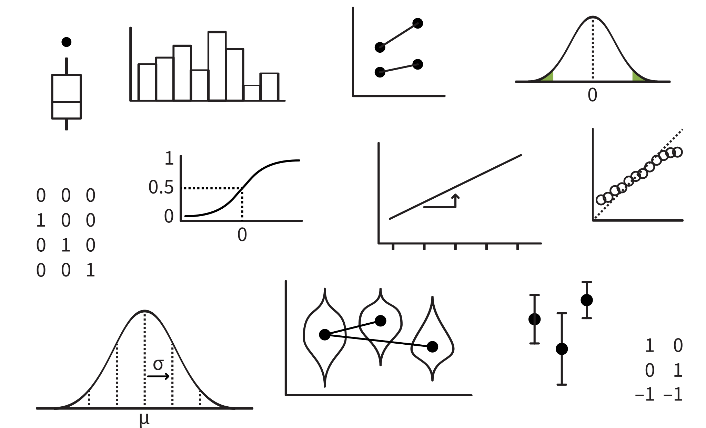

```{r setup, include=F}
library(tidyverse)
library(patchwork)
library(emmeans)
library(simglm)
library(latex2exp)  # for betas in ggplots
source('_theme/theme_quarto.R')

theme_set(theme_quarto(title_font_size=42))
theme_update(
  text = element_text(family = 'Source Sans 3')
)

dapr3green <- "#88B04B" 
dapr3dkgreen <- "#5C7C28"
dapr3ltgreen <- "#E5EED7"
pal <- c( "#d35269", "#5c9ead","#2a3c24", "#F5C396", "#8B2635",  "#235789")
```


# Course Overview {background-color="white"}

<br>

```{r echo=F}
#| results: "asis"
block1_name = "Linear mixed models<br>(with Elizabeth Pankratz)"
block1_lecs = c("Regression refresher, intro to group-structured data",
                "TODO",
                "TODO",
                "TODO",
                "recap")
block2_name = "factor analysis<br>working with multi-item measures<br>(with Josiah King)"
block2_lecs = c(
  "measurement and dimensionality",
  "exploring underlying constructs (EFA)",
  "testing theoretical models (CFA)",
  "reliability and validity",
  "recap & exam prep"
  )

source("https://raw.githubusercontent.com/uoepsy/junk/refs/heads/main/R/course_table.R")
course_table(block1_name,block2_name,block1_lecs,block2_lecs,week=1)
```


# Warm-up

## Part 1: Brain dump every stats term you remember

:::hcenter
:::woo
https://app.wooclap.com/events/SIQRER/
:::
:::

Here are some visuals to jog your memory:

{fig-align="center"}


## Part 2: Connect key ideas

:::: {.columns}
::: {.column width="35%"}

:::
::: {.column width="5%"}
:::
::: {.column width="60%"}

**Example terms:**

- standard deviation (SD)
- standard error (SE)
- confidence interval (CI)

:::{.dapr3callout}

**Individually or with your seatmates:**

1. Relax while Elizabeth transfers key terms to the hexagon sheet
2. Using a big-screened device, access hexagons at this link: <https://edin.ac/4cQpsUM>
3. Duplicate Slide 1 and work on your own duplicated copy
4. Click and drag each term from the menu onto its own hexagon.
If two hexagons are touching, then the ideas on each hexagon are somehow connected.

**There are no wrong answers here!**
The purpose of this activity is to help you remember a few of the ways that a few big ideas fit together.

:::

:::
::::

## Part 3: Think back to linear models

<br>

:::hcenter
:::woo
https://app.wooclap.com/events/SIQRER/
:::
:::


# Regression refresher

## Data: After one week of mindfulness treatments, life satisfaction ratings from 36 people

```{r get lifesat dat, include=F}
lifesat_week <- read_csv('https://uoepsy.github.io/data/lifesat_mindful.csv')

lifesat <- lifesat_week |>
  filter(day == 7) |>
  select(-day)
```

:::: {.columns}
::: {.column width="65%"}
```{r fig.width = 8, fig.height = 6}
#| code-fold: true

p_lifesat <- lifesat |>
  ggplot(aes(x = condition, y = lifesat, fill = condition, colour = condition)) +
  geom_violin(alpha = 0.5) +
  geom_jitter(alpha = 0.5, size = 5) +
  stat_summary(geom = 'point', fun = mean, colour = 'black', size = 8) +
  theme(legend.position = 'none') +
  scale_colour_manual(values = pal) +
  scale_fill_manual(values = pal) +
  NULL
p_lifesat
```
:::
::: {.column width="35%"}
```{r}
lifesat |>
  head(15)
```
:::
::::


Numerically, there is a difference between condition means: "meditate" has higher `lifesat` than "journal".

We want to test: **Is that difference between condition means sufficiently unlikely to equal zero?**


## Prepare the data for the model

contrasts


## Fit the model

math

summary

## Interpret model estimates

plot + summary + prose

# Now that we're warmed up: welcome to DAPR3 ✨

## This week's learning objectives

:::dapr3callout
How do we identify grouping structure in a dataset?


<!-- 
- First make sure the dataset is "tidy": one column per variable, one row per observation.
- Then, we look for categorical variables whose values appear more than once. -->
:::

:::dapr3callout
How do we describe the process that has generated our data?

<!-- - In terms of different sources of variability. -->
<!-- - Manipulated / controlled / reproducible variability comes from from our predictor variables (our "fixed effects"). -->
<!-- - Non-manipulated / non-controlled / random variability comes from our grouping variables (our "random effects"). -->
<!-- - Other random variability not associated with specific variables is modelled as residual error. -->
:::

# Between-subjects vs. repeated measures

## Between-subjects vs. repeated measures

woo: what do these terms mean to you


## An example of repeated-measures data:<br> One week of mindfulness treatments

:::: {.columns}
::: {.column width="60%"}
```{r fig.width = 8, fig.height = 6}
#| code-fold: true

p_lifesat_week <- lifesat_week |>
  ggplot(aes(x = day, y = lifesat, colour = condition)) +
  geom_smooth(method ='lm', se = F, formula = 'y ~ x', linewidth = 2) +
  geom_jitter(alpha = 0.5, width = .2, size = 5) +
  scale_colour_manual(values = pal) +
  scale_x_continuous(breaks = 1:7) +
  theme(
    legend.position = 'bottom',
    panel.grid.minor.x = element_blank()
  ) +
  NULL
p_lifesat_week
```
:::
::: {.column width="40%"}
```{r}
lifesat_week |>
  head(15)
```
:::
::::

(In the regression refresher example from before, we were looking at data from Day 7 only!)


## How do we know that this is repeated measures data?

:::: {.columns}
::: {.column width="40%"}
```{r}
lifesat_week |>
  head(12)
```
:::
::: {.column width="10%"}
:::
::: {.column width="50%"}
<br>

- Notice that each `ppt_id` appears more than once in `lifesat_week`.

- Specifically, each participant has one `lifesat` value per `day`.

- In other words, each participant has contributed **repeated measurements** to the dataset.

:::
::::

<br>

:::dapr3callout
- Because each participant contributed multiple observations, we call `ppt_id` a **grouping variable.**
- Notice that `day` and `condition` also contain multiple observations of the same value. In this way, they are also grouping variables. But they're conceptually a bit different from `ppt_id`, as we'll see soon.
:::


## How do we identify grouping structure?

- Look at the data frame: how many times does each level of a categorical predictor appear?
- Or: use R code to count for us.

Identifying grouping structure is a key skill for DAPR3.
In this week's lab, you'll have a chance to practice it with five different datasets.


# Identifying grouping structure: Two examples

## Ex. 1: Mindfulness treatments, Day 7

```{r fig.width = 8, fig.height = 6, echo=F}
p_lifesat
```

<br>

What categorical variables do we have in `lifesat`?

```{r}
glimpse(lifesat)
```


## Ex. 1: Grouping and counting

:::: {.columns}
::: {.column width="47%"}
For `condition`:

```{r}
lifesat |>
  group_by(condition) |>
  count()
```

:::
::: {.column width="5%"}
:::

::: {.column width="47%"}

For `ppt_id`:

```{r}
lifesat |>
  group_by(ppt_id) |>
  count()
```


:::
::::


:::: {.columns}
::: {.column width="47%"}

::::dapr3callout

Each value of `condition` appears more than once.

`condition` is a grouping variable &nbsp;  ✅

::::

:::
::: {.column width="5%"}
:::
::: {.column width="47%"}
::::dapr3callout
Each value of `ppt_id` appears only once.

`ppt_id` is not a grouping variable &nbsp; ❌ 
::::

:::

::::


## Ex. 2: A week of mindfulness treatments

```{r fig.width = 8, fig.height = 6, echo=F}
p_lifesat_week
```

<br>

What categorical variables do we have in `lifesat_week`?

```{r}
glimpse(lifesat_week)
```


## Ex. 2: Grouping and counting

:::: {.columns}
::: {.column width="30%"}
For `day`:

```{r}
lifesat_week |>
  group_by(day) |>
  count()
```


:::
::: {.column width="5%"}
:::

::: {.column width="30%"}
For `condition`:

```{r}
lifesat_week |>
  group_by(condition) |>
  count()
```


:::
::: {.column width="5%"}
:::

::: {.column width="30%"}

For `ppt_id`:

```{r}
lifesat_week |>
  group_by(ppt_id) |>
  count()
```


:::
::::


:::: {.columns}
::: {.column width="30%"}

::::dapr3callout

Each value of `day` appears more than once.

`day` is a grouping variable &nbsp;  ✅

::::


:::
::: {.column width="5%"}
:::
::: {.column width="30%"}

::::dapr3callout

Each value of `condition` appears more than once.

`condition` is a grouping variable &nbsp;  ✅

::::

:::
::: {.column width="5%"}
:::
::: {.column width="30%"}
::::dapr3callout
Each value of `ppt_id` appears more than once.

`ppt_id` is a grouping variable &nbsp;  ✅
::::

:::

::::


## Ex. 2: Conceptual differences between these grouping variables

<!-- ```{r fig.width = 8, fig.height = 6, echo=F} -->
<!-- p_lifesat_week -->
<!-- ``` -->

<br>

Our RQ is about how different `condition`s and different `day`s are associated with `lifesat`.

<br>

:::dapr3callout
- Notice that this RQ refers to only two of the grouping variables, `condition` and `day`.
- **`condition` and `day` are manipulated / controlled by our experimental design.**
:::
  
:::dapr3callout
- The RQ does *not* refer to the third grouping variable, `ppt_id`.
- **`ppt_id` is not manipulated / controlled by the experimental design.**
- But our statistical model needs to account for it anyway.
- The first block of DAPR3 is all about learning how to do that.
:::

<br>

{fig-align="center" height="120px"}


# Thinking in models: <br> What process generated the outcome data we observe?

## Ex. 1: Mindfulness treatments, Day 7

:::: {.columns}
::: {.column width="50%"}

```{r fig.width = 8, fig.height = 6, echo=F}
p_lifesat
```


:::
::: {.column width="50%"}


:::
::::

## Ex. 2: A week of mindfulness treatments


:::: {.columns}
::: {.column width="50%"}

```{r fig.width = 8, fig.height = 6, echo=F}
p_lifesat_week
```

:::
::: {.column width="50%"}


:::
::::


## Identifying reproducible vs. random variability

<br>

:::dapr3callout
**Ask yourself:** If the same RQ were tested again in a different experiment, which variables would have to stay the same, and which variables could potentially be different?
:::

<br>

Does the variable **need to contain the same values, or else the RQ could not be tested?**

- If so: this variable contributes **manipulated / controlled / reproducible variability.**
- e.g.:
  - experimental manipulations
  - covariates to control for other influences (e.g., handedness, word frequency)
  
<br>
  
Could the variable **potentially contain different values, and the RQ would still be testable?**

- If so: this variable contributes **non-manipulated / non-controlled / random variability.**
- e.g.:
  - participants/subjects
  - stimuli

<!-- the lab is getting grouping struc and also allocating vars to manip/controlled/reproducible category or random category -->


# Back matter

## Learning objectives revisited


## To do this week 

<br>

::::{.columns}
:::{.column width="50%"}
**Tasks:**

<br>

{width=80px style="margin:10px;margin-bottom:-50px"} Work on exercises in labs

<br>

{width=80px style="margin:10px;margin-bottom:-45px"} Complete the weekly quiz 


:::

:::{.column width="50%"}
**Get support:**

<br>

{width=80px style="margin:10px;margin-bottom:-50px"}
Ask questions anonymously on Piazza

<br>

{width=80px style="margin:10px;margin-bottom:-40px"} 
We really like seeing you in office hours!


:::
::::


# Appendix {.appendix}

## Line plots from Wooclap

<!-- :::: {.columns} -->
<!-- ::: {.column width="50%"} -->
<!-- a -->
<!-- ::: -->
<!-- ::: {.column width="50%"} -->
<!-- b -->
<!-- ::: -->
<!-- :::: -->

```{r wooplots, fig.height = 8, fig.width = 10, fig.align = "center"}
#| code-fold: true

p1 <- ggplot() +
  geom_abline(aes(intercept = 1, slope = 1), linewidth = 2) +
  scale_x_continuous(limits = c(-2, 2), breaks = -2:2) +
  scale_y_continuous(limits = c(0, 5), breaks = 0:5) +
  theme(panel.grid.minor = element_blank()) +
  labs(x = 'x', y = 'y') +
  NULL
# ggsave('figs/woo/w1-p1.png', width = 10, height = 10, units = 'cm')

p2 <- ggplot() +
  geom_abline(aes(intercept = 0, slope = 1), linewidth = 2) +
  scale_x_continuous(limits = c(0, 2), breaks = 0:2) +
  scale_y_continuous(limits = c(0, 3), breaks = 0:3) +
  theme(panel.grid.minor = element_blank()) +
  labs(x = 'x', y = 'y') +
  NULL
# ggsave('figs/woo/w1-p2.png', width = 10, height = 10, units = 'cm')

p3 <- ggplot() +
  geom_abline(aes(intercept = 0, slope = -10), linewidth = 2) +
  scale_x_continuous(limits = c(-2, 2)) +
  scale_y_continuous(limits = c(-30, 30), breaks = seq(-30, 30, by=10)) +
  theme(panel.grid.minor = element_blank()) +
  labs(x = 'x', y = 'y') +
  NULL
# ggsave('figs/woo/w1-p3.png', width = 10, height = 10, units = 'cm')

p4 <- ggplot() +
  geom_abline(aes(intercept = 1, slope = -1), linewidth = 2) +
  scale_x_continuous(limits = c(0, 4), breaks = 0:4) +
  scale_y_continuous(limits = c(-3, 1), breaks = -3:5) +
  theme(panel.grid.minor = element_blank()) +
  labs(x = 'x', y = 'y') +
  NULL
# ggsave('figs/woo/w1-p4.png', width = 10, height = 10, units = 'cm')

p1 + p2 + p3 + p4
```


## abc

dolor sit amet

**dolor sit amet**

`abc`

:::dapr3callout
abc
:::


<!-- :::: {.columns} -->
<!-- ::: {.column width="50%"} -->
<!-- a -->
<!-- ::: -->
<!-- ::: {.column width="50%"} -->
<!-- b -->
<!-- ::: -->
<!-- :::: -->


<!-- style="font-size: 70%;" -->

 <!--  -->
 <!--  -->