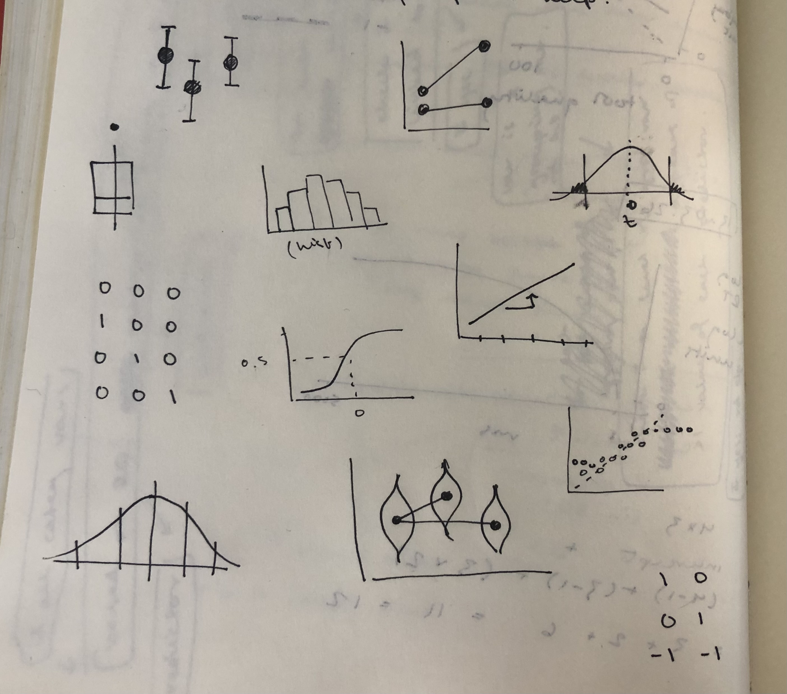

```{r setup, include=F}
library(tidyverse)
library(patchwork)
library(emmeans)
library(simglm)
library(latex2exp)  # for betas in ggplots
source('_theme/theme_quarto.R')
source('ep-playground/simfns.R')


theme_set(theme_quarto(title_font_size=42))
theme_update(
  text = element_text(family = 'Source Sans 3')
)

dapr3green <- "#88B04B" 
dapr3dkgreen <- "#5C7C28"
dapr3ltgreen <- "#E5EED7"
pal <- c("#8B2635", "#5c9ead","#2a3c24", "#F5C396",  "#d35269", "#235789")
```


# Course Overview {background-color="white"}

<br>

```{r echo=F}
#| results: "asis"
block1_name = "Linear mixed models<br>(with Elizabeth Pankratz)"
block1_lecs = c("Regression refresher, intro to group-structured data",
                "TODO",
                "TODO",
                "TODO",
                "recap")
block2_name = "factor analysis<br>working with multi-item measures<br>(with Josiah King)"
block2_lecs = c(
  "measurement and dimensionality",
  "exploring underlying constructs (EFA)",
  "testing theoretical models (CFA)",
  "reliability and validity",
  "recap & exam prep"
  )

source("https://raw.githubusercontent.com/uoepsy/junk/refs/heads/main/R/course_table.R")
course_table(block1_name,block2_name,block1_lecs,block2_lecs,week=1)
```


# Warm-up

## Part 1: Brain dump every stats term you remember

:::hcenter
:::woo
https://app.wooclap.com/events/SIQRER/
:::
:::

Here are some graphics to inspire you and jog your memory:

{fig-align="center"}


## Part 2: Connect key ideas

:::: {.columns}
::: {.column width="35%"}

:::
::: {.column width="5%"}
:::
::: {.column width="60%"}

**Example terms:**

- standard deviation (SD)
- standard error (SE)
- confidence interval (CI)

:::{.dapr3callout}

**Individually or with your seatmates:**

1. Relax while Elizabeth transfers key terms to the hexagon sheet
2. Using a big-screened device, access hexagons at this link: <https://edin.ac/4cQpsUM>
3. Duplicate Slide 1 and work on your own duplicated copy
4. Click and drag each term from the menu onto its own hexagon.
If two hexagons are touching, then the ideas on each hexagon are somehow connected.

**There are no wrong answers here!**
The purpose of this activity is to help you remember a few of the ways that a few big ideas fit together.

:::

:::
::::

## Part 3: Think back to linear models

<br>

:::hcenter
:::woo
https://app.wooclap.com/events/SIQRER/
:::
:::


# Regression refresher

## Data: After one week of mindfulness treatments, life satisfaction ratings from 36 people

```{r sim lifesat, include=F}
half_ppts <- 18
journal <- sim_int_1grp_1pred(seed=2, b0 = 1, b1=.1, N = half_ppts*7, n_groups = half_ppts) |>
  mutate(
    condition = 'journal',
    ppt_id = paste0('j', g)
  ) |>
  select(-y_bin, -g) 
meditate <- sim_int_1grp_1pred(seed=4, b0 = 1, b1=.5, N = half_ppts*7, n_groups = half_ppts) |>
  mutate(
    condition = 'meditate',
    ppt_id = paste0('m', g)
  ) |>
  select(-y_bin, -g)

lifesat_week <- bind_rows(journal, meditate) |>
  rename(day = x1) |>
  mutate(lifesat = datawizard::rescale(y, to = c(15, 75))) |>
  select(-y)

lifesat <- lifesat_week |>
  filter(day == 7) |>
  select(-day)
```

:::: {.columns}
::: {.column width="65%"}
```{r fig.width = 8, fig.height = 6}
#| code-fold: true

p_lifesat <- lifesat |>
  ggplot(aes(x = condition, y = lifesat, fill = condition, colour = condition)) +
  geom_violin(alpha = 0.5) +
  geom_jitter(alpha = 0.5, size = 5) +
  stat_summary(geom = 'point', fun = mean, colour = 'black', size = 8) +
  theme(legend.position = 'none') +
  scale_colour_manual(values = pal) +
  scale_fill_manual(values = pal) +
  NULL
p_lifesat
```
:::
::: {.column width="35%"}
```{r}
lifesat |>
  head(15)
```
:::
::::


Numerically, there is a difference between condition means: "meditate" has higher `lifesat` than "journal".

We want to test: **Is that difference between condition means sufficiently unlikely to equal zero?**


## Prepare the data for the model

contrasts


## Fit the model

math

summary


## Interpret model estimates

plot + summary + prose

# Now: welcome to DAPR3!

## This week's learning objectives

:::dapr3callout
What's the difference between between-subjects data and repeated measures data?
:::

:::dapr3callout
How do we identify grouping structure in datasets?
:::

:::dapr3callout
What kind of variability does grouping structure contribute to a dataset?
:::

# Between-subjects data vs. repeated measures data

## Between-subjects data vs. repeated measures data

woo: what do these terms mean to you


## Repeated-measures data: A week of mindfulness treatments

```{r}

```


## How do we know it's repeated measures?

each ppt contributes more than one data point to the dataset <- ppt is a grouping variable

summarise data

## How do we identify grouping variables in a dataset?

Summarise.

Identifying grouping structure is a key skill for DAPR3, so in this week's lab, you'll have a chance to practice it on ten different datasets.


# Identifying grouping structure

## Example 1

## Example 2

## Example 3


# Thinking in models:  What process generated the outcome data we observe?

## Between-subjects data (final day only)

:::: {.columns}
::: {.column width="50%"}

```{r fig.width = 8, fig.height = 6, echo=F}
p_lifesat
```


:::
::: {.column width="50%"}

DGP diagram


:::
::::

## Repeated measures data (a week of data)


[DGP for LMM: systematic variation from some vars, random variation from some vars, residual error]


## What kind of variables contribute random variability?

Grouping variables.


# Back matter

## Learning objectives revisited


## To do this week 

<br>

::::{.columns}
:::{.column width="50%"}
**Tasks:**

<br>

{width=80px style="margin:10px;margin-bottom:-30px"} Check out the readings

<br>

{width=80px style="margin:10px;margin-bottom:-50px"} Work on exercises in labs

<br>

{width=80px style="margin:10px;margin-bottom:-45px"} Complete the weekly quiz 


:::

:::{.column width="50%"}
**Get support:**

<br>

{width=80px style="margin:10px;margin-bottom:-50px"}
Ask questions anonymously on Piazza

<br>

{width=80px style="margin:10px;margin-bottom:-40px"} 
We really like seeing you in office hours!


:::
::::


# Appendix {.appendix}

## Line plots from Wooclap

<!-- :::: {.columns} -->
<!-- ::: {.column width="50%"} -->
<!-- a -->
<!-- ::: -->
<!-- ::: {.column width="50%"} -->
<!-- b -->
<!-- ::: -->
<!-- :::: -->

```{r wooplots, echo=F, fig.align = "center"}
p1 <- ggplot() +
  geom_abline(aes(intercept = 1, slope = 1), linewidth = 2) +
  scale_x_continuous(limits = c(-2, 2), breaks = -2:2) +
  scale_y_continuous(limits = c(0, 5), breaks = 0:5) +
  theme(panel.grid.minor = element_blank()) +
  labs(x = 'x', y = 'y') +
  NULL
# ggsave('figs/woo/w1-p1.png', width = 10, height = 10, units = 'cm')

p2 <- ggplot() +
  geom_abline(aes(intercept = 0, slope = 1), linewidth = 2) +
  scale_x_continuous(limits = c(0, 2), breaks = 0:2) +
  scale_y_continuous(limits = c(0, 3), breaks = 0:3) +
  theme(panel.grid.minor = element_blank()) +
  labs(x = 'x', y = 'y') +
  NULL
# ggsave('figs/woo/w1-p2.png', width = 10, height = 10, units = 'cm')

p3 <- ggplot() +
  geom_abline(aes(intercept = 0, slope = -10), linewidth = 2) +
  scale_x_continuous(limits = c(-2, 2)) +
  scale_y_continuous(limits = c(-30, 30), breaks = seq(-30, 30, by=10)) +
  theme(panel.grid.minor = element_blank()) +
  labs(x = 'x', y = 'y') +
  NULL
# ggsave('figs/woo/w1-p3.png', width = 10, height = 10, units = 'cm')

p4 <- ggplot() +
  geom_abline(aes(intercept = 1, slope = -1), linewidth = 2) +
  scale_x_continuous(limits = c(0, 4), breaks = 0:4) +
  scale_y_continuous(limits = c(-3, 1), breaks = -3:5) +
  theme(panel.grid.minor = element_blank()) +
  labs(x = 'x', y = 'y') +
  NULL
# ggsave('figs/woo/w1-p4.png', width = 10, height = 10, units = 'cm')

p1 + p2 + p3 + p4
```


## abc

dolor sit amet

**dolor sit amet**

`abc`

:::dapr3callout
abc
:::


<!-- :::: {.columns} -->
<!-- ::: {.column width="50%"} -->
<!-- a -->
<!-- ::: -->
<!-- ::: {.column width="50%"} -->
<!-- b -->
<!-- ::: -->
<!-- :::: -->


<!-- style="font-size: 70%;" -->

 <!--  -->
 <!--  -->