```{r setup, include=F}
library(tidyverse)
library(patchwork)
library(emmeans)
library(simglm)
library(latex2exp)  # for betas in ggplots
source('_theme/theme_quarto.R')

theme_set(theme_quarto(title_font_size=42))
theme_update(
  text = element_text(family = 'Source Sans 3')
)

dapr3green <- "#88B04B" 
dapr3dkgreen <- "#5C7C28"
dapr3ltgreen <- "#E5EED7"
pal <- c( "#d35269", "#5c9ead","#2a3c24", "#F5C396", "#8B2635",  "#235789")
```


# Course Overview {background-color="white"}

<br>

```{r echo=F}
#| results: "asis"
block1_name = "Linear mixed models<br>(with Dr. Elizabeth Pankratz)"
block1_lecs = c("Regression refresher, intro to group-structured data",
                "Modelling group-structured data using random effects",
                "Interpreting LMMs and building maximal models",
                "Troubleshooting model fit, checking assumptions + diagnostics",
                "LMMs: Practice analysis")
block2_name = "factor analysis<br>working with multi-item measures<br>(with Dr. Josiah King)"
block2_lecs = c(
  "measurement and dimensionality",
  "exploring underlying constructs (EFA)",
  "testing theoretical models (CFA)",
  "reliability and validity",
  "recap & exam prep"
  )

source("https://raw.githubusercontent.com/uoepsy/junk/refs/heads/main/R/course_table.R")
course_table(block1_name,block2_name,block1_lecs,block2_lecs,week=2)
```

## This week's learning objectives

<!-- - How do we tell a linear model that relationships between variables might be different for different levels of our grouping variables? -->

- What makes a linear mixed model different from a simple linear model?
- What are intercept adjustments?
- What are slope adjustments?
- What are random effects?


# This week's data

## Example data: Reaction times in the <br> Implicit Association Test (IAT)

The IAT asks you to categorise words from different topics together as quickly and accurately as you can.

For example, to test if you implicitly associate anxiety with yourself:

::::{.r-stack}

:::{.fragment}

{width=50% fig-align="center"}
:::

:::{.fragment}

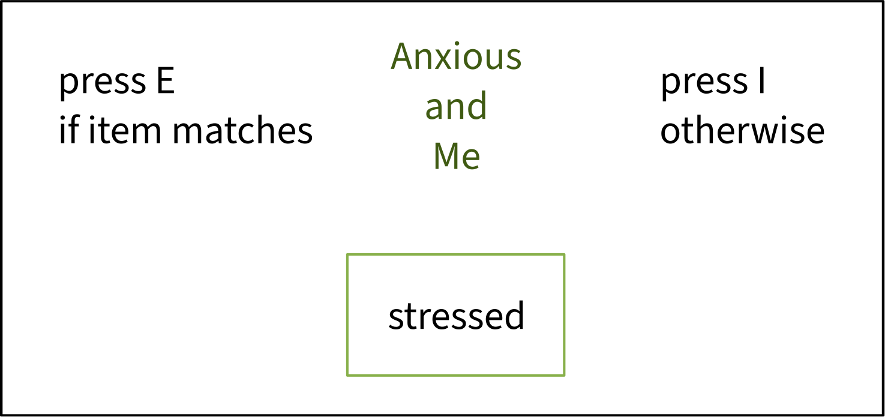{width=50% fig-align="center"}

:::


:::{.fragment}

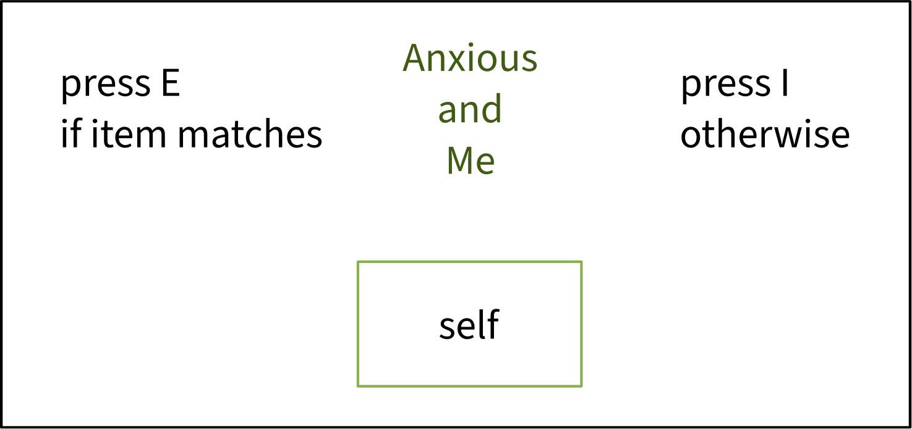{width=50% fig-align="center"}

:::
::::

:::fragment

In theory, if you implicitly associate anxiety and yourself, then your reaction times should be faster for the category "anxious and me" (associated) compared to the category, e.g., "anxious and others" (unassociated).

Note: The IAT 
[doesn't actually work](https://psych.wisc.edu/Brauer/BrauerLab/index.php/implicit-bias/){target="_blank"}, but the data is structured perfectly to teach you what I want to teach you!

:::


## Example data: Log reaction times in the <br> Implicit Association Test (IAT)

```{r include=F}
implicit_data <- read_csv('data/iat.csv') |>
  mutate(pairing = factor(pairing, levels = c('Unassociated', 'Associated')))
```

:::: {.columns}
::: {.column width="50%"}

```{r fig.width = 7, fig.height = 7}
#| code-fold: true
set.seed(1)
implicit_data |>
  ggplot(aes(x = pairing, y = logRT)) +
  geom_violin() +
  geom_jitter(alpha = 0.05, size = 3) +
  NULL
```

:::
::: {.column width="5%"}
:::
::: {.column width="45%"}

```{r}
implicit_data |>
  head(16)
```


:::
::::


## Side note: Why are we log-transforming <br> reaction times?

:::: {.columns}
::: {.column width="50%"}

**Raw reaction times:**

```{r fig.width = 7, fig.height = 6.5}
#| code-fold: true
implicit_data |>
  mutate(RT = exp(logRT)) |>
  ggplot(aes(x = pairing, y = RT)) +
  geom_violin() +
  geom_jitter(alpha = 0.05, size = 3) +
  labs(
    y = 'RT in milliseconds',
  ) +
  NULL
```

:::
::: {.column width="50%"}

**Log-transformed reaction times:**

```{r fig.width = 7, fig.height = 6.5}
#| code-fold: true
set.seed(1)
implicit_data |>
  ggplot(aes(x = pairing, y = logRT)) +
  geom_violin() +
  geom_jitter(alpha = 0.05, size = 3) +
  NULL
```

:::
::::

Reaction times in milliseconds have a very skewed distribution, so **the assumption of normal distribution of errors is not met.**
To get around this, we take their logarithm.


## Grouping structure

`implicit_data` contains two grouping variables which contribute non-manipulated / non-controlled / random variability to `logRT`:

:::: {.columns}
::: {.column width="50%"}

`ppt_id`: the person who participated in the experiment.

```{r}
implicit_data |>
  group_by(ppt_id) |>
  count()
```


:::
::: {.column width="50%"}

`item_id`: the word that people categorise (e.g., "calm", "stressed", "self").

```{r}
implicit_data |>
  group_by(item_id) |>
  count()
```

:::
::::

<br>

<!-- **This week we'll learn how to incorporate this grouping structure into a linear model.** -->

## Cross-tabulate grouping variables to see how they relate

"Cross-tabulate" is a fancy way to say "count all combinations of".

This is something that `xtabs()` from the `stats` package can do for us.

```{r}
stats::xtabs(
  ~ ppt_id + item_id,    # write the variables to crosstabulate in this format
  data = implicit_data
)
```


## Plot the data for a few individual participants

```{r fig.width = 12, fig.height = 8}
#| code-fold: true
ppts_to_plot <- c(56, 14, 33, 24, 44, 31, 67, 97, 99)

p_implicit_ppts <- implicit_data |>
  mutate(
    pairing_num = ifelse(pairing == 'Unassociated', 0, 1)
  ) |>
  filter(ppt_id %in% paste0('ppt', ppts_to_plot)) |>
  ggplot(aes(x = pairing_num, y = logRT)) +
  geom_jitter(alpha = 0.2, width = 0.1, size = 3) +
  stat_summary(fun = mean, geom = 'point', size = 5) +
  stat_summary(aes(group = ppt_id), fun = mean, geom = 'line') +
  facet_wrap(~ ppt_id) +
  scale_x_continuous(breaks = c(0, 1), limits = c(-0.3, 1.3), labels = c('Unassoc.', 'Assoc.')) +
  labs(x = 'Topic pairing') +
  theme(
    strip.background = element_blank(),
    panel.border = element_rect(linewidth = 1),
    panel.grid = element_blank()
  )

p_implicit_ppts
```


## Plot the data for a few individual items

```{r fig.width = 12, fig.height = 8}
#| code-fold: true
items_to_plot <- c(1, 2, 4, 13, 6, 8, 14, 27, 32)

p_implicit_items <- implicit_data |>
  mutate(
    pairing_num = ifelse(pairing == 'Unassociated', 0, 1)
  ) |>
  filter(item_id %in% paste0('item', items_to_plot)) |>
  ggplot(aes(x = pairing_num, y = logRT)) +
  geom_jitter(alpha = 0.1, width = 0.1, size = 3) +
  stat_summary(fun = mean, geom = 'point', size = 5) +
  stat_summary(aes(group = item_id), fun = mean, geom = 'line') +
  facet_wrap(~ item_id) +
  scale_x_continuous(breaks = c(0, 1), limits = c(-0.3, 1.3), labels = c('Unassoc.', 'Assoc.')) +
  labs(x = 'Topic pairing') +
  theme(
    strip.background = element_blank(),
    panel.border = element_rect(linewidth = 1),
    panel.grid = element_blank()
  )

p_implicit_items
```


## How do we tell a model that particpants and items don't all perform the same?

<br>

In this lecture, we will work our way toward the answer step by step.

We'll start with how *not* to model this data, each time getting closer to how we *will* end up modelling it.


# The first wrong way to model this data

## The first wrong way to model this data: <br> Ignore groups and fit a simple LM

```{r}
implicit_lm <- lm(
  logRT ~ pairing,  # predict logRT as a function of pairing (Unassoc = 0, Assoc = 1)
  data = implicit_data
)
```

```{r}
summary(implicit_lm)
```


## The simple LM has no way of knowing that different participants behave differently


```{r fig.width = 12, fig.height = 8}
#| code-fold: true
p_implicit_ppts +
  geom_abline(
    intercept = coef(implicit_lm)[['(Intercept)']],
    slope = coef(implicit_lm)[['pairingAssociated']],
    colour = 'red',
    linewidth = 1
  )
```

The red line is the line estimated by the simple LM: <span style="color:red"> intercept = 4.77, slope = –0.76.</span>

<!-- ## And the simple LM has no way of knowing that different items behave differently -->

<!-- ```{r fig.width = 12, fig.height = 8} -->
<!-- #| code-fold: true -->
<!-- p_implicit_items + -->
<!--   geom_abline( -->
<!--     intercept = coef(implicit_lm)[['(Intercept)']], -->
<!--     slope = coef(implicit_lm)[['pairingAssociated']], -->
<!--     colour = 'red', -->
<!--     linewidth = 1 -->
<!--   )  -->
<!-- ``` -->

<!-- The red line is the line estimated by the simple LM: <span style="color:red"> intercept = 4.77, slope = –0.76.</span> -->


<!-- ## Why is this model wrong for the data? -->

<!-- <br> -->

<!-- **The assumption of independent errors is violated.**  -->

<!-- When grouping variables contribute random variability, **data points are no longer independent.** -->

<!-- <br> -->

<!-- For example: -->

<!-- - Data from `ppt14` will pattern in a way that's different to data from `ppt56`. -->
<!-- - Data from `item1` will pattern in a way that's different to data from `item27`. -->


# The second wrong way to model this data

## The second wrong way to model this data: <br> Fit a different simple LM for each participant

```{r}
implicit_lmlist <- lme4::lmList(
  logRT ~ pairing | ppt_id,  # fits logRT ~ pairing separately for each ppt_id
  data = implicit_data
)
```

```{r eval=F}
implicit_lmlist
```

```{r echo=F}
cat(paste0(capture.output(
  implicit_lmlist
), '\n')[1:20])
```


## Now we have a different line for each participant

```{r fig.width = 12, fig.height = 8}
#| code-fold: true
indiv_ppt_coefs <- coef(implicit_lmlist) |>
  rownames_to_column(var = 'ppt_id')

p_implicit_ppts +
  geom_abline(
    data = filter(indiv_ppt_coefs, ppt_id %in% paste0('ppt', ppts_to_plot)),
    aes(intercept = `(Intercept)`, slope = pairingAssociated, colour = ppt_id),
    linewidth = 1
  )  +
  theme(legend.position = 'none')
```


**... but these models are still averaging over all the different items and ignoring *their* variability.**


## Ways to analyse group-structured data

:::: {.columns}
::: {.column width="30%" .fragment fragment-index=1}
Fit one simple linear model to the whole dataset

<br>

::::{.hcenter style="font-size:200%;"}
❌
::::

:::

::: {.column width="5%"}
:::


::: {.column width="30%" .fragment fragment-index=3}
**Fit one linear model which**

- **estimates the average effect across the whole dataset**
- **also estimates how each participant and each item *differ* from that average**

<br>

::::{.hcenter style="font-size:200%;"}
✅
::::

:::

::: {.column width="5%"}
:::

::: {.column width="30%" .fragment fragment-index=2}
Fit a different simple linear model to data from each participant or each item

<br>

::::{.hcenter style="font-size:200%;"}
❌
::::

:::
::::


## What does it mean for participants/items to differ from the average effect?

<br>

Let's start thinking it through together.

<br>


:::hcenter
:::woo
https://app.wooclap.com/events/UGASPNX/
:::
:::


# The right way to model this data: A linear mixed model (LMM)

## Our first linear mixed model (LMM)

Instead of `lm()`, we have to use `lmer()` from the library `lme4`.

```{r}
library(lme4)

implicit_lmm_int <- lmer(
  logRT ~ pairing + (1 | ppt_id),   # notice the new thing in the model formula!
  data = implicit_data
)
```

<br>

**What is `(1 | ppt_id)`?**

- It tells the model to *adjust* the main intercept estimate for each `ppt_id`.
- We call it an "intercept adjustment by `ppt_id`" or a "random intercept by `ppt_id`".

 
  
## Intercept adjustments by `ppt_id`

`(1 | ppt_id)` tells the model to **estimate how much the average intercept should be nudged up or down,** in order to best fit the data from each participant.

<br>

We can use `ranef()` to extract the list of these adjustments:

```{r}
ranef(implicit_lmm_int)$ppt_id |> head()
```


<br>

:::: {.columns}
::: {.column width="30%"}
For example, for `ppt1`:

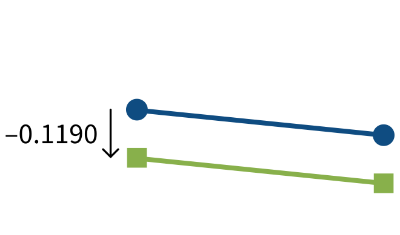
:::

::: {.column width="5%"}
:::


::: {.column width="30%"}
For `ppt10`:

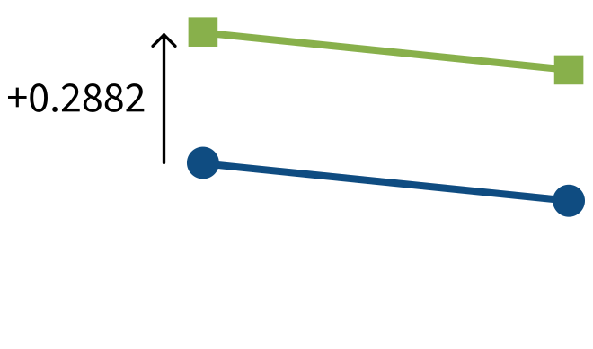

:::

::: {.column width="5%"}
:::

::: {.column width="30%"}
For `ppt100`:

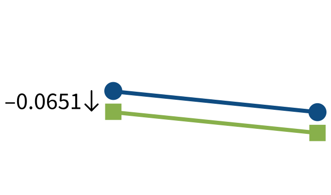

:::
::::

## Plot each participant's intercept adjustments

```{r fig.height = 7, fig.width = 10}
dotplot.ranef.mer(
  ranef(implicit_lmm_int)
)$ppt_id
```

  
## Look at the full LMM summary

::::{.columns}
::: {.column width="60%"}
```{r}
summary(implicit_lmm_int)
```
:::
::: {.column width="40%"}

<br>

New sections in the model summary!

**"Random effects:"**

- The by-participant adjustments to the intercept (and how variable they are).
- The residuals, that is, how far each participant's data points are from their adjusted line (and how variable the residuals are).


**"Fixed effects:"**

- The average intercept and average slope for the whole dataset.
  - Also called **fixed intercept** and **fixed slope.**
- These are the same $\beta$ coefficients as always. Same interpretations apply.

:::
::::


## How well does the random-intercept model fit each participant's data?

```{r fig.width = 12, fig.height = 8}
#| code-fold: true
random_int_coefs <- coef(implicit_lmm_int)$ppt_id |>
  rownames_to_column(var = 'ppt_id')

p_implicit_ppts +
  geom_abline(
    data = filter(random_int_coefs, ppt_id %in% paste0('ppt', ppts_to_plot)),
    aes(intercept = `(Intercept)`, slope = pairingAssociated, colour = ppt_id),
    linewidth = 1
  )  +
  theme(legend.position = 'none')
```


## To see each participant's adjusted parameters, use `coef()`

```{r}
coef(implicit_lmm_int)$ppt_id |>
  head(16)
```

<br>

Each participant's line has a different intercept, but they all still have the same slope ... for now ...


# Adding slope adjustments for each participant

## Adding slope adjustments for each participant

<br>

Let's think together about what different slope adjustments might look like.

<br>

:::hcenter
:::woo
https://app.wooclap.com/events/UGASPNX/
:::
:::


## Estimating intercept AND slope adjustments for each participant

```{r}
implicit_lmm_int_slp <- lmer(
  logRT ~ pairing + (1 + pairing | ppt_id),
  data = implicit_data
)
```

<br>

`(1 + pairing| ppt_id)` tells the model to adjust the fixed intercept **and** the fixed slope over `pairing` for each `ppt_id`.

- `1` represents the adjustment to the fixed intercept.
- `+ pairing` represents the adjustment to the fixed slope over `pairing`.
<!-- - It is possible and common to include intercept adjustments without slope adjustments. -->
  <!-- - You'll probably never need to estimate slope adjustments without intercept adjustments.  -->
  <!-- - In other words, if your model has a slope adjustment, your model should also have an intercept adjustment; but if your model has an intercept adjustment, it may or may not have a slope adjustment. -->
 

<!-- ## What does it mean to "adjust the slope"? -->


<!-- :::: {.columns} -->
<!-- ::: {.column width="30%"} -->
<!-- The average association between `logRT` and `pairing`: -->

<!-- <br> -->

<!--  -->
<!-- ::: -->

<!-- ::: {.column width="5%"} -->
<!-- ::: -->


<!-- ::: {.column width="30%"} -->
<!-- If a participant has a **more positive effect of `pairing` than average**, then they will have a **positive adjustment to the fixed slope of `pairing`.** -->

<!--  -->

<!-- ::: -->

<!-- ::: {.column width="5%"} -->
<!-- ::: -->

<!-- ::: {.column width="30%"} -->
<!-- If a participant has a **more negative effect of `pairing` than average**, then they will have a **negative adjustment to the fixed slope of `pairing`.** -->

<!--  -->

<!-- ::: -->
<!-- :::: -->


## Intercept and slope adjustments

When we include `(1 + pairing | ppt_id)` in the model formula, we tell the model to **estimate how much the fixed intercept AND the fixed slope over `pairing` should be nudged up or down by** in order to fit the data from each participant.

<br>

Let's look at the adjustments that the model has estimated:

```{r}
ranef(implicit_lmm_int_slp)$ppt_id |> head()
```

<br>

::::{.columns}
:::{.column width="50%"}
For example, for `ppt1`:

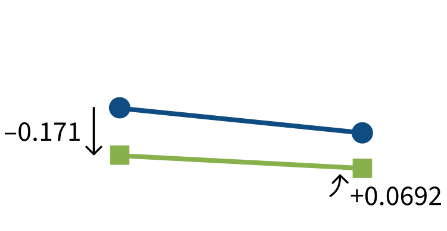{width="70%"}
:::
:::{.column width="50%"}
For `ppt10`:

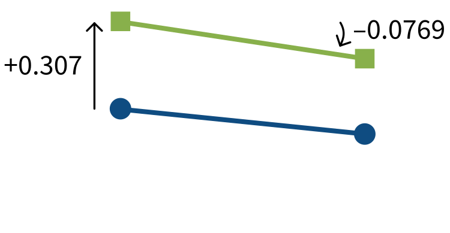{width="70%"}
:::
::::


## Plot each participant's intercept and slope adjustments

```{r fig.height = 7, fig.width = 10}
dotplot.ranef.mer(
  ranef(implicit_lmm_int_slp)
)$ppt_id
```

  
## Look at the full LMM summary

::::{.columns}
::: {.column width="60%"}
```{r}
summary(implicit_lmm_int_slp)
```
:::
::: {.column width="5%"}
:::
::: {.column width="35%"}

<br>

**Some new stuff happening in the random effects section!**

- Old: The by-participant adjustments to the intercept (and how variable they are).
- **New:** The by-participant adjustments to the slope over `pairing` (and how variable they are).
- **New:** The correlation between intercept adjustments and slope adjustments.
- Old: The residuals, that is, how far each participant's data points are from their adjusted line (and how variable the residuals are).

:::
::::

## To see each participant's adjusted parameters, use `coef()`

```{r}
coef(implicit_lmm_int_slp)$ppt_id |>
  head(16)
```

Now each participant has their own intercept and their own slope, like before when we fit a single model for each participant.

But unlike before, now we can derive all the lines for each participant from the same model, yay!


## How well does the random-intercept and random-slope model fit each participant's data?

```{r fig.width = 12, fig.height = 8}
#| code-fold: true
random_int_slp_coefs <- coef(implicit_lmm_int_slp)$ppt_id |>
  rownames_to_column(var = 'ppt_id')

p_implicit_ppts +
  geom_abline(
    data = filter(random_int_slp_coefs, ppt_id %in% paste0('ppt', ppts_to_plot)),
    aes(intercept = `(Intercept)`, slope = pairingAssociated, colour = ppt_id),
    linewidth = 1
  )  +
  theme(legend.position = 'none')
```

It's a lot better than the random-intercept-only model!

But still not awesome, because there's still another source of variability that we haven't yet modelled...


## No adjustments for each item :(

```{r fig.width = 12, fig.height = 8}
#| code-fold: true
p_implicit_items +
  geom_abline(
    intercept = fixef(implicit_lmm_int_slp)[['(Intercept)']],
    slope = fixef(implicit_lmm_int_slp)[['pairingAssociated']],
    colour = 'red',
    linewidth = 1
  ) 
```

Currently, the model currently averages over all items and imagines that they all pattern exactly the same, because we haven't told it that each item might also vary.

The red line is the line with the fixed effect parameters: <span style="color:red"> intercept = 4.77, slope = –0.76.</span>

# Adding random effects by item

## Adding random effects by item

```{r}
implicit_full_lmm <- lmer(
  logRT ~ pairing + (1 + pairing | ppt_id) + (1 + pairing | item_id),  # new term!
  data = implicit_data
)
```

<br>

Now we have

- random intercepts (aka intercept adjustments) by `ppt_id`
- random slopes (aka slope adjustments) over `pairing` by `ppt_id`

and also

- random intercepts (aka intercept adjustments) by `item_id`
- random slopes (aka slope adjustments) over `pairing` by `item_id`


## Look at all the adjustments

::::{.columns}
:::{.column width="50%"}
```{r}
ranef(implicit_full_lmm)$ppt_id |> 
  head(12)
```

<br>

For example, for `ppt1:`

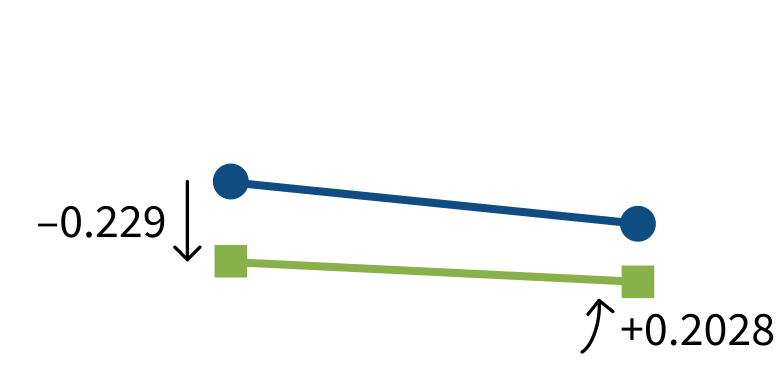{width="70%" fig-align="center"}
:::
:::{.column width="50%"}
```{r}
ranef(implicit_full_lmm)$item_id |> 
  head(12)
```

<br>

For example, for `item1:`

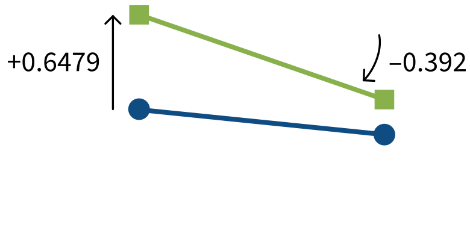{width="70%" fig-align="center"}
:::
::::


## Plot the by-participant intercept and slope adjustments

```{r}
dotplot.ranef.mer(ranef(implicit_full_lmm))$ppt_id
```


## Plot the by-item intercept and slope adjustments

```{r}
dotplot.ranef.mer(ranef(implicit_full_lmm))$item_id
```


## This model captures by-participant variability

```{r fig.width = 12, fig.height = 8}
#| code-fold: true
full_llm_ppt_coefs <- coef(implicit_full_lmm)$ppt_id |>
  rownames_to_column(var = 'ppt_id')

p_implicit_ppts +
  geom_abline(
    data = filter(full_llm_ppt_coefs, ppt_id %in% paste0('ppt', ppts_to_plot)),
    aes(intercept = `(Intercept)`, slope = pairingAssociated, colour = ppt_id),
    linewidth = 1
  )  +
  theme(legend.position = 'none')
```


## This model also captures by-item variability!

```{r fig.width = 12, fig.height = 8}
#| code-fold: true
full_llm_item_coefs <- coef(implicit_full_lmm)$item_id |>
  rownames_to_column(var = 'item_id')

p_implicit_items +
  geom_abline(
    data = filter(full_llm_item_coefs, item_id %in% paste0('item', items_to_plot)),
    aes(intercept = `(Intercept)`, slope = pairingAssociated, colour = item_id),
    linewidth = 1
  )  +
  theme(legend.position = 'none')
```


## Recap: Intro to linear mixed models (LMMs)

- The difference between a simple linear model and a linear mixed model:
  - A simple linear model has no random effects.
  - **A linear mixed model has random effects.**

- "Random effects": an umbrella term that refers to both **random intercepts** and **random slopes**.

- Sometimes we fit LMMs that have only random intercepts, or LMMs that have both random intercepts and random slopes.
  - We don't really ever fit LMMs that have only random slopes.

- We are teaching you how to use LMMs because they are the current state of the art for doing inferential statistics in Psychology and adjacent fields (especially for experimental/clinical research.)


# Back matter

## Learning objectives revisited


## To do this week 

<br>

::::{.columns}
:::{.column width="50%"}
**Tasks:**

<br>

{width=80px style="margin:10px;margin-bottom:-50px"} Work on exercises in labs

<br>

{width=80px style="margin:10px;margin-bottom:-45px"} Complete the weekly quiz 


:::

:::{.column width="50%"}
**Get support:**

<br>

{width=80px style="margin:10px;margin-bottom:-30px"}
Consult the [flash cards](https://uoepsy.github.io/dapr3/2627/flashcards/){target="_blank"}

<br>

{width=80px style="margin:10px;margin-bottom:-50px"}
Ask questions anonymously on Piazza

<br>

{width=80px style="margin:10px;margin-bottom:-40px"} 
We really like seeing you in office hours!


:::
::::


# Appendix {.appendix}


## Wooclap images (1)

Is the participant's intercept more positive or more negative than the average intercept?

:::hcenter

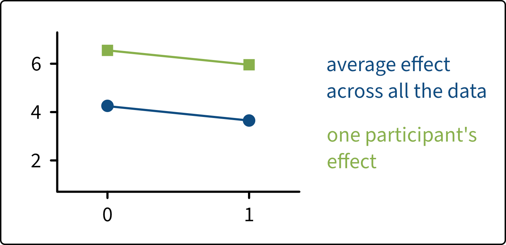{width="40%"}

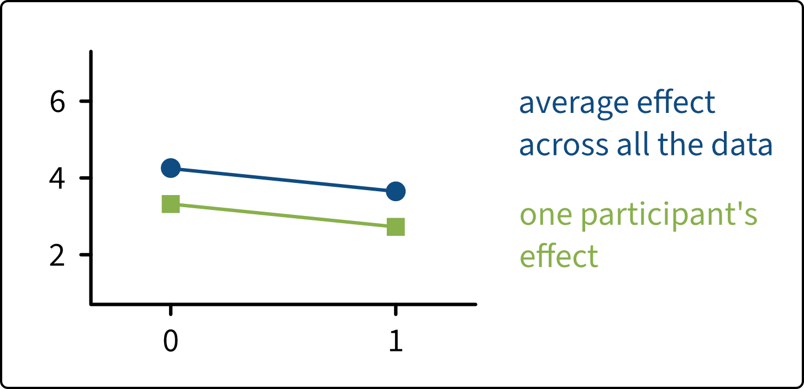{width="40%"}

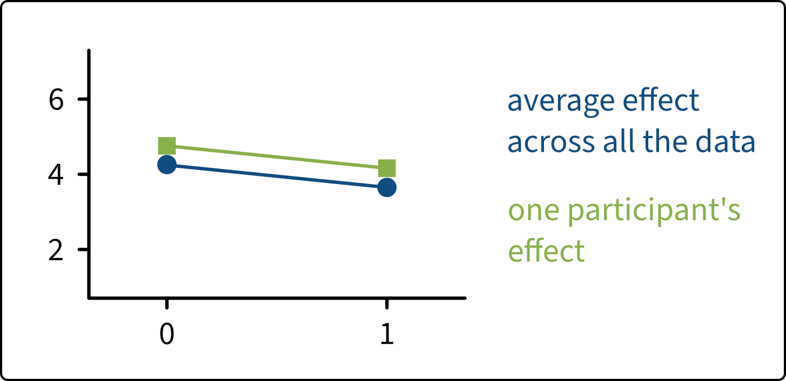{width="40%"}

:::

## Wooclap images (2)

Is the participant's slope more positive or more negative than the average slope?

:::hcenter

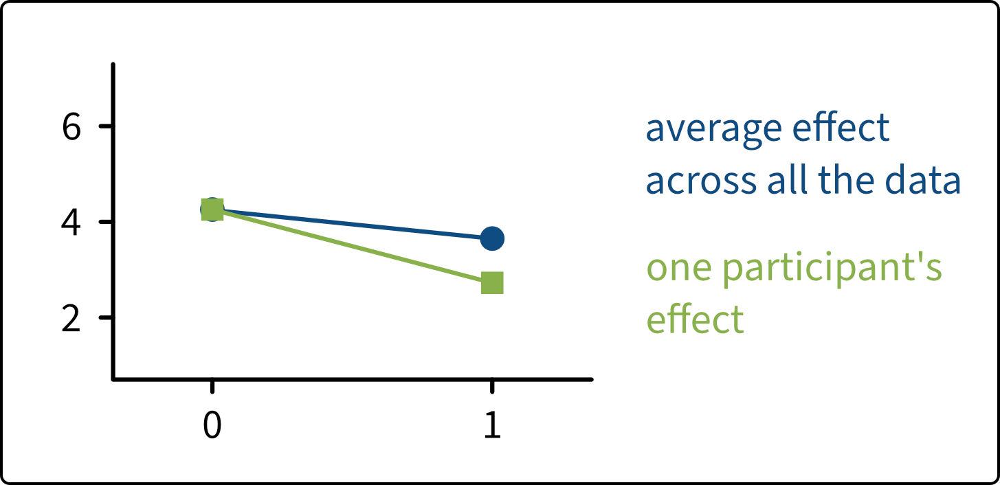{width="40%"}

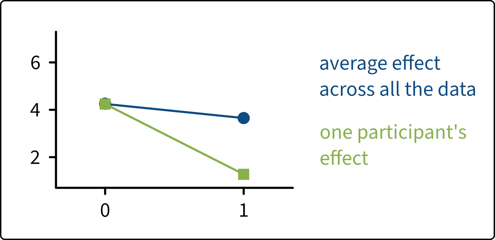{width="40%"}

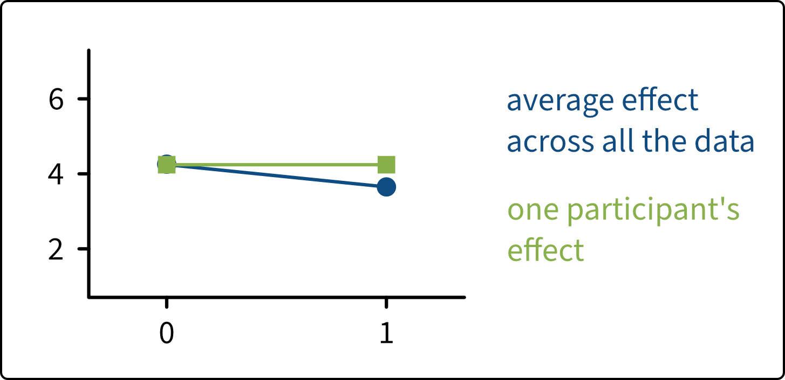{width="40%"}

:::


## Wooclap images (3)

Are the participant's intercept and slope each more positive or more negative than the average intercept and slope?

:::hcenter

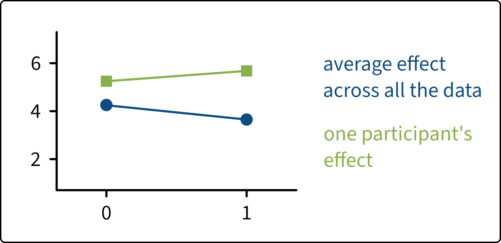{width="40%"}

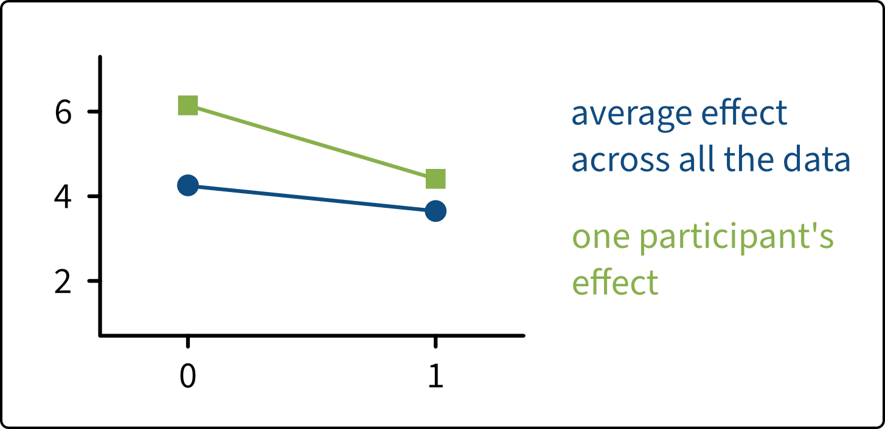{width="40%"}

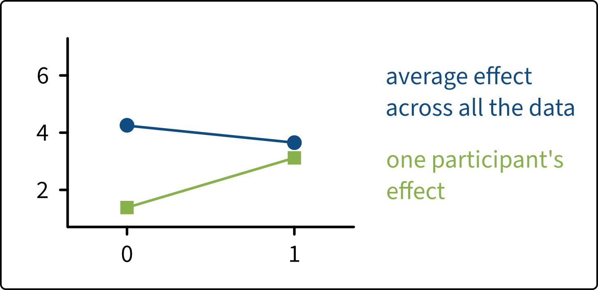{width="40%"}

:::
