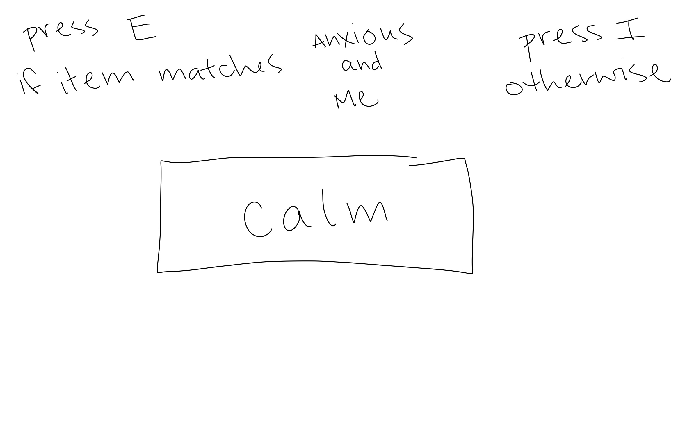
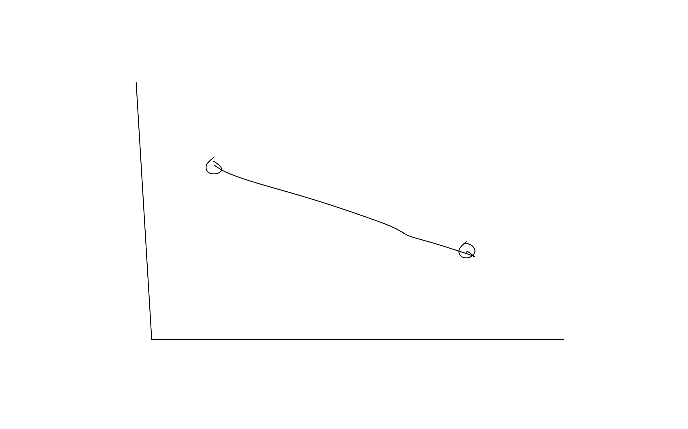
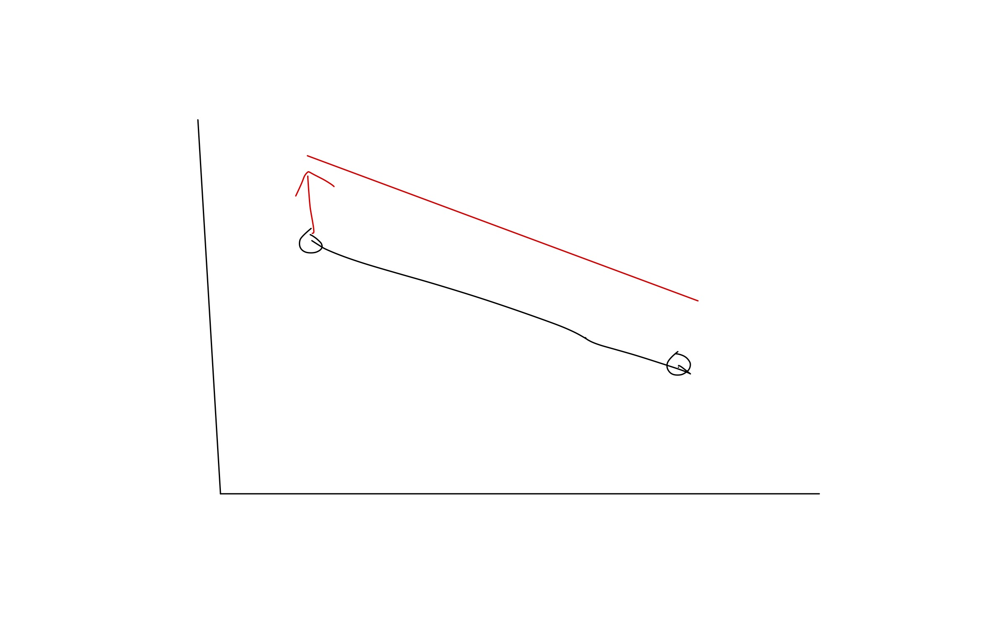
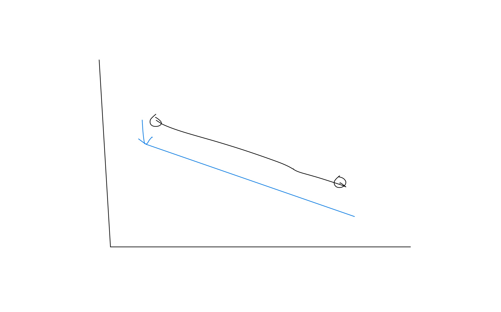
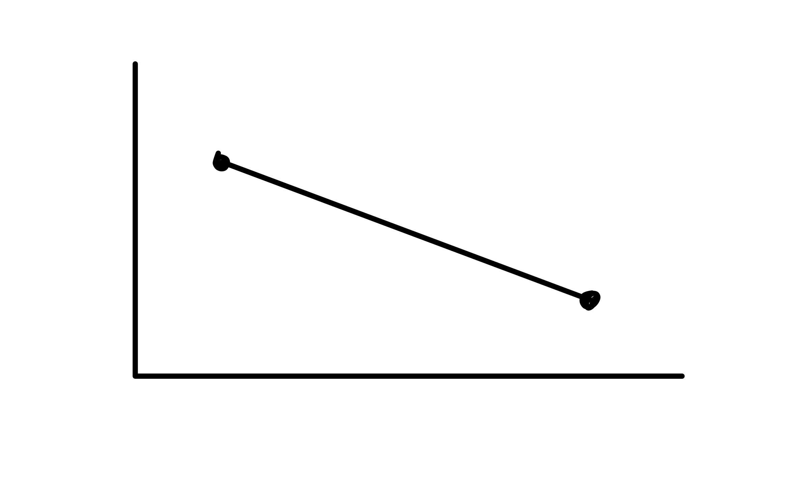
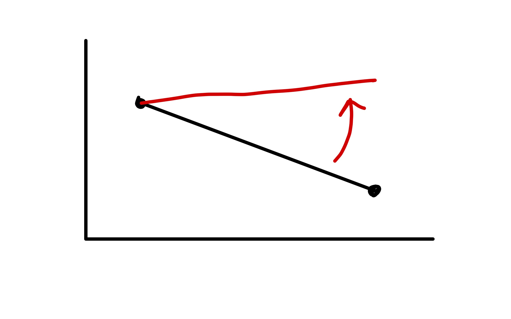
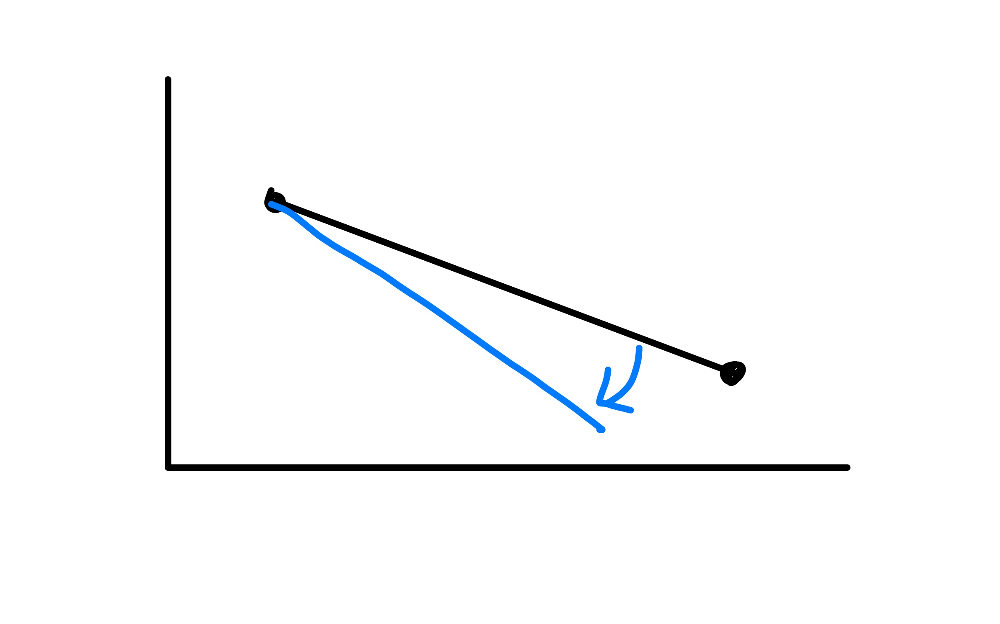

```{r setup, include=F}
library(tidyverse)
library(patchwork)
library(emmeans)
library(simglm)
library(latex2exp)  # for betas in ggplots
source('_theme/theme_quarto.R')

theme_set(theme_quarto(title_font_size=42))
theme_update(
  text = element_text(family = 'Source Sans 3')
)

dapr3green <- "#88B04B" 
dapr3dkgreen <- "#5C7C28"
dapr3ltgreen <- "#E5EED7"
pal <- c( "#d35269", "#5c9ead","#2a3c24", "#F5C396", "#8B2635",  "#235789")
```


# Course Overview {background-color="white"}

<br>

```{r echo=F}
#| results: "asis"
block1_name = "Linear mixed models<br>(with Dr. Elizabeth Pankratz)"
block1_lecs = c("Regression refresher, intro to group-structured data",
                "Modelling group-structured data using random effects",
                "Interpreting LMMs and building maximal models",
                "Troubleshooting model fit, checking assumptions + diagnostics",
                "LMMs: Practice analysis")
block2_name = "factor analysis<br>working with multi-item measures<br>(with Dr. Josiah King)"
block2_lecs = c(
  "measurement and dimensionality",
  "exploring underlying constructs (EFA)",
  "testing theoretical models (CFA)",
  "reliability and validity",
  "recap & exam prep"
  )

source("https://raw.githubusercontent.com/uoepsy/junk/refs/heads/main/R/course_table.R")
course_table(block1_name,block2_name,block1_lecs,block2_lecs,week=3)
```

## This week's learning objectives

How do we interpret the random effect summaries in the output of `summary()`?
- always relative to the fixed effects; no sig testing; ask whether pm 2 SDs changes direction of effect for some group

How do we know if a model can include random intercepts for a given grouping variable?

How do we know if a model can include random slopes over a given predictor for a given grouping variable?

What is a maximal model?


# Today's data (again): Log reaction times

## Log reaction times in the <br> Implicit Association Test (IAT)

- You're asked to categorise words from different topics together.
- In theory, if you implicitly associate the topics, then your reaction times in the categorisation task should be faster.
- IAT is pretty much debunked—it has very poor test–retest reliability and doesn't relate to people's behaviour ([source](https://psych.wisc.edu/Brauer/BrauerLab/index.php/implicit-bias/)) but the data is structured perfectly to teach you what I want to teach you.


**Example of an IAT trial to test whether you implicitly relate anxiety with yourself:**

{width=50% fig-align="center"}


## Example data: Log reaction times in the <br> Implicit Association Test (IAT)

```{r include=F}
implicit_data <- read_csv('data/iat.csv') |>
  mutate(pairing = factor(pairing, levels = c('Unassociated', 'Associated')))
```

:::: {.columns}
::: {.column width="50%"}

```{r fig.width = 7, fig.height = 7}
#| code-fold: true
set.seed(1)
implicit_data |>
  ggplot(aes(x = pairing, y = logRT)) +
  geom_violin() +
  geom_jitter(alpha = 0.05, size = 3) +
  NULL
```

:::
::: {.column width="5%"}
:::
::: {.column width="45%"}

```{r}
implicit_data |>
  head(16)
```


:::
::::

:::dapr3callout
Why do we need to model this data using random effects / a linear mixed model (LMM)?

[WOO TODO]
:::


## Modelling this data with an LMM


```{r}
library(lme4)

implicit_full_lmm <- lmer(
  logRT ~ pairing + 
    (1 + pairing | ppt_id) + 
    (1 + pairing | item_id),
  data = implicit_data
)
```


  
## Recap: What does it mean to "adjust the intercept"?


:::: {.columns}
::: {.column width="30%"}
The average association between `logRT` and `pairing`:

<br>


:::

::: {.column width="5%"}
:::


::: {.column width="30%"}
If a participant has a **higher log RT than average**, then they will have a **positive adjustment to the average intercept.**



:::

::: {.column width="5%"}
:::

::: {.column width="30%"}
If a participant has a **lower log RT than average**, then they will have a **negative adjustment to the average intercept.**



:::
::::

When we include random intercepts by `ppt_id` in the model formula, we tell the model to **estimate how much the average intercept should be nudged up or down by,** in order to fit the data from each participant.

  
## Recap: What does it mean to "adjust the slope"?

:::: {.columns}
::: {.column width="30%"}
The average association between `logRT` and `pairing`:

<br>


:::

::: {.column width="5%"}
:::


::: {.column width="30%"}
If a participant has a **more positive effect of `pairing` than average**, then they will have a **positive adjustment to the fixed slope of `pairing`.**



:::

::: {.column width="5%"}
:::

::: {.column width="30%"}
If a participant has a **more negative effect of `pairing` than average**, then they will have a **negative adjustment to the fixed slope of `pairing`.**



:::
::::

When we include random slopes over `pairing` by `ppt_id` in the model formula, we tell the model to **estimate how much the fixed intercept AND the fixed slope over `pairing` should be nudged up or down by** in order to fit the data from each participant.

## Reporting this LMM structure

```{r eval=F}
lmer(
  logRT ~ pairing + 
    (1 + pairing | ppt_id) + 
    (1 + pairing | item_id),
  data = implicit_data
)
```

To describe this model in text, we could write

> We fit a linear mixed model to predict log RT as a function of topic pairing (treatment-coded, with the reference level "Unassociated" coded as 0 and "Associated" coded as 1).
This model includes by-participant random intercepts and random slopes over topic pairing, as well as by-item random intercepts and random slopes over topic pairing.

or (less traditional phrasing, but more transparent about what the random effects are actually doing)

> ... This model includes by-participant and by-item adjustments both to the intercept and to the slope over topic pairing.

<br>

The golden rule when describing random effects: **be crystal clear about which grouping variables get which intercept/slope adjustments.**


# Deep dive: Interpreting LMM summaries

## The full LMM summary

```{r}
summary(implicit_full_lmm)
```


## We start with the fixed effects

```{r echo=F}
cat(paste0(capture.output(
  summary(implicit_full_lmm)
), '\n')[20:23])
```
 
<br>
 
`(Intercept)`:

- Intercepts in general:
The estimated mean outcome when all predictors are equal to zero.

- **This intercept:**
The estimated mean log reaction time when the topic pairing is unassociated (the reference level, coded as 0) is 4.77 log units.


`pairingAssociated`:

- Single-predictor regression slopes in general:
The estimated change in the outcome when the predictor moves from 0 to 1.

- **This slope:**
When moving from unassociated pairings to associated pairings, log reaction time is estimated to decrease by 0.76 log units.

<br>

**You may be wondering: there are t-values, so why are there no p-values?**


## Why are there no p-values?

Because of the mathematics behind random effects (which you do not need to know!), we cannot translate t-values into p-values in the same way we did for simple linear models.

But clever people have come up with good approximations.
Add those approximated p-values into the model summary by 

- loading the library `lmerTest`, and
- re-fitting the LMM using `lmer()`.

This gives you p-values estimated using "Satterthwaite's method".

```{r eval=F}
library(lmerTest)

implicit_full_lmm <- lmer(
  logRT ~ pairing +  (1 + pairing | ppt_id) +  (1 + pairing | item_id), 
  data = implicit_data
)

summary(implicit_full_lmm)
```

```{r echo=F}
library(lmerTest)

implicit_full_lmm <- lmer(
  logRT ~ pairing +  (1 + pairing | ppt_id) +  (1 + pairing | item_id), 
  data = implicit_data
)

cat('...\n\n')
cat(paste0(
  capture.output(
  summary(implicit_full_lmm)
), '\n')[20:24])
cat('\n...')
```


## Full fixed effects interpretation, <br> now including p-values

```{r echo=F}
cat(paste0(
  capture.output(
  summary(implicit_full_lmm)
), '\n')[20:24])
```

<br>
 
`(Intercept)`:

- The estimated mean log reaction time when the topic pairing is unassociated (the reference level, coded as 0) is 4.77 log units.
- (significance testing for intercepts is usually only interesting for logistic regression models—where 0 log-odds is the same as 50/50 chance of success—so no need to discuss the intercept's p-value for this model)


`pairingAssociated`:

- When moving from unassociated pairings to associated pairings, log reaction time is estimated to decrease by 0.76 log units.
- This decrease is significantly different from zero (p < 0.001).

<br>


## Now we can look at the random effects

```{r echo=F}
cat(paste0(capture.output(
  summary(implicit_full_lmm)
), '\n')[12:20])
```
**First:** sense check the quantities in the final line.

- Is the stated number of observations (6400) correct?
- Is the stated number of distinct levels of `ppt_id` (100) correct?
- Is the stated number of distinct levels of `item_id` (32) correct?


**Then:** read the rest of this output like a table with columns named `Groups`, `Name`, `Variance`, `Std.Dev.`, and `Corr`.


## Interpreting random effects, piece by piece (1)

```{r echo=F}
cat(paste0(capture.output(
  summary(implicit_full_lmm)
), '\n')[13:14])
```

<br>

**The `(Intercept)` adjustments for each level of `ppt_id` have a standard deviation (SD) of 0.78 log units.**

The variance is just the SD squared (0.779$^2$ = 0.607) so it doesn't add much useful information.

The number 0.78 doesn't mean much on its own.
**We must interpret it with respect to the value that it is adjusting:** the fixed intercept of 4.77 log units.

<br>

[TODO fig of building up normal distribution around fixed int with pm 2 SDs]

<br>

Approx 95% of participant-level intercepts are estimated to fall between about `r 4.77 - (2 * 0.78)` log units and `r 4.77 + (2 * 0.78)` log units.

## Interpreting random effects, piece by piece (2)

```{r echo=F}
cat(paste0(capture.output(
  summary(implicit_full_lmm)
), '\n')[13:15])
```

<br>

**The `pairingAssociated` adjustments for each level of `ppt_id` have a SD of 0.31 log units.**

Again, in order to make this number meaningful, we must interpret it in relation to the fixed effect it's adjusting: the `pairingAssociated` fixed slope estimate of –0.76.

[TODO normdist built up around mean]

Approx 95% of participant-level slopes over `pairing` are estimated to fall between about –1.38 log units and <br> –0.14 log units.


## Interpreting random effects, piece by piece (3)

```{r echo=F}
cat(paste0(capture.output(
  summary(implicit_full_lmm)
), '\n')[13:15])
```

<br>

The participant-level `(Intercept)` and `pairingAssociated` adjustments have a correlation of –0.83.

```{r}
#| code-fold: true
dotplot.ranef.mer(ranef(implicit_full_lmm))$ppt_id
```


## Interpreting random effects, piece by piece (4)

```{r echo=F}
cat(paste0(capture.output(
  summary(implicit_full_lmm)
), '\n')[13])
cat(paste0(capture.output(
  summary(implicit_full_lmm)
), '\n')[16])
```

<br>

**The `(Intercept)` adjustments for each level of `item_id` have a SD of 0.88 log units.**

<br>

[TODO normdist built up around mean]

<br>

Approx 95% of item-level intercepts are estimated to fall between about `r 4.77 - (2 * 0.88)` log units and `r 4.77 + (2 * 0.88)` log units.

This range for items is larger than the range for participants, which means that items show more variability around the fixed intercept than participants do.


## Interpreting random effects, piece by piece (5)

```{r echo=F}
cat(paste0(capture.output(
  summary(implicit_full_lmm)
), '\n')[13])

cat(paste0(capture.output(
  summary(implicit_full_lmm)
), '\n')[16:17])
```

<br>

**The adjustments to `pairingAssociated` for each level of `item_id` have a SD of 0.39 log units.**

[TODO normdist built up around mean]

Approx 95% of item-level slopes over `pairing` are estimated to fall between about –1.54 log units and 0.02 log units.

This is interesting because some items might show a **tiny positive effect** of `pairing`!
In other words, they might elicit faster reactions for unassociated pairings and slower reactions for associated pairings—not the pattern we expected.

Again, the item-level variation in slopes over `pairing` is greater than participant-level variation.


## Interpreting random effects, piece by piece (6)

```{r echo=F}
cat(paste0(capture.output(
  summary(implicit_full_lmm)
), '\n')[13])

cat(paste0(capture.output(
  summary(implicit_full_lmm)
), '\n')[16:17])
```

<br>

The item-level `(Intercept)` and `pairingAssociated` adjustments have a correlation of –0.77.

```{r}
#| code-fold: true
dotplot.ranef.mer(ranef(implicit_full_lmm))$item_id
```


## Interpreting random effects, piece by piece (7)

```{r echo=F}
cat(paste0(capture.output(
  summary(implicit_full_lmm)
), '\n')[13])

cat(paste0(capture.output(
  summary(implicit_full_lmm)
), '\n')[18])
```

<br>

A residual is the difference between a data point's observed value and its model-predicted value.
It reflects the random variability that is present in the world but not accounted for by variables we've included in the model.

**The SD of all the residuals in this model is 0.52.**

(This estimate isn't usually interesting or important to report.
We can usually just ignore it.)


# Plotting model-fitted values from LMMs

## Use `effect()` to compute the model's predicted values

In the library `effects`, there is a function called `effect()`.

<!-- It is a bit like `emmeans()` from DAPR2, but it works for continuous AND categorical predictors. -->

`effect()` tells us the outcome values that the model would estimate/predict for each level of our predictor, as well as the 95% CI around those values.


```{r}
library(effects)

effect(
  term = "pairing",         # what predictor do we want predictions for?
  mod = implicit_full_lmm   # what model should predictions be based on?
) |>
  as.data.frame()
```

<br>

- `fit`: the estimated outcome (log RT) value for each level of `pairing`
- `se`: the standard error of that estimate
- `lower`: the lower bound of the estimate's 95% CI
- `upper`: the upper bound of the estimate's 95% CI


## Visualise these estimates

```{r eval=F}
effect(term = "pairing", mod = implicit_full_lmm) |>
  as.data.frame() |>
  ggplot(aes(x = pairing, y = fit)) +
  geom_point() +
  geom_errorbar(aes(ymin = lower, ymax = upper), width = 0) +
  labs(
    y = 'Log RT',
    x = 'Topic pairing'
  )
```


```{r echo=F}
effect(term = "pairing", mod = implicit_full_lmm) |>
  as.data.frame() |>
  ggplot(aes(x = pairing, y = fit)) +
  geom_point(size = 5) +
  geom_errorbar(aes(ymin = lower, ymax = upper), width = 0, linewidth = 1) +
  labs(
    y = 'Log RT',
    x = 'Topic pairing'
  )
```


# How to identify all possible random effects

## How to identify all possible random effects

Four steps that you can apply to any dataset + RQ:

:::dapr3callout
1. Use your RQ to figure out what your model’s outcome and predictors are (i.e., your model’s fixed effects).
:::

:::dapr3callout
2. For all variables that are not the outcome or predictors, identify whether they are grouping variables.
:::

:::dapr3callout
3. Identify which of those grouping variables contribute random / non-manipulated / non-controlled variability to your data (think about the data generating process).

For every randomly-varying grouping variable, your model must contain a random intercept for that grouping variable.
:::

:::dapr3callout
4. Refer back to all predictors you identified in Step 1. For each randomly-varying grouping variable, check whether at least some of its levels appear with more than one value of each predictor.

If they do, then (in addition to the random intercepts) your model can also contain a random slope over that predictor for that grouping variable.

If they don't, then a random slope over that predictor is impossible.
:::

# Example 1: Hesitation markers and believability

## Example 1: Hesitation markers and believability

RQ: Do hesitation markers like “um”/“erm” affect how believable true statements seem?

:::: {.columns}
::: {.column width="45%"}
**Examples from condition `hesitation = No`:**

- "A hashtag is technically called an octothorp."
- "The largest snowflake was bigger than most pizzas."
- "Pigs don’t sweat."
:::

::: {.column width="5%"}
:::

::: {.column width="50%"}
**Examples from condition `hesitation = Yes`:**

- "Erm ... a hashtag is technically called an octothorp."
- "Erm ... the largest snowflake was bigger than most pizzas."
- "Erm ... pigs don’t sweat."
:::
::::

```{r include=F}
belief_data <- read_csv("https://uoepsy.github.io/data/erm_belief.csv") |>
  mutate(
    hesitation = factor(ifelse(condition == 'disfluent', 'Yes', 'No')),
  ) |>
  select(ppt, sentence, statement, hesitation, belief) |>
  arrange(ppt, sentence)
```

```{r}
#| code-fold: true

belief_data |>
  ggplot(aes(x = hesitation, y = belief, colour = hesitation, fill = hesitation)) +
  geom_violin(alpha = 0.5) +
  geom_jitter(alpha = 0.5, size = 3) +
  stat_summary(geom = 'point', fun = mean, colour = 'black', size = 5) +
  theme(
    legend.position = 'none'
  )
```

## The data

```{r}
belief_data |> head(20)
```


## Step 1: Identify fixed effects

:::dapr3callout
1. Use your RQ to figure out what your model’s outcome and predictors are (i.e., your model’s fixed effects).
:::

<br>

RQ: Do hesitation markers like “um”/“erm” affect how believable true statements seem?

<br>

```{r}
names(belief_data)
```

- Outcome variable: `belief`
- Predictor variable: `hesitation`

<br>

The fixed effects part of the model formula will be `belief ~ hesitation`.


## Step 2: Identify grouping variables

:::dapr3callout
2. For all variables that are not the outcome or predictors, identify whether they are grouping variables.
:::

:::: {.columns}
::: {.column width="47%"}
For `ppt`:

```{r eval=F}
belief_data |>
  group_by(ppt) |>
  count()
```

```{r echo=F}
cat(paste0(capture.output(
belief_data |>
  group_by(ppt) |>
  count()
), '\n')[1:14])
cat("...")
```

<br>

Each value of `ppt` appears more than once.
`ppt` is a grouping variable &nbsp; ✅

:::
::: {.column width="5%"}
:::

::: {.column width="47%"}

For `sentence` (identical data to `statement`):

```{r eval=F}
belief_data |>
  group_by(sentence) |>
  count()
```

```{r echo=F}
cat(paste0(capture.output(
belief_data |>
  group_by(sentence) |>
  count()
), '\n')[1:14])
cat("...")
```
<br>

Each value of `sentence` appears more than once.
`sentence` is a grouping variable &nbsp;  ✅

:::
::::


## Step 3: Random intercepts

:::dapr3callout
3. Identify which of those grouping variables contribute random / non-manipulated / non-controlled variability to your data (think about the data generating process).

For every randomly-varying grouping variable, your model must contain a random intercept for that grouping variable.
:::

`ppt`:

- The RQ doesn't specify that we manipulate or control for specific people.
- We want our results to generalise across different people.
- If we re-ran the study, we could recruit different participants and still address the RQ.
- Therefore: **`ppt` contributes random variability, and our model needs at least a random intercept by participant.**


`sentence`:

- The RQ doesn't specify that we manipulate or control for specific sentences.
- We want our results to generalise across different sentences.
- If we re-ran the study, we could show people different sentences and still address the RQ.
- Therefore: **`sentence` contributes random variability, and our model needs at least a random intercept by sentence.**


The minimum LMM formula now: `belief ~ hesitation + (1 | ppt) + (1 | sentence)`


## Step 4: Random slopes

:::dapr3callout
4. Refer back to all predictors you identified in Step 1. For each randomly-varying grouping variable, check whether at least some of its levels appear with more than one value of each predictor.

If they do, then (in addition to the random intercepts) your model can also contain a random slope over that predictor for that grouping variable.

If they don't, then a random slope over that predictor is impossible.
:::

:::: {.columns}
::: {.column width="50%"}
Do at least some levels of `ppt` appear with more than one value of `hesitation`?

```{r eval=F}
stats::xtabs(
  ~ ppt + hesitation, 
  data = belief_data
)
```

```{r echo=F}
cat(paste0(capture.output(
  
stats::xtabs(
  ~ ppt + hesitation, 
  data = belief_data
)

), '\n')[1:8])
cat("...")
```

Yes! 
So `(1 + hesitation | ppt)` is possible.

:::
::: {.column width="50%"}

Do at least some levels of `sentence` appear with more than one value of `hesitation`?

```{r eval=F}
stats::xtabs(
  ~ sentence + hesitation, 
  data = belief_data
)
```

```{r echo=F}
cat(paste0(capture.output(
  
stats::xtabs(
  ~ sentence + hesitation, 
  data = belief_data
)

), '\n')[1:8])
cat("...")
```

Yes! 
So `(1 + hesitation | sentence)` is possible.

:::
::::


## The model with all possible random effects

<br>

:::hcenter
`belief ~ hesitation + (1 + hesitation | ppt) + (1 + hesitation | sentence)`
:::

<br>

Another name for the model with all possible random effects is the **"maximal model".**


# Example 2: Test-enhanced learning

## Example 2: Test-enhanced learning

Two groups of participants learn some new material.

One group studied the material twice (the `StudyStudy` group), and the other group studied the material once and then tested themselves on it (the `StudyTest` group).

Recall was tested immediately (one minute) after the learning session and again one week later (recorded in the variable `Delay`).

<!-- The recall tests are each identified by a keyword (`Test_word`). -->

**RQ: Does self-testing improve retention, such that the `StudyStudy` group may perform better on the immediate test, but the `StudyTest` group will perform better on the test one week later?**


```{r include=F}
load(url("https://uoepsy.github.io/data/testenhancedlearning.RData"))

ppts_to_keep <- c(
  paste0('StudyStudy_', LETTERS[1:10]),
  paste0('StudyTest_', LETTERS[1:10])
)

set.seed(1)
tel_data <- tel |>
  filter(
    Test_word != 'Eskimo',
    Subject_ID %in% ppts_to_keep
  ) |>
  rowwise() |>
  mutate(
    TestScore = rnorm(n=1, mean = Correct, sd = 0.5),
  ) |>
  ungroup() |>
  mutate(
    TestScore = case_when(
      Group == 'StudyStudy' & Delay == 'min'  ~ TestScore + 0.2,
      Group == 'StudyStudy' & Delay == 'week' ~ TestScore - 0.5,
      Group == 'StudyTest'  & Delay == 'min'  ~ TestScore + 0.2,
      Group == 'StudyTest'  & Delay == 'week' ~ TestScore,
    ),
    TestScore = as.numeric(round(datawizard::rescale(TestScore, to = c(0, 100))))
  ) |>
  select(-Correct, -Rtime)
 
rm(tel)
```


```{r}
#| code-fold: true

tel_data |>
  ggplot(aes(x = Delay, y = TestScore, colour = Delay, fill = Delay)) +
  geom_violin(alpha = 0.5) +
  geom_jitter(alpha = 0.15, size = 3) +
  facet_wrap(~ Group) +
  stat_summary(geom = 'point', fun = mean, colour = 'black', size = 5) +
  theme(
    legend.position = 'none',
    strip.background = element_blank(),
    strip.text.x = element_text(size = 24)
  )
```


## The data

```{r}
tel_data |> head(20)
```


## Step 1: Identify fixed effects

:::dapr3callout
1. Use your RQ to figure out what your model’s outcome and predictors are (i.e., your model’s fixed effects).
:::

<br>

RQ: Does self-testing improve retention, such that the `StudyStudy` group may perform better on the immediate test, but the `StudyTest` group will perform better on the test one week later?

<br>

```{r}
names(tel_data)
```

- Outcome variable: `TestScore`
- Predictor variables: `Delay`, `Group`, and their interaction

<br>

The fixed effects part of the model formula will be `TestScore ~ Delay * Group`.


## Step 2: Identify grouping variables

:::dapr3callout
2. For all variables that are not the outcome or predictors, identify whether they are grouping variables.
:::

The remaining variables: `Subject_ID` (categorical) and `Test_word` (categorical).

:::: {.columns}
::: {.column width="47%"}
For `Subject_ID`:

```{r eval=F}
tel_data |>
  group_by(Subject_ID) |>
  count()
```

```{r echo=F}
cat(paste0(capture.output(

tel_data |>
  group_by(Subject_ID) |>
  count()
  
), '\n')[1:10])
cat("...")
```

<br>

Each value of `Subject_ID` appears more than once.
`Subject_ID` is a grouping variable &nbsp; ✅

:::
::: {.column width="5%"}
:::

::: {.column width="47%"}

For `Test_word`:

```{r eval=F}
tel_data |>
  group_by(Test_word) |>
  count()
```

```{r echo=F}
cat(paste0(capture.output(
  
  tel_data |>
  group_by(Test_word) |>
  count()

), '\n')[1:10])
cat("...")
```
<br>

Each value of `Test_word` appears more than once.
`Test_word` is a grouping variable &nbsp;  ✅

:::
::::


## Step 3: Random intercepts


:::dapr3callout
3. Identify which of those grouping variables contribute random / non-manipulated / non-controlled variability to your data (think about the data generating process).

For every randomly-varying grouping variable, your model must contain a random intercept for that grouping variable.
:::

`Subject_ID`:

- The RQ doesn't specify that we manipulate or control for specific people.
- We want our results to generalise across different people.
- If we re-ran the study, we could recruit different subjects and still address the RQ.
- Therefore: **`Subject_ID` contributes random variability, and our model needs at least a random intercept by subject.**


`Test_word`:

- The RQ doesn't specify that we manipulate or control for specific test words.
- We want our results to generalise across different test words.
- If we re-ran the study, we could show people different test words and still address the RQ.
- Therefore: **`Test_word` contributes random variability, and our model needs at least a random intercept by test word.**


Minimum model now: `TestScore ~ Delay * Group + (1 | Subject_ID) + (1 | Test_word)`


## Step 4: Random slopes

:::dapr3callout
4. Refer back to all predictors you identified in Step 1. For each randomly-varying grouping variable, check whether at least some of its levels appear with more than one value of each predictor.

If they do, then (in addition to the random intercepts) your model can also contain a random slope over that predictor for that grouping variable.

If they don't, then a random slope over that predictor is impossible.
:::

<br>

We'll need to check all combinations of grouping variables and predictors:

- Do at least some levels of `Subject_ID` appear with more than one value of `Delay`?
- Do at least some levels of `Subject_ID` appear with more than one value of `Group`?
- Do at least some levels of `Test_word` appear with more than one value of `Delay`?
- Do at least some levels of `Test_word` appear with more than one value of `Group`?


## Step 4: Random slopes by `Subject_ID`

:::: {.columns}
::: {.column width="47%"}
Do at least some levels of `Subject_ID` appear with more than one value of `Delay`?

```{r eval=F}
stats::xtabs(
  ~ Subject_ID + Delay, 
  data = tel_data
)
```

```{r echo=F}
cat(paste0(capture.output(
  
stats::xtabs(
  ~ Subject_ID + Delay, 
  data = tel_data
)

), '\n')[1:12])
cat("...")
```

Yes! 
So a random slope over `Delay` by `Subject_ID` is possible.

:::
::: {.column width="3%"}
:::
::: {.column width="50%"}

Do at least some levels of `Subject_ID` appear with more than one value of `Group`?

```{r eval=F}
stats::xtabs(
  ~ Subject_ID + Group, 
  data = tel_data
)
```

```{r echo=F}
cat(paste0(capture.output(
  
stats::xtabs(
  ~ Subject_ID + Group, 
  data = tel_data
)

), '\n')[1:12])
cat("...")
```

No!
People are either in one group or the other.
We cannot include a random slope over `Group` by `Subject_ID`.

:::
::::

<br>

**The maximal random effects term for `Subject_ID` is `(1 + Delay | Subject_ID)`.**


## Step 4: Random slopes by `Test_word`

:::: {.columns}
::: {.column width="47%"}
Do at least some levels of `Test_word` appear with more than one value of `Delay`?

```{r eval=F}
stats::xtabs(
  ~ Test_word + Delay, 
  data = tel_data
)
```

```{r echo=F}
cat(paste0(capture.output(
  
stats::xtabs(
  ~ Test_word + Delay, 
  data = tel_data
)

), '\n')[1:12])
cat("...")
```

Yes! 
So a random slope over `Delay` by `Test_word` is possible.

:::
::: {.column width="3%"}
:::
::: {.column width="50%"}

Do at least some levels of `Test_word` appear with more than one value of `Group`?

```{r eval=F}
stats::xtabs(
  ~ Test_word + Group, 
  data = tel_data
)
```

```{r echo=F}
cat(paste0(capture.output(
  
stats::xtabs(
  ~ Test_word + Group, 
  data = tel_data
)

), '\n')[1:12])
cat("...")
```

Yes!
So we can also add on a random slope over `Group` by `Test_word`.

And because both predictors can have random slopes, we can also include their interaction.

:::
::::

**The maximal random effects term for `Test_word` is `(1 + Delay * Group | Test_word)`.**


## The maximal model

<br>

:::hcenter
`TestScore ~ Delay * Group +  (1 + Delay | Subject_ID) + (1 + Delay * Group | Test_word)`
:::


# Why is it useful to find the maximal model?

## Why is it useful to find the maximal model?

Because the maximal model ...

- ... takes into account all the variability that plays a role in our design.
- ... gives us the most conservative fixed effect estimates, which lowers the risk of Type I error (that is, rejecting the H0 when there is no effect).
- ... generalises better to the populations that we want to draw conclusions about.

<br>

From a theoretical perspective, the maximal model is what we should fit.
But from a practical perspective, sometimes this is actually impossible to do in R.

For example, take the maximal model for our RQ for `tel_data`:

:::hcenter
`TestScore ~ Delay * Group +  (1 + Delay | Subject_ID) + (1 + Delay * Group | Test_word)`
:::

If we try to fit this model, R will not be able to do it.

Next week, we'll learn how to deal with that issue.

<br>

**Regardless of any practical issues that happen when we try to fit the model, we should always start an analysis by finding the maximal model permitted by our dataset and RQ.**


# Back matter

## Learning objectives revisited


## To do this week 

<br>

::::{.columns}
:::{.column width="50%"}
**Tasks:**

<br>

{width=80px style="margin:10px;margin-bottom:-50px"} Work on exercises in labs

<br>

{width=80px style="margin:10px;margin-bottom:-45px"} Complete the weekly quiz 


:::

:::{.column width="50%"}
**Get support:**

<br>

{width=80px style="margin:10px;margin-bottom:-30px"}
Consult the [flash cards](https://uoepsy.github.io/dapr3/2627/flashcards/){target="_blank"}

<br>

{width=80px style="margin:10px;margin-bottom:-50px"}
Ask questions anonymously on Piazza

<br>

{width=80px style="margin:10px;margin-bottom:-40px"} 
We really like seeing you in office hours!


:::
::::


# Appendix {.appendix}


## abc

dolor sit amet

**dolor sit amet**

`abc`

:::dapr3callout
abc
:::


<!-- :::: {.columns} -->
<!-- ::: {.column width="50%"} -->
<!-- a -->
<!-- ::: -->
<!-- ::: {.column width="50%"} -->
<!-- b -->
<!-- ::: -->
<!-- :::: -->


<!-- :::: {.columns} -->
<!-- ::: {.column width="30%"} -->
<!-- a -->
<!-- ::: -->
<!-- ::: {.column width="5%"} -->
<!-- ::: -->
<!-- ::: {.column width="30%"} -->
<!-- b -->
<!-- ::: -->
<!-- ::: {.column width="5%"} -->
<!-- ::: -->
<!-- ::: {.column width="30%"} -->
<!-- c -->
<!-- ::: -->
<!-- :::: -->


<!-- style="font-size: 70%;" -->

 <!--  -->
 <!--  -->