```{r setup, include=F}
library(tidyverse)
library(patchwork)
library(emmeans)
library(simglm)
library(latex2exp)  # for betas in ggplots
source('_theme/theme_quarto.R')

theme_set(theme_quarto(title_font_size=42))
theme_update(
  text = element_text(family = 'Source Sans 3')
)

dapr3green <- "#88B04B" 
dapr3dkgreen <- "#5C7C28"
dapr3ltgreen <- "#E5EED7"
pal <- c( "#d35269", "#5c9ead","#2a3c24", "#F5C396", "#8B2635",  "#235789")
```


# Course Overview {background-color="white"}

<br>

```{r echo=F}
#| results: "asis"
block1_name = "Linear mixed models<br>(with Dr. Elizabeth Pankratz)"
block1_lecs = c("Regression refresher, intro to group-structured data",
                "Modelling group-structured data using random effects",
                "Interpreting LMMs and building maximal models",
                "Troubleshooting model fit, checking assumptions + diagnostics",
                "LMMs: Practice analysis")
block2_name = "factor analysis<br>working with multi-item measures<br>(with Dr. Josiah King)"
block2_lecs = c(
  "measurement and dimensionality",
  "exploring underlying constructs (EFA)",
  "testing theoretical models (CFA)",
  "reliability and validity",
  "recap & exam prep"
  )

source("https://raw.githubusercontent.com/uoepsy/junk/refs/heads/main/R/course_table.R")
course_table(block1_name,block2_name,block1_lecs,block2_lecs,week=3)
```

## This week's learning objectives

:::dapr3callout
How do we interpret the random effects part of a model summary?

<!-- - Always relative to the fixed effects. -->
<!-- - The fixed effect is the mean of a Normal distribution of group-level adjustments. -->
<!-- - The SD of that Normal distribution is given in the random effects summary table. -->
<!-- - There is no significance testing involved for random effects. -->
<!-- - When interpreting random effects, we are interested in questions like: -->
<!--   - Is there greater variability within one grouping variable than another? -->
<!--   - For slope adjustments: does the model predict that any specific levels of the grouping variable show the opposite direction of effect (e.g., a negative effect if the fixed effect is positive)? -->

:::


:::dapr3callout
How do we know if a model can include random intercepts for a given grouping variable?

<!-- - We think about the data generating process, and specifically the kind of variability that the grouping variable contributes to the data. -->
<!-- - If the grouping variable contributes random variability to the data, then a model of that data must include random intercepts for that grouping variable. -->
:::

:::dapr3callout
How do we know if a model can include random slopes over a given predictor for a given grouping variable?

<!-- - Check if the data contains more than one value of a given predictor within at least some levels of the grouping variable. -->
<!-- - (Why? Because we need at least two observations to fit a line. If there's only one value for a given predictor and a given participant, then we have no idea what a line fit to that data would look like because we don't know the second point that the line would connect.) -->
:::


:::dapr3callout
What is a maximal model?

<!-- - A model that contains all possible random effects that are permitted by the data structure and the RQ. -->
:::


# Recap: Linear mixed models (LMMs)


## The data: Log reaction times in the <br> Implicit Association Test (IAT)

```{r include=F}
implicit_data <- read_csv('data/iat.csv') |>
  mutate(pairing = factor(pairing, levels = c('Unassociated', 'Associated')))
```

:::: {.columns}
::: {.column width="50%"}

```{r fig.width = 7, fig.height = 6.5}
#| code-fold: true
set.seed(1)
implicit_data |>
  ggplot(aes(x = pairing, y = logRT)) +
  geom_violin() +
  geom_jitter(alpha = 0.05, size = 3) +
  NULL
```

:::
::: {.column width="5%"}
:::
::: {.column width="45%"}

```{r}
implicit_data |>
  head(12)
```


:::
::::

:::dapr3callout
Why is a simple linear model not appropriate for this data?

:::hcenter
:::woo
https://app.wooclap.com/events/FUNOEYF/
:::
:::

:::


## Modelling this data with an LMM

```{r}
library(lme4)

implicit_full_lmm <- lmer(      # LMMs use lme4::lmer(), not lm()
  
  logRT ~ pairing +             # fixed effects: predict logRT by pairing
                                # (0 = Unassociated, 1 = Associated)
    
                                # random effects:
    (1 + pairing | ppt_id) +    # for each ppt, adjust the intercept and the slope
    
    (1 + pairing | item_id),    # for each item, adjust the intercept and the slope
  
  data = implicit_data
)
```


  
## What does it mean to "adjust the intercept"?


:::: {.columns}
::: {.column width="30%"}
The average association between `logRT` and `pairing` (the line defined by the fixed intercept and fixed slope):

:::

::: {.column width="5%"}
:::


::: {.column width="30%"}
If a participant or an item has a **higher log RT than average**, then they will have a **positive adjustment** to the fixed intercept.


:::

::: {.column width="5%"}
:::

::: {.column width="30%"}
If a participant or an item has a **lower log RT than average**, then they will have a **negative adjustment** to the fixed intercept.


:::
::::


:::: {.columns}
::: {.column width="30%"}

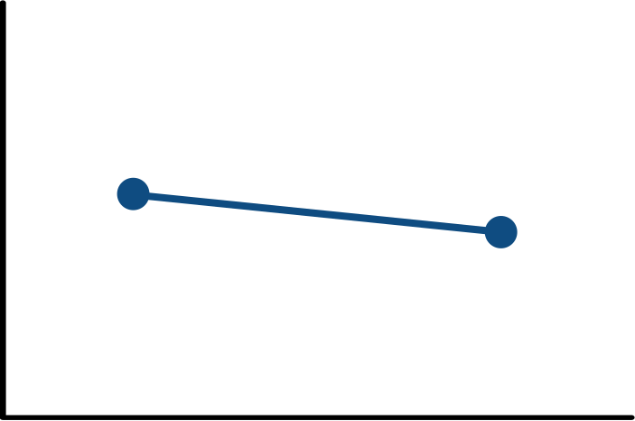
:::

::: {.column width="5%"}
:::

::: {.column width="30%"}

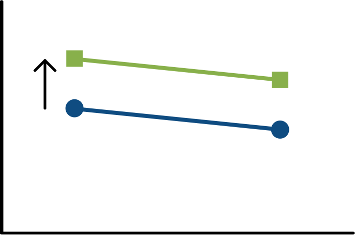
:::

::: {.column width="5%"}
:::

::: {.column width="30%"}

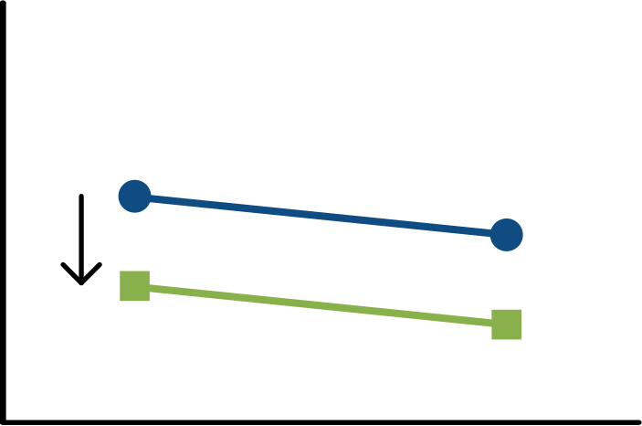
:::

:::

When the model includes random intercepts by `ppt_id` and by `item_id`, it will **estimate how much the fixed intercept should be nudged up or down,** in order to better fit the data from each participant and each item.

  
## What does it mean to "adjust the slope"?

:::: {.columns}
::: {.column width="30%"}
The average association between `logRT` and `pairing` (the line defined by the fixed intercept and fixed slope):

:::

::: {.column width="5%"}
:::


::: {.column width="30%"}
If a participant or an item has a **more positive effect of `pairing` than average**, then they will have a **positive adjustment** to the fixed slope over `pairing`.


:::

::: {.column width="5%"}
:::

::: {.column width="30%"}
If a participant or an item has a **more negative effect of `pairing` than average**, then they will have a **negative adjustment** to the fixed slope over `pairing`.


:::
::::


:::: {.columns}
::: {.column width="30%"}


:::

::: {.column width="5%"}
:::

::: {.column width="30%"}

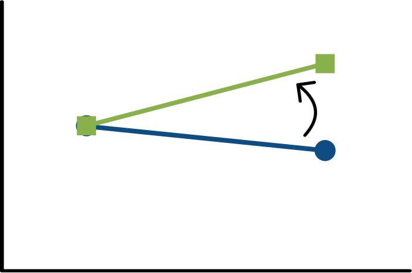
:::

::: {.column width="5%"}
:::

::: {.column width="30%"}

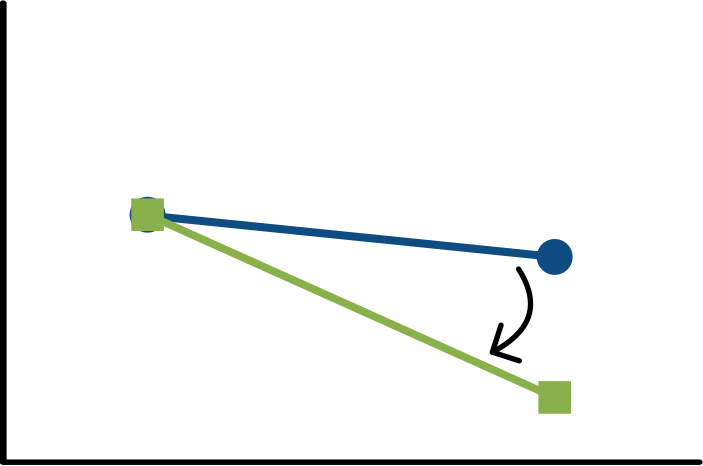
:::

:::

<br>

When the model includes random intercepts by `ppt_id` and by `item_id` as well as random slopes over `pairing` by `ppt_id` and by `item_id`, it will 

- **estimate how much the fixed intercept should be nudged up or down** (last slide) AND
- **how much the fixed slope should be swung up or down** (this slide)

in order to better fit the data from each participant and each item.


<!-- ## Reporting this LMM structure -->

<!-- ```{r eval=F} -->
<!-- lmer( -->
<!--   logRT ~ pairing +  -->
<!--     (1 + pairing | ppt_id) +  -->
<!--     (1 + pairing | item_id), -->
<!--   data = implicit_data -->
<!-- ) -->
<!-- ``` -->

<!-- To describe this model in text, we could write -->

<!-- > We fit a linear mixed model to predict log RT as a function of topic pairing (treatment-coded, with the reference level "Unassociated" coded as 0 and "Associated" coded as 1). -->
<!-- This model includes by-participant random intercepts and random slopes over topic pairing, as well as by-item random intercepts and random slopes over topic pairing. -->

<!-- or (less traditional phrasing, but more transparent about what the random effects are actually doing) -->

<!-- > ... This model includes by-participant and by-item adjustments both to the intercept and to the slope over topic pairing. -->

<!-- <br> -->

<!-- The golden rule when describing random effects: **be crystal clear about which grouping variables get which intercept/slope adjustments.** -->


# Interpreting LMM summaries

## The full summary

```{r}
summary(implicit_full_lmm)
```


## Start with the fixed effects

```{r echo=F}
cat(paste0(capture.output(
  summary(implicit_full_lmm)
), '\n')[20:23])
```
 
<br>

**Interpret the fixed effects the same way you interpret coefficients in a simple linear model.**

<br>
 
**`(Intercept)`** = the estimated mean outcome when all predictors are equal to zero.

- The estimated mean log reaction time when the topic pairing is unassociated (the reference level, coded as 0) is 4.77 log units.


**`pairingAssociated`** = the estimated increase/decrease in the outcome when the predictor moves from 0 to 1.

- The log reaction time for associated pairings is estimated to be 0.76 log units smaller than the log reaction time for unassociated pairings.

<br>

**Where are the p-values?**


## Where are the p-values?

The mathematics that make the random effects work (which you do not need to know!) means that we can't easily translate t-values to p-values.
But clever people have come up with good approximations!

Add the approximated p-values into the model summary by 

- loading the library `lmerTest`, and
- re-fitting the LMM using `lmer()`.

This gives you p-values estimated using "Satterthwaite's method".

```{r eval=F}
library(lmerTest)

implicit_full_lmm <- lmer(
  logRT ~ pairing +  (1 + pairing | ppt_id) +  (1 + pairing | item_id), 
  data = implicit_data
)

summary(implicit_full_lmm)
```

```{r echo=F}
library(lmerTest)

implicit_full_lmm <- lmer(
  logRT ~ pairing +  (1 + pairing | ppt_id) +  (1 + pairing | item_id), 
  data = implicit_data
)

cat('...\n\n')
cat(paste0(
  capture.output(
  summary(implicit_full_lmm)
), '\n')[20:24])
cat('\n...')
```


## Fixed effects, now with p-values

```{r echo=F}
cat(paste0(
  capture.output(
  summary(implicit_full_lmm)
), '\n')[20:24])
```

<br>
 
`(Intercept)`:

- The estimated mean log reaction time when the topic pairing is unassociated (the reference level, coded as 0) is 4.77 log units.
- This estimate is significantly different from zero at $p$ < .001, but that's not really a surprise ... we were already pretty sure that the average log RT would be different from zero! 
  - When the outcome variable is continuous, we typically don't report p-values for intercepts, because it's not a very interesting hypothesis test


`pairingAssociated`:

- The log reaction time for associated pairings is estimated to be 0.76 log units smaller than the log reaction time for unassociated pairings.
- This estimate is significantly different from zero ($p$ < .001).
  - This *is* an interesting hypothesis test, because it looks at the difference between conditions, which is the whole point of our experiment

<br>


## Next, look at the random effects

```{r echo=F}
cat(paste0(capture.output(
  summary(implicit_full_lmm)
), '\n')[12:20])
```
**First:** Sense check the quantities in the final line.

- Is the number of observations (6400) correct?
- Is the number of distinct levels of `ppt_id` (100) correct?
- Is the number of distinct levels of `item_id` (32) correct?

If not, the data is probably not formatted correctly. Do any fixes you need.


<br>

**Then:** Look at the rest of the output. Read it as a table like this:

{fig-align="center"}


## Intercept adjustments for each `ppt_id` (1)

```{r echo=F}
cat('', paste0(capture.output(
  summary(implicit_full_lmm)
), '\n')[13:14])
```

<br>

What this line tells us: **The `(Intercept)` adjustments for `ppt_id` have a standard deviation (SD) of 0.78 log units.**

- The variance is just the SD squared (0.779$^2$ = 0.607) so it doesn't add any useful information. 
- We will always just focus on the SD.

The number 0.78 doesn't mean much on its own.
**We must interpret it with respect to the value that it is adjusting:** the fixed intercept of 4.77 log units.

By combining these numbers, we find the estimated distribution of participant-level intercepts.

This is useful because it helps us understand the variability in participant behaviour in our experiment.


## Intercept adjustments for each `ppt_id` (2)

```{r echo=F}
cat('', paste0(capture.output(
  summary(implicit_full_lmm)
), '\n')[13:14])
```

<br>

:::{.r-stack}

:::fragment
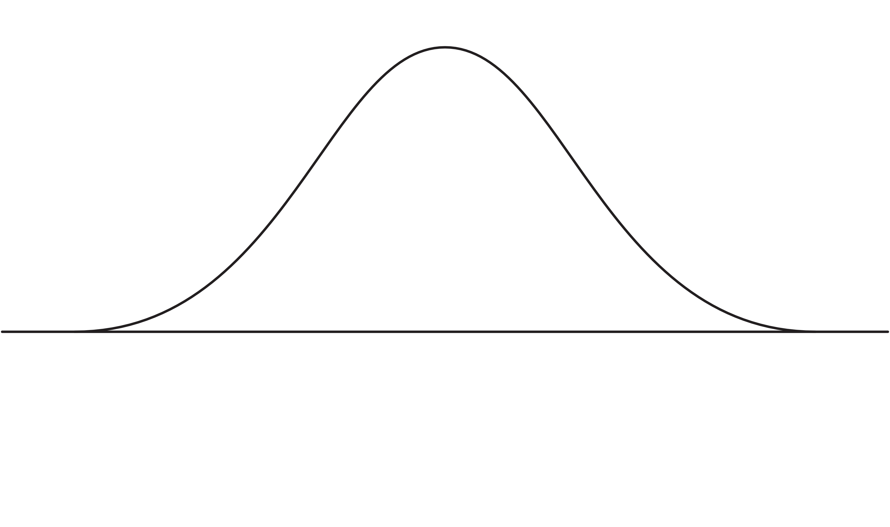{fig-align="center"}
:::

:::fragment
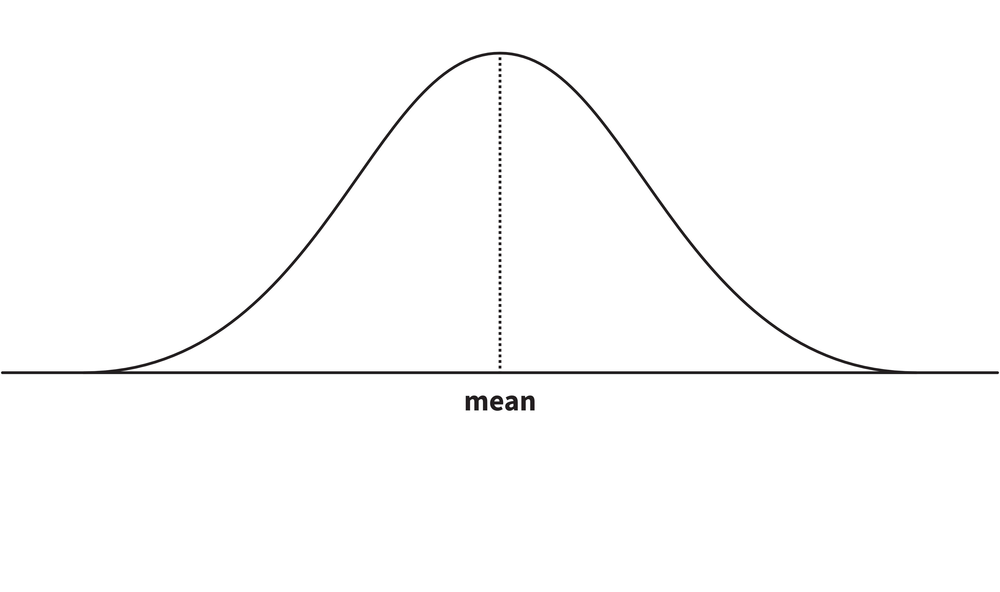{fig-align="center"}
:::

:::fragment
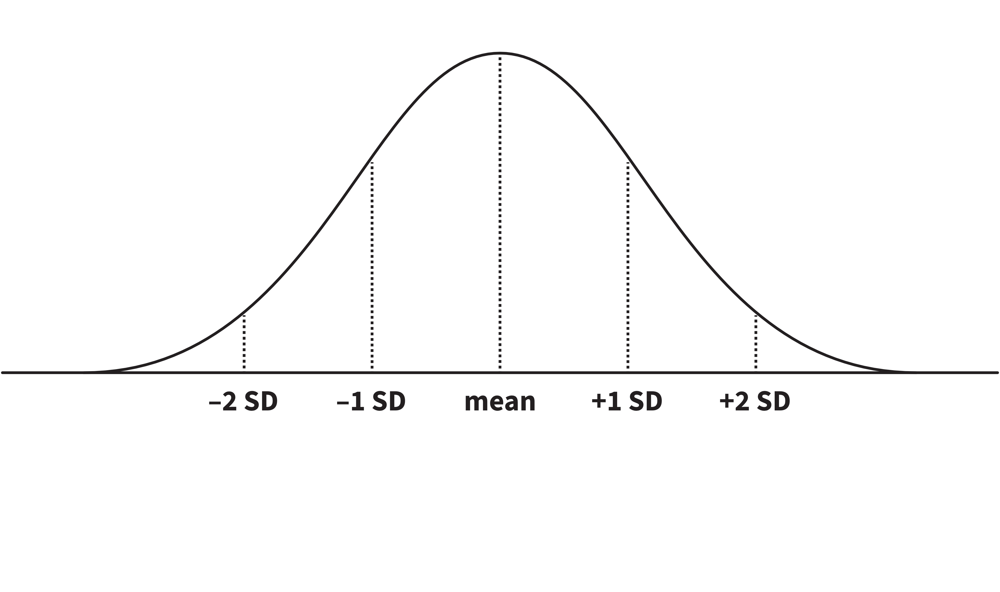{fig-align="center"}
:::

:::fragment
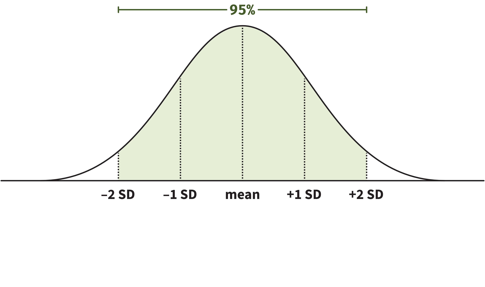{fig-align="center"}
:::

:::fragment
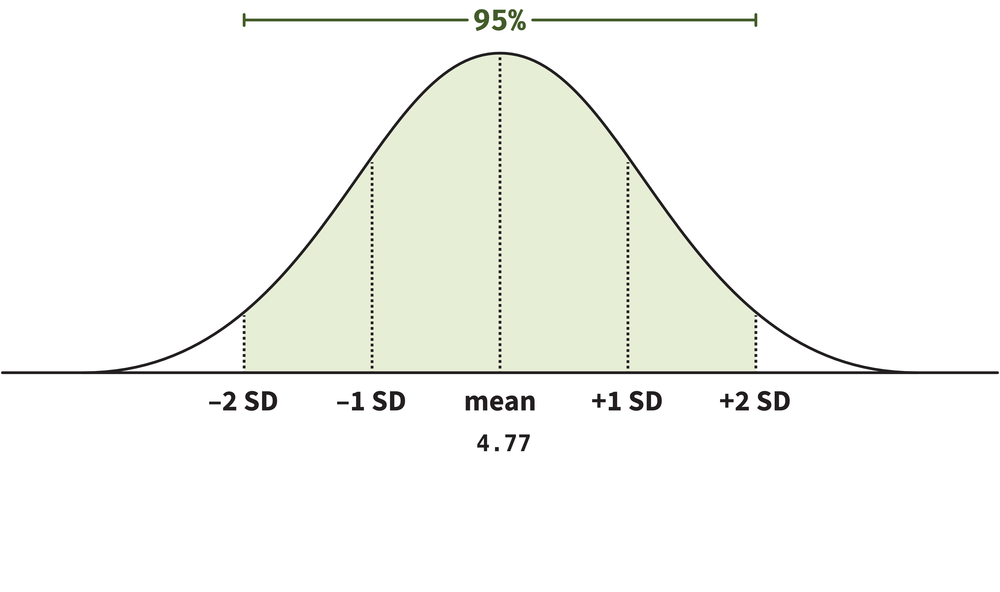{fig-align="center"}
:::

:::fragment
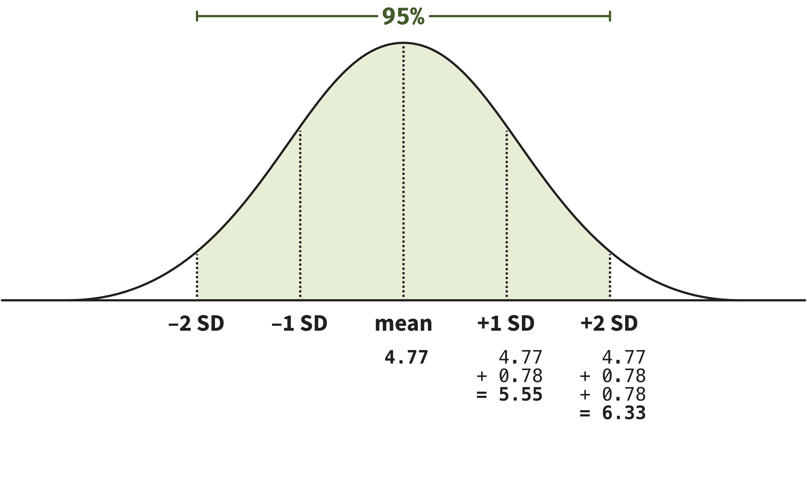{fig-align="center"}
:::

:::fragment
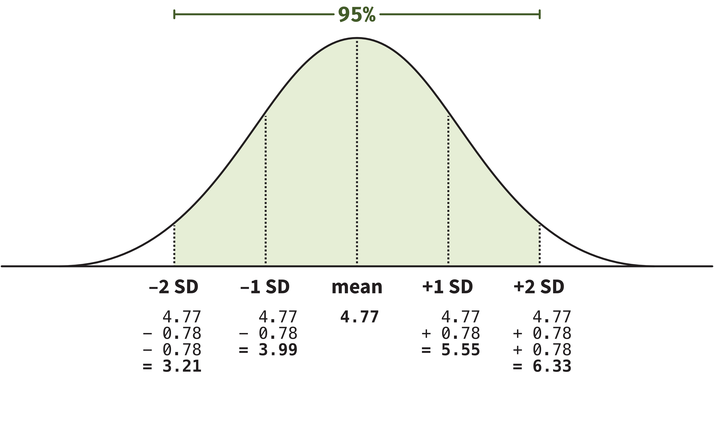{fig-align="center"}
:::

:::fragment
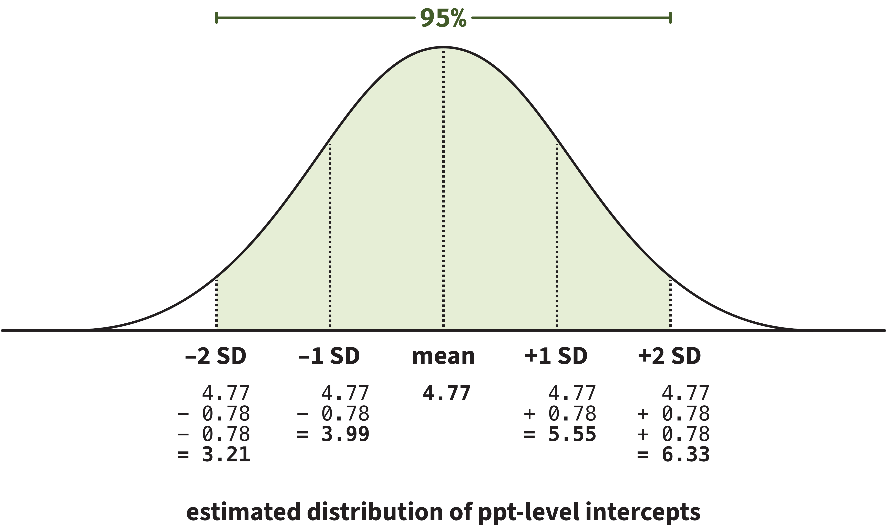{fig-align="center"}
:::
:::

## Intercept adjustments for each `ppt_id` (3)

{fig-align="center"}

<br>

Approx 95% of participant-level intercepts are estimated to fall between about `r 4.77 - (2 * 0.78)` log units and `r 4.77 + (2 * 0.78)` log units.

This means that, **for 95% of participants, the estimated log RT for unassociated pairings is between 3.21 log units and 6.33 log units.**

Useful information!


## `pairingAssociated` adjustments by `ppt_id`

```{r echo=F}
cat('', paste0(capture.output(
  summary(implicit_full_lmm)
), '\n')[13:15])
```


**The `pairingAssociated` adjustments (i.e., adjustments to the slope over `pairing`) for `ppt_id` have a SD of 0.31 log units.**

<!-- Again, in order to make this number meaningful, we must interpret it in relation to the fixed effect it's adjusting: the `pairingAssociated` fixed slope estimate of –0.76. -->

```{r include=F}
-0.76 + (1 * 0.31)
-0.76 + (2 * 0.31)

-0.76 - (1 * 0.31)
-0.76 - (2 * 0.31)
```


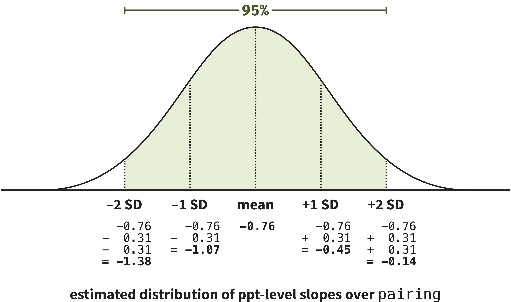{fig-align="center"}

<!-- Approx 95% of participant-level slopes over `pairing` are estimated to fall between about –1.38 log units and <br> –0.14 log units. -->

<br>

**At least 95% of participants are all estimated to have a negative effect of `pairing`:** faster RTs for associated pairings compared to unassociated pairings.


## Correlation between by-participant slope and intercept adjustments

```{r echo=F}
cat('', paste0(capture.output(
  summary(implicit_full_lmm)
), '\n')[13:15])
```

<br>

The participant-level `(Intercept)` and `pairingAssociated` adjustments have a correlation of –0.83.

```{r}
#| code-fold: true
dotplot.ranef.mer(ranef(implicit_full_lmm))$ppt_id
```


# Over to you for interpreting `item_id` adjustments

## Intercept adjustments for each `item_id`

```{r echo=F}
cat(paste0(capture.output(
  summary(implicit_full_lmm)
), '\n')[13])
cat(paste0(capture.output(
  summary(implicit_full_lmm)
), '\n')[16])
```

<br>

Calculate the range in which the 95% of item-level intercepts are estimated to fall.

:::hcenter
:::woo
https://app.wooclap.com/events/FUNOEYF/
:::
:::

<br>

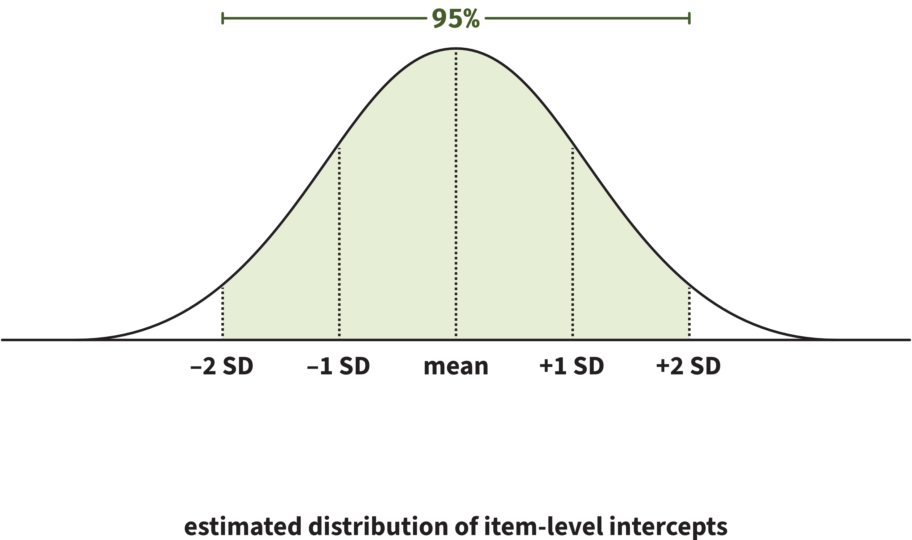{fig-align="center" width="100%"}

```{r include=F}
4.77 + (1 * 0.88)
4.77 + (2 * 0.88)
4.77 - (1 * 0.88)
4.77 - (2 * 0.88)
```


## `pairingAssociated` adjustments for `item_id`

```{r echo=F}
cat(paste0(capture.output(
  summary(implicit_full_lmm)
), '\n')[13])

cat('', paste0(capture.output(
  summary(implicit_full_lmm)
), '\n')[16:17])
```

<br>

Calculate the range in which the 95% of item-level slopes over `pairing` are estimated to fall.

:::hcenter
:::woo
https://app.wooclap.com/events/FUNOEYF/
:::
:::

<br>

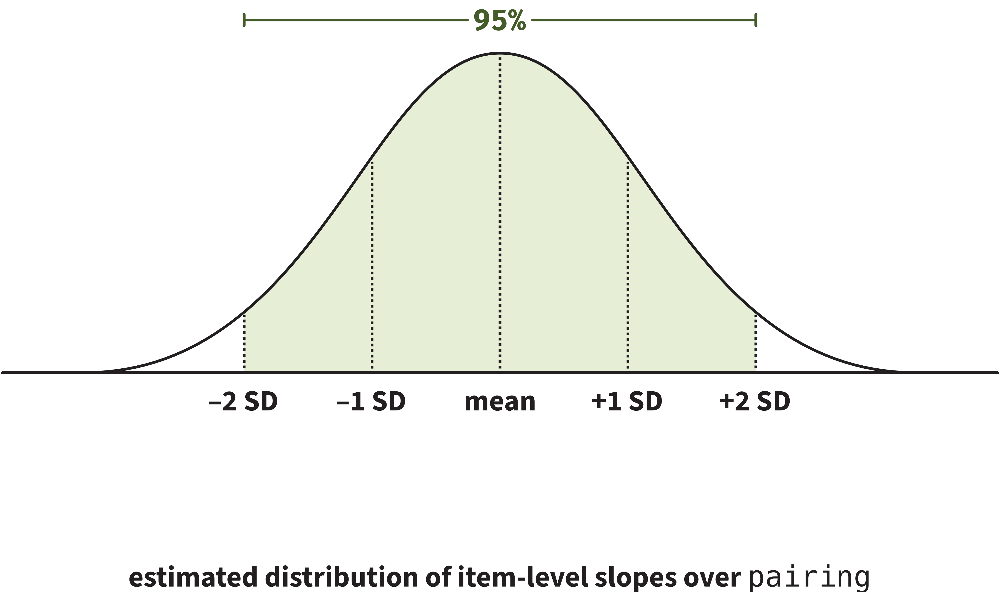{fig-align="center" width="100%"}

```{r include=F}
-0.76 + (1 * 0.39)
-0.76 + (2 * 0.39)

-0.76 - (1 * 0.39)
-0.76 - (2 * 0.39)
```


## Correlation between by-item intercept and slope adjustments

```{r echo=F}
cat(paste0(capture.output(
  summary(implicit_full_lmm)
), '\n')[13])

cat('', paste0(capture.output(
  summary(implicit_full_lmm)
), '\n')[16:17])
```

<br>

The item-level `(Intercept)` and `pairingAssociated` adjustments have a correlation of –0.77.

```{r}
#| code-fold: true
dotplot.ranef.mer(ranef(implicit_full_lmm))$item_id
```


## Residuals

```{r echo=F}
cat(paste0(capture.output(
  summary(implicit_full_lmm)
), '\n')[13])

cat(paste0(capture.output(
  summary(implicit_full_lmm)
), '\n')[18])
```

<br>

- A residual is the difference between the value we observed for a data point and the value that the model predicts for it.

- Residuals are how the model deals with the unsystematic leftover variability that is present in the world but not accounted for by variables we've included in the model.

- Residual variance/SD is not very informative or useful. You don't need to interpret or report it.


# One last thing to report: <br> Plots of model-fitted values

## Use `Effect()` to compute model-fitted values

In the library `effects`, there is a function called `Effect()`.

It gives us the outcome values that the model would estimate/predict for each level of our predictor, as well as the 95% CI around those values.
(Same idea as `emmeans` from DAPR2.)

<br>

```{r}
library(effects)

Effect(
  focal.predictors = c("pairing"),   # what predictor(s) do we want predictions for?
  mod = implicit_full_lmm            # what model should predictions be based on?
) |>
  as.data.frame()
```

<br>

- `fit`: the estimated outcome (log RT) value for each level of `pairing`
- `se`: the standard error of that estimate
- `lower`: the lower bound of the estimate's 95% CI
- `upper`: the upper bound of the estimate's 95% CI


## Visualise these estimates

```{r eval=F}
Effect(focal.predictors = c("pairing"), mod = implicit_full_lmm) |>
  as.data.frame() |>
  ggplot(aes(x = pairing, y = fit)) +
  geom_point() +
  geom_errorbar(aes(ymin = lower, ymax = upper), width = 0) +
  labs(
    y = 'Log RT',
    x = 'Topic pairing'
  )
```


```{r echo=F}
Effect(focal.predictors = c("pairing"), mod = implicit_full_lmm) |>
  as.data.frame() |>
  ggplot(aes(x = pairing, y = fit)) +
  geom_point(size = 5) +
  geom_errorbar(aes(ymin = lower, ymax = upper), width = 0, linewidth = 1) +
  labs(
    y = 'Log RT',
    x = 'Topic pairing'
  )
```


# How to identify all possible random effects

## How to identify all possible random effects

Four steps that you can apply to any dataset + RQ:

:::dapr3callout
1. Use your RQ to figure out what your model’s outcome and predictors are (i.e., your model’s fixed effects).
:::

:::dapr3callout
2. For all variables that are not the outcome or predictors, identify whether they are grouping variables.
:::

:::dapr3callout
3. Identify which of those grouping variables contribute random / non-manipulated / non-controlled variability to your data (think about the data generating process).

For every randomly-varying grouping variable, your model must contain a random intercept for that grouping variable.
:::

:::dapr3callout
4. Refer back to all predictors you identified in Step 1. For each randomly-varying grouping variable, check whether at least some of its levels appear with more than one value of each predictor.

If they do, then (in addition to the random intercepts) your model can also contain a random slope over that predictor for that grouping variable.

If they don't, then a random slope over that predictor is impossible.
:::

# Example 1: Hesitation markers and believability

## Example 1: Hesitation markers and believability

RQ: Do hesitation markers like “um”/“erm” affect how believable true statements seem?

:::: {.columns}
::: {.column width="45%"}
**Examples from condition `hesitation = No`:**

- "A hashtag is technically called an octothorp."
- "The largest snowflake was bigger than most pizzas."
- "Pigs don’t sweat."
:::

::: {.column width="5%"}
:::

::: {.column width="50%"}
**Examples from condition `hesitation = Yes`:**

- "Erm ... a hashtag is technically called an octothorp."
- "Erm ... the largest snowflake was bigger than most pizzas."
- "Erm ... pigs don’t sweat."
:::
::::

```{r include=F}
belief_data <- read_csv("https://uoepsy.github.io/data/erm_belief.csv") |>
  mutate(
    hesitation = factor(ifelse(condition == 'disfluent', 'Yes', 'No')),
  ) |>
  select(ppt, sentence, statement, hesitation, belief) |>
  arrange(ppt, sentence)
```

```{r}
#| code-fold: true

belief_data |>
  ggplot(aes(x = hesitation, y = belief, colour = hesitation, fill = hesitation)) +
  geom_violin(alpha = 0.5) +
  geom_jitter(alpha = 0.5, size = 3) +
  stat_summary(geom = 'point', fun = mean, colour = 'black', size = 5) +
  scale_fill_manual(values = pal) +
  scale_colour_manual(values = pal) +
  theme(
    legend.position = 'none'
  )
```

## The data

```{r}
belief_data |> head(20)
```


## Step 1: Identify fixed effects

:::dapr3callout
1. Use your RQ to figure out what your model’s outcome and predictors are (i.e., your model’s fixed effects).
:::

<br>

RQ: Do hesitation markers like “um”/“erm” affect how believable true statements seem?

<br>

```{r}
names(belief_data)
```

<br>

- Outcome variable: `belief`
- Predictor variable: `hesitation`

<br>

The fixed effects part of the model formula will be `belief ~ hesitation`.


## Step 2: Identify grouping variables

:::dapr3callout
2. For all variables that are not the outcome or predictors, identify whether they are grouping variables.
:::

:::: {.columns}
::: {.column width="47%"}
For `ppt`:

```{r eval=F}
belief_data |>
  group_by(ppt) |>
  count()
```

```{r echo=F}
cat('', paste0(capture.output(
belief_data |>
  group_by(ppt) |>
  count()
), '\n')[1:14])
cat("...")
```

<br>

Each value of `ppt` appears more than once.
`ppt` is a grouping variable &nbsp; ✅

:::
::: {.column width="5%"}
:::

::: {.column width="47%"}

For `sentence` (which numbers each statement):

```{r eval=F}
belief_data |>
  group_by(sentence) |>
  count()
```

```{r echo=F}
cat('', paste0(capture.output(
belief_data |>
  group_by(sentence) |>
  count()
), '\n')[1:14])
cat("...")
```
<br>

Each value of `sentence` appears more than once.
`sentence` is a grouping variable &nbsp;  ✅

:::
::::


## Step 3: Random intercepts

:::dapr3callout
3. Identify which of those grouping variables contribute random / non-manipulated / non-controlled variability to your data (think about the data generating process).

For every randomly-varying grouping variable, your model must contain a random intercept for that grouping variable.
:::

`ppt`:

- The RQ doesn't specify that we manipulate or control for specific people.
- If we re-ran the study, we could recruit different participants and still address the RQ.
- We want our results to generalise across different people.
- Therefore: **`ppt` contributes random variability, and our model needs at least a random intercept by participant.**


`sentence`:

- The RQ doesn't specify that we manipulate or control for specific sentences.
- If we re-ran the study, we could show people different sentences and still address the RQ.
- We want our results to generalise across different sentences.
- Therefore: **`sentence` contributes random variability, and our model needs at least a random intercept by sentence.**


The minimum LMM formula now: `belief ~ hesitation + (1 | ppt) + (1 | sentence)`


## Step 4: Random slopes

:::dapr3callout
4. Refer back to all predictors you identified in Step 1. For each randomly-varying grouping variable, check whether at least some of its levels appear with more than one value of each predictor.

If they do, then (in addition to the random intercepts) your model can also contain a random slope over that predictor for that grouping variable.

If they don't, then a random slope over that predictor is impossible.
:::

:::: {.columns}
::: {.column width="50%"}
Do at least some levels of `ppt` appear with more than one value of `hesitation`?

```{r eval=F}
stats::xtabs(
  ~ ppt + hesitation, 
  data = belief_data
)
```

```{r echo=F}
cat(paste0(capture.output(
  
stats::xtabs(
  ~ ppt + hesitation, 
  data = belief_data
)

), '\n')[1:8])
cat("...")
```

Yes! 
So `(1 + hesitation | ppt)` is possible.

:::
::: {.column width="50%"}

Do at least some levels of `sentence` appear with more than one value of `hesitation`?

```{r eval=F}
stats::xtabs(
  ~ sentence + hesitation, 
  data = belief_data
)
```

```{r echo=F}
cat(paste0(capture.output(
  
stats::xtabs(
  ~ sentence + hesitation, 
  data = belief_data
)

), '\n')[1:8])
cat("...")
```

Yes! 
So `(1 + hesitation | sentence)` is possible.

:::
::::


## The model with all possible random effects

<br>

:::hcenter
`belief ~ hesitation + (1 + hesitation | ppt) + (1 + hesitation | sentence)`
:::

<br>

There's a specific name for the version of the model that has all possible random effects permitted by the data structure and the RQ.

We call it the **"maximal model".**


# Example 2: Test-enhanced learning

## Example 2: Test-enhanced learning

Two groups of participants learn some new material.

One group studied the material twice (the `StudyStudy` group), and the other group studied the material once and then tested themselves on it (the `StudyTest` group).

Recall was tested immediately (one minute) after the learning session and again one week later.
Time of testing is recorded in the variable `Delay`.

<!-- The recall tests are each identified by a keyword (`Test_word`). -->

**RQ: Does self-testing improve retention, such that the `StudyStudy` group may perform better on the immediate test, but the `StudyTest` group will perform better on the test one week later?**


```{r include=F}
load(url("https://uoepsy.github.io/data/testenhancedlearning.RData"))

ppts_to_keep <- c(
  paste0('StudyStudy_', LETTERS[1:10]),
  paste0('StudyTest_', LETTERS[1:10])
)

set.seed(1)
tel_data <- tel |>
  filter(
    Test_word != 'Eskimo',
    Subject_ID %in% ppts_to_keep
  ) |>
  rowwise() |>
  mutate(
    TestScore = rnorm(n=1, mean = Correct, sd = 0.5),
  ) |>
  ungroup() |>
  mutate(
    TestScore = case_when(
      Group == 'StudyStudy' & Delay == 'min'  ~ TestScore + 0.2,
      Group == 'StudyStudy' & Delay == 'week' ~ TestScore - 0.5,
      Group == 'StudyTest'  & Delay == 'min'  ~ TestScore + 0.2,
      Group == 'StudyTest'  & Delay == 'week' ~ TestScore,
    ),
    TestScore = as.numeric(round(datawizard::rescale(TestScore, to = c(0, 100))))
  ) |>
  select(-Correct, -Rtime)
 
rm(tel)
```


```{r}
#| code-fold: true

tel_data |>
  ggplot(aes(x = Delay, y = TestScore, colour = Delay, fill = Delay)) +
  geom_violin(alpha = 0.5) +
  geom_jitter(alpha = 0.15, size = 3) +
  facet_wrap(~ Group) +
  stat_summary(geom = 'point', fun = mean, colour = 'black', size = 5) +
  scale_fill_manual(values = pal) +
  scale_colour_manual(values = pal) +
  theme(
    legend.position = 'none',
    strip.background = element_blank(),
    strip.text.x = element_text(size = 24)
  )
```


## The data

```{r}
tel_data |> head(20)
```


## Step 1: Identify fixed effects

:::dapr3callout
1. Use your RQ to figure out what your model’s outcome and predictors are (i.e., your model’s fixed effects).
:::

<br>

RQ: Does self-testing improve retention, such that the `StudyStudy` group may perform better on the immediate test, but the `StudyTest` group will perform better on the test one week later?

<br>

```{r}
names(tel_data)
```

<br>

- Outcome variable: `TestScore`
- Predictor variables: `Delay`, `Group`, and their interaction

<br>

The fixed effects part of the model formula will be `TestScore ~ Delay * Group`.


## Step 2: Identify grouping variables

:::dapr3callout
2. For all variables that are not the outcome or predictors, identify whether they are grouping variables.
:::

The remaining variables: `Subject_ID` (categorical) and `Test_word` (categorical).

:::: {.columns}
::: {.column width="47%"}
For `Subject_ID`:

```{r eval=F}
tel_data |>
  group_by(Subject_ID) |>
  count()
```

```{r echo=F}
cat('', paste0(capture.output(

tel_data |>
  group_by(Subject_ID) |>
  count()
  
), '\n')[1:10])
cat("...")
```

<br>

Each value of `Subject_ID` appears more than once.
`Subject_ID` is a grouping variable &nbsp; ✅

:::
::: {.column width="5%"}
:::

::: {.column width="47%"}

For `Test_word`:

```{r eval=F}
tel_data |>
  group_by(Test_word) |>
  count()
```

```{r echo=F}
cat('', paste0(capture.output(
  
  tel_data |>
  group_by(Test_word) |>
  count()

), '\n')[1:10])
cat("...")
```
<br>

Each value of `Test_word` appears more than once.
`Test_word` is a grouping variable &nbsp;  ✅

:::
::::


## Step 3: Random intercepts


:::dapr3callout
3. Identify which of those grouping variables contribute random / non-manipulated / non-controlled variability to your data (think about the data generating process).

For every randomly-varying grouping variable, your model must contain a random intercept for that grouping variable.
:::

`Subject_ID`:

- The RQ doesn't specify that we manipulate or control for specific people.
- If we re-ran the study, we could recruit different subjects and still address the RQ.
- We want our results to generalise across different people.
- Therefore: **`Subject_ID` contributes random variability, and our model needs at least a random intercept by subject.**


`Test_word`:

- The RQ doesn't specify that we manipulate or control for specific test words.
- If we re-ran the study, we could show people different test words and still address the RQ.
- We want our results to generalise across different test words.
- Therefore: **`Test_word` contributes random variability, and our model needs at least a random intercept by test word.**


Minimum model now: `TestScore ~ Delay * Group + (1 | Subject_ID) + (1 | Test_word)`


## Step 4: Random slopes

:::dapr3callout
4. Refer back to all predictors you identified in Step 1. For each randomly-varying grouping variable, check whether at least some of its levels appear with more than one value of each predictor.

If they do, then (in addition to the random intercepts) your model can also contain a random slope over that predictor for that grouping variable.

If they don't, then a random slope over that predictor is impossible.
:::

<br>

We'll need to check all combinations of grouping variables and predictors:

- Do at least some levels of `Subject_ID` appear with more than one value of `Delay`?
- Do at least some levels of `Subject_ID` appear with more than one value of `Group`?
- Do at least some levels of `Test_word` appear with more than one value of `Delay`?
- Do at least some levels of `Test_word` appear with more than one value of `Group`?


## Step 4: Random slopes by `Subject_ID`

:::: {.columns}
::: {.column width="47%"}
Do at least some levels of `Subject_ID` appear with more than one value of `Delay`?

```{r eval=F}
stats::xtabs(
  ~ Subject_ID + Delay, 
  data = tel_data
)
```

```{r echo=F}
cat(paste0(capture.output(
  
stats::xtabs(
  ~ Subject_ID + Delay, 
  data = tel_data
)

), '\n')[1:12])
cat("...")
```

Yes! 
So a random slope over `Delay` by `Subject_ID` is possible.

:::
::: {.column width="3%"}
:::
::: {.column width="50%"}

Do at least some levels of `Subject_ID` appear with more than one value of `Group`?

```{r eval=F}
stats::xtabs(
  ~ Subject_ID + Group, 
  data = tel_data
)
```

```{r echo=F}
cat(paste0(capture.output(
  
stats::xtabs(
  ~ Subject_ID + Group, 
  data = tel_data
)

), '\n')[1:12])
cat("...")
```

No!
People are either in one group or the other.
We cannot include a random slope over `Group` by `Subject_ID`.

:::
::::

<br>

**The maximal random effects term for `Subject_ID` is `(1 + Delay | Subject_ID)`.**


## Step 4: Random slopes by `Test_word`

:::: {.columns}
::: {.column width="47%"}
Do at least some levels of `Test_word` appear with more than one value of `Delay`?

```{r eval=F}
stats::xtabs(
  ~ Test_word + Delay, 
  data = tel_data
)
```

```{r echo=F}
cat(paste0(capture.output(
  
stats::xtabs(
  ~ Test_word + Delay, 
  data = tel_data
)

), '\n')[1:12])
cat("...")
```

Yes! 
So a random slope over `Delay` by `Test_word` is possible.

:::
::: {.column width="3%"}
:::
::: {.column width="50%"}

Do at least some levels of `Test_word` appear with more than one value of `Group`?

```{r eval=F}
stats::xtabs(
  ~ Test_word + Group, 
  data = tel_data
)
```

```{r echo=F}
cat(paste0(capture.output(
  
stats::xtabs(
  ~ Test_word + Group, 
  data = tel_data
)

), '\n')[1:12])
cat("...")
```

Yes!
So we can also add on a random slope over `Group` by `Test_word`.

And because both predictors can have random slopes, we can also include their interaction.

:::
::::

**The maximal random effects term for `Test_word` is `(1 + Delay * Group | Test_word)`.**


## The maximal model

<br>

:::hcenter
`TestScore ~ Delay * Group +  (1 + Delay | Subject_ID) + (1 + Delay * Group | Test_word)`
:::


# Why is it useful to find the maximal model?

## Why is it useful to find the maximal model?

Because the maximal model ...

- ... takes into account all the variability that plays a role in our design.
- ... gives us the most conservative fixed effect estimates, which lowers the risk of Type I error (that is, rejecting the H0 when there is no effect).
- ... generalises better to the populations that we want to draw conclusions about.

<br>

From a theoretical perspective, the maximal model is what we should fit.
But from a practical perspective, sometimes this is actually impossible to do in R.

For example, take the maximal model for our RQ for `tel_data`:

:::hcenter
`TestScore ~ Delay * Group +  (1 + Delay | Subject_ID) + (1 + Delay * Group | Test_word)`
:::

If we try to fit this model, R will not be able to do it.

Next week, we'll learn how to deal with that issue.

<br>

**Regardless of any practical issues that happen when we try to fit the model, we should always start an analysis by finding the maximal model permitted by our dataset and RQ.**


# Back matter

## Learning objectives revisited

:::dapr3callout
**How do we interpret the random effects part of a model summary?**

- Always relative to the fixed effects.
- The fixed effect is the mean of a Normal distribution of group-level adjustments.
- The SD of that Normal distribution is given in the random effects summary table.
- There is no significance testing involved for random effects.
- When interpreting random effects, we are interested in questions like:
  - Is there greater variability within one grouping variable than another?
  - For slope adjustments: does the model predict that any specific levels of the grouping variable show the opposite direction of effect (e.g., a negative effect if the fixed effect is positive)?

:::


:::dapr3callout
**How do we know if a model can include random intercepts for a given grouping variable?**

- We think about the data generating process, and specifically the kind of variability that the grouping variable contributes to the data.
- If the grouping variable contributes random variability to the data, then a model of that data must include random intercepts for that grouping variable.
:::

## Learning objectives revisited


:::dapr3callout
**How do we know if a model can include random slopes over a given predictor for a given grouping variable?**

- Check if the data contains more than one value of a given predictor within at least some levels of the grouping variable.
- (Why? Because we need at least two observations to fit a line. If there's only one value for a given predictor and a given participant, then we have no idea what a line fit to that data would look like because we don't know the second point that the line would connect.)
:::


:::dapr3callout
**What is a maximal model?**

- A model that contains all possible random effects that are permitted by the data structure and the RQ.
:::


## To do this week 

<br>

::::{.columns}
:::{.column width="50%"}
**Tasks:**

<br>

{width=80px style="margin:10px;margin-bottom:-50px"} Work on exercises in labs

<br>

{width=80px style="margin:10px;margin-bottom:-45px"} Complete the weekly quiz 


:::

:::{.column width="50%"}
**Get support:**

<br>

{width=80px style="margin:10px;margin-bottom:-30px"}
Consult the [flash cards](https://uoepsy.github.io/dapr3/2627/flashcards/){target="_blank"}

<br>

{width=80px style="margin:10px;margin-bottom:-50px"}
Ask questions anonymously on Piazza

<br>

{width=80px style="margin:10px;margin-bottom:-40px"} 
We really like seeing you in office hours!


:::
::::


# Appendix {.appendix}


## Intercepts

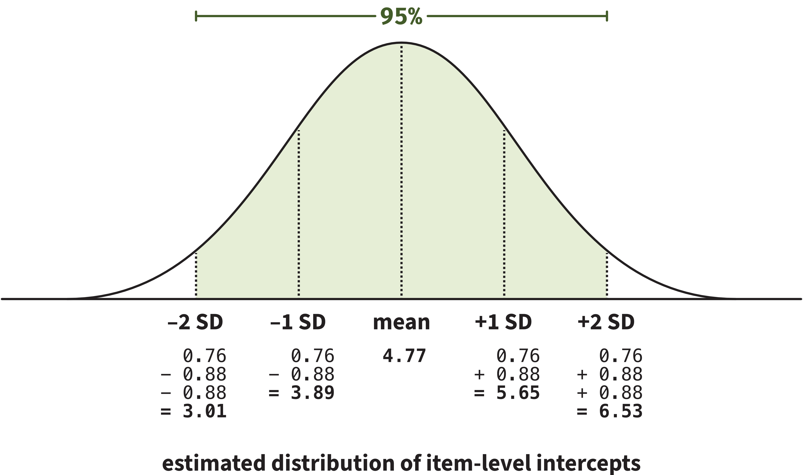{fig-align="center"}


- 95% of item-level intercepts are estimated to fall between about `r 4.77 - (2 * 0.88)` log units and `r 4.77 + (2 * 0.88)` log units.

- For 95% of items, the estimated log RT when the item is seen as part of an unassociated pairing is between 3.01 log units and 6.53 log units.

- **This range for items is larger than the range for participants, which means that items show more variability around the fixed intercept than participants do.**


## Slopes

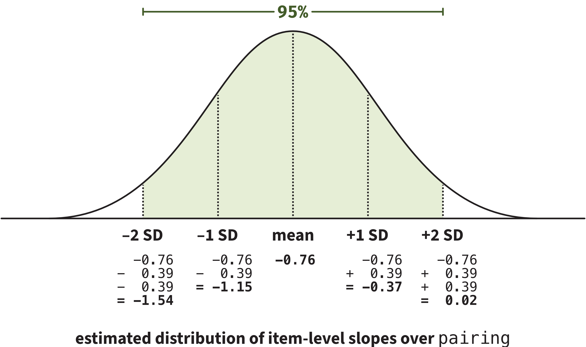{fig-align="center"}

- 95% of item-level slopes over `pairing` are estimated to fall between about –1.54 log units and 0.02 log units.

- **This is interesting because some items appear to show a tiny positive effect of `pairing`!**
In other words, they might elicit faster reactions for unassociated pairings and slower reactions for associated pairings—**not the pattern we expected.**

- Useful information!!