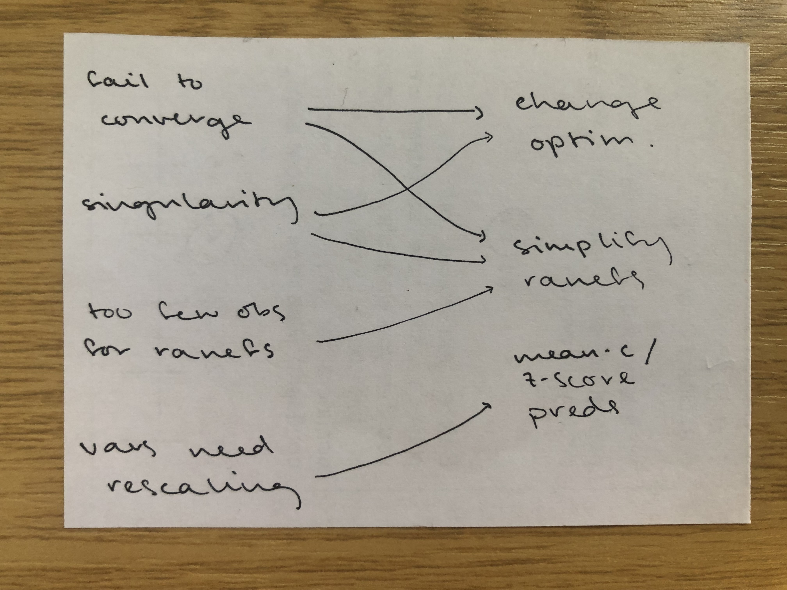

```{r setup, include=F}
library(tidyverse)
library(patchwork)

library(lme4)
library(lmerTest)
library(HLMdiag)

library(latex2exp)  # for betas in ggplots
source('_theme/theme_quarto.R')

theme_set(theme_quarto(title_font_size=42))
theme_update(
  text = element_text(family = 'Source Sans 3')
)

dapr3green <- "#88B04B" 
dapr3dkgreen <- "#5C7C28"
dapr3ltgreen <- "#E5EED7"
pal <- c( "#d35269", "#5c9ead","#2a3c24", "#F5C396", "#8B2635",  "#235789")
```


# Course Overview {background-color="white"}

<br>

```{r echo=F}
#| results: "asis"
block1_name = "Linear mixed models<br>(with Dr. Elizabeth Pankratz)"
block1_lecs = c("Regression refresher, intro to group-structured data",
                "Modelling group-structured data using random effects",
                "Interpreting LMMs and building maximal models",
                "Troubleshooting model fit, checking assumptions + diagnostics",
                "TODO")
block2_name = "factor analysis<br>working with multi-item measures<br>(with Dr. Josiah King)"
block2_lecs = c(
  "measurement and dimensionality",
  "exploring underlying constructs (EFA)",
  "testing theoretical models (CFA)",
  "reliability and validity",
  "recap & exam prep"
  )

source("https://raw.githubusercontent.com/uoepsy/junk/refs/heads/main/R/course_table.R")
course_table(block1_name,block2_name,block1_lecs,block2_lecs,week=4)
```

## This week's learning objectives

:::dapr3callout
TODO
:::


  
## Recap: What does it mean to "adjust the intercept"?


:::: {.columns}
::: {.column width="30%"}
The average association between predictor and outcome:

<br>


:::

::: {.column width="5%"}
:::


::: {.column width="30%"}
If a participant has a **higher outcome value than average when predictor = 0**, then they will have a **positive adjustment to the average intercept.**


:::

::: {.column width="5%"}
:::

::: {.column width="30%"}
If a participant has a **lower outcome value than average when predictor = 0**, then they will have a **negative adjustment to the average intercept.**


:::
::::


  
## Recap: What does it mean to "adjust the slope"?

:::: {.columns}
::: {.column width="30%"}
The average association between predictor and outcome:

<br>


:::

::: {.column width="5%"}
:::


::: {.column width="30%"}
If a participant has a **more positive effect than average**, then they will have a **positive adjustment to the fixed slope.**


:::

::: {.column width="5%"}
:::

::: {.column width="30%"}
If a participant has a **more negative effect than average**, then they will have a **negative adjustment to the fixed slope.**


:::
::::


## Recap: What is a maximal model?

The maximal model is the version of the linear mixed model that contains all possible random effects that the data can support.
That is, all possible group-level adjustments to the fixed intercept and fixed slope(s).

A maximal model does not need to contain every possible fixed effect.
(Fixefs should be based on RQ.)
Just every possible ranef.

In theory: Important as a starting point bc maximal models capture all sources of random variability that we think could play a role in our data.

But in practice: often run into issues trying to actually fit them.


# Common issues when fitting LMMs

## Common issues when fitting LMMs

{fig-align="center"}


## Model failed to converge

**How you can tell:**

:::{style="font-size:150%"}
```
warning(s): Model failed to converge with max|grad| = 0.0071877 (tol = 0.002, component 1)
```
:::

or

:::{style="font-size:150%"}
```
Warning: Model failed to converge with 1 negative eigenvalue: -1.3e+02
```
:::

<br>

**What's the problem?**

- LMMs estimate parameters using a process called "maximum likelihood estimation" (MLE).
- The model's goal is to come up with the parameters that are *maximally likely* to have generated our data.
- To find the most likely parameters, the model starts with random values that probably don't match our data very well.
Then the model adjusts those values until they *do* match the data.
- When the model successfully estimates those numbers, we say the model has "converged".
- But when this process runs into problems or gets stuck, we say the model has "not converged".
- **Never trust any numbers from a model that has not converged.**


## Singularity / singular fit

**How you can tell:**

You get the warning

:::{style="font-size:150%"}
```
boundary (singular) fit: see ?isSingular
```
:::

or the correlations between random effects are –1 or 1, or the SD/variance of random effects are 0.

(We have to check on those variance components manually, we don't get any warnings about those ☹️)

<br>

**What's the problem?**

- The model has encountered techical/mathematical problems when trying to estimate all the parameters we've asked it to estimate.
- Usually the problem is that the random effect structure is too complex (that is, too many group-level adjustment parameters).
- **Never trust any numbers from a model with a singular fit.**


## Not enough observations for random effect structure

**How you can tell:**

:::{style="font-size:150%"}
```
Error: number of observations (=150) <= number of random effects (=150) for term (1 + x | g); the random-effects parameters and the residual variance (or scale parameter) are probably unidentifiable
```
:::

<br>

**What's the problem?**

- Again, the random effect structure is too complex for the data to support.
- This is common when each level of a grouping variable has exactly one observation per level of a predictor.
  - Strictly speaking, random slopes should be possible, because the predictor does vary within each level of the grouping variable.
  - But practically speaking, the model needs more data to estimate the random slopes.
- **Never trust any numbers from a model with unidentifiable parameters.**


## Variables need rescaling

**How you can tell:**

:::{style="font-size:150%"}
```
Warning messages:
1: Some predictor variables are on very different scales:
consider rescaling
```
:::

or

:::{style="font-size:150%"}
```
Warning messages:
1: In checkConv(attr(opt, “derivs”), opt$par, ctrl = control$checkConv, :
Model is nearly unidentifiable: large eigenvalue ratio
- Rescale variables?
```
:::

<br>

**What's the problem?**

- Continuous predictors can measure the same thing on different scales: e.g., my height is 1.79 metres and also 1,790,000 micrometres.
- Sometimes the scale of the numbers is hard for the model to deal with, because they result in variance values too close to zero, which the model does not like.
- **Never trust any numbers from a model with unidentifiable parameters.**


# What to do about these issues

## What to do about these issues

{fig-align="center"}


## Change optimiser

LMMs arrive at their parameter values by initialising them to random values, and then adjusting them until they are the parameters that are **maximally likely** to have produced the data we observe.

There are several different ways a model might adjust (or *optimise*) these parameters.

If the default way is not working, then it might help to use a different optimiser.

<br>

One optimiser that generally works well is `bobyqa` (pronounced like "bo-BEE-ka", in IPA [bo.ˈbi.ka]):

```{r eval=F}
lmer(
  y ~ 1 + x * z + (1 + x * z | g), 
  data = df, 
  control = lmerControl(optimizer = "bobyqa")  # add in this line
)
```


## Simplify random effect structure

Imagine you're starting with the following maximal model:

:::hcenter
` y ~ x * z + (1 + x * z | g) `
:::

We simplify the model bit by bit, and try to fit it again after every simplification step.
We stop once the model can successfully be fit without any further singularity.

There is no single correct way to simplify a model's random effect structure.

This order of steps is what usually works well for me.

<br>

| Simplification to make | Model formula |
| ---------------------------------------------------------- | -------------------------------- |
| *[maximal model]* | `y ~ x * z + (1 + x * z | g)` |
| Remove the by-group adjustment to the interaction term. | `y ~ x * z + (1 + x + z | g)` |
| If predictors `x` and `z` are continuous, remove the correlations between by-group adjustments (if predictors are categorical, other weird stuff happens and this step doesn't really simplify the model). | `y ~ x * z + (1 + x + z || g)` |
| Remove one of the by-group slope adjustments (if one is just a covariate, remove that one first). | `y ~ x * z + (1 + x | g)` |
| If `x` is continuous, remove the correlations between by-group adjustments. | `y ~ x * z + (1 + x || g)` |
| Remove the slope adjustments. | `y ~ x * z + (1 | g)` |
| | |


## Rescale predictor(s)

The simplest solution is to z-score the problematic predictor.

**Recall that when you z-score a variable:**

- its mean becomes 0, and
- its SD becomes 1.

<br>


```{r eval=F}
df <- df |>
  mutate(
    predictor_z = (predictor - mean(predictor) / sd(predictor))
  )
```

<br>

Then use the `predictor_z` version in your model instead of the original `predictor`.

And remember to interpret it as a z-score (i.e., with units of standard deviations), not on its original scale (e.g., with units of micrometres).

<br>

You'll get some practice with rescaling in this week's lab!


Now let's do a worked example with some data we got to know last week.


# This week's data (again): <br> Test-enhanced learning

## This week's data (again): Test-enhanced learning

Two groups of participants learn some new material.

One group studied the material twice (the `StudyStudy` group), and the other group studied the material once and then tested themselves on it (the `StudyTest` group).

Recall was tested immediately (one minute) after the learning session and again one week later (recorded in the variable `Delay`).

<!-- The recall tests are each identified by a keyword (`Test_word`). -->

**RQ: Does self-testing improve retention, such that the `StudyStudy` group may perform better on the immediate test, but the `StudyTest` group will perform better on the test one week later?**


```{r include=F}
load(url("https://uoepsy.github.io/data/testenhancedlearning.RData"))

ppts_to_keep <- c(
  paste0('StudyStudy_', LETTERS[1:10]),
  paste0('StudyTest_', LETTERS[1:10])
)

set.seed(1)
tel_data <- tel |>
  filter(
    Test_word != 'Eskimo',
    Subject_ID %in% ppts_to_keep
  ) |>
  rowwise() |>
  mutate(
    TestScore = rnorm(n=1, mean = Correct, sd = 0.5),
  ) |>
  ungroup() |>
  mutate(
    TestScore = case_when(
      Group == 'StudyStudy' & Delay == 'min'  ~ TestScore + 0.2,
      Group == 'StudyStudy' & Delay == 'week' ~ TestScore - 0.5,
      Group == 'StudyTest'  & Delay == 'min'  ~ TestScore + 0.2,
      Group == 'StudyTest'  & Delay == 'week' ~ TestScore,
    ),
    TestScore = as.numeric(round(datawizard::rescale(TestScore, to = c(0, 100))))
  ) |>
  select(-Correct, -Rtime)
 
rm(tel)
```


```{r}
#| code-fold: true

tel_data |>
  ggplot(aes(x = Delay, y = TestScore, colour = Delay, fill = Delay)) +
  geom_violin(alpha = 0.5) +
  geom_jitter(alpha = 0.15, size = 3) +
  facet_wrap(~ Group) +
  stat_summary(geom = 'point', fun = mean, colour = 'black', size = 5) +
  theme(
    legend.position = 'none',
    strip.background = element_blank(),
    strip.text.x = element_text(size = 24)
  )
```


## The data and the maximal model

```{r}
tel_data |> head()
```

<br>
<br>

**The maximal model we worked out last week:**

:::hcenter
`TestScore ~ Delay * Group +  (1 + Delay | Subject_ID) + (1 + Delay * Group | Test_word)`
:::

<!-- - We're predicting people's test score as a function of how delayed the test was (one minute (reference level) or one week later), their study group (StudyStudy (reference level) or StudyTest), and the interaction between these two predictors. -->
<!-- - The maximal model includes by-subject random intercepts and random slopes over test delay. -->
<!-- - The maximal model also includes by-word random intercepts and radom slopes over test delay, study group, and their interaction. -->


# Try to fit the maximal model

## Try to fit the maximal model

```{r eval=F}
library(lme4)      # for fitting LMMs
library(lmerTest)  # for getting p-values

m1 <- lmer(
  TestScore ~ Delay * Group + 
    (1 + Delay | Subject_ID) + 
    (1 + Delay * Group | Test_word),
  data = tel_data
)
```

:::{style="font-size:175%"}
```
boundary (singular) fit: see help('isSingular')
Warning: Model failed to converge with 1 negative eigenvalue: -1.3e+02
```
:::

{fig-align="center"}


## Will changing the optimiser help?

```{r eval=F}
m2 <- lmer(
  TestScore ~ Delay * Group + 
    (1 + Delay | Subject_ID) + 
    (1 + Delay * Group | Test_word),
  data = tel_data,
  control = lmerControl(optimizer = "bobyqa")  # add in this line
)
```

:::{style="font-size:175%"}
```
boundary (singular) fit: see help('isSingular')
```
:::

Nope, we still have a singular fit warning.
The random effect structure is too complex for the data.

{fig-align="center"}


## Simplifying random effects (1)

| Simplification to make | Model formula |
| ---------------------------------------------------------- | -------------------------------- |
| *[maximal model]* | `y ~ x * z + (1 + x * z | g)` |
| **Remove the by-group adjustment to the interaction term.** | `y ~ x * z + (1 + x + z | g)` |
| If predictors `x` and `z` are continuous, remove the correlations between by-group adjustments (if predictors are categorical, other weird stuff happens and this step doesn't really simplify the model). | `y ~ x * z + (1 + x + z || g)` |
| Remove one of the by-group slope adjustments (if one is just a covariate, remove that one first). | `y ~ x * z + (1 + x | g)` |
| If `x` is continuous, remove the correlations between by-group adjustments. | `y ~ x * z + (1 + x || g)` |
| Remove the slope adjustments. | `y ~ x * z + (1 | g)` |
| | |

<br>

```{r eval=F}
m3 <- lmer(
  TestScore ~ Delay * Group + 
    (1 + Delay | Subject_ID) + 
    (1 + Delay + Group | Test_word),  # before: (1 + Delay * Group | Test_word)
  data = tel_data
)
```

:::{style="font-size:175%"}
```
boundary (singular) fit: see help('isSingular')
```
:::


## Simplifying random effects (2)

| Simplification to make | Model formula |
| ---------------------------------------------------------- | -------------------------------- |
| *[maximal model]* | `y ~ x * z + (1 + x * z | g)` |
| Remove the by-group adjustment to the interaction term. | `y ~ x * z + (1 + x + z | g)` |
| If predictors `x` and `z` are continuous, remove the correlations between by-group adjustments (if predictors are categorical, other weird stuff happens and this step doesn't really simplify the model). | `y ~ x * z + (1 + x + z || g)` |
| **Remove one of the by-group slope adjustments (if one is just a covariate, remove that one first).** | `y ~ x * z + (1 + x | g)` |
| If `x` is continuous, remove the correlations between by-group adjustments. | `y ~ x * z + (1 + x || g)` |
| Remove the slope adjustments. | `y ~ x * z + (1 | g)` |
| | |

<br>

```{r eval=F}
m4 <- lmer(
  TestScore ~ Delay * Group + 
    (1 + Delay | Subject_ID) + 
    (1 + Delay | Test_word),  # before: (1 + Delay + Group | Test_word)
  data = tel_data
)
```

:::{style="font-size:175%"}
```
boundary (singular) fit: see help('isSingular')
```
:::


## Simplifying random effects (3)

| Simplification to make | Model formula |
| ---------------------------------------------------------- | -------------------------------- |
| *[maximal model]* | `y ~ x * z + (1 + x * z | g)` |
| Remove the by-group adjustment to the interaction term. | `y ~ x * z + (1 + x + z | g)` |
| If predictors `x` and `z` are continuous, remove the correlations between by-group adjustments (if predictors are categorical, other weird stuff happens and this step doesn't really simplify the model). | `y ~ x * z + (1 + x + z || g)` |
| Remove one of the by-group slope adjustments (if one is just a covariate, remove that one first). | `y ~ x * z + (1 + x | g)` |
| If `x` is continuous, remove the correlations between by-group adjustments. | `y ~ x * z + (1 + x || g)` |
| **Remove the slope adjustments.** | `y ~ x * z + (1 | g)` |
| | |

<br>

```{r eval=F}
m5 <- lmer(
  TestScore ~ Delay * Group + 
    (1 | Subject_ID) +        # before: (1 + Delay | Subject_ID)
    (1 + Delay | Test_word),  # before: (1 + Delay + Group | Test_word)
  data = tel_data
)
```

:::{style="font-size:175%"}
```
boundary (singular) fit: see help('isSingular')
```
:::


## Simplifying random effects (4)

| Simplification to make | Model formula |
| ---------------------------------------------------------- | -------------------------------- |
| *[maximal model]* | `y ~ x * z + (1 + x * z | g)` |
| Remove the by-group adjustment to the interaction term. | `y ~ x * z + (1 + x + z | g)` |
| If predictors `x` and `z` are continuous, remove the correlations between by-group adjustments (if predictors are categorical, other weird stuff happens and this step doesn't really simplify the model). | `y ~ x * z + (1 + x + z || g)` |
| Remove one of the by-group slope adjustments (if one is just a covariate, remove that one first). | `y ~ x * z + (1 + x | g)` |
| If `x` is continuous, remove the correlations between by-group adjustments. | `y ~ x * z + (1 + x || g)` |
| **Remove the slope adjustments.** | `y ~ x * z + (1 | g)` |
| | |

<br>

```{r}
m6 <- lmer(
  TestScore ~ Delay * Group + 
    (1 | Subject_ID) +        # before: (1 + Delay | Subject_ID)
    (1 | Test_word),          # before: (1 + Delay | Test_word)
  data = tel_data
)
```

No warnings! But we still have to check for the sneakier singularities: 

- correlations of –1 or 1 (which we wouldn't have anymore because there are no random slopes)
- group-level variance or SD of 0.


## Check variance components for sneakier singularities

We can extract only the variance components in the model summary using `VarCorr()`:

```{r}
VarCorr(m6)
```

<br>

These SDs are all different from 0!

Together with the lack of singular fit warnings, we now know that we can trust the numbers that this model gives us.

Essentially that means that the model's estimates will actually mean what we think they mean, and we can interpret it as usual.

**`m6` is the model that we would use to make inferences and respond to the RQ.**


## Reporting the process of model simplification

Tell the reader: what random effect structure would the maximal model have? (No need to explain how you figured this out. And avoid using R variable names.)

> [after describing the outcome and predictors] 
The maximal random effect structure for this model would include by-subject adjustments to the intercept and to the slope over test delay, as well as by-word adjustments to the intercept, to the slopes over test delay and study group, and to their interaction.

<!-- We aim to predict people’s test score as a function of the test's delay from the learning session, the experimental group subjects were assigned to, and the interaction between these two predictors. -->
<!-- The test was taken at one minute (reference level) and one week delay, and subjects' experimental group was either StudyStudy (reference level) or StudyTest. -->

Did the maximal model work? If not, what did you do about it?

> The maximal model could not be fit, and just applying the "bobyqa" optimiser didn't help, so we simplified the random effect structure until model fit was achieved.

When simplifying this model, what order did you remove parameters in?

> We first removed the by-word adjustments to the interaction between test delay and experimental group, then the by-word adjustment to the slope over experimental group.
Then we removed the by-subject adjustment to the slope over test delay, followed by the by-word adjustment to the slope over test delay.

What's the random effect structure of the final simplified model?

> The model was fit successfully when only intercept adjustments for each subject and each word remained.


# TODO Check LMM assumptions

## Why do models make assumptions?

Out there in the world, there are some processes going on that generated our data.

A model is a way of representing those data generating processes might be, in a simpler way than what's probably really happening.

In order to simplify these processes, a model specifies or "hard-codes" particular aspects of the data generating process.

Those aspects that cannot be changed are the model's assumptions.

For example, linear models model associations using straight lines only, even if in reality, the association doesn't match a straight line. 
We cannot change that the model uses straight lines.
Therefore if we use linear models, we have to *assume* that a straight line is a reasonable simplification, a reasonable way of representing the data generating process.


<!-- Assumptions are not like significance tests: it’s not the case that the assumption is either “accepted” or “rejected”. The decision process is blurrier than that. When evaluating a model’s assumptions, we are asking ourselves: Are we satisfied that the unchangeable aspects of the model are reasonable enough simplifications, so that the model will still give us reasonable parameter estimates? -->


## LMM assumptions: LINE + N = LINEN

The assumptions made by linear models (we'll go through these one by one):

- **L = Linearity of association**
- **I = Independence of errors**
- **N = Normality of errors**
- **E = Equal variance of errors**

An additional assumption when we include random effects:

- **N = Normality of random effects**


## Linearity of association

A linear model can only model associations between predictor and outcome in terms of a straight line.
To be satisfied with a linear model of our data, we have to assume that the best possible straight line is a good enough representation of how variables are associated.

**For LMMs, check with a fitted-vs-residuals plot:**

```{r}
plot(m6, type=c(
       "p",      # includes points representing Pearson residuals
       "smooth"  # includes smoothed line representing mean of residuals
))
```

We want the blue wobbly line to closely match the black horizontal line.
**This one does, so we can be satisfied that the association appears linear enough.**


## Independence of errors

A linear model can only model errors as residuals that are independent from one another. 
To be satisfied with a simple linear model of our data, we have to assume that independent residuals are a good representation of the data.

When we have repeated-measures data and/or grouping variables which contribute random variability to the data, then our residuals will **not** be independent.

<br>

**If we fit a maximal LMM (simplified as necessary), then we can be satisfied that errors are sufficiently independent.**

RESUME


## Normality of errors

A linear model can only model errors as residuals that are normally distributed.
To be satisfied with a linear model of our data, we have to assume that normally-distributed residuals are a good representation of the data.

## Equal variance of errors

A linear model can only model errors as residuals that have equal variance.
To be satisfied with a linear model of our data, we have to assume that residuals with equal variance are a good representation of the data.


## Normality of random effects

A linear mixed model can only model random effects (that is, the group-level adjustments to the fixed effects) as being normally distributed.
To be satisfied with a linear model of our data, we have to assume that normally-distributed random effects are a good representation of the data.


# TODO Check diagnostics for high-influence observations and groups

## Check influence of individual observations


## Check influence of groups


## To see if these actually influence our conclusions: sensitivity analysis


## Interpreting and reporting sensitivity analysis


# Back matter

## Learning objectives revisited


## To do this week 

<br>

::::{.columns}
:::{.column width="50%"}
**Tasks:**

<br>

{width=80px style="margin:10px;margin-bottom:-50px"} Work on exercises in labs

<br>

{width=80px style="margin:10px;margin-bottom:-45px"} Complete the weekly quiz 


:::

:::{.column width="50%"}
**Get support:**

<br>

{width=80px style="margin:10px;margin-bottom:-30px"}
Consult the [flash cards](https://uoepsy.github.io/dapr3/2627/flashcards/){target="_blank"}

<br>

{width=80px style="margin:10px;margin-bottom:-50px"}
Ask questions anonymously on Piazza

<br>

{width=80px style="margin:10px;margin-bottom:-40px"} 
We really like seeing you in office hours!


:::
::::


# Appendix {.appendix}


## abc

dolor sit amet

**dolor sit amet**

`abc`

:::dapr3callout
abc
:::


<!-- :::: {.columns} -->
<!-- ::: {.column width="50%"} -->
<!-- a -->
<!-- ::: -->
<!-- ::: {.column width="50%"} -->
<!-- b -->
<!-- ::: -->
<!-- :::: -->


<!-- :::: {.columns} -->
<!-- ::: {.column width="30%"} -->
<!-- a -->
<!-- ::: -->
<!-- ::: {.column width="5%"} -->
<!-- ::: -->
<!-- ::: {.column width="30%"} -->
<!-- b -->
<!-- ::: -->
<!-- ::: {.column width="5%"} -->
<!-- ::: -->
<!-- ::: {.column width="30%"} -->
<!-- c -->
<!-- ::: -->
<!-- :::: -->


<!-- style="font-size: 70%;" -->

 <!--  -->
 <!--  -->