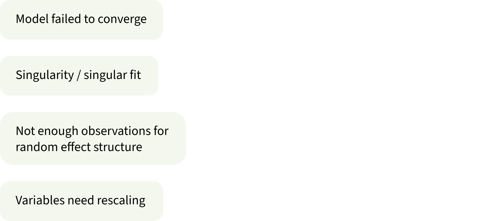
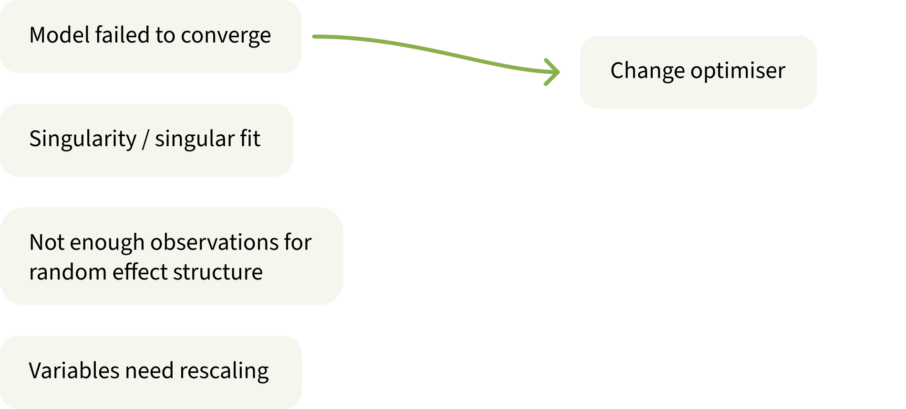
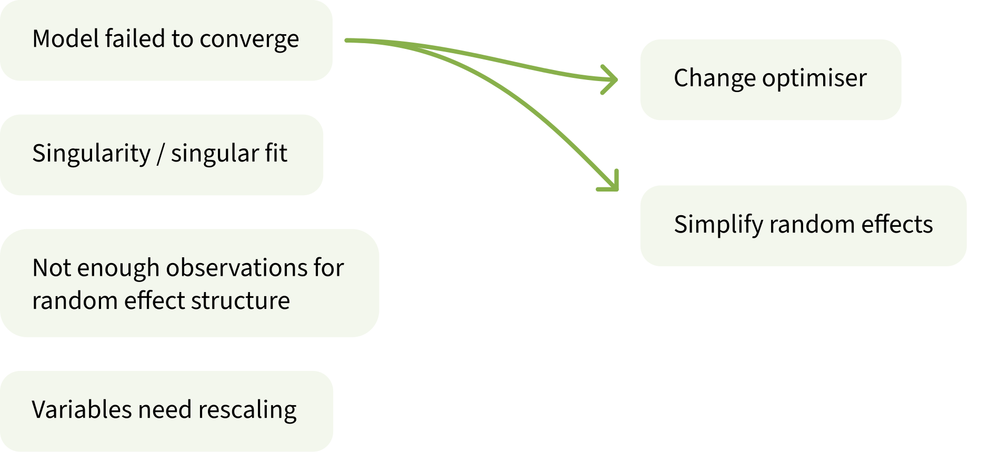
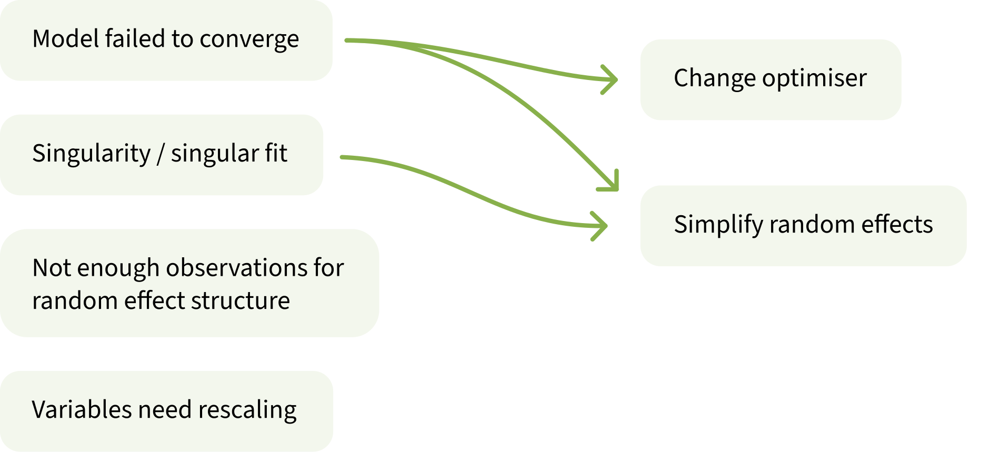
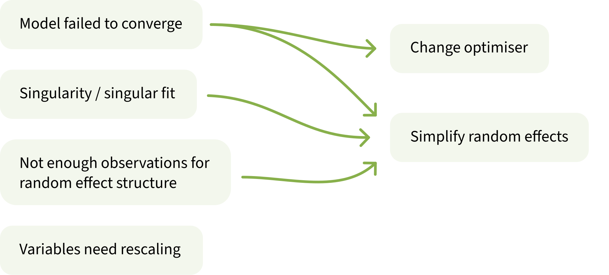
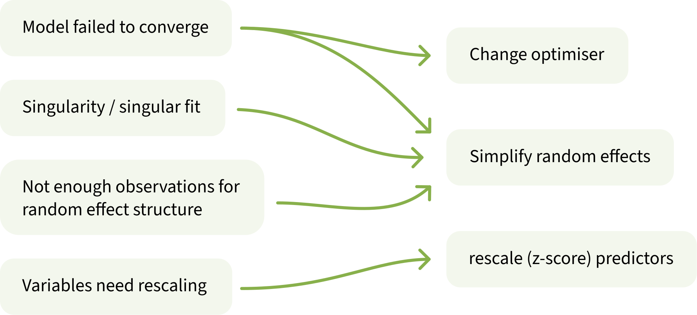
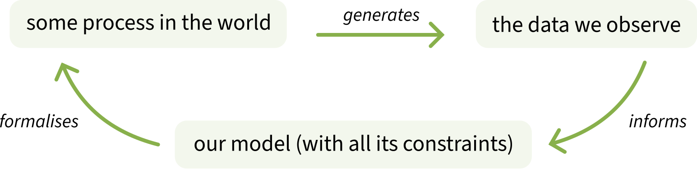

```{r setup, include=F}
library(tidyverse)
library(patchwork)

library(lme4)
library(lmerTest)
library(HLMdiag)

library(latex2exp)  # for betas in ggplots
source('_theme/theme_quarto.R')

theme_set(theme_quarto(title_font_size=42))
theme_update(
  text = element_text(family = 'Source Sans 3')
)

dapr3green <- "#88B04B" 
dapr3dkgreen <- "#5C7C28"
dapr3ltgreen <- "#E5EED7"
pal <- c( "#d35269", "#5c9ead","#2a3c24", "#F5C396", "#8B2635",  "#235789")
```


# Course Overview {background-color="white"}

<br>

```{r echo=F}
#| results: "asis"
block1_name = "Linear mixed models<br>(with Dr. Elizabeth Pankratz)"
block1_lecs = c("Regression refresher, intro to group-structured data",
                "Modelling group-structured data using random effects",
                "Interpreting LMMs and building maximal models",
                "Troubleshooting model fit, checking assumptions + diagnostics",
                "LMMs: Practice analysis")
block2_name = "factor analysis<br>working with multi-item measures<br>(with Dr. Josiah King)"
block2_lecs = c(
  "measurement and dimensionality",
  "exploring underlying constructs (EFA)",
  "testing theoretical models (CFA)",
  "reliability and validity",
  "recap & exam prep"
  )

source("https://raw.githubusercontent.com/uoepsy/junk/refs/heads/main/R/course_table.R")
course_table(block1_name,block2_name,block1_lecs,block2_lecs,week=4)
```


## Retrieval practice: What is a maximal model?

<br>

Challenge: try to respond without looking at your notes! 

<br>

:::hcenter
:::woo
https://app.wooclap.com/events/QYYLBMM/
:::
:::


<!-- The maximal model is the version of the linear mixed model that contains all possible random effects that the data can support. -->
<!-- That is, all possible group-level adjustments to the fixed intercept and fixed slope(s). -->

<!-- A maximal model does not need to contain every possible fixed effect. -->
<!-- (Fixefs should be based on RQ.) -->
<!-- Just every possible ranef. -->

<!-- In theory: Important as a starting point bc maximal models capture all sources of random variability that we think could play a role in our data. -->

<!-- But in practice: often run into issues trying to actually fit them. -->


## This week's learning objectives

:::dapr3callout
What are four common issues that you might encounter when trying to fit LMMs, and how can you solve each one?

<!-- - Model failed to converge $\rightarrow$ change optimiser, simplify random effects -->
<!-- - Singularity / singular fit $\rightarrow$ simplify random effects -->
<!-- - Not enough observations for random effect structure $\rightarrow$ simplify random effects -->
<!-- - Variables need rescaling $\rightarrow$ rescale (z-score) predictors -->
:::


:::dapr3callout
What five assumptions does an LMM make?

<!-- - L = Linearity of association -->
<!-- - I = Independence of errors -->
<!-- - N = Normality of errors -->
<!-- - E = Equal variance of errors -->
<!-- - N = Normality of random effects -->
:::


:::dapr3callout
How do you check each assumption in an LMM?

<!-- - Linearity of association $\rightarrow$ residuals-vs-fitted plot, look for flat line -->
<!-- - Independence of errors $\rightarrow$ start with maximal model and simplify as necessary -->
<!-- - Normality of errors $\rightarrow$ Q-Q plot of model residuals -->
<!-- - Equal variance of errors $\rightarrow$ residuals-vs-fitted plot, look for uniform cloud -->
<!-- - Normality of random effects $\rightarrow$ Q-Q plot of each set of by-group adjustments -->

:::

:::dapr3callout
How can you detect influential observations or influential groups in an LMM?

<!-- - Compute the Cook's Distance of each observation and each group -->
<!-- - Run a sensitivity analysis to see any observations or groups with big Cook's Distances actually impact the conclusions you'd draw -->
:::


# Common issues when fitting LMMs

## Common issues when fitting LMMs

<br>

{fig-align="center"}


## Model failed to converge

**How you can tell:**

:::{.red style="font-size:150%"}
```
warning(s): Model failed to converge with max|grad| = 0.0071877 (tol = 0.002, component 1)
```
:::

:::{.red style="font-size:150%"}
```
Warning: Model failed to converge with 1 negative eigenvalue: -1.3e+02
```
:::

<br>

**What's the problem?**

- LMMs estimate parameters using a process called "maximum likelihood estimation" (MLE).
- The model's goal is to come up with the parameters that are *maximally likely* to have generated our data.
- To find the most likely parameters, the model starts with random values that probably don't match our data very well.
Then the model adjusts those values until they *do* match the data.
- When the model successfully estimates those numbers, we say the model has "converged".
- But when this process runs into problems or gets stuck, we say the model has "not converged" or "failed to converge".

<br>

:::hcenter
**Never trust any numbers from a model that has failed to converge.**
:::


## Singularity / singular fit

**How you can tell:**

:::{.red style="font-size:150%"}
```
boundary (singular) fit: see ?isSingular
```
:::

or the correlations between random effects are –1 or 1, or the SD/variance of random effects are 0.

(We always have to check on those things manually, we don't get any warnings about them ☹️)

<br>

**What's the problem?**

- The random effect structure that we've tried to fit is too complex (i.e., too many group-level parameters).
- When there are too many parameters, the model encounters technical/mathematical problems that make estimation impossible.

<br>

:::hcenter
**Never trust any numbers from a model with a singular fit.**
:::


## Not enough observations for random effect structure

**How you can tell:**

:::{.red style="font-size:150%"}
```
Error: number of observations (=150) <= number of random effects (=150) for term (1 + x | g); the random-effects parameters and the residual variance (or scale parameter) are probably unidentifiable
```
:::

<br>

**What's the problem?**

- Again, the random effect structure is too complex for the data to support.
- This warning is common when each level of a grouping variable has exactly one observation per level of a predictor.
  - Strictly speaking, random slopes should be possible, because the predictor does vary within each level of the grouping variable.
  - But practically speaking, the model needs more data to estimate the random slopes.
  
<br>

:::hcenter
**Never trust any numbers from a model with unidentifiable parameters.**
:::


## Variables need rescaling

**How you can tell:**

:::{.red style="font-size:150%"}
```
Warning messages:
1: Some predictor variables are on very different scales:
consider rescaling
```
:::


:::{.red style="font-size:150%"}
```
Warning messages:
1: In checkConv(attr(opt, “derivs”), opt$par, ctrl = control$checkConv, :
Model is nearly unidentifiable: large eigenvalue ratio
- Rescale variables?
```
:::

<br>

**What's the problem?**

- Continuous predictors can measure the same thing on different scales: e.g., my height is 1.78 metres and also 1,780,000 micrometres.
- Numbers on some scales are hard for the model to deal with, because they result in variance values too close to zero, which the model does not like.

<br>

:::hcenter
**Never trust any numbers from a model with unidentifiable parameters.**
:::


# What to do about each issue

## What to do about each issue

<br>

{fig-align="center"}

## What to do about each issue {visibility="uncounted"}

<br>

{fig-align="center"}


## Change optimiser

LMMs arrive at their parameter values by initialising them to random values, and then adjusting them until they are the parameters that are **maximally likely** to have produced the data we observe.

There are several different ways a model might adjust (or *optimise*) these parameters.

If the default way is not working, then it might help to use a different optimiser.

<br>

One optimiser that generally works well is `bobyqa` (pronounced like "bo-BEE-ka"):

```{r eval=F}
lmer(
  y ~ 1 + x * z + (1 + x * z | g), 
  data = df, 
  control = lmerControl(optimizer = "bobyqa")  # add in this line
)
```


## What to do about each issue

<br>

{fig-align="center"}

## What to do about each issue {visibility="uncounted"}

<br>

{fig-align="center"}

## Simplify random effect structure

Imagine you're starting with the following maximal model:

:::hcenter
` y ~ x * z + (1 + x * z | g) `
:::

We simplify the model bit by bit, and try to fit it again after every simplification step.
We stop once the model can successfully be fit without any further singularity.

There is no single correct way to simplify a model's random effect structure.

This order of steps is what usually works well for me.

<br>

| Simplification to make | Model formula |
| ---------------------------------------------------------- | -------------------------------- |
| *[maximal model]* | `y ~ x * z + (1 + x * z | g)` |
| Remove the by-group adjustment to the interaction term. | `y ~ x * z + (1 + x + z | g)` |
| If predictors `x` and `z` are continuous, remove the correlations between by-group adjustments (if predictors are categorical, other weird stuff happens and this step doesn't really simplify the model). | `y ~ x * z + (1 + x + z || g)` |
| Remove one of the by-group slope adjustments (if one is just a covariate, remove that one first). | `y ~ x * z + (1 + x | g)` |
| If `x` is continuous, remove the correlations between by-group adjustments. | `y ~ x * z + (1 + x || g)` |
| Remove the slope adjustments. | `y ~ x * z + (1 | g)` |
| | |


## What to do about each issue

<br>

{fig-align="center"}


## What to do about each issue {visibility="uncounted"}

<br>

{fig-align="center"}


## What to do about each issue {visibility="uncounted"}

<br>

{fig-align="center"}

## What to do about each issue {visibility="uncounted"}

<br>

{fig-align="center"}

## Rescale (z-score) predictors

There are lots of ways to rescale a predictor on a case-by-case basis (e.g., you could divide micrometres by one million to get metres).
But the transformation that will pretty much always work is the z-score.

<br>

**Recall that when you z-score a variable:**

- its mean becomes 0 (no matter what the variable's mean originally was)
- its SD becomes 1   (no matter what the variable's SD originally was)
- its units are SDs  (no matter what the variable's units originally were)

<br>


```{r eval=F}
df <- df |>
  mutate(
    predictor_z = (predictor - mean(predictor)) / sd(predictor)
  )
```

<br>

Then use the `predictor_z` version in your model instead of the original `predictor`.


# This week's data (again): <br> Test-enhanced learning

## This week's data (again): Test-enhanced learning

**RQ: Does self-testing improve retention, such that the `StudyStudy` group may perform better on the immediate test, but the `StudyTest` group will perform better on the test one week later?**


```{r include=F}
load(url("https://uoepsy.github.io/data/testenhancedlearning.RData"))

ppts_to_keep <- c(
  paste0('StudyStudy_', LETTERS[1:10]),
  paste0('StudyTest_', LETTERS[1:10])
)

set.seed(1)
tel_data <- tel |>
  filter(
    Test_word != 'Eskimo',
    Subject_ID %in% ppts_to_keep
  ) |>
  rowwise() |>
  mutate(
    TestScore = rnorm(n=1, mean = Correct, sd = 0.5),
  ) |>
  ungroup() |>
  mutate(
    TestScore = case_when(
      Group == 'StudyStudy' & Delay == 'min'  ~ TestScore + 0.2,
      Group == 'StudyStudy' & Delay == 'week' ~ TestScore - 0.5,
      Group == 'StudyTest'  & Delay == 'min'  ~ TestScore + 0.2,
      Group == 'StudyTest'  & Delay == 'week' ~ TestScore,
    ),
    TestScore = as.numeric(round(datawizard::rescale(TestScore, to = c(0, 100))))
  ) |>
  select(-Correct, -Rtime)
 
rm(tel)
```


```{r}
#| code-fold: true

tel_data |>
  ggplot(aes(x = Delay, y = TestScore, colour = Delay, fill = Delay)) +
  geom_violin(alpha = 0.5) +
  geom_jitter(alpha = 0.15, size = 3) +
  facet_wrap(~ Group) +
  stat_summary(geom = 'point', fun = mean, colour = 'black', size = 5) +
  theme(
    legend.position = 'none',
    strip.background = element_blank(),
    strip.text.x = element_text(size = 24)
  ) +
  scale_colour_manual(values = pal) +
  scale_fill_manual(values = pal) +
  NULL
```


## The data and the maximal model

```{r}
tel_data |> head()
```

<br>
<br>

**The maximal model we worked out last week:**

:::hcenter
`TestScore ~ Delay * Group +  (1 + Delay | Subject_ID) + (1 + Delay * Group | Test_word)`
:::

<!-- - We're predicting people's test score as a function of how delayed the test was (one minute (reference level) or one week later), their study group (StudyStudy (reference level) or StudyTest), and the interaction between these two predictors. -->
<!-- - The maximal model includes by-subject random intercepts and random slopes over test delay. -->
<!-- - The maximal model also includes by-word random intercepts and radom slopes over test delay, study group, and their interaction. -->


# Try to fit the maximal model

## Try to fit the maximal model

```{r eval=F}
library(lme4)      # for fitting LMMs
library(lmerTest)  # for getting p-values

m1 <- lmer(
  TestScore ~ Delay * Group + 
    (1 + Delay | Subject_ID) + 
    (1 + Delay * Group | Test_word),
  data = tel_data
)
```

:::{.red style="font-size:175%"}
```
boundary (singular) fit: see help('isSingular')
Warning: Model failed to converge with 1 negative eigenvalue: -1.3e+02
```
:::

{fig-align="center" width="60%"}


## Will changing the optimiser help?

```{r eval=F}
m2 <- lmer(
  TestScore ~ Delay * Group + 
    (1 + Delay | Subject_ID) + 
    (1 + Delay * Group | Test_word),
  data = tel_data,
  control = lmerControl(optimizer = "bobyqa")  # add in this line
)
```

:::{.red style="font-size:175%"}
```
boundary (singular) fit: see help('isSingular')
```
:::

Nope, we still have a singular fit warning.
The random effect structure is too complex for the data.

<br>

{fig-align="center"}


## Simplifying random effects (1)

| Simplification to make | Model formula |
| ---------------------------------------------------------- | -------------------------------- |
| *[maximal model]* | `y ~ x * z + (1 + x * z | g)` |
| **Remove the by-group adjustment to the interaction term.** | `y ~ x * z + (1 + x + z | g)` |
| If predictors `x` and `z` are continuous, remove the correlations between by-group adjustments (if predictors are categorical, other weird stuff happens and this step doesn't really simplify the model). | `y ~ x * z + (1 + x + z || g)` |
| Remove one of the by-group slope adjustments (if one is just a covariate, remove that one first). | `y ~ x * z + (1 + x | g)` |
| If `x` is continuous, remove the correlations between by-group adjustments. | `y ~ x * z + (1 + x || g)` |
| Remove the slope adjustments. | `y ~ x * z + (1 | g)` |
| | |

<br>

```{r eval=F}
m3 <- lmer(
  TestScore ~ Delay * Group + 
    (1 + Delay | Subject_ID) + 
    (1 + Delay + Group | Test_word),  # before: (1 + Delay * Group | Test_word)
  data = tel_data
)
```

:::{.red style="font-size:175%" .fragment}
```
boundary (singular) fit: see help('isSingular')
```
:::


## Simplifying random effects (2)

| Simplification to make | Model formula |
| ---------------------------------------------------------- | -------------------------------- |
| *[maximal model]* | `y ~ x * z + (1 + x * z | g)` |
| Remove the by-group adjustment to the interaction term. | `y ~ x * z + (1 + x + z | g)` |
| If predictors `x` and `z` are continuous, remove the correlations between by-group adjustments (if predictors are categorical, other weird stuff happens and this step doesn't really simplify the model). | `y ~ x * z + (1 + x + z || g)` |
| **Remove one of the by-group slope adjustments (if one is just a covariate, remove that one first).** | `y ~ x * z + (1 + x | g)` |
| If `x` is continuous, remove the correlations between by-group adjustments. | `y ~ x * z + (1 + x || g)` |
| Remove the slope adjustments. | `y ~ x * z + (1 | g)` |
| | |

<br>

```{r eval=F}
m4 <- lmer(
  TestScore ~ Delay * Group + 
    (1 + Delay | Subject_ID) + 
    (1 + Delay | Test_word),  # before: (1 + Delay + Group | Test_word)
  data = tel_data
)
```

:::{.red style="font-size:175%" .fragment}
```
boundary (singular) fit: see help('isSingular')
```
:::


## Simplifying random effects (3)

| Simplification to make | Model formula |
| ---------------------------------------------------------- | -------------------------------- |
| *[maximal model]* | `y ~ x * z + (1 + x * z | g)` |
| Remove the by-group adjustment to the interaction term. | `y ~ x * z + (1 + x + z | g)` |
| If predictors `x` and `z` are continuous, remove the correlations between by-group adjustments (if predictors are categorical, other weird stuff happens and this step doesn't really simplify the model). | `y ~ x * z + (1 + x + z || g)` |
| Remove one of the by-group slope adjustments (if one is just a covariate, remove that one first). | `y ~ x * z + (1 + x | g)` |
| If `x` is continuous, remove the correlations between by-group adjustments. | `y ~ x * z + (1 + x || g)` |
| **Remove the slope adjustments.** | `y ~ x * z + (1 | g)` |
| | |

<br>

```{r eval=F}
m5 <- lmer(
  TestScore ~ Delay * Group + 
    (1 | Subject_ID) +
    (1 + Delay | Test_word),
  data = tel_data
)
```

:::{.red style="font-size:175%" .fragment}
```
boundary (singular) fit: see help('isSingular')
```
:::


## Simplifying random effects (4)

| Simplification to make | Model formula |
| ---------------------------------------------------------- | -------------------------------- |
| *[maximal model]* | `y ~ x * z + (1 + x * z | g)` |
| Remove the by-group adjustment to the interaction term. | `y ~ x * z + (1 + x + z | g)` |
| If predictors `x` and `z` are continuous, remove the correlations between by-group adjustments (if predictors are categorical, other weird stuff happens and this step doesn't really simplify the model). | `y ~ x * z + (1 + x + z || g)` |
| Remove one of the by-group slope adjustments (if one is just a covariate, remove that one first). | `y ~ x * z + (1 + x | g)` |
| If `x` is continuous, remove the correlations between by-group adjustments. | `y ~ x * z + (1 + x || g)` |
| **Remove the slope adjustments.** | `y ~ x * z + (1 | g)` |
| | |

<br>

```{r}
m6 <- lmer(
  TestScore ~ Delay * Group + 
    (1 + Delay | Subject_ID) +
    (1 | Test_word),
  data = tel_data
)
```

No warnings! But we still have to check for the sneakier singularities: 

- correlations of –1 or 1, and
- group-level variance or SD of 0.


## Check variance components for sneakier singularities

We can extract only the variance components in the model summary using `VarCorr()`:

```{r}
VarCorr(m6)
```

<br>

Good! The correlation is not extreme, and the SDs are all different from 0!

Now we can trust the model: the model's estimates will actually mean what we think they mean, and we can interpret it as usual.

**`m6` is the model that we would use to make inferences and respond to the RQ.**


## Reporting the process of model simplification

Tell the reader: what random effect structure would the maximal model have? (No need to explain how you figured this out.)

> [after describing the outcome and predictors] 
The maximal random effect structure for this model would include by-subject random intercepts and random slopes over test delay, as well as by-word random intercepts and random slopes over test delay, over study group, and over their interaction.


Did the maximal model work? If not, what did you do about it?

> The maximal model resulted in non-convergence and a singular fit, which was not remedied by changing optimisers, so we simplified the random effect structure until model fit was achieved.

When simplifying this model, what order did you remove parameters in?

> First we simplified the by-word random effects. 
We removed the random slope over the interaction between test delay and experimental group, then the random slope over experimental group, but both times the model still had a singular fit.
Then we tried to also remove the by-subject random slope over test delay.
The model's fit was still singular.
So we replaced the by-subject random slope over delay, and instead removed the by-item random slope over delay.
After that change, the model no longer had a singular fit.

What's the random effect structure of the final simplified model?

> The final simplified model contains by-subject random intercepts and random slopes over test delay, and by-word random intercepts only.


# Check LMM assumptions

## Why do models make assumptions?

<br>

{height=250 fig-align="center"}


<br>

**An example of a model's constraint:**

- Linear models can only model associations between predictors and outcomes as straight lines.
- We cannot change that the model uses straight lines only.
- So if we use linear models, we have to **assume** that a straight line is a reasonable way of representing the actual data generating process in the world.

<br>

**A model's unchangeable constraints = the assumptions that we must be satisfied with in order to use and interpret the model.**

<!-- <br> -->

<!-- Fact 1: When we use and interpret any statistical model, we are claiming **"This model captures the key parts of the process that happened in the world to generate my data."** -->

<!-- <br> -->

<!-- Fact 2: **Linear models are constrained in specific ways.**  -->


<!-- <br> -->


<!-- Assumptions are not like significance tests: it’s not the case that the assumption is either “accepted” or “rejected”. The decision process is blurrier than that. When evaluating a model’s assumptions, we are asking ourselves: Are we satisfied that the unchangeable aspects of the model are reasonable enough simplifications, so that the model will still give us reasonable parameter estimates? -->


## LMM assumptions: LINE + N = LINEN

<br>

The assumptions made by standard (non-logistic) linear models:

- **L = Linearity of association**
- **I = Independence of errors**
- **N = Normality of errors**
- **E = Equal variance of errors**

<br>

An additional assumption when we include random effects:

- **N = Normality of random effects**


## L = Linearity of association

- A linear model can only model associations between predictor and outcome in terms of a straight line.
- To be satisfied with a linear model of our data, we have to assume that the best possible straight line is a good enough representation of how variables are associated.
- Note: If we only have categorical predictors, then this assumption is automatically met.

**For LMMs, check with a fitted-vs-residuals plot:**

```{r}
plot(m6, type=c(
       "p",      # includes points representing Pearson residuals
       "smooth"  # includes smoothed line representing mean of residuals
))
```

We want the blue wobbly line to closely match the black horizontal line.
**This one does, so I would be satisfied that the association appears linear enough.**


## I = Independence of errors

- A linear model can only model errors as residuals that are independent from one another. 
- To be satisfied with a linear model of our data, we have to assume that independent residuals are a good representation of the data.

<br>

- In between-subjects data, we assume errors to be independent because we only have one observation per subject.

- In repeated-measures data and/or when we have grouping variables which contribute random variability to the data, errors are not independent unless we model the grouping structure using random effects.

<br>

**If we start with a maximal model (and simplify it as necessary to achieve convergence/fit), then we can be satisfied that errors are sufficiently independent.**


## N = Normality of errors

- A linear model can only model errors as residuals that are normally distributed.
- To be satisfied with a linear model of our data, we have to assume that normally-distributed residuals are a good representation of the data.

**Check with a quantile–quantile (or "Q-Q") plot:**

```{r}
qqnorm(resid(m6)); qqline(resid(m6))
```

We want the points to closely match the black diagonal line.
**These points match pretty well, so I'd be satisfied that the errors are sufficiently normally distributed.**


## E = Equal variance of errors <br> (aka "homoscedasticity")

- A linear model can only model errors as residuals that have equal variance across the whole range of fitted values.
- To be satisfied with a linear model of our data, we have to assume that residuals with equal variance are a good representation of the data.

**Check the residuals-vs-fitted plot again:**

```{r}
#| code-fold: true

plot(m6, type=c(
       "p",      # includes points representing Pearson residuals
       "smooth"  # includes smoothed line representing mean of residuals
))
```

We want the vertical spread of residuals to be approximately the same across the whole x axis.
**The vertical spread here looks pretty good (certainly no problematic fan/funnel type shapes), so I'm satisfied that variance of residuals is equal enough.**


## The new one! N = Normality of random effects

- A linear mixed model can only model random effects (that is, the group-level adjustments to the fixed effects) as being normally distributed with a mean of zero.
- To be satisfied with a linear model of our data, we have to assume that normally-distributed random effects are a good representation of the data.

<br>

As a reminder, here's our model formula: 

`TestScore ~ Delay * Group +  (1 + Delay | Subject_ID) + (1 | Test_word)`

<br>

**We can use Q-Q plots to check the normality of each set of group-level adjustments:**

1. By-subject random intercepts
1. By-subject random slopes over `Delay`
1. By-word random intercepts


## N = Normality of random effects 1: <br> By-subject random intercepts
 
:::: {.columns}
::: {.column width="45%"}
```{r}
ranef(m6)$Subject_ID |> head(16)
```


:::
::: {.column width="55%"}

```{r eval = F}
# one way:
qqnorm(ranef(m6)$Subject_ID$`(Intercept)`); qqline(ranef(m6)$Subject_ID$`(Intercept)`)

# another equivalent way:
qqnorm(ranef(m6)$Subject_ID[,1]); qqline(ranef(m6)$Subject_ID[,1])
```

```{r fig.height = 5, fig.width = 5, echo=F}
qqnorm(ranef(m6)$Subject_ID[,1]); qqline(ranef(m6)$Subject_ID[,1])
```

:::
::::

Some divergence at the upper and lower edges.
**You might report that the by-subject random intercepts diverge a bit from normality at the extremes, so their estimated SD (which assumes a normal distribution) could be a little biased.**


## N = Normality of random effects 2: <br> By-subject random slopes over `Delay`
 
:::: {.columns}
::: {.column width="45%"}
```{r}
ranef(m6)$Subject_ID |> head(16)
```


:::
::: {.column width="55%"}

```{r eval = F}
# one way:
qqnorm(ranef(m6)$Subject_ID$Delayweek); qqline(ranef(m6)$Subject_ID$Delayweek)

# another equivalent way:
qqnorm(ranef(m6)$Subject_ID[,2]); qqline(ranef(m6)$Subject_ID[,2])
```

```{r fig.height = 5, fig.width = 5, echo=F}
qqnorm(ranef(m6)$Subject_ID[,2]); qqline(ranef(m6)$Subject_ID[,2])
```

:::
::::

Not too bad here, still a little off.
**So I might also report that the extreme by-subject slope adjustments also diverge slightly from normality.**


## N = Normality of random effects 3: <br> By-word random intercepts
 
:::: {.columns}
::: {.column width="45%"}
```{r}
ranef(m6)$Test_word |> head(16)
```


:::
::: {.column width="55%"}

```{r eval = F}
# one way:
qqnorm(ranef(m6)$Test_word$`(Intercept)`); qqline(ranef(m6)$Test_word$`(Intercept)`)

# another equivalent way:
qqnorm(ranef(m6)$Test_word[,1]); qqline(ranef(m6)$Test_word[,1])
```

```{r fig.height = 5, fig.width = 5, echo=F}
qqnorm(ranef(m6)$Test_word[,1]); qqline(ranef(m6)$Test_word[,1])
```

:::
::::

The extremes here also diverge from the ideal diagonal.
**Again, not a big deal—just mention it when reporting/interpreting the by-word intercept adjustments.**


# Diagnostics for high-influence observations and groups

## High influence

A single observation might influence our model's estimates more than it should if 

- it has an unusual value for the outcome variable (i.e., if it's an outlier),
- it has an unusual value for the predictor variable (i.e., if it has high leverage),
- or both.


::::{.columns}
:::{.column width="33%"}
**Outlier:**


:::
:::{.column width="33%"}
**High leverage:**


:::
:::{.column width="33%"}
**Outlier with high leverage:**


:::
::::

<br>

With LMMs, we will **additionally check whether any specific *levels* of our grouping variable(s)** are influencing the model's estimates.

<br>

The R package we'll use for this is called `HLMdiag`:

```{r}
library(HLMdiag)    # Hierarchical Linear Model DIAGnostics
```


## Check influence of individual observations

```{r eval=F}
inf_obs <- hlm_influence(
  model = m6,       # name the LMM we want to check
  level = 1,        # look at the influence of each observation = level 1
  approx = TRUE     # just approximate the measures, don't actually re-fit models
)

inf_obs
```

```{r echo=F}
load("data/m5_inf_obs.rda")
inf_obs
```


<br>

We'll just pay attention to the `cooksd` column, which tells us the Cook's Distance of each observation.

**Cook's Distance is a measure of how much model estimates change when we remove this specific observation and fit the model again.
Bigger numbers mean higher influence.**

## Plot influence of individual observations

```{r}
dotplot_diag(             # this plotting function comes with HLMdiag
  inf_obs$cooksd,         # we want to plot the Cook's Distance column
  cutoff = "internal"     # show arbitrary threshold at the third quartile + 3*IQR
)
```

<br>

No massively outlying points here, so I wouldn't worry about checking any of these individual observations.


## Check influence of groups: `Subject_ID`


```{r eval=F}
inf_subj <- hlm_influence(
  model = m6,
  level = "Subject_ID",   # now look at the influence of each subject
  approx = TRUE
)

inf_subj
```

```{r echo=F}
load("data/m5_inf_subj.rda")
inf_subj |> print(n = 10)
```

## Plot influence of individual subjecs

```{r}
dotplot_diag(
  inf_subj$cooksd,
  cutoff = "internal"     # show arbitrary threshold at the third quartile + 3*IQR
)
```

<br>

No points at all beyond the threshold!
All good, nothing to check.


## Check influence of groups: `Test_word`

```{r eval=F}
inf_word <- hlm_influence(
  model = m6,
  level = "Test_word",   # now look at the influence of each word
  approx = TRUE
)

inf_word
```

```{r echo=F}
load("data/m5_inf_word.rda")
inf_word
```


## Plot influence of individual words

```{r}
dotplot_diag(
  inf_word$cooksd,
  index = inf_word$Test_word,   # label dots with Test_word value, not numbers
  cutoff = "internal"     # show arbitrary threshold at the third quartile + 3*IQR
)
```

<br>

Because "saddle" and "nose" are beyond the threshold and have higher Cook's Distances compared to the other data points, let's double-check whether those items might be influencing our model's results.

To do that, we run a **sensitivity analysis**.


# Sensitivity analysis

## Sensitivity analysis

The key idea: 

- Remove each of the potentially-influential observations/levels, fit the same LMM again to that reduced dataset, and see if our conclusions change.
- Even if an observation has a big Cook's Distance, it might not be very impactful unless it actually changes the conclusions we'd draw from the model.


**Code template for re-fitting the model with a specific observation removed (say, number 100):**

```{r eval=F}
lmer(
  # same model formula as m6 (simplified model)
  TestScore ~ Delay * Group + (1 + Delay | Subject_ID) + (1 | Test_word),
  
  data = tel_data[-100,]    # remove row 100 from tel_data
)
```


<br>

**Code template for re-fitting the model with a specific level of a grouping variable removed (say, "saddle"):**

```{r eval=F}
lmer(
  # same model formula as m6 (simplified model)
  TestScore ~ Delay * Group + (1 + Delay | Subject_ID) + (1 | Test_word),
  
  data = filter(            # using tidyverse's filter() function
    tel_data,               # name the original df
    Test_word != "saddle"   # keep all rows where Test_word isn't "saddle"
  )
)
```


## Sensitivity analysis for "saddle"

```{r}
m6_saddleless <- lmer(
  TestScore ~ Delay * Group + (1 + Delay | Subject_ID) + (1 | Test_word),
  data = filter(tel_data, Test_word != "saddle")
)
```

<br>

**The original model's fixed effects:**

```{r echo=F}
cat('', paste0(capture.output(

summary(m6)
  
), '\n')[21:25])
```

<br>

**The "saddle"-less model's fixed effects:**

```{r echo=F}
cat('', paste0(capture.output(

summary(m6_saddleless)
  
), '\n')[21:25])
```

<br>

**No change to the significance of the fixed effects, so our conclusions from this model are not driven by the word "saddle".**


## Sensitivity analysis for "nose"

```{r}
m6_noseless <- lmer(
  TestScore ~ Delay * Group + (1 + Delay | Subject_ID) + (1 | Test_word),
  data = filter(tel_data, Test_word != "nose")
)
```

<br>

**The original model's fixed effects:**

```{r echo=F}
cat(paste0(capture.output(

summary(m6)
  
), '\n')[21:25])
```

<br>

**The "nose"-less model's fixed effects:**

```{r echo=F}
cat(paste0(capture.output(

summary(m6_noseless)
  
), '\n')[21:25])
```

<br>

**No change to the significance of the fixed effects, so our conclusions from this model are also not driven by the word "nose".**


## Reporting sensitivity analyses

Tell the reader: Which observation(s) or level(s) of the grouping variable did you leave out?

> Two test words had higher Cook's Distance values than the others: "saddle" and "nose".
We ran two sensitivity analyses, one to check for the influence of each of these words on the model's estimates.
Specifically, we re-fit the model once to all data except the word "saddle", and again to all data except the word "nose".

Did the overall pattern of results change?

> The pattern of results did not change after leaving out each of these words.

What should the reader take away from this analysis?

> Therefore the higher-influence words "saddle" and "nose" do not affect the conclusions we would draw from the model.

It's often nice to include the sensitivity analysis model summary/summaries in the appendix.

> See Appendix X for all sensitivity analysis model summaries.


# Back matter

## Learning objectives revisited (1)

:::dapr3callout
**What are four common issues that you might encounter when trying to fit LMMs, and how can you solve each one?**

- Model failed to converge $\rightarrow$ change optimiser, simplify random effects
- Singularity / singular fit $\rightarrow$ simplify random effects
- Not enough observations for random effect structure $\rightarrow$ simplify random effects
- Variables need rescaling $\rightarrow$ rescale (z-score) predictors
:::


:::dapr3callout
**What five assumptions does an LMM make?**

- L = Linearity of association
- I = Independence of errors
- N = Normality of errors
- E = Equal variance of errors
- N = Normality of random effects
:::


## Learning objectives revisited (2)

:::dapr3callout
**How do you check each assumption in an LMM?**

- Linearity of association $\rightarrow$ residuals-vs-fitted plot, look for flat line
- Independence of errors $\rightarrow$ start with maximal model and simplify as necessary
- Normality of errors $\rightarrow$ Q-Q plot of model residuals
- Equal variance of errors $\rightarrow$ residuals-vs-fitted plot, look for uniform cloud
- Normality of random effects $\rightarrow$ Q-Q plot of each set of by-group adjustments

:::

:::dapr3callout
**How can you detect influential observations or influential groups in an LMM?**

- Compute the Cook's Distance of each observation and each group
- Run a sensitivity analysis to see any observations or groups with big Cook's Distances actually impact the conclusions you'd draw
:::


## To do this week 

<br>

::::{.columns}
:::{.column width="50%"}
**Tasks:**

<br>

{width=80px style="margin:10px;margin-bottom:-50px"} Work on exercises in labs

<br>

{width=80px style="margin:10px;margin-bottom:-45px"} Complete the weekly quiz 


:::

:::{.column width="50%"}
**Get support:**

<br>

{width=80px style="margin:10px;margin-bottom:-30px"}
Consult the [flash cards](https://uoepsy.github.io/dapr3/2627/flashcards/){target="_blank"}

<br>

{width=80px style="margin:10px;margin-bottom:-50px"}
Ask questions anonymously on Piazza

<br>

{width=80px style="margin:10px;margin-bottom:-40px"} 
We really like seeing you in office hours!


:::
::::


# Appendix {.appendix}


## Why are there two blobs/clusters in the residuals-vs-fitted plot?

:::: {.columns}
::: {.column width="50%"}

```{r fig.width = 6, fig.height = 5}
#| code-fold: true
plot(m6, type=c(
       "p",      # includes points representing Pearson residuals
       "smooth"  # includes smoothed line representing mean of residuals
))
```

:::
::: {.column width="50%"}
```{r fig.width = 6, fig.height = 5}
#| code-fold: true

tel_data |>
  ggplot(aes(x = Delay, y = TestScore, colour = Delay, fill = Delay)) +
  geom_violin(alpha = 0.5) +
  geom_jitter(alpha = 0.1, size = 3) +
  facet_wrap(~ Group) +
  stat_summary(geom = 'point', fun = mean, colour = 'black', size = 5) +
  theme(
    legend.position = 'none',
    strip.background = element_blank(),
    strip.text.x = element_text(size = 24)
  )
```
:::
::::

Because the data itself is kind of clustered around particular `TestScore` values.

- Lots of observations around 40 (where there's one cloud of `fitted(.)` values)
- Lots of observations between 50 and 60 (where there's another cloud of `fitted(.)` values)


