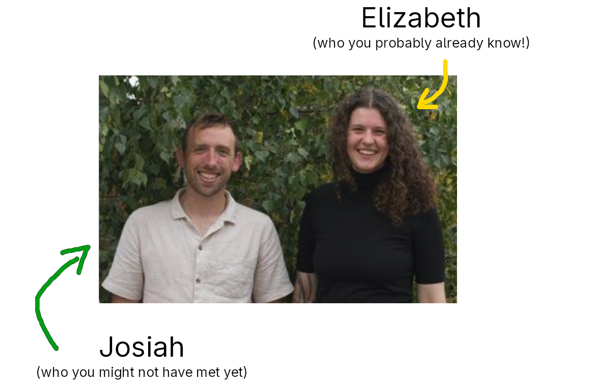

```{r}
#| label: setup
#| include: false

library(tidyverse)
library(patchwork)
source('_theme/theme_quarto.R')
```


# Welcome
(We'll keep this brief!)

## Who we are




## How the course runs {.smaller}

::::{.columns}
:::{.column width="50%"}

- Lectures

<br>

- Labs
  - Work together in small groups or individually - your call!
  - Like dapr2, questions often link to flashcards to help if you get stuck
  - Solutions available at end of the week

<br>
  
- Weekly quizzes to keep you on track


:::
:::{.column width="50%"}

- Discussion forum (look for 'Piazza' on Learn)

<br> 

- Office hours (see Learn for times)


:::
::::

## assessment stuff {.smaller}

::::{.columns}
:::{.column width="33%"}
**Quizzes (10%)**

- released Mondays at 9am 
- covers previous week's content
- due Sundays at 5pm

- best 7 of 9 count

:::
:::{.column width="33%"}
**Report (30%)**

- released Thurs 8th Oct
- due Thurs 29th Oct
- Group project, like dapr2

- we allocate groups (new dept policy)
  - based on responses to form in week 3
- group members will not necessarily be in the same lab sessions
  - don't work on report during labs!

:::
:::{.column width="33%"}
**Exam (60%)**  

- in-person, paper exam
- happens in December exam diet
- similar structure to dapr2 exam (15 mcqs, 8 saqs)
- we all find out the date in early Nov.
- week 11 we'll do exam prep, course Q&A, and lab will be example exam questions. 
  

:::
::::

## What are we covering {.smaller}  


::::{.columns}
:::{.column width="50%"}
#### "mixed effects models"

useful for when you have groups of datapoints

<br><br>

**worth refreshing:** linear models!

:::

:::{.column width="50%"}
#### measurement and dimension reduction 

useful for working with multi-item measurement tools (questionnaires!)

<br><br>

**worth refreshing:** variance, standard deviation, covariance, correlation

:::
::::

<br><br>

::::{.columns}
:::{.column width="50%"}
Elizabeth is your lecturer! 
:::
:::{.column width="50%"}
Josiah is your lecturer! 
:::
::::


## R and RSTUDIO!!!

<br>
__Please install a version of R and RStudio on your own computer, or update any existing installations__

- For update/installation instructions, see [https://edin.ac/3B0oi5A](https://edin.ac/3B0oi5A){target="_blank"}  
    - *please follow these instructions carefully*

<br>

_For those of you who only have chromebooks or iPads, installing R & RStudio is not an option, look for the "access RStudio server" link on Learn_


