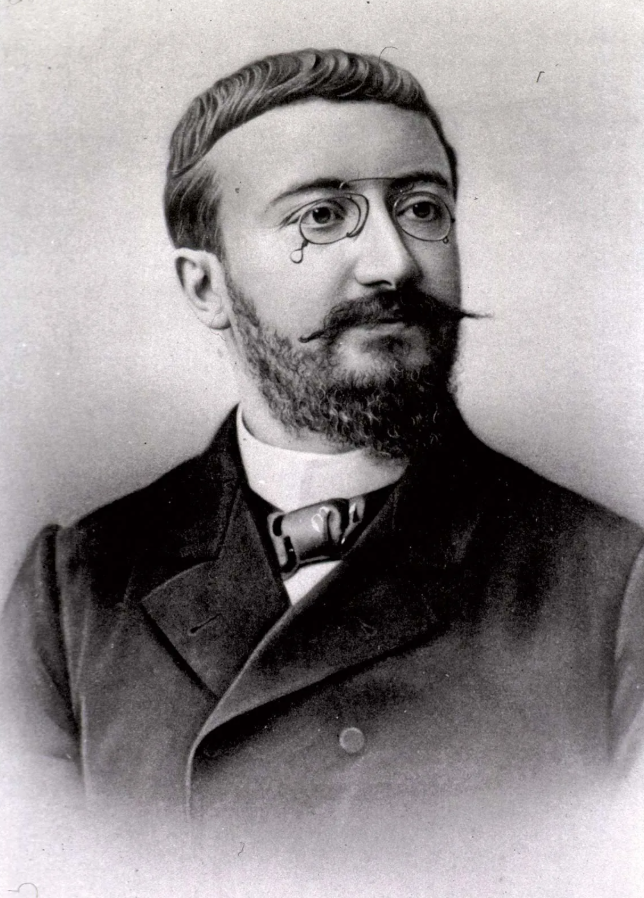
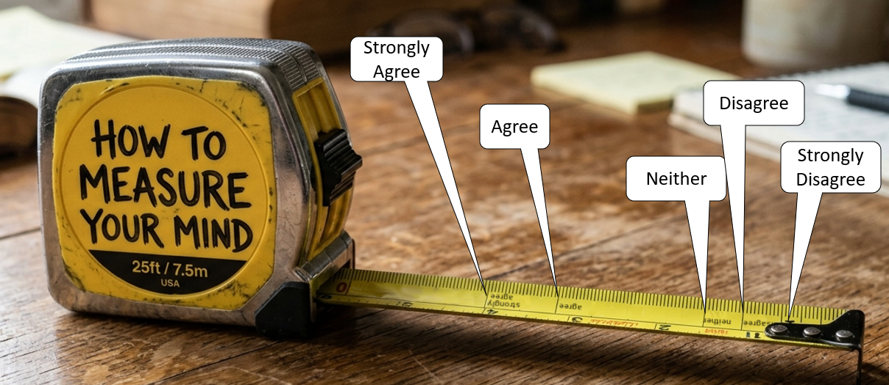
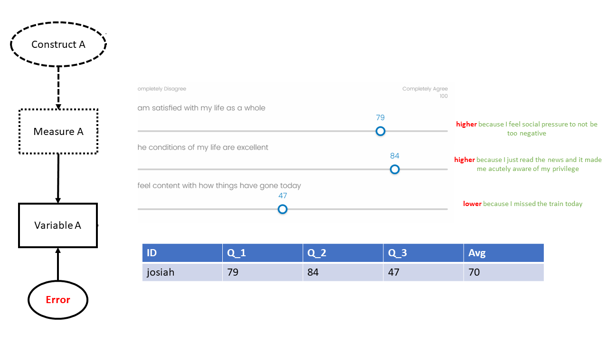
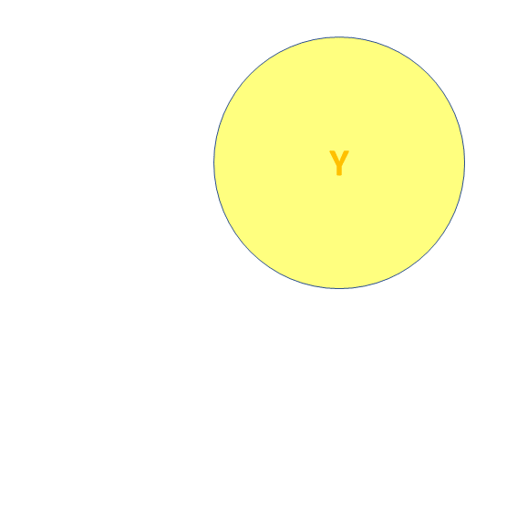
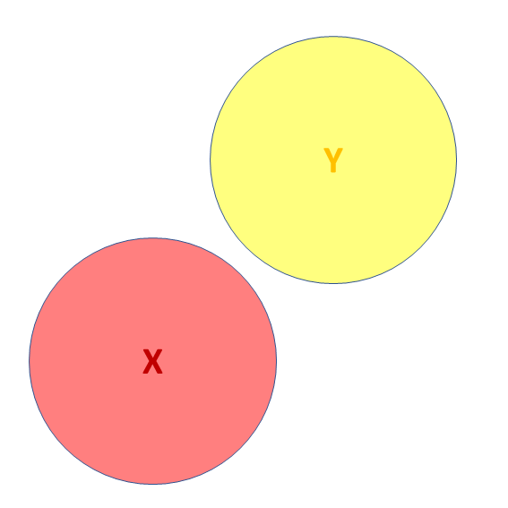
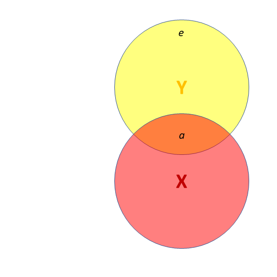
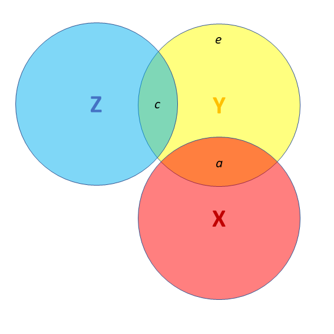
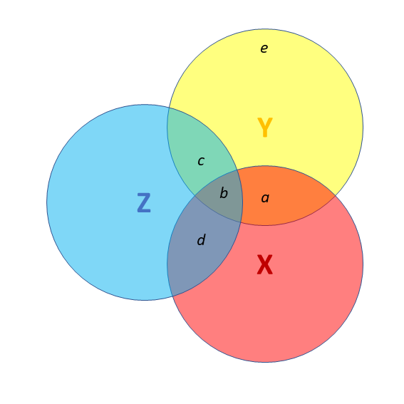
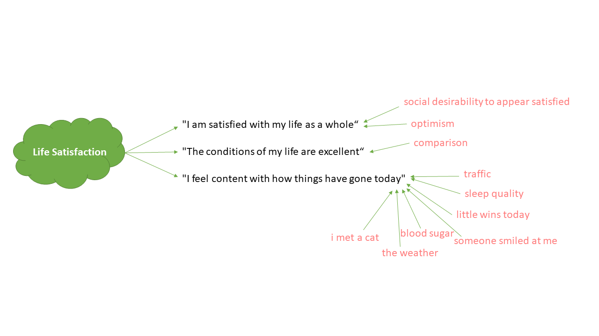
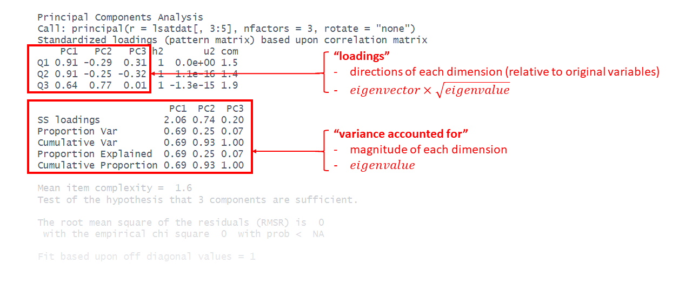

```{r setup, include=F}
library(tidyverse)
library(patchwork)
source('_theme/theme_quarto.R')

theme_set(theme_quarto(title_font_size=42))
theme_update(
  text = element_text(family = 'Source Sans 3')
)

dapr3green <- "#88B04B" 
dapr3dkgreen <- "#5C7C28"
dapr3ltgreen <- "#E5EED7"
pal <- c( "#d35269", "#5c9ead","#2a3c24", "#F5C396", "#8B2635",  "#235789")
```


# Course Overview {background-color="white"}

<br>

```{r echo=F}
#| results: "asis"
block1_name = "Linear Mixed Models<br>(with Elizabeth Pankratz)"
block1_lecs = c("Regression refresher, intro to group-structured data",
                "TODO",
                "TODO",
                "TODO",
                "recap")
block2_name = "Factor Analysis<br>working with multi-item measures<br>(with Josiah King)"
block2_lecs = c(
  "measurement and dimensionality",
  "exploring underlying constructs (EFA)",
  "testing theoretical models (CFA)",
  "reliability and validity",
  "recap & exam prep"
  )

source("https://raw.githubusercontent.com/uoepsy/junk/refs/heads/main/R/course_table.R")
course_table(block1_name,block2_name,block1_lecs,block2_lecs,week=6)
```

# This week

- measurement
- dimensions
- dimension reduction

# Warm up Activity

What is measurement?  

:::woo
woo
:::


# Measurement

## Thorndike's Credo


> "Whatever exists at all exists in some amount. To know it thoroughly involves knowing its quantity as well as its quality."  
(Edward L. Thorndike. 1918)


## What is measurement?

::::{.columns}
:::{.column width="50%"}
> "The process of assigning numbers to represent properties"  
(Campbell, 1920)

:::
:::{.column width="50%"}
> "The assignment of numbers to objects or events according to rules"   
(Stevens, 1947)

:::
::::

:::{.fragment}

- At the foundations of all scientific inquiry

- Too often taken for granted

- Key question: **What do our numbers represent?**

:::
    

## Quantifying the unquantifiable?


::::{.columns}
:::{.column width="50%"}
<iframe width="560" height="315" src="https://www.youtube.com/embed/8x0COtH4Vrw?si=qgwvKTqC30O553u5" title="YouTube video player" frameborder="0" allow="accelerometer; autoplay; clipboard-write; encrypted-media; gyroscope; picture-in-picture; web-share" referrerpolicy="strict-origin-when-cross-origin" allowfullscreen></iframe>
:::
:::{.column width="50%"}

```{r}
#| echo: false
magick::image_read("img_sandbox/si_units2.jpeg")
```


- Many things are experienced qualitatively, as matters of degree, and are not easily amenable to direct quantification

- We should always question whether our numbers truly represent a continuous quantity with homogeneous units

:::
::::

## Measurement in Psychology


- Many psychological phenomena cannot be **observed** directly:
    - thoughts, feelings, behaviours etc.

- Grounded in natural language that we discuss every day
    - "aggression", "intelligence", "anxiety"

- Definitions are often **fuzzy** and **lack consensus**

- **Result:** Confusion and complexity in measurement, with scientific definitions often diverging from non-scientific definitions

:::woo
what are you interested in studying? (think dissertation)
:::

## What is a "construct"?

::::{.columns}
:::{.column width="50%"}
### What

- The thing we are intending to quantify

- In psychology, education etc:  
    - a (hopefully useful) abstraction about the world, derived from natural observations
    - often termed a "latent trait" or "ability" (typically denoted $\theta$). 
    
:::
:::{.column width="50%" .fragment}
### Why

- Simplifies the world and provide a shared language for scientific study

- Study the same phenomena across diverse contexts.  
    - e.g., what does **"leadership"** look like in hunter-gatherer societies, in the military and in the music industry?

:::
::::


## Constructs, measures and data

```{r}
#| echo: false
magick::image_read("img_sandbox/measurement.png")
```

## Constructs, measures and data

::::{.columns}
:::{.column width="50%"}
```{r}
#| echo: false
magick::image_read("img_sandbox/measurement - Copy.png")
```
:::
:::{.column width="50%" style="font-size: 0.7em;"}
<br>

- "Engagement" - _an unobservable psychological state. We cannot see "engagement" directly, we can only see observable consequences of having low/high engagement._  

<br>

- Time Spent Looking at Lecture Recordings
    - instrument: timestamps from Learn at "Play" and "Pause"/"Close"
    - is watching at 2x speed count as full time, or half time? do we exclude anything <30 seconds? 

<br>
```{r}
#| echo: false
data.frame(
  student = paste0("Student ",LETTERS[1:3]),
  minutes_viewed = c(42, 0, 118)
) |> rbind("...") |>
  rbind("...")
```

:::
::::


## Psychometrics

::::{.columns}
:::{.column width="40%"}

- Scientific discipline concerned with the construction of psychological measurements

- Connects theoretical constructs to their domains of observable behaviours


:::
:::{.column width="60%"}

-   **Education**

    -   Aptitude / ability tests (i.e., standard school tests)
    -   Vocational tests

-   **Business**

    -   Selection (e.g., personality, skills)
    -   Development (e.g., interests, leadership)
    -   Performance (e.g., well-being, engagement)

-   **Health**

    -   Mental health symptoms e.g., anxiety
    -   Clinical diagnoses e.g., personality disorders


:::
::::

:::{.dapr3callout}
**Key takeaway:** People make life-changing decisions using psychometric evidence every day
:::

## Example

> Are older people more satisfied with life? 112 people from 12 different dwellings (cities/towns) in Scotland. Information on their ages and some measure of life satisfaction.

```{r}
#| echo: true
# d3 <- read_csv("https://uoepsy.github.io/data/lmm_lifesatscot.csv")
# head(d3)
```

<br>

-   Did anyone stop to think - What is `lifesat` (i.e., life satisfaction)?

- is someone scoring 69 more than twice as "satisfied with life" as someone scoring 31?  

## Testing and measurement are two distinct activities

> "When tests are automatically granted the status of measurement, they are that much more easily appropriated as vehicles for social injustice, even when this may well have been the opposite of the intent of the test designer."  
(Derek Briggs 2021)

::::{.columns}
:::{.column width="50%"}

{width=300}

:::
:::{.column width="50%"}

:::{.incremental}

- Binet's purpose: diagnostic classification to be able to target educational interventions

- adopted and implicitly taken as 'measurement' and used for group comparisons by advocates of eugenics in 20th century USA.

:::

:::
::::


<!-- ## Types of psychometric tests -->

<!-- -   Tests of **typical performance** -->

<!--     -   What participants do on a regular basis -->
<!--     -   Examples: Interests, values, personality traits, political -->
<!--         beliefs -->
<!--     -   Real-world example: "What's your favourite type of cake?" -->


<!-- -   Tests of **maximal performance** -->

<!--     -   What can participants do when exerting maximum effort -->
<!--     -   Examples: Aptitude tests, exams, IQ tests -->
<!--     -   Real-world example: Duolingo, Wordle, revision apps -->

<!-- <br> -->

<!-- -   For the most part, the same statistical models are used to evaluate both -->

## Testing and measurement are two distinct activities

| Concept | Definition | Scope | example |
|-|-|-|-|
|Measurement | Assigning numbers to numbers or events according to rules|Broad (theoretical/methodological) | Quantifying intelligence |
|Testing | Using a specific instrument/procedure to collect numbers | Narrow (practical/applied) | Administering WAIS to assess "IQ" |

<br>

:::{.fragment}

When we confuse testing with measurement: 

- Risks reifying constructs that are partly socially defined (e.g., "intelligence").  

- Enables justifying inequalities ("low scores mean low ability") without examining bias, cultural context, or systemic barriers.

:::


## What do we need for "measurement"?

1. **substantive theory** (or theories) about the attribute of interest;
2. **instrumentation** designed to elicit variability in the attribute of interest;
3. **standardisation** to ensure that the results of measurement, the numeric values, will have an interpretation that is trustworthy and invariant (within specified limits) to the objects being measured, the instruments used to produce the numeric values, and the person who is interpreting the values; 
4. **mathematical analysis**, the application of formal operations and models to these numeric values to ensure there is a correspondence between these values and the attribute of measurement, and for the purpose of quantifying the uncertainty of the values. 


## What makes *good* measurement?  

- **Low Uncertainty**: goal of measurement is to reduce our uncertainty about the value of the attribute we are targeting  
- **Invariance**: a good ruler shouldn't give different results because of who is holding it
- **Homogeneous Units**: a unit of change should convey the same amount regardless of where on the scale we are


## Psychological measurement...  

- psychological constructs are complex, multifaceted, and abstract

- a single question (or "item") will... 

    - struggle to capture that complexity with any accuracy (high **uncertainty**).  
    - not necessarily have a "standard unit" such that the distance between points is equal (**homogenous**), or that those points mean the same thing to everyone (**invariance**).

:::{.hcenter}

:::

## Multi-item measures

- try to triangulate the "true" signal through **shared variance** between multiple items  

- each individual item is contaminated by noise specific to that item 

- in a collection of many different items, the specific noise (errors) from each individual item tends to cancel out

## Example





## Looking ahead...  

We will be studying mathematical models that map numeric scores on sets of items to the underlying construct, with the aims of:  

- getting out scores that are better representations of the construct 
- evaluating the underlying structure of the construct
- testing theoretically pre-defined structures
- quantifying the uncertainty in the measurement tool


# Measurement in the modern world  

## 1. Thorndike in the 21st Century... 

> Whatever exists at all exists in some amount. To know it thoroughly involves knowing the **quality of how it has been quantified**.  

::::{.columns}
:::{.column width="50%"}
- Data collection without theory is just digital hoarding  

- Storing 1 Terrabyte in the cloud for a year is ~10-40kg CO2 emissions (see [digitaldecarb.org](https://digitaldecarb.org/) ) 

:::
:::{.column width="50%"}

:::
::::


:::{.notes}
this is like driving ~150m (~240km).  

e.g., youtube hosts ~15 "exabytes" (15000000 Tb), and growing!  

Somewhere in the world there is a server on which information is stored about how many steps I walked on, e.g., the 18th June 2018.  
__Why????__
:::

## 2. Impact of differences in perspectives

::::{.columns}
:::{.column width="50%"}

-   Different operationalisations make it difficult to consolidate findings:

    -   **Jingle fallacy** - Using same name to denote different things
    -   **Jangle fallacy** - Using different names to denote same thing

> "Nobody wants to use somebody else's toothbrush"  
(Elson et al., 2023)

:::

:::{.column width="50%"}

```{r}
#| echo: false
magick::image_read("img_sandbox/measure_proliferation.PNG")
```

:::
::::

## 3. as always, more terminlogy  

```{r}
#| echo: false
magick::image_read("img_sandbox/terminology/Slide2.PNG")
```


# Activity break

variance, sd, covariance, correlation

# Dimensions


## Wide data!  

```{r}
#| include: false
#set.seed(89650)
while(TRUE){
  eseed=runif(1,1,1e5)
  eseed=55071
  set.seed(eseed)
  LS=rnorm(100,50,10)
  df <- tibble(
    V1 = rnorm(100,LS,10),
    V2 = rnorm(100,V1,10),
    V3 = rnorm(100,LS,20),
    Y = rnorm(100,.3*LS,10)
  )
  df = apply(df,2,\(x) round(pmin(100,pmax(0,x)))) |> as.data.frame()
  
  df[1,1:3]<-c(40,50,20)
  df[2,1:4]<-c(30,40,70,28)
  
  df$PC = psych::principal(df[,1:3],1)$scores[,1]

  if(all(summary(lm(Y~V1+V2+V3,df))$coefficients[2:4,4]>.05) &
      (summary(lm(Y~I(V1+V2+V3),df))$coefficients[2,4]>.05) &
        summary(lm(Y~PC,df))$coefficients[2,4]<.05) {
  break }
}

plot(df[,1:3])
cor(df[,1:3])
print(eseed)

df$Y = max(df$Y)-df$Y

sjPlot::tab_model(
  lm(Y~V1+V2+V3,df),
  lm(Y~I(V1+V2+V3),df),
  lm(Y~PC,df)
)

df$SS = rowMeans(df[,1:3])
df$LS = LS

df <- df[c(1,2,7,14,9,10, setdiff(1:nrow(df),c(1,2,7,14,9,10))),]
rownames(df) <- 1:nrow(df)
names(df)[1:4] <- c("Q1","Q2","Q3","RiskTake")
df$id <- paste0("P",sprintf("%03d", 1:100))
  
lsatdat <- df[,c(8,4,1:3)]
# write_csv(lsatdat, file="data/lsatdat1.csv")
lsat3 <- df[,1:3]
```


## Dimensions

::::{.columns}
:::{.column width="60%"}
```{r}
#| include: false
lsatdat |>
  head() |> gt::gt() |>
  gt::tab_spanner(columns = paste0("Q",1:3), label="life satisfaction")
```
:::{.codewindow .r}
data
```{r}
#| eval: false
#| echo: true
lsatdat <- read_csv("data/lsatdat1.csv")
head(lsatdat)
```
:::
```
    id RiskTake Q1 Q2 Q3
1 P001       20 40 50 20
2 P002       10 30 40 70
3 P003       28 77 72 56
4 P004       20 65 60 90
5 P005        7 57 56 39
. ....       .. .. .. ..
. ....       .. .. .. ..
```
:::{.codewindow .r}
data
```{r}
#| eval: false
#| echo: true
dim(lsatdat)
```
:::
```{r}
#| echo: false
dim(lsatdat)
```
:::
:::{.column width="5%"}
:::
:::{.column width="30%"}
```{r}
#| echo: false
tibble(
  variable = names(lsatdat),
  description = c(
    "Participant ID",
    "The Balloon Analogue Risk Task (essentially - how far do you pump up a balloon)",
    "I am satisfied with my life as a whole",
    "The conditions of my life are excellent",
    "I feel content with how things have gone today"
  )
) |> gt::gt(caption = "Data Dictionary")
```
:::
::::

## initial thoughts?  

> **Research Q**: is life satisfaction associated with more/less risk taking?  

:::{.codewindow .r width="60%"}
model
```{r}
#| label: mod1
#| eval: false
mod1 <- lm(RiskTake ~ Q1 + Q2 + Q3, data = lsatdat)
summary(mod1)
```
:::

```{r}
#| label: mod1
#| eval: true
#| echo: false
```

:::woo
yes / no / this doesn't tell us
:::

## a brief diversion

::::{.columns}
:::{.column width="45%"}
- Area of circle represents variance of Y
:::

:::{.column width="55%"}

:::
::::


## a brief diversion (2)

::::{.columns}
:::{.column width="45%"}

- X and Y are 'orthogonal' (perfectly uncorrelated)

:::

:::{.column width="55%"}


:::
::::


## a brief diversion (3)

::::{.columns}
:::{.column width="45%"}

- X and Y are correlated.  
    - **a** = portion of Y's variance shared with X
    - **e** = portion of Y's variance unrelated to X

:::

:::{.column width="55%"}



:::
::::

:::{.notes}
- SIGNAL / NOISE  
- a/e


:::

## a brief diversion (4)


::::{.columns}
:::{.column width="45%"}

- X and Y are correlated.  
    - **a** = portion of Y's variance shared with X
    - **e** = portion of Y's variance unrelated to X
- Z is also related to Y (**c**)
- Z is orthogonal to X (no overlap)

:::{.fragment}

- relation between X and Y is unaffected (**a**)
<!-- - unexplained variance in Y (**e**) is reduced, so **a**:**e** ratio is greater. -->

<!-- Design is so important! If possible, we could design it so that X and Z are orthogonal (in the long run) by e.g., randomisation.   -->
:::
:::

:::{.column width="55%"}

:::
::::

:::{.notes}
- third variable  
- might be completely unrelated to X
- in which case, what does it do? 
    - makes noise smaller!
    - easier to detect signal!

- randomised experiments
- bp ~ drug | age 
:::


## a brief diversion (5)

::::{.columns}
:::{.column width="45%"}

- X and Y are correlated.  

<br>

- Z is also related to Y (**c + b**)  
- Z *is* related to X (**b + d**)

:::{.fragment}
Association between X and Y is changed if we adjust for Z (**a** is smaller than previous slide), because there is a bit (**b**) that could be attributed to Z instead.  

- multiple regression coefficients for X and Z are like areas **a** and **c**
- total variance explained by _both_ X and Z is **a+b+c**

:::
:::

:::{.column width="55%"}

:::
::::

::: {.notes}
- observational studies are much more difficult
- lots of possible variables that overlap X
  - e.g. older people take drug more
  - effect might just be age
  
- we want: difference BP between drug and no drug, OF SAME AGE
- coefficients are A and C - unique bits of X and Z

- NOTE - aim is not to control for EVERYTHING.
    - some Zs we might want to remove this bias, some we might not.
    - BP ~ drug | cholesterol

:::


## lm

::::{.columns}
:::{.column width="50%"}

:::{.codewindow .r}
model
```{r}
#| eval: false
mod1 <- lm(RiskTake ~ Q1 + Q2 + Q3, data = lsatdat)
summary(mod1)
```
:::

```{r}
#| label: mod1
#| eval: true
#| echo: false
```


:::
:::{.column width="50%"}


:::
::::


## scale scores

::::{.columns}
:::{.column width="60%"}
:::{.codewindow .r}
creating scale scores
```{r}
#| label: sscore
#| eval: false
#| echo: true
lsatdat$ScaleScore = rowMeans(lsatdat[,2:4])
```
:::
:::{.codewindow .r}
creating scale scores - tidyverse
```{r}
#| label: sscore1
#| eval: false
#| echo: true
lsatdat <- 
  lsatdat |> 
  mutate(
    ScaleScore = rowMeans(pick(Q1:Q3))
  )
```
:::
:::{.codewindow .r}
```{r}
#| eval: false
head(lsatdat)
```
:::
```
    id RiskTake Q1 Q2 Q3 ScaleScore
1 P001       20 40 50 20       36.7
2 P002       10 30 40 70       46.7
3 P003       28 77 72 56       68.3
4 P004       20 65 60 90       71.7
5 P005        7 57 56 39       50.7
. ....       .. .. .. ..       ....
. ....       .. .. .. ..       ....
```
:::
:::{.column width="5%"}
:::
:::{.column width="30%"}
```{r}
#| echo: false
lsatdat$ScaleScore = rowMeans(lsatdat[,2:4])
tibble(
  variable = names(lsatdat),
  description = c(
    "Participant ID",
    "The Balloon Analogue Risk Task (essentially - how far do you pump up a balloon)",
    "I am satisfied with my life as a whole",
    "The conditions of my life are excellent",
    "I feel content with how things have gone today",
    "Average/Sum of Scores on Q1, Q2 and Q3"
  )
) |> gt::gt(caption="Data Dictionary")
```
:::
::::


## scale scores

:::{.codewindow .r width="60%"}
model
```{r}
#| label: mod2
#| eval: false
mod2 <- lm(RiskTake ~ ScaleScore, data = lsatdat)
summary(mod2)
```
:::

```{r}
#| label: mod2
#| eval: true
#| echo: false
```

## should items have equal weights?

What things make people agree with each of these statements?  



## the unobserved truth

```{r}
#| echo: false
library(gt)
cbind(True_LS = LS, lsatdat) |> 
  select(RiskTake, True_LS, Q1:ScaleScore) |>
  head() |>
  gt() |>
  tab_style(
    style = cell_text(color = "grey70"),
    locations = cells_body(columns = True_LS)
  )
```


## correlation matrix

::::{.columns}
:::{.column width="50%"}
:::{.codewindow .r}
correlation matrix
```{r}
#| label: corm
#| eval: false
#| echo: true
cor(lsatdat[,3:5])
```
:::
```{r}
#| label: corm
#| eval: true
#| echo: false
```
:::
:::{.column width="50%"}
:::{.codewindow .r}
pairs plots
```{r}
#| label: plotm
#| eval: false
#| echo: true
plot(lsatdat[,3:5])
```
:::
```{r}
#| label: plotm
#| eval: true
#| echo: false
```
:::
::::


## in 3d

::::{.columns style="font-size:.8em;"}
:::{.column width="33%"}
Three variables measuring the same thing but differently

Rate agreement on:  

- Q1: I am satisfied with my life as a whole
- Q2: The conditions of my life are excellent
- Q3: I feel content with how things have gone today

:::
:::{.column width="33%"}
Three variables measuring unrelated things: 

Rate agreement on:  

- Q1: I am the life and soul of the party
- Q2: I like penguins
- Q3: I enjoy studying statistics

:::
:::{.column width="33%"}
Three variables perfectly measuring the exact same thing

Time spent looking at phone last week:

- In hours
- In days
- In weeks

:::
::::

```{r}
#| echo: false
#| layout: [[33],[33],[33]]
library(rgl)
library(psych)


plot3d(lsat3, box = FALSE, 
       xlab="Q1",ylab="Q2",zlab="Q3")
rglwidget()

set.seed(4)
R = matrix(c(1,.0,0,
             0,1,0,
             0,0,1),nrow=3)
Sigma = diag(3)%*%R%*%diag(3)
Mean <- rep(0,3)
x <- MASS::mvrnorm(500, Mean, Sigma)
x <- apply(x,2,\(x) as.numeric(cut(x,9)))
mydata <- as.data.frame(x)
names(mydata) <- c("M","P","S")
plot3d(x, box = FALSE, 
       xlab="Q1",ylab="Q2",zlab="Q3")
# plot3d(ellipse3d(cov(mydata), centre = colMeans(mydata)), col = "#A41AE4", alpha = 0.4, add = TRUE)
rglwidget()


set.seed(4)
xx <- runif(100,0,7*24)
x <- cbind(xx, xx/24, xx/24/7)
mydata <- as.data.frame(x)
names(mydata) <- c("M","P","S")
plot3d(x, box = FALSE, 
       xlab="hours",ylab="days",zlab="weeks")
rglwidget()
```

## in 3d


::::{.columns style="font-size:.8em;"}
:::{.column width="33%"}
Three variables measuring the same thing but differently

Rate agreement on:  

- Q1: I am satisfied with my life as a whole
- Q2: The conditions of my life are excellent
- Q3: I feel content with how things have gone today

:::
:::{.column width="33%"}
Three variables measuring unrelated things: 

Rate agreement on:  

- Q1: I am the life and soul of the party
- Q2: I like penguins
- Q3: I enjoy studying statistics

:::
:::{.column width="33%"}
Three variables perfectly measuring the exact same thing

Time spent looking at phone last week:

- In hours
- In days
- In weeks

:::
::::
```{r}
#| echo: false
#| layout: [[33],[33],[33]]
# lsat3
plot3d(lsat3, box = FALSE, 
       xlab="Q1",ylab="Q2",zlab="Q3")
# plot3d(ellipse3d(cov(lsat3), centre = colMeans(lsat3)), col = "#A41AE4", alpha = 0.4, add = TRUE)
plot3d(
  abclines3d(mean(lsat3$Q1),mean(lsat3$Q2),mean(lsat3$Q3),
             a=principal(lsat3,nfactors=3,cov=TRUE,rotate="none")$loadings[,1],
             col="green"),lwd=2, add=TRUE)
plot3d(
  abclines3d(mean(lsat3$Q1),mean(lsat3$Q2),mean(lsat3$Q3),
             a=principal(lsat3,nfactors=3,cov=TRUE,rotate="none")$loadings[,2],
             col="red"), lwd=2, add=TRUE)
plot3d(
  abclines3d(mean(lsat3$Q1),mean(lsat3$Q2),mean(lsat3$Q3),
    a=principal(lsat3,nfactors=3,cov=TRUE,rotate="none")$loadings[,3],
           col="blue"), lwd=2, add=TRUE)
# plot3d(
#   abclines3d(x = mean(lsat3$Q1), y = mean(lsat3$Q2), z = mean(lsat3$Q3),
#     a = c(1, 1, 1), col = "black"),
#   lwd = 2,
#   add = TRUE
# )
rglwidget()


set.seed(4)
R = matrix(c(1,.0,0,
             0,1,0,
             0,0,1),nrow=3)
Sigma = diag(3)%*%R%*%diag(3)
Mean <- rep(0,3)
x <- MASS::mvrnorm(500, Mean, Sigma)
x <- apply(x,2,\(x) as.numeric(cut(x,9)))
mydata <- as.data.frame(x)
names(mydata) <- c("M","P","S")
plot3d(x, box = FALSE, 
       xlab="Q1",ylab="Q2",zlab="Q3")
# plot3d(ellipse3d(cov(mydata), centre = colMeans(mydata)), col = "#A41AE4", alpha = 0.4, add = TRUE)
plot3d(
  abclines3d(mean(mydata$M),mean(mydata$P),mean(mydata$S),
             a=principal(x,nfactors=3,cov=TRUE,rotate="none")$loadings[,1],
             col="green"),lwd=2, add=TRUE)
plot3d(
  abclines3d(mean(mydata$M),mean(mydata$P),mean(mydata$S),
             a=principal(x,nfactors=3,cov=TRUE,rotate="none")$loadings[,2],
             col="red"), lwd=2, add=TRUE)
plot3d(
  abclines3d(mean(mydata$M),mean(mydata$P),mean(mydata$S),
    a=principal(x,nfactors=3,cov=TRUE,rotate="none")$loadings[,3],
           col="blue"), lwd=2, add=TRUE)
rglwidget()


set.seed(4)
xx <- runif(100,0,7*24)
x <- cbind(xx, xx/24, xx/24/7)
mydata <- as.data.frame(x)
names(mydata) <- c("M","P","S")
plot3d(x, box = FALSE, 
       xlab="hours",ylab="days",zlab="weeks")
plot3d(
  abclines3d(0,0,0,
             a=c(1,1/24,1/24/7),
             col="green"),lwd=2, add=TRUE)
rglwidget()
```

## how do we get at these axes?  

scale scores try, but it just cuts through the middle of all the variables


PCA! 

## Principal Component Analysis (PCA)


In short:  

- re-express covariances between $k$ items as $k$ dimensions  

- dimensions are termed "components" and are _orthogonal_ (perpendicular/uncorrelated)

- dimensions sequentially capture most variance.  
    (green, then red, then blue, below)  

```{r}
#| echo: false
plot3d(lsat3, box = FALSE, 
       xlab="Q1",ylab="Q2",zlab="Q3")
# plot3d(ellipse3d(cov(lsat3), centre = colMeans(lsat3)), col = "#A41AE4", alpha = 0.4, add = TRUE)
plot3d(
  abclines3d(mean(lsat3$Q1),mean(lsat3$Q2),mean(lsat3$Q3),
             a=principal(lsat3,nfactors=3,cov=TRUE,rotate="none")$loadings[,1],
             col="green"),lwd=2, add=TRUE)
plot3d(
  abclines3d(mean(lsat3$Q1),mean(lsat3$Q2),mean(lsat3$Q3),
             a=principal(lsat3,nfactors=3,cov=TRUE,rotate="none")$loadings[,2],
             col="red"), lwd=2, add=TRUE)
plot3d(
  abclines3d(mean(lsat3$Q1),mean(lsat3$Q2),mean(lsat3$Q3),
    a=principal(lsat3,nfactors=3,cov=TRUE,rotate="none")$loadings[,3],
           col="blue"), lwd=2, add=TRUE)
```

- we can then discard the components that don't capture as much variation 


## eigendecomposition

::::{.columns}
:::{.column width="50%"}

In short:  

- The math behind PCA

It's a lot  
We don't need to understand it.  

{width=500}

:::
:::{.column width="50%" .fragment}
Some terms will come up...  


- "eigenvector" 
    - **direction** of each dimension (relative to our original variables)
    - which variables is the dimension related to?   

- "eigenvalue"
    - **magnitude** of each dimension
    - how much variance is captured by the dimension?  


:::

::::


## PCA in R

:::{.codewindow .r width="70%"}
```{r}
#| label: pca3
#| echo: true
#| eval: false
library(psych)
principal(lsatdat[,3:5], nfactors = 3, rotate = "none")  
```
:::

`principal()`   
can take a covariance matrix, a correlation matrix, or the raw data.  
`nfactors = 3`  
tells it to extract 3 dimensions (we have 3 observed variables, we can extract up to 3 new dimensions)  
`rotate = "none"`  
saying that we want these dimensions to be orthogonal (in future weeks we'll mix things up)

## PCA in R

:::{.codewindow .r width="70%"}
```{r}
#| label: pca3
#| echo: true
#| eval: false
```
:::

{width="1000px"}


## more variables


```{r}
#| echo: false
# es=round(runif(1,1e4,1e6))
# set.seed(es)
set.seed(582025)
dff <- tibble(
  id = df$id,
  Q1 = df$Q1,
  Q2 = df$Q2,
  Q3 = df$Q3,
  Q4 = rnorm(100,df$LS,15),
  Q5 = rnorm(100,.7*df$Q3,10),
  Q6 = rnorm(100,.8*df$Q3,17),
  Q7 = rnorm(100,.6*Q1,17),
  Q8 = rnorm(100,.6*df$Q3,19),
  Q9 = rnorm(100,.6*Q1,17),
  Q10 = rnorm(100,.7*df$Q1,18)
)
dff[,-1] = apply(dff[,-1],2,\(x) round(pmin(100,pmax(0,x)))) |> as.data.frame()

#cor(dff) |> pheatmap::pheatmap()
# scree(dff)
# principal(dff,nfactors=2)
write_csv(dff, file="data/lsatdat2.csv")
# full <- cbind(
#   RiskTake=df$RiskTake,
#   lsat10,
#   principal(lsat10[,2:11], nfactors = 2, rotate = "none")$scores[,1:2]
# )
# lm(RiskTake ~ PC1+PC2,full) |> summary()
# fa(lsat10[,2:11], nfactors = 2, rotate = "oblimin")$loadings |> print(cutoff=.3)


lsat_word = 
  tibble(
    variable=c("id", paste0("Q",1:10)),
    description=c(
              "Participant ID",
              "Overall, I am satisfied with my life.",
              "The conditions of my life are excellent.",
              "I feel content with how things have gone today.",
              "In most ways my life is close to my ideal.",
              "I feel a sense of inner peace and satisfaction.",
              "I wake up most mornings feeling positive about the day ahead.",
              "I have gotten the important things I want in life.",
              "I experience joy and pleasure regularly in my daily life.",
              "My life has turned out better than I expected it would.",
              "If I could live my life over, I would change almost nothing."
              )
  )
```


::::{.columns}
:::{.column width="60%"}
:::{.codewindow .r}
data
```{r}
#| label: lsat10
#| eval: false
#| echo: true
lsat10 <- read_csv("data/lsatdat2.csv")
head(lsat10)
```
:::
```{r}
#| label: lsat10
#| eval: true
#| echo: false
```

:::
:::{.column width="40%"}
```{r}
#| echo: false
lsat_word |> 
  gt::gt(caption = "Data Dictionary")
```


:::
::::

## sometimes one thing is not just one thing

```{r}
cor(lsat10[,2:11])
plot(lsat10[,2:11])
```

## sometimes one thing is not just one thing

```{r}
heatmap(cor(lsat10[,2:11]))
```

## PCA

```{r}
principal(lsat10[,2:11], nfactors = 10, rotate = "none")
```

## how many of the dimensions do we keep?


## screeplots

```{r}
scree(lsat10[,2:11])
```

## how many of the dimensions do we keep?

::::{.columns}
:::{.column width="50%"}
parallel analysis  

```{r}
fa.parallel(lsat10[,-1], fa = "pc", n.iter = 500)
```
:::
:::{.column width="50%"}

minimum average partial  

```{r}
VSS(lsat10[,-1], rotate = "none", plot = FALSE)
```
:::
::::

## scores

```{r}
full <- cbind(
  RiskTake=df$RiskTake,
  lsat10,
  principal(lsat10[,2:11], nfactors = 10, rotate = "none")$scores[,1:2]
)
lm(RiskTake ~ PC1+PC2,full) |> summary()

```


## fun little challenge

i have measured 98 different boxes from a "well known online retailer"   

i have measured:  

length
width
height
volume (cubic inches)
area of face 1
area of face 2
area of face 3
total area of all outer faces
diagonal of face 1
diagonal of face 2
diagonal of face 3

```{r}
#| echo: false
boxes <- fungible::AmzBoxes[,1:4] |> 
  janitor::clean_names()
boxes <- boxes[c(11,64,sample(setdiff(1:98,c(11,64)))),]
  
boxes$area_f1 = boxes$length_inches * boxes$width_inches
boxes$area_f2 = boxes$length_inches * boxes$height_inches
boxes$area_f3 = boxes$width_inches * boxes$height_inches

boxes$diagonal_f1 = sqrt(boxes$length_inches^2 + boxes$width_inches^2)
boxes$diagonal_f2 = sqrt(boxes$length_inches^2 + boxes$height_inches^2)
boxes$diagonal_f3 = sqrt(boxes$width_inches^2 + boxes$height_inches^2)

boxes$total_surface = boxes$area_f1*2 + boxes$area_f2*2 + boxes$area_f3*2
boxes$total_volume = boxes$length_inches * boxes$width_inches * boxes$height_inches
head(boxes)
```

```{r}
#| eval: false
#| echo: true
psych::principal(boxes[,-1], nfactors = 3, rotate="none")
```

what value is in ??? 
```
...
...
                      PC1  PC2  PC3
SS loadings           ---  ---  ---
Proportion Var        ---  ---  ---
Cumulative Var        ---  ---  ---
Proportion Explained  ---  ---  ---
Cumulative Proportion ---  ---  ???
```

