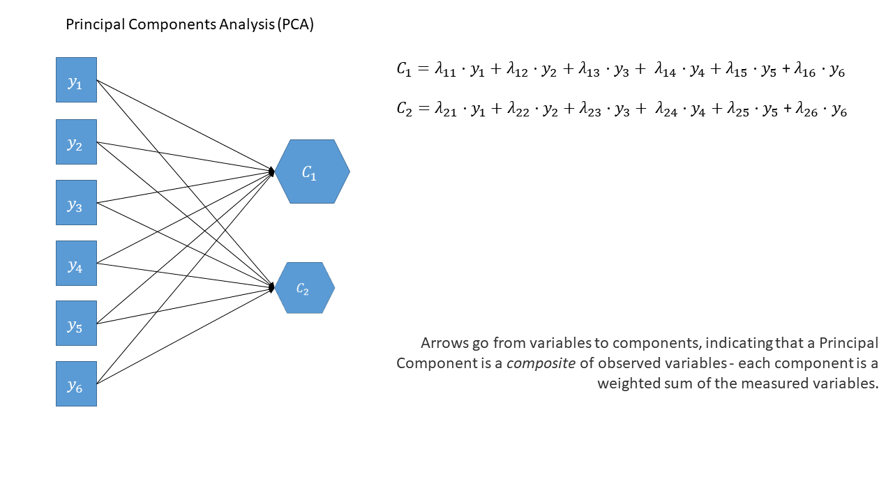
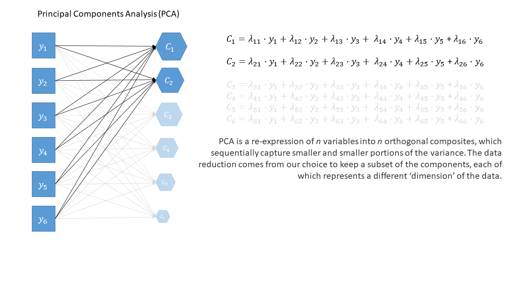
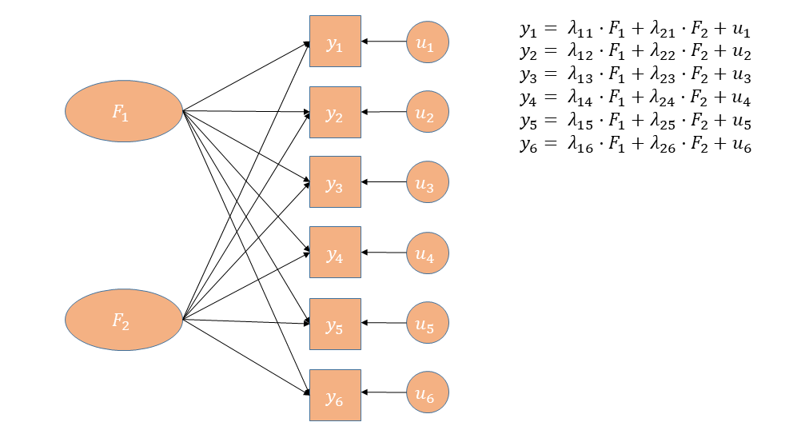

```{r setup, include=F}
library(tidyverse)
library(patchwork)
library(psych)
source('_theme/theme_quarto.R')

theme_set(theme_quarto(title_font_size=42))
theme_update(
  text = element_text(family = 'Source Sans 3')
)

dapr3green <- "#88B04B" 
dapr3dkgreen <- "#5C7C28"
dapr3ltgreen <- "#E5EED7"
pal <- c( "#d35269", "#5c9ead","#2a3c24", "#F5C396", "#8B2635",  "#235789")
```

```{r}
#| include: false
#set.seed(89650)
while(TRUE){
  eseed=runif(1,1,1e5)
  eseed=55071
  set.seed(eseed)
  LS=rnorm(100,50,10)
  df <- tibble(
    V1 = rnorm(100,LS,10),
    V2 = rnorm(100,V1,10),
    V3 = rnorm(100,LS,20),
    Y = rnorm(100,.3*LS,10)
  )
  df = apply(df,2,\(x) round(pmin(100,pmax(0,x)))) |> as.data.frame()
  
  df[1,1:3]<-c(40,50,20)
  df[2,1:4]<-c(30,40,70,28)
  
  df$PC = psych::principal(df[,1:3],1)$scores[,1]

  if(all(summary(lm(Y~V1+V2+V3,df))$coefficients[2:4,4]>.05) &
      (summary(lm(Y~I(V1+V2+V3),df))$coefficients[2,4]>.05) &
        summary(lm(Y~PC,df))$coefficients[2,4]<.05) {
  break }
}

plot(df[,1:3])
cor(df[,1:3])
print(eseed)

df$Y = max(df$Y)-df$Y

sjPlot::tab_model(
  lm(Y~V1+V2+V3,df),
  lm(Y~I(V1+V2+V3),df),
  lm(Y~PC,df)
)

df$SS = rowMeans(df[,1:3])
df$LS = LS

df <- df[c(1,2,7,14,9,10, setdiff(1:nrow(df),c(1,2,7,14,9,10))),]
rownames(df) <- 1:nrow(df)
names(df)[1:4] <- c("Q1","Q2","Q3","RiskTake")
df$id <- paste0("P",sprintf("%03d", 1:100))
  
lsatdat <- df[,c(8,4,1:3)]
# write_csv(lsatdat, file="data/lsatdat1.csv")
lsat3 <- df[,1:3]
```


# Course Overview {background-color="white"}

<br>

```{r echo=F}
#| results: "asis"
block1_name = "Linear Mixed Models<br>(with Elizabeth Pankratz)"
block1_lecs = c("Regression refresher, intro to group-structured data",
                "TODO",
                "TODO",
                "TODO",
                "recap")
block2_name = "Factor Analysis<br>working with multi-item measures<br>(with Josiah King)"
block2_lecs = c(
  "measurement and dimensionality",
  "exploring underlying constructs (EFA)",
  "testing theoretical models (CFA)",
  "reliability and validity",
  "recap & exam prep"
  )

source("https://raw.githubusercontent.com/uoepsy/junk/refs/heads/main/R/course_table.R")
course_table(block1_name,block2_name,block1_lecs,block2_lecs,week=7)
```

## Week 7 TR;DL

1. measurement is hard, especially in psych
2. multi-item measurement tools mean we have lots of variables capturing the same thing (lots of "dimensions")  
4. our goal in the second half of DAPR3 is to explore ways of expressing a lot of the same information using fewer variables ("dimensionality reduction")
5. one way to reduce dimensionality is to take a scale score  (i.e., mean or sum of all individual scores) 
    - this assumes each item is equally representative of our construct
6. another way is PCA:  
    - for $k$ variable, finds $k$ new dimensions ("components") that:
      - are a weighted sum of original variables: 
      - sequentially capture variability in the data
      - are orthogonal (uncorrelated) to one another
	    - we then reduce by taking the first $k$ components
7. a constant reminder: getting some numbers is not the same thing as measurement  

## This week

- from reduction to measurement models (from PCA to EFA)
- Why EFA?
- How (broadly) EFA works
- "Rotations" & Simple Structures
- Evaluating Factor Solutions

# Conceptual overview

## Questions to ask before you start

::: columns
::: {.column width="50%"}
<center>**PCA**</center>

-   Why are your variables correlated?
    -   Agnostic/don't care
-   What are your goals?
    -   Reduce reduce reduce!  
        
:::
::: {.column width="50%" .fragment}
<center>**EFA**</center>

-   Why are your variables correlated?
    -   Believe there exist underlying "causes" of these correlations
-   What are your goals?
    -   Reduce, but also **learn** about/model their underlying (latent) causes
        

:::
:::


## What are your new dimensions?  

::: columns
::: {.column width="50%"}
<center>**Components**</center>

- a weighted composite of the variables.  
    - "a little bit of column A, a little bit of column B"
    
- nothing more.  

:::
::: {.column width="50%" .fragment}
<center>**Factors**</center>

- **theorized common cause** of responses to a set of variables

- something that *explains* correlations between measured variables

- assumed to be real (unobservable) things in the world

:::
:::


## thinking in diagrams


## thinking in diagrams (2)

<br>

::::{.columns}
:::{.column width="50%" .fragment}
<center>**PCA**</center>


:::
:::{.column width="50%"}
<center>**EFA**</center>


:::
::::

## PCA vs EFA

::: columns
::: {.column width="50%"}
<center>**PCA**</center>

- The observed measures are independent variables
    - (arrows go from observed variables to components)
- The component is a bit like a dependent variable (it's really just a composite!)
- Components **sequentially** capture as much variance in the measures as possible
    - looks for the most variance. doesn't care if this is variance shared across items, or variance that is unique to a single item.  
- Components are determinate
    - it's a calculation/transformation. there is one 'solution'.  

:::

::: {.column width="50%"}
<center>**EFA**</center>

- The observed measures are dependent variables
    - (arrows go from factors to observed variables)
- The factor is the independent variable
- Models the relationships between variables
    - tries to identify shared variance between items, and separate it from variance that is unique to each item.  
- Factors are *in*determinate
    - it's an estimated model, there is no single "correct" solution.  
    


:::
:::

## As a diagram (PCA)



## As a diagram (PCA)



## As a diagram (EFA)


## Debates!   

Put these into two groups - those you feel more comfortable with conceptualising as latent variables and those you don't:  
(no right/wrong answers)  

:::woo
https://app.wooclap.com/events/ZFTQYR/
::: 

<br>


- Anxiety 
- Depression
- Exposure to distressing events
- Trust
- Socioeconomic Status
- Motivation
- Identity

## Why prefer EFA over PCA?  

- We give **meaning** to the new dimensions.  

- new dimensions do not need to be "orthogonal" (uncorrelated)  
    - more on this shortly!  

- We learn something.  
    - are there two different parts to our 'life satisfaction' measure, or only 1? or maybe 3?  

## directions/magnitudes

TODO 
loadings/variance explained

last week we mainly looked at Vaccounted. 

this week.. 

patterns of loadings, 

you can use PCA like an EFA.  
if you do, you're essentially doing EFA, but with formative indicators.. 


# How (high level) factor models work

## EFA: a model of observed relationships

- We have some observed variables that are correlated

- EFA tries to explain these patterns of correlations

- Aim is that the correlations between items _after removing the effect of the Factor_ are zero


::::{.columns}
:::{.column width="50%"}
```{r}
#| echo: false
library(gt)
cbind(True_LS = LS, lsatdat) |> 
  select(id, True_LS, Q1:Q3) |>
  head() |>
  gt() |>
  tab_style(
    style = cell_text(color = "grey70"),
    locations = cells_body(columns = True_LS)
  )
```


:::
:::{.column width="50%"}

$$
\begin{align}
\rho(Q_{1},Q_{2}\, |\, \color{grey}{\textrm{Life-Satisfaction}})=0 \\
\rho(Q_{1},Q_{3}\, |\, \color{grey}{\textrm{Life-Satisfaction}})=0 \\
\rho(Q_{2},Q_{3}\, |\, \color{grey}{\textrm{Life-Satisfaction}})=0 \\
\end{align}
$$

:::
::::


## EFA: a model of observed relationships

::: {style="font-size: 0.8em;"}
$$
\begin{align}
\text{Outcome} &= \quad\quad\quad\text{Model} &&+ \text{Error} \quad\quad\quad\quad\quad \\
\quad \\
\text{Correlation Matrix} &= \quad\quad\quad\begin{aligned}[c] &\text{How each variable} \\ &\text{reflects the shared} \\ &\text{factor(s)} \end{aligned} &&+ \begin{aligned}[c] &\text{How each variable} \\ &\text{is unique} \end{aligned}
\end{align}
$$
:::

## EFA: a model of observed relationships

::: {style="font-size: 0.8em;"}
$$
\begin{align}
\text{Outcome} &= \quad\quad\quad\text{Model} &&+ \text{Error} \quad\quad\quad\quad\quad \\
\quad \\
\text{Correlation Matrix} &= \quad\quad\quad\begin{aligned}[c] &\text{How each variable} \\ &\text{reflects the shared} \\ &\text{factor(s)} \end{aligned} &&+ \begin{aligned}[c] &\text{How each variable} \\ &\text{is unique} \end{aligned} \\
\quad \\
\text{Correlation matrix} &= \quad\quad\quad\text{Factor loadings} &&+ \text{Unique variances} \quad\quad\quad\quad\quad \\
\quad \\
\end{align}
$$
:::




## EFA: a model of observed relationships {data-background-color="#e2fce1"}

```{r}
#| include: false
set.seed(34567)
RR = matrix(c(1,.6,.6,.6,
              .6,1,.6,.6,
              .6,.6,1,.6,
              .6,.6,.6,1), nrow=4)
tdf = MASS::mvrnorm(2e2,mu=c(0,0,0,0),Sigma=RR)
cor(tdf) |> round(2)

ll = fa(tdf, nfactors=1,rotate="none")$loadings[,1]
uu = fa(tdf, nfactors=1,rotate="none")$uniqueness

ll %*% t(ll) + diag(uu)

```

::: {style="font-size: 0.8em;"}
$$
\begin{align}
\text{Outcome} &= \quad\quad\quad\text{Model} &&+ \text{Error} \quad\quad\quad\quad\quad \\
\quad \\
\text{Correlation Matrix} &= \quad\quad\quad\begin{aligned}[c] &\text{How each variable} \\ &\text{reflects the shared} \\ &\text{factor(s)} \end{aligned} &&+ \begin{aligned}[c] &\text{How each variable} \\ &\text{is unique} \end{aligned} \\
\quad \\
\text{Correlation matrix} &= \quad\quad\quad\text{Factor loadings} &&+ \text{Unique variances} \quad\quad\quad\quad\quad \\
\quad \\
\quad \\
\mathbf{\Sigma} &= \quad\quad\quad\mathbf{\Lambda}\mathbf{\Lambda'} &&+ \mathbf{\Psi} \quad\quad\quad\quad\quad\quad  \\
\quad \\
\begin{bmatrix}
1 & 0.53 & 0.57 & 0.57 \\
0.53 & 1 & 0.54 & 0.56 \\
0.57 & 0.54 & 1 & 0.56 \\
0.57 & 0.56 & 0.56 & 1 \\
\end{bmatrix} &= 
\begin{bmatrix}
0.747 \\
0.725 \\ 
0.746 \\ 
0.764 \\
\end{bmatrix}
\begin{bmatrix}
0.747 & 0.725 & 0.746 & 0.764 \\
\end{bmatrix} &&+
\begin{bmatrix}
0.44 & 0 & 0 & 0 \\
0 & 0.47 & 0 & 0 \\
0 & 0 & 0.44 & 0 \\
0 & 0 & 0 & 0.42  \\
\end{bmatrix} \\
\quad \\
\begin{bmatrix}
1 & 0.53 & 0.57 & 0.57 \\
0.53 & 1 & 0.54 & 0.56 \\
0.57 & 0.54 & 1 & 0.56 \\
0.57 & 0.56 & 0.56 & 1 \\
\end{bmatrix} &= 
\begin{bmatrix}
0.56 & 0.54 & 0.56 & 0.57 \\
0.54 & 0.53 & 0.54 & 0.55 \\
0.56 & 0.54 & 0.56 & 0.57 \\
0.57 & 0.55 & 0.57 & 0.58 \\
\end{bmatrix} &&+
\begin{bmatrix}
0.44 & 0 & 0 & 0 \\
0 & 0.47 & 0 & 0 \\
0 & 0 & 0.44 & 0 \\
0 & 0 & 0 & 0.42  \\
\end{bmatrix} \\
\end{align}
$$

:::

:::{.center-img}

:::

## Sources of variance  

- In order to model these correlations, EFA looks to distinguish between common and unique variance.  

$$
\begin{equation}
var(\text{total}) = var(\text{common}) + \underbrace{var(\text{specific}) + var(\text{error})}_{\text{unique variance}}
\end{equation}
$$

<br>
 
| | | |
|-|-|-|
|common variance | (co)variance shared across items | true and shared | 
|specific variance | variance specific to an item that is not shared with any other items | true and unique | 
| error variance | variance due to measurement error | not 'true', unique |


## We make assumptions when we use models

As EFA is a model, just like linear models and other statistical tools, using it requires us to make some assumptions:

::::{.columns}
:::{.column width="50%"}

1.  The error terms are uncorrelated
2.  The residuals/errors are not correlated with the factor
3.  Relationships between items and factors should be linear, although there are models that can account for nonlinear relationships


:::
:::{.column width="50%"}

:::
::::


# EFA Workflow

```{r}
#| include: false
lsat_word = 
  tibble(
    variable=c("id", paste0("Q",1:10)),
    description=c(
              "Participant ID",
              "Overall, I am satisfied with my life.",
              "The conditions of my life are excellent.",
              "I feel content with how things have gone today.",
              "I am deeply happy with the way my life has turned out.",
              "I feel a sense of inner peace and satisfaction.",
              "I wake up most mornings feeling positive about the day ahead.",
              "I have gotten the important things I want in life.",
              "I experience joy and pleasure regularly in my daily life.",
              "My life has turned out better than I expected it would.",
              "If I could live my life over, I would change almost nothing."
              )
  )
```

## Workflow steps

So how do we move from data and correlations to a factor analysis?

1. check suitability of items ("items" is often used to refer to the set of measured variables in a questionnaire)
2. decide on appropriate rotation and factor extraction method
3. examine plausible number of factors
4. based on the plausible number of factors from (3), choose the range to examine from $n_{min}$ factors to $n_{max}$ factors
5. do EFA, extracting from $n_{min}$ to $n_{max}$ factors. Compare each of these 'solutions' in terms of structure, variance explained, and --- by examining how the factors from each solution relate to the observed items --- assess how much theoretical sense they make.  
6. consider removing "problematic" items. If you do, then go back and start over again.  

## Running Example: are you not satisfied? 

::::{.columns}
:::{.column width="60%"}
:::{.codewindow .r}
data
```{r}
#| label: lsat10
#| eval: false
#| echo: true
lsat10 <- read_csv("data/lsatdat2.csv")
head(lsat10)
```
:::
```{r}
#| label: lsat10
#| eval: true
#| echo: false
```

:::
:::{.column width="40%"}
```{r}
#| echo: false
lsat_word |> 
  gt::gt(caption = "Data Dictionary")
```
:::
::::


## How do I fit an EFA in R?

:::{.codewindow .r width="70%"}
```{r}
#| label: efa1
#| echo: true
#| eval: false
library(psych)
# fa(lsat10[,2:11], nfactors = ?, rotate = ??, fm = ???, cor = ????)  
```
:::

`fa()`   
can take a covariance matrix, a correlation matrix, or the raw data.  
`nfactors = ?`  
tells it to estimate a ??? factor model  
`rotate = ??`  
tells it whether or not we think those factors could be correlated (more on this shortly)  
`fm = ???`  
tells it how to estimate the model  
`cor = ????`  
tells it what sort of correlations to use (a little more on this later on)


## What does EFA in R look like?  

```{r}
#| label: efa1a
#| echo: false
#| eval: false
fa(lsat10[,2:11], nfactors = 2, rotate = "none", fm = "ml", cor = "cor")  
```

:::{.codewindow .r width="70%"}
```{r}
#| label: efa1a
#| echo: true
#| eval: false
```
:::
```{r}
#| label: efa1a
#| echo: false
#| eval: true
```


## 1/6 How's the data? 

basically - are items correlated? 

if few response options, normal cor is not ideal.
use polychoric.  

in R this would mean doing:

```{r}
#| eval: false
fa(......, cor = "poly")  
```

## 2/6 Which "factor extraction methods"? 

| method | what it does | best for | requirements |
| ------ | -------- | ---- | ----------- |
| `minres` | Minimizes squared differences between observed and model implied correlation matrices | You have a large number of variables, or ML fails to converge |  |
| `ml` | Estimates factor loadings most likely (max likelihood) to have produced the observed correlation matrix | large sample size | multivariate normality |
| `paf` | Uses squared multiple correlations as initial communality estimates | When data appear non-normal, or unsuitable for ML |  |

## 2/6 What is rotation?  

-   Factor rotation is an approach that aims to clarify the relationships between items and factors.

    -   Rotation aims to maximize the relationship of a measured item with a single factor.
    -   That is, make an item's more related to one factor and less to the others  


```{r}
#| echo: false
eg2 <- lsat10[,-1]

mn = fa(eg2, nfactors=2, rotate = "none", fm="ml")
mr = fa(eg2, nfactors=2, rotate = "varimax", fm="ml")
mor = fa(eg2, nfactors=2, rotate = "oblimin", fm="ml")

x_axis <- c(1, 0)
y_axis <- c(0, 1)
new_x_axis <- mr$rot.mat %*% x_axis
new_y_axis <- mr$rot.mat %*% y_axis
newo_x_axis <- (mor$rot.mat %*% mor$Phi) %*% x_axis
newo_y_axis <- (mor$rot.mat %*% mor$Phi) %*% y_axis
original_axes <- data.frame(
  x = c(0, x_axis[1], 0, y_axis[1]),
  y = c(0, x_axis[2], 0, y_axis[2]),
  axis = c("Original X", "Original X", "Original Y", "Original Y")
)
rotated_axes <- data.frame(
  x = c(0, new_x_axis[1], 0, new_y_axis[1]),
  y = c(0, new_x_axis[2], 0, new_y_axis[2]),
  axis = c("Rotated X", "Rotated X", "Rotated Y", "Rotated Y")
)
orotated_axes <- data.frame(
  x = c(0, newo_x_axis[1], 0, newo_y_axis[1]),
  y = c(0, newo_x_axis[2], 0, newo_y_axis[2]),
  axis = c("Rotated X", "Rotated X", "Rotated Y", "Rotated Y")
)

p1 <- mn$loadings[,1:2] |>
  as.data.frame() |>
  rownames_to_column() |>
  ggplot(aes(x=ML1,y=ML2))+
  geom_point()+
  geom_vline(xintercept=0,size=1)+
  geom_hline(yintercept=0,size=1)+
  geom_text(aes(label=rowname),hjust=-.2)+
  # geom_segment(aes(xend=0,yend=ML2),lty="dashed",
  #              alpha=.6)+
  # geom_segment(aes(yend=0,xend=ML1),lty="dashed",
  #              alpha=.6)+
  labs(x="Loadings on Factor 1",
       y="Loadings on Factor 2")+
  xlim(-1,1)+ylim(-1,1)+
  geom_segment(data = original_axes, aes(x = 0, y = 0, xend = x, yend = y, color = axis), 
               arrow = arrow(length = unit(0.2, "cm")), size = 1) +
  geom_segment(data = original_axes, aes(x = 0, y = 0, xend = -x, yend = -y, color = axis), 
               arrow = arrow(length = unit(0.2, "cm")), size = 1)

p2 <- mn$loadings[,1:2] |>
  as.data.frame() |>
  rownames_to_column() |>
  ggplot(aes(x=ML1,y=ML2))+
  geom_point()+
  geom_vline(xintercept=0,size=1)+
  geom_hline(yintercept=0,size=1)+
  geom_text(aes(label=rowname),hjust=-.2)+
  # geom_segment(aes(xend=0,yend=ML2),lty="dashed",
  #              alpha=.3)+
  # geom_segment(aes(yend=0,xend=ML1),lty="dashed",
  #              alpha=.3)+
  xlim(-1,1)+ylim(-1,1)+
  geom_segment(data = original_axes, aes(x = 0, y = 0, xend = x, yend = y, color = axis), 
               arrow = arrow(length = unit(0.2, "cm")), size = 1) +
  geom_segment(data = original_axes, aes(x = 0, y = 0, xend = -x, yend = -y, color = axis), 
               arrow = arrow(length = unit(0.2, "cm")), size = 1) +
  geom_segment(data = rotated_axes, aes(x = 0, y = 0, xend = x, yend = y, color = axis), 
               linetype = "dashed", arrow = arrow(length = unit(0.2, "cm")), size = 1) +
  geom_segment(data = rotated_axes, aes(x = 0, y = 0, xend = -x, yend = -y, color = axis), 
               linetype = "dashed", arrow = arrow(length = unit(0.2, "cm")), size = 1)

p3 <- mn$loadings[,1:2] |>
  as.data.frame() |>
  rownames_to_column() |>
  ggplot(aes(x=ML1,y=ML2))+
  geom_point()+
  geom_vline(xintercept=0,size=1)+
  geom_hline(yintercept=0,size=1)+
  geom_text(aes(label=rowname),hjust=-.2)+
  # geom_segment(aes(xend=0,yend=ML2),lty="dashed",
  #              alpha=.3)+
  # geom_segment(aes(yend=0,xend=ML1),lty="dashed",
  #              alpha=.3)+
  labs(x="Loadings on Factor 1",
       y="Loadings on Factor 2")+
  xlim(-1,1)+ylim(-1,1)+
    geom_segment(data = original_axes, aes(x = 0, y = 0, xend = x, yend = y, color = axis), 
               arrow = arrow(length = unit(0.2, "cm")), size = 1) +
  geom_segment(data = original_axes, aes(x = 0, y = 0, xend = -x, yend = -y, color = axis), 
               arrow = arrow(length = unit(0.2, "cm")), size = 1) +
  geom_segment(data = orotated_axes, aes(x = 0, y = 0, xend = x, yend = y, color = axis), 
               linetype = "dashed", arrow = arrow(length = unit(0.2, "cm")), size = 1) +
  geom_segment(data = orotated_axes, aes(x = 0, y = 0, xend = -x, yend = -y, color = axis), 
               linetype = "dashed", arrow = arrow(length = unit(0.2, "cm")), size = 1) 

```

## 2/6 Why rotate?

- Without rotation, the pattern of the factor loadings can often be unclear.  

- Rotation is essentially a transformation applied to the loadings.  

- it doesn't change the model fit. like scaling a predictor in a `lm()`  

::::{.columns}
:::{.column width="50%"}
```{r}
#| echo: false
#| fig-asp: 1
p1 + theme(legend.position="bottom")
```
:::
:::{.column width="50%"}
```{r}
fa(eg2, nfactors=2, rotate = "none", fm="ml")$loadings
```
:::
::::

## 2/6 Which rotation? 

```{r}
#| eval: false
# no rotation
fa(eg2, nfactors = 2, rotate = "none", fm="ml")
# orthogonal rotations
fa(eg2, nfactors = 2, rotate = "varimax", fm="ml")
fa(eg2, nfactors = 2, rotate = "quartimax", fm="ml")
# oblique rotations
fa(eg2, nfactors = 2, rotate = "oblimin", fm="ml")
fa(eg2, nfactors = 2, rotate = "promax", fm="ml")
```

::::{.columns}
:::{.column width="50%"}
__Orthogonal__  

```{r}
#| echo: false
#| fig-asp: 1
p2 + theme(legend.position="bottom")
```

:::

:::{.column width="50%" .fragment}
__Oblique__  

```{r}
#| echo: false
#| fig-asp: 1
p3 + theme(legend.position="bottom")
```
:::
::::

---

::: {.r-stack}
::: {.fragment .fade-out fragment-index=1}

:::

::: {.fragment .fade-in fragment-index=1}

:::
:::

## 2/6 Which rotation? 

- Question: do we want to **allow** our factors to correlate?  

- easy answer: yes. it doesn't mean they _have_ to.. 

- so go with an oblique rotation?  

## 3/6 how many factors? 

```{r}
#| eval: false
#| echo: true
scree(lsat10[,2:11])
fa.parallel(eg_data)
VSS(eg_data, plot = FALSE)
```

-   Scree plots
-   Parallel Analysis
-   MAP

<br>
 
But... if there's no strong steer, then we want a **range.**   

## 4/6 a range for the number of factors

- Treat MAP as a minimum
- PA as a maximum
- Explore all solutions in this range and select the one that yields the best numerically and theoretically.


## 5/6 compare and contrast!  

::::{.columns}
:::{.column width="30%"}
```{r}
fa1 <- fa(lsat10[,2:11], nfactors = 1, 
                  fm = "ml", cor = "cor")
print(fa1$loadings, cutoff = .3)
```

:::
:::{.column width="3%"}
:::
:::{.column width="30%"}
```{r}
fa2 <- fa(lsat10[,2:11], nfactors = 2, rotate = "oblimin", 
                  fm = "ml", cor = "cor")
print(fa2$loadings, cutoff = .3)
```
:::
:::{.column width="3%"}
:::
:::{.column width="30%"}
```{r}
fa3 <- fa(lsat10[,2:11], nfactors = 3, rotate = "oblimin", 
                  fm = "ml", cor = "cor")
print(fa3$loadings, cutoff = .3)
```
:::
::::

## 5/6 compare and contrast

__BUT **HOW**!?__  


- Cleanliness of structure
    - are the factor(s) clearly defined?  

- Factor utility
    - do the factors account for enough variability, and represent a sufficient number of observed items?  

- Item-level diagnostics
    - are there any items irrelevant, redundant or complex?  

- Theoretical coherence
    - does it make sense? 

and when in doubt, parsimony.  

## the output... 

## the output - loading matrix 


## the output - loading matrix (2)


## the output - loading matrix (3)


## the output - loading matrix (4)


## the output - communalities  


## the output - uniqueness


## the output - complexity


## the output - variance accounted for


## the output - variance accounted for (2)


## the output - variance accounted for (3)


## the output - variance accounted for (4)


## the output - factor correlations


## Evaluating factor solutions - where to start

+ variance accounted for
    + in total (field dependent)
    + each factor (relative to one another)

+ salient loadings
    + meaning of factors is based on size and sign of 'salient' loadings
    + we decide what is 'salient'
    + in most research this is $\ge|.3|$ or $\ge|.4|$

+ Each factor has $\geq 3$ salient loadings (ideally $\geq 3$ *primary* loadings)
    + if not, may have extracted too many factors
    

## Evaluating factor solutions - looking for trouble

+ Items with no salient loadings?
    + maybe a problem item, which should be removed
    + maybe signal presence of another factor

+ Items with multiple salient loadings (cross-loadings)?
    + look at item complexity values.
    + makes defining the factors more difficult

+ Heywood cases
    + factor loadings $\geq |1|$
    + communalities $\geq |1|$
    + something is **wrong**; we do not trust these results  
    + Try different rotation, estimation method, eliminate items, rethink if FA is what you actually want to do


## Evaluating factor solutions - list of criteria

- how much variance is accounted for by a solution?
- do all factors load on 3+ items at a salient level?  
- do all items have at least one loading at a salient level?  
- are there any highly complex items?  
- are there any "Heywood cases" (communalities or standardised loadings that are >1)?  

- **is the factor structure (items that load on to each factor) coherent, and does it make theoretical sense?**
    

## Evaluating factor solutions - cautions!  

**Remember**:
If we choose to delete one or more items, we must start back at the beginning, and go back to determining how many factors to extract

<br>

**Very Important**: 
If one or more factors don't make sense, then either the items are bad, the theory is bad, the analysis is bad, or all three are bad!  

<br>

&#128169; The "garbage in garbage out" principle always applies

- PCA and factor analysis cannot turn bad data into good data

