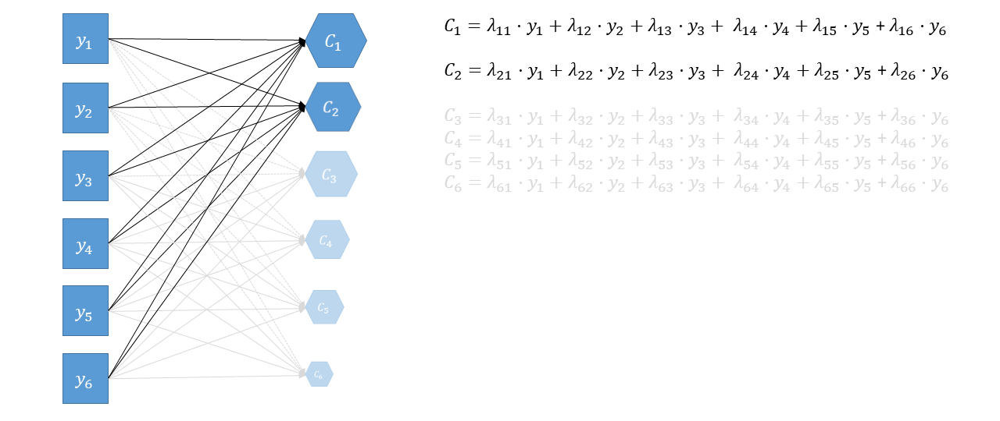
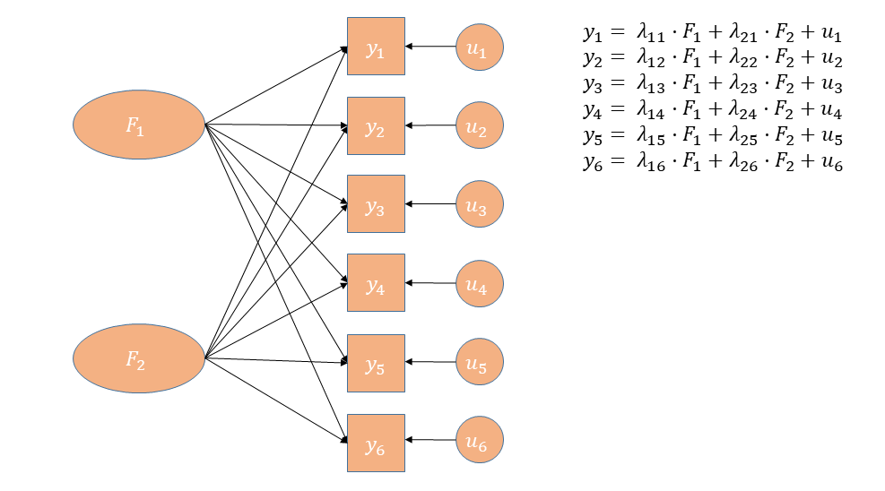
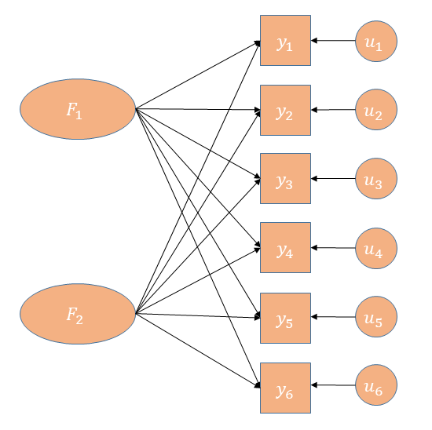

```{r setup, include=F}
library(tidyverse)
library(patchwork)
library(psych)
source('_theme/theme_quarto.R')

theme_set(theme_quarto(title_font_size=42))
theme_update(
  text = element_text(family = 'Source Sans 3')
)

dapr3green <- "#88B04B" 
dapr3dkgreen <- "#5C7C28"
dapr3ltgreen <- "#E5EED7"
pal <- c( "#d35269", "#5c9ead","#2a3c24", "#F5C396", "#8B2635",  "#235789")
```

```{r}
#| include: false
#set.seed(89650)
while(TRUE){
  eseed=runif(1,1,1e5)
  eseed=55071
  set.seed(eseed)
  LS=rnorm(100,50,10)
  df <- tibble(
    V1 = rnorm(100,LS,10),
    V2 = rnorm(100,V1,10),
    V3 = rnorm(100,LS,20),
    Y = rnorm(100,.3*LS,10)
  )
  df = apply(df,2,\(x) round(pmin(100,pmax(0,x)))) |> as.data.frame()
  
  df[1,1:3]<-c(40,50,20)
  df[2,1:4]<-c(30,40,70,28)
  
  df$PC = psych::principal(df[,1:3],1)$scores[,1]

  if(all(summary(lm(Y~V1+V2+V3,df))$coefficients[2:4,4]>.05) &
      (summary(lm(Y~I(V1+V2+V3),df))$coefficients[2,4]>.05) &
        summary(lm(Y~PC,df))$coefficients[2,4]<.05) {
  break }
}

plot(df[,1:3])
cor(df[,1:3])
print(eseed)

df$Y = max(df$Y)-df$Y

sjPlot::tab_model(
  lm(Y~V1+V2+V3,df),
  lm(Y~I(V1+V2+V3),df),
  lm(Y~PC,df)
)

df$SS = rowMeans(df[,1:3])
df$LS = LS

df <- df[c(1,2,7,14,9,10, setdiff(1:nrow(df),c(1,2,7,14,9,10))),]
rownames(df) <- 1:nrow(df)
names(df)[1:4] <- c("Q1","Q2","Q3","RiskTake")
df$id <- paste0("P",sprintf("%03d", 1:100))
  
lsatdat <- df[,c(8,4,1:3)]
# write_csv(lsatdat, file="data/lsatdat1.csv")
lsat3 <- df[,1:3]
```


# Course Overview {background-color="white"}

<br>

```{r echo=F}
#| results: "asis"
block1_name = "Linear Mixed Models<br>(with Elizabeth Pankratz)"
block1_lecs = c("Regression refresher, intro to group-structured data",
                "TODO",
                "TODO",
                "TODO",
                "recap")
block2_name = "Factor Analysis<br>working with multi-item measures<br>(with Josiah King)"
block2_lecs = c(
  "measurement and dimensionality",
  "exploring underlying constructs (EFA)",
  "testing theoretical models (CFA)",
  "reliability and validity",
  "recap & exam prep"
  )

source("https://raw.githubusercontent.com/uoepsy/junk/refs/heads/main/R/course_table.R")
course_table(block1_name,block2_name,block1_lecs,block2_lecs,week=7)
```

## Week 7 TR;DL

1. measurement is hard, especially in psych
2. multi-item measurement tools mean we have lots of variables capturing the same thing (lots of "dimensions")  
4. our goal in the second half of DAPR3 is to explore ways of expressing a lot of the same information using fewer variables ("dimensionality reduction")
5. one way to reduce dimensionality is to take a scale score  (i.e., mean or sum of all individual scores) 
    - this assumes each item is equally representative of our construct
6. another way is PCA:  
    - for $k$ variable, finds $k$ new dimensions ("components") that:
      - are a weighted sum of original variables: 
      - sequentially capture variability in the data
      - are orthogonal (uncorrelated) to one another
	    - we then reduce by taking the first $k$ components
7. a constant reminder: getting some numbers is not the same thing as measurement  

## This week

- from reduction to measurement models (from PCA to EFA)
- Why EFA?
- How (broadly) EFA works
- "Rotations" & Simple Structures
- Evaluating Factor Solutions

# Conceptual overview

## What... is your quest?

::: columns
::: {.column width="50%"}
<center>**PCA**</center>

-   Why are your variables correlated?
    -   Agnostic/don't care

<br>
<br>

- **Goals:** 
    - Reduce reduce reduce! 
    - get some scores 
        
:::
::: {.column width="50%"}
<center>**EFA**</center>

-   Why are your variables correlated?
    - There exist some number of underlying "causes" of the correlations

<br>

- **Goals:** 
    - **learn** about/model the underlying cause(s)
    - (optional) estimate some scores
        

:::
:::


## What... are your new dimensions?  

::: columns
::: {.column width="50%"}
<center>**PCA: Components**</center>

- a weighted composite of the variables.  
    - "a little bit of column A, a little bit of column B"
    
- nothing more.  

:::
::: {.column width="50%"}
<center>**EFA: Factors**</center>

- **theorized common cause** of responses to a set of variables

- something that *explains* correlations between measured variables

- assumed to be real (unobservable) things in the world

:::
:::


## PCA

- portion up all/any variance into distinct buckets
- keep the biggest bucket(s)


## EFA

- separate out common variance (shared across items) from unique variance
- keep the meaningful underlying drivers of shared variance


## Sources of variance  

$$
\begin{equation}
\text{Var}(\text{total}) = \text{Var}(\text{common}) + \underbrace{\text{Var}(\text{specific}) + \text{Var}(\text{error})}_{\text{unique variance}}
\end{equation}
$$

<br>
 
| | | |
|-|-|-|
|common variance | (co)variance shared across items | true and shared | 
|specific variance | variance specific to an item that is not shared with any other items | true and unique | 
| error variance | variance due to measurement error | not 'true', unique |


## thinking in diagrams


## thinking in diagrams (2)

<br>

::::{.columns}
:::{.column width="50%"}
<center>**PCA**</center>


:::
:::{.column width="50%"}
<center>**EFA**</center>


:::
::::

## directions & magnitudes in PCA

- Last week was mainly about % variance accounted for by each principal component

- We didn't look at the loadings much.. 

{width="1000px"}


## directions & magnitudes in EFA

- In EFA we still get "loadings" and "variance accounted for"

- The patterns of loadings will help us understand *what* the latent factors actually are. 

{width="1000px"}


## EFA: modelling correlations

- We have some observed variables that are correlated

- Latent factor(s) are unobservable variables that explain the patterns of correlations.  

- Idea is that the correlations between items _after removing the effect of the Factor_ are zero


::::{.columns}
:::{.column width="50%"}
```{r}
#| echo: false
library(gt)
cbind(True_LS = LS, lsatdat) |> 
  select(id, True_LS, Q1:Q3) |>
  head() |>
  gt() |>
  tab_style(
    style = cell_text(color = "grey70"),
    locations = cells_body(columns = True_LS)
  )
```


:::
:::{.column width="50%"}

$$
\begin{align}
\rho(Q_{1},Q_{2}\, |\, \color{grey}{\textrm{True_LS}})=0 \\
\rho(Q_{1},Q_{3}\, |\, \color{grey}{\textrm{True_LS}})=0 \\
\rho(Q_{2},Q_{3}\, |\, \color{grey}{\textrm{True_LS}})=0 \\
\end{align}
$$

:::
::::


## EFA: modelling correlations

$\begin{align}\text{Outcome} \quad\quad\quad\quad\quad &=& \quad\quad\text{Model} \quad\quad\quad\quad\quad&+&\quad\quad\text{Error} \\\end{align}$

:::{.fragment}
$\begin{align}\text{Correlation matrix} \quad &=& \quad \begin{aligned}[c] &\text{How each variable} \\ &\text{reflects the shared} \\ &\text{factor(s)} \end{aligned} \quad&+&\quad \begin{aligned}[c] &\text{How each variable} \\ &\text{uniquely varies} \end{aligned} \\ \end{align}$
:::

:::{.fragment}
$\begin{align} \text{Correlation matrix} \quad &=& \quad\text{Factor loadings} \quad\quad\quad&+&\quad \text{Unique variances} \\ \end{align}$
:::

## EFA: modelling correlations {data-background-color="#e2fce1"}

```{r}
#| include: false
set.seed(34567)
RR = matrix(c(1,.6,.6,.6,
              .6,1,.6,.6,
              .6,.6,1,.6,
              .6,.6,.6,1), nrow=4)
tdf = MASS::mvrnorm(2e2,mu=c(0,0,0,0),Sigma=RR)
cor(tdf) |> round(2)

ll = fa(tdf, nfactors=1,rotate="none")$loadings[,1]
uu = fa(tdf, nfactors=1,rotate="none")$uniqueness

ll %*% t(ll) + diag(uu)

```

::: {style="font-size: 0.8em;"}
$$
\begin{align}
\text{Outcome} &= \quad\quad\quad\text{Model} &&+ \text{Error} \quad\quad\quad\quad\quad \\
\quad \\
\text{Correlation Matrix} &= \quad\quad\quad\begin{aligned}[c] &\text{How each variable} \\ &\text{reflects the shared} \\ &\text{factor(s)} \end{aligned} &&+ \begin{aligned}[c] &\text{How each variable} \\ &\text{is unique} \end{aligned} \\
\quad \\
\text{Correlation matrix} &= \quad\quad\quad\text{Factor loadings} &&+ \text{Unique variances} \quad\quad\quad\quad\quad \\
\quad \\
\quad \\
\mathbf{\Sigma} &= \quad\quad\quad\mathbf{\Lambda}\mathbf{\Lambda'} &&+ \mathbf{\Psi} \quad\quad\quad\quad\quad\quad  \\
\quad \\
\begin{bmatrix}
1 & 0.53 & 0.57 & 0.57 \\
0.53 & 1 & 0.54 & 0.56 \\
0.57 & 0.54 & 1 & 0.56 \\
0.57 & 0.56 & 0.56 & 1 \\
\end{bmatrix} &= 
\begin{bmatrix}
0.747 \\
0.725 \\ 
0.746 \\ 
0.764 \\
\end{bmatrix}
\begin{bmatrix}
0.747 & 0.725 & 0.746 & 0.764 \\
\end{bmatrix} &&+
\begin{bmatrix}
0.44 & 0 & 0 & 0 \\
0 & 0.47 & 0 & 0 \\
0 & 0 & 0.44 & 0 \\
0 & 0 & 0 & 0.42  \\
\end{bmatrix} \\
\quad \\
\begin{bmatrix}
1 & 0.53 & 0.57 & 0.57 \\
0.53 & 1 & 0.54 & 0.56 \\
0.57 & 0.54 & 1 & 0.56 \\
0.57 & 0.56 & 0.56 & 1 \\
\end{bmatrix} &= 
\begin{bmatrix}
0.56 & 0.54 & 0.56 & 0.57 \\
0.54 & 0.53 & 0.54 & 0.55 \\
0.56 & 0.54 & 0.56 & 0.57 \\
0.57 & 0.55 & 0.57 & 0.58 \\
\end{bmatrix} &&+
\begin{bmatrix}
0.44 & 0 & 0 & 0 \\
0 & 0.47 & 0 & 0 \\
0 & 0 & 0.44 & 0 \\
0 & 0 & 0 & 0.42  \\
\end{bmatrix} \\
\end{align}
$$

:::

:::{.center-img}

:::


## thinking in diagrams (3)



## thinking in diagrams (4)



<!-- ## Assumptions -->

<!-- As EFA is a model, just like linear models and other statistical tools, using it requires us to make some assumptions: -->

<!-- ::::{.columns} -->
<!-- :::{.column width="50%"} -->

<!-- 1.  The error terms are uncorrelated -->
<!-- 2.  The residuals/errors are not correlated with the factor -->
<!-- 3.  Relationships between items and factors should be linear -->


<!-- ::: -->
<!-- :::{.column width="50%"} -->
<!--  -->
<!-- ::: -->
<!-- :::: -->


## PCA vs EFA

::: columns
::: {.column width="50%"}
<center>**PCA**</center>

- The observed measures are independent variables
    - (arrows go from observed variables to components)
- The component is a bit like a dependent variable (it's really just a composite!)
- Components **sequentially** capture as much variance in the measures as possible
    - looks for the most variance. doesn't care if this is variance shared across items, or variance that is unique to a single item.  
- Components are determinate
    - it's a calculation/transformation. there is one 'solution'.  

:::

::: {.column width="50%"}
<center>**EFA**</center>

- The observed measures are dependent variables
    - (arrows go from factors to observed variables)
- The factor is the independent variable
- Models the relationships between variables
    - tries to identify shared variance between items, and separate it from variance that is unique to each item.  
- Factors are *in*determinate
    - it's an estimated model, there is no single "correct" solution.  
    


:::
:::


## Why prefer EFA over PCA?  

- We give **meaning** to the new dimensions.  

- Latent factors do not need to be "orthogonal" (uncorrelated)  
    - more on this shortly!  

- We learn something.  
    - are there two different parts to our 'life satisfaction' measure, or only 1? or maybe 3?  

## blurred lines

A little warning..  

- in psychology, people sometimes use PCA and EFA interchangeably!  

- they use PCA but let components correlate, they interpret loadings and give meaning to their components.  

- it's a rabbit hole that we will not go down..   


# Activity break  

:::woo
https://app.wooclap.com/events/XMPODHD
::: 


# EFA Workflow

```{r}
#| include: false
lsat_word = 
  tibble(
    variable=c("id", paste0("Q",1:10)),
    description=c(
              "Participant ID",
              "Overall, I am satisfied with my life.",
              "The conditions of my life are excellent.",
              "I feel content with how things have gone today.",
              "I am deeply happy with the way my life has turned out.",
              "I feel a sense of inner peace and satisfaction.",
              "I wake up most mornings feeling positive about the day ahead.",
              "I have gotten the important things I want in life.",
              "I experience joy and pleasure regularly in my daily life.",
              "My life has turned out better than I expected it would.",
              "If I could live my life over, I would change almost nothing."
              )
  )
lsat10 <- read_csv("data/lsatdat2.csv")

```

## Workflow steps

**Goal:** Reduce, but also **learn** about/model their underlying (latent) causes

1. check data
2. decide "factor extraction method" and "rotation"
3. how many factors?
4. define range for nfactors
5. compare EFAs across the range
6. if no satisfactory solution, consider removing "problematic" items. 
    - If you do, then go back and start over with the reduced set! 


## How do we fit an EFA in R?

:::{.codewindow .r}
efa
```{r}
#| label: efa1
#| echo: true
#| eval: false
library(psych)
fa(data, nfactors = ?, rotate = ??, fm = ???, cor = ????)
```
:::

`fa()`   
can take a covariance matrix, a correlation matrix, or the raw data.  
`nfactors = ?`  
tells it to estimate a ??? factor model  
`rotate = ??`  
tells it whether or not we think those factors could be correlated (more on this shortly)  
`fm = ???`  
tells it how to estimate the model  
`cor = ????`  
tells it what sort of correlations to use


## What does EFA in R look like?  

```{r}
#| label: efa1a
#| echo: false
#| eval: false
library(psych)
fa(lsat10[,2:11], nfactors = 4, rotate = "none", fm = "ml", cor = "cor")  
```

:::{.codewindow .r}
example efa
```{r}
#| label: efa1a
#| echo: true
#| eval: false
```
:::
```{r}
#| label: efa1a
#| echo: false
#| eval: true
```


## Example: are you not satisfied? 

::::{.columns}
:::{.column width="60%"}
:::{.codewindow .r}
data
```{r}
#| label: lsat10
#| eval: false
#| echo: true
lsat10 <- read_csv("data/lsatdat2.csv")
head(lsat10)
```
:::
```{r}
#| label: lsat10
#| eval: true
#| echo: false
```

:::
:::{.column width="40%"}
```{r}
#| echo: false
lsat_word |> 
  gt::gt(caption = "Data Dictionary")
```
:::
::::

## 1/6 Is the data suitable?   

- in short, are items sufficiently correlated with one another?  


- if variables have <5 response options, Pearson's correlation is not idea. use polychoric correlations instead: `fa(......, cor = "poly")`  

## 2/6 "factor extraction methods"? 

briefly:  

- there are different ways to "extract" (estimate) EFA models.  

- different methods have different requirements, making them more suitable for specific scenarios  

- The default (`fm = "minres"`) is a safe choice


## 2/6 "rotations"?  

- Factor rotation is an approach that aims to clarify the relationships between items and factors.

    -   Rotation aims to create a 'simple structure', where each variable is strongly related to one factor and less to others.  


::: {.r-stack}
::: {.fragment .fade-out fragment-index=1}

:::

::: {.fragment .fade-in fragment-index=1}

:::
:::


```{r}
#| echo: false
eg2 <- lsat10[,-1]

mn = fa(eg2, nfactors=2, rotate = "none", fm="minres")
mr = fa(eg2, nfactors=2, rotate = "varimax", fm="minres")
mor = fa(eg2, nfactors=2, rotate = "oblimin", fm="minres")

x_axis <- c(1, 0)
y_axis <- c(0, 1)
new_x_axis <- mr$rot.mat %*% x_axis
new_y_axis <- mr$rot.mat %*% y_axis
newo_x_axis <- (mor$rot.mat %*% mor$Phi) %*% x_axis
newo_y_axis <- (mor$rot.mat %*% mor$Phi) %*% y_axis
original_axes <- data.frame(
  x = c(0, x_axis[1], 0, y_axis[1]),
  y = c(0, x_axis[2], 0, y_axis[2]),
  axis = c("Original X", "Original X", "Original Y", "Original Y")
)
rotated_axes <- data.frame(
  x = c(0, new_x_axis[1], 0, new_y_axis[1]),
  y = c(0, new_x_axis[2], 0, new_y_axis[2]),
  axis = c("Rotated X", "Rotated X", "Rotated Y", "Rotated Y")
)
orotated_axes <- data.frame(
  x = c(0, newo_x_axis[1], 0, newo_y_axis[1]),
  y = c(0, newo_x_axis[2], 0, newo_y_axis[2]),
  axis = c("Rotated X", "Rotated X", "Rotated Y", "Rotated Y")
)

p1 <- mn$loadings[,1:2] |>
  as.data.frame() |>
  rownames_to_column() |>
  ggplot(aes(x=MR1,y=MR2))+
  geom_point()+
  geom_vline(xintercept=0,size=1)+
  geom_hline(yintercept=0,size=1)+
  geom_text(aes(label=rowname),hjust=-.2)+
  # geom_segment(aes(xend=0,yend=ML2),lty="dashed",
  #              alpha=.6)+
  # geom_segment(aes(yend=0,xend=ML1),lty="dashed",
  #              alpha=.6)+
  labs(x="Loadings on Factor 1",
       y="Loadings on Factor 2")+
  xlim(-1,1)+ylim(-1,1)+
  geom_segment(data = original_axes, aes(x = 0, y = 0, xend = x, yend = y, color = axis), 
               arrow = arrow(length = unit(0.2, "cm")), size = 1) +
  geom_segment(data = original_axes, aes(x = 0, y = 0, xend = -x, yend = -y, color = axis), 
               arrow = arrow(length = unit(0.2, "cm")), size = 1)

p2 <- mn$loadings[,1:2] |>
  as.data.frame() |>
  rownames_to_column() |>
  ggplot(aes(x=MR1,y=MR2))+
  geom_point()+
  geom_vline(xintercept=0,size=1)+
  geom_hline(yintercept=0,size=1)+
  geom_text(aes(label=rowname),hjust=-.2)+
  # geom_segment(aes(xend=0,yend=ML2),lty="dashed",
  #              alpha=.3)+
  # geom_segment(aes(yend=0,xend=ML1),lty="dashed",
  #              alpha=.3)+
  labs(x="Loadings on Factor 1",
       y="Loadings on Factor 2")+
  xlim(-1,1)+ylim(-1,1)+
  geom_segment(data = original_axes, aes(x = 0, y = 0, xend = x, yend = y, color = axis), 
               arrow = arrow(length = unit(0.2, "cm")), size = 1) +
  geom_segment(data = original_axes, aes(x = 0, y = 0, xend = -x, yend = -y, color = axis), 
               arrow = arrow(length = unit(0.2, "cm")), size = 1) +
  geom_segment(data = rotated_axes, aes(x = 0, y = 0, xend = x, yend = y, color = axis), 
               linetype = "dashed", arrow = arrow(length = unit(0.2, "cm")), size = 1) +
  geom_segment(data = rotated_axes, aes(x = 0, y = 0, xend = -x, yend = -y, color = axis), 
               linetype = "dashed", arrow = arrow(length = unit(0.2, "cm")), size = 1)

p3 <- mn$loadings[,1:2] |>
  as.data.frame() |>
  rownames_to_column() |>
  ggplot(aes(x=MR1,y=MR2))+
  geom_point()+
  geom_vline(xintercept=0,size=1)+
  geom_hline(yintercept=0,size=1)+
  geom_text(aes(label=rowname),hjust=-.2)+
  # geom_segment(aes(xend=0,yend=ML2),lty="dashed",
  #              alpha=.3)+
  # geom_segment(aes(yend=0,xend=ML1),lty="dashed",
  #              alpha=.3)+
  labs(x="Loadings on Factor 1",
       y="Loadings on Factor 2")+
  xlim(-1,1)+ylim(-1,1)+
    geom_segment(data = original_axes, aes(x = 0, y = 0, xend = x, yend = y, color = axis), 
               arrow = arrow(length = unit(0.2, "cm")), size = 1) +
  geom_segment(data = original_axes, aes(x = 0, y = 0, xend = -x, yend = -y, color = axis), 
               arrow = arrow(length = unit(0.2, "cm")), size = 1) +
  geom_segment(data = orotated_axes, aes(x = 0, y = 0, xend = x, yend = y, color = axis), 
               linetype = "dashed", arrow = arrow(length = unit(0.2, "cm")), size = 1) +
  geom_segment(data = orotated_axes, aes(x = 0, y = 0, xend = -x, yend = -y, color = axis), 
               linetype = "dashed", arrow = arrow(length = unit(0.2, "cm")), size = 1) 

```

## 2/6 Why rotate?

- Without rotation, EFA and PCA are very similar

- Rotation is essentially a transformation applied to the loadings.  

- it doesn't change the model fit. like scaling a predictor in a `lm()`  

::::{.columns}
:::{.column width="50%"}
```{r}
#| echo: false
#| fig-asp: 1
p1 + theme(legend.position="bottom")
```
:::
:::{.column width="50%"}

:::{.codewindow .r}
no rotation
```{r}
#| label: rotefa1
#| echo: true
#| eval: false
fa(lsat10[,2:11], nfactors=2,
   rotate = "none", fm="minres")$loadings |>
   print(cutoff = 0.3)
```
:::
```{r}
#| label: rotefa1
#| echo: false
#| eval: true
```

:::
::::


## 2/6 Which rotation? 

- **"Orthogonal rotations"** keep factors uncorrelated
- methods include `rotate = "varimax"` and `rotate = "quartimax"`
- Use if you really need factors to be independent (unlikely!)

::::{.columns}
:::{.column width="50%"}

```{r}
#| echo: false
#| fig-asp: 1
p2 + theme(legend.position="bottom")
```

:::

:::{.column width="50%"}
:::{.codewindow .r}
orthogonal
```{r}
#| label: rotefa2
#| echo: true
#| eval: false
fa(lsat10[,2:11], nfactors=2,
   rotate = "varimax", fm="minres")$loadings |>
   print(cutoff = 0.3)
```
:::
```{r}
#| label: rotefa2
#| echo: false
#| eval: true
```
:::
::::


## 2/6 Which rotation? 

- **"Oblique rotations"** allow factors to correlate
- methods include `rotate = "oblimin"` and `rotate = "promax"`
- Use if you think your factors _could_ be correlated

::::{.columns}
:::{.column width="50%"}

```{r}
#| echo: false
#| fig-asp: 1
p3 + theme(legend.position="bottom")
```

:::

:::{.column width="50%"}
:::{.codewindow .r}
oblique
```{r}
#| label: rotefa3
#| echo: true
#| eval: false
fa(lsat10[,2:11], nfactors=2,
   rotate = "oblimin", fm="minres")$loadings |>
   print(cutoff = 0.3)
```
:::
```{r}
#| label: rotefa3
#| echo: false
#| eval: true
```
```
 With factor correlations of 
     MR1  MR2
MR1 1.00 0.41
MR2 0.41 1.00
```

:::
::::


## 2/6 Which rotation? 

- Do we want to *allow* our factors to correlate?  
    - easy answer: yes. it doesn't mean they _have_ to.. 

- Go with an oblique rotation


## 3/6 How many factors? 

::::{.columns}
:::{.column width="50%"}

-   Scree plots
-   Parallel Analysis
-   MAP


:::
:::{.column width="50%"}
:::{.codewindow .r}
how many factors?
```{r}
#| eval: false
#| echo: true
scree(lsat10[,2:11])

fa.parallel(lsat10[,2:11])

VSS(lsat10[,2:11], plot = FALSE)
```
:::
```{r}
#| echo: false
scree(lsat10[,2:11])
```


:::
::::


## 4/6 Determining a range

We want a **range**, to consider different possible models.  

- Take MAP as a minimum
- Take Parallel analysis as a maximum

- if all methods suggest the same number, take 1 either side. 

- We will explore all solutions in this range and select the one that yields the best numerically and theoretically.


## 5/6 Compare and contrast!  

::::{.columns}
:::{.column width="28%"}

:::{.codewindow .r}
1 factor model
```{r}
#| label: compefa1
#| eval: false
#| echo: true
fa(lsat10[,2:11], 
          nfactors = 1, 
          fm = "minres", 
          # rotate = ..
          cor = "cor")
```
:::
```{r}
#| label: compefa1
#| eval: true
#| echo: false
```

:::
:::{.column width="2%"}
:::
:::{.column width="33%"}

:::{.codewindow .r}
2 factor model
```{r}
#| label: compefa2
#| eval: false
#| echo: true
fa(lsat10[,2:11], 
          nfactors = 2, 
          fm = "minres", 
          rotate = "oblimin",
          cor = "cor")
```
:::
```{r}
#| label: compefa2
#| eval: true
#| echo: false
```
:::
:::{.column width="2%"}
:::
:::{.column width="35%"}

:::{.codewindow .r}
3 factor model
```{r}
#| label: compefa3
#| eval: false
#| echo: true
fa(lsat10[,2:11], 
          nfactors = 3, 
          fm = "minres", 
          rotate = "oblimin",
          cor = "cor")
```
:::
```{r}
#| label: compefa3
#| eval: true
#| echo: false
```

:::
::::


# Evaluating factor solutions 

## {#efa-im1}


## {#efa-im2}


## {#efa-im3}


## {#efa-im4}


## {#efa-im5}


## {#efa-im6}


## {#efa-im7}


## {#efa-im8}


## {#efa-im9}


## {#efa-im10}


## {#efa-im11}


## {#efa-im12}


## Evaluating factor solutions

::::{.columns}
:::{.column width="30%"}
<p>**V**ariance explained</p>
<p>**I**dentification of factors</p>
<p>**S**alience of items</p>
<p>**C**ross-loadings</p>
<p>**H**eywood cases</p>
<p>**T**heoretical coherence</p>
<small>... and when in doubt, parsimony</small>
:::
:::{.column width="70%"}

:::
::::

:::aside
**V**ery **I**ndignant **S**quirrels **C**limb **H**igh **T**rees? 
:::

## Evaluating factor solutions

::::{.columns}
:::{.column width="30%"}
<p style="font-weight:700">\>\> **V**ariance explained</p>
<p style="opacity:.7">**I**dentification of factors</p> 
<p style="opacity:.7">**S**alience of items</p>
<p style="opacity:.7">**C**ross-loadings</p>
<p style="opacity:.7">**H**eywood cases</p>
<p style="opacity:.7">**T**heoretical coherence</p>
<small>... and when in doubt, parsimony</small>
:::
:::{.column width="70%"}

- how much variance is explained by the solution? 
- how much by each of the factors?  

:::
::::

## Evaluating factor solutions

::::{.columns}
:::{.column width="30%"}
<p style="opacity:.7">**V**ariance explained</p>
<p style="font-weight:700">\>\> **I**dentification of factors</p> 
<p style="opacity:.7">**S**alience of items</p>
<p style="opacity:.7">**C**ross-loadings</p>
<p style="opacity:.7">**H**eywood cases</p>
<p style="opacity:.7">**T**heoretical coherence</p>
<small>... and when in doubt, parsimony</small>
:::
:::{.column width="70%"}
<p style="opacity:0">**V**</p>

- does each factor have $\ge 3$ items with it as their primary loading?  
- factors with $< 3$ items suggests you may have too many factors!  

:::
::::

## Evaluating factor solutions

::::{.columns}
:::{.column width="30%"}
<p style="opacity:.7">**V**ariance explained</p>
<p style="opacity:.7">**I**dentification of factors</p>
<p style="font-weight:700">\>\> **S**alience of items</p> 
<p style="opacity:.7">**C**ross-loadings</p>
<p style="opacity:.7">**H**eywood cases</p>
<p style="opacity:.7">**T**heoretical coherence</p>
<small>... and when in doubt, parsimony</small>
:::
:::{.column width="70%"}
<p style="opacity:0">**V**</p>
<p style="opacity:0">**I**</p>

- do all items have at least one loading at a salient level?  
- in most research "salient" is $\ge|.3|$ or $\ge|.4|$
- items with no salient loadings may indicate:
    - a problem item
    - too few factors
    
:::
::::

## Evaluating factor solutions

::::{.columns}
:::{.column width="30%"}
<p style="opacity:.7">**V**ariance explained</p>
<p style="opacity:.7">**I**dentification of factors</p>
<p style="opacity:.7">**S**alience of items</p> 
<p style="font-weight:700">\>\> **C**ross-loadings</p>
<p style="opacity:.7">**H**eywood cases</p>
<p style="opacity:.7">**T**heoretical coherence</p>
<small>... and when in doubt, parsimony</small>
:::
:::{.column width="70%"}
<p style="opacity:0">**V**</p>
<p style="opacity:0">**I**</p>
<p style="opacity:0">**S**</p>

- are there any items with multiple salient loadings?
- these are "complex" items (see the complexity column)
- they make it harder to define the factors
- cross-loadings may indicate:
    - a problem item
    - too few factors

:::
::::

## Evaluating factor solutions

::::{.columns}
:::{.column width="30%"}
<p style="opacity:.7">**V**ariance explained</p>
<p style="opacity:.7">**I**dentification of factors</p>
<p style="opacity:.7">**S**alience of items</p> 
<p style="opacity:.7">**C**ross-loadings</p>
<p style="font-weight:700">\>\> **H**eywood cases</p>
<p style="opacity:.7">**T**heoretical coherence</p>
<small>... and when in doubt, parsimony</small>
:::
:::{.column width="70%"}
<p style="opacity:0">**V**</p>
<p style="opacity:0">**I**</p>
<p style="opacity:0">**S**</p>
<p style="opacity:0">**C**</p>

- "Heywood cases" are communalities or factor loadings that are >1 (i.e., impossible values.   
- these are definitely a problem!
- consider:
    - a different extraction method
    - eliminating items
    - rethinking if EFA is what you actually want

:::
::::

## Evaluating factor solutions

::::{.columns}
:::{.column width="30%"}
<p style="opacity:.7">**V**ariance explained</p>
<p style="opacity:.7">**I**dentification of factors</p>
<p style="opacity:.7">**S**alience of items</p> 
<p style="opacity:.7">**C**ross-loadings</p>
<p style="opacity:.7">**H**eywood cases</p>
<p style="font-weight:700">\>\> **T**heoretical coherence</p>
<small>... and when in doubt, parsimony</small>
:::
:::{.column width="70%"}
<p style="opacity:0">**V**</p>
<p style="opacity:0">**I**</p>
<p style="opacity:0">**S**</p>
<p style="opacity:0">**C**</p>
<p style="opacity:0">**H**</p>

- **is the factor structure (items that load on to each factor) coherent, and does it make theoretical sense?**
- can you give a name to each factor? 

:::
::::


## 5/6 Compare and contrast!

::::{.columns}
:::{.column width="28%"}

:::{.codewindow .r}
1 factor model TEST
```{r}
#| label: compefa1b
#| eval: false
#| echo: true
fa1 <- fa(lsat10[,2:11], 
          nfactors = 1, 
          fm = "minres", 
          # rotate = ..
          cor = "cor")
          
print(fa1$loadings,
        cutoff = 0.3,
        sort = TRUE)
```

:::

```{r}
#| label: compefa1b
#| eval: true
#| echo: false
```
:::
:::{.column width="2%"}

:::
:::{.column width="33%"}
:::{.codewindow .r}
2 factor model
```{r}
#| label: compefa2b
#| eval: false
#| echo: true
fa2 <- fa(lsat10[,2:11], 
          nfactors = 2, 
          fm = "minres", 
          rotate = "oblimin",
          cor = "cor")

print(fa2$loadings,
        cutoff = 0.3,
        sort = TRUE)
```
:::
```{r}
#| label: compefa2b
#| eval: true
#| echo: false
```
:::
:::{.column width="2%"}

:::
:::{.column width="35%"}
:::{.codewindow .r}
3 factor model
```{r}
#| label: compefa3b
#| eval: false
#| echo: true
fa3 <- fa(lsat10[,2:11], 
          nfactors = 3, 
          fm = "minres", 
          rotate = "oblimin",
          cor = "cor")

print(fa3$loadings,
        cutoff = 0.3,
        sort = TRUE)
```
:::
```{r}
#| label: compefa3b
#| eval: true
#| echo: false
```
:::
::::


## 5/6 Compare and contrast!

::::{.columns}
:::{.column width="28%"}

:::{.codewindow .r}
1 factor model
```{r}
#| label: compefa1b
#| eval: false
#| echo: true
```
:::
```{r}
#| label: compefa1b
#| eval: true
#| echo: false
```

:::
:::{.column width="3%"}
:::
:::{.column width="32%"}

:::{.codewindow .r}
2 factor model
```{r}
#| label: compefa2b
#| eval: false
#| echo: true
```
:::
```{r}
#| label: compefa2b
#| eval: true
#| echo: false
```
:::
:::{.column width="3%"}
:::
:::{.column width="34%"}

```{r}
#| echo: false
library(gt)
lsat_word |> 
  gt::gt(caption = "Data Dictionary") |>
  tab_style(
     style = cell_text(color = "green4",weight="bold"),
     locations = cells_body(rows = c(2,3,8,10,11))
   ) |>
  tab_style(
     style = cell_text(color = "tomato3",weight="bold"),
     locations = cells_body(rows = c(4,6,7,9))
   ) |>
  tab_style(
     style = cell_text(color = "#8A5A36",weight="bold"),
     locations = cells_body(rows = c(5))
   )
```

:::
::::

## 6/6 Removal of items?  

::::{.columns}
:::{.column width="50%"}
__identification__ 

some items could turn out to be:

- irrelevant
  - low factor loadings/communalities that add noise without contributing to a factor
- more complex/ambiguous
  - crossloadings that obscure clear interpretation
  
<small>watch out - both of these could also mean we don't have enough factors!</small>
:::
:::{.column width="50%"}
__what to do__  

1. EXAMINE THE ITEMS! 
  - check for double barreled phrasing, vague language etc. 
2. **iterative** removal (**one by one**), re-doing steps 1-5 each time. 

:::
::::


## Cautions!  


&#128169; The "garbage in garbage out" principle always applies

- PCA and factor analysis cannot turn bad data into good data

- If one or more factors don't make sense, then either the items are bad, the theory is bad, the analysis is bad, or all three are bad!  


# Example factor models

:::woo
https://app.wooclap.com/events/XMPODHD/
:::

```{r}
#| echo: false
#| eval: false
# too many factors
library(lavaan)
library(psych)
set.seed(3874)
df <- simulateData(
  "F1 =~ .8*y1+.6*y2+.7*y3+.5*y4
   F2 =~ .6*y7+.7*y6+.5*y5
   F3 =~ .8*y8+.9*y9+.8*y10+.7*y11
  F1 ~~ .2*F2
  F2 ~~ .6*F3
  F1 ~~ .3*F3
", sample.nobs=500)

df <- df[,sample(1:11)]
names(df) <- paste0("Q",1:11)

myefa <- fa(df,nfactors=4,rotate="oblimin",fm="minres")
```


```{r}
#| echo: false
#| eval: false
# too few factors (low salience)
set.seed(3574)
df <- simulateData(
  "F1 =~ .8*y1+.6*y2+.7*y3+.5*y4+.7*y16
   F2 =~ .6*y7+.7*y6+.5*y5
   F3 =~ .8*y8+.9*y9+.8*y10+.7*y11 + .6*y12
  F4 =~ .4*y13+.6*y14+.7*y15+.8*y17+.9*y18
  F1 ~~ .2*F2
  F2 ~~ .6*F3
  F1 ~~ .3*F3
  F4 ~~ .5*F4
", sample.nobs=500)

df <- df[,sample(1:18)]
names(df) <- paste0("Q",1:18)

myefa <- fa(df,nfactors=2,rotate="oblimin",fm="minres")

myefa
```

```{r}
#| echo: false
#| eval: false
# heywood cases
set.seed(3574)
df <- simulateData(
  "F1 =~ .8*y1+.6*y2+.7*y3+.5*y4+.7*y16
   F2 =~ .6*y7+.7*y6+.5*y5+.9*y9+.8*y10+.7*y11 + .6*y12
  F1 ~~ .2*F2
", sample.nobs=500)

df$y9 = rnorm(500,
  factor.scores(df,fa(df,nfactors=2,rotate="oblimin",fm="minres"))$scores[,1], .2)

df$y1 = rnorm(500,
  factor.scores(df,fa(df,nfactors=2,rotate="oblimin",fm="minres"))$scores[,2], .4)

set.seed(3456)
df <- df[,sample(1:12)]
names(df) <- paste0("Q",1:12)

myefa <- fa(df,nfactors=2,rotate="oblimin",fm="minres")
myefa
```

```{r}
#| echo: false
#| eval: false
# cross loadings
set.seed(595112)
df <- simulateData(
  "F1 =~ .8*y1+.6*y2+.7*y3+.5*y4+.7*y5 +.7*y6 + .7*y11 + .5*y8
   F2 =~ .6*y6+.7*y7+.5*y8+.4*y10+.6*y15 + .7*y11
   F3 =~ .8*y11+.9*y12+.8*y13+.7*y9+.7*y14
  F1 ~~ .2*F2
  F2 ~~ .6*F3
  F1 ~~ .3*F3
", sample.nobs=500)

df <- df[,sample(1:13)]
names(df) <- paste0("Q",1:13)

myefa <- fa(df,nfactors=3,rotate="oblimin",fm="minres")
myefa
```


```{r}
#| echo: false
#| eval: false
# factors essentially the same thing
set.seed(2039202)
df <- simulateData(
  "F1 =~ .8*y1+.6*y2+.7*y3+.5*y4+.7*y5+ +.7*y6 
   F2 =~ .6*y7+.7*y8+.5*y9+.7*y10+.4*y11+.6*y12
   F3 =~ .8*y13+.9*y14+.8*y15+.7*y16 
    F1 ~~ 1*F1
    F2 ~~ 1*F2
    F3 ~~ 1*F3
   F1 ~~ .98*F3
  F1 ~~ .2*F2
", sample.nobs=500)

df <- df[,sample(1:16)]
names(df) <- paste0("Q",1:16)

myefa <- fa(df,nfactors=3,rotate="oblimin",fm="minres")
myefa
```

