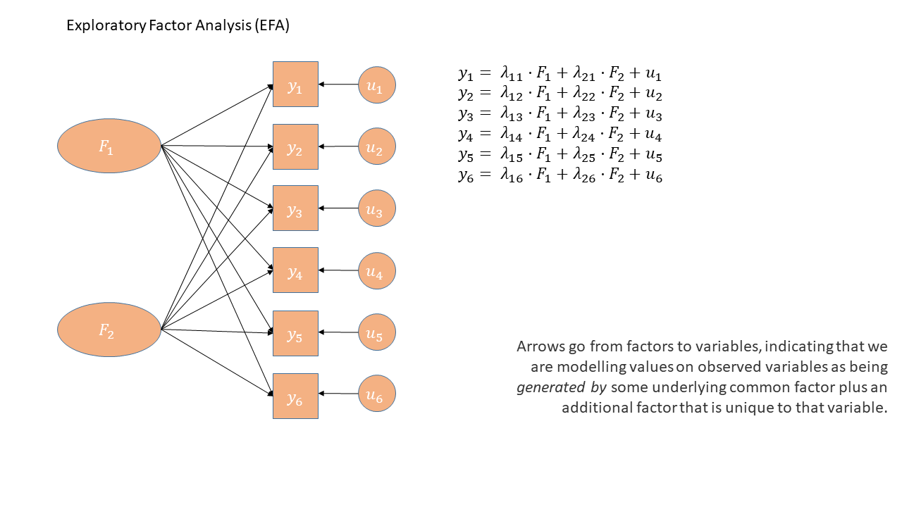
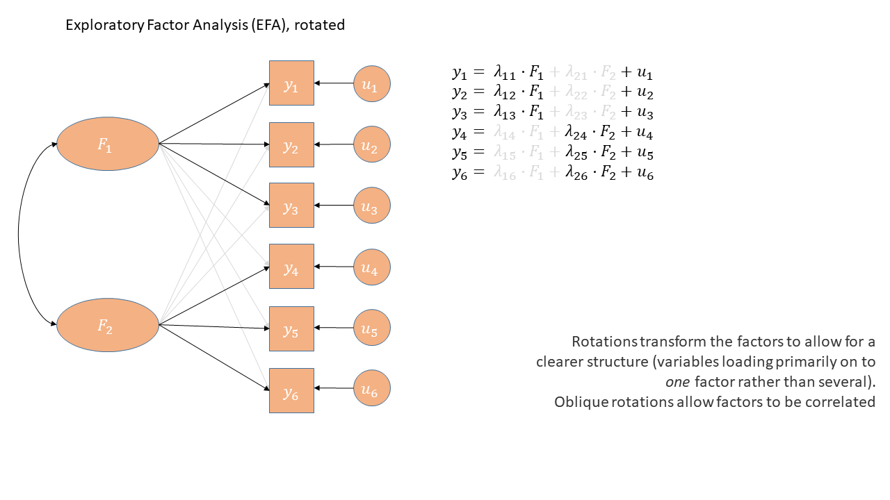
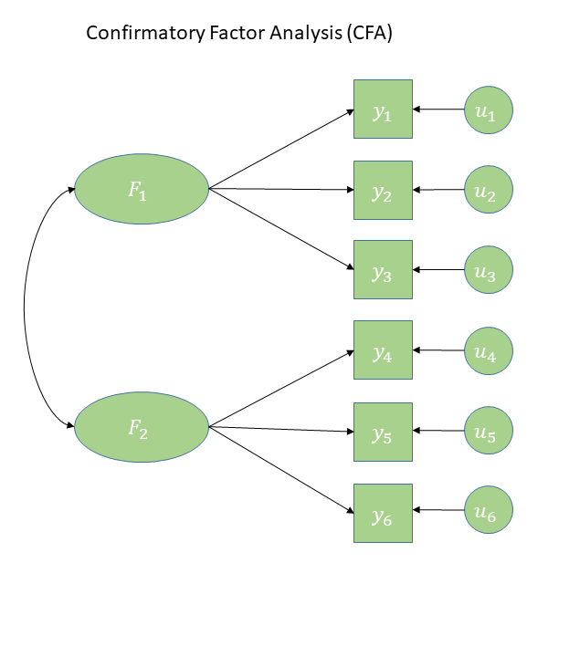
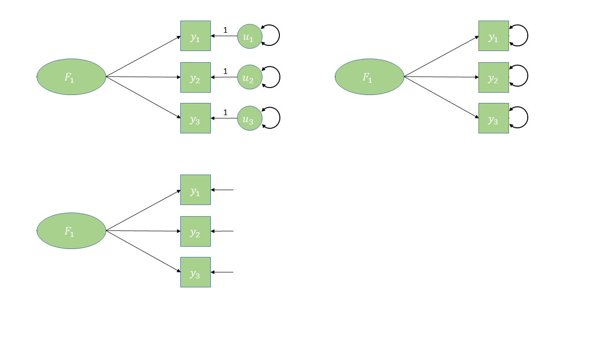
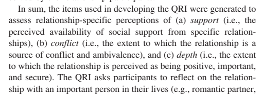
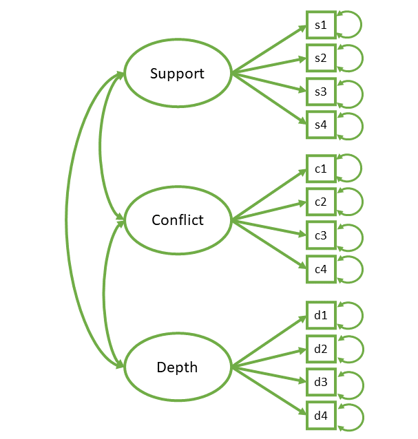
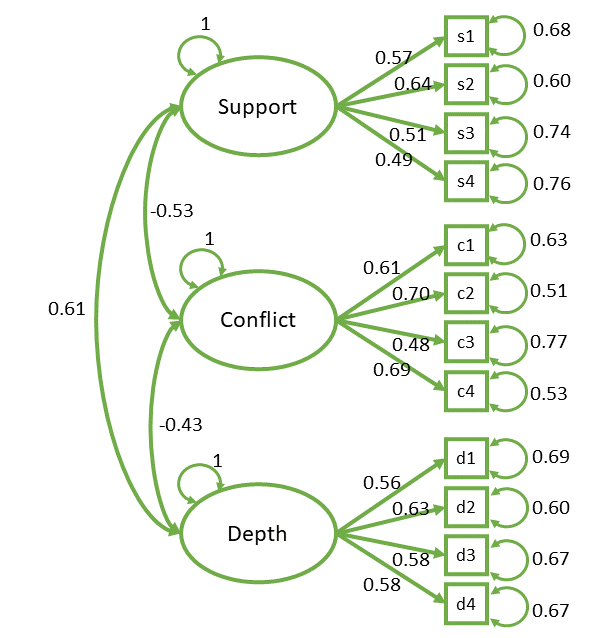
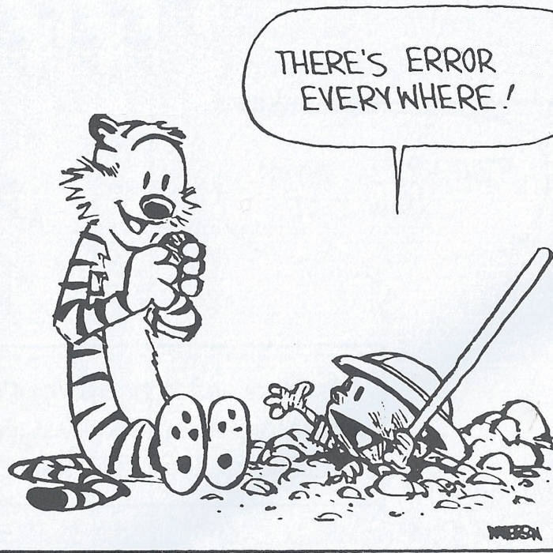
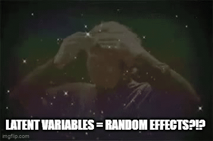
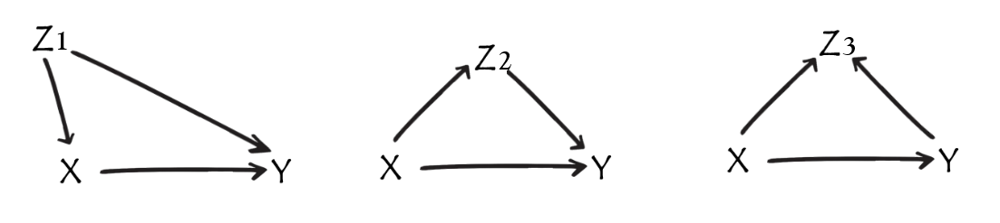

```{css, echo = FALSE}
.output {
max-height: 500px;
overflow-y: scroll;
}
```


```{r setup, include=F}
library(tidyverse)
library(patchwork)
library(psych)
source('_theme/theme_quarto.R')

theme_set(theme_quarto(title_font_size=42))
theme_update(
  text = element_text(family = 'Source Sans 3')
)

dapr3green <- "#88B04B" 
dapr3dkgreen <- "#5C7C28"
dapr3ltgreen <- "#E5EED7"
pal <- c( "#d35269", "#5c9ead","#2a3c24", "#F5C396", "#8B2635",  "#235789")
```

# Course Overview {background-color="white"}

<br>

```{r echo=F}
#| results: "asis"
block1_name = "Linear Mixed Models<br>(with Elizabeth Pankratz)"
block1_lecs = c("Regression refresher, intro to group-structured data",
                "TODO",
                "TODO",
                "TODO",
                "recap")
block2_name = "Factor Analysis<br>working with multi-item measures<br>(with Josiah King)"
block2_lecs = c(
  "measurement and dimensionality",
  "exploring underlying constructs (EFA)",
  "testing theoretical models (CFA)",
  "reliability and validity",
  "recap & exam prep"
  )

source("https://raw.githubusercontent.com/uoepsy/junk/refs/heads/main/R/course_table.R")
course_table(block1_name,block2_name,block1_lecs,block2_lecs,week=8)
```


## Week 8 TR;DL

- PCA just takes a set of observed variables and reduces.
    - components are just weighted summaries. 
    - we don't really care about *why* variables are correlated.
- EFA is a **model** of underlying 'latent variables/factors' that give rise to responses on observed variables
    - the underlying factors are assumed to be real (unobservable) things
    - the whole idea is to figure out how many/what they are
- we explore different models (e.g., 1 factor, 2 factor, 3 factor) to understand what our measurement tool captures
- the "best" model is a combination of
    - variance explained
    - "simple structure" (clear patterns of loadings)
    - theoretical coherence

# This week {transition="slide"}

- CFA vs EFA
- CFA in R (lavaan)
- Model fit
- Model modification
- the gateway to SEM

# from EFA to CFA {transition="slide"}

## What... is your quest?  


::: columns
::: {.column width="33%"}
<center>**PCA**</center>

- Reduce reduce reduce! 
- get some scores 

:::
::: {.column width="33%"}
<center>**EFA**</center>

- **learn** about/model the underlying cause(s)
- (optional) estimate some scores


:::
::: {.column width="33%"}
:::{.fragment}
<center>**CFA**</center>

- theory testing: formally test if data fits with the *a priori* factor model
- (extensions) incorporate model measurement directly in your analysis


:::
:::
:::

## In diagrams: EFA




## In diagrams: EFA (oblique rotation)



## In diagrams: CFA


## In diagrams: CFA

::::{.columns}
:::{.column width="50%"}

:::
:::{.column width="50%"}

- Some arrows are absent
- This is what imposes our theory

:::{.fragment}
- The reason that $y_1$ and $y_2$ are correlated is because:  
    - they both represent $F_1$  
- The reason that $y_1$ and $y_6$ are correlated is because:
    - $y_1$ is a manifestation of $F_1$,
    - $y_6$ is a manifestation of $F_2$, 
    - and $F_1$ and $F_2$ are correlated  
:::

:::
::::

<!-- ## aside: residuals in CFA diagrams -->

<!-- different ways people choose to draw the same thing...   -->

<!--  -->


# CFA in R {transition="slide"}

## The steps of CFA^[and Structural Equation Modelling (SEM) in general]

::::{.columns}
:::{.column width="50%"}

1. measures, assumptions, data [<<<<<<<]{.fragment fragment-index=2}
2. specification
3. identification
4. estimation
5. fit
6. possible respecification **&#x26A0;**	
7. interpretation

:::
:::{.column width="50%" .fragment fragment-index=2}

for our purposes:

- $\geq 3$ items per factor
- items treated as continuous
- linearity of `item ~ factor`
- independent observations
- any missing data is missing purely at random
    
    
*(all of these things can be relaxed with more advanced methods)*

:::
::::


## The steps of CFA^[and Structural Equation Modelling (SEM) in general]

1. measures, assumptions, data
2. **specification**
3. identification
4. **estimation**
5. fit
6. possible respecification **&#x26A0;**	
7. interpretation


## the lavaan package

- "**la**tent **va**riable **an**alysis"  

- general modelling framework that estimates models that may include latent variables  

## Typically done in 2 steps   

::::{.columns}
:::{.column width="50%"}
Previously:  

- `lm(formula, data)`
- `glm(formula, data)`
- `lmer(formula, data)`

:::
:::{.column width="50%"}
With **lavaan**:   

- Specify model formula in quotation marks:  
`mymod <- "................"`  

- Estimate^[estimation is generally good ol' max likelihood!] formula with a fitting function such as:    
`mymod.est <- cfa(mymod, data)`


:::
::::

## lavaan operators

|  Formula type|  Operator|  Mnemonic|
|--:|--:|--:|
|  latent variable definition|  `=~`|  "is measured by"|
|  (residual) (co)variance |  `~~`|  "covaries with"|
|  regression |  `~`|  "is regressed on"|

::::{.columns}
:::{.column width="50%"}

:::
:::{.column style="width:50%;font-size:3em"}
<br>
<br>
```
F1 =~ y1 + y2 + y3
F2 =~ y4 + y5 + y6
F1 ~~ F2
```

:::
::::


## example: QRI  

```{r}
#| echo: false
library(lavaan)
qritems <- c("To what extent could you turn to this person for advice about problems?","To what extent could you count on this person for help with a problem?","To what extent can you really count on this person to distract you from your worries when you feel under stress?","To what extent can you count on this person to listen to you when you are very angry at someone else?","How often do you have to work hard to avoid conflict with this person?","How much do you argue with this person?","How much would you like this person to change?","How often does this person make you feel angry?","How positive a role does this person play in your life?","How significant is this relationship in your life?","How close will your relationship be with this person in 10 years?","How much would you miss this person if the two of you could not see or talk with each other for a month?")
  
dgp = "support =~ .725*s1 + .725*s2 + .7*s3 + .615*s4
conflict =~ .725*c1 + .675*c2 + .68*c3 + .67*c4
depth =~ .8*d1 + .79*d2 + .785*d3 + .68*d4
support ~~ -.57*conflict
support ~~ .63*depth
conflict ~~ -.5*depth
c2 ~~ .4*c4
"
set.seed(60298)
simulateData(dgp, sample.nobs = 374) |>
  apply(2, \(x) as.numeric(cut(x,7))) |> as.data.frame() -> qri
qri = qri[,sample(1:ncol(qri))]
```

::::{.columns}
:::{.column width="50%"}

:::
:::{.column width="50%"}

```{r}
#| echo: false
tibble(
  var = c(paste0("s",1:4),paste0("c",1:4),paste0("d",1:4)),
  wording = qritems
) |> gt::gt()
```

:::
::::

## example: QRI  


::::{.columns}
:::{.column width="35%"}

:::
:::{.column width="65%"}

:::{.codewindow .r}
qri data
```{r}
#| label: qri_dat
#| eval: false
#| echo: true
qri <- read.csv("https://uoepsy.github.io/data/qri.csv")
head(qri)
```
:::
```{r}
#| label: qri_dat
#| eval: true
#| echo: false
```

:::{.codewindow .r}
qri model
```{r}
#| label: qri_mod
#| eval: false
#| echo: true
mymod <- "
support =~ s1 + s2 + s3 + s4
conflict =~ c1 + c2 + c3 + c4
depth =~ d1 + d2 + d3 + d4

support ~~ conflict
support ~~ depth
conflict ~~ depth
"

mymod.est <- cfa(mymod, data = qri, std.lv = TRUE)
```
:::
```{r}
#| label: qri_mod
#| eval: true
#| echo: false
```

:::
::::

## example: QRI

::::{.columns}
:::{.column width="35%"}

:::
:::{.column width="65%"}

:::{.codewindow .r}
qri output
```{r}
#| eval: false
#| echo: true
summary(mymod.est, std = TRUE)
```
:::
```{r}
#| class: output
#| echo: false
summary(mymod.est, std = TRUE)
```

:::
::::

## two choices to make: 

1. on what scale are our latent variables?  

2. on what scale do we want our estimated parameters? 

## scaling latent variables

- latent variables are unobserved abstractions. 

- they have no intrinsic numeric scale, so we need to fix it to something 

__Options (when estimating):__  

a. fix latent variables to unit variance ($sd = 1$)  
    `cfa(model, data)`

b. fix loading of first item to 1 (thereby fixing it to the same scale as the first item)  
    `cfa(model, data, std.lv = TRUE)`


None of this changes the model. The fit will be identical


## standardising parameters

- models are estimated based on covariance matrix (everything in original units)

__Options:__  

a. keep variables in original units, keep latent variables on whatever scale they were fitted.  
    `parameterestimates(model)`  

b. partially standardised - rescale only the latent variables to unit variance ($sd = 1$). observed variables stay in their original units.  

c. completely standardised - rescale both observed variables and latent variables to unit variance ($sd = 1$). We get standardised factor loadings (like EFA) and factor covariances become correlations.  
    `standardizedSolution(model)`  


Everything, all at once: `summary(model, std = TRUE)`  
    provides `Estimate`, `std.lv`, and `std.all`

# model fit & idenfication {transition="slide"}

1. measures, assumptions, data
2. *specification  &#x2713;*
3. **identification**
4. *estimation  &#x2713;*
5. **fit**
6. possible respecification **&#x26A0;**	
7. interpretation

## what is model fit?

<br><br>

:::{.center-x}
"how well does my model reproduce my outcome?"
:::

## Previous models (lm, lmer):   

$$
\begin{align}
\text{outcome} &= \text{model} &+ \text{error} \\
\quad \\
\text{observed variable} & = \text{coefficients and predictor variables} &+ \text{error} \\
\quad \\
\text{observed variable} & = \text{model predicted values} &+ \text{error} \\
\end{align}
$$


## CFA^[and SEM]

$$
\begin{align}
\text{outcome} &= \text{model} &+ \text{error} \\
\quad \\
\text{observed covariance matrix} & = \text{model parameters} &+ \text{error} \\
\quad \\
\text{observed covariance matrix} & = \text{model implied covariance matrix} &+ \text{error} \\
\end{align}
$$

<!-- ## What are the model parameters?   -->

<!-- the estimated paths on the diagram!    -->

<!--  -->

## diagrams >> implied covs


## diagrams >> implied covs (2)


## diagrams >> implied covs


## identifiability


## identifiability (2)


## identifiability (3)


## identifiability (4)

Conceptually:  

- Back in linear regression world - with just two datapoints there is only one line we can draw.  
    - we start with 2 datapoints, and we estimate 2 things (intercept and slope).   
<br>

- In CFA world, the same applies for a factor with 3 'indicators' (items)  
    - we start with 6 values, and we estimate 6 things

<br>

To measure 'model fit' we need to observe more things than we estimate

## degrees of freedom  

::::{.columns}
:::{.column width="50%"}
__how many "knowns"?__  


- how many values in our covariance matrix?  

- for $k$ variables this is $\frac{k(k+1)}{2}$  

:::
:::{.column width="50%"}
__how many "unknowns"?__

- how many parameters are we estimating with our model?  
    
:::
::::

<br><br>

:::{.center-x}
degrees of freedom = knowns - unknowns
:::

## example: QRI

::::{.columns}
:::{.column width="50%"}
__how many "knowns"?__  

:::{.codewindow .r}
qri cov matrix
```{r}
#| label: qri_cov
#| eval: false
#| echo: true
cov(qri) |>
  round(2)
```
:::
:::{style="font-size:.7em"}
```{r}
#| label: qri_cov
#| eval: true
#| echo: false
```
:::

:::
:::{.column width="50%"}
__how many "unknowns"?__  


:::
::::


## example: QRI

::::{.columns}
:::{.column width="50%"}
__how many "knowns"?__  

**78** variances and covariances  

- 12 observed variables
- (12 x 13) / 2 = 78


:::
:::{.column width="50%"}
__how many "unknowns"?__  

**27** estimated parameters

- 12 factor loadings
- 12 residual variances
- 3 factor correlations
- ~~3 factor variances~~ (fixed to 1) 


:::
::::


## model fit

Pretty much all based on:  
$$
\begin{align}
\text{observed covariance matrix}\,\,\, vs \,\,\, \text{model implied covariance matrix}\\
\end{align}
$$

they typically also incorporate degrees of freedom (this represents model complexity/parsimony)  

## fit indices

there are loooooooaddds of different metrics...   

::::{.columns}
:::{.column width="50%"}
__"absolute fit"__  

"how far from perfect fit?"  

smaller is better  

| fit index | common threshold |
| ----------- | ---------------- |
|  RMSEA      |   <0.05      |
| SRMR |   <0.05/<0.08 |

:::
:::{.column width="50%"}
__"incremental fit"__  

"how much better than a null model^[the 'null model' here is one that has no paths between variables]?"  

bigger is better

| fit index | common threshold |
| ----------- | ---------------- |
|  TLI      |   >0.95      |
| CFI |   >0.95 |

:::
::::

<br><br>

:::{.dapr3callout}
**In R:**  

`fitmeasures(mymod.est)[c("rmsea","srmr","cfi","tli")]`  
```
 rmsea   srmr    cfi    tli 
0.0397 0.0467 0.9619 0.9508 
```
:::

# model respecification {transition="slide"}

1. measures, assumptions, data
2. *specification  &#x2713;*
3. *identification &#x2713;*
4. *estimation  &#x2713;*
5. *fit &#x2713;*
6. **possible respecification &#x26A0;**	
7. interpretation

## modification indices  

:::{.center-x}
"how much better would my model fit if we included parameter XXX?" 
:::

<br><br><br>

but.. 

- adding in any parameter will *always* improve model fit  
- we lose degrees of freedom (<span style="color: red;">&#x2B06;</span>model complexity, <span style="color: red;">&#x2B07;</span> model simplicity)
- we need any additions to be theoretically justified/supported

## modindices()

- `lhs`, `op`, `rhs` = the parameter
- `mi` = change in fit
- `epc`, `sepc.lv`, `sepc.all`, `sepc.nox` = expected value of parameter (under various forms of standardisation)


:::{.codewindow .r}
modindices
```{r}
#| eval: false
#| echo: true
modindices(mymod.est, sort = TRUE)
```
:::
```{r}
#| echo: false
#| class: output
modindices(mymod.est, sort = TRUE)
```


## modification indices

::::{.columns}
:::{.column width="50%"}


:::
:::{.column width="50%"}
```{r}
#| echo: false
library(gt)
tibble(
  var = c(paste0("s",1:4),paste0("c",1:4),paste0("d",1:4)),
  wording = qritems
) |> gt() |>
  tab_style(
    style = list(
      cell_fill(color = "#F9E3D6"),
      cell_text(style = "italic")
      ),
    locations = cells_body(
      columns = 1:2,
      rows = c(6,8)
    )
  )
```
:::
::::


## modification indices

Less contentious uses:  

- residual covariances for items within a factor
    - essentially asserts that the two observed variables share some of their specific variance  

More contentious uses:  

- adding cross-loadings (could argue that an item loading on two factors is not a clean indicator, and so should be removed)

- residual covariances for items on different factors - harder to defend

- changing paths between the latent variables - very definitely changing your theory! 
 


## &#x26A0; model modification is exploratory! &#x26A0;

:::{.center-xy}
re-specifying a model is no longer confirmatory

it is exploratory again! 

gaahhhh
:::

# interpretation {transition="slide"}

1. measures, assumptions, data
2. *specification  &#x2713;*
3. *identification &#x2713;*
4. *estimation  &#x2713;*
5. *fit &#x2713;*
6. *possible respecification &#x26A0; &#x2713;*	
7. **interpretation**

## CFA interpretation

there are so many parts to these models that often the "interpretation" such as it is, will boil down to:  

1. does it fit well? (and did you have to specify additional paths?)
2. are the standardised factor loadings "big enough"? (e.g., $>|.3|$)

And then the bit we might be more interested in, things like:  

- correlations between latent factors

# CFA is a gateway... {transition="slide"}

**stuff beyond here definitely won't be in the exam or in the quiz.**   


## Structural Equation Models (SEM)

SEM models generally have:

- a structural part (relations between constructs of interest) 
- a measurement part (a model of how each construct is measured)

It all gets estimated at once! 

::::{.columns}
:::{.column width="50%"}

:::
:::{.column style="width:50%;font-size:1.2em"}
```
# measurement model
Y =~ y1 + y2 + y3 + ...
X =~ x1 + x2 + x3 + ...
# regressions
Y ~ X + Z
# covariances
X ~~ Z
```
:::
::::

## Why SEM?

::::{.columns}
:::{.column width="40%"}

:::
:::{.column width="60%"}


1. Estimate paths between constructs while explicitly modelling measurement error
    - whenever we calculate/estimate a 'score' (scale scores, PCA scores, factor scores), and then use that in another analysis, we are assuming it is measured without error  
    
2. Offers a framework for testing theories (beyond just the CFA theories of measurement).  

:::

::::


## common uses of SEM

**"Nomological Net"**   
Do things correlate with other things we expect them to correlate with?  
*Good for assessing if our measure is measuring the thing we want it to measure!*


::::{.columns}
:::{.column width="50%"}

:::
:::{.column style="width:50%;font-size:1.2em"}
<br>
```
# measurement model
F1 =~ y1 + y2 + y3 + ...
F2 =~ x1 + x2 + x3 + ...
F3 =~ w1 + w2 + w3 + ...
# latent variable covariances
F1 ~~ F2
F1 ~~ F3
F2 ~~ F3
```
:::
::::


## common uses of SEM

**Measurement Invariance**  
Do factor loadings differ between groups/timepoints/contexts?

::::{.columns}
:::{.column width="50%"}

:::
:::{.column style="width:50%;font-size:1.2em"}
<br>
```
model <- "F1 =~ y1 + y2 + y3 + ..."
```
<br>
```
m1 <- cfa(model, data, group = "mygroups")
m2 <- cfa(model, data, group = "mygroups", 
                 group.equal = "loadings")  
  
semTools::compareFit(m1,m2)
```

:::
::::

## common uses of SEM

**Mediation**  
How much of X -> Y is because of X -> M and M -> Y?    

::::{.columns}
:::{.column width="50%"}


:::
:::{.column style="width:50%;font-size:1.2em"}
<br>
```
model <- "
  Y ~ a*M + c*X
  M ~ b*X
  indirect := a*b
  direct := c
"
```
```
sem(model, data)
```

:::
::::


:::{.myblock style="text-align:left;font-size:.7em"}

**&#x26A0;** mediation is almost always **incredibly** problematic. Many people will (possibly correctly) dismiss it altogether as useless because confounding is *everywhere*.  

Cross-sectional observational mediation is even worse ("three correlations in a trenchcoat"^[See Julia Rohrer's great blog post: https://www.the100.ci/2025/03/20/reviewer-notes-thats-a-very-nice-mediation-analysis-you-have-there-it-would-be-a-shame-if-something-happened-to-it/ ])


:::


## common uses of SEM

**Latent Growth Curves**  
The same as `lmer(Y ~ TimePoint + (1 + TimePoint | Person))`

::::{.columns}
:::{.column width="50%"}


:::
:::{.column style="width:50%;font-size:1.2em"}
<br>
```
model <- "
  int =~ 1*Time1 + 1*Time2 + 1*Time3 + ...
  slope =~ 0*Time1 + 1*Time2 + 2*Time3 + ...
  int ~~ slope
"
```
```
growth(model, data)
```



:::
::::

## the big big caution...   

- The idea of SEM originally is to build a model that reflects the theoretical data generating process  

- Too often, people force their data to a shape that fits with an off-the-shelf SEM structure  

- It's far too easy to estimate SEM models and report 'associations' while remaining blind to the strict causal assumptions required to give those paths real-world meaning

## diagrams

- diagrams are:  
  - for back of envelope thinking
  - for presenting to the reader your theory about how the data are generated

- SEM diagrams adhere to "covariance algebra" (linear paths imply a covariance matrix)
- diagrams more generally adhere to a system of formal logic of causality


## the logic of diagrams

::::{.columns}
:::{.column width="50%"}

::: {.r-stack}


{.fragment}
:::

:::
:::{.column width="50%"}

```{r}
#| echo: false
#| fig-width: 10
#| fig-height: 3.5
set.seed(700)
df = tibble(
  age = runif(100,18,80),
  mfull = rbinom(100,1,plogis(-scale(age)*1.2)),
  Anx = rnorm(100,110-1*age - 10*mfull,5)
) |> mutate(mfull=factor(mfull,levels=0:1,labels=c("N","Y")))
m2 = lm(Anx~age+mfull,df)
p1 = ggplot(df,aes(x=mfull,y=Anx,col=age))+
  geom_jitter(width=.1,height=0,
              size=2,alpha=.3)+
  stat_summary(geom="pointrange",fatten=.5,
               position=position_nudge(x=.23))

p2 = ggplot(df,aes(x=age,y=Anx,col=mfull))+
  geom_point(size=3,alpha=.6)+
  geom_abline(intercept=coef(m2)[1],
              slope=coef(m2)[2],
              lwd=1,col="tomato")+
  geom_abline(intercept=coef(m2)[1]+coef(m2)[3],
              slope=coef(m2)[2],
              lwd=1,col="skyblue2")
```

::: {.r-stack}
:::{.fragment}
```{r}
#| echo: false
#| fig-width: 10
#| fig-height: 7.5
p1 + labs(title="lm(Anx~Mfull)")
```
:::
:::{.fragment}
```{r}
#| echo: false
#| fig-width: 10
#| fig-height: 7.5
p2 + labs(title="lm(Anx~age+Mfull)")
```
:::
:::

:::
::::


## the logic of diagrams


::::{.columns}
:::{.column width="50%"}

::: {.r-stack}


{.fragment}
:::

:::
:::{.column width="50%"}

```{r}
#| echo: false
set.seed(62)
df = tibble(
  age = runif(100,18,80),
  mfull = rbinom(100,1,.5),
  Anx = rnorm(100,110-1*age - 10*mfull,5)
) |> mutate(mfull=factor(mfull,levels=0:1,labels=c("N","Y")))
m2 = lm(Anx~age+mfull,df)
p1 = ggplot(df,aes(x=mfull,y=Anx,col=age))+
  geom_jitter(width=.1,height=0,
              size=2,alpha=.3)+
  stat_summary(geom="pointrange",fatten=.5,
               position=position_nudge(x=.23))

p2 = ggplot(df,aes(x=age,y=Anx,col=mfull))+
  geom_point(size=3,alpha=.6)+
  geom_abline(intercept=coef(m2)[1],
              slope=coef(m2)[2],
              lwd=1,col="tomato")+
  geom_abline(intercept=coef(m2)[1]+coef(m2)[3],
              slope=coef(m2)[2],
              lwd=1,col="skyblue2")
```

::: {.r-stack}
:::{.fragment}
```{r}
#| echo: false
#| fig-width: 10
#| fig-height: 7.5
p1 + labs(title="lm(Anx~Mfull)")
```
:::
:::{.fragment}
```{r}
#| echo: false
#| fig-width: 10
#| fig-height: 7.5
p2 + labs(title="lm(Anx~age+Mfull)")
```
:::
:::

:::
::::


## the logic of diagrams

::::{.columns}
:::{.column width="50%"}

::: {.r-stack}

:::

:::
:::{.column width="50%"}

```{r}
#| echo: false
set.seed(44)
df = tibble(
  mfull = rbinom(100,1,.5),
  sleep = rnorm(100,+3*mfull,1),
  Anx = rnorm(100,60-3.5*sleep,5)
) |> mutate(mfull=factor(mfull,levels=0:1,labels=c("N","Y")))
m2 = lm(Anx~sleep+mfull,df)
p1 = ggplot(df,aes(x=mfull,y=Anx))+
  geom_jitter(width=.1,height=0,
              size=2,alpha=.3)+
  stat_summary(geom="pointrange",fatten=.5,
               position=position_nudge(x=.23))

p2 = ggplot(df,aes(x=sleep,y=Anx,col=mfull))+
  geom_point(size=3,alpha=.6)+
  geom_abline(intercept=coef(m2)[1],
              slope=coef(m2)[2],
              lwd=1,col="tomato")+
  geom_abline(intercept=coef(m2)[1]+coef(m2)[3],
              slope=coef(m2)[2],
              lwd=1,col="skyblue2")
```

::: {.r-stack}
:::{.fragment}
```{r}
#| echo: false
#| fig-width: 10
#| fig-height: 7.5
p1 + labs(title="lm(Anx~Mfull)")
```
:::
:::{.fragment}
```{r}
#| echo: false
#| fig-width: 10
#| fig-height: 7.5
p2 + labs(title="lm(Anx~sleep+Mfull)")
```
:::
:::

:::
::::

## the logic of diagrams

to estimate the "effect of X on Y", we need to isolate the flow of information from X to Y, along only the path(s) we are interested in.  

{width="1000px"}

::::{.columns}
:::{.column width="33%"}

- path x&larr;z1&rarr;y is open
- controlling for z1 closes it  

:::
:::{.column width="33%"}

- path x&rarr;z2&rarr;y is open
- controlling for z2 closes it

:::
:::{.column width="33%"}

- path x&rarr;z3&larr;y is closed
- controlling for z3 opens it

:::
::::

:::{.fragment}
most common interpretation of "effect of X on Y": what happens to Y when X changes?  

- close the back-doors, keep causal front-doors open
- control for z1, don't control for z2 or z3. 

:::


## the logic of diagrams

- diagrams can help us figure out what to control for (and what not to control for)

- can help you consider (and be transparent about) limitations


:::{.aside}

For more on this, see:  

- Wysocki, A. C., Lawson, K. M., & Rhemtulla, M. (2022). Statistical control requires causal justification. Advances in Methods and Practices in Psychological Science, 5(2), 25152459221095823.
- Rohrer, J. M. (2024). Causal inference for psychologists who think that causal inference is not for them. Social and Personality Psychology Compass, 18(3), e12948.
- Cinelli, C., Forney, A., & Pearl, J. (2024). A crash course in good and bad controls. Sociological Methods & Research, 53(3), 1071-1104.
- VanderWeele, Tyler J. (2019). Principles of Confounder Selection. European Journal of Epidemiology 34 (3): 211–19.

:::

## the grey area

quite often... 

1. ask a question that is at least implicitly causal

2. do analysis, controlling for some stuff (often without clearly discussing why)

3. report "associations"

4. draw implicitly causal conclusions

5. emphasise everything is just correlations so can't make any causal conclusions, to maintain plausible deniability

## the grey area {.smaller}

- it's not clear what people actually mean by "x is associated with y"  

::::{.columns}
:::{.column width="25%"}
**Descriptive Qs**

- "does X tend to appear with Y?"  

if so, we probably don't want to control for other things.  


:::
:::{.column width="2%"}
:::
:::{.column width="46%"}
**Causal Qs**  

- "does X cause Y?"

we want to control for the things that allow us to get an unbiased estimate of what would happen to an observation's Y value if its X value changed.  

**Implicitly Causal Qs**  

- "does X influence Y?"
- "does X affect Y?"
- "does X explain Y?"
- "does X prevent Y?"
- "is Y due to X?"
- "does X increase/decrease Y?"
- "does X protect against Y?"
- "does X improve Y?"
- "does X make Y?"

:::
:::{.column width="2%"}
:::
:::{.column width="25%"}
**Associational Qs**  

- ???? 

:::
::::

## can of worms

:::{.center-xy}
{width="1000px"}
:::


