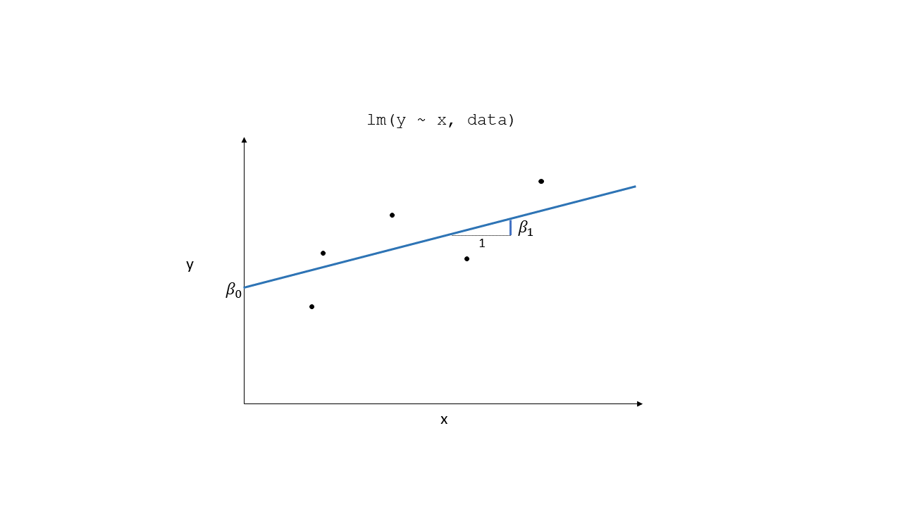
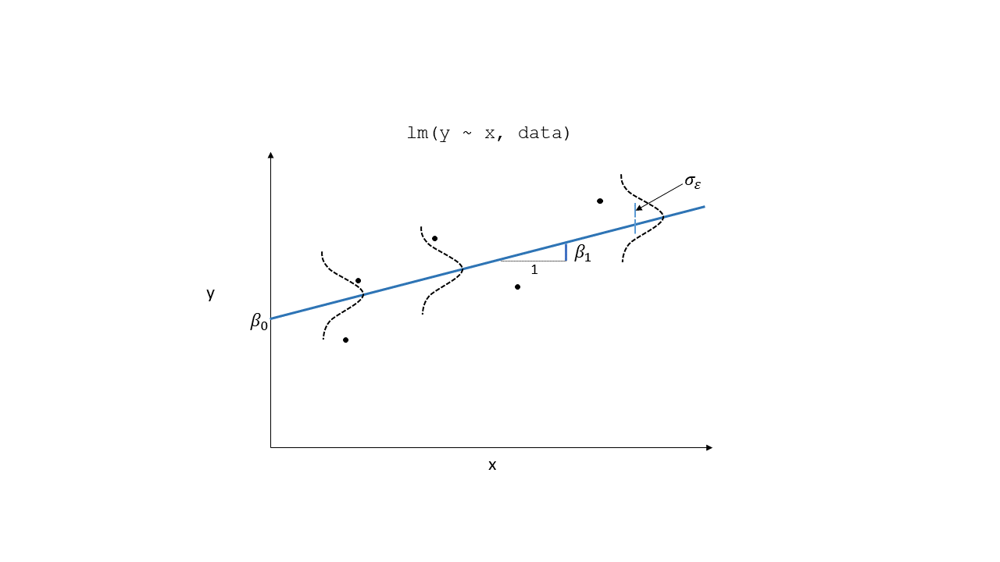
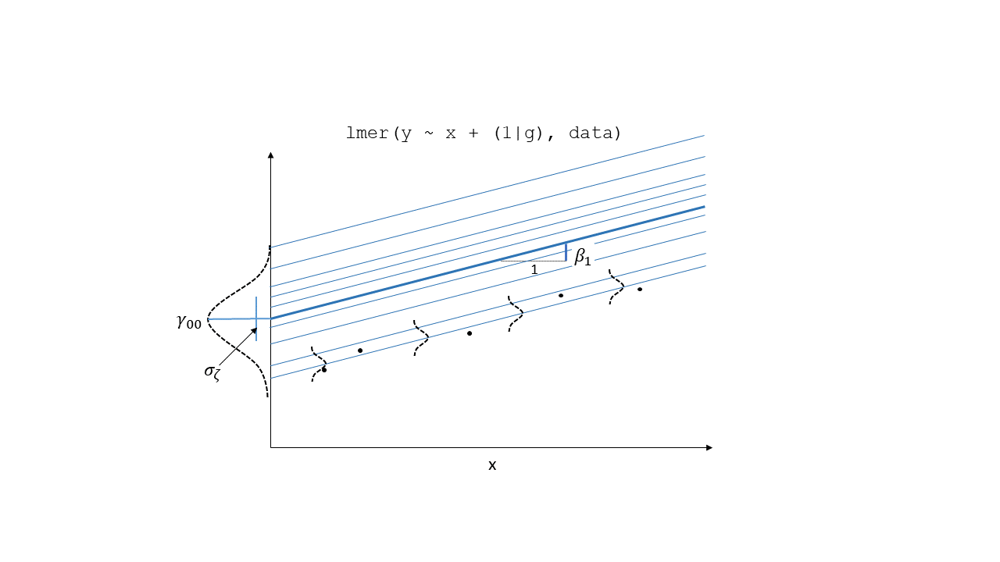
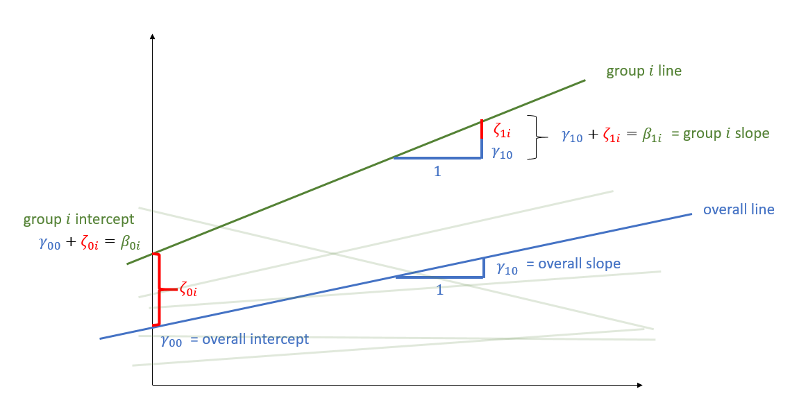

```{r setup, include=FALSE}
library(knitr)
library(tidyverse)
library(ggplot2)
library(kableExtra)
library(patchwork)

xaringanExtra::use_share_again()
xaringanExtra::use_xaringan_extra(c("tile_view","animate_css","tachyons"))
xaringanExtra::use_extra_styles(
  mute_unhighlighted_code = FALSE
)
knitr::opts_chunk$set(
  dev = "svg",
  warning = FALSE,
  message = FALSE,
  cache = FALSE,
  fig.asp = .8
)

options(htmltools.dir.version = FALSE)
options(digits=4,scipen=2)
options(knitr.table.format="html")

theme_set(
    theme_minimal() + 
    theme(text = element_text(size=20))
)

source("jk_source/jk_presfuncs.R")

library(xaringanthemer)

style_mono_accent(
  base_color = "#88B04B", # DAPR3 
  header_color = "#000000",
  header_font_google = google_font("Source Sans Pro"),
  header_font_weight = 400,
  text_font_google = google_font("Source Sans Pro", "400", "400i", "600", "600i"),
  code_font_google = google_font("Source Code Pro"),
  code_font_size = "0.7rem",
  extra_css = list(".scroll-output" = list("height"="90%","overflow-y"="scroll"))
)
```

???
- this morning, we're going to talk about assumptions that underly drawing inferences from our multilevel models

---
# Assumptions in LM

.pull-left[
#### The general idea

- $\varepsilon_i \sim N(0,\sigma^2)$ iid
- "zero mean and constant variance"

```{r echo=FALSE, fig.asp=.7}
set.seed(20)
tibble(
  fitted_values = 1:1000,
  residuals = rnorm(1000,0,20)
) -> plotdat

bb = seq(0,975,10)
map_dbl(bb, ~filter(plotdat, between(fitted_values, ., .+10)) %>% summarise(s=sd(residuals)) %>% pull(s)) %>% 
cbind(fitted_values = bb + 5, sd = .) %>%
  cbind(., m = map_dbl(bb, ~filter(plotdat, between(fitted_values, ., .+10)) %>% summarise(m = mean(residuals)) %>% pull(m))) %>% as_tibble %>% mutate(
    u = m + sd*2,
    l = m - sd*2
  ) -> prib


ggplot(plotdat, aes(x=fitted_values, y=residuals))+
  geom_point(alpha=.3) + 
  geom_smooth(se=F)+
  geom_smooth(data=prib, inherit.aes = F,
              aes(x=fitted_values,y=u), alpha=.3, se=F, lty="dashed", col="darkorange")+
  geom_smooth(data=prib, inherit.aes = F,
              aes(x=fitted_values,y=l), alpha=.3, se=F, lty="dashed", col="darkorange")+
  theme(axis.text = element_blank())
```

]

???
- as usual, let's remind ourselves of simple LM
- broad idea: 
  - structural model part (beta, explanatory variables) are what specify systematic relationships. 
  - the residual, the epsilon bit, is, we hope, just leftover randomness. 
- our "assumptions" are primarily concerned with checking that our residuals look random (that we haven't missed out something systematic). 

- zero mean and constant variance, across the fitted values of the model


--

.pull-right[
#### Recipe book

+ **L**inearity
+ **I**ndependence
+ **N**ormality
+ **E**qual Variances

]

???

- more formulaic approach:
  - linearity
  - independence
  - normality
  - and equal variance of error

---
# Question: What's different in MLM?

--

## Answer: Not much!  

--

- General idea is unchanged: error is random  

- But we now have residuals at multiple levels! 
Random effects can be viewed as residuals at another level.  


???

- nothing changes in the big picture when we move to the multilevel model.  
- our "checks" are still focusing on the residuals
  - homoscedasiticity of the error term
  - normality of the error term’s distribution.  
  
- the key difference is that we now have residuals at multiple levels! 


---
# Resids

```{r echo=FALSE, fig.align="left", fig.asp=.5}

```

---
# Resids (2)

```{r echo=FALSE, fig.align="left", fig.asp=.5}

```

---
# Resids (3)

```{r echo=FALSE, fig.align="left", fig.asp=.5}

```


---
# Random effects as level 2 residuals

```{r echo=FALSE, fig.align="left", fig.asp=.5}

```

???
remember that the random effects are normally distributed with a mean of 0. 
the blue line here is the fixed effect, and the lines for each cluster are in green. 
the deviations for each cluster from the overall slope are in red. we have a deviation for the intercept, and a deviation for the slope. 
the model is estimating the variance of all these deviations, and assumes them to be normally distributed. 
just like a residual, but at a higher level. 
this fits with the idea that when specifying random effects, we are treating our level 2 groups as if they are a random sample from a larger population of these level 2 units. because we treat them as a random sample, we expect random deviations for each group. 

---
count:false
# Random effects as level 2 residuals

```{r echo=FALSE, fig.align="left", fig.asp=.5}
knitr::include_graphics("jk_img_sandbox/lmmwdot.png")
```

???
in additional to these level 2 residuals, we have the level 1 residuals. these are the random deviations of the lower level observations around each cluster specific line.  
so if we imagine we have randomly sampled some children from a random sample of schools, then we can think of each line as a school, and each school has a random deviation. some schools are higher on the outcome, some lower. some have steeper slopes, some less steep. 
then within each school, the randomly sampled children will deviate randomly around that schools specific line. some children will be higher than expected for that school, some lower etc. 


---
# Random effects as level 2 residuals

$$
\begin{align}
& \text{for observation }j\text{ in group }i \\ 
\quad \\ 
& \text{Level 1:} \\ 
& \color{red}{y_{ij}} = \color{blue}{\beta_{0i} \cdot 1 + \beta_{1i} \cdot x_{ij}} + \varepsilon_{ij} \\ 
& \text{Level 2:} \\ 
& \color{blue}{\beta_{0i}} = \gamma_{00} + \color{orange}{\zeta_{0i}} \\ 
& \color{blue}{\beta_{1i}} = \gamma_{10} + \color{orange}{\zeta_{1i}} \\ 
\quad \\ 
& \varepsilon, \, \color{orange}{\zeta_0}, \, \text{ and } \, \color{orange}{\zeta_1}\text{ are all assumed to be normally distributed with mean 0.}
\end{align}
$$


???
We can see this also in our model equations. 
in this example, with a random intercept and random slope, we have the level 1 equation, with the random part (the epsilon), 
and then with the level 2 equations, we have the random part, the zeta. 
and because we are assuming these to be random, we are assuming them to be normally distributed with mean of 0

---
count:false
# Random effects as level 2 residuals
<!-- > 200 pupils from 20 schools completed a survey containing the Emotion Dysregulation Scale (EDS) and the Child Routines Questionnaire (CRQ). Eight of the schools were taking part in an initiative to specifically teach emotion regulation as part of the curriculum. Data were also gathered regarding the average hours each child slept per night. -->
```{r echo=FALSE}
library(sjPlot)
library(lme4)
crq <- read_csv("https://uoepsy.github.io/data/crqdata.csv")
crq %>% mutate(
  y = emot_dysreg,
  x1 = crq,
  x2 = int, 
  x3 = age, 
  cluster = gsub("school","cluster",schoolid)
) %>% filter(!schoolid %in% c("school6","school15", "school17")) -> df
full_model<-lmer(y ~ x1 * x2 + x3 + (1 + x1 | cluster), data = df)
model <- full_model
pp <- plot_model(full_model, type = "diag")
```


.pull-left[

$\varepsilon$  
`resid(model)`  
mean zero, constant variance  
<br><br>
```{r echo=FALSE, fig.asp=.5, out.width="400px"}
pp[[1]]
```

]

???
recall that in a QQplot, we are plotting our observed data, in against the theoretical quantiles of the normal distribution. So if we have 100 residuals, then each one is plotted against the 1st, 2nd, 3rd, and so on percentile of the standard normal distribution.
so we have the level 1 residuals...

--

.pull-right[
$\color{orange}{\zeta}$  
`ranef(model)`  
mean zero, constant variance  

```{r echo=FALSE, fig.asp=.5, out.width="400px"}
pp[[2]]
```

]

???
and we have the level 2 residuals. our random effects.

---
# Assumption Plots: Residuals vs Fitted

```{r fig.asp=.6}
plot(model, type=c("p","smooth"))
```

???
so let's look at some different visualisations that we can use to assess the extent to which we believe our assumptions to hold.   
first off, we have the residuals vs fitted plot. so these are our  residuals (our level 1 residuals, that is) on the y axis, and the fitted values of the model on the x. across the fitted values of the model, we want our residuals to have a mean of zero.  
the smooth here provides an indication of this. 

---
# Assumption Plots: qqplots

```{r fig.asp=.6}
qqnorm(resid(model))
qqline(resid(model))
```

???
we've already seen qqplots.  
the lattice package has a nice functionality for labelling the extreme ends of the distribution.  


---
# Assumption Plots: Scale-Location

```{r fig.asp=.6}
plot(model, 
     form = sqrt(abs(resid(.))) ~ fitted(.),
     type = c("p","smooth"))
```

???
scale location or, spread location, is a similar plot to the residuals vs fitted. 
however, in this one  the y axis is the sqrt of the absolute value of the residuals. 
if you think a second about what this is doing, it is removing any negative sign, and squarerooting to normalise it. 
what this means is that the mean of the sqrt abs residuals will reflect changes in the spread/variance of the residuals. 


---
count:false
# Assumption Plots: Scale-Location

```{r fig.asp=.6}
plot(model, 
     form = sqrt(abs(resid(.))) ~ fitted(.) | cluster,
     type = c("p"))
```

???
We can can also group these plots by cluster, which makes most sense if we have lots of data within our clusters, and means we can evaluate the extent to which certain clusters might have non-constant variance

---
# Assumption Plots: Ranefs

.pull-left[
```{r fig.asp=.7, echo=c(2:5)}
par(mfrow=c(1,2))
qqnorm(ranef(model)$cluster[,1])
qqline(ranef(model)$cluster[,1])
qqnorm(ranef(model)$cluster[,2])
qqline(ranef(model)$cluster[,2])
par(mfrow=c(1,1))
```
]
.pull-right[
```{r eval=FALSE}
rans <- as.data.frame(ranef(model)$cluster)

ggplot(rans, aes(sample = `(Intercept)`)) + 
  stat_qq() + stat_qq_line() +
  labs(title="random intercept")

ggplot(rans, aes(sample = x1)) + 
  stat_qq() + stat_qq_line()
  labs(title="random slope")
```
```{r echo=FALSE, fig.asp=.4}
rans <- as.data.frame(ranef(model)$cluster)
ggplot(rans, aes(sample = `(Intercept)`)) + 
  stat_qq() + stat_qq_line() +
  labs(title="random intercept") + 
ggplot(rans, aes(sample = x1)) + 
  stat_qq() + stat_qq_line()+
  labs(title="random slope")
```

]

???
for our random effects, our random intercepts and random slopes, we can also assess their normality. 
to get the qqline, we have to actually extract the random effects, and then plot them manually. 

---
# for a quick check

```{r}
performance::check_model(model)
```

???
there are various packages which can spit out a selection of figures. 
in general, we recommend constructing plots and assessing things in such a way that you are more in control of what you are plotting. this is because it forces us to think a little more, rather than adopting a point-and-click approach. 
if you DO just want to do a quick once-over, then the familiar plot_model function from the sjPlot package has a nice option to set type = "diag" (for diagnostics) to give you these figures.

---

class: inverse, center, middle

<h2><b style="opacity:0.4;">Part 1: Assumptions </b><b>Troubleshooting</b></h2>
<h2 style="text-align: left;opacity:0.3;">Part 2: Case Diagnostics in MLM</h2>

???
we're now going to take a look at how we might troubleshoot when our assumptions appear to be violated


---
# Our Data

```{r echo=FALSE}
d3 <- read_csv("https://uoepsy.github.io/data/dapr3_mindfuldecline.csv")
```

.pull-left[
> In a study examining how cognition changes over time, a sample of 20 participants took the Addenbrooke's Cognitive Examination (ACE) every 2 years from age 60 to age 78.  

<small>Each participant has 10 datapoints. Participants are clusters.</small>  

```{r}
d3 <- read_csv("https://uoepsy.github.io/data/dapr3_mindfuldecline.csv")
head(d3)
```

```{r}
library(ICC)
ICCbare(x = ppt, y = ACE, data = d3)
```
]
.pull-right[
```{r echo=FALSE, fig.align="center", fig.asp=.9}
library(ggExtra)
library(patchwork)
p <- ggplot(d3[d3$condition=="control",], aes(x=visit, y=ACE, col=ppt)) + 
  geom_point()+geom_smooth(method="lm",se=F)+
  guides(col="none")+
  labs(title="Control")
p1 <- ggplot(d3[d3$condition=="mindfulness",], aes(x=visit, y=ACE, col=ppt)) + 
  geom_point()+geom_smooth(method="lm",se=F)+
  guides(col="none")+
  labs(title="Mindfulness")
gridExtra::grid.arrange(
ggMarginal(p, type="boxplot", margins="y"),
ggMarginal(p1, type="boxplot", margins="y"),
nrow=1
)
```
]

???
- same data as previously seen. cognition over series of visits
- now we have 10 participants in a control condition, and 10 in an intervention

---
# When things look wrong

```{r}
mymodel <- lmer(ACE ~ visit * condition + (1 | ppt), data = d3)
performance::check_model(mymodel)
```


???


---
# When things look wrong
### __Model mis-specification?__

.pull-left[
```{r eval=F}
mymodel <- lmer(ACE ~ visit * condition +
                  (1 | ppt), data = d3)
```

```{r echo=FALSE, fig.asp=.6}
mymodel <- lmer(ACE ~ visit * condition +
                  (1 | ppt), data = d3)
performance::check_model(mymodel, check = c("linearity","homogeneity"))
```
]
.pull-right[
```{r eval=F}
mymodel <- lmer(ACE ~ visit * condition +
                  (1 + visit | ppt), data = d3)
```

```{r echo=FALSE, fig.asp=.6}
mymodel <- lmer(ACE ~ visit * condition + 
                  (1 + visit | ppt), data = d3)
performance::check_model(mymodel, check = c("linearity","homogeneity"))
```
]

???
now it may well be that we have omitted an important variable or relationship here. It could be we are missing an interaction, or it could even be that our model is missing something systematic which has a large effect on emotion dysregulation, in this case we are missing the child's age. 
so one of the first things i recommend thinking about when faced with a model that doesn't appear to meet assumptions, is "is my model sensible?"
by "sensible" here i am meaning that theory should play a part. don't simply include any and all variables that have a statistically significant relationship with your outcome variable - try to think about what makes theoretical sense as influencing your outcome. that's not to say that you should pointblank ignore a significant interaction because it doesn't make theoretical sense, simply that theory has a large part to play here. 

---
# When things look wrong
### __Transformations?__  

- Transforming your outcome variable may help to satisfy model assumptions

???
another thing you MIGHT want to do in order to build a model that meets assumptions, is to transform your outcome variable.

--

  - log(y)
  - 1/y
  - sqrt(y)
  - forecast::BoxCox(y)

???
there are various transformations but the more common ones you will see are these, which shift the distribution left/right to varying degrees.
  

---
# When things look wrong
### __Transformations?__  

```{r include=F}
set.seed(1166050148)
d = c()
for(i in 1:10){
  x=rnorm(rdunif(1,6,12), 0, 1)
  g=sample(0:1,1)
  xmat=cbind(1,x,g)
  lp = xmat %*% c(rnorm(1,10,2), rnorm(1,2,2), 1)
  d = rbind(d, cbind(xmat, lp, i))
}
df <- as_tibble(d[,2:5])
names(df) <- c("x1","g","y","cluster")
df$y <- df$y + sn::rsn(nrow(df),0,30,50)
df<-df[-c(37,47, 65, 68, 82 ), ]
```


- Transforming your outcome variable may help to satisfy model assumptions


.pull-left[
```{r eval=F}
lmer(y ~ x1 + g + 
       (1 | cluster), df)
```
```{r echo=FALSE, fig.asp=.5}
model <- lmer(y ~ x1 + g + (1  | cluster), df)
pp <- plot_model(model, type = "diag")
ggplot(df, aes(x=y)) + geom_histogram() +
pp[[1]] & theme(text = element_text(size=12))
```

]
.pull-right[
```{r eval=F}
lmer(forecast::BoxCox(y,lambda="auto") ~ x1 + g + 
       (1 | cluster), df)
```
```{r echo=FALSE, fig.asp=.5}
model <- lmer(forecast::BoxCox(y,lambda="auto") ~ x1 + g + (1 | cluster), df)
pp <- plot_model(model, type = "diag")
ggplot(df, aes(x=forecast::BoxCox(y,lambda="auto"))) + geom_histogram() +
pp[[1]] & theme(text = element_text(size=12))
```
]

???
so here we have a model of an untransformed y variable, and on the right we have applied a boxcox transform. 
remember that our assumptions are about our residuals, NOT our outcome variable, so a non-normal outcome variable does not mean your model residuals will be non-normal. 


---
count:false
# When things look wrong
### __Transformations?__  

- Transforming your outcome variable may help to satisfy model assumptions **but it comes at the expense of interpretability.**  

.pull-left[
```{r eval=F}
lmer(y ~ x1 + g + 
       (1 | cluster), df)
```
```{r echo=FALSE}
model <- lmer(y ~ x1 + g + (1 | cluster), df)
fixef(model)
```

]
.pull-right[
```{r eval=F}
lmer(forecast::BoxCox(y,lambda="auto") ~ x1 + g + 
       (1 | cluster), df)
```
```{r echo=FALSE}
model <- lmer(forecast::BoxCox(y,lambda="auto") ~ x1 + g + (1 | cluster), df)
fixef(model)
```
]

???
personally i tend to avoid transformations for the very fact that we are changing what we are modelling. 
so although we may get a better looking model, it is a model of something else. 
in this model i know that the coefficient for g is saying that an increase in 1 on g is associated with an increase in 10 units of y. 
but in the right hand model, we are saying that it is associated with an increase of .05 on y to the power of lambda, whatever lambda is selected as. 
so the main thing with transformations is that because you are modelling y on a different scale, you are changing the interpretation considerably. 

---
count:false
class: extra
exclude: true
# When things look wrong
### __robustlmm__

.pull-left[
```{r eval=FALSE}
mymodel <- lmer(ACE ~ visit * condition + (1 | ppt), data = d3)
summary(mymodel)$coefficients
```
]
.pull-right[
```{r eval=FALSE}
library(robustlmm)
mymodelr <- rlmer(ACE ~ visit * condition + (1 | ppt), data = d3)
summary(mymodelr)$coefficients
```
]


---
# When things look wrong

### __Bootstrap?__

basic idea: 

1. do many many times:  
    &ensp;a. take a sample (e.g. sample with replacement from your data, or simulated from your model parameters)  
    &ensp;b. fit the model to the sample  
2. then:  
    &ensp;a. based on all the models fitted in step 1, obtain a distribution of parameter estimate of interest.  
    &ensp;b. based on the bootstrap distribution from 2a, compute a confidence interval for estimate.  
    &ensp;c. celebrate  


__Bootstrapping is not a panacea.__  

- If we're worrying because our errors are slightly non-normal or heteroskedastic, _and if we have a large sample size_, then bootstrapping might be a good choice. 
- If there are issues in mis-specification (e.g the effect is non-linear and we're estimating it as linear), bootstrapping won't help us.  

???
another option, which you might remember from DAPR2, is the idea of bootstrapping. 
bootstrapping doesn't make distributional assumptions about our _data_, and so can lead to more accurate inferences for small sample sizes and when the data are not well behaved. 
it does this by means of simulating a *sampling distribution* for our statistic of interest.  
remember the sampling distribution of x = "probability of obtaining different values of x if we were to collecting a new sample and calculate x". bootstrapping actually acts this out, but instead of collecting an entirely new sample each time, it resamples with replacement from our original sample.


---
# Bootstrap: What do we (re)sample?

resample based on the estimated distributions of parameters?  
  - assumes explanatory variables are fixed, model specification and the distributions (e.g. $\zeta \sim N(0,\sigma_{\zeta})$ and $\varepsilon \sim N(0,\sigma_{\varepsilon})$) are correct.  


???
however, thigns get more complicated as there are options for what it actually is that we sample to get a bootstrap distribution. 
what we talked about in last week's lecture, the "parametric bootstrap", involves sampling from our models estimated parameters. so this assumes that our model specification is correct, and that our residuals and random effects are truly normal in the population. 

--

resample residuals
  - $y* = \hat{y} + \hat{\varepsilon}_{\textrm{sampled with replacement}}$
  - assumes explanatory variables are fixed, and model specification is correct. 
  
???
another option, which we're not going to cover, is resampling the residuals themselves. again, this keeps the explanatory variables fixed and constructs a sampling distributon around them.

--

resample cases
  - **minimal** assumptions - that we have correctly specified the hierarchical structure of data
  - **But** do we resample:
      - observations?
      - clusters?
      - both?
      
???
the last option which we're going to go into in a bit more depth is to resample the data itself. Now, this is actually a lot more like what we did for the standard linear model in DAPR2. 
we resample our data, fit a model, resample our data fit our model, and so on. building up a bootstrap distribution.
because our data changes each time, our explanatory variables are not fixed as they are in the parametric and residual bootstrapping. so this approach makes very minimal assumptions, mainly that we've have the correct grouping structure. 
however, with multiple levels of observation, it does bring up questions - do we resample schools but not the children within them? or resample the children but not the schools? or resample both?


---
# Case Bootstrap

```{r}
mymodel <- lmer(ACE ~ visit * condition + (1 + visit | ppt), data = d3)
```
.pull-left[
```{r eval=FALSE}
library(lmeresampler)
# resample only the people, not their observations: 
mymodelBScase <- bootstrap(mymodel, .f = fixef, 
                           type = "case", B = 1000, 
                           resample = c(TRUE, FALSE))
summary(mymodelBScase)
```
```{r echo=FALSE}
library(lmeresampler)
load("bsdata.Rdata")
summary(mymodelBScase)
```
]
.pull-right[
```{r}
confint(mymodelBScase, type = "perc")
```
]

.footnote[<br><br>  <br><br>For a nice how-to guide on the **lmeresampler** package, see http://aloy.github.io/lmeresampler/articles/lmeresampler-vignette.html.  
For a discussion of different bootstrap methods for multilevel models, see Leeden R.., Meijer E., Busing F.M. (2008) Resampling Multilevel Models. In: Leeuw J.., Meijer E. (eds) Handbook of Multilevel Analysis. Springer, New York, NY. DOI: 10.1007/978-0-387-73186-5_11 ]

???
there is another package which we are going to introduce now, called lmeresampler which allows us a bit more flexibility in our bootstrapping. we can give it different functions . f, that tell R which bit of the model we would like to get bootstrap estimates for. 

note that there are a few things here of specific interest. 
firstly, we have type = "case" to denote that we want to resample the cases themselves. B is set to 2000, so we're going to have 2000 resamples
now.. we're here saying the we want to resample the lower level units, but not the level 2 units. so recall our model is of children within schools. this means we have the same schools in each bootstrap resample, but within each school we are resampling children.  

So the question now is when should we resample which levels? This can be quite a tricky issue. let's suppose we have a study where we have 50 participants, each measured at 5 timepoints. in that context, it makes sense to resample our participants, but not the lower level units of the repeated measurements. 
so, individuals are resampled, and once an individual enters the bootstrap sample, all the measurements for that individual are included. 

for another example, if we have individuals grouped into different countries, it might make more sense to always have the same set of countries in each bootstrap sample, with the lower level units (the individuals) being resampled. 

Which is most appropriate depends mainly on two things: the degree of randomness of the sampling at both levels, and the (average) sample size at both levels. 

the lmeresampler package gives us back an object which we can then extract confidence intervals from. 

---
count:false
# Case Bootstrap


```{r}
mymodel <- lmer(ACE ~ visit * condition + (1 + visit | ppt), data = d3)
```

.pull-left[
```{r eval=FALSE}
library(lmeresampler)
# resample only the people, not their observations: 
mymodelBScase <- bootstrap(mymodel, .f = fixef, 
                           type = "case", B = 1000, 
                           resample = c(TRUE, FALSE))
summary(mymodelBScase)
```
```{r echo=FALSE}
library(lmeresampler)
load("bsdata.Rdata")
summary(mymodelBScase)
```

]
.pull-right[
```{r}
plot(mymodelBScase, "visit*conditionmindfulness")
```
]


???
or that we can visualise. so this is the distributino of 2000 resampled statistics, where each resample has the same set of schools, but the children within them are resampled. 

---
# Summary

- Our assumptions for multi-level models are similar to that of a standard linear model in that we are concerned with the our residuals
  - in the multi-level case, we have residuals are multiple levels. 
  
- When assumptions appear violated, there are various courses of action to consider. 
  - primarily, we should think about whether our model makes theoretical sense
  
- Resampling methods (e.g. Bootstrapping) can __sometimes__ be used to obtain confidence intervals and bias-corrected estimates of model parameters. 
  - There are various forms of the bootstrap, with varying assumptions. 

---
class: inverse, center, middle, animated, rotateInDownLeft

# End of Part 1

---
class: inverse, center, middle

<h2 style="text-align: left;opacity:0.3;">Part 1: Assumptions</h2>
<h2>Part 2: Case Diagnostics in MLM</h2>

???
okay, we're going to now look at case diagnostics in multilevel models. 
assumptions and case diagnostics often go hand-in-hand as they involve an amount of criticism. 
what we are doing when thinking about model assumptions is considering the extent to which our inferences from our model hold in the broader population.
case diagnostics are concerned with whether certain observations, or groups of observations are exerting undue influence on our estimates


---
# Influence

Just like standard `lm()`, observations can have unduly high influence on our model through a combination of high leverage and outlyingness. 

```{r echo=FALSE, fig.width=12, fig.asp=.3, fig.align="center"}
set.seed(18)
tibble(
  x = rnorm(20),
  y = 2*x + rnorm(20,0,.3)
) -> df
loo = coef(lm(y~x,df))
df[21,]<-cbind(4,8)
ggplot(df,aes(x=x,y=y))+geom_point(alpha=.5)+
  theme_minimal()+
  geom_abline(intercept=loo[1],slope=loo[2], lty="dotted", lwd=1)+
  scale_y_continuous(limits=c(-3,8))+
  scale_x_continuous(limits=c(-2,4))+
  geom_point(x=4,y=8,size=2,col="red")+
  geom_smooth(method="lm",se=F) +
  labs(title="not outlying, high leverage") -> p1

df[21,]<-cbind(0,6)
ggplot(df,aes(x=x,y=y))+geom_point(alpha=.5)+
  theme_minimal()+
  geom_abline(intercept=loo[1],slope=loo[2], lty="dotted", lwd=1)+
  scale_y_continuous(NULL,limits=c(-3,8))+
  scale_x_continuous(limits=c(-2,4))+
  geom_point(x=0,y=6,size=2,col="red")+
  geom_smooth(method="lm",se=F) +
  labs(title="high outlier, low leverage") -> p2

df[21,]<-cbind(4,0)
ggplot(df,aes(x=x,y=y))+geom_point(alpha=.5)+
  theme_minimal()+
  geom_abline(intercept=loo[1],slope=loo[2], lty="dotted", lwd=1)+
  scale_y_continuous(NULL, limits=c(-3,8))+
  scale_x_continuous(limits=c(-2,4))+
  geom_point(x=4,y=0,size=2,col="red")+
  geom_smooth(method="lm",se=F) +
  labs(title="high outlier, high leverage") -> p3

p1 + p2 + p3

```


???
as we may remember from the normal linear model, we can have observations that may have an extreme residual, and that may have high leverage, and combined these can exert influence on our model. 
for instance, consider the addition of the red points in each of these figures. the dotted line is hte model without the red point - this is the same in each plot. the blue line is the model with the red point. 

---
# but we have multiple levels...

- Both observations (level 1 units) __and__ clusters (level 2+ units) can be influential. 

???
when we have multiple levels, both the individual observations and higher level groups may exert influence on our model estimates

--

- several packages, but current recommendation is **HLMdiag:** http://aloy.github.io/HLMdiag/index.html 

???
we're going to use the HLMdiag package here to investigate


---
# Level 1 influential points

.pull-left[
```{r fig.asp=.5}
mymodel <- lmer(ACE ~ visit * condition + 
                  (1 + visit | ppt), data = d3)
qqnorm(resid(mymodel))
qqline(resid(mymodel))
```
]

???
we can see our level 1 residuals here. 

--

.pull-right[
```{r}
library(HLMdiag)
infl1 <- hlm_influence(mymodel, level = 1)
names(infl1)
infl1
```
]

???
the HLMdiag package can provide various influence measures:


---
count:false
# Level 1 influential points

.pull-left[
```{r fig.asp=.5}
mymodel <- lmer(ACE ~ visit * condition + 
                  (1 + visit | ppt), data = d3)
qqnorm(resid(mymodel))
qqline(resid(mymodel))
```
]
.pull-right[
```{r fig.asp=.7}
library(HLMdiag)
infl1 <- hlm_influence(mymodel, level = 1)
dotplot_diag(infl1$cooksd, cutoff = "internal")
```
]

???
such as cooks distance. and also provides some nice ways of plotting.
you can provide a cut-off yourself. 
BUT IT IS IMPORTANT TO REMEMBER to not simply blindly follow cut-offs, think carefully about outliers and influential points and whether you want to exclude them

---
# Level 2 influential clusters

```{r eval=F}
infl2 <- hlm_influence(mymodel, level = "ppt")
dotplot_diag(infl2$cooksd, cutoff = "internal", index=infl2$ppt)
```
```{r echo=FALSE, fig.asp=.6}
infl2 <- hlm_influence(mymodel, level = "ppt")
dotplot_diag(infl2$cooksd, cutoff = 0.2, index=infl2$ppt) +
  scale_y_continuous(limits=c(0,.35))
```


???
we can also calculate cooks distance at higher levels. 
the measure of  Cook's distance here measures the change in the fixed effects estimates based on deletion of a subset of observations. e.g. deletion of school6

---
# What to do?

- In this context (observations within participants), I would be inclined to focus on level-2 (participant) influence _first_, and only then look at the influence of individual observations.  

???
in this specific case, we can think about how we plan on conducting our inferential tests. as we may plan on a case-based bootstrap, and resample the children - the lower level units, then we need not worry too much about the level one influence. 

--

- It's worth looking into PPT_2 a bit further. 

- `mdffits` is a measure of multivariate "difference in fixed effects"
    ```{r}
    infl2 %>% arrange(desc(mdffits))
    ```

???
but we might want to look into school 6 a bit more.


---
count:false
# What to do?

- In this context (observations within participants), I would be inclined to focus on level-2 (participant) influence _first_, and only then look at the influence of individual observations.  

- It's worth looking into PPT_2 a bit further. 

- examine fixed effects upon deletion of this participant
    ```{r}
    deleted_ppt <- case_delete(mymodel, level = "ppt", type = "fixef", delete = c("PPT_2"))
    cbind(deleted_ppt$fixef.original, deleted_ppt$fixef.delete)
    ```

???
one easy approach is to simply compare the values of the fixed effects with and without that group. 
it's up to us to decide what difference is "big enough to be concerning"


---
# Sensitivity Analysis?

Would our conclusions change if we excluded these schools?  

```{r eval=params$finalcompile}
mymodel_rm2 <- 
  lmer(ACE ~ visit * condition + 
         (1 + visit | ppt), 
       data = d3 %>% filter(!ppt %in% c("PPT_2")))

mymodel_rm2BS <- bootstrap(mymodel_rm2, .f = fixef, 
                           type = "case", B = 1000, 
                           resample = c(TRUE, FALSE))

confint(mymodel_rm2BS, type = "perc")
```

???
another approach might be to conduct our analysis without this group. That way we assess directly whether our conclusions about an effect would change if we were to exclude those observations. 

---
# Summary

- Influence can be exerted by individual observations and higher lever groups of observations  
  - e.g. by children and by schools, or by individual trials and by participants.   
  
- We can get measures of influence at different levels, and consider how estimates and conclusions might change when certain observations (or groups) are excluded

- If in doubt, conduct a sensitivity analysis: how do your conclusions change depending upon whether you include/exclude? 

---
class: inverse, center, middle, animated, rotateInDownLeft

# End


