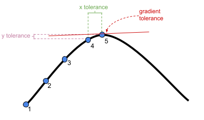

```{r setup, include=FALSE}
library(knitr)
library(tidyverse)
library(ggplot2)
library(kableExtra)
library(patchwork)
library(lme4)

xaringanExtra::use_share_again()
xaringanExtra::use_xaringan_extra(c("tile_view","animate_css","tachyons"))
xaringanExtra::use_extra_styles(
  mute_unhighlighted_code = FALSE
)
knitr::opts_chunk$set(
  dev = "svg",
  warning = FALSE,
  message = FALSE,
  cache = FALSE,
  fig.asp = .8
)

options(htmltools.dir.version = FALSE)
options(digits=4,scipen=2)
options(knitr.table.format="html")

theme_set(
    theme_minimal() + 
    theme(text = element_text(size=20))
)

source("jk_source/jk_presfuncs.R")

library(xaringanthemer)

style_mono_accent(
  base_color = "#88B04B", # DAPR3 
  header_color = "#000000",
  header_font_google = google_font("Source Sans Pro"),
  header_font_weight = 400,
  text_font_google = google_font("Source Sans Pro", "400", "400i", "600", "600i"),
  code_font_google = google_font("Source Code Pro"),
  code_font_size = "0.7rem",
  extra_css = list(".scroll-output" = list("height"="90%","overflow-y"="scroll"))
)
```

# The poke in the eye  

It's a trade-off...  

.pull-left[

**Accurately representing the world**  

everything that can vary is modelled as varying

]

.pull-right[

**Being able to fit the model**  

in our sample, some things will not vary _enough_ to fit `x|g`  
  
- not enough groups in `g`
    - fit `+g` instead of `(1|g)`
- predictors on different scales
    - `mm|g` vs `km|g`
      - can be fixed with scaling  
- not enough variance in `y~x` between groups
- model estimation hitting boundaries  
    - variance $\neq 0$
    - correlations $\neq 1$ and $\neq -1$  
  
]


---
# Maximal Structures

"maximal model" = the most complex random effect structure that you can fit to the data

  - everything that _can_ be modelled as a random effect, is done so

???
one thing we need to introduce is the notion of a maximal random effect structure. this is typically something we can work out from the study design, and is essentially the most complete specification of the grouping structure. 

--

- requires sufficient variance at all levels (for both intercepts and slopes where relevant). Which is often not the case.  

???
fitting the maximal structure requires sufficient variance though, and may not always be possible. 

--

.pull-left[
Simple(ish) design:  
20 participants, each with approx 10 observations  
```{r}
d3 <- read_csv("https://uoepsy.github.io/data/dapr3_mindfuldecline.csv")
maxmodel <- lmer(ACE ~ visit * condition + 
                   (1 + visit | ppt), 
                 data = d3)
```

```{r}
isSingular(maxmodel)
```

]
.pull-right[
Complicated design:  
14 Study sites, each with c18 ppts, each with approx 10 observations
```{r}
d3full <- read_csv("https://uoepsy.github.io/data/dapr3_mindfuldeclineFULL.csv")
maxmodelfull <- lmer(ACE ~ visit * condition + 
                   (1 + visit * condition | sitename) +
                   (1 + visit | sitename:ppt), 
                 data = d3full)
```
```
# boundary (singular) fit: see help('isSingular')
```
```{r}
isSingular(maxmodelfull)
```

]

???
in our school example where there is are just two levels, the maximal model involves fitting a random intercept by-schools, and random effects of all level-1 predictors. 
we can't fit a random effect of the intervention here, because each school is either a control or a treatment. there's no "effect of intervention in school X". 

what you might notice here, is that we're getting some warnings. and this because both our models are too complex to fit on our available data. 

---
# Model Estimation  

**Don't report results from a model that doesn't converge. You will probably not be able to trust the estimates.**   

--

- Check model specification! Do your random effects make sense?  

--

.pull-left[
- Try a different optimiser, adjust the max iterations, or the stopping tolerances  

{{content}}
]
.pull-right[
```{r echo=FALSE, fig.asp=.3}

```
]

???
the optimiser is the algorithm that tries to find the maximum likelihood estimates, and does so by wandering around (in a logical way) a multidimensional likelihood surface corresponding to different values of our estimates. optimisers converge when they stop searching because they think they've got a maximum. we can control the stopping tolerances, such as the minimum distance moved x, or likelihood gained y, or how much change in gradient. 
we can also try different optimisers, which may be better, but more time consuming. 

--

- Try **all** optimisers at once! `summary(allFit(model))`
  - look for the 'messages'
  - for those optimisers that successfully converge, compare estimates.  

--

**This probably won't help. In most cases, it is just that our model is too complex to fit to our available data.**  

---
# Deciding on the optimal random effect structure

.pull-left[

**Keep it maximal**   

1. Start with maximal model  
2. Remove random effects with least variance until model converges (see Barr et al., 2013)

]
.pull-right[

**Selection based**  

Use a criterion for model selection (e.g. LRT, AIC, BIC) to choose a random effect structure that is supported by the data (see Matsuchek et al., 2017)

]
.footnote[

- Barr, D. J., Levy, R., Scheepers, C., & Tily, H. J. (2013). Random effects structure for confirmatory hypothesis testing: Keep it maximal. Journal of memory and language, 68(3), 255-278.  
- Matuschek, H., Kliegl, R., Vasishth, S., Baayen, H., & Bates, D. (2017). Balancing Type I error and power in linear mixed models. Journal of memory and language, 94, 305-315.  

]

???
there are various suggestions as to choosing an appropriate random effect strucutre. 
perhaps the most simple, and most used in psychology, is to start with the maximal and then remove parameters with the least variance until the model converges. 

---
# Deciding on the optimal random effect structure

.pull-left[

**Keep it maximal**   

1. Start with maximal model  
2. Remove random effects with least variance until model converges (see Barr et al., 2013)

]
.pull-right[
<p style="opacity: .6">
<strong>Selection based</strong><br>
<br>
Use a criterion for model selection (e.g. LRT, AIC, BIC) to choose a random effect structure that is supported by the data (see Matsuchek et al., 2017)

</p>
]

__<center>No right answer</center>__

.footnote[

- Barr, D. J., Levy, R., Scheepers, C., & Tily, H. J. (2013). Random effects structure for confirmatory hypothesis testing: Keep it maximal. Journal of memory and language, 68(3), 255-278.  
- Matuschek, H., Kliegl, R., Vasishth, S., Baayen, H., & Bates, D. (2017). Balancing Type I error and power in linear mixed models. Journal of memory and language, 94, 305-315.  

]

???
however, important to note that there's no obvious right approach to this. the maximal model will often have lower power, and others suggest a model selection criteria is preferable. 

---
# how to simplify

.pull-left[
One thing at a time!  
]
.pull-right[
```{r}
# to extract random effects
VarCorr(maxmodel)
```
]

--

<br><br>
Look for:

Variances/standard deviations of 0 (or very small, e.g. `3.56e-05`)<br>  

Correlations of -1 or 1 

---
# how to simplify (2)

.pull-left[
One thing at a time!  
]
.pull-right[
```{r}
# to extract random effects
VarCorr(maxmodel)
```
]

<br><br>
Consider removing most complex random effects first.

`(1 + x1 * x2 | g)`<br>
&emsp;&emsp;&darr;<br>
`(1 + x1 + x2 | g)`<br>
&emsp;&emsp;&darr;<br>
`(1 + x1 | g)` OR `(1 + x2 | g)`


---
# how to simplify (3)

.pull-left[
One thing at a time!  
]
.pull-right[
```{r}
# to extract random effects
VarCorr(maxmodel)
```
]

<br><br>
Categorical predictors with >2 levels are "more complex" (because they require more parameters).  

---
# how to simplify (4)

.pull-left[
One thing at a time!  
]
.pull-right[
```{r}
# to extract random effects
VarCorr(maxmodel)
```
]

<br><br>
If multiple levels of nesting, you'll have fewer groups as you go up the levels (fewer groups to be able to fit things to).  

*sometimes* (but not always) it makes sense to remove higher level random effects first.  

`(1 + x1 + x2 | g1/g2)`<br>
&emsp;&emsp; is the same as<br>
`(1 + x1 + x2 | g1) + (1 + x1 + x2 | g1:g2)`<br>
&emsp;&emsp;&darr;<br>
`(1 + x1 | g1) + (1 + x1 + x2 | g1:g2)`<br>


---
# how to simplify (5)

.pull-left[
One thing at a time!  
]
.pull-right[
```{r}
# to extract random effects
VarCorr(maxmodel)
```
]

<br><br>
You will be faced with _subjective_ choices<br>
<br>
which simplification can you most easily accept?  
  

---
# random effect correlations

.pull-left[
i've kind of been ignoring these so far.. 
```{r echo=FALSE}
data <- read_csv('https://uoepsy.github.io/data/MathsAchievement.csv')
data$clusterid <- as.factor(data$childid)
data$x1<-data$year
data$y <- data$math
df<-data
```
```{r}
m1 <- lmer(y ~ 1 + x1 + 
             (1 + x1 | clusterid), data = df)
VarCorr(m1)
```
]
.pull-right[

```{r echo=FALSE}
library(patchwork)
set.seed(64)
tibble(
  g = 1:10,
  i = rnorm(10,1,1),
  x = i+rnorm(10,0,.1)
) %>% mutate(
  pre = list(1:10)
) %>% unnest() %>% mutate(
  y = i+x*pre
) %>%
  ggplot()+
  geom_line(aes(x=pre,y=y,group=g))+
  labs(x="x1",y=".fitted",title="cor(intercepts, slopes) = 1") -> pp1

set.seed(33)
tibble(
  g = 1:10,
  i = rnorm(10,1,1),
  x = -.4*i+rnorm(10,0,.1)
) %>% mutate(
  pre = list(1:10)
) %>% unnest() %>% mutate(
  y = i+x*(pre-1)
) %>%
  ggplot()+
  geom_line(aes(x=pre,y=y,group=g))+
  labs(x="x1",y=".fitted",title="cor(intercepts, slopes) = -1") -> pp2

pp1 / pp2
```
]

---
# random effect correlations (2)

.pull-left[
```{r}
maxmodel <- lmer(ACE ~ visit * condition + 
                   (1 + visit | ppt), 
                 data = d3)
VarCorr(maxmodel)
```
```{r echo=FALSE, out.height="300px"}
broom.mixed::augment(maxmodel) %>%
ggplot(aes(x=visit, y=.fitted))+
  geom_line(aes(group=ppt, col=condition), alpha=.7)+
  theme(legend.position = "bottom")
```
]
.pull-right[
plot the predictions:  
```{r,out.height="400px"}
plot(ranef(maxmodel)$ppt)
```
]

---
# random effect correlations (3) 

.pull-left[
```{r}
maxmodelZC <- lmer(ACE ~ visit * condition + 
                   (1 + visit || ppt), 
                 data = d3)
VarCorr(maxmodelZC)
```
removing correlations between random effects simplifies your model. 
]
.pull-right[

plot the predictions:  
```{r,out.height="400px"}
plot(ranef(maxmodelZC)$ppt)
cor(ranef(maxmodelZC)$ppt)
```
]


---
# random effect correlations (4)

```{r eval=FALSE, echo=FALSE}
sim1COR = function(seed=NULL){
  if(!is.null(seed)){set.seed(seed)}
  z0 = runif(1,.4,1.4)
  z1 = runif(1,.2,.9)
  e = runif(1,.8,1.7)
  b0 = rnorm(1,0,.2)
  b1 = rnorm(1,-1,.3)
  b2 = 0
  b3 = rnorm(1,.5,.3)
  n_groups = round(runif(1,15,25)) # n ppt
  if(n_groups %% 2 == 1){n_groups = n_groups+1}
  N = n_groups*10
  g = rep(1:n_groups, e = N/n_groups)      # the group identifier
  x = rnorm(N)                             # an observation level continuous variable
  x = rep(0:9,n_groups)
  #b = rbinom(n_groups, size = 1, prob=.5)  # a cluster level categorical variable
  b = rep(0:1,e=n_groups/2)
  b = b[g]
  re0 = rnorm(n_groups, sd = z0)  # random effects
  re  = re0[g]
  rex = rnorm(n_groups, mean = 2*re0, sd = z1)  # random effects
  re_x  = rex[g]
  lp = (b0 + re) + (b1 + re_x)*x + (b2)*b + (b3)*b*x 
  y = rnorm(N, mean = lp, sd = 1)               # create a continuous target variable
  y_bin = rbinom(N, size = 1, prob = plogis(lp))    #- create a binary target variable
  data.frame(x, b, y, y_bin, g = factor(g))
}
sim1COR() |> mutate(
  age = 60+x*2,
  visit = x+1,
  ACE = round(84+(scale(y)[,1]*2),1),
  imp = ifelse(y_bin==1,"unimp","imp"),
  condition = ifelse(b==1,"mindfulness","control"),
  ppt = paste0("PPT_",g)
) |>
  select(ppt, condition, visit, age, ACE,imp) -> d3COR
# save(d3COR, file="d3COR.Rdata")
```


.pull-left[
_Different data!_ (here i have simulated the data so that people *do* have a very strong correlation in their intercepts and slopes)
```{r echo=FALSE}
load("d3COR.Rdata")
```
```{r}
maxmodel_COR <- lmer(ACE ~ visit * condition + 
                   (1 + visit | ppt), 
                 data = d3COR)
VarCorr(maxmodel_COR)

maxmodel_CORsuppress <- lmer(ACE ~ visit * condition + 
                   (1 + visit || ppt), 
                 data = d3COR)
VarCorr(maxmodel_CORsuppress)
```

]
.pull-right[
```{r}
ggplot(d3COR, aes(x=visit, y=ACE))+
  geom_line(aes(group=ppt, col=condition), alpha=.7)+
  theme(legend.position = "bottom")
```

]

---
count: false
# random effect correlations (4)

.pull-left[
```{r}
maxmodel_COR <- lmer(ACE ~ visit * condition + 
                   (1 + visit | ppt), 
                 data = d3COR)
VarCorr(maxmodel_COR)

maxmodel_CORsuppress <- lmer(ACE ~ visit * condition + 
                   (1 + visit || ppt), 
                 data = d3COR)
VarCorr(maxmodel_CORsuppress)
```

]
.pull-right[
```{r eval=FALSE}
plot(ranef(maxmodel_COR)$ppt)
plot(ranef(maxmodel_CORsuppress)$ppt)
```
```{r echo=FALSE}
par(mfrow=c(2,2))
plot(ranef(maxmodel_COR)$ppt)
plot(ranef(maxmodel_CORsuppress)$ppt)
par(mfrow=c(1,1))
```
```{r}
cor(ranef(maxmodel_CORsuppress)$ppt)
```
]

???
<!-- --- -->
<!-- # removing random effect correlations   -->

<!-- When should we remove them? -->

<!-- ??? -->
<!-- so when does it make sense to fix the correlation to 0? well -->

<!-- -- -->

<!-- __When it makes theoretical sense to do so.__ -->


<!-- ??? -->
in certain designs, you might consider there to be no theoretical justification for there to be a correlation between random effects.  
however, you have to be careful and this should only be done if your predictor is on a ratio scale - so if it has a meaningful zero. 
this is for the slghtly complicated reason that the zero correlation model is sensitive to shifts in the predictor. so our estimates from a model with a zero correlation parameter will change slightly as we shift our predictor. 

---
# Summary

- random effect structures can get complicated quite quickly

- there may multiple ways in things can be clustered.  
  - clusters can themselves be clustered (**nesting**). 
  - we can have different ways of clustering the same things (**crossed**)

- the maximal random effect structure is the most complex structure we can fit to the data. 
    - it often leads to problems with model convergence
    
- building `lmer`s is a balancing act between accounting for different sources of variation and attempting to fitting a model that can be supported by our data.  

---
class: inverse, center, middle, animated, rotateInDownLeft

# End

