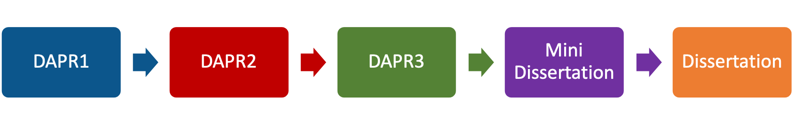

```{r setup, include=FALSE}
library(knitr)
library(tidyverse)
library(ggplot2)
library(kableExtra)
library(patchwork)

xaringanExtra::use_share_again()
xaringanExtra::use_xaringan_extra(c("tile_view","animate_css","tachyons"))
xaringanExtra::use_extra_styles(
  mute_unhighlighted_code = FALSE
)
knitr::opts_chunk$set(
  dev = "svg",
  warning = FALSE,
  message = FALSE,
  cache = FALSE
)

options(htmltools.dir.version = FALSE)
options(digits=4,scipen=2)
options(knitr.table.format="html")

theme_set(
    theme_minimal() + 
    theme(text = element_text(size=20))
)

source("jk_source/jk_presfuncs.R")

library(xaringanthemer)

style_mono_accent(
  base_color = "#88B04B", # DAPR3 
  header_color = "#000000",
  header_font_google = google_font("Source Sans Pro"),
  header_font_weight = 400,
  text_font_google = google_font("Source Sans Pro", "400", "400i", "600", "600i"),
  code_font_google = google_font("Source Code Pro"),
  code_font_size = "0.7rem",
  extra_css = list(".scroll-output" = list("height"="90%","overflow-y"="scroll"))
)
```

class: center, middle
# Welcome to DAPR3

---
# DAPR and your degree

```{r, echo=FALSE}

```

???
dapr3 sits at the end of the DAPR journey, and really it's designed to prepare you for much of the research you're about to undertake in your dissertations.  


---
# What you will learn

.pull-left[
### Weeks 1-5

__Multilevel Models__  

- Refresher of Linear Models
- Multilevel Linear Models
- Assumptions & Diagnostics
- Centering & Logistic Multilevel Models
- Recap

]

???
as such, we're going to learn some of the methods that are most commonly utilised in dissertations. 

these include multilevel models, which is going to be the focus of the first block of the DAPR3

--
.pull-right[
### Weeks 6-11

__Path Analysis & Data Reduction__

- Path Analysis
- Path Mediation
- Principal Component Analysis
- Exploratory Factor Analysis


]

---
# Shape of the Course


.flex.items-center[.w-10[] .f3.w-40[**Lectures**<br><small>Usually includes sections of live coding</small>] ] 

.flex.items-center[.w-10[] .f3.w-80[**Labs (Exercises)**<br><small>A place to work through exercises with colleagues<br>(with help on-hand from a team of tutors)</small>]]

.flex.items-center[.w-10[] .f3.w-80[**Discussion forums and support**]]

.flex.items-center[.w-10[] .f3.w-80[**Assessment**]]

???
course mainly delivered in lectures and labs, with accompanying readings.  

we also have discussion forums and other avenues for you to get support  

and then there is the assessment.  


---
# Labs

- A time and place to work on the exercises

  - work should be done in **RStudio**  
  
  - working in small groups is encouraged
  
  - a team of tutors will be on-hand to answer any questions

.br3.center.bg-green.white.f3[
Check your personal timetable to find out which lab to attend.
]


???
the lab sessions are a time and place to work on exercises.  

we've got a bunch of lovely tutors who will be there to answer questions. just raise your hand and they'll come over when they're free.  
- working in groups.  


- statistics, and especially R, is a very _practical_ skill.  
- we can't teach people to swim by just giving lectures on how to swim. 


---
# Discussions

.tc[

]

- piazza discussion forums for the course on Learn

  + ask questions, share experiences, talk to the course team
  
  + post anonymously if preferred
  
  + an important way to keep in touch
  
---
# Support

<!-- FIXME image of zoom/teams session -->

.pt4.pull-left[]
.pt5.pull-right[
we are here to help you

  - lectures: feel free to ask questions at any point  
  
  - lab sessions: make use of the tutoring team (they _want_ to help!)  
  
  - piazza discussion forums: any time  
  
  - office hours: see Learn page for details  
  
]

???


---
# Assessments
## Quizzes (10% of final grade)

- 9 online multiple-choice quizzes

  - only the best 7 of 9 quizzes contribute to final grade

- 1 practice quiz (Week 1)

- for each quiz, **one attempt** which must be completed within 60 min

.br3.center.bg-green.white.f3[
Quizzes released on Mondays at 9am, due on the following Sunday at 5pm
]


---
# Assessments
## Report (30% of final grade)


- Based content from Block 1 of the course (weeks 1-5)
  + check a dataset for consistency
  + explore hypotheses about how variables are related
  + conduct and interpret appropriate statistical tests
  + produce suitable graphics

- Format: .Rmd file and associated compiled .pdf

.br3.center.bg-green.white.f3[
Released 20th October at 12 Noon, Due 10th November at 12 Noon
]


---
# Assessments
## Exam (60% of final grade)

- 2 hours long

- closed book

- 20 multiple choice questions, 6 short answer questions, 3 long answer questions

- covers all course content (_slightly more emphasis on Block 2_)

- You will be given an equation sheet. You will be allowed to make notes on this sheet and take it into the exam. 
   - There will be strict rules on this, if they are not followed, your notes sheet will be taken away and replaced with a blank equation sheet.  


.br3.center.bg-green.white.f3[
We will devote some time in a later lecture about exam preparation/time management etc. ]

---
# Assessments: Why?  

__Quizzes__  

- Encourage continual engagement
- Act as a knowledge check for you each week to monitor your progress

__Report__  

- To practice working with data, converting questions to models, and interpreting results.
- Excellent preparation for what you will be doing in your dissertation!  

__Exam__  

- Primary assessment of individual learning.

---
# Assessments: Academic Integrity  

+ **All assessments are individual assessments**

.pull-left[
__Acceptable (encouraged):__  

+ Going over your quizzes together once your marks and feedback have been released
+ Discussing the approach you plan to take to the report
+ Helping one another think through and solve problems (as in the lab)
+ Revising with one another and helping each other produce notes sheets for the exam
  
]

.pull-right[
__Not acceptable:__  

+ Copying code for the report
+ Copying blocks of text for the report
+ Sharing questions and answers on quizzes
+ Cheating in the exam
+ All of the above are examples (not a comprehensive list) of academic misconduct. 
  + Cases of misconduct will be reported.

]

---
# Expectations

.pull-left[
__Us__  

1. We will work hard to help you learn.  

2. We will be open and communicate with you.  

3. We will be polite, respectful and treat you like adults.  


]

.pull-right[
__You__  

1. You work hard.  

2. That you talk to us.  

3. That you are polite, and respect the teaching team and your classmates.  

4. Try and have fun.

]

---
# Engagement

- DAPR courses require consistent work across the course.  

- You can not cram this content.   

- We want to make sure everyone keeps on top of the course.  

  + To do that, we need to know when people are struggling.  

+ Please help us by being proactive:  

  + Come to all sessions
  + Use office hours to clarify any questions you have.
  + We can help construct peer study groups to learn from one another.
  + Monitor your quiz performance.  


---
# RStudio


.flex.items-center[.w-80[__Please install a version of R and RStudio on your own computer.__<br><br>For installation instructions, see https://edin.ac/3B0oi5A<br>_please read these carefully_<br><br>_For those of you who have chromebooks, you may continue to use the PPLS RStudio Server by setting your password (see Welcome Week materials on Learn) and logging on as you have done previously at https://rstudio.ppls.ed.ac.uk/_].w-50[]]


---
class: inverse, center, middle, animated, heartBeat

# End

.footnote[
Icons by Becris, tezar tantula, ProSymbols, Arjan Farzkenari, Econceptive from the Noun Project: thenounproject.com
]

