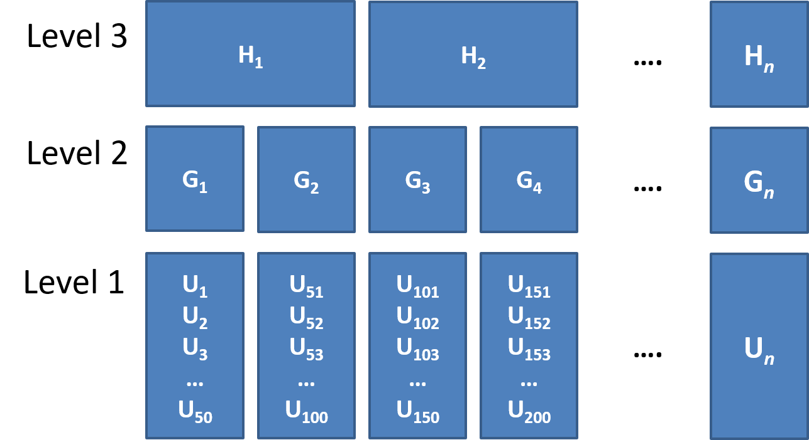

```{r setup, include=FALSE}
library(knitr)
library(tidyverse)
library(ggplot2)
library(kableExtra)
library(patchwork)

xaringanExtra::use_share_again()
xaringanExtra::use_xaringan_extra(c("tile_view","animate_css","tachyons"))
xaringanExtra::use_extra_styles(
  mute_unhighlighted_code = FALSE
)
knitr::opts_chunk$set(
  dev = "svg",
  warning = FALSE,
  message = FALSE,
  cache = FALSE,
  fig.asp = .8
)

options(htmltools.dir.version = FALSE)
options(digits=4,scipen=2)
options(knitr.table.format="html")

theme_set(
    theme_minimal() + 
    theme(text = element_text(size=20))
)

source("jk_source/jk_presfuncs.R")

library(xaringanthemer)

style_mono_accent(
  base_color = "#88B04B", # DAPR3 
  header_color = "#000000",
  header_font_google = google_font("Source Sans Pro"),
  header_font_weight = 400,
  text_font_google = google_font("Source Sans Pro", "400", "400i", "600", "600i"),
  code_font_google = google_font("Source Code Pro"),
  code_font_size = "0.7rem",
  extra_css = list(".scroll-output" = list("height"="90%","overflow-y"="scroll"))
)
```

class: inverse, center, middle

<h1 style="text-align: left;">This Lecture:</h1>
<h3 style="text-align: left;">1. Clustered Data</h3>
<h3 style="text-align: left;">2. Practical stuff about data</h3>
<h3 style="text-align: left;">3. Where we're going...</h3>

---
class: inverse, center, middle

<h1 style="text-align: left;">This Lecture:</h1>
<h3 style="text-align: left;">1. Clustered Data</h3>
<h3 style="text-align: left; opacity:.4">2. Practical stuff about data</h3>
<h3 style="text-align: left; opacity:.4">3. Where we're going...</h3>


???
We're now going to move on to the main focus of this first block of dapr3.  
we're going to start by getting to grips with what it means for us to have clustered data  


---
# Examples of clustered data

.pull-left[
- children within schools  

- patients within clinics  

- observations within individuals  
]
.pull-left[
```{r echo=FALSE}
knitr::include_graphics("jk_img_sandbox/h2.png")
```
]

???
what is clustered data?  

simply put - it's when our observations have some grouping.  
note we're not talking about something like an "old vs young" or "drug vs placebo", or "condition1 vs condition2" groups. 
those are typically the things we're wanting to study.  

the _clusters_ are the groupings in our data that are kind of another level of random sampling. 

children schools
patients clinics
observations individuals


---
# Clustered Clustered Data?

.pull-left[
- children within classrooms within schools within districts etc...  

- patients within doctors within hospitals... 

- time-periods within trials within individuals
]
.pull-right[
```{r echo=FALSE}

```
]

.footnote[
Other relevant terms you will tend to see: "grouping structure", "levels", "hierarchies". 
]

???
and we can have clusters of clusters too. 

[SLIDE EXAMPLES]

so you can see that this can get quite complicated. Typically, this gets called the grouping structure, or multilevel data, or the hierarchical structure.  


---
# Importance of Clustering

Clustering will likely result in measurements on observational units within a given cluster being more similar to each other than to those in other clusters.  

- For example, our measure of academic performance for children in a given class will tend to be more similar to one another (because of class specific things such as the teacher) than to children in other classes.

```{r echo=FALSE, out.width="60%",fig.align="center"}
knitr::include_graphics("jk_img_sandbox/lev1.png")
```

???
why do we need to think about clustering?  

observations within a cluster are going to be more similar to one another than they are to those in other clusters

for instance, children in a given class might score more similarly to one another than they do to children in other classes, because of things like how good the teacher is

but this like 'non-independence'! the children are not independent from one another.  
call back to our regression assumptions!  

and this happens a lot right?
we've said children and schools, employees in departments etc. 

probably the most relevant for your dissertations, is repeatedly measuring the same participants. So we get 30 people, but we give each one 20 trials, we've suddenly got 500 observations, but it's all clustered.


---
# ICC (intra-class correlation coefficient)

Clustering is expressed in terms of the correlation among the measurements within the same cluster - known as the __intra-class correlation coefficient (ICC).__


There are various formulations of ICC, but the basic principle = ratio of *variance between groups* to *total variance*.  

<br>
$\rho = \frac{\sigma^2_{b}}{\sigma^2_{b} + \sigma^2_e} \\ \qquad \\\textrm{Where:} \\ \sigma^2_{b} = \textrm{variance between clusters} \\ \sigma^2_e = \textrm{variance within clusters (residual variance)} \\$

???
at the outset, we might want to quantify how much clustering there is in our outcome variable.
and for that we have the ICC

basic premise is that this is the ratio of between cluster variance to the total variance  

we'll take a look at this in just a second

--

Can also be interpreted as the correlation between two observations from the same group. 

???
it's also interpreted as the expected correlation between two observations from the same group  

---
# ICC (intra-class correlation coefficient)

The larger the ICC, the lower the variability is within the clusters (relative to the variability between clusters). The greater the correlation between two observations from the same group. 

.pull-left[
```{r echo=FALSE, fig.asp=.8, fig.align="center"}
iccgen <- function(j,n,e,icc,coef=0){
  v = (icc*e)/(1-icc)
  es = e/(v+e)
  v = if(is.infinite(v)){v=e}else{v/(v+e)}
  npj = n/j
  tibble(
    j = letters[1:j],
    zeta_j = rnorm(j,0,sqrt(v))
  ) %>%
    mutate(
      e_ij = map(j, ~rnorm(npj, 0, sqrt(es)))
    ) %>% unnest() %>%
    mutate(
      x = rnorm(n, 10, 5),
      y = 5 + coef*x + zeta_j + e_ij
    )
}
set.seed(3406)
sims = map_dfr(set_names(c(0,.5,.75,.95,.99,1)), 
        ~iccgen(j=10,n=100,e=1,icc=.,coef=0), .id="icc") %>%
  group_by(icc, j) %>%
  mutate(
    m = mean(y)
  ) %>% ungroup

ggplot(sims, aes(x=j, y=y))+
  geom_jitter(height=0, size=2,aes(col=j))+
  scale_y_continuous(NULL, labels=NULL)+
  stat_summary(geom="errorbar",aes(x=j,y=m,col=j),lwd=1)+
  facet_wrap(~icc)+
  guides(col=F)+
  labs(x="cluster") + theme_gray() -> p1

# ggplot(sims, aes(x=0, y=y))+
#   see::geom_violinhalf(aes(x=.5))+
#   geom_jitter(height=0,width=.5, size=2,aes(col=j), alpha=.5)+
#   scale_y_continuous(NULL, labels=NULL)+
#   scale_x_continuous(NULL, labels=NULL)+
#   #stat_summary(geom="errorbar",aes(x=j,y=m,col=j),lwd=1)+
#   facet_grid(icc~.)+
#   guides(col=F)-> p2
# p1 + p2 + plot_layout(widths=c(8,1))
p1
```

]

???
so between cluster variance vs total variance.  

[DESCRIBE PLOT]


--

.pull-right[

```{r echo=FALSE, fig.asp=.8, fig.align="center"}
set.seed(875)
sims = map_dfr(set_names(c(0,.5,.75,.95,.99,1)), 
        ~iccgen(j=10,n=100,e=1,icc=.,coef=.1), .id="icc")

ggplot(sims, aes(x=x, y=y))+
  geom_point(aes(col=j))+
  geom_line(aes(col=j))+
  facet_wrap(~icc)+
  guides(col=F)+
  scale_y_continuous(NULL, labels=NULL)+
  scale_x_continuous("X", labels=NULL)+
  theme_gray()
```
]

???
and you could imagine if we were assessing the relationship between some outcome and a predictor, and all of the variance in the outcome is due to the clustering then we'd have this bottom one here

---
# Clustered Data & Linear Models

.pull-left[
#### Why is it a problem?

Clustering is something **systematic** that our model should (arguably) take into account.  

- remember, $\varepsilon \sim N(0, \sigma) \textbf{ independently}$ 

]

--

.pull-right[
#### How is it a problem?  

Standard errors will often be smaller than they should be, meaning that:  

  - confidence intervals will often be too narrow 
  
  - $t$-statistics will often be too large  
  
  - $p$-values will often be misleadingly small

]

---
class: inverse, center, middle

<h1 style="text-align: left;">This Lecture:</h1>
<h3 style="text-align: left; opacity:.4">1. Clustered Data</h3>
<h3 style="text-align: left;">2. Practical stuff about data</h3>
<h3 style="text-align: left; opacity:.4">3. Where we're going...</h3>

---
# Wide Data/Long Data

.pull-left[
__Wide Data__  

```{r echo=FALSE}
tibble(
  ID = sprintf("%03d",1:4), 
  age = rdunif(4, 18, 75),
  trial_1 = c(10, 7.5, 12, 10.5),
  trial_2 = c(12.5, 7, 14.5, 17),
  trial_3 = c(18, 5, 11, 14)
) -> wided
wided %>% rbind(.,"...")
```


]
.pull-right[
__Long Data__


```{r echo=FALSE}
tibble(
  ID = sprintf("%03d",1:4), 
  age = rdunif(4, 18, 75),
  trial_1 = c(10, 7.5, 12, 10.5),
  trial_2 = c(12.5, 7, 14.5, 17),
  trial_3 = c(18, 5, 11, 14)
) -> wided
pivot_longer(wided, 3:5, names_to="trial", values_to="score") -> longd
longd %>% rbind(.,"...")
```


]


---
# Wide Data/Long Data


```{r echo=FALSE}
knitr::include_graphics("https://www.fromthebottomoftheheap.net/assets/img/posts/tidyr-longer-wider.gif")
```
.footnote[
Source: Examples of wide and long representations of the same data. Source: Garrick Aden-Buie’s (\@grrrck) [Tidy Animated Verbs](https://github.com/gadenbuie/tidyexplain)
]

---
# Long Data = Good for Plotting

.pull-left[
__`group` aesthetic__  

```{r fig.asp=.5}
ggplot(longd, aes(x=trial,y=score, group=ID, col=ID))+
  geom_point(size=4)+
  geom_path()
```

]
.pull-right[
__`facet_wrap()`__  
```{r fig.asp=.5}
ggplot(longd, aes(x=trial,y=score))+
  geom_point(size=4)+
  geom_path(aes(group=1))+
  facet_wrap(~ID)
```
]

---
# Long Data = Good for by-Cluster Computations

```{r}
longd %>% 
  group_by(ID) %>%
  summarise(
    ntrials = n_distinct(trial),
    meanscore = mean(score),
    sdscore = sd(score)
  )
```


---
# Summary

- Clustering can take many forms, and exist at many levels  

- Clustering is something systematic that we would want our model to take into account

  - Ignoring it can lead to incorrect statistical inferences

- Clustering is typically assessed using intra-class correlation coefficient (ICC) - the ratio of variance between clusters to the total variance $\rho = \frac{\sigma^2_b}{\sigma^2_b + \sigma^2_e}$

- Tidying your data and converting it to *long* format (one observational unit per row, and a variable identifying the cluster ID) is a good start. 

---
class: inverse, center, middle

<h1 style="text-align: left;">This Lecture:</h1>
<h3 style="text-align: left; opacity:.4">1. Clustered Data</h3>
<h3 style="text-align: left; opacity:.4">2. Practical stuff about data</h3>
<h3 style="text-align: left;">3. Where we're going...</h3>


---
# Our Data

```{r echo=FALSE}
d3 <- read_csv("https://uoepsy.github.io/data/dapr3_mindfuldecline.csv")
```

.pull-left[
> In a study examining how cognition changes over time, a sample of `r n_distinct(d3$ppt)` participants took the Addenbrooke's Cognitive Examination (ACE) every 2 years from age 60 to age 78.  

Each participant has 10 datapoints. Participants are clusters.  

```{r}
d3 <- read_csv("https://uoepsy.github.io/data/dapr3_mindfuldecline.csv")
head(d3)
```

```{r}
library(ICC)
ICCbare(x = ppt, y = ACE, data = d3)
```
]
.pull-right[
```{r echo=FALSE, fig.align="center", fig.asp=.9}
ggplot(d3, aes(x=visit ,y=ACE))+
  geom_point(size=4)+
  geom_smooth(method="lm", se=F)+
  labs(x="",y="") -> p1
ggplot(d3, aes(x=visit ,y=ACE, col=ppt))+
  geom_point(size=4)+
  geom_smooth(method="lm", se=FALSE)+
  facet_wrap(~ppt, scales="free_y")+
  guides(col=FALSE)+
  labs(x="study visit",y="cognition") +
  theme(text = element_text(size=16))-> p2

p1 / p2 + plot_layout(heights=c(1,2))
```
]

???
data
ICC
plot

---
# Ignoring Clustering

.pull-left[
__(Complete pooling)__  

+ `lm(y ~ 1 + x, data = df)`  

+ Information from all clusters is pooled together to estimate over x  

```{r}
model <- lm(ACE ~ 1 + visit, data = d3)
```
```{r echo=FALSE, out.width="300px"}
.pp(summary(model),l=list(c(10:12)))
```
]
.pull-right[
```{r echo=FALSE}
df <- d3 %>% rename(y=ACE, x = visit) %>% mutate(cluster_var = gsub("PPT","cluster",ppt))
model <- lm(y ~ x, data = df)
df %>% mutate(
  f = fitted(model)
) %>%
ggplot(.,aes(x=x,y=y))+geom_point(size=4)+
  geom_smooth(method="lm")+
  geom_segment(aes(y=y, yend = f, x = x, xend = x), alpha=.2) + 
  labs(x="study visit",y="cognition")
```
]

???
one thing we could do, but i suggest we don't, is simply ignore the clustering.

lm

information from all clusters is pooled together to estimate the relationship

---
# Ignoring Clustering

.pull-left[
__(Complete pooling)__  

+ `lm(y ~ 1 + x, data = df)`  

+ Information from all clusters is pooled together to estimate over x  

```{r}
model <- lm(ACE ~ 1 + visit, data = d3)
```
```{r echo=FALSE, out.width="300px"}
.pp(summary(model),l=list(c(10:12)))
```

But different clusters show different patterns.  
Residuals are __not__ independent.  
]
.pull-right[

```{r echo=FALSE}
library(ggfx)
library(ggforce)
model <- lm(y ~ x, data = df)
df %>% mutate(
  f = fitted(model)
) -> pdat 

ggplot(pdat,aes(x=x,y=y))+
  with_blur(geom_point(aes(col=cluster_var),size=4,alpha=.2), sigma = unit(0.7, 'mm')) + 
  geom_point(data = filter(pdat,cluster_var %in% c("cluster_20")),aes(col=cluster_var),size=4) + 
  
  geom_mark_ellipse(aes(label = ppt, filter = cluster_var == "cluster_20"),
                    con.colour  = "#526A83", con.cap = 0, 
                    con.arrow = arrow(ends = "last",length = unit(0.5, "cm")),
                    show.legend = FALSE) + 
  guides(col=FALSE, alpha=FALSE)+
  geom_smooth(method="lm",se=F)+
  geom_segment(aes(y=y, yend = f, x = x, xend = x), alpha=.2) + 
  labs(x="study visit",y="cognition")
```
]

???
note it doesn't represent the relationship for each PPT very well 


---
count:false
# Ignoring Clustering

.pull-left[
__(Complete pooling)__  

+ `lm(y ~ 1 + x, data = df)`  

+ Information from all clusters is __pooled__ together to estimate over x  

```{r}
model <- lm(ACE ~ 1 + visit, data = d3)
```
```{r echo=FALSE, out.width="300px"}
.pp(summary(model),l=list(c(10:12)))
```

But different clusters show different patterns.  
Residuals are __not__ independent.  
]
.pull-right[

```{r echo=FALSE}
library(ggfx)
library(ggforce)
model <- lm(y ~ x, data = df)
df %>% mutate(
  f = fitted(model)
) -> pdat 

ggplot(pdat,aes(x=x,y=y))+
  with_blur(geom_point(aes(col=cluster_var),size=4,alpha=.2), sigma = unit(0.7, 'mm')) + 
  geom_point(data = filter(pdat,cluster_var %in% c("cluster_19")),aes(col=cluster_var),size=4) + 
  
  geom_mark_ellipse(aes(label = ppt, filter = cluster_var == "cluster_19"),
                    con.colour  = "#526A83", con.cap = 0, 
                    con.arrow = arrow(ends = "last",length = unit(0.5, "cm")),
                    show.legend = FALSE) + 
  geom_point(data = filter(pdat,cluster_var %in% c("cluster_10")),aes(col=cluster_var),size=4) + 
  
  geom_mark_ellipse(aes(label = ppt, filter = cluster_var == "cluster_10"),
                    con.colour  = "#526A83", con.cap = 0, 
                    con.arrow = arrow(ends = "last",length = unit(0.5, "cm")),
                    show.legend = FALSE) + 
  
  guides(col=FALSE, alpha=FALSE)+
  geom_smooth(method="lm",se=F)+
  geom_segment(aes(y=y, yend = f, x = x, xend = x), alpha=.2) + 
  labs(x="study visit",y="cognition")
```
]

???
residuals aren't independent, for instance all the residuals from PPT 19 are positive - they're all above the regression line
- from PPT 10 they're almost all below the line

---
# Fixed Effects Models

.pull-left[

__(No pooling)__  

- `lm(y ~ x * cluster, data = df)`  

- Information from a cluster contributes to estimate *for that cluster*, but information is not pooled (estimate for cluster 1 completely independent from estimate for cluster 2). 

```{r}
model <- lm(ACE ~ 1 + visit * ppt, data = d3)
```
{{content}}
]
.pull-right[
```{r echo=FALSE}
model1 <- lm(y~x*cluster_var,df)
df %>% mutate(
  f = fitted(model1)
) %>%
ggplot(.,aes(x=x,y=y,col=cluster_var))+
  geom_point(alpha=.2)+
  geom_line(aes(y=f,group=cluster_var))+
  geom_smooth(df %>% mutate(f = fitted(model1)) %>% filter(cluster_var == "cluster_1"), method="lm", se=F, fullrange = T, mapping=aes(x=x,y=y,col=cluster_var), lty="dashed", lwd=.5) +
  
  guides(col=FALSE)+
  #geom_segment(aes(y=y, yend = f, x = x, xend = x), alpha=.4) + 
  labs(x="study visit",y="cognition")+
  xlim(0,10)
```
]

???
using tools from DAPR2, we might consider adding in PPT id as a predictor into our model 

visit, ppt, and interaction

--

+ Lots of estimates (separate for each cluster). 
+ Variance estimates constructed based on information *only* within each cluster. 

```{r echo=FALSE}
.pp(summary(model),l=list(c(10:34)))
```

???
practical point is that we get out a whole load of coefficients here. 

we have the intercept ad slope for the reference school [PLOT],

and then the adjustments to the intercept for each school

and way down below, the adjustments to the slope for each school

but more importantly, the variance estimates constructed here are based on the information _only_ within each cluster. 

NO pooling


---
count: false
# Fixed Effects Models

.pull-left[

__(No pooling)__  

- `lm(y ~ x * cluster, data = df)`  

- Information from a cluster contributes to estimate *for that cluster*, but information is not pooled (estimate for cluster 1 completely independent from estimate for cluster 2). 

```{r}
model <- lm(ACE ~ 1 + visit * ppt, data = d3)
```

+ Lots of estimates (separate for each cluster). 
+ Variance estimates constructed based on information *only* within each cluster. 

```{r echo=FALSE}
.pp(summary(model),l=list(c(10:34)))
```

]
.pull-right[
```{r echo=FALSE}
ggplot(d3, aes(x=visit ,y=ACE, col=ppt))+
  geom_point(size=4,alpha=.3)+
  geom_smooth(method="lm", se=FALSE)+
  facet_wrap(~ppt, scales="free_y")+
  guides(col=FALSE)+
  labs(x="study visit",y="cognition") +
  theme(text = element_text(size=16))
```
]


???
but more importantly, the variance estimates constructed here are based on the information _only_ within each cluster. 

NO pooling


---
# Random Effects Models (MLM)

.pull-left[
__(Partial Pooling)__

- `lmer(y ~ 1 + x + (1 + x| cluster), data = df)`
- cluster-level variance in intercepts and slopes is modeled as randomly distributed around fixed parameters.
- effects are free to vary by cluster, but information from clusters contributes (according to cluster $n$ and outlyingness of cluster) to an overall fixed parameter. 

```{r}
library(lme4)
model <- lmer(ACE ~ 1 + visit + 
                (1 + visit | ppt),
              data = d3)
summary(model)$coefficients
```


]
.pull-right[

```{r echo=FALSE}
model = lmer(y~x+(1+x|cluster_var),df)
df %>% mutate(
  fit = fitted(model)
) %>%
ggplot(., aes(x=x, y=y))+
  geom_line(aes(y=fit, group=cluster_var, col=cluster_var))+
  geom_abline(intercept=fixef(model)[1], slope=fixef(model)[2],lwd=2)+
  geom_point(aes(col=cluster_var),alpha=.3)+
  geom_segment(aes(y=y, yend = fit, x = x, xend = x, 
                   col=cluster_var), alpha=.3)+
  labs(x="study visit",y="cognition") +
  guides(col=FALSE)+
  xlim(0,10)
```
]

???
in between these two approach is multilevel models, also termed "random effects models".  

and relative to the complete pooling (ignore the clustering) and no pooling (explicitly model cluster differences), this gets termed partial pooling.  

in multilevel models, the differences in clusters, in their intercepts and slopes, is modelled as a distribution around some fixed center. 

in this way the information from the clusters is partially pooled to contribute to an overal intercept and slope. 

the extent to which it contributes depends on how big the cluster is, and how far away it is from the rest of them. 

this makes sens right? i'm going to probably pay more attention to a school with 40 students than one with 2?  


---
# Random Effects Models (MLM)

.pull-left[
__(Partial Pooling)__

- `lmer(y ~ 1 + x + (1 + x| cluster), data = df)`
- cluster-level variance in intercepts and slopes is modeled as randomly distributed around fixed parameters.
- effects are free to vary by cluster, but information from clusters contributes (according to cluster $n$ and outlyingness of cluster) to an overall fixed parameter. 

```{r}
library(lme4)
model <- lmer(ACE ~ 1 + visit + 
                (1 + visit | ppt),
              data = d3)
summary(model)$coefficients
```


]
.pull-right[

```{r echo=FALSE}
library(ggforce)
library(ggfx)
model = lmer(y~x+(1+x|cluster_var),df)
dfm <- 
  df %>% group_by(cluster_var) %>%
  summarise(x = 0) %>% 
  mutate(mf = predict(model, newdata=.),
         ff = fixef(model)[1] + x*fixef(model)[2],
         cv = ifelse(mf>ff, -.2, .2))

dfi <- bind_rows(df,
                 df %>% group_by(cluster_var) %>% summarise(x = 0)) %>%
  mutate(fit2 = predict(model, newdata=.))


df %>% mutate(
  fit = fitted(model)
) -> pdat

dfs <- tibble(
  cluster_var = c("cluster_1","cluster_19"),
  yf = c(
    coef(model)$cluster_var["cluster_1","(Intercept)"]+(3*fixef(model)[2]),
    coef(model)$cluster_var["cluster_19","(Intercept)"]+(3*fixef(model)[2])
    ),
  yg = c(
    coef(model)$cluster_var["cluster_1","(Intercept)"]+(3*coef(model)$cluster_var["cluster_1","x"]), 
    coef(model)$cluster_var["cluster_19","(Intercept)"]+(2.7*coef(model)$cluster_var["cluster_19","x"])
  )
)

filter(pdat, cluster_var %in% c("cluster_1","cluster_19")) %>%
  group_by(cluster_var) %>%
  mutate(
    fitmc = mean(fit),
    xgc = x-mean(x),
    fix = fitmc + fixef(model)[2]*xgc,
  ) -> counterf


ggplot(pdat, aes(x=x, y=y))+
  geom_abline(intercept=fixef(model)[1], slope=fixef(model)[2],lwd=2)+
  with_blur(geom_line(aes(y=fit, group=cluster_var, col=cluster_var), alpha=.5), sigma = 2)+
  with_blur(geom_point(aes(col=cluster_var), alpha=.5), sigma = 2)+
  with_blur(geom_segment(aes(y=y, yend = fit, x = x, xend = x, col=cluster_var), alpha=.2), sigma = 2)+
  with_blur(geom_curve(data=dfm[dfm$mf>dfm$ff,],
             aes(x=x, xend=x, y=mf, yend=ff, col = cluster_var),
             curvature = -.5, alpha=.3), sigma = 2)+
  with_blur(geom_curve(data=dfm[dfm$mf<dfm$ff,],
             aes(x=x, xend=x, y=mf, yend=ff, col = cluster_var),
             curvature = .5, alpha=.3), sigma = 2)+
  with_blur(geom_line(data=dfi, aes(y=fit2, group=cluster_var, col=cluster_var),
            lty = "dashed", alpha=.3), sigma = 2)+
  
  geom_line(data = filter(pdat, cluster_var %in% c("cluster_19")), aes(y=fit, group=cluster_var, col=cluster_var))+
  geom_point(data = filter(pdat, cluster_var %in% c("cluster_19")), aes(col=cluster_var))+
  geom_segment(data = filter(pdat, cluster_var %in% c("cluster_19")), aes(y=y, yend = fit, x = x, xend = x, col=cluster_var), alpha=.7)+
  geom_line(data=filter(dfi, cluster_var %in% c("cluster_19")), aes(y=fit2, group=cluster_var, col=cluster_var),lty = "dashed")+
  geom_curve(data=filter(dfm[dfm$mf>dfm$ff,], cluster_var %in% c("cluster_19")),aes(x=x, xend=x, y=mf, yend=ff, col = cluster_var),curvature = -.5)+
  geom_curve(data=filter(dfm[dfm$mf<dfm$ff,], cluster_var %in% c("cluster_19")),aes(x=x, xend=x, y=mf, yend=ff, col = cluster_var),curvature = .5)+
  
  guides(col = FALSE)+
  ylim(76,88) +
  labs(x="study visit",y="cognition") +
  NULL

```
]

???
so in the plot, we have our overall intercept and line, and these are probably going to be the things we're interested in for our research, because we're not likely interested in the schools specifically..

but for each school, it has a deviation from the overall intercept to it's own intercept.

and a deviation from the overall slope to it's own slope.  


---
# Summary

With clustered data, there are many possible approaches. Some of the main ones are:  

- Ignore it (**complete pooling**)  

    - and make inappropriate inferences.  

- Completely partition out any variance due to clustering into fixed effects for each cluster (__no pooling__).  

    - and limit our estimates to being cluster specific and low power.  
    
- Model cluster-level variance as randomly distributed around fixed parameters, __partially pooling__ information across clusters.  

    - best of both worlds?  
    

???
so that's just a taster of what's to come

---
class: inverse, center, middle, animated, rotateInDownLeft

# End

---
class: inverse, center, middle

<h1 style="text-align: left;">This Lecture:</h1>
<h3 style="text-align: left; opacity:.4">1. Clustered Data</h3>
<h3 style="text-align: left; opacity:.4">2. Practical stuff about data</h3>
<h3 style="text-align: left; opacity:.4">3. Where we're going...</h3>
<h3 style="text-align: left; ">Bonus content</h3>


```{r echo=F}
set.seed(2345)
tibble(
  x1=rnorm(100),
  x2=rnorm(100),
  x3=rnorm(100),
  grp=rep(letters[1:4],e=25),
  y=10+x1-2*x2+2*x3+(grp=="a")*4 + rnorm(100)
) -> df

df2 <- read.table("jk_source/growth.txt", header=T) %>%
  transmute(y = gain, 
            grp = fct_recode(factor(supplement), "horse"="control",
                            "cat"="supergain",
                            "dog"="supersupp",
                            "parrot"="agrimore"), 
            condition = fct_recode(factor(diet),"scotland"="wheat",
                            "england"="oats",
                            "wales"="barley"),
            x3 = rnorm(n())
          )
```

---
# (OPTIONAL) Repeated Measures ANOVA

## ANOVA revisited

.pull-left[
- We've been using `anova()` as a test of whether _several_ parameters are simultaneously zero

    - The "omnibus"/"overall F"/"joint" test (can also be viewed as a model comparison)  
    
]

--

.pull-right[
- Traditional "ANOVA" is essentially a linear model with categorical predictor(s) where it looks for overall differences in group means (or differences in differences in group means etc).    

    - Still quite popular in psychology because we often design experiments with discrete conditions. 
    
    - Require post-hoc tests to examine _where_ any differences are.
]

---
exclude: true
# ANOVA revisited

In R, functions typically create anova tables from linear model objects:
```{r eval=F}
lin_mod <- lm(y ~ grp, df)
anova(lin_mod)
car::Anova(lin_mod)
```
or are wrappers which use the `lm()` function internally. So they're doing the same thing.
```{r eval=F}
summary(aov(y ~ grp, df))
```

```{r echo=FALSE,fig.height=3.5,fig.width=8,fig.align="center"}
ggplot(df,aes(x=grp, y=y,color=grp))+
  geom_jitter(width=.1)+
  stat_summary(fun.y = "mean", 
               fun.ymin = "mean", fun.ymax= "mean", 
               size= 0.3, geom = "crossbar")+
  guides(col="none")
```


---
exclude: true
# ANOVA sums of squares

.pull-left[

With multiple predictors, sums of squares can be calculated differently

1. Sequential Sums of Squares = Order matters
2. <p style="opacity:0.4">Partially Sequential Sums of Squares</p>
3. <p style="opacity:0.4">Partial Sums of Squares</p>

```{r echo=FALSE,  out.height="150px",out.width="200px", fig.align="center"}
knitr::include_graphics("jk_img_sandbox/SStype1b.png")
```

]
.pull-right[
__sequential SS__
```{r}
anova(lm(y~x1*x2,df))
anova(lm(y~x2*x1,df))
```
]

---
exclude: true
# ANOVA sums of squares

.pull-left[

with multiple predictors, sums of squares can be calculated differently

1. <p style="opacity:0.4">Sequential Sums of Squares</p>
2. <p style="opacity:0.4">Partially Sequential Sums of Squares</p>
3. Partial Sums of Squares = Each one calculated as if its the last one in sequential SS (order doesn't matter).

```{r echo=FALSE,  out.height="150px", out.width="200px", fig.align="center"}
knitr::include_graphics("jk_img_sandbox/SStype3.png")
```


]
.pull-right[
__partial SS__
```{r}
car::Anova(lm(y~x1*x2,df), type="III")
car::Anova(lm(y~x2*x1,df), type="III")
```

]
    
---
# (OPTIONAL) Repeated Measures ANOVA

## ANOVA: Partitioning Variance

```{r fig.asp=.7, echo=FALSE}
knitr::include_graphics("jk_img_sandbox/anova.png")
```


.footnote[  
The terminology here can be a nightmare.  
$SS_{between}$ sometimes gets referred to as $SS_{model}$, $SS_{condition}$, $SS_{regression}$, or $SS_{treatment}$.  
Meanwhile $SS_{residual}$ also gets termed $SS_{error}$.  
To make it all worse, there are inconsistencies in the acronyms used, $SSR$ vs. $RSS$! 

]

---
# (OPTIONAL) Repeated Measures ANOVA

## ANOVA: Partitioning Variance

```{r fig.asp=.7, echo=FALSE}
knitr::include_graphics("jk_img_sandbox/rmanova.png")
```

---
# (OPTIONAL) Repeated Measures ANOVA in R


.pull-left[
```{r echo=FALSE, fig.asp=.9}
set.seed(853)
tibble(
  condition = letters[1:4],
  cmean = c(0,2,3,3),
  ceff = c(.5, 1, 3, .5),
  smeans = map(cmean, ~rnorm(10,.,1)),
  seffs = map(ceff, ~rnorm(10, .,1)),
  sid = map(condition, ~paste0(.,1:10)),
) %>% unnest(c(smeans,sid,seffs)) %>%
  mutate(
    data = map2(smeans,seffs, ~tibble(t = 1:3, y = .y*t+rnorm(3,.x,.1)))
  ) %>% unnest(data) -> df

df$subject = df$sid
df$t = factor(df$t)

ggplot(df, aes(x=t,y=y,col=sid))+
  geom_point()+
  geom_path(aes(group=sid))+
  guides(col=FALSE,fill=FALSE) -> pwithin
ggplot(df,aes(x=condition,y=y))+
  geom_boxplot(aes(group=condition, col=condition),alpha=.3)+
  guides(col=FALSE,fill=FALSE) -> pbetween
pwithin
```
]
.pull-right[
```{r}
library(afex)
aov_ez(id = "subject", dv = "y", data = df, within = "t")
library(ez)
ezANOVA(data = df, dv = y, wid = subject, 
        within = t)
```

]


---
# (OPTIONAL) Mixed ANOVA in R


.pull-left[
```{r echo=FALSE, fig.asp=.9}
pbetween / 
  pwithin + facet_wrap(~condition)
```
]
.pull-right[
```{r}
library(afex)
aov_ez(id = "subject", dv = "y", data = df, 
       between = "condition", within = "t")
library(ez)
ezANOVA(data = df, dv = y, wid = subject, 
        within = t, between = condition)
```
]

---
# (OPTIONAL) Advantages of MLM over ANOVA

- MLM can easily be extended to modelling different types of dependent variables. ANOVA cannot. 

- MLM can be extended to model more complex grouping structures (e.g. children in schools in districts, or independent clusters of both participants as well as experimental items)

- MLM provides more options for dealing with unbalanced designs and missing data.  

- Rpt Measures and Mixed ANOVA are special cases of the MLM! You can still get out your ANOVA-style tables from the MLM!  

---
# (OPTIONAL) Cluster Robust Standard Errors

.pull-left[
<!-- https://rlbarter.github.io/Practical-Statistics/2017/05/10/generalized-estimating-equations-gee/ -->

Don't include clustering as part of the model directly, but incorporate the dependency into our residuals term. 

$$
\begin{align}
\color{red}{\textrm{outcome}} & = \color{blue}{(\textrm{model})} + \textrm{error}^* \\
\end{align}
$$
.footnote[`*` Where errors are clustered]

]

.pull-right[
Simply adjusts our standard errors:
```{r}
library(plm)
clm <- plm(ACE ~ 1 + visit, data = d3, 
           model="pooling", index="ppt")
```
```{r echo=FALSE}
.pp(summary(clm),l=list(c(13:16)))
```
```{r}
sqrt(diag(vcovHC(clm, 
                 method='arellano', 
                 cluster='group')))
```
]

---
# (OPTIONAL) Generalised Estimating Equations 

.pull-left[
Don't include clustering as part of the model directly, but incorporate the dependency into our residuals term. 

$$
\begin{align}
\color{red}{\textrm{outcome}} & = \color{blue}{(\textrm{model})} + \textrm{error}^* \\
\end{align}
$$

  
GEE is a "population average" model:  

- __population average:__ how the _average_ response changes for a 1-unit increase in $x$, while accounting for within-group correlation.   
- __subject specific:__ how the response changes for a group when they increase 1-unit in $x$.  


.footnote[`*` Where errors are clustered, and follow some form of correlational<br>structure within clusters (e.g. based on how many timepoints apart<br>two observations are).]


]

.pull-right[
Specifying a correlational structure for residuals within clusters can influence _what_ we are estimating
```{r}
library(geepack)
# needs to be arranged by cluster, 
# and for cluster to be numeric
d3 <- 
  d3 %>%
  mutate(
    cluster_id = as.numeric(as.factor(ppt))
  ) %>% arrange(cluster_id)
# 
geemod  = geeglm(ACE ~ 1 + visit, 
                 data = d3, 
                 corstr = 'exchangeable',
                 id = cluster_id)
```
```{r echo=FALSE}
.pp(summary(geemod),l=list(c(6:9)))
```

]

???
https://quantscience.rbind.io/2020/12/28/unit-specific-vs-population-average-models/


---
class: inverse, center, middle, animated, rotateInDownLeft

# End

