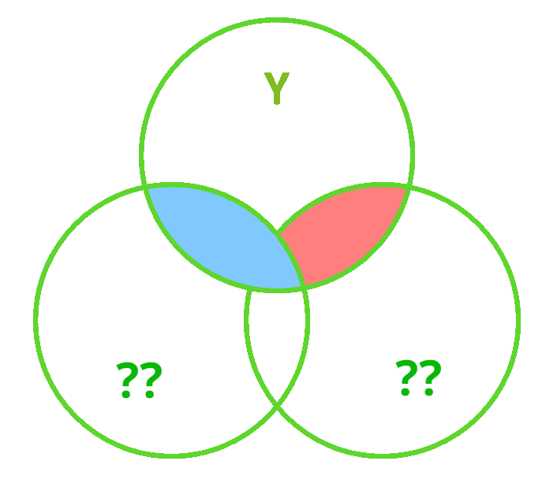

```{r setup, include=FALSE}
library(knitr)
library(tidyverse)
library(ggplot2)
library(kableExtra)
library(patchwork)

xaringanExtra::use_share_again()
xaringanExtra::use_xaringan_extra(c("tile_view","animate_css","tachyons"))
xaringanExtra::use_extra_styles(
  mute_unhighlighted_code = FALSE
)
knitr::opts_chunk$set(
  dev = "svg",
  warning = FALSE,
  message = FALSE,
  cache = FALSE,
  fig.asp = .8
)

options(htmltools.dir.version = FALSE)
options(digits=4,scipen=2)
options(knitr.table.format="html")

theme_set(
    theme_minimal() + 
    theme(text = element_text(size=20))
)

source("jk_source/jk_presfuncs.R")

library(xaringanthemer)

style_mono_accent(
  base_color = "#88B04B", # DAPR3 
  header_color = "#000000",
  header_font_google = google_font("Source Sans Pro"),
  header_font_weight = 400,
  text_font_google = google_font("Source Sans Pro", "400", "400i", "600", "600i"),
  code_font_google = google_font("Source Code Pro"),
  code_font_size = "0.7rem",
  extra_css = list(".scroll-output" = list("height"="90%","overflow-y"="scroll"))
)
```

class: inverse, center, middle

<h1 style="text-align: left;">This Lecture:</h1>
<h3 style="text-align: left;">1. Linear Models Refresher</h3>


???

Before we get to the main focus of this 5 week block, we're going to start with a refresher of Linear models  

Treat as a sort of high-level overview of DAPR2.

limited time, so we might have to go quickly. but do remember that things like piazza and the lab sessions are there for you to ask any questions, and that inludes on stuff like this 


---

# Models

.pull-left[
__deterministic__  

given the same input, deterministic functions return *exactly* the same output

- $y = mx + c$  

- area of sphere = $4\pi r^2$  

- height of fall = $1/2 g t^2$
    - $g = \textrm{gravitational constant, }9.8m/s^2$
    - $t = \textrm{time (in seconds) of fall}$

]

???
getting straight into it, what all of this is about is making models of the world, that we can use in some way.  

models tend to come in two forms, the deterministic, mathematical model.  
think laws of nature and physics, geometry etc.  

--

.pull-right[
__statistical__  

.br2.f4.white.bg-gray[
$$ 
\textrm{outcome} = (\textrm{model}) + \color{black}{\textrm{error}}
$$
]

- handspan = height + randomness  

- cognitive test score = age + premorbid IQ + ... + randomness

]

???
for us though, we're working with statistical models.  
these are models where there is an overall pattern, but there is randomness.  
i.e. individual variation from the pattern


---
# The Linear Model

.br3.pa2.f2[
$$
\begin{align}
\color{red}{\textrm{outcome}} & = \color{blue}{(\textrm{model})} + \textrm{error} \\
\color{red}{y_i} & = \color{blue}{\beta_0 \cdot{} 1 + \beta_1 \cdot{} x_i} + \varepsilon_i \\
\text{where } \\
\varepsilon_i & \sim N(0, \sigma) \text{ independently} \\
\end{align}
$$
]

???
the linear model is one such type of model, where an outcome variable y
is modelled as a linear combination of some set of predictor variables x, plus some error term.  
this is what we worked with all last year, y = beta0 + beta1 x + e  

---
# The Linear Model

.flex.items-top[
.w-50.pa2[
Our proposed model of the world:

$\color{red}{y_i} = \color{blue}{\beta_0 \cdot{} 1 + \beta_1 \cdot{} x_i} + \varepsilon_i$  
  
{{content}}
]
.w-50.pa2[
```{r bb, echo=F, fig.asp=.6}
x <- tibble(x=c(-1,4))
f <- function(x) {5+2*x}
p1 <- x %>% ggplot(aes(x=x)) +
  stat_function(fun=f,size=1,colour="blue") +
  geom_segment(aes(x=0,xend=0,y=0,yend=f(0)),colour="blue", lty="dotted") +
  geom_segment(aes(x=0,xend=1,y=f(0),yend=f(0)),colour="blue",linetype="dotted") +
  geom_segment(aes(x=1,y=f(0),xend=1,yend=f(1)),colour="blue",linetype="dotted") +
  annotate("text",x=.5,y=2.5,label=expression(paste(beta[0], " (intercept)")),
           size=5,parse=TRUE,colour="blue") +
  annotate("text",x=1.4,y=6,label=expression(paste(beta[1], " (slope)")),
           size=5,parse=TRUE,colour="blue") +
    ggtitle(expression(paste(beta[0]," = 5, ",beta[1]," = 2")))+
  scale_y_continuous(breaks=0:13)+
  scale_x_continuous(limits = c(-0.3, 4), breaks=0:4)
p1 +
  ggtitle("")+
  scale_y_continuous("y",labels=NULL)+
  scale_x_continuous(limits=c(-0.3,4), breaks=c(0,1), labels=c("0","1"))
  
```
]]

???
in it's simplest form with one continuous predictor, it looks something like this - a straight line.  

--

Our model _fitted_ to some data (note the $\widehat{\textrm{hats}}$):  

$\hat{y}_i = \color{blue}{\hat \beta_0 \cdot{} 1 + \hat \beta_1 \cdot{} x_i}$  

{{content}}

???
the model is our blue line, with model predicted values (use y hat for those)

--

For the $i^{th}$ observation:
  - $\color{red}{y_i}$ is the value we observe for $x_i$   
  - $\hat{y}_i$ is the value the model _predicts_ for $x_i$   
  - $\color{red}{y_i} = \hat{y}_i + \hat\varepsilon_i$  
  
???
and there is variation around that line, these deviations from observed value to model predicted value are our residuals. 

---
# An Example


.flex.items-top[
.w-50.pa2[

$\color{red}{y_i} = \color{blue}{5 \cdot{} 1 + 2 \cdot{} x_i} + \hat\varepsilon_i$  
  
__e.g.__   
for the observation $x_i = 1.2, \; y_i = 9.9$:  

$$
\begin{align}
\color{red}{9.9} & = \color{blue}{5 \cdot{}} 1 + \color{blue}{2 \cdot{}} 1.2 + \hat\varepsilon_i \\
& = 7.4 + \hat\varepsilon_i \\
& = 7.4 + 2.5 \\
\end{align}
$$
]
.w-50.pa2[
```{r errplot,fig.asp=.6,echo=FALSE}
xX <-1.2
yY <- 9.9
p1 + ylab(expression(paste(hat(y)," = ",5 %.% 1 + 2 %.% x))) +
  geom_point(aes(x=xX,y=yY),size=3,colour="red") +
  geom_segment(aes(x=xX,xend=xX,y=f(xX),yend=yY),linetype="dotted",colour="black") +
  annotate("text",.8,8.6,label=expression(paste(epsilon[i]," (residual)")),colour="black",size=5)
```
]]

???
and the individual observations are going to deviate a little from this due to other stray causes and randomness  

so if our estimate for beta0 is 5 and beta1 is 2, our line is defined by those numbers  
- it hits the y axis at 5
- every 1 it increases in x, it increases by 2 in y

---
# Categorical Predictors

.pull-left[  
```{r echo=FALSE, results="asis"}
set.seed(993)
tibble(
  x = sample(c("Category0","Category1"), size = 30, replace = T),
  y = 5 + 2*(x == "Category1") + rnorm(30,0,1) %>% round(2)
) %>% select(y,x) -> df
cat("<br>")
df %>% sample_n(6) %>% rbind(., c("...","...")) %>% kable()
```
]
.pull-right[
```{r echo=FALSE, fig.asp=.8}

ggplot(df,aes(x=as.numeric(x=="Category1"),y=y))+
  geom_point()+
  stat_summary(geom="point",shape=4,size=6)+
  stat_summary(geom="path", aes(group=1))+
  scale_x_continuous(name="isCategory1",breaks=c(0,1),
                     labels=c("0\n(FALSE)","1\n(TRUE)"))+
  geom_segment(x=0,xend=1,y=mean(df$y[df$x=="Category0"]),yend=mean(df$y[df$x=="Category0"]),
               lty="dashed",col="blue")+
  geom_segment(x=1,xend=1,y=mean(df$y[df$x=="Category0"]),yend=mean(df$y[df$x=="Category1"]),
               lty="dashed",col="blue")+
  annotate("text",x=0.9,y=6,label=expression(paste(beta[1], " (slope)")),
           size=5,parse=TRUE,colour="blue")+
  labs(title="y ~ x    (x is categorical)")
```
]

???
the linear model is really useful, and can be applied to a range of scenarios. 
categorical predictors get entered into our model as sets of variables of 0s and 1s. we can do some clever things to change what the 0s and 1s represent, but the default is:
- zero as some reference category
- changes of 1 representing changes from that reference to some other category


---
# Multiple Predictors

.pull-left[
```{r echo=FALSE, fig.asp=.8}
mwdata <- read_csv(file = "https://uoepsy.github.io/data/wellbeing.csv")
fit<-lm(wellbeing~outdoor_time+social_int, data=mwdata)
steps=20
outdoor_time <- with(mwdata, seq(min(outdoor_time),max(outdoor_time),length=steps))
social_int <- with(mwdata, seq(min(social_int),max(social_int),length=steps))
newdat <- expand.grid(outdoor_time=outdoor_time, social_int=social_int)
wellbeing <- matrix(predict(fit, newdat), steps, steps)

x1 <- outdoor_time
x2 <- social_int
y <- wellbeing

p <- persp(x1,x2,y, theta = 35,phi=10, col = NA,main="y~x1+x2")
obs <- with(mwdata, trans3d(outdoor_time,social_int, wellbeing, p))
pred <- with(mwdata, trans3d(outdoor_time, social_int, fitted(fit), p))
points(obs, col = "red", pch = 16)
#points(pred, col = "blue", pch = 16)
segments(obs$x, obs$y, pred$x, pred$y)

```
]

???
we can have more than one predictor too. rather than fitting a line, our model becomes a 3 dimensional surface fitted to a 3 dimensional cloud of datapoints.  
residuals continue to be deviations from this model to the observations.  

--

.pull-right[
```{r echo=FALSE, fig.asp=.8}
fit<-lm(wellbeing~outdoor_time+social_int+routine, data=mwdata)
steps=20
outdoor_time <- with(mwdata, seq(min(outdoor_time),max(outdoor_time),length=steps))
social_int <- with(mwdata, seq(min(social_int),max(social_int),length=steps))
newdat <- expand.grid(outdoor_time=outdoor_time, social_int=social_int, routine = "Routine")
wellbeing <- matrix(predict(fit, newdat), steps, steps)

x1 <- outdoor_time
x2 <- social_int
y <- wellbeing

p <- persp(x1,x2,y, theta = 35,phi=10, col = NA,zlim=c(10,70), main="y~x1+x2+x3\n(x3 is categorical)")
newdat <- expand.grid(outdoor_time=outdoor_time, social_int=social_int-2, routine = "No Routine")
wellbeing <- matrix(predict(fit, newdat), steps, steps)
y <- wellbeing
par(new=TRUE)
persp(x1,x2,y, theta = 35,phi=10, col = NA,zlim=c(10,80), axes=F)


```
]

???
add in another categorical predictor, and we have two surfaces.  
add in another continuous predictor, and i can't visualise it anymore because we're in more than 3 dimensions, but the logic persists.  

---
exclude: true
# Multiple Predictors

.pull-left[
```{r echo=F, out.height="350px",out.width="400px", fig.align="center"}
knitr::include_graphics("jk_img_sandbox/SSblank1.png")
```
]
.pull-right[]

---
# Multiple Predictors

.pull-left[
```{r echo=F, out.height="350px",out.width="400px", fig.align="center"}
knitr::include_graphics("jk_img_sandbox/SSblank1cov.png")
```
]
.pull-right[
```{r echo=F}
x1 = rnorm(100)
x2 = rnorm(100)
y = .2*x1 + .3*x2 + rnorm(100)
```

```{r}
lm(y ~ x1)
```

]

???
when we have multiple predictors, what do the coefficients represent?  
one way i like to think of this is with venn diagrams.  
consider the simple model with 1 predictor.  
the circle for y is all of the variance in y, and likewise for x1  

the overlap is the shared variance, or covariance, and the linear model is really just re-expressing that.  

so think of this blue bit as the bit of y that is explained by x1  


---
# Multiple Predictors

.pull-left[
```{r echo=F, out.height="350px",out.width="400px", fig.align="center"}
knitr::include_graphics("jk_img_sandbox/SStype3.png")
```
]
.pull-right[
```{r}
lm(y ~ x1 + x2)
```

```{r}
resx1.x2 = resid(lm(x1 ~ x2))
lm(y ~ resx1.x2)
```
]


???
enter x2, and the regression coefficients we get are more like the red and blue bits here.  

it's the bit of y explained by x1 _after_ controlling for x2  

we're basically saying that we want to look at the bit of x1 that explains y that is _unique_ to x1 

because x2 will explain a bit of x1

---
# Interactions

.pull-left[
```{r echo=FALSE, fig.asp=.8}
mwdata2<-read_csv("https://uoepsy.github.io/data/wellbeing_rural.csv") %>% mutate(
  isRural = factor(ifelse(location=="rural","rural","notrural"))
)
par(mfrow=c(1,2))
fit<-lm(wellbeing~outdoor_time+isRural, data=mwdata2)
with(mwdata2, plot(wellbeing ~ outdoor_time, col=isRural, xlab="x1",ylab="y",main="y~x1+x2\n(x2 is categorical)"))
abline(a = coef(fit)[1],b=coef(fit)[2])
abline(a = coef(fit)[1]+coef(fit)[3],b=coef(fit)[2], col="red")

fit<-lm(wellbeing~outdoor_time*isRural, data=mwdata2)
with(mwdata2, plot(wellbeing ~ outdoor_time, col=isRural, xlab="x1",ylab="y",main="y~x1+x2+x1:x2\n(x2 is categorical)"))
abline(a = coef(fit)[1],b=coef(fit)[2])
abline(a = coef(fit)[1]+coef(fit)[3],b=coef(fit)[2]+coef(fit)[4], col="red")
par(mfrow=c(1,1))
```
]

???
we can extend this to include interactions, where the effect of x1 on y _depends on_ x2. 

here we have a continuous by categorical interaction, which is best visualised as two lines that aren't parallel

--

.pull-right[
```{r echo=FALSE, fig.asp=.8}
set.seed(913)
df <- tibble(
  x1 = round(pmax(0,rnorm(50,4,2)),1),
  x2 = round(pmax(0,rnorm(50,4,2)),1),
  y = 8 + .6*x1 + .5*x2 + .8*x1*x2 + rnorm(50,0,4),
  yb = rbinom(50,1,plogis(scale(y)))
)
modl2 <- lm(y~x1*x2,df)

x1_pred <- df |> with(seq(min(x1),max(x1),length.out=100))
x2_pred <- df |> with(seq(min(x2),max(x2),length.out=100))

ac <- expand.grid(x1=x1_pred,x2=x2_pred) 

ypred <- matrix(predict(modl2,type="response",
                             newdata=ac),nrow=100)

library(plot3D)

persp3D(x=x1_pred,y=x2_pred,z=ypred,theta=65,phi=15,
        type="surface",xlab="x1",ylab="x2",zlab="y",
        xlim=c(0,9), ylim=c(0,8),
        zlim=c(min(df$y),max(df$y)+2),colkey=FALSE)
points3D(x=df$x1,y=df$x2,z=df$y,col="black",add=TRUE)
```

]

???
if it's continuous by continuous, this is more like a twisted surface.

but the logic is the same, right? imagine we just took the close edge and far edge of the surface - we'd have two non-parallel lines. with the continuous variable it's just that we're also considering the bit in between the lines, because x2 can take any value


---
# Interactions


.pull-left[

```{r echo=FALSE, fig.asp=.9}
modl2 <- lm(y~x1*x2,df)

x1_pred <- df |> with(seq(min(x1),max(x1),length.out=100))
x2_pred <- df |> with(seq(min(x2),max(x2),by=1))

library(plot3D)
lines3D(x=x1_pred,y=rep(1,100),theta=65,phi=15,
        z=predict(modl2, newdata=tibble(x1=x1_pred,x2=1)),
        xlab="x1",ylab="x2",zlab="y",
        xlim=c(0,9), ylim=c(0,8),
        zlim=c(min(df$y),max(df$y)+2),colkey=FALSE)
lines3D(x=x1_pred,y=rep(2,100),
        z=predict(modl2, newdata=tibble(x1=x1_pred,x2=2)),
        colkey=FALSE,add=TRUE)
lines3D(x=x1_pred,y=rep(3,100),
        z=predict(modl2, newdata=tibble(x1=x1_pred,x2=3)),
        colkey=FALSE,add=TRUE)
lines3D(x=x1_pred,y=rep(4,100),
        z=predict(modl2, newdata=tibble(x1=x1_pred,x2=4)),
        colkey=FALSE,add=TRUE)
lines3D(x=x1_pred,y=rep(5,100),
        z=predict(modl2, newdata=tibble(x1=x1_pred,x2=5)),
        colkey=FALSE,add=TRUE)
lines3D(x=x1_pred,y=rep(6,100),
        z=predict(modl2, newdata=tibble(x1=x1_pred,x2=6)),
        colkey=FALSE,add=TRUE)
lines3D(x=x1_pred,y=rep(7,100),
        z=predict(modl2, newdata=tibble(x1=x1_pred,x2=7)),
        colkey=FALSE,add=TRUE)
```
]
.pull-right[

```{r echo=FALSE, fig.asp=.9}
modl2 <- lm(y~x1*x2,df)

x1_pred <- df |> with(seq(min(x1),max(x1),by=1))
x2_pred <- df |> with(seq(min(x2),max(x2),length.out=100))

library(plot3D)
lines3D(x=rep(1,100),y=x2_pred,theta=65,phi=15,
        z=predict(modl2, newdata=tibble(x1=1,x2=x2_pred)),
        xlab="x1",ylab="x2",zlab="y",
        xlim=c(0,9), ylim=c(0,8),
        zlim=c(min(df$y),max(df$y)+2),colkey=FALSE)
lines3D(x=rep(2,100),y=x2_pred,
        z=predict(modl2, newdata=tibble(x1=2,x2=x2_pred)),
        colkey=FALSE,add=TRUE)
lines3D(x=rep(3,100),y=x2_pred,
        z=predict(modl2, newdata=tibble(x1=3,x2=x2_pred)),
        colkey=FALSE,add=TRUE)
lines3D(x=rep(4,100),y=x2_pred,
        z=predict(modl2, newdata=tibble(x1=4,x2=x2_pred)),
        colkey=FALSE,add=TRUE)
lines3D(x=rep(5,100),y=x2_pred,
        z=predict(modl2, newdata=tibble(x1=5,x2=x2_pred)),
        colkey=FALSE,add=TRUE)
lines3D(x=rep(6,100),y=x2_pred,
        z=predict(modl2, newdata=tibble(x1=6,x2=x2_pred)),
        colkey=FALSE,add=TRUE)
lines3D(x=rep(7,100),y=x2_pred,
        z=predict(modl2, newdata=tibble(x1=7,x2=x2_pred)),
        colkey=FALSE,add=TRUE)
```
]
???
- [SLIDE]
- every one x2 we go up, the slope of x1 changes by some amount b3
- every one x1 we go up, the slope of x2 changes by some amount b3


---
# Notation

$\begin{align} \color{red}{y} \;\;\;\; & = \;\;\;\;\; \color{blue}{\beta_0 \cdot{} 1 + \beta_1 \cdot{} x_1 + ... + \beta_k \cdot x_k} & + & \;\;\;\varepsilon \\ \qquad \\ \color{red}{\begin{bmatrix}y_1 \\ y_2 \\ y_3 \\ y_4 \\ y_5 \\ \vdots \\ y_n \end{bmatrix}} & = \color{blue}{\begin{bmatrix} 1 & x_{11} & x_{21} & \dots & x_{k1} \\ 1 & x_{12} & x_{22} &  & x_{k2} \\ 1 & x_{13} & x_{23} &  & x_{k3} \\ 1 & x_{14} & x_{24} &  & x_{k4} \\ 1 & x_{15} & x_{25} &  & x_{k5} \\ \vdots & \vdots & \vdots & \ddots & \vdots \\ 1 & x_{1n} & x_{2n} & \dots & x_{kn} \end{bmatrix} \begin{bmatrix} \beta_0 \\ \beta_1 \\ \beta_2 \\ \vdots \\ \beta_k \end{bmatrix}} & + & \begin{bmatrix} \varepsilon_1 \\ \varepsilon_2 \\ \varepsilon_3 \\ \varepsilon_4 \\ \varepsilon_5 \\ \vdots \\ \varepsilon_n \end{bmatrix} \\ \qquad \\ \\\color{red}{\boldsymbol y} \;\;\;\;\; & = \qquad \qquad \;\;\; \mathbf{\color{blue}{X \qquad \qquad \qquad \;\;\;\: \boldsymbol \beta}} & + & \;\;\; \boldsymbol \varepsilon \\ \end{align}$

???
so the notation we saw a lot of in DAPR2 was this top bit here
y = beta0 + beta1 x +.... + e

again, outcome (red) = model (blue) + error

you might also see it like this, in matrices. 

which are collapsed to look like this. 

- y is a vector of length n
- x is an n by p matrix (p is the number of predictors)
- b is the vector of coefficients. 
- e is the vector of residuals

and regression is just finding those betas that minimise the residuals.  


---
# Link functions

$\begin{align} \color{red}{y} = \mathbf{\color{blue}{X \boldsymbol{\beta}} + \boldsymbol{\varepsilon}} & \qquad  & (-\infty, \infty) \\ \qquad \\ \qquad \\ \color{red}{ln \left( \frac{p}{1-p} \right) } = \mathbf{\color{blue}{X \boldsymbol{\beta}} + \boldsymbol{\varepsilon}} & \qquad  & [0,1] \\ \qquad \\ \qquad \\ \color{red}{ln (y) } = \mathbf{\color{blue}{X \boldsymbol{\beta}} + \boldsymbol{\varepsilon}} & \qquad  & (0, \infty) \\ \end{align}$  

???
now this can be extended so that instead of modelling y directly, we model some function of y.  

this is useful for studying outcomes that aren't continuous, so things like binary yes/no outcomes. 

fundamentally, the model is the same, but there are extra bits we need to do when interpreting betas. 

---
# Linear Models in R

- Linear regression
```{r eval=FALSE, echo=TRUE}
linear_model <- lm(continuous_y ~ x1 + x2 + x3*x4, data = df)
```

- Logistic regression
```{r eval=FALSE, echo=TRUE}
logistic_model <- glm(binary_y ~ x1 + x2 + x3*x4, data = df, family=binomial(link="logit"))
```

- Poisson regression
```{r eval=FALSE, echo=TRUE}
poisson_model <- glm(count_y ~ x1 + x2 + x3*x4, data = df, family=poisson(link="log"))
```

???
and we saw how to fit these in R using lm() and glm() with the family argument to specify the distribution

---
# Null Hypothesis Testing

```{r echo=FALSE}
set.seed(2394)
samplemeans <- replicate(2000, mean(rnorm(n=100, mean=0, sd=5)))
g <- ggplot(data=tibble(samplemeans),aes(x=samplemeans))+
  #geom_histogram(alpha=.3)+
  stat_function(geom="line",fun=~dnorm(.x, mean=0,sd=sd(samplemeans))*270,lwd=1)

ld <- layer_data(g) %>% filter(x <= sd(samplemeans) & x >= (-sd(samplemeans)))
ld2 <- layer_data(g) %>% filter(x <= 2*sd(samplemeans) & x >= (-2*sd(samplemeans)))
ld3 <- layer_data(g) %>% filter(x >= 1.2)

g + geom_area(data=ld,aes(x=x,y=y),fill="grey30",alpha=.3) + 
  geom_area(data=ld2,aes(x=x,y=y),fill="grey30",alpha=.1) +
  geom_area(data=ld3,aes(x=x,y=y),fill="tomato1",alpha=.3) +
  geom_segment(aes(x=0,xend=0,y=0,yend=dnorm(0,0,sd=sd(samplemeans))*280), lty="dashed")+
  geom_segment(aes(x=1.2,xend=1.2,y=0,yend=180), lty="dashed", col="tomato1")+ 
  # geom_vline(aes(xintercept=1.2),lty="dashed",col="tomato1")+
  labs(x = "statistic")+
  scale_y_continuous(NULL, breaks=NULL)+
  scale_x_continuous(NULL, breaks=NULL, limits=c(-1.5,2))+
  theme_minimal()+
  annotate("text",x=-.5, y=250, label="population parameter\nunder null hypothesis", col="grey30")+
  annotate("text",x=1, y=210, label="statistics we would expect from\nsamples of size n if the\npopulation mean is 0", col="grey30")+
  annotate("text",x=1.65, y=100, label="statistic we observed\nin our sample", col="tomato1")+
  annotate("text",x=1.5, y=40, label="p-value", col="tomato1")+
  geom_curve(aes(x=-.5, xend=0, y=240, yend=220), col="grey30", size=0.5, curvature = 0, arrow = arrow(length = unit(0.03, "npc")))+
  geom_curve(aes(x=1, xend=0.5, y=190, yend=150), col="grey30", size=0.5, curvature = -0.2, arrow = arrow(length = unit(0.03, "npc")))+
  geom_curve(aes(x=1.6, xend=1.2, y=90, yend=40), col="tomato1", size=0.5, curvature = -0.2, arrow = arrow(length = unit(0.03, "npc"))) +
  geom_curve(aes(x=1.5, xend=1.3, y=35, yend=2.5), col="tomato1", size=0.5, curvature = 0, arrow = arrow(length = unit(0.03, "npc")))
```


---
# Inference for Coefficients

```{r echo=FALSE, out.height="500px"}
knitr::include_graphics("jk_img_sandbox/sum1.png")
```

???
when it came to conducting inferences (i.e. drawing conclusions) from the linear models, it was fairly straightforward because it was all contained in the summary


---
# Inference for Coefficients

```{r echo=FALSE, out.height="500px"}
knitr::include_graphics("jk_img_sandbox/sum2.png")
```

???
each coefficient has a standard error, so we can reason about what values for the coefficients we _would_ expect if the true value in the population is zero  


---
# Inference for Coefficients

```{r echo=FALSE, out.height="500px"}
knitr::include_graphics("jk_img_sandbox/sum3.png")
```

???
this allows us to calculate a statistic which essentially standardises "how far away from zero is our coefficient, in units of these standard errors"


---
# Inference for Coefficients

```{r echo=FALSE, out.height="500px"}
knitr::include_graphics("jk_img_sandbox/sum4.png")
```

???
which in turn we can express as a probability of observing the coefficient _if the true value in the population is zero_  

so a quick reminder, the fundamental idea here of statistics here is:

- we take a sample, and calculate an estimate
- samples will vary, so the estimate could be higher/lower than the true value in the population
- we're asking _if the true value in the population is zero_, what's the probability of observing a sample estimate as extreme as this one? that's the p-value


---
# Sums of Squares

Rather than specific coefficients, we can also think of our model as a whole.  
We can talk in terms of the sums of squared residuals  
$\sum^{n}_{i=1}(y_i - \hat y_i)^2$.  

.pull-left[
```{r echo=FALSE, out.height="350px",out.width="400px", fig.align="center"}
knitr::include_graphics("jk_img_sandbox/SS3xmodel1.png")
```
]


.pull-right[

```{r echo=F, fig.asp=.8}
set.seed(993)
df <- 
  tibble(
    x1 = rnorm(100)+3,
    y = x1*2 + rnorm(100)
  )

# SST, SSM and SSR
plt_sst = 
  ggplot(df, aes(x=x1,y=y))+
  geom_point()+
  geom_hline(yintercept=mean(df$y), lty="dashed")+
  geom_segment(aes(x=x1,xend=x1,y=y,yend=mean(df$y)), lty="dashed",col="red")+
  geom_text(x=1,y=8,label="bar(y)",parse=T, size=6)+
  geom_curve(x=1.1,xend=2,y=8,yend=mean(df$y),curvature=-.2)+
  labs(title="SS Total")

plt_ssr = ggplot(df, aes(x=x1,y=y))+
  geom_point()+
  geom_hline(yintercept=mean(df$y), lty="dashed")+
  geom_smooth(method=lm,se=F)+
  geom_segment(aes(x=x1,xend=x1,y=y,yend=fitted(lm(y~x1,df))), lty="dashed",col="red")+
  labs(title="SS Residual")

plt_ssm = ggplot(df, aes(x=x1,y=y))+
  geom_point()+
  geom_hline(yintercept=mean(df$y), lty="dashed")+
  geom_smooth(method=lm,se=F)+
  geom_segment(aes(x=x1,xend=x1,yend=mean(df$y),y=fitted(lm(y~x1,df))), lty="dashed",col="blue")+
  labs(title="SS Model")

plt_sst / (plt_ssm + plt_ssr) & scale_x_continuous("x",breaks=NULL) & scale_y_continuous("y",breaks=NULL)

```

]

???
as well as the coefficients, in DAPR2 we saw that we can think about partitioning up the variance into different parts 

the total sums of squares, the model explained sums of squares, and the residual sums of squares

---
# $R^2$


.pull-left[
```{r echo=F, out.height="350px",out.width="400px", fig.align="center"}
knitr::include_graphics("jk_img_sandbox/SSr2.png")
```
]
.pull-right[
$R^2 = \frac{SS_{Model}}{SS_{Total}} = 1 - \frac{SS_{Residual}}{SS_{Total}}$
```{r echo=FALSE}
x1 = rnorm(100)
x2 = rnorm(100)
y = .2*x1 + .3*x2 + rnorm(100)
```
```{r}
mdl <- lm(y ~ x1 + x2)
summary(mdl)$r.squared
```
]

???
so this gave us metrics like the Rsquared, so get a picture of the proportion of variance explained by the model as a whole

so that includes this middle bit of the venn diagram


---
# Inference: Joint tests

```{r echo=F}
set.seed(2345)
tibble(
  x1=rnorm(100),
  x2=rnorm(100),
  x3=rnorm(100),
  species=rep(letters[1:4],e=25),
  y=10+x1-2*x2+2*x3+(species=="a")*4 + rnorm(100)
) -> df
```

We can test reduction in residual sums of squares:

.pull-left[
```{r}
m1 <- lm(y ~ x1, data = df)
```
```{r echo=FALSE,  out.height="350px",out.width="400px", fig.align="center"}
knitr::include_graphics("jk_img_sandbox/SS3xmodel1.png")
```
]
.pull-right[
```{r}
m2 <- lm(y ~ x1 + x2 + x3, data = df)
```
```{r echo=FALSE,  out.height="350px",out.width="400px", fig.align="center"}
knitr::include_graphics("jk_img_sandbox/SS3xfullmodel.png")
```

]

???
but we also can test reductions in sums of squares, which is essentially a model comparison.

so we compare this model on the left, to the one on the right

---
# Inference: Joint tests

i.e. isolating the improvement in model fit due to inclusion of additional parameters

.pull-left[
```{r}
m1 <- lm(y ~ x1, data = df)
m2 <- lm(y ~ x1 + x2 + x3, data = df)
anova(m1,m2)
```

]
.pull-right[
```{r echo=FALSE,  out.height="350px",out.width="400px", fig.align="center"}
knitr::include_graphics("jk_img_sandbox/SS3xincrement.png")
```
]

???
and we're isolating this bit here - the improvement in the model due to the inclusion of x2 and x3 combined

---
# Inference: Joint tests

"additional parameters" could be a set of coefficients for levels of a categorical variable.  
This provides a way of assessing "are there differences in group means?".  

.pull-left[
```{r}
m1 = lm(y ~ x1, data = df)
m2 = lm(y ~ x1 + species, data = df)
coef(m2)
anova(m1, m2)
```

]
.pull-right[
```{r echo=FALSE,  out.height="350px",out.width="400px", fig.align="center"}
knitr::include_graphics("jk_img_sandbox/SSblankq.png")
```
]

???
one thing this is really useful for is that the additional bit we add to the model might be a load of different groupings.  

so rather than the coefficients which test the specific differences between groups, this joint test can tell us "does the grouping make a difference?"


---
exclude: true
# Inference: Joint tests

This is kind of where traditional analysis of variance sits.  
Think of it as testing the addition of each variable entered in to the model,

.pull-left[
```{r}
m2 = lm(y ~ x1 + species, data = df)
anova(m2)
```

]
.pull-right[
```{r echo=FALSE,  out.height="350px",out.width="400px", fig.align="center"}

```
]

???
this is where "traditional ANOVA" sits. 
we have p categorical predictors with k levels and we assess the reduction in RSS due to inclusion grouping by those k levels


---
# Assumptions

Our model:  

$\color{red}{y} = \color{blue}{\mathbf{X \boldsymbol \beta}} + \varepsilon \qquad \text{where } \boldsymbol \varepsilon \sim N(0, \sigma) \text{ independently}$


Our ability to generalise from the model we fit on sample data to the wider population requires making some _assumptions._

???
Now.. all this inference relies on our model meeting certain assumptions 

--

- assumptions about the nature of the **model** .tr[
(linear)
]

--

- assumptions about the nature of the **errors** .tr[
(normal)
]


.footnote[
You can also phrase the linear model as: $\color{red}{\boldsymbol  y} \sim Normal(\color{blue}{\mathbf{X \boldsymbol \beta}}, \sigma)$
]


---
# Assumptions: The Broad Idea

All our work here is in
aim of making **models of the world**.  

- Models are models. They are simplifications. They are therefore wrong.  

.pull-left[]
.pull-right[

]


---
count:false
# Assumptions: The Broad Idea

All our work here is in
aim of making **models of the world**.  

- Models are models. They are simplifications. They are therefore wrong.  

- Our residuals ( $y - \hat{y}$ ) reflect everything that we **don't** account for in our model.  


--

- In an ideal world, our model accounts for _all_ the systematic relationships. The leftovers (our residuals) are just random noise.  

--

  - If our model is mis-specified, or we don't measure some systematic relationship, then our residuals will reflect this.

--

- We check by examining how much "like randomness" the residuals appear to be (zero mean, normally distributed, constant variance, i.i.d ("independent and identically distributed")
    - _these ideas tend to get referred to as our "assumptions"_

--

- We will **never** know whether our residuals contain only randomness - we can never observe everything! 


---
# Assumptions

.pull-left[

What does "zero mean and constant variance" look like?  

- mean of the residuals = zero across the predicted values on the linear predictor.  

- spread of residuals is normally distributed and constant across the predicted values on the linear predictor.  


]
.pull-right[

```{r echo=FALSE,fig.asp=.8}
library(ggdist)
library(tidyverse)
df<-tibble(x=runif(1000,1,10),xr = round(x), y=1*x+rnorm(1000))
df$y2 <- resid(lm(y~x,df))
#df$y[df$x==6]<-6+rnorm(100,0,3)
df %>% group_by(xr) %>% summarise(m=mean(y2), s=sd(y2)) -> dfd
p1 <- ggplot(df, aes(x=x,y=y))+
  geom_point()+
  geom_smooth(method="lm",se=F, fullrange=T)+
  scale_x_continuous("x",1:10, breaks=seq(1,10,2))+
  scale_y_continuous("y")
p2 <- ggplot(df, aes(x=xr,y=y2))+
  geom_jitter(height=0,width=1, alpha=.3)+
  stat_dist_halfeye(inherit.aes=F,data=dfd, aes(x=xr,dist="norm",arg1=m,arg2=s),alpha=.6, fill="orange")+
  #geom_smooth(method="lm",se=F, fullrange=T)+
  scale_x_continuous("x",1:10, breaks=seq(1,10,2))+
  scale_y_continuous("residuals")

p1 / p2
```

]

---
# Assumptions

.pull-left[

What does "zero mean and constant variance" look like?  

- __mean of the residuals = zero across the predicted values on the linear predictor.__    

- spread of residuals is normally distributed and constant across the predicted values on the linear predictor.  


]
.pull-right[


```{r echo=FALSE,fig.asp=.8}
library(ggdist)
library(tidyverse)
tibble(x = runif(1000,1,10),
       xr = round(x),
       s = abs(5-x)*2,
       e = map_dbl(s,~rnorm(1,0,1)),
       y = x + s + e) -> df
df$y2 <- resid(lm(y~x,df))
#df$y[df$x==6]<-6+rnorm(100,0,3)
df %>% group_by(xr) %>% summarise(m=mean(y2), s=sd(y2)) -> dfd
p1 <- ggplot(df, aes(x=x,y=y))+
  geom_point()+
  geom_smooth(method="lm",se=F, fullrange=T)+
  scale_x_continuous("x",1:10, breaks=seq(1,10,2))+
  scale_y_continuous("y")
p2 <- ggplot(df, aes(x=xr,y=y2))+
  geom_jitter(height=0,width=1, alpha=.3)+
  stat_dist_halfeye(inherit.aes=F,data=dfd, aes(x=xr,dist="norm",arg1=m,arg2=s),alpha=.6, fill="orange")+
  scale_x_continuous("x",1:10, breaks=seq(1,10,2))+
  scale_y_continuous("residuals")

p1 / p2
```

]

---
# Assumptions

.pull-left[

What does "zero mean and constant variance" look like?  

- mean of the residuals = zero across the predicted values on the linear predictor.  

- __spread of residuals is normally distributed and constant across the predicted values on the linear predictor.__  


]
.pull-right[

```{r echo=FALSE,fig.asp=.8}
library(ggdist)
library(tidyverse)
tibble(x = runif(1000,1,10),
       xr = round(x),
       s = abs(x)/2,
       e = map_dbl(s,~rnorm(1,0,.)),
       y = x + e) -> df
df$y2 <- resid(lm(y~x,df))
#df$y[df$x==6]<-6+rnorm(100,0,3)
df %>% group_by(xr) %>% summarise(m=mean(y2), s=sd(y2)) -> dfd
p1 <- ggplot(df, aes(x=x,y=y))+
  geom_point()+
  geom_smooth(method="lm",se=F, fullrange=T)+
  scale_x_continuous("x",1:10, breaks=seq(1,10,2))+
  scale_y_continuous("y")
p2 <- ggplot(df, aes(x=xr,y=y2))+
  geom_jitter(height=0,width=1, alpha=.3)+
  stat_dist_halfeye(inherit.aes=F,data=dfd, aes(x=xr,dist="norm",arg1=m,arg2=s),alpha=.6, fill="orange")+
  scale_x_continuous("x",1:10, breaks=seq(1,10,2))+
  scale_y_continuous("residuals")

p1 / p2
```
]

---
# Assumptions

.pull-left[

What does "zero mean and constant variance" look like?  

- mean of the residuals = zero across the predicted values on the linear predictor.  

- spread of residuals is normally distributed and constant across the predicted values on the linear predictor.  


]
.pull-right[
__`plot(model)`__

```{r echo=FALSE}
df<-tibble(x=runif(1000,1,10),xr = round(x), y=1*x+rnorm(1000))
```

```{r fig.asp=.8}
my_model <- lm(y ~ x, data = df)
plot(my_model, which = 1)
```

]


---
# Assumptions: Recipe Book
<br><br>
<center>
<div class="acronym">
L
</div> inearity<br>
<div class="acronym">
I
</div> ndependence<br>
<div class="acronym">
N
</div> ormality<br>
<div class="acronym">
E
</div> qual variance<br>
</center>
.footnote["Line without N is a Lie!" (Umberto)]

---
# What if our model doesn't meet assumptions?

- is our model mis-specified?  
  - is the relationship non-linear? higher order terms? (e.g. $y \sim x + x^2$)
  - is there an omitted variable or interaction term? 
  
  
--

- transform the outcome variable?
  - makes things look more "normal"
  - but can make things more tricky to interpret:  
    `lm(y ~ x)` and `lm(log(y) ~ x)` are quite different models

--

- bootstrap\*
  - do many times: resample (w/ replacement) your data, and refit your model.
  - obtain a distribution of parameter estimate of interest. 
  - compute a confidence interval for estimate
  - celebrate

.footnote[\* not great with small samples.]

--

__looking ahead:__ these don't help if we have violated our assumption of independence...

---
# Summary

- we can fit a linear regression model which takes the form $\color{red}{y} = \color{blue}{\mathbf{X} \boldsymbol{\beta}} + \boldsymbol{\varepsilon}$  

- in R, we fit this with `lm(y ~ x1 + .... xk, data = mydata)`.  

- we can extend this to different link functions to model outcome variables which follow different distributions.  

- when drawing inferences from a fitted model to the broader population, we rely on certain assumptions.  

  - one of these is that the errors are independent.


---
class: inverse, center, middle, animated, rotateInDownLeft

# End


