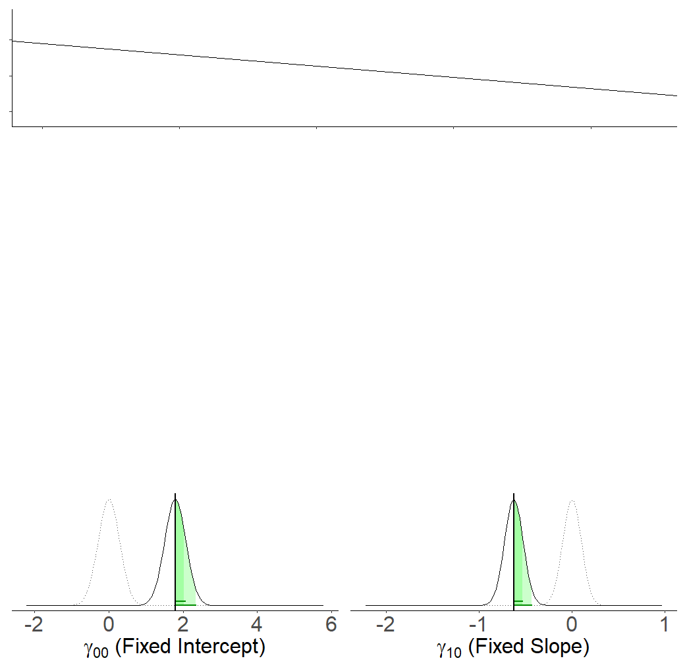
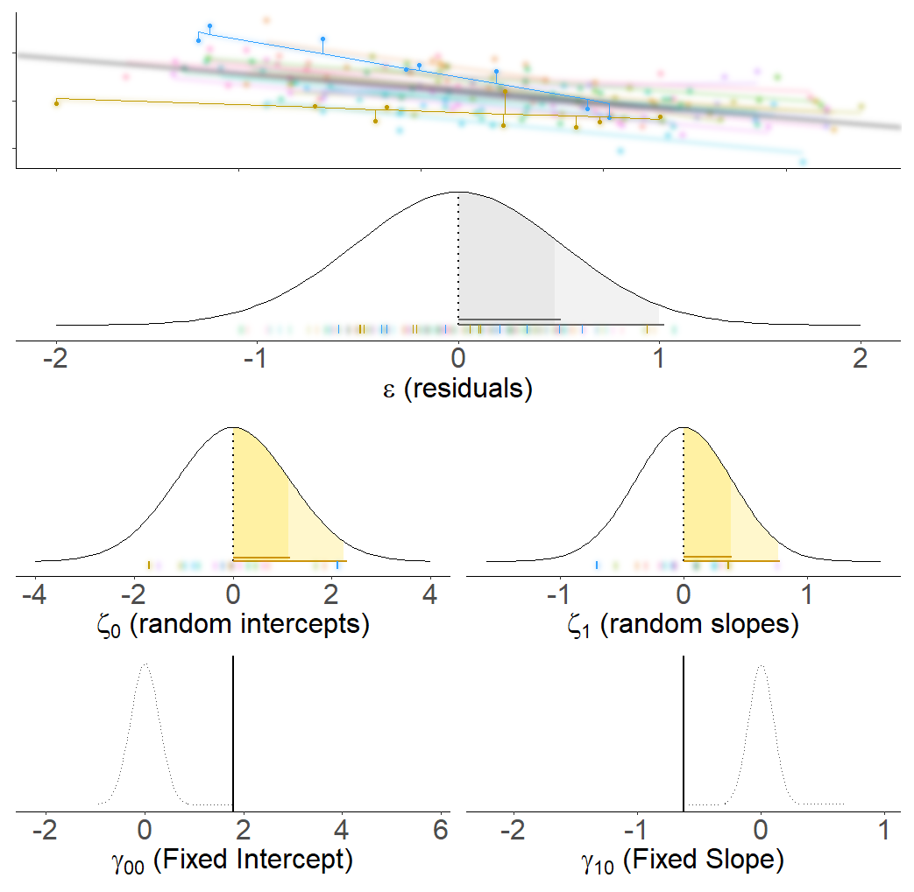

```{r setup, include=FALSE}
library(knitr)
library(tidyverse)
library(ggplot2)
library(kableExtra)
library(patchwork)

xaringanExtra::use_share_again()
xaringanExtra::use_xaringan_extra(c("tile_view","animate_css","tachyons"))
xaringanExtra::use_extra_styles(
  mute_unhighlighted_code = FALSE
)
knitr::opts_chunk$set(
  dev = "svg",
  warning = FALSE,
  message = FALSE,
  cache = FALSE,
  fig.asp = .8
)

options(htmltools.dir.version = FALSE)
options(digits=4,scipen=2)
options(knitr.table.format="html")

theme_set(
    theme_minimal() + 
    theme(text = element_text(size=20))
)

source("jk_source/jk_presfuncs.R")

library(xaringanthemer)

style_mono_accent(
  base_color = "#88B04B", # DAPR3 
  header_color = "#000000",
  header_font_google = google_font("Source Sans Pro"),
  header_font_weight = 400,
  text_font_google = google_font("Source Sans Pro", "400", "400i", "600", "600i"),
  code_font_google = google_font("Source Code Pro"),
  code_font_size = "0.7rem",
  extra_css = list(".scroll-output" = list("height"="90%","overflow-y"="scroll"))
)
```

class: inverse, center, middle

<h1 style="text-align: left;">This Lecture:</h1>
<h3 style="text-align: left;">1. Multilevel model structure</h3>
<h3 style="text-align: left;opacity:1">2. From `lm` to `lmer`</h3>
<h3 style="text-align: left;">3. Model estimation</h3>
<h3 style="text-align: left;">4. Examples and useful packages</h3>

???

- last week = little taster. 
- often, starting with LM is a good place, so that's what we'll do

---
class: inverse, center, middle

<h1 style="text-align: left;">This Lecture:</h1>
<h3 style="text-align: left;">1. Multilevel model structure</h3>
<h3 style="text-align: left;opacity:.4">2. From `lm` to `lmer`</h3>
<h3 style="text-align: left;opacity:.4">3. Model estimation</h3>
<h3 style="text-align: left;opacity:.4">4. Examples and useful packages</h3>

---
# Terminology

```{r echo=FALSE, eval=FALSE}
tribble(
  ~word, ~freq,
  "multi-level model", 154000 + 31300,
  "hierarchical linear model", 24000,
  "mixed-effect model", 56500 + 191000,
  "mixed model", 1500000
  "random coefficient model", 11200+6920,
  "random-effect model", 101000 + 501000,
  "random parameter model", 2140 + 1460,
  "random-intercept model", 17100 + 2930, 
  "variance components model", 6210 + 5560,
  "partial pooling", 5120,
  "mixed error-component model", 62,
  "random slope model", 4010 + 1620,
  "panel data model", 55400,
  "latent curve model", 1520,
  "growth curve model", 18400
) -> mlmname


#mlmname$freq[mlmname$freq > 100000] <- c(75000,85000, 110000,80000,95000)*1.5

#wordcloud2(mlmname, shape="diamond", size=.4)
library(wordcloud)
wordcloud(words = mlmname$word, freq = mlmname$freq, random.order=FALSE,
          min.freq=1,
          scale=c(4,.5),rot.per=0,
          fixed.asp=T,
          #ordered.colors=T,
          colors="#88B04B")
```

```{r echo=FALSE, fig.cap="(size weighted by hits on google scholar)", fig.align="center", fig.asp=.9}
knitr::include_graphics("jk_img_sandbox/mlmname.png")
```

???
- lots of different names
- lots of different terminology
- [DESCRIBE PLOT]

---
# Notation 
<!-- $$ -->
<!-- \begin{align} -->
<!-- & \text{for observation }i \\ -->
<!-- \quad \\ -->
<!-- & \color{red}{y_i} = \color{blue}{\beta_0 \cdot{} 1 \; + \; \beta_1 \cdot{} x_{i} } + \varepsilon_i \\ -->
<!-- \end{align} -->
<!-- $$ -->
**Simple regression**  
.pull-left[
$\begin{align} & \text{for observation }i \\ \quad \\ \quad \\ & \color{red}{y_i} = \color{blue}{\beta_0 \cdot{} 1 \; + \; \beta_1 \cdot{} x_{i} } + \varepsilon_i \\ \end{align}$
]

???
- DAPR2 = almost entire focus on this [EQUATION]
- [COLOURS] = observations equals model plus error
- indexing is just at one level: observation i
- EG: test score ~ revision hours
  - we have score of person i 
  - intercept and slope x hours i
  - residual for that person i

---
# Notation 

<!-- $$ -->
<!-- \begin{align} -->
<!-- & \text{for observation }j\text{ in group }i \\ -->
<!-- \quad \\ -->
<!-- & \text{Level 1:} \\ -->
<!-- & \color{red}{y_{ij}} = \color{blue}{\beta_{0i} \cdot 1 + \beta_{1i} \cdot x_{ij}} + \varepsilon_{ij} \\ -->
<!-- & \text{Level 2:} \\ -->
<!-- & \color{blue}{\beta_{0i}} = \gamma_{00} + \color{orange}{\zeta_{0i}} \\ -->
<!-- & \color{blue}{\beta_{1i}} = \gamma_{10} + \color{orange}{\zeta_{1i}} \\ -->
<!-- \quad \\ -->
<!-- & \text{Where:} \\ -->
<!-- & \gamma_{00}\text{ is the population intercept, and }\color{orange}{\zeta_{0i}}\text{ is the deviation of group }i\text{ from }\gamma_{00} \\ -->
<!-- & \gamma_{10}\text{ is the population slope, and }\color{orange}{\zeta_{1i}}\text{ is the deviation of group }i\text{ from }\gamma_{10} \\ -->
<!-- $$ -->
**Multi-level**  
.pull-left[
$\begin{align} & \text{for observation }j\text{ in group }i \\ \quad \\ & \text{Level 1:} \\ & \color{red}{y_{ij}} = \color{blue}{\beta_{0i} \cdot 1 + \beta_{1i} \cdot x_{ij}} + \varepsilon_{ij} \\ & \text{Level 2:} \\ & \color{blue}{\beta_{0i}} = \gamma_{00} + \color{orange}{\zeta_{0i}} \\ & \color{blue}{\beta_{1i}} = \gamma_{10} + \color{orange}{\zeta_{1i}} \\ \quad \\ \end{align}$
]

???
- MLM = models that fit a structure with >1 level of observation
- canonical example = child j from class i
- NOTE i and j in some textbooks are switched 
- the MLM has a level 1 equation
  - school/child, this is for each child j [EQUATION]   
  - betas are now indexed to the school i from which that child j comes

- [OVERSIMPLIFIED] - its like lots of regression models for each group, smushed into one model


--

.pull-right[
$\begin{align} & \text{Where:} \\ & \gamma_{00}\text{ is the population intercept}\\ & \text{and  }\color{orange}{\zeta_{0i}}\text{ is the deviation of group }i\text{ from }\gamma_{00} \\ \qquad \\ & \gamma_{10}\text{ is the population slope,}\\ & \text{and }\color{orange}{\zeta_{1i}}\text{ is the deviation of group }i\text{ from }\gamma_{10} \\ \end{align}$
]

???
- to define each beta, we need another equation
- equations for betas are at level 2
  - level 2 = higher than level 1
  - school/child: this is a school-level equation specifying school level deviations
- for each school i, some deviation for that group, zeta_i from an overall average

---
count: false
# Notation 

**Multi-level**  
.pull-left[
$\begin{align} & \text{for observation }j\text{ in group }i \\ \quad \\ & \text{Level 1:} \\ & \color{red}{y_{ij}} = \color{blue}{\beta_{0i} \cdot 1 + \beta_{1i} \cdot x_{ij}} + \varepsilon_{ij} \\ & \text{Level 2:} \\ & \color{blue}{\beta_{0i}} = \gamma_{00} + \color{orange}{\zeta_{0i}} \\ & \color{blue}{\beta_{1i}} = \gamma_{10} + \color{orange}{\zeta_{1i}} \\ \quad \\ \end{align}$
]
.pull-right[
$\begin{align} & \text{Where:} \\ & \gamma_{00}\text{ is the population intercept}\\ & \text{and  }\color{orange}{\zeta_{0i}}\text{ is the deviation of group }i\text{ from }\gamma_{00} \\ \qquad \\ & \gamma_{10}\text{ is the population slope,}\\ & \text{and }\color{orange}{\zeta_{1i}}\text{ is the deviation of group }i\text{ from }\gamma_{10} \\ \end{align}$
]


We are now assuming $\color{orange}{\zeta_0}$, $\color{orange}{\zeta_1}$, and $\varepsilon$ to be normally distributed with a mean of 0, and we denote their variances as $\sigma_{\color{orange}{\zeta_0}}^2$, $\sigma_{\color{orange}{\zeta_1}}^2$, $\sigma_\varepsilon^2$ respectively.   

The $\color{orange}{\zeta}$ components also get termed the "random effects" part of the model, Hence names like "random effects model", etc.

???
- clever MLM = model group deviations as a distribution
- NOTE: a bit like the errors epsilon are deviations around a line, zetas are random deviations around some estimate
- what model is actually _estimating_ is __not__ the zetas, but _variances_ (sd) of the zetas

- hence "random effects" - we are supposing the school differences are because we have randomly sampled a set of schools
- different schools = different set of deviations
- randomly drawn from a population of schools

- NOTE we can choose what to be random effect
  - e.g. random intercept


---
# Notation 

**Mixed-effects == Multi Level**

Sometimes, you will see the levels collapsed into one equation, as it might make for more intuitive reading:

$\color{red}{y_{ij}} = \underbrace{(\gamma_{00} + \color{orange}{\zeta_{0i}})}_{\color{blue}{\beta_{0i}}} \cdot 1 + \underbrace{(\gamma_{10} + \color{orange}{\zeta_{1i}})}_{\color{blue}{\beta_{1i}}} \cdot x_{ij}  +  \varepsilon_{ij} \\$

.footnote[
**other notation to be aware of**  

- Many people use the symbol $u$ in place of $\zeta$  

- Sometimes people use $\beta_{00}$ instead of $\gamma_{00}$  

- In various resources, you are likely to see $\alpha$ used to denote the intercept instead of $\beta_0$  

]

???
- MLM collapses into one line
- sub in level 2 eqs into level 1
- termed "Mixed Effects" because effects = a mix of fixed values and random deviations around them. 


---
# Notation 

__Matrix form (optional)__

And then we also have the condensed matrix form of the model, in which the Z matrix represents the grouping structure of the data, and $\zeta$ contains the estimated random deviations. 


$\begin{align} \color{red}{\begin{bmatrix} y_{11} \\ y_{12} \\ y_{21} \\ y_{22} \\ y_{31} \\ y_{32} \\ \end{bmatrix}} & = \color{blue}{\begin{bmatrix} 1 & x_{11} \\ 1 & x_{12} \\ 1 & x_{21} \\ 1 & x_{22} \\1 & x_{31} \\ 1 & x_{32} \\ \end{bmatrix} \begin{bmatrix} \gamma_{00} \\ \beta_1 \\  \end{bmatrix}} & + & \color{orange}{ \begin{bmatrix} 1 & 0 & 0 \\ 1 & 0 & 0 \\ 0 & 1 & 0 \\ 0 & 1 & 0 \\ 0 & 0 & 1 \\ 0 & 0 & 1 \\ \end{bmatrix} \begin{bmatrix}\zeta_{01} \\ \zeta_{02} \\ \zeta_{03} \end{bmatrix}} & + & \begin{bmatrix} \varepsilon_{11} \\ \varepsilon_{12} \\ \varepsilon_{21} \\ \varepsilon_{22} \\ \varepsilon_{31} \\ \varepsilon_{32} \end{bmatrix} \\ \qquad \\ \\ \color{red}{\boldsymbol y}\;\;\;\;\; & = \qquad \mathbf{\color{blue}{X \qquad \;\;\boldsymbol \beta}} & + & \qquad \; \mathbf{\color{orange}{Z \qquad \;\;\;\;\; \boldsymbol \zeta}} & + & \;\;\;\varepsilon \\ \end{align}$

<!-- $$ -->
<!-- \begin{align}  -->
<!-- \color{red}{ -->
<!-- \begin{bmatrix} -->
<!-- y_{11} \\ y_{12} \\ y_{21} \\ y_{22} \\ y_{31} \\ y_{32} \\ -->
<!-- \end{bmatrix} -->
<!-- } & =  -->
<!-- \color{blue}{ -->
<!-- \begin{bmatrix} -->
<!-- 1 & x_{11} \\ -->
<!-- 1 & x_{12} \\ -->
<!-- 1 & x_{21} \\ -->
<!-- 1 & x_{22} \\ -->
<!-- 1 & x_{31} \\ -->
<!-- 1 & x_{32} \\ -->
<!-- \end{bmatrix}  -->
<!-- \begin{bmatrix}  -->
<!-- \gamma_{00} \\ \beta_1 \\   -->
<!-- \end{bmatrix} -->
<!-- }  -->
<!-- & -->
<!-- + & -->
<!-- \color{orange}{ -->
<!-- \begin{bmatrix}  -->
<!-- 1 & 0 & 0 \\  -->
<!-- 1 & 0 & 0 \\ -->
<!-- 0 & 1 & 0 \\ -->
<!-- 0 & 1 & 0 \\ -->
<!-- 0 & 0 & 1 \\ -->
<!-- 0 & 0 & 1 \\ -->
<!-- \end{bmatrix} -->
<!-- \begin{bmatrix}  -->
<!-- \zeta_{01} \\ \zeta_{02} \\ \zeta_{03}  -->
<!-- \end{bmatrix} -->
<!-- } -->
<!-- & + & -->
<!-- \begin{bmatrix}  -->
<!-- \varepsilon_{11} \\ \varepsilon_{12} \\ \varepsilon_{21} \\ \varepsilon_{22} \\ \varepsilon_{31} \\ \varepsilon_{32}  -->
<!-- \end{bmatrix} \\  -->
<!-- \qquad \\  -->
<!-- \\ -->
<!-- \color{red}{\boldsymbol y}\;\;\;\;\; & = \qquad \mathbf{\color{blue}{X \qquad \;\;\boldsymbol \beta}} & + & \qquad \; \mathbf{\color{orange}{Z \qquad \;\;\;\;\; \boldsymbol \zeta}} & + & \;\;\;\varepsilon \\  -->
<!-- \end{align} -->
<!-- $$ -->

???
- [OPTIONAL] 
- can also express this as matrix of data and coefficients
- same as we did in prev lecture for simple regression

- y = vector length n
- x = n by p matrix
- beta = vector p coefficients
- z = n by g matrix of grouping structure
- zeta = a matrix of random effects zeta, 


---
# Fixed vs Random

.pull-left[
$\begin{align}& \text{Level 1:} \\ & \color{red}{y_{ij}} = \color{blue}{\beta_{0i} \cdot 1 + \beta_{1i} \cdot x_{1ij} + \beta_2 \cdot x_{2ij}} + \varepsilon_{ij} \\ & \text{Level 2:} \\ & \color{blue}{\beta_{0i}} = \underbrace{\gamma_{00}}_{\textrm{fixed}} + \color{orange}{\underbrace{\zeta_{0i}}_{\textrm{random}}} \\ & \color{blue}{\beta_{1i}} = \underbrace{\gamma_{10}}_{\textrm{fixed}} + \color{orange}{\underbrace{\zeta_{1i}}_{\textrm{random}}} \\ \quad \\ \end{align}$
]
.pull-right[
$\color{red}{y_{ij}} = (\underbrace{\gamma_{00}}_{\textrm{fixed}} + \color{orange}{\underbrace{\zeta_{0i}}_{\textrm{random}}}) \cdot 1 + (\underbrace{\gamma_{10}}_{\textrm{fixed}} + \color{orange}{\underbrace{\zeta_{1i}}_{\textrm{random}}}) \cdot x_{1ij} + \underbrace{\beta_2}_{\textrm{fixed}} \cdot x_{2ij} +  \varepsilon_{ij} \\$
]

$\color{orange}{\zeta_i}$ is "random" because considered a random sample from larger population such that $\color{orange}{\zeta_i} \sim N(0, \sigma^2_{\color{orange}{\zeta_i}})$. 

???
- both MLM or "mixed effects", we model our "effects" (i.e., the estimated influence that variables exert over our outcome) as randomly varying across our observed groups. 
- our effects can either be:
  - a fixed constant for all our groups
  - a fixed estimate around which our groups randomly vary.   

- [EQUATION] effect of beta2 is just a single constant
- effect of beta0 and beta1 are fixed values around which we have groups deviating

---
# Fixed vs Random

I have groups in my data, should I:  

a. include group as a fixed effect predictor $\color{blue}{\beta \cdot Group}$  
b. consider the groups to be 'clusters' and include group-level random effects $\color{orange}{\zeta_{i}}$

| Criterion: | Repetition: <br> _If the experiment were repeated:_ | Desired inference: <br> _The conclusions refer to:_ |
|----------------|--------------------------------------------------|----------------------------------------------------|
| Fixed effects  | <center>Same levels would be used</center>     |    <center>The levels used </center>                                   |
| Random effects | <center>Different levels would be used</center>   | <center>A population from which the levels used<br> are just a (random) sample</center> |

Practical points:  
- Sometimes there isn't enough variability between groups to model random effects. 
  - $\sigma^2_{\color{orange}{\zeta}}$ gets estimated as (too close to) zero.
- Sometimes you might not have sufficient data (e.g. only have 6 'clusters'). 
  - estimate of $\sigma^2_{\color{orange}{\zeta}}$ needs sufficient $n$  

???
- random parts = those we consider to be random sample from larger population
- school/child example - schools themselves are a sample of schools
- instead of schools, we had whether the child was public vs private school
  - only 2 groups, and chance is that these are of specific inferential interest
- you can think of it as "if someone were to replicate this experiment, would they use the same levels of this variable?". 


- important: not everything that can be modelled as a random effect SHOULD be modelled as such.  
- for example, recall these models estimate the variance in group deviations around fixed estimates. 
  - with 3 groups, we have 3 deviations. but that's only 3 datapoints to base an estimate of variance on  


---
# Advantages of MLM

Multi-level models can be used to answer multi-level questions!  
<br><br>
Do phenomena at Level X predict __outcomes__ at Level Y?  

__example:__  
$n$ participants, each completes reaction time task multiple times.  
Q: Does handedness (L vs R) predict variation in reaction times?  

$$
\begin{align}
\textrm{for person }i\textrm{, observation }j \\
\textrm{reaction time}_{ij} &= \beta_{0i} + \varepsilon_{ij} \\
\beta_{0i} &= \gamma_{00} + \zeta_{0i} + \gamma_{01}\textrm{handedness}_i
\end{align}
$$
<br>
Single equation:  
$$
\begin{equation}
\textrm{reaction time}_{ij} = (\gamma_{00} + \zeta_{0i}) + \gamma_{01}\textrm{handedness}_i + \varepsilon_{ij}
\end{equation}
$$

???
- other than being one method of accounting for clustering in data, why fit MLM?
- MLM allows us to ask some interesting multilevel questions
- e.g. does some predictor at one level influences outcomes at another level.
- [EXAMPLE] we have measured childrens' performance on a test over time, so multiple observations per child. we fit a model where children's intercept varies, and we ask whether this is predicted by their nr of siblings 
- note that really this is identical to a beta. it's a fixed constant, it just applies to something measured at level 2


---
# Advantages of MLM

Multi-level models can be used to answer multi-level questions!  
<br><br>
Do phenomena at Level X influence __effects__ at Level Y?  

__example:__  
$n$ children's grades are recorded every year throughout school  
Q: Does being mono/bi-lingual influence childrens' grades over the duration of their schooling?  

$$
\begin{align}
\textrm{for child }i\textrm{, in year }j \\
\textrm{grade}_{ij} &= \beta_{0} + \beta_{1i}\textrm{school year}_{ij} + \varepsilon_{ij} \\  
\beta_{1i} &= \gamma_{10} + \zeta_{1i} + \gamma_{11}\textrm{bilingual}_i
\end{align}
$$

<br>
Single equation:   
$$
\begin{equation}
\textrm{grade}_{ij} = \beta_{0} + (\gamma_{10} + \zeta_{1i})\cdot\textrm{school year}_{ij} + \gamma_{11}\textrm{bilingual}_i\cdot\textrm{school year}_{ij} + \varepsilon_{ij}
\end{equation}
$$

???
- or if a variable at some level moderates the effect of a variable at a different level
- [EXAMPLE] 
we have measured childrens' performance on a test over time, so we have multiple observations for each child. we can ask whether the slope of time (and there's a slope for each child) differs depending on whether the child is bilingual
- and this is really just an interaction, but one effect is at child level, and the other is at observation level


---
# Advantages of MLM

Multi-level models can be used to answer multi-level questions!  
<br><br>
Do random variances covary?  

__example:__  
$n$ participants' cognitive ability is measured across time.  
Q: Do people who have higher cognitive scores at start of study show less decline over the study period than those who have lower scores?  

$$
\begin{align}
\textrm{for person }i\textrm{, at time }j \\
\textrm{cognition}_{ij} &= \beta_{0i} + \beta_{1i}\textrm{time}_{ij} + \varepsilon_{ij} \\
\beta_{0i} &= \gamma_{00} + \zeta_{0i}\\
\beta_{1i} &= \gamma_{10} + \zeta_{1i}\\
\end{align}
$$
$$
\begin{equation}
\begin{bmatrix} \zeta_{0i} \\ \zeta_{1i} \end{bmatrix}
\sim N
\left(
    \begin{bmatrix} 0 \\ 0 \end{bmatrix},
    \begin{bmatrix}
        \sigma_0^2 & \rho \sigma_0 \sigma_1 \\
        \rho \sigma_0 \sigma_1 & \sigma_1^2
    \end{bmatrix}
\right)
\end{equation}
$$


???
- can also get more complicated
- in estimating variances of random effects, the model can also estimate covariances
- [EQUATION]
- allows us to ask about how cluster level deviations in one aspect correlate with cluster level deviations at others
- [EXAMPLE] we have measured childrens' performance on a test over time, and each child has their own intercept and their own slope. we might be interested in whether children who start higher increase more (have steeper slopes)

---
class: inverse, center, middle

<h1 style="text-align: left;">This Lecture:</h1>
<h3 style="text-align: left;opacity:.4">1. Multilevel model structure</h3>
<h3 style="text-align: left;opacity:1">2. From `lm` to `lmer`</h3>
<h3 style="text-align: left;opacity:.4">3. Model estimation</h3>
<h3 style="text-align: left;opacity:.4">4. Examples and useful packages</h3>

---
# The lme4 package

- **lme4** package (many others are available, but **lme4** is most popular).  

- `lmer()` function.  

- syntax is similar to `lm()`, in that we specify:   

    __*[outcome variable]*__ ~ __*[explanatory variables]*__, data = __*[name of dataframe]*__
    
- in `lmer()`, we add to this the random effect structure in parentheses:  

    __*[outcome variable]*__ ~ __*[explanatory variables]*__ + (__*[vary this]*__ | __*[by this grouping variable]*__),  
    data = __*[name of dataframe]*__, REML = __*[TRUE/FALSE]*__
    
    
```{r eval=FALSE}
lmer(score ~ 1 + year + (1 + year | school), data = ...
```


???
- okay, lots of equations, let's take a spin a the visual side of this
- before we go any furtehr, let's look at fitting these models in R
- it's straightforward
- lme4 package
- same notation
- _BUT_ - we specify the things we want to vary, and what we want to vary them by


---
# eg1 (Longitudinal): Data

.pull-left[

> In a study examining how cognition changes over time, a sample of 20 participants took the Addenbrooke's Cognitive Examination (ACE) every 2 years from age 60 to age 78.  

Each participant has 10 datapoints. Participants are clusters.  


]
.pull-right[
```{r}
d3 <- read_csv("https://uoepsy.github.io/data/dapr3_mindfuldecline.csv")
head(d3)
```
]

???
Same data we saw last week. 
- 200 datapoints, from 20 participants. 
- we're looking at how cognition changes over time


---
count: false
# eg1: Data

.pull-left[

> In a study examining how cognition changes over time, a sample of 20 participants took the Addenbrooke's Cognitive Examination (ACE) every 2 years from age 60 to age 78.  

```{r}
library(ICC)
ICCbare(x=ppt, y=ACE, data=d3)
```

__Reminder:__ the Intraclass Correlation Coefficient is ratio of variance between clusters to the total variance (variance within + variance between).


```{r echo=TRUE, fig.show='hide'}
pptplots <- 
  ggplot(d3, aes(x = visit, y = ACE, 
                  col = ppt)) +
  geom_point()+
  facet_wrap(~ppt) + 
  guides(col = "none") +
  labs(x = "visit", y = "cognition")
```
]
.pull-right[

```{r fig.asp=.9}
pptplots
```

]

???
- ICC is telling us that 48% variance in cognitive scores can be attributed to the variation between participants
- and let's just remind ourselves of the facetted plots - one plot for each person. each dot is an observed score on a test.

---
exclude: true
# eg1: ICC

.pull-left[
```{r fig.asp=.6}
library(ggridges)
ggplot(d3, aes(x = ACE, y = ppt, 
                fill = ppt)) +
  geom_density_ridges(jittered_points = TRUE, 
                      position = "raincloud", alpha = .4,
                      quantile_lines=TRUE,
                      quantile_fun=function(x,...) mean(x)) +
  guides(fill=FALSE)
```
]
.pull-right[
```{r}
library(ICC)
ICCbare(x=ppt, y=ACE, data=d3)
```

__Reminder:__ the Intraclass Correlation Coefficient is ratio of variance between clusters to the total variance (variance within + variance between).

]

???
And we can see the clustering of our outcome variable, the emotion dysregulation scale, by different schools. These are just the distributions of children from each schools' scores, and we have an icc of .48, so we can say that roughly 24% of the variance in our outcome is explained by the clustering of schools. 

---
# eg1: Fitting lm

.pull-left[
```{r highlight.output=c(11,12)}
lm_mod <- lm(ACE ~ 1 + visit, data = d3)
summary(lm_mod)
```

]

???
- start with the complete pooling again
- fit a simple linear model
- remember this "1" is just saying that we want the model to estimate an intercept

--

.pull-right[
```{r fig.asp=.8}
pptplots + 
  geom_line(aes(y=fitted(lm_mod)), col = "blue", lwd=1)
```

]

???
- and now, let's add the model fitted values of the model to the plot 
- while we have a plot for each school, the line is the same in all these. 

---
# eg1: Adding a random intercept

.pull-left[
vary the intercept by participant.
```{r highlight.output=c(13,19)}
library(lme4)
ri_mod <- lmer(ACE ~ 1 + visit + 
                 (1 | ppt), data = d3)
summary(ri_mod)
```

]

???
- okay, let's switch to the random intercept model.  
- the "1" is that intercept, and we are saying "vary it by schools"
  - or "each school has can have a different intercept"

--

.pull-right[
```{r fig.asp=.8}
pptplots + 
  geom_line(aes(y=fitted(lm_mod)), col = "blue", lwd=1) + 
  geom_line(aes(y=fitted(ri_mod)), col = "red", lwd=1)
```
] 

???
- as you might expect. 
- and as you might expect, allowing intercept to vary between schools, mean height of line is different. 
- [BLUE LINE] = simple lm
- [RED LINE] = random intercept
- height is different, because different intercept, but slope is same

---
# eg1: Adding a random slope

.pull-left[
vary the intercept and the slope (`ACE ~ visit`) by participants
```{r highlight.output=c(13,14,20,21)}
rs_mod <- lmer(ACE ~ 1 + visit + 
                 (1 + visit | ppt), data = d3)
summary(rs_mod)
```

]

???
- in the next model here, let's _also_ allow the slope of crq to vary by schools
- so the association between the outcome EDS, and the predictor CRQ, can now be different for each school
- in our plots, that's the slope. so the slope will be different for each school
- The slope randomly varies between schools, around some fixed center. 


--

.pull-right[
```{r fig.asp=.8}
pptplots + 
  geom_line(aes(y=fitted(lm_mod)), col = "blue", lwd=1) + 
  geom_line(aes(y=fitted(ri_mod)), col = "red", lwd=1) + 
  geom_line(aes(y=fitted(rs_mod)), col = "orange", lwd=1)
```
]

???
- [ORANGE] = random slope

---
# No Pooling?

.pull-left[
Why not fit a fixed effect adjustment to the slope of x for each group?  
`lm(y ~ x * group)`?

```{r}
fe_mod <- lm(ACE ~ visit * ppt, data = d3)
```
]

.pull-right[
```{r fig.asp=.8}
pptplots + 
  geom_line(aes(y=fitted(fe_mod)), col = "black", lwd=1)
```
]

???
- i want to contrast no-pooling (fixed effect of each cluster), in order to show why it is "partial"


---
# No Pooling vs Partial Pooling

.pull-left[
- Remember - in the no-pooling approach, information is not combined in anyway (data from cluster $i$ contributes to differences from reference cluster to cluster $i$, but nothing else.  
Information in cluster 1 to 19 doesn't influence what the model thinks about cluster-20).  

- also, lots of output!  
    ```{r}
    length(coef(fe_mod))
    ```

]

???
- Coefficients from the no-pooling are the adjustments for intercept and slope for each school 


--

.pull-right[
```{r echo=FALSE}
m1<-lm(ACE~visit*ppt, data = d3)
m2<-lmer(ACE~visit + (1 + visit | ppt), data = d3)
d3 %>% 
  mutate(
    lm_fit = fitted(m1),
    rs_fit = fitted(m2)
  ) %>%
  filter(ppt %in% paste0("PPT_",c(14,20,11,19))) %>%
  ggplot(., aes(x = visit)) + 
    geom_point(aes(y = ACE)) + 
    facet_wrap(~ppt,scales="free") +
    geom_line(aes(y = lm_fit, lty="fixed effects:\ny ~ x * g",col="fixed effects:\ny ~ x * g"), lwd=1) + 
    geom_line(aes(y = rs_fit, lty="random effects:\ny ~ x + (1 + x | g)", col="random effects:\ny ~ x + (1 + x | g)"), lwd=1) +
  scale_linetype_manual("model fitted values",values = c("fixed effects:\ny ~ x * g"=2,"random effects:\ny ~ x + (1 + x | g)"=1)) + 
  scale_color_manual("model fitted values",values = c("fixed effects:\ny ~ x * g"="black","random effects:\ny ~ x + (1 + x | g)"="orange"))+
  theme(legend.position="bottom")
```
]

???
- in the multilevel modelling approach, each school gets its own intercept and slope, but these 'borrow strength' from the others.   
- The borrowing of strength is more apparent for the (what would be) more extreme clusters, as well as those that have fewer datapoints. What happens to these cluster estimates is that they are shrunk towards the population average. 
- [PLOT]
- $\frac{\sigma^2_{b} }{\sigma^2_b + \frac{\sigma^2_e }{n_i}}$
- what determines shrinkage?
  - smaller n_i, more bvar/evar

---
# lmer output

.pull-left[
```{r echo=FALSE, highlight.output=c(20,21)}
my_data<-read_csv("lme4output.csv")
m=lmer(y ~ x + (1 + x | group), my_data)
summary(m, correlation=F)
```
]
.pull-right[
```{r echo=FALSE}

```
]

???
let's look now towards how we interpret the output from multilevel models in the lme4 package in R. 

- more output than we get from lm
- first [FIXED EFFECTS]
- [PLOT] we've got an intercept and a slope, that defines a line! 


---
count: false
# lmer output

.pull-left[
```{r echo=FALSE, highlight.output=c(13,14)}
my_data<-read_csv("lme4output.csv")
m=lmer(y ~ x + (1 + x | group), my_data)
summary(m, correlation=F)
```
]
.pull-right[
```{r echo=FALSE}
knitr::include_graphics("jk_img_sandbox/lmer2a.png")
```
]

???
- [RANDOM]]
- what model estimates is the variances of the random effects
- cluster level variance of intercept, and of effect of x. 
- random effects are N(0,.. )
- [PLOT]
  - blue cluster has an intercept of 2 _above_ 
  - yellow cluster has an intercept of about 2 below
  - same logic holds for slope


---
count: false
# lmer output

.pull-left[
```{r echo=FALSE, highlight.output=c(13,14,20,21)}
my_data<-read_csv("lme4output.csv")
m=lmer(y ~ x + (1 + x | group), my_data)
summary(m, correlation=F)
```
]
.pull-right[
```{r echo=FALSE}
knitr::include_graphics("jk_img_sandbox/lmer3.png")
```
]

???
- The fixed and random parts together provide the cluster specific lines here.  
- we said the blue one had a higher intercept, and it has a more negative slope, and we can see that here.  


---
count: false
# lmer output

.pull-left[
```{r echo=FALSE, highlight.output=c(15)}
my_data<-read_csv("lme4output.csv")
m=lmer(y ~ x + (1 + x | group), my_data)
summary(m, correlation=F)
```
]
.pull-right[
```{r echo=FALSE}

```
]

???
- finally, we have the estimated standard deviation of our level 1 residuals. again, these are assumed to be normally distributed with a mean of 0.  
- and these are the deviations from our cluster specific lines to our individual observations y


---
# Model Parameters

.pull-left[
```{r echo=FALSE}
my_data<-read_csv("lme4output.csv")
model=lmer(y ~ x + (1 + x | group), my_data)
summary(model, correlation=F)
```
]
.pull-right[
Fixed effects:  
```{r}
fixef(model)
```

Variance components:  
```{r}
VarCorr(model)
```


]


---
# Model Predictions: ranef, coef

.pull-left[
```{r echo=FALSE}
my_data<-read_csv("lme4output.csv") |> mutate(group=gsub("school","cluster_",group))
model=lmer(y ~ x + (1 + x | group), my_data)
summary(model, correlation=F)
```
]
.pull-right[
```{r eval=F}
ranef(model)
```
```{r echo=F}
head(ranef(model)$group %>% round(.,4), 5L) %>% rbind(.,"...") -> op
row.names(op)[6] <- "..."
op
```
```{r eval=F}
coef(model)
```
```{r echo=F}
head(coef(model)$group %>% round(.,4), 5L) %>% rbind(.,"...") -> op
row.names(op)[6] <- "..."
op
```

coef = fixef + ranef

]

???
- fixef, ranef and coef.  


---
# ICC from lmer

.pull-left[
Fit an intercept-only model:  
```{r highlight.output=c(13,14)}
null_mod <- lmer(ACE ~ 1 + (1 | ppt), data = d3) 
summary(null_mod)
```
]
.pull-right[
```{r}
2.22 / (2.22 + 2.54)
```

Note: ICC is conditional on random intercepts only (inclusion of random slopes will affect your random intercept).  

]

???
- recall that ICC is the proportion of variance between groups to the total variance.  
- we can get this from our lmer output!  
we're back to our childhood emotional dysregulation data here, and we can see that we have an estimated variance between schools, and the residual variance. between those, we can calculate the ratio of this to the total.  


Once we introduce random slopes/coefficients, things get more complicated. the ICC will be a function of the variable(s) for which random slopes are specified. 

---
# Explained Variance 

.pull-left[
__ $R^2$ __  

- Recall $R^2$ is proportion of variance explained

- In MLM, multiple variance components (not just $\varepsilon$). Do random effects "explain" variance?  
    - "marginal $R^2$" = variance explained due to fixed effects
    - "conditional $R^2$" = variance explained due to fixed + random

```{r warning=F, message=F}
library(performance)
rs_mod <- lmer(ACE ~ 1 + visit + 
                 (1 + visit | ppt), 
               data = d3)
r2(rs_mod)
```


]

???
- no R squared given by default
- you will likely remember r squared from standard linear regression. in multilevel models, our r squared becomes a little more difficult - we have two metrics, the marginal (variance explained by fixed effects only), and the conditional (that explained by fixed and random)

--

.pull-right[
__Optional: Proportional Reduction in Variance (PRV)__  

- $PRV = \frac{\text{var}_{m0} - \text{var}_{m1}}{\text{var}_{m0}}$

- where $\text{var}_{m0}$ and $\text{var}_{m1}$ are variance components from models with and without a parameter.  


]

???
Another metric we have is the proportional reduction in variance. We can consider how the inclusion of a variable in a model reduces a variance component, for instance the residual variance. 


---
class: inverse, center, middle

<h1 style="text-align: left;">This Lecture:</h1>
<h3 style="text-align: left;opacity:.4">1. Multilevel model structure</h3>
<h3 style="text-align: left;opacity:.4">2. From `lm` to `lmer`</h3>
<h3 style="text-align: left;">3. Model estimation</h3>
<h3 style="text-align: left;opacity:.4">4. Examples and useful packages</h3>


---
# Model Estimation

- For standard linear models, we can calculate the parameters using a *closed form solution*.


- Multilevel models are too complicated, we *estimate* all the parameters using an iterative procedure like Maximum Likelihood Estimation (MLE).

???
When it comes to how the parameters of our multilevel model are estimated, things can become more complicated. 
with simple linear regression models, there is one best set of values for our betas, which is the one that minimizes the sums of squared residuals, and these can be calculated algebraicially.  
but for multilevel models, which are considerably more complicated, we estimate the parameters using an iterative procedure like MLE

---
# Model Estimation: ML

Aim: find the values for the unknown parameters that maximize the probability of obtaining the observed data.  
How: This is done via finding values for the parameters that maximize the (log) likelihood function.

```{r echo=FALSE, out.height="450px"}
knitr::include_graphics("jk_img_sandbox/1stderiv.png")
```

???
you might remember this idea from logistic regression models at the end of DAPR2. 
the idea here is that the process step-by-step finds values for the parameters that have the greatest likelihood, given the data we observed - i.e, those values that maxmimise the probability of observing our data. 

Although we can think of max likelihood estimation in terms of a reaching the apex of a curve, this only really applies in the estimation of a single parameter

---
count:false
# Model Estimation: (log)Likelihood

- Data = multiple observations: $1, ..., n$ 

- From our axioms of probability, we can combine these *i.i.d* by multiplication to get the likelihood of our parameters given our entire sample

- Instead of taking the **product** of the individual likelihoods, we can take the **summation** of the log-likelihoods
    - This is considerably easier to do, and can be achieved because multiplication is addition on a log scale.

---
# Model Estimation: ML

In multilevel models, our parameter space is more complex (e.g. both fixed effects and variance components).

```{r echo=FALSE, out.height="450px"}
knitr::include_graphics("jk_img_sandbox/multisurftb.png")
```

???
in complex models with many parameters, our optimisation algorithms are trying to find the high point of a hugely complex surface. 

---
# Model Estimation: Convergence


- Sometimes a model is too complex to be supported by the data

- Balancing act between simplifying our model while preserving attribution of variance to various sources  

- Get used to seeing lots of errors and warnings:  

<br>

__Convergence Warnings__  
```
warning(s): Model failed to converge with max|grad| = 0.0021777 (tol = 0.002, component 1) (and others)
```
<br>
__Singular Fits__   
```
message(s): boundary (singular) fit: see help('isSingular')
```


---
# Model Estimation: ML vs REML

.pull-left[
__Maximum Likelihood__  

The standard MLE procedure for multilevel models treats the fixed effects as _known_ when estimating the variance components at each iteration.  

This can lead to biased estimates of variance components (esp. for small samples).

]
.pull-right[
__Restricted Maximum Likelihood (REML)__

REML is the default in `lmer()` and separates the estimation of the fixed and random parts. it estimates the variance components _first_.  

This leads to less biased estimates of the variance components. Better for small samples (and will converge with ML with $n \rightarrow \infty$).  

]

```{r echo=FALSE, fig.align='center'}
knitr::include_graphics("jk_img_sandbox/mlreml.png")
``` 
  
(Image from from McNeish 2017: https://doi.org/10.1080/00273171.2017.1344538 )


???
in simple regression, it is rarely variance estimates that are of interest - rather, we are often focussed on the coefficients.  
but in multilevel models were are more often specifically interested in estimated variance of our random effects. 

an adaptation called REML can be used in which estimation of the random parts is done assuming the fixed parts to be known. 
sort of like estimating the fixed effects first and then the variance components.

this can lead to less biased estimates of our random effect variances
  


---
class: inverse, center, middle

<h1 style="text-align: left;">This Lecture:</h1>
<h3 style="text-align: left;opacity:.4">1. Multilevel model structure</h3>
<h3 style="text-align: left;opacity:.4">2. From `lm` to `lmer`</h3>
<h3 style="text-align: left;opacity:.4">3. Model estimation</h3>
<h3 style="text-align: left;">4. Examples and useful packages</h3>

???
Okay, let's take a look at an example

---
# eg2 (Cross-Sectional): Data

.pull-left[

> Are children with more day-to-day routine better at regulating their emotions? 200 children from 20 schools completed a survey containing the Emotion Dysregulation Scale (EDS) and the Child Routines Questionnaire (CRQ). 

- each individual datapoint is a child. children are clustered in schools. 

```{r}
crq_data <- read_csv("https://uoepsy.github.io/data/crqeds.csv")
head(crq_data)
```

]
.pull-right[

```{r echo=FALSE}
ggplot(crq_data, aes(x = CRQ, y = EDS, 
                  col = schoolid)) +
  geom_point()+
  facet_wrap(~schoolid) + 
  guides(col = "none") +
  labs(x = "Child Routines Questionnaire (CRQ)", 
       y = "Emotion Dysregulation Scale (EDS)")
```

]

???
we can plot our data as a line for each participant, and see the overall pattern. 


---
# eg2: Model Spec

__fixed effects__  

"Are children with more day-to-day routine better at regulating their emotions?"  
`EDS ~ CRQ`


__random effect structure__

- multiple data-points (children) per school: **1 | schoolid**

???
let's think about what our random effect structure might look like. we have several observations for each participant, and we might expect scores to vary between participants. so we'll fit a random intercept. 

--

- explanatory variable of interest (`CRQ`) varies *within* schools: **CRQ | schoolid**

???
our independent variable, visit_n, is also likely to vary between participants. some participants will decline slower, or faster, than others. 


--

- allow by-school intercepts to correlate with by-school slopes: **1 + CRQ | schoolid**  
(more on this in future weeks)

???
we'll also allow our random intercepts and slopes to correlate. we'll touch on this more in future weeks, but the default for lme4 is to allow random effects to covary. essentially, this means that we model a parameter to account for the extent that people's intercepts and slopes are correlated, for instance, people who start higher might decline less steeply,

--

__fitting the model__

```{r}
EDSmodel <- lmer(EDS ~ 1 + CRQ + (1 + CRQ | schoolid), data = crq_data)
```

???
so here's our model 

---
# eg2: Model Output

.pull-left[
__model output__

```{r}
summary(EDSmodel)
```
]
.pull-right[
__visual sketch__  

{{content}}

]

???
and if we examine our model output, we see that at baseline, the estimated average score is 67.3, and participants tend to vary around this, with a standard deviation of 1.21. 
for every visit, there is an estimated decline of 1.22 in our outcome, cognitive test scores.
again, participants vary around this estimate, some have less decline, some have more. 


--

```{r echo=FALSE,fig.asp=.7}
library(ggdist)

plotline = MASS::mvrnorm(n=500, mu=fixef(EDSmodel),Sigma=VarCorr(EDSmodel)[[1]]) %>%
  as_tibble()

ggplot(crq_data, aes(x=CRQ, y=EDS))+
  geom_point(col=NA)+
  stat_dist_halfeye(aes(x=0,dist="norm",arg1=fixef(EDSmodel)[1],arg2=sqrt(diag(VarCorr(EDSmodel)[[1]]))[1]),alpha=.3, fill="orange") +
  geom_abline(data=plotline, aes(intercept=`(Intercept)`,slope=CRQ),alpha=.1)+ 
  geom_abline(intercept=fixef(EDSmodel)[1],slope=fixef(EDSmodel)[2],lwd=2)+
  ylim(3,6)
```


---
# eg2: Plotting Effects
#### **sjPlot::plot_model()**

.pull-left[
```{r eval=FALSE}
library(sjPlot)
plot_model(EDSmodel, type="eff", show.data=TRUE)
```
]

.pull-right[
```{r echo=FALSE, fig.asp=.7}
library(sjPlot)
plot_model(EDSmodel, term="CRQ", type="eff", show.data=T) + ylim(3,6)
```
]

???
as before, we can use sjPlot to plot our model predicted values


---
# eg2: Plotting Effects
#### **effects::effect()**

.pull-left[
```{r eval=F}
library(effects)
as.data.frame(effect("CRQ",EDSmodel))
```
```
  visit_n   fit    se lower upper
1       1 67.34 1.208 64.96 69.72
2       3 64.90 1.452 62.04 67.77
3       6 61.25 2.083 57.14 65.35
4       8 58.81 2.582 53.72 63.90
5      10 56.37 3.110 50.24 62.50
```
```{r eval=FALSE}
as.data.frame(effect("CRQ",EDSmodel)) %>%
  ggplot(.,aes(x=CRQ, y=fit))+
  geom_line()+
  geom_ribbon(aes(ymin=lower,ymax=upper), alpha=.3)
```
]


.pull-right[
```{r echo=FALSE, fig.asp=.7}
# p <- as.data.frame(effect("visit_n",cogtime_model)) %>%
#   ggplot(.,aes(x=visit_n, y=fit))+
#   geom_line(lwd=1,col="darkgreen")+
#   geom_ribbon(aes(ymin=lower,ymax=upper),col="darkgreen", fill="darkgreen", lty = "dashed", alpha=.4)
# save(p,file = "effplot.Rdata")
load("effplot.Rdata")
p+ylim(3,6)
```
]

???
if we want to extract the data and do this manually, we can use the effects package

---
# eg2: Plotting Fits
#### **broom.mixed::augment()** for cluster-specific fits

.pull-left[
```{r}
library(broom.mixed)
augment(EDSmodel)
```
```{r eval=FALSE}
ggplot(augment(EDSmodel), 
       aes(x=CRQ, y=.fitted,
           group=schoolid))+
  geom_line()
```
]

???
and if we want to extract the cluster-specific fitted values we can use a function like augment() from the broom.mixed package. or fitted() 

--

.pull-right[
```{r echo=F, fig.asp=.8}
library(broom.mixed)
ggplot(augment(EDSmodel), 
       aes(x=CRQ, y=.fitted,
           group=schoolid))+
  geom_line() + ylim(3,6)
```
]

???
so here you can see we've plotted the fitted values, specifying via colour the different lines for each participant 


---
count: false
# eg2: Plotting Fits
#### **broom.mixed::augment()** for cluster-specific fits

.pull-left[
```{r}
library(broom.mixed)
augment(EDSmodel)
```
```{r eval=FALSE}
ggplot(augment(EDSmodel), 
       aes(x=CRQ, y=.fitted,
           group=schoolid))+
  geom_line()
```
]

.pull-right[
```{r echo=F, fig.asp=.8}
library(broom.mixed)
p + geom_line(data=augment(EDSmodel), 
       aes(x=CRQ, y=.fitted,
           group=schoolid), alpha=.2) + ylim(3,6)
```
]

???

generally, our main finding of interest is the fixed effect line, but it can be nice to also plot behind that the cluster specific fits, or a sample of them. to add context. 


---
# eg2: Tables  


- From __sjPlot__ package, the `tab_model()` function works well

- From __parameters__ package, we can use: 
  ```{r eval=FALSE}
  model_parameters(EDSmodel) %>%
      print_html()
  ```


???
finally, we can also easily create tables of our model output. 

---
# eg3 (rpt measures): Data

.pull-left[

> Does clothing seem more attractive to shoppers when it is viewed on a model, and is this dependent on item price? 30 participants were presented with a set of pictures of items of clothing, and rated each item how likely they were to buy it. Each participant saw 20 items, ranging in price from £5 to £100. 15 participants saw these items worn by a model, while the other 15 saw the items against a white background.  

- each individual datapoint is trial. Trials are grouped into participants.  


```{r echo=FALSE}
set.seed(15)
N = 600
n_groups = 30
g = rep(1:n_groups, e = N/n_groups)      # the group identifier
x = rep(seq(5,100,len=20),n_groups)
b = rep(0:1,e=15)[g]
re0 = rnorm(n_groups, sd = 1)  # random intercepts
re  = re0[g]
rex = rnorm(n_groups, sd = .4)  # random effects
re_x  = rex[g]
lp = (0 + re) + (1 + re_x)*scale(x) + (.5 * b) + (.5*scale(x)*b)
y = rnorm(N, mean = lp, sd = 2) # create a continuous target variable
df = data.frame(x, g=factor(g), b=b, y)

clothesdf <- df |> transmute(
  purch_rating = round(56.4+scale(y)[,1]*16.2),
  price = round(x),
  ppt = factor(paste0("ppt_",g)),
  condition = ifelse(b==0,"item_only","model")
)
```
```{r}
head(clothesdf)
```
```{r eval=FALSE}
ggplot(clothesdf, aes(x=price,y=purch_rating, group=ppt))+
  geom_point(alpha=.1)+
  geom_path(alpha=.1)+
  stat_summary(aes(group=condition), geom="pointrange")+
  facet_wrap(~condition)
```
]
.pull-right[

```{r echo=FALSE}
ggplot(clothesdf, aes(x=price,y=purch_rating, group=ppt))+
  geom_point(alpha=.1)+
  geom_path(alpha=.1)+
  stat_summary(aes(group=condition), geom="pointrange")+
  facet_wrap(~condition)
```

]


---
# eg3: Model Spec

__fixed effects__  

" Does clothing seem more attractive to shoppers when it is viewed on a model, and is this dependent on item price?"
`Purchase Rating ~ Price * Condition`

__random effect structure__

- multiple data-points (trials) per participant: **1 | ppt**

- Price varies *within* participants (each participant sees items of different prices): **Price | ppt**

- Condition is *between* participants (each participant only sees in one condition): ~~Condition | ppt~~

- allow by-participant intercepts to correlate with by-participant slopes: **1 + Price | ppt**  
(more on this in future weeks)

__fitting the model__

```{r eval=FALSE}
lmer(Purchase_Rating ~ 1 + Price * Condition + (1 + Price | ppt), 
     data = clothesdf)
```


---
# Summary

- We can extend our linear model equation to model certain parameters as random cluster-level adjustments around a fixed center.

- $\color{red}{y_i} = \color{blue}{\beta_0 \cdot{} 1 \; + \; \beta_1 \cdot{} x_{i} } + \varepsilon_i$  
becomes  
$\color{red}{y_{ij}} = \color{blue}{\beta_{0i} \cdot 1 + \beta_{1i} \cdot x_{ij}} + \varepsilon_{ij}$  
$\color{blue}{\beta_{0i}} = \gamma_{00} + \color{orange}{\zeta_{0i}}$

- We can express this as one equation if we prefer:
$\color{red}{y_{ij}} = \underbrace{(\gamma_{00} + \color{orange}{\zeta_{0i}})}_{\color{blue}{\beta_{0i}}} \cdot 1 +  \color{blue}{\beta_{1i} \cdot x_{ij}}  +  \varepsilon_{ij}$

- This allows us to model cluster-level variation around the intercept ("random intercept") and around slopes ("random slope"). 

- We can fit this using the **lme4** package in R

???
okay, let's take stock before we have a longer break. 
we've covered extending linear model equations to have equations specified at multiple levels, packaged in these parentheses if you prefer. 
what this allowed us to do, using the lme4 package, is model group or cluster level variation in our effects, and we talked briefly about how this has certain advantages such as the idea of more extreme clusters and more sparse clusters, being shrunk towards the average effect. 

we've also seen some of the questions that this allows us to answer. we used the children in schools example to discuss how we might ask whether school level predictors influence things that happen at the child level. 


---
class: inverse, center, middle, animated, rotateInDownLeft

# End


