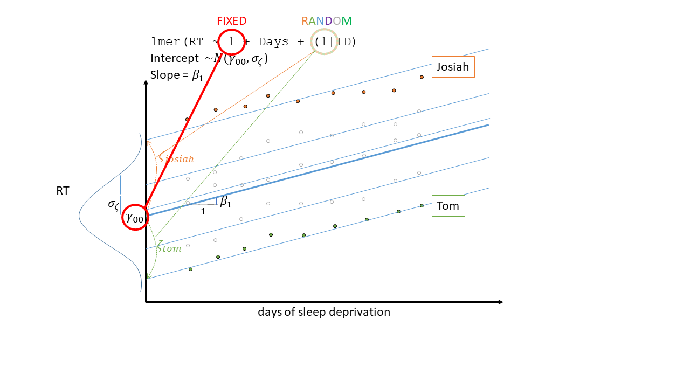
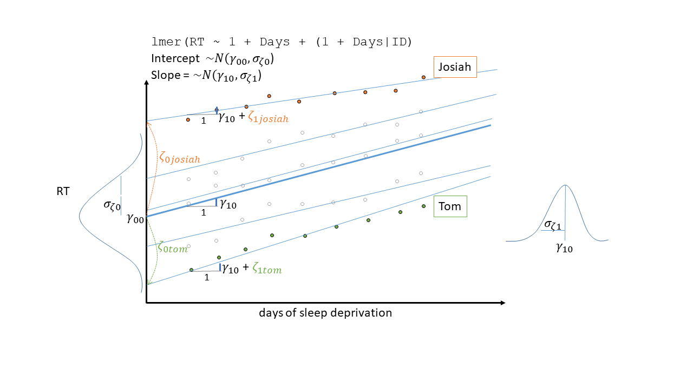

```{r setup, include=FALSE}
library(knitr)
library(tidyverse)
library(ggplot2)
library(kableExtra)
library(patchwork)
library(lme4)

options(htmltools.dir.version = FALSE)
options(digits=4,scipen=2)
options(knitr.table.format="html")

xaringanExtra::use_share_again()
xaringanExtra::use_xaringan_extra(c("tile_view","animate_css","tachyons"))
xaringanExtra::use_extra_styles(
  mute_unhighlighted_code = FALSE
)

knitr::opts_chunk$set(
  dev = "svg",
  warning = FALSE,
  message = FALSE,
  cache = TRUE,
  fig.asp=.8
)
theme_set(
    theme_minimal() + 
    theme(text = element_text(size=20))
)
source("jk_source/jk_presfuncs.R")

library(xaringanthemer)
style_mono_accent(
  base_color = "#88B04B", # DAPR3 
  header_color = "#000000",
  header_font_google = google_font("Source Sans Pro"),
  header_font_weight = 400,
  text_font_google = google_font("Source Sans Pro", "400", "400i", "600", "600i"),
  code_font_google = google_font("Source Code Pro"),
  code_font_size = "0.7rem",
  extra_css = list(".scroll-output" = list("height"="90%","overflow-y"="scroll"))
)
```

class: inverse, center, middle


<h2>Part 1: Back to the start</h2>
<h2 style="text-align: left;opacity:0.3;">Part 2: Centering Predictors</h2>
<h2 style="text-align: left;opacity:0.3;">Extra Slides (optional): GLMM</h2>  

<h2 style="text-align: left;">https://www.menti.com/al7vqejztmg1</h2>
<h2 style="text-align: left;">or menti.com code: 4669 8678</h2>

---
# Research Question

> **How do reaction times change with increasing sleep deprivation?** <span style="opacity:.4">An international study, in which institutions in 20 countries each studied 18 participants over 10 days. Information was also captured on two known predictors of reaction time - age, and whether or not participants regularly consume caffeine.</span>  


???
- so we have a straightforward research question.  
- how do reaction times change as days without sleep increases? - we're going to ignore the context right now, and just use this as a starting point for a broad view of what we've looked at so far in dapr3  

---
# lm: a line

```{r echo=FALSE, out.height="600px"}
knitr::include_graphics("jk_img_sandbox/rt_example/Slide1.PNG")
```

???
- our relationship is RT predicted by Days without sleep
- we can fit a simple regression model where we are estimating two parameters, an interept and slope  
- beta 0 is the intercept - the average RT at day 0
- beta 1 is the slope - the amount by which RT increases with every day of no sleep


---
# lm: a line (2)

```{r echo=FALSE, out.height="600px"}
knitr::include_graphics("jk_img_sandbox/rt_example/Slide13.PNG")
```

???
- this is fine if we have just measured a person with 2 days of no sleep, and another person with 5 days of no sleep, another with 3 days, etc.  
- because my reaction time is not dependent upon Tom's, or Emma's, or Umberto's etc. 

---
# lm: a line (3)

```{r echo=FALSE, out.height="600px"}
knitr::include_graphics("jk_img_sandbox/rt_example/Slide2.PNG")
```

???
- but instead, let's suppose our design involves measuring people over time. 
- for each person, we have measured their RT with 1 day of no sleep, 2 days of no sleep, etc.. 
- now all these observations from me are related to one another. they're all high because i have slow reaction times
- for tom, his are all low - i.e. quick.  


---
# lm: lines and differences between them

```{r echo=FALSE, out.height="600px"}
knitr::include_graphics("jk_img_sandbox/rt_example/Slide3.PNG")
```

???
- in week1 we saw how we might try and model the differences between people directly  
- we'd get out loads more coefficients for the differences between a set of things that we are not specifically interested in. 
- the coefficients are the estimated adjustments to get from Tom's RT to my RT
- we'd rather think of the variation in RT between me and Tom as just some random variation that would be different if the experiment we repeated (because you would have different participants rather than me and Tom).  

---
# lmer: lines with a distribution of intercepts

```{r echo=FALSE, out.height="600px"}
knitr::include_graphics("jk_img_sandbox/rt_example/Slide4.PNG")
```

???
- multilevel models allow us to think in that way  
- they allow us to have parts of our model, e.g. the intercept in this plot, as a distribution. 
- we have a fixed value around which peoples' own intercepts vary
- so the fixed value is here. to get to mine, we need to add a bit, because i'm slower than the average person
- to get to Tom's we subtract a bit, because he's faster than the average person

- and the model estimates this fixed value, and the standard deviation of people's differences from that value  

---
# lmer: lines with a distribution of intercepts (2)

```{r echo=FALSE, out.height="600px"}

```

???
- So our intercept now is the combination of a fixed intercept, and random people-level variance around that intercept.
- we can get out these specific bits for me, for Tom, but we think of our model as really being the estimated variance in all of these. 


---
# lmer: lines with a distribution of intercepts (3)

```{r echo=FALSE, out.height="600px"}
knitr::include_graphics("jk_img_sandbox/rt_example/Slide6.PNG")
```

???
- and this one the model is allowing for people do have different intercepts _only_. 
- Note they all have the same slope. 
- so the model thinks that my RT increases by some amount for every day of no sleep, and this is the same amount for Tom, and for everyone. 

---
# lmer: lines with a distribution of intercepts (4)

```{r echo=FALSE, out.height="600px"}
knitr::include_graphics("jk_img_sandbox/rt_example/Slide7.PNG")
```

???
- So we the association between RT and Days of no sleep is just one fixed number
- it's only in the fixed effects part of the model syntax

---
# lmer: and with a distribution of slopes

```{r echo=FALSE, out.height="600px"}
knitr::include_graphics("jk_img_sandbox/rt_example/Slide8.PNG")
```


???
- but it doesn't have to be.
- we can say that the association between RT and days of no sleep _also_ varies between people.  
- i can cope with no sleep, so my RT doesn't get that much slower
- Tom can't. he needs his sleep. his RT gets a lot slower as he has more days of no sleep  


---
# lmer: and with a distribution of slopes (2)

```{r echo=FALSE, out.height="600px"}

```

???
- and really, just like the intercept is now a distribution
- the slope is now a distribution.
  - there's an overall average slope
  - and people vary a bit around that. 
  - so Tom's RT goes up a lot more (he's above the average slope) - the T here
  - my RT doesn't go up as much - i'm below the average slope. the J here
  - and they are the little additions we make above the overall slope, in order to get to each persons own slope

---
# fixed and random

```{r echo=FALSE, out.height="600px"}
knitr::include_graphics("jk_img_sandbox/rt_example/Slide10.PNG")
```

???
- 95% of the time, research is interested in the fixed part. Describes the average group. 
  - Fixed effects estimates are the bits we test  
  - Random effects provide context

---
# nested: distributions of distributions 

```{r echo=FALSE, out.height="600px"}
knitr::include_graphics("jk_img_sandbox/rt_example/Slide11.PNG")
```

???
- we can extend the MLM approach to have more levels  
- so here we have some higher level grouping - Tom and I are both in Psychology, we also measured people in Linguistics, in Engineering, in Philosophy, etc.  
- around the overall average person from the average department
  - some departments have higher RT, some lower RT
  - psychology are really slow
  - engineering are really fast
- and _within_ those, people vary around the department 
  - i'm slower for psychology
  - Tom's quicker for psychology


---
# crossed: distributions and distributions

```{r echo=FALSE, out.height="600px"}
knitr::include_graphics("jk_img_sandbox/rt_example/Slide12.PNG")
```

???
- it's much harder to visualise the idea of crossed random effects in these figures, but i'm giving it a go  
- suppose we tested people's RT on lots of different tasks
  - the dropping & catching a ruler
  - pressing a button when they see a light
  - pressing a button when they hear a sound
  - etc
- we've got rid of the department stuff here, so no nesting. 
- in the coloured points you can see three tasks I did every day, and Tom did the same 3 tasks, etc. 
- we might expect these tasks to be vary in how quick people perform them. 
  - e.g. people press buttons quicker when they see a light vs hear a sound
  - pink task tend to be quick than the blue task. 
- we can model this variation as task-level differences, alongside person-level differences  
- intercept is now the RT for average person, on average task
  - to get to my estimated blue task intercept, we need to
  - add the "josiah is a slow person" bit
  - add the "blue task is a slow task" bit  

---
# https://www.menti.com/al7vqejztmg1

<div style='position: relative; padding-bottom: 56.25%; padding-top: 35px; height: 0; overflow: hidden;'><iframe sandbox='allow-scripts allow-same-origin allow-presentation' allowfullscreen='true' allowtransparency='true' frameborder='0' height='315' src='https://www.mentimeter.com/app/presentation/alp53d3no62krstg7ei7vp2tpixykaxe/ujrfj2ujz5fh/embed' style='position: absolute; top: 0; left: 0; width: 100%; height: 100%;' width='420'></iframe></div>
---
# model building 

> How do reaction times change with increasing sleep deprivation? An international study, in which institutions in 20 countries each studied 18 participants over 10 days. Information was also captured on two known predictors of reaction time - age, and whether or not participants regularly consume caffeine.

???
okay, let's return to our research question and design, so we can see this in action  
- note we don't have the multiple tasks here, and we also have countries not departments of the uni

---
# model building 

> How do reaction times change with increasing sleep deprivation? <span style="opacity:.4">An international study, in which institutions in 20 countries each studied 18 participants over 10 days.</span>Information was also captured on two known predictors of reaction time - age, and whether or not participants regularly consume caffeine.

<br><br>

- The research question tells us our fixed effects.  
- <span style="opacity:.4">The design tells us our grouping structure</span>
- <span style="opacity:.4">The random effects are additional levels of complexity that we _may_ be able to fit in order to better represent the world.</span>  

???
- so what are we interested in here? if you were to imagine this being a news headline, what part of it are we going to focus on
- READ
- reaction time and days of sleep deprivation  
- READ
- we are _also_ aware that there are things we _know_ contribute to reaction times, age and caffeine, and so we may want to control for those  

--

```{r eval=FALSE}
Reaction ~ Age + Caff + Days
```

???
which gives us something like this  


---
# model building 

> <span style="opacity:.4">How do reaction times change with increasing sleep deprivation?</span> An international study, in which institutions in 20 countries each studied 18 participants over 10 days.<span style="opacity:.4">Information was also captured on two known predictors of reaction time - age, and whether or not participants regularly consume caffeine.</span>

<br><br>

- The research question tells us our fixed effects.  
- The design tells us our grouping structure
- <span style="opacity:.4">The random effects are additional levels of complexity that we _may_ be able to fit in order to better represent the world.</span>  

```{r eval=FALSE}
Reaction ~ Age + Caff + Days + (_____ | Country/Subject)
```

???
- to decide _if_ and _what_ grouping structure we want to take into account, we need to know about the design
- READ
- we know each person is measured over 10 days
- so we have 10 datapoints for each person
- and the people in groups of 18 coming from 20 different countries  
- so we have people nested in countries


---
# model building 

> How do reaction times change with increasing sleep deprivation? An international study, in which institutions in 20 countries each studied 18 participants over 10 days. Information was also captured on two known predictors of reaction time - age, and whether or not participants regularly consume caffeine.

<br><br>

- The research question tells us our fixed effects.  
- The design tells us our grouping structure
- The random effects are additional levels of complexity that we _may_ be able to fit in order to better represent the world.

```{r eval=FALSE}
Reaction ~ Age + Caff + Days + (????? | Country/Subject)
```


???
- the last bit is really where the difficulty comes in
- what should we model as varying by these groups?  
- it's not a clear answer here. it depends on how much data we have, and how much variability there is in our data   
  
---
class: center, middle

# in RStudio...  

???
so let's have a go!  

---
# maximal structure

- everything that _can (theoretically)_ vary by grouping structure is modelled as doing so

```{r eval=FALSE}
Reaction ~ Age + Caff + Days + 
  (1 + Age + Caff + Days | Country) + 
  (1 + Days | Country:Subject)
```

- Simplify until model converges
  - Remember that you have a choice of optimizers (algorithms to try and find a converging model)
    ```{r eval=FALSE}
    control = lmerControl(optimizer = ???)
    ```


---
# how to simplify

Look for:

- Variances/standard deviations of 0 (or very small, e.g. `3.56e-05`)  
- Correlations of -1 or 1 

```{r eval=FALSE}
# to extract random effects
VarCorr(model)
```

- You might argue that random effects of focal predictors are more important than random effects of covariates  
- You will be faced with _subjective_ choices
  - which simplification can you most easily accept?  
  
---
# a note on random effect correlations

- If you remove a correlation between random effects, e.g.:

```{r eval=FALSE}
(1 + Days || Country)
```

- be sure that you're comfortable accepting this simplification

- try plotting the random effects from the model without the correlation. 
  - setting `(1 + Days || Country)` doesn't _prevent_ a correlation between the _estimated_ random effects.
  - it just tries to _describe_ the pattern with two **uncorrelated** distributions 
  
.pull-left[
Model Parameters
```{r echo=FALSE, fig.asp=.4}
fulldat <- read_csv("../../../data/countrysleep.csv")
m2 = lmer(Reaction ~ 1 + Days + 
           (1 + Days || Country),
         control=lmerControl(optimizer="bobyqa"), REML=TRUE,
         data = fulldat)
dd <- as.data.frame(ranef(m2)$Country)
sim = MASS::mvrnorm(n=1e5,mu=c(0,0), Sigma = diag(2) * as.data.frame(VarCorr(m2))[1:2,5]^2)
sim = as.data.frame(sim)
names(sim) = names(dd)

plotmod = ggplot(dd, aes(x=`(Intercept)`,y=Days))+
  #geom_point()+
  geom_density_2d(data=sim) + 
  xlim(-40,40) + ylim(-4,4)
plotran = ggplot(dd, aes(x=`(Intercept)`,y=Days))+
  geom_point()+
  xlim(-40,40) + ylim(-4,4)
ploti = ggplot(data=tibble(x=-40:40),aes(x=x))+
  stat_function(geom="line",fun=~dnorm(.x, mean=0,sd=as.data.frame(VarCorr(m2))[1,5]),lwd=1) + theme_void()
plots = ggplot(data=tibble(x=-4:4),aes(x=x))+
  stat_function(geom="line",fun=~dnorm(.x, mean=0,sd=as.data.frame(VarCorr(m2))[2,5]),lwd=1) +ylim(0,1) + coord_flip() + theme_void()
library(patchwork)
(ploti + plot_spacer()) / (plotmod + plots) +
  plot_layout(heights = c(1, 4),widths = c(1,1))
```
]
.pull-right[
Random effect estimates 
```{r echo=FALSE, fig.asp=.4}
(plot_spacer() + plot_spacer()) / (plotran + plot_spacer()) +
  plot_layout(heights = c(1, 4),widths = c(1,1))
```

]

---
# a note on random effect correlations (2)

- If you remove a correlation between random effects, e.g.:

```{r eval=FALSE}
(1 + Days || Country)
```

- be sure that you're comfortable accepting this simplification

- try plotting the individual cluster `lm()` lines  
  
.pull-left[
Individual `lm()` for each cluster:  
```{r fig.asp=.3}
ggplot(fulldat, aes(x=Days,y=Reaction,group=Country))+
  geom_smooth(method=lm,se=F)
```
]

---
# Summary

- think of the multilevel model `lmer()` as an extension of the simple linear model `lm()`  

- the multilevel model allow us to let parts of our model _vary by_ some grouping.  

  - i.e. different intercepts and/or slopes for each group
  
- the most straightforward approach to building these models: 

  1. start with most complex model  
  2. simplify until the model converges  


---
class: inverse, center, middle

# End